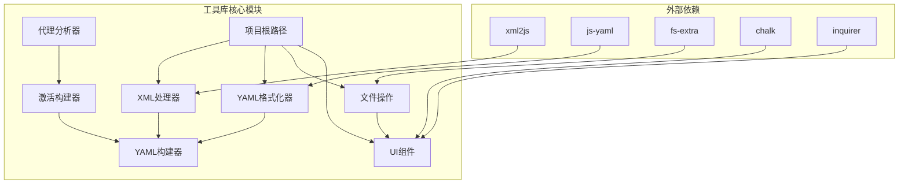
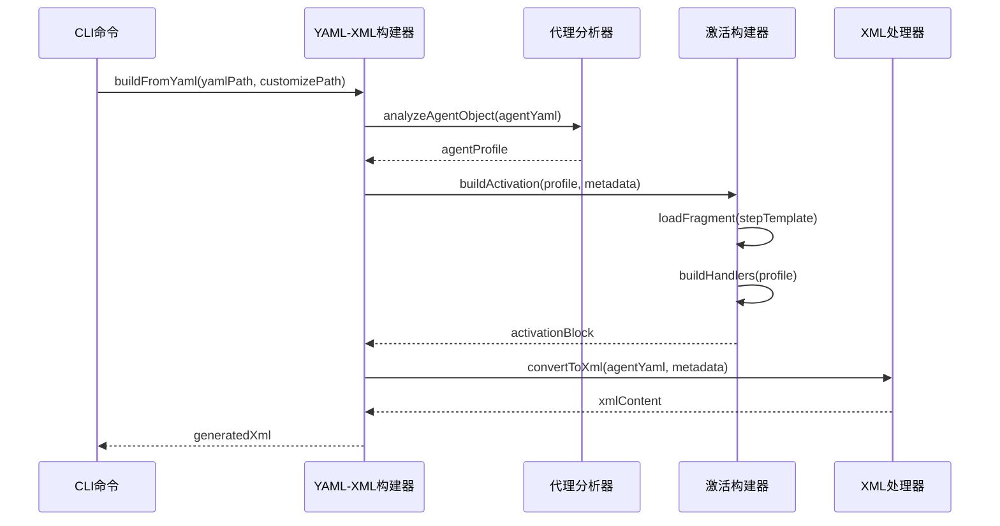
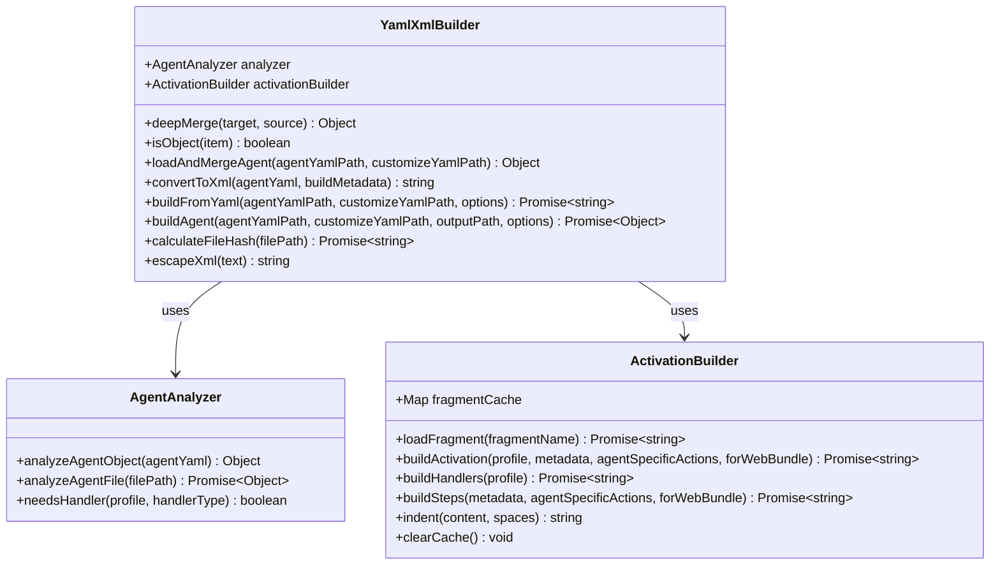
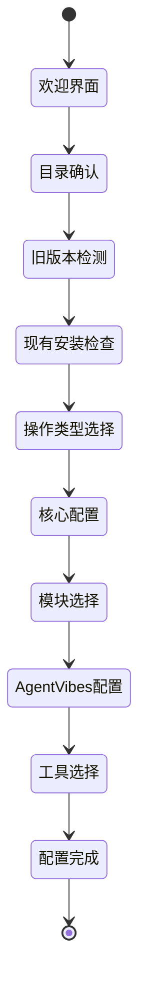
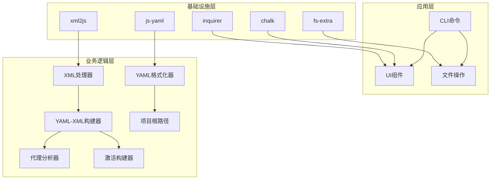

# 工具库

<cite>
**本文档中引用的文件**
- [xml-handler.js](file://tools/cli/lib/xml-handler.js)
- [yaml-format.js](file://tools/cli/lib/yaml-format.js)
- [yaml-xml-builder.js](file://tools/cli/lib/yaml-xml-builder.js)
- [xml-to-markdown.js](file://tools/cli/lib/xml-to-markdown.js)
- [file-ops.js](file://tools/cli/lib/file-ops.js)
- [ui.js](file://tools/cli/lib/ui.js)
- [cli-utils.js](file://tools/cli/lib/cli-utils.js)
- [activation-builder.js](file://tools/cli/lib/activation-builder.js)
- [agent-analyzer.js](file://tools/cli/lib/agent-analyzer.js)
- [project-root.js](file://tools/cli/lib/project-root.js)
- [pm.agent.yaml](file://src/modules/bmm/agents/pm.agent.yaml)
- [architect.agent.yaml](file://src/modules/bmm/agents/architect.agent.yaml)
</cite>

## 目录
1. [简介](#简介)
2. [项目结构](#项目结构)
3. [核心组件](#核心组件)
4. [架构概览](#架构概览)
5. [详细组件分析](#详细组件分析)
6. [依赖关系分析](#依赖关系分析)
7. [性能考虑](#性能考虑)
8. [故障排除指南](#故障排除指南)
9. [结论](#结论)

## 简介

BMAD-METHOD工具库是一个功能强大的开发工具集，专为业务模型敏捷开发方法设计。该工具库提供了XML处理器、YAML格式化器、文件操作工具、CLI实用工具和UI组件等核心功能模块。这些工具协同工作，支持从YAML代理定义到XML格式转换的完整开发流程，同时提供用户友好的命令行界面和自动化安装程序。

工具库采用模块化设计，支持多种输入格式（YAML、XML）和输出格式（Markdown、XML），并具备智能激活块注入、代码块格式化、文件同步等功能。通过统一的API接口，开发者可以轻松集成各种开发任务，提高开发效率和代码质量。

## 项目结构

BMAD-METHOD工具库位于`tools/cli/lib/`目录下，包含以下主要模块：



**图表来源**
- [xml-handler.js](file://tools/cli/lib/xml-handler.js#L1-L40)
- [yaml-format.js](file://tools/cli/lib/yaml-format.js#L1-L10)
- [file-ops.js](file://tools/cli/lib/file-ops.js#L1-L10)

**章节来源**
- [xml-handler.js](file://tools/cli/lib/xml-handler.js#L1-L230)
- [yaml-format.js](file://tools/cli/lib/yaml-format.js#L1-L248)

## 核心组件

### XML处理器 (XmlHandler)

XML处理器是工具库的核心组件之一，负责处理XML格式的代理文件和激活模板。它支持两种处理模式：基于解析器的复杂XML操作和基于字符串的简单注入。

#### 主要功能
- **激活模板加载**：从预定义模板中加载激活块结构
- **XML解析与构建**：使用xml2js库进行XML格式转换
- **智能注入**：根据代理类型自动选择合适的注入策略
- **格式化支持**：保持XML文件的美观格式

#### 配置选项
- **解析器配置**：保留子节点顺序、显式数组处理、标签规范化
- **构建器配置**：美化输出、缩进设置、编码格式
- **元数据支持**：模块信息、文件哈希、构建版本

### YAML格式化器 (YamlFormatter)

YAML格式化器提供强大的YAML文件处理能力，支持语法检查、自动修复和格式化功能。

#### 核心特性
- **语法验证**：实时检测YAML语法错误
- **自动修复**：智能修复常见的YAML格式问题
- **代码块处理**：支持Markdown中的YAML代码块
- **批量处理**：支持glob模式的文件批量操作

#### 自动修复规则
- 移除多余的空格：`commands :` → `commands:`
- 统一列表缩进：`-   item` → `- item`
- 引用特殊字符：`- value with :` → `"- value with :"`

**章节来源**
- [xml-handler.js](file://tools/cli/lib/xml-handler.js#L1-L230)
- [yaml-format.js](file://tools/cli/lib/yaml-format.js#L1-L248)

## 架构概览

工具库采用分层架构设计，各组件之间通过明确定义的接口进行通信：



**图表来源**
- [yaml-xml-builder.js](file://tools/cli/lib/yaml-xml-builder.js#L193-L217)
- [activation-builder.js](file://tools/cli/lib/activation-builder.js#L44-L74)
- [agent-analyzer.js](file://tools/cli/lib/agent-analyzer.js#L13-L84)

## 详细组件分析

### YAML-XML构建器 (YamlXmlBuilder)

YAML-XML构建器是工具库的核心转换引擎，负责将YAML格式的代理定义转换为XML格式。

#### 类图结构



**图表来源**
- [yaml-xml-builder.js](file://tools/cli/lib/yaml-xml-builder.js#L11-L15)
- [agent-analyzer.js](file://tools/cli/lib/agent-analyzer.js#L7-L11)
- [activation-builder.js](file://tools/cli/lib/activation-builder.js#L8-L12)

#### 转换流程

YAML-XML构建器按照以下步骤处理代理文件：

1. **YAML解析**：使用js-yaml解析代理定义
2. **合并配置**：合并基础代理和自定义配置
3. **代理分析**：分析代理特性以确定所需处理器
4. **激活构建**：生成激活块和菜单处理器
5. **XML转换**：构建最终的XML格式

#### 输出格式选项

| 输出类型 | 描述 | 使用场景 |
|---------|------|----------|
| 安装格式 | 包含YAML frontmatter和指令 | IDE安装和本地开发 |
| Web Bundle格式 | 简化的Markdown格式 | 在线部署和分享 |
| 元数据注释 | 构建跟踪信息 | 版本控制和调试 |

**章节来源**
- [yaml-xml-builder.js](file://tools/cli/lib/yaml-xml-builder.js#L193-L607)

### XML转换器 (XmlToMarkdown)

XML转换器提供XML到Markdown的转换功能，主要用于文档生成和格式化。

#### 转换算法

```mermaid
flowchart TD
A[读取XML文件] --> B[提取根元素属性]
B --> C{检查版本信息}
C --> |有版本| D[生成标题 v{version}]
C --> |无版本| E[生成标题]
D --> F[包装XML内容]
E --> F
F --> G[写入Markdown文件]
G --> H[返回文件路径]
```

**图表来源**
- [xml-to-markdown.js](file://tools/cli/lib/xml-to-markdown.js#L4-L51)

#### 支持的XML结构
- **根元素属性**：提取name和version属性
- **内容处理**：保持原始XML结构不变
- **文件命名**：基于原文件名生成.md扩展名

**章节来源**
- [xml-to-markdown.js](file://tools/cli/lib/xml-to-markdown.js#L1-L83)

### 文件操作工具 (FileOps)

文件操作工具提供全面的文件系统操作功能，支持复杂的文件管理和同步任务。

#### 核心功能表

| 功能 | 方法 | 描述 | 参数 |
|------|------|------|------|
| 目录复制 | copyDirectory | 递归复制目录 | source, dest, options |
| 同步更新 | syncDirectory | 选择性同步文件 | source, dest |
| 文件列表 | getFileList | 获取目录文件列表 | dir |
| 哈希计算 | getFileHash | 计算文件SHA256哈希 | filePath |
| 忽略过滤 | shouldIgnore | 检查是否应忽略文件 | filePath |

#### 同步策略

文件同步采用智能比较策略：
- **完整性检查**：基于文件哈希值比较
- **时间戳比较**：源文件较新时更新
- **用户修改保护**：保留用户手动修改的文件

**章节来源**
- [file-ops.js](file://tools/cli/lib/file-ops.js#L1-L205)

### 用户界面组件 (UI)

用户界面组件提供交互式的安装向导和配置收集功能。

#### 安装流程



**图表来源**
- [ui.js](file://tools/cli/lib/ui.js#L38-L142)

#### 交互功能

- **进度显示**：实时显示安装进度
- **错误处理**：优雅的错误恢复机制
- **确认提示**：关键操作前的用户确认
- **帮助信息**：丰富的上下文帮助文本

**章节来源**
- [ui.js](file://tools/cli/lib/ui.js#L1-L804)

### CLI工具集 (CLIUtils)

CLI工具集提供统一的命令行界面支持，包括格式化输出、进度指示和错误报告。

#### 工具功能

| 功能 | 方法 | 用途 |
|------|------|------|
| 版本信息 | getVersion() | 获取当前版本号 |
| 显示标志 | displayLogo() | 显示BMAD标志 |
| 分段标题 | displaySection() | 创建分段标题 |
| 信息框 | displayBox() | 显示格式化信息 |
| 错误消息 | displayError() | 显示错误信息 |
| 完成消息 | displayComplete() | 显示完成状态 |

**章节来源**
- [cli-utils.js](file://tools/cli/lib/cli-utils.js#L1-L211)

## 依赖关系分析

工具库的依赖关系呈现清晰的层次结构：



**图表来源**
- [yaml-xml-builder.js](file://tools/cli/lib/yaml-xml-builder.js#L1-L10)
- [xml-handler.js](file://tools/cli/lib/xml-handler.js#L1-L10)

### 外部依赖管理

工具库依赖以下关键包：
- **xml2js**：XML解析和构建
- **js-yaml**：YAML处理
- **fs-extra**：增强的文件系统操作
- **chalk**：终端颜色输出
- **inquirer**：交互式命令行界面

**章节来源**
- [yaml-xml-builder.js](file://tools/cli/lib/yaml-xml-builder.js#L1-L10)
- [xml-handler.js](file://tools/cli/lib/xml-handler.js#L1-L10)

## 性能考虑

### 内存优化策略

工具库采用多种内存优化技术：
- **缓存机制**：Fragment缓存减少重复读取
- **流式处理**：大文件采用流式读取
- **延迟加载**：按需加载模块和资源

### 并发处理

对于批量操作，工具库支持：
- **异步处理**：所有I/O操作采用异步模式
- **并发限制**：合理控制并发数量避免资源耗尽
- **进度反馈**：长时间操作提供进度指示

### 缓存策略

- **Fragment缓存**：激活构建器使用Map缓存XML片段
- **文件哈希缓存**：文件操作工具缓存计算结果
- **项目根路径缓存**：避免重复路径查找

## 故障排除指南

### 常见问题及解决方案

#### YAML格式错误
**症状**：YAML格式化器报语法错误
**解决方案**：
1. 检查缩进一致性
2. 验证冒号后的空格
3. 确认引号使用正确

#### XML构建失败
**症状**：YAML-XML构建器抛出异常
**解决方案**：
1. 验证代理定义的完整性
2. 检查必需字段是否存在
3. 确认路径变量正确解析

#### 文件权限问题
**症状**：文件操作失败
**解决方案**：
1. 检查目标目录写权限
2. 确认文件不存在冲突
3. 验证磁盘空间充足

### 调试技巧

- **启用详细日志**：设置环境变量增加输出信息
- **分步测试**：单独测试各个组件功能
- **验证输入**：确保输入数据符合预期格式

**章节来源**
- [yaml-format.js](file://tools/cli/lib/yaml-format.js#L69-L73)
- [yaml-xml-builder.js](file://tools/cli/lib/yaml-xml-builder.js#L213-L216)

## 结论

BMAD-METHOD工具库提供了一套完整而强大的开发工具集，涵盖了从YAML定义到XML部署的整个开发流程。通过模块化设计和清晰的接口分离，工具库实现了高内聚低耦合的架构目标。

### 主要优势

1. **多格式支持**：统一处理YAML、XML、Markdown等多种格式
2. **智能转换**：自动识别和处理不同类型的代理定义
3. **用户友好**：提供直观的命令行界面和详细的错误信息
4. **可扩展性**：模块化设计便于添加新的功能和处理器

### 最佳实践建议

- **版本控制**：对代理定义文件进行版本控制
- **定期清理**：使用文件同步功能保持项目整洁
- **错误监控**：建立完善的错误处理和日志记录机制
- **性能优化**：合理使用缓存和异步处理提升性能

工具库的设计充分体现了BMAD方法论的灵活性和适应性，为开发者提供了一个可靠、高效的开发环境。通过持续的优化和扩展，工具库将继续为BMAD生态系统的发展提供强有力的支持。