# 代理安装器

<cite>
**本文档中引用的文件**
- [install-config.yaml](file://src/core/_module-installer/install-config.yaml)
- [installer.js](file://src/core/_module-installer/installer.js)
- [install.js](file://tools/cli/commands/install.js)
- [agent-install.js](file://tools/cli/commands/agent-install.js)
- [installer.js](file://tools/cli/installers/lib/core/installer.js)
- [config-collector.js](file://tools/cli/installers/lib/core/config-collector.js)
- [dependency-resolver.js](file://tools/cli/installers/lib/core/dependency-resolver.js)
- [manager.js](file://tools/cli/installers/lib/ide/manager.js)
- [manager.js](file://tools/cli/installers/lib/modules/manager.js)
- [claude-code.js](file://tools/cli/installers/lib/ide/claude-code.js)
- [windsurf.js](file://tools/cli/installers/lib/ide/windsurf.js)
- [installer.js](file://tools/cli/installers/lib/ide/claude-code.js)
- [installer.js](file://tools/cli/installers/lib/ide/windsurf.js)
- [installer.js](file://tools/cli/lib/agent/installer.js)
- [compiler.js](file://tools/cli/lib/agent/compiler.js)
</cite>

## 目录
1. [简介](#简介)
2. [项目结构](#项目结构)
3. [核心组件](#核心组件)
4. [架构概览](#架构概览)
5. [详细组件分析](#详细组件分析)
6. [依赖分析](#依赖分析)
7. [性能考虑](#性能考虑)
8. [故障排除指南](#故障排除指南)
9. [结论](#结论)

## 简介

BMAD-METHOD框架的代理安装器是一个复杂而强大的系统，负责管理整个BMAD代理生态系统的安装、配置和集成过程。该系统不仅处理核心模块的安装，还支持多种IDE平台的特定配置，包括Claude Code、Windsurf等现代开发工具。

安装器的核心目标是：
- 提供原子性的安装体验，确保安装过程的可靠性和可逆性
- 支持跨平台部署，适配不同的开发环境
- 实现智能的依赖解析和模块注入
- 维护配置的一致性和版本兼容性

## 项目结构

BMAD-METHOD的安装器系统采用分层架构设计，主要分为以下几个层次：

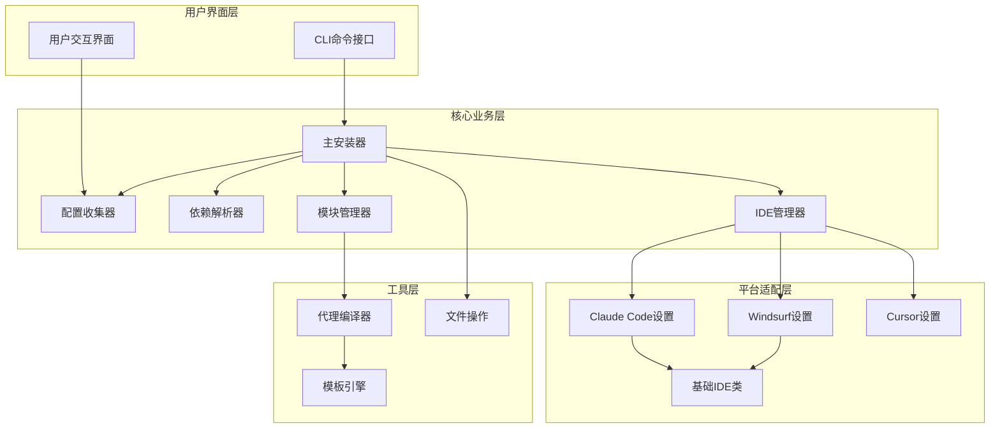

**图表来源**
- [install.js](file://tools/cli/commands/install.js#L1-L125)
- [installer.js](file://tools/cli/installers/lib/core/installer.js#L1-L800)
- [manager.js](file://tools/cli/installers/lib/ide/manager.js#L1-L245)

**章节来源**
- [install.js](file://tools/cli/commands/install.js#L1-L125)
- [installer.js](file://tools/cli/installers/lib/core/installer.js#L1-L800)

## 核心组件

### 主安装器 (Main Installer)

主安装器是整个安装系统的核心协调者，负责 orchestrate 整个安装流程。它继承自基础安装器类，提供了完整的安装功能。

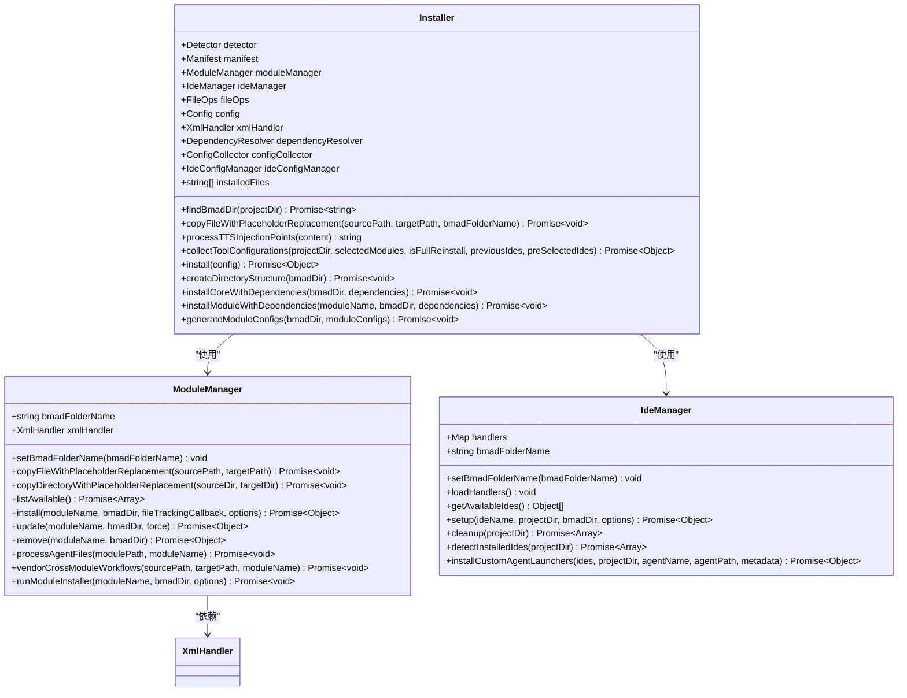

**图表来源**
- [installer.js](file://tools/cli/installers/lib/core/installer.js#L41-L800)
- [manager.js](file://tools/cli/installers/lib/modules/manager.js#L24-L775)
- [manager.js](file://tools/cli/installers/lib/ide/manager.js#L9-L245)

### 配置收集器 (Config Collector)

配置收集器负责从用户输入和现有配置中收集所有必要的安装参数，支持增量更新和完全重装两种模式。

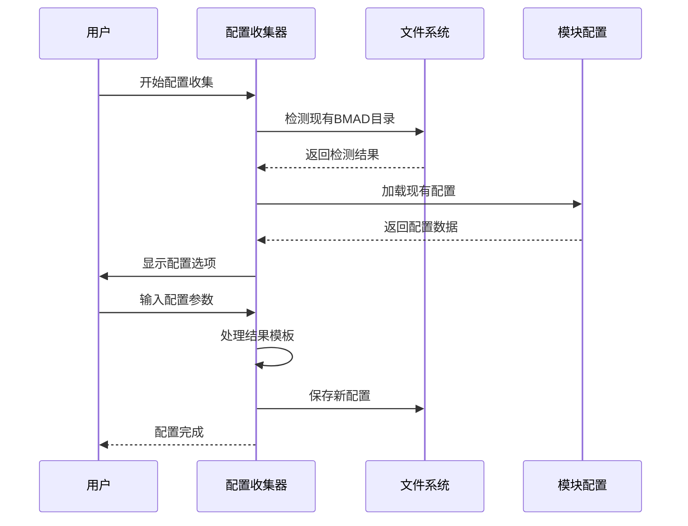

**图表来源**
- [config-collector.js](file://tools/cli/installers/lib/core/config-collector.js#L1-L800)

**章节来源**
- [config-collector.js](file://tools/cli/installers/lib/core/config-collector.js#L1-L800)

## 架构概览

BMAD-METHOD的安装器采用模块化架构，支持插件式的IDE扩展和灵活的配置管理。

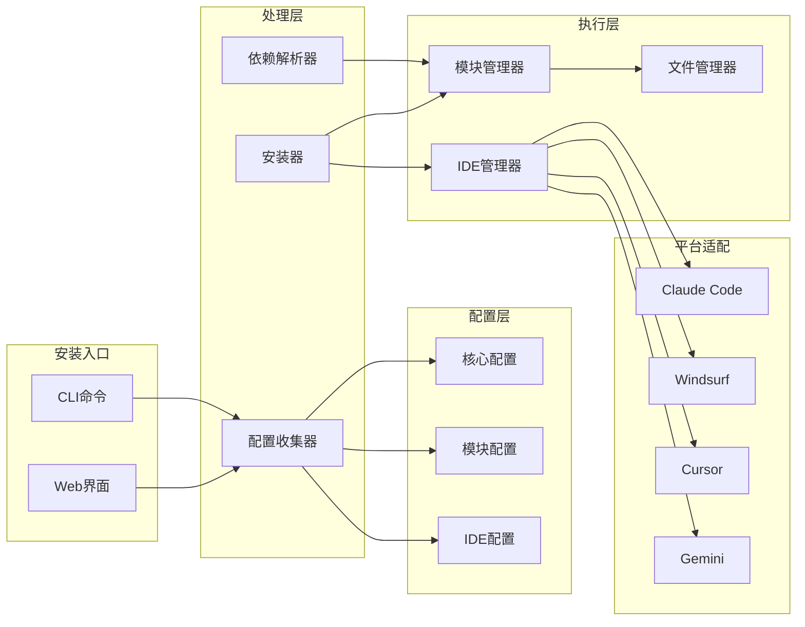

**图表来源**
- [installer.js](file://tools/cli/installers/lib/core/installer.js#L41-L100)
- [manager.js](file://tools/cli/installers/lib/ide/manager.js#L30-L80)

## 详细组件分析

### 安装流程阶段

安装器遵循严格的阶段化流程，确保每个步骤的原子性和一致性：

#### 1. 配置收集阶段

配置收集阶段是安装过程的第一步，负责收集所有必要的安装参数：

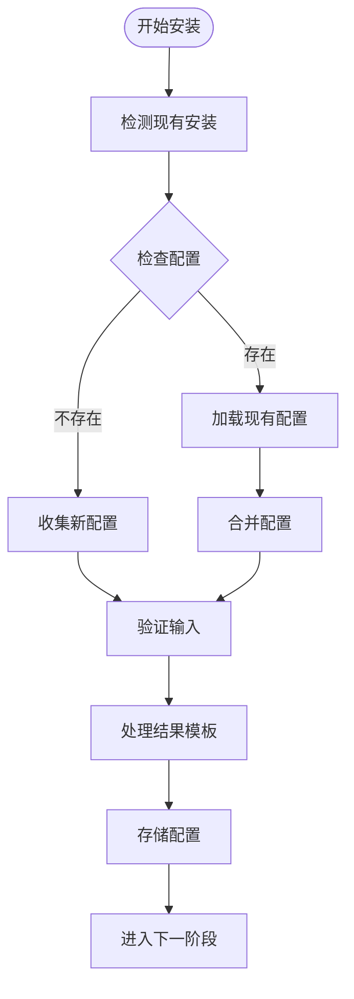

**图表来源**
- [config-collector.js](file://tools/cli/installers/lib/core/config-collector.js#L136-L200)

#### 2. 依赖解析阶段

依赖解析器分析模块间的依赖关系，确保所有必需的文件都被正确包含：

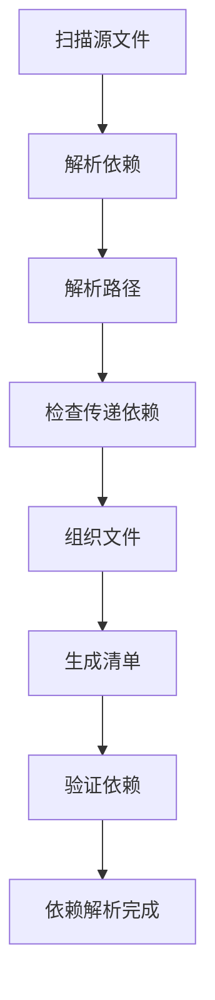

**图表来源**
- [dependency-resolver.js](file://tools/cli/installers/lib/core/dependency-resolver.js#L25-L100)

#### 3. 模块安装阶段

模块安装器负责将源代码复制到目标位置，并进行必要的转换：

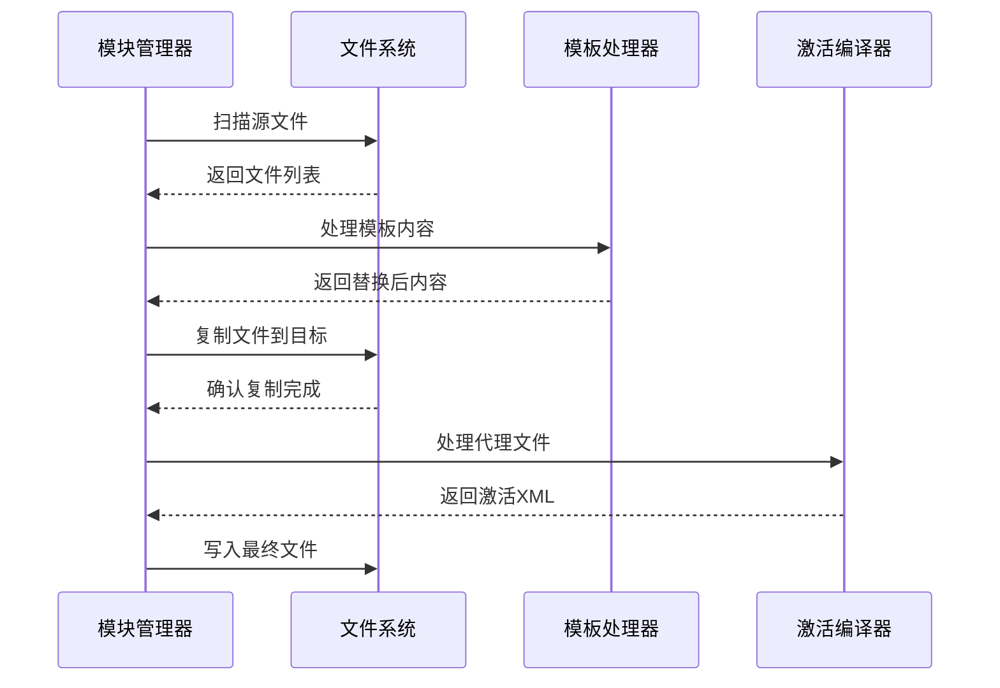

**图表来源**
- [manager.js](file://tools/cli/installers/lib/modules/manager.js#L154-L200)

#### 4. IDE集成阶段

IDE管理器为不同的开发环境提供特定的配置：

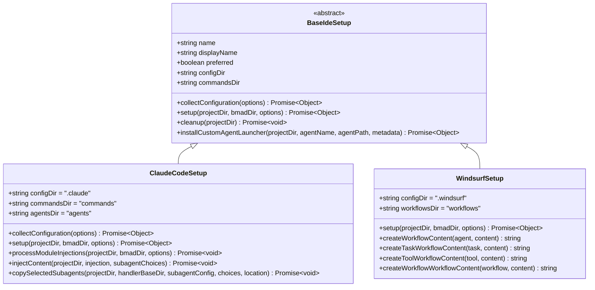

**图表来源**
- [claude-code.js](file://tools/cli/installers/lib/ide/claude-code.js#L20-L100)
- [windsurf.js](file://tools/cli/installers/lib/ide/windsurf.js#L9-L50)

**章节来源**
- [installer.js](file://tools/cli/installers/lib/core/installer.js#L383-L800)
- [manager.js](file://tools/cli/installers/lib/modules/manager.js#L154-L300)

### 代理安装系统

代理安装器专门处理自定义代理的安装和编译过程：

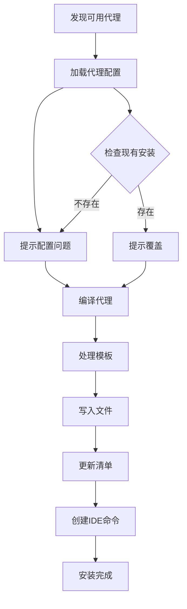

**图表来源**
- [agent-install.js](file://tools/cli/commands/agent-install.js#L28-L100)
- [installer.js](file://tools/cli/lib/agent/installer.js#L1-L200)

**章节来源**
- [agent-install.js](file://tools/cli/commands/agent-install.js#L1-L410)
- [installer.js](file://tools/cli/lib/agent/installer.js#L1-L736)

### 编译器系统

代理编译器将YAML格式的代理配置转换为最终的XML格式：

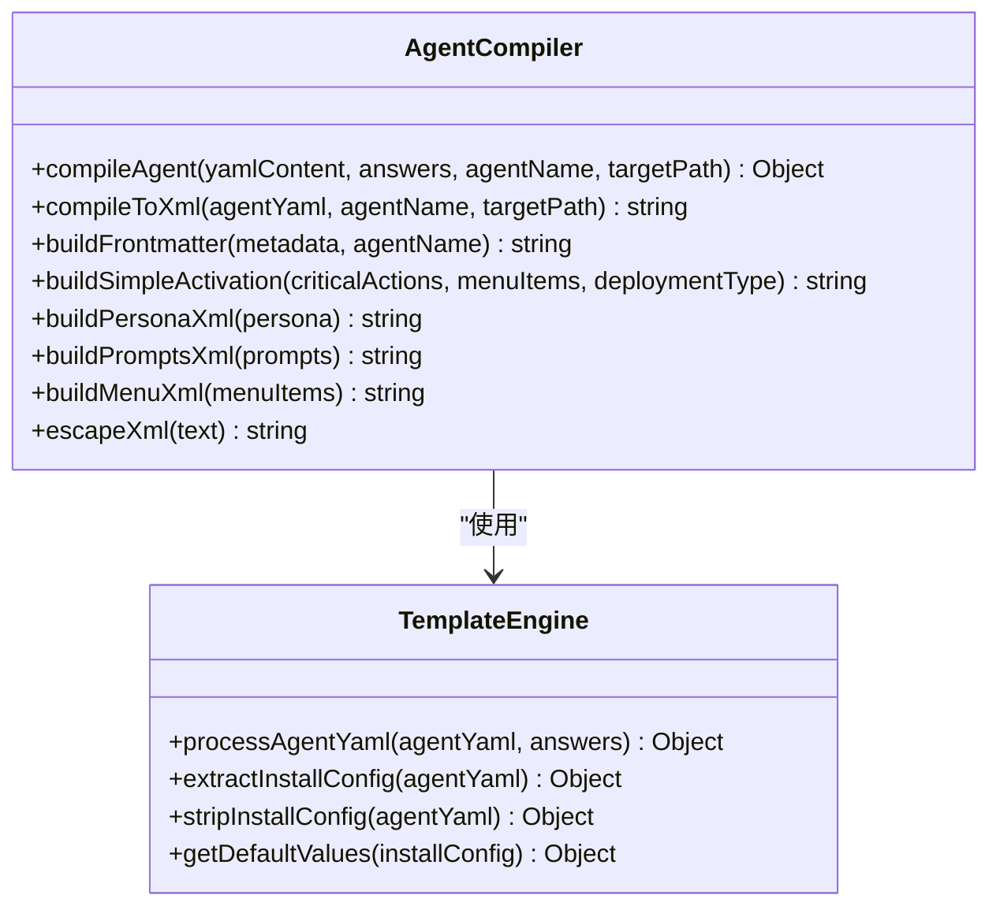

**图表来源**
- [compiler.js](file://tools/cli/lib/agent/compiler.js#L1-L100)

**章节来源**
- [compiler.js](file://tools/cli/lib/agent/compiler.js#L1-L525)

## 依赖分析

安装器系统的依赖关系体现了清晰的分层架构：

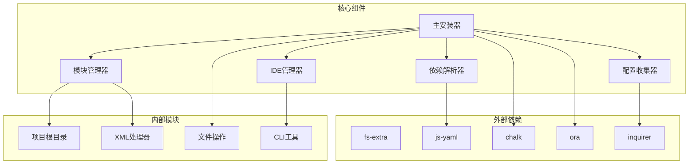

**图表来源**
- [installer.js](file://tools/cli/installers/lib/core/installer.js#L20-L40)

**章节来源**
- [installer.js](file://tools/cli/installers/lib/core/installer.js#L20-L40)
- [manager.js](file://tools/cli/installers/lib/modules/manager.js#L1-L20)

## 性能考虑

### 缓存机制

安装器实现了多层缓存策略以提高性能：

1. **文件系统缓存**：避免重复读取相同的文件
2. **配置缓存**：缓存已解析的配置对象
3. **依赖缓存**：缓存依赖解析结果

### 并发处理

对于大型项目的安装，系统支持并发处理：

```javascript
// 示例：并发安装多个模块
const installPromises = modules.map(moduleName => 
  this.installModuleWithDependencies(moduleName, bmadDir, dependencies)
);

await Promise.all(installPromises);
```

### 内存优化

- 使用流式处理大文件
- 及时释放不再需要的内存
- 分批处理大量数据

## 故障排除指南

### 常见错误场景

#### 1. 权限不足

```bash
# 错误信息
Error: EACCES: permission denied

# 解决方案
sudo chown -R $(whoami) ~/.bmad
chmod -R 755 ~/.bmad
```

#### 2. 依赖缺失

```bash
# 检查依赖完整性
npm install --save-dev fs-extra js-yaml chalk ora inquirer

# 清理并重新安装
rm -rf node_modules package-lock.json
npm install
```

#### 3. 配置冲突

```bash
# 备份当前配置
cp ~/.bmad/_cfg/manifest.yaml ~/.bmad/_cfg/manifest.yaml.backup

# 重新初始化配置
npm run install -- --force
```

### 调试模式

启用详细日志记录：

```bash
# 启用调试模式
DEBUG=bmad:installer npm run install

# 查看安装历史
cat ~/.bmad/_cfg/installation.log
```

**章节来源**
- [installer.js](file://tools/cli/installers/lib/core/installer.js#L500-L600)

## 结论

BMAD-METHOD的代理安装器是一个设计精良、功能完备的系统，它成功地解决了现代软件开发中复杂的安装和配置挑战。通过模块化的架构设计、智能的依赖管理和灵活的平台适配能力，该系统为开发者提供了一个可靠、高效的代理安装解决方案。

### 主要优势

1. **原子性安装**：每个安装步骤都是原子性的，确保系统状态的一致性
2. **平台无关性**：支持多种开发环境和IDE平台
3. **可扩展性**：模块化设计便于添加新的平台支持
4. **容错性**：完善的错误处理和恢复机制
5. **性能优化**：多层次缓存和并发处理

### 未来发展方向

1. **云原生支持**：增强对容器化和云部署的支持
2. **AI辅助配置**：利用机器学习优化配置推荐
3. **实时监控**：添加安装过程的实时监控和报告功能
4. **社区生态系统**：建立更完善的第三方插件生态系统

这个安装器系统不仅展示了现代软件工程的最佳实践，也为其他类似项目提供了宝贵的参考价值。