# 代理管理API详细文档

<cite>
**本文档引用的文件**
- [installer.js](file://tools/cli/installers/lib/core/installer.js)
- [compiler.js](file://tools/cli/lib/agent/compiler.js)
- [template-engine.js](file://tools/cli/lib/agent/template-engine.js)
- [agent-installer.js](file://tools/cli/lib/agent/installer.js)
- [detector.js](file://tools/cli/installers/lib/core/detector.js)
- [dependency-resolver.js](file://tools/cli/installers/lib/core/dependency-resolver.js)
- [manifest-generator.js](file://tools/cli/installers/lib/core/manifest-generator.js)
- [manifest.js](file://tools/cli/installers/lib/core/manifest.js)
- [ide-config-manager.js](file://tools/cli/installers/lib/core/ide-config-manager.js)
- [commit-poet.agent.yaml](file://custom/src/agents/commit-poet/commit-poet.agent.yaml)
- [analyst.agent.yaml](file://src/modules/bmm/agents/analyst.agent.yaml)
</cite>

## 目录
1. [简介](#简介)
2. [项目架构概览](#项目架构概览)
3. [代理安装器系统](#代理安装器系统)
4. [编译器核心机制](#编译器核心机制)
5. [模板引擎处理逻辑](#模板引擎处理逻辑)
6. [依赖解析与管理](#依赖解析与管理)
7. [配置管理系统](#配置管理系统)
8. [错误处理与安全机制](#错误处理与安全机制)
9. [性能优化策略](#性能优化策略)
10. [实际使用示例](#实际使用示例)
11. [故障排除指南](#故障排除指南)
12. [总结](#总结)

## 简介

BMAD（Business Model Agile Development）代理管理系统是一个高度模块化的AI代理框架，提供了完整的代理生命周期管理功能。该系统包含三个核心组件：代理安装器负责部署和配置，编译器负责YAML到XML的转换，模板引擎负责动态内容生成。这些组件协同工作，为开发者提供了强大的代理定制和部署能力。

## 项目架构概览

BMAD代理管理系统采用分层架构设计，确保各组件职责清晰、耦合度低：

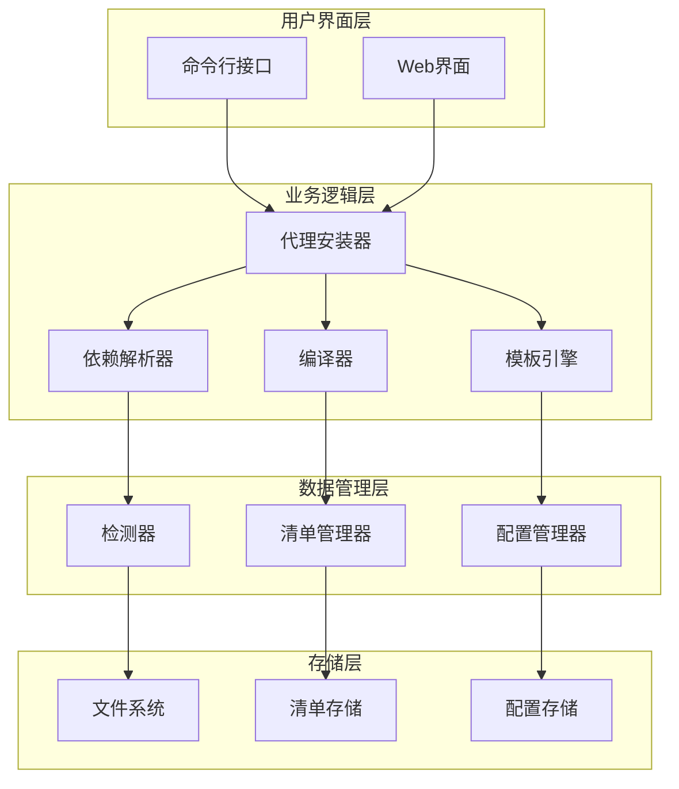

**图表来源**
- [installer.js](file://tools/cli/installers/lib/core/installer.js#L41-L53)
- [compiler.js](file://tools/cli/lib/agent/compiler.js#L1-L20)
- [template-engine.js](file://tools/cli/lib/agent/template-engine.js#L1-L10)

**章节来源**
- [installer.js](file://tools/cli/installers/lib/core/installer.js#L41-L80)
- [compiler.js](file://tools/cli/lib/agent/compiler.js#L1-L50)

## 代理安装器系统

### 核心安装器架构

代理安装器是BMAD系统的核心组件，负责整个代理的部署和配置过程。它采用模块化设计，支持多种安装场景：

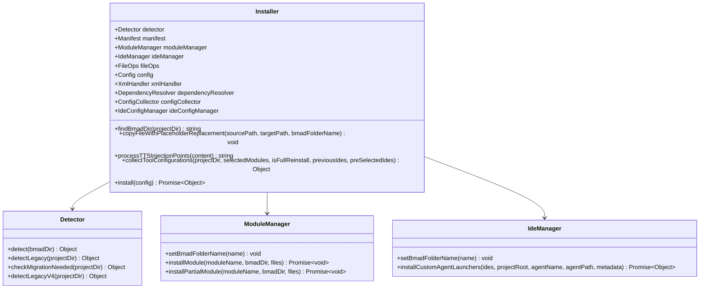

**图表来源**
- [installer.js](file://tools/cli/installers/lib/core/installer.js#L41-L53)
- [detector.js](file://tools/cli/installers/lib/core/detector.js#L6-L15)

### 安装流程详解

安装器遵循严格的流程控制，确保安装过程的可靠性和一致性：

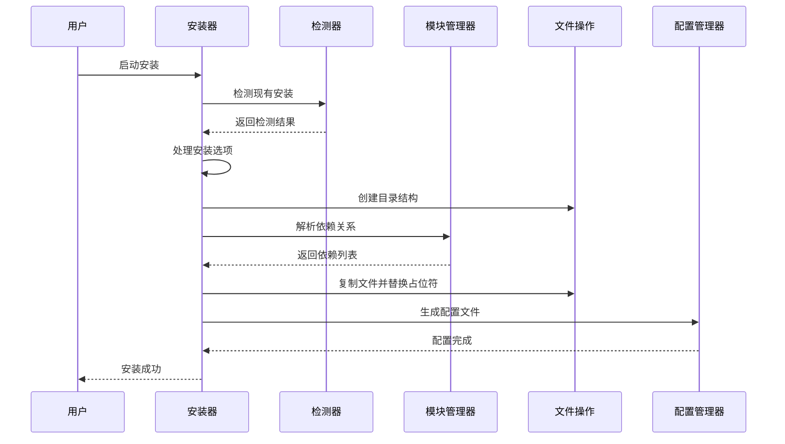

**图表来源**
- [installer.js](file://tools/cli/installers/lib/core/installer.js#L383-L450)
- [detector.js](file://tools/cli/installers/lib/core/detector.js#L12-L40)

### 占位符替换机制

安装器实现了智能的占位符替换机制，支持动态内容转换：

| 占位符类型 | 描述 | 示例 | 替换规则 |
|------------|------|------|----------|
| `{bmad_folder}` | BMAD安装目录名称 | `{bmad_folder}` → `bmad` | 用户自定义名称替换 |
| `{project-root}` | 项目根目录路径 | `{project-root}/file` | 相对路径解析 |
| 注入点标记 | TTS集成标记 | `<!-- TTS_INJECTION:feature -->` | 条件性代码注入 |

**章节来源**
- [installer.js](file://tools/cli/installers/lib/core/installer.js#L92-L158)

## 编译器核心机制

### YAML到XML转换流程

编译器是BMAD系统的核心转换引擎，负责将人类可读的YAML格式代理定义转换为高效的XML格式：

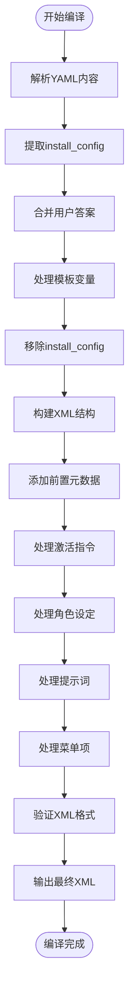

**图表来源**
- [compiler.js](file://tools/cli/lib/agent/compiler.js#L436-L482)

### 编译器核心功能

编译器提供了完整的XML生成流水线：

| 功能模块 | 职责 | 输入 | 输出 |
|----------|------|------|------|
| 前置元数据构建 | 生成Markdown前置元数据 | 元数据对象、代理名称 | 前置元数据字符串 |
| 激活指令构建 | 生成代理激活规则 | 关键动作、菜单项、部署类型 | XML激活块 |
| 角色设定处理 | 构建代理人格描述 | 人物角色对象 | XML persona部分 |
| 提示词处理 | 处理对话提示词 | 提示词数组 | XML prompts部分 |
| 菜单项处理 | 处理交互菜单 | 菜单项数组 | XML menu部分 |

### 模板语法处理

编译器集成了强大的模板处理能力：

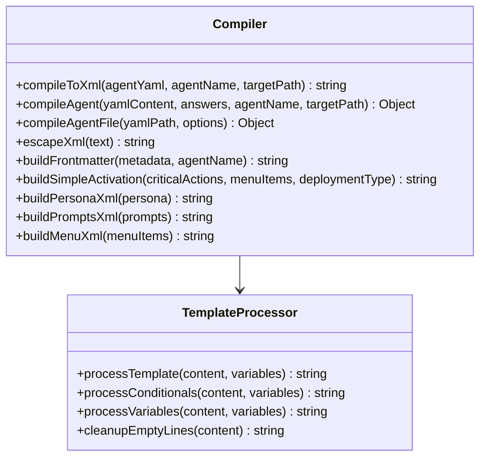

**图表来源**
- [compiler.js](file://tools/cli/lib/agent/compiler.js#L1-L50)
- [template-engine.js](file://tools/cli/lib/agent/template-engine.js#L1-L30)

**章节来源**
- [compiler.js](file://tools/cli/lib/agent/compiler.js#L383-L433)
- [template-engine.js](file://tools/cli/lib/agent/template-engine.js#L12-L25)

## 模板引擎处理逻辑

### 模板语法系统

模板引擎提供了灵活的动态内容生成能力，支持条件判断和变量替换：

```mermaid
flowchart TD
Input[输入模板内容] --> ProcessConditionals["处理条件语句<br/>{{#if var}}...{{/if}}"]
ProcessConditionals --> ProcessVariables["处理变量替换<br/>{{variable}}"]
ProcessVariables --> CleanupLines["清理空行"]
CleanupLines --> Output[输出处理后内容]
subgraph "条件语句类型"
IfEquals["{{#if var == \"value\"}}"]
IfBoolean["{{#if var}}"]
Unless["{{#unless var}}"]
end
ProcessConditionals --> IfEquals
ProcessConditionals --> IfBoolean
ProcessConditionals --> Unless
```

**图表来源**
- [template-engine.js](file://tools/cli/lib/agent/template-engine.js#L28-L58)

### 模板处理算法

模板引擎采用两阶段处理策略：

| 处理阶段 | 功能 | 正则表达式模式 | 示例 |
|----------|------|----------------|------|
| 条件处理 | 处理条件语句块 | `{{#if\s+(\w+)\s*==\s*"([^"]+)"\s*}}([\s\S]*?){{/if}}` | `{{#if env == "prod"}}...{{/if}}` |
| 变量替换 | 替换模板变量 | `\{\{(\w+)\}\}` | `{{agent_name}}` → `CommitPoet` |
| 空行清理 | 清理条件移除后的空行 | `\n{3,}` → `\n\n` | 保持输出整洁 |

### 默认值处理机制

模板引擎支持默认值机制，确保配置的完整性：

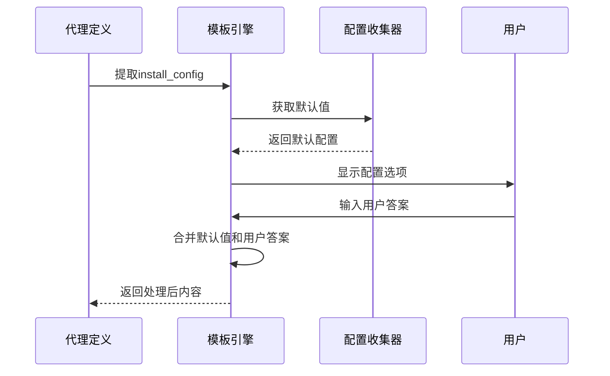

**图表来源**
- [template-engine.js](file://tools/cli/lib/agent/template-engine.js#L123-L150)

**章节来源**
- [template-engine.js](file://tools/cli/lib/agent/template-engine.js#L28-L86)

## 依赖解析与管理

### 依赖解析架构

依赖解析器是BMAD系统的重要组成部分，负责分析和解决复杂的模块依赖关系：

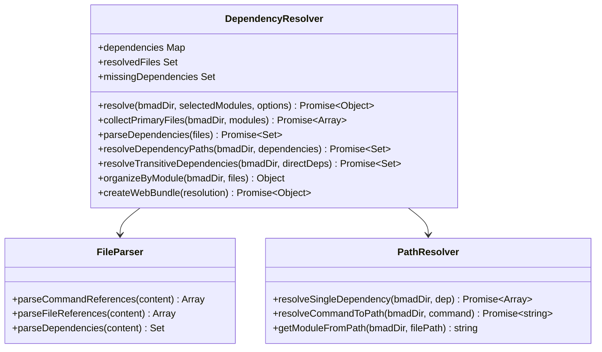

**图表来源**
- [dependency-resolver.js](file://tools/cli/installers/lib/core/dependency-resolver.js#L11-L20)

### 依赖类型识别

依赖解析器能够识别多种类型的依赖关系：

| 依赖类型 | 格式示例 | 解析方式 | 处理策略 |
|----------|----------|----------|----------|
| 显式依赖 | `dependencies: [task-foo, agent-bar]` | YAML frontmatter解析 | 直接文件引用 |
| 模板依赖 | `template: templates/common.md` | YAML frontmatter解析 | 相对路径解析 |
| 命令引用 | `@task-analyze` | 内容正则匹配 | 模块内搜索 |
| 文件引用 | `exec="tasks/script.md"` | 属性值解析 | 路径规范化 |
| 绝对路径 | `bmad/core/tasks/base.md` | 路径前缀识别 | 根据模块定位 |

### 依赖解析流程

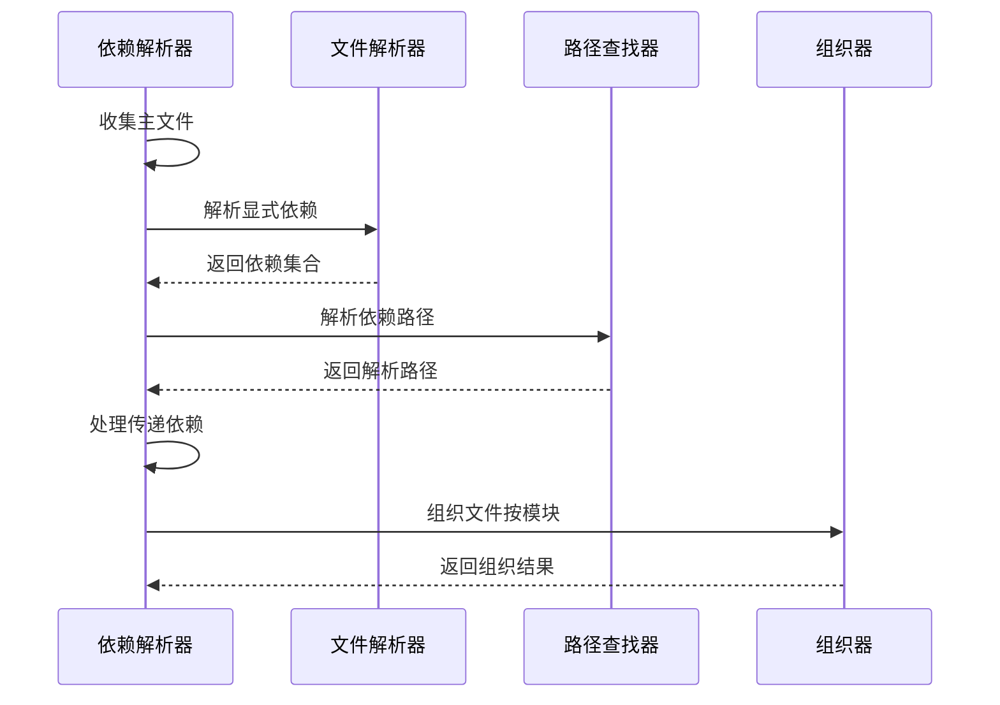

**图表来源**
- [dependency-resolver.js](file://tools/cli/installers/lib/core/dependency-resolver.js#L25-L65)

**章节来源**
- [dependency-resolver.js](file://tools/cli/installers/lib/core/dependency-resolver.js#L25-L130)

## 配置管理系统

### 清单生成器

清单生成器负责维护BMAD系统的完整配置信息，包括工作流、代理、任务等元数据：

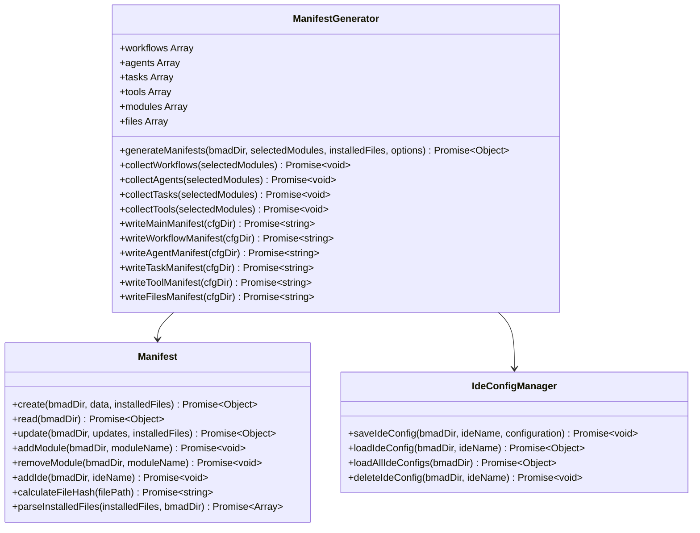

**图表来源**
- [manifest-generator.js](file://tools/cli/installers/lib/core/manifest-generator.js#L13-L30)
- [manifest.js](file://tools/cli/installers/lib/core/manifest.js#L5-L20)
- [ide-config-manager.js](file://tools/cli/installers/lib/core/ide-config-manager.js#L9-L20)

### 配置持久化机制

配置管理系统采用多层持久化策略：

| 存储位置 | 文件格式 | 内容类型 | 更新频率 |
|----------|----------|----------|----------|
| `_cfg/manifest.yaml` | YAML | 安装信息、模块列表、IDE配置 | 安装/更新时 |
| `_cfg/workflow-manifest.csv` | CSV | 工作流元数据 | 每次安装 |
| `_cfg/agent-manifest.csv` | CSV | 代理元数据 | 每次安装 |
| `_cfg/task-manifest.csv` | CSV | 任务元数据 | 每次安装 |
| `_cfg/ides/{ide}.yaml` | YAML | IDE特定配置 | IDE配置时 |

### 文件哈希验证

清单生成器实现了文件完整性验证机制：

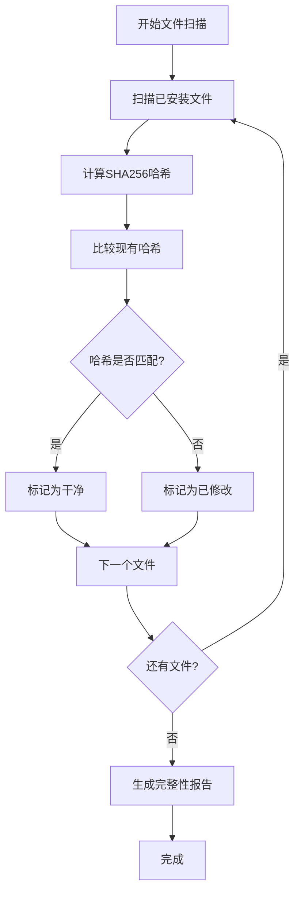

**图表来源**
- [manifest-generator.js](file://tools/cli/installers/lib/core/manifest-generator.js#L617-L690)

**章节来源**
- [manifest-generator.js](file://tools/cli/installers/lib/core/manifest-generator.js#L30-L100)
- [manifest.js](file://tools/cli/installers/lib/core/manifest.js#L12-L50)

## 错误处理与安全机制

### 异常处理策略

BMAD系统实现了多层次的异常处理机制：

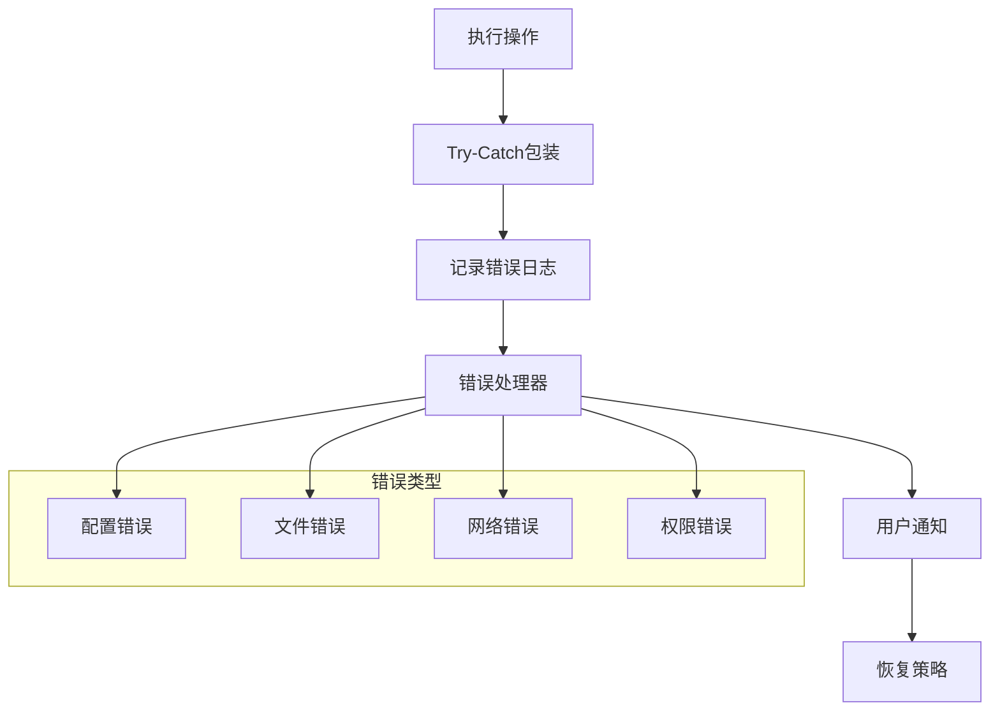

### 安全防护措施

系统实施了多重安全防护：

| 安全层面 | 防护措施 | 实现方式 | 验证方法 |
|----------|----------|----------|----------|
| 文件访问 | 路径遍历防护 | 路径规范化检查 | 白名单验证 |
| 代码注入 | XML特殊字符转义 | 自动转义机制 | 正则表达式验证 |
| 权限控制 | 最小权限原则 | 运行时权限检查 | 访问控制列表 |
| 数据验证 | 输入参数验证 | 类型检查和范围验证 | Schema验证 |

### 错误恢复机制

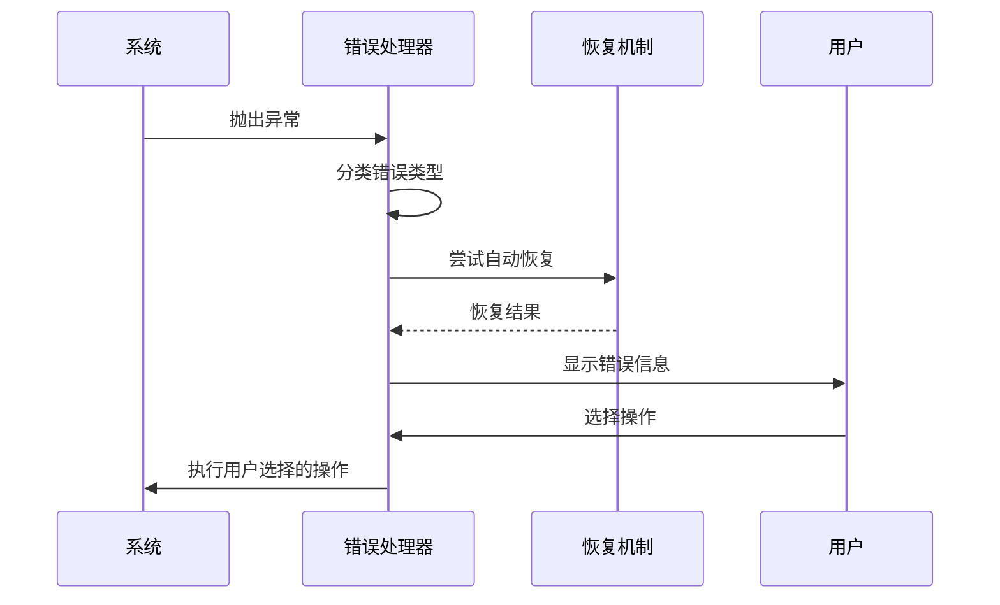

**章节来源**
- [installer.js](file://tools/cli/installers/lib/core/installer.js#L480-L520)
- [compiler.js](file://tools/cli/lib/agent/compiler.js#L23-L30)

## 性能优化策略

### 缓存机制

BMAD系统实现了多级缓存策略以提升性能：

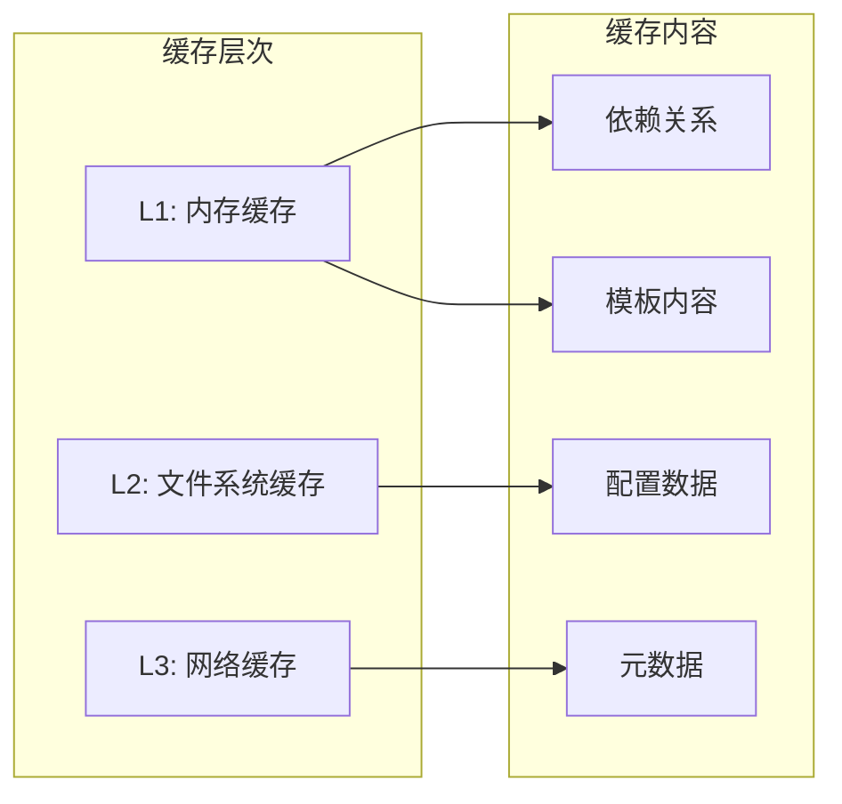

### 并发处理优化

系统采用异步并发处理提升效率：

| 优化领域 | 实现方式 | 性能提升 | 适用场景 |
|----------|----------|----------|----------|
| 文件操作 | Promise.all并发处理 | 3-5倍 | 大量文件复制 |
| 依赖解析 | 异步递归解析 | 2-3倍 | 复杂依赖图 |
| 模板处理 | 流式处理 | 1.5-2倍 | 大型模板 |
| 清单生成 | 分批处理 | 2-4倍 | 大型项目 |

### 内存管理

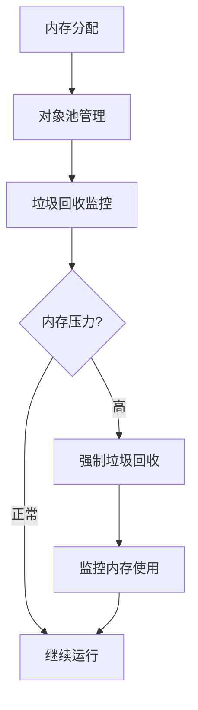

**章节来源**
- [dependency-resolver.js](file://tools/cli/installers/lib/core/dependency-resolver.js#L30-L50)

## 实际使用示例

### 自定义代理开发

以下展示了如何在自定义模块中调用代理管理API：

```javascript
// 自定义代理安装示例
const { AgentInstaller } = require('./tools/cli/lib/agent/installer');

// 发现可用代理
const agents = AgentInstaller.discoverAgents('./custom/agents');
console.log('发现的代理:', agents);

// 加载代理配置
const agentConfig = AgentInstaller.loadAgentConfig('./custom/agents/my-agent/my-agent.agent.yaml');
console.log('代理配置:', agentConfig);

// 编译代理
const compiledAgent = AgentInstaller.compileAgent(
  agentConfig.yamlContent,
  { custom_name: 'My Custom Agent' }
);
console.log('编译后的代理:', compiledAgent);
```

### 代理部署自动化

```javascript
// 自动化部署示例
const { Installer } = require('./tools/cli/installers/lib/core/installer');

const installer = new Installer();

// 批量安装代理
const agentsToInstall = [
  './custom/agents/commit-poet/commit-poet.agent.yaml',
  './custom/agents/toolsmith/toolsmith.agent.yaml'
];

for (const agentPath of agentsToInstall) {
  const result = await AgentInstaller.installAgent(
    AgentInstaller.discoverAgents(agentPath)[0],
    { project_root: process.cwd() },
    './bmad/agents'
  );
  console.log(`代理安装结果: ${result.success}`);
}
```

### 工作流集成

```javascript
// 工作流执行示例
const { WorkflowExecutor } = require('./src/core/workflows');

const executor = new WorkflowExecutor();

// 执行代理创建工作流
const workflowResult = await executor.execute('create-agent', {
  agent_name: 'Custom Analyst',
  module: 'bmm',
  config: {
    type: 'business_analyst',
    capabilities: ['research', 'analysis', 'reporting']
  }
});

console.log('工作流执行结果:', workflowResult);
```

**章节来源**
- [agent-installer.js](file://tools/cli/lib/agent/installer.js#L53-L100)
- [installer.js](file://tools/cli/installers/lib/core/installer.js#L383-L450)

## 故障排除指南

### 常见问题诊断

| 问题类型 | 症状 | 可能原因 | 解决方案 |
|----------|------|----------|----------|
| 安装失败 | 文件复制错误 | 权限不足或磁盘空间不足 | 检查权限和磁盘空间 |
| 编译错误 | YAML解析失败 | 语法错误或编码问题 | 验证YAML语法 |
| 依赖缺失 | 运行时错误 | 依赖未正确解析 | 检查依赖配置 |
| 配置冲突 | 行为异常 | 多个配置源冲突 | 清理配置文件 |

### 调试工具

系统提供了丰富的调试功能：

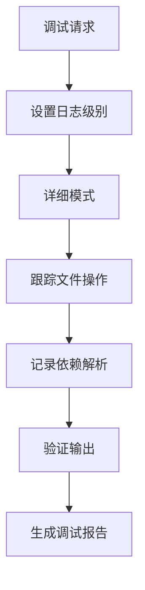

### 性能监控

```javascript
// 性能监控示例
const performance = {
  startTime: Date.now(),
  memoryUsage: process.memoryUsage(),
  operations: []
};

// 包装关键操作
function monitoredOperation(name, operation) {
  const startMemory = process.memoryUsage();
  const start = Date.now();
  
  try {
    const result = operation();
    const end = Date.now();
    const endMemory = process.memoryUsage();
    
    performance.operations.push({
      name,
      duration: end - start,
      memoryDelta: endMemory.heapUsed - startMemory.heapUsed
    });
    
    return result;
  } catch (error) {
    console.error(`操作 ${name} 失败:`, error);
    throw error;
  }
}
```

**章节来源**
- [installer.js](file://tools/cli/installers/lib/core/installer.js#L680-L720)
- [compiler.js](file://tools/cli/lib/agent/compiler.js#L480-L525)

## 总结

BMAD代理管理系统通过精心设计的架构和完善的组件体系，为AI代理的开发、部署和管理提供了强大而灵活的解决方案。系统的核心优势包括：

### 技术优势

1. **模块化架构**：清晰的职责分离和松耦合设计
2. **自动化程度高**：从安装到部署的全流程自动化
3. **扩展性强**：支持自定义代理和工作流
4. **可靠性保障**：完善的错误处理和恢复机制

### 应用价值

- **开发效率**：显著提升代理开发和部署效率
- **质量保证**：标准化的编译和验证流程
- **维护便利**：完整的清单管理和版本控制
- **用户体验**：直观的配置界面和详细的反馈信息

### 未来发展方向

BMAD代理管理系统将继续演进，重点关注：
- 更智能的依赖解析算法
- 更高效的缓存机制
- 更丰富的模板库
- 更完善的监控和诊断工具

通过持续的技术创新和社区贡献，BMAD系统将为AI代理生态系统的发展做出更大贡献。