# 代理编译器

<cite>
**本文档中引用的文件**
- [compiler.js](file://tools/cli/lib/agent/compiler.js)
- [agent.js](file://tools/schema/agent.js)
- [template-engine.js](file://tools/cli/lib/agent/template-engine.js)
- [toolsmith.agent.yaml](file://custom/src/agents/toolsmith/toolsmith.agent.yaml)
- [commit-poet.agent.yaml](file://custom/src/agents/commit-poet/commit-poet.agent.yaml)
- [minimal-core-agent.agent.yaml](file://test/fixtures/agent-schema/valid/top-level/minimal-core-agent.agent.yaml)
- [missing-id.agent.yaml](file://test/fixtures/agent-schema/invalid/metadata/missing-id.agent.yaml)
- [activation-builder.js](file://tools/cli/lib/activation-builder.js)
- [yaml-xml-builder.js](file://tools/cli/lib/yaml-xml-builder.js)
</cite>

## 目录
1. [简介](#简介)
2. [系统架构概览](#系统架构概览)
3. [核心组件分析](#核心组件分析)
4. [YAML配置解析机制](#yaml配置解析机制)
5. [Schema验证体系](#schema验证体系)
6. [模板引擎处理](#模板引擎处理)
7. [编译流程详解](#编译流程详解)
8. [XML生成机制](#xml生成机制)
9. [错误诊断与处理](#错误诊断与处理)
10. [性能优化策略](#性能优化策略)
11. [集成与扩展](#集成与扩展)
12. [故障排除指南](#故障排除指南)

## 简介

BMAD代理编译器是一个强大的工具链，负责将YAML格式的代理配置文件转换为可执行的XML格式。该编译器实现了从元数据定义到运行时对象的完整转换过程，支持复杂的条件触发、多级菜单和动态提示等高级功能。

编译器的核心价值在于：
- **类型安全**：通过严格的Schema验证确保配置正确性
- **模板化**：支持条件逻辑和变量替换的模板处理
- **模块化**：支持核心代理和模块代理的不同处理路径
- **兼容性**：同时支持IDE和Web部署环境

## 系统架构概览

代理编译器采用分层架构设计，各组件职责明确，协作完成完整的编译任务。

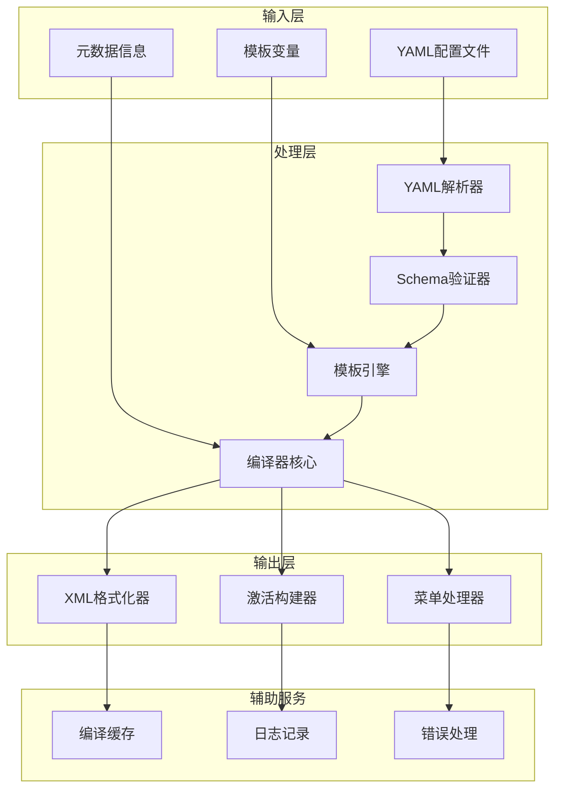

**图表来源**
- [compiler.js](file://tools/cli/lib/agent/compiler.js#L1-L50)
- [agent.js](file://tools/schema/agent.js#L1-L50)
- [template-engine.js](file://tools/cli/lib/agent/template-engine.js#L1-L50)

## 核心组件分析

### 编译器主控制器

编译器主控制器是整个系统的协调中心，负责管理编译流程的各个阶段。

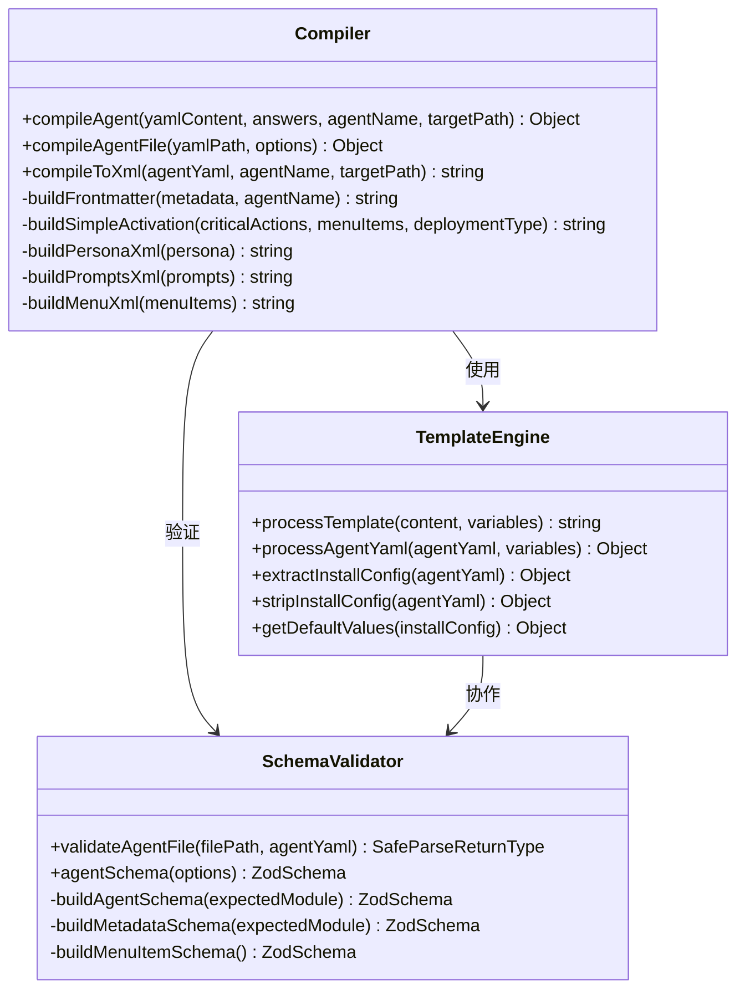

**图表来源**
- [compiler.js](file://tools/cli/lib/agent/compiler.js#L435-L525)
- [template-engine.js](file://tools/cli/lib/agent/template-engine.js#L110-L153)
- [agent.js](file://tools/schema/agent.js#L18-L390)

**章节来源**
- [compiler.js](file://tools/cli/lib/agent/compiler.js#L435-L525)
- [template-engine.js](file://tools/cli/lib/agent/template-engine.js#L110-L153)

### 模板引擎系统

模板引擎提供了强大的条件逻辑和变量替换功能，支持复杂的配置定制需求。

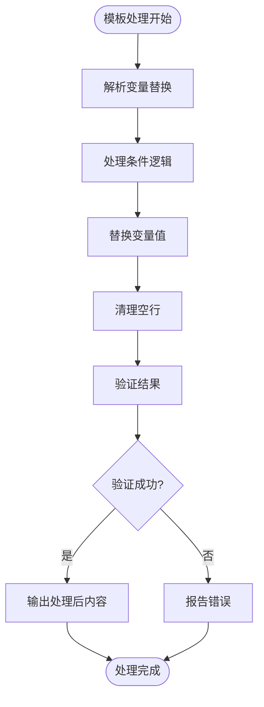

**图表来源**
- [template-engine.js](file://tools/cli/lib/agent/template-engine.js#L12-L25)

**章节来源**
- [template-engine.js](file://tools/cli/lib/agent/template-engine.js#L12-L153)

## YAML配置解析机制

### 元数据提取与处理

YAML配置文件的解析遵循严格的层次结构，每个部分都有特定的职责和验证规则。

| 配置层级 | 字段名称 | 类型要求 | 必需性 | 描述 |
|---------|---------|---------|--------|------|
| agent.metadata | id | string | 必需 | 唯一标识符，用于文件定位 |
| agent.metadata | name | string | 必需 | 显示名称，用户可自定义 |
| agent.metadata | title | string | 必需 | 标题描述，简短说明 |
| agent.metadata | icon | string | 必需 | 图标字符，支持Unicode |
| agent.metadata | module | string | 可选 | 模块归属标识 |
| agent.persona | role | string | 必需 | 角色定义，Agent的身份 |
| agent.persona | identity | string | 必需 | 身份描述，背景信息 |
| agent.persona | communication_style | string | 必需 | 沟通风格，语言特点 |
| agent.persona | principles | array/string | 必需 | 行为原则，指导准则 |
| agent.menu | trigger | string | 必需 | 触发器，命令标识符 |
| agent.menu | description | string | 必需 | 描述信息，用户可见 |
| agent.menu | action/workflow/exec | string | 必需 | 执行目标，命令类型 |

### 角色定义解析

角色定义是代理行为的核心，包含了Agent的身份认知和行为准则。

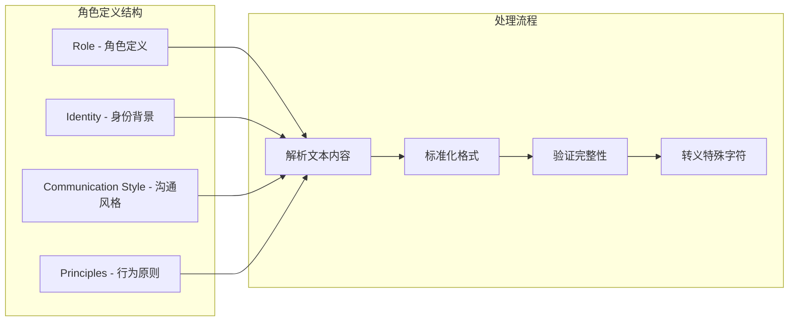

**图表来源**
- [compiler.js](file://tools/cli/lib/agent/compiler.js#L180-L242)

**章节来源**
- [compiler.js](file://tools/cli/lib/agent/compiler.js#L180-L242)

### 提示词处理机制

提示词系统支持多种格式和用途，包括标准提示、分析提示和改进提示。

| 提示类型 | ID前缀 | 用途 | 内容结构 |
|---------|--------|------|---------|
| 标准写入 | write-* | 主要功能提示 | 指令 + 过程 + 示例 |
| 分析检查 | analyze-* | 变更分析提示 | 指令 + 分析输出 + 上下文 |
| 改进提升 | improve-* | 消息优化提示 | 指令 + 改进过程 + 建议 |
| 批量处理 | batch-* | 多提交管理 | 指令 + 批量方法 + 示例 |

**章节来源**
- [commit-poet.agent.yaml](file://custom/src/agents/commit-poet/commit-poet.agent.yaml#L24-L130)

## Schema验证体系

### 验证架构设计

Schema验证体系采用Zod库实现，提供类型安全和详细的错误报告。

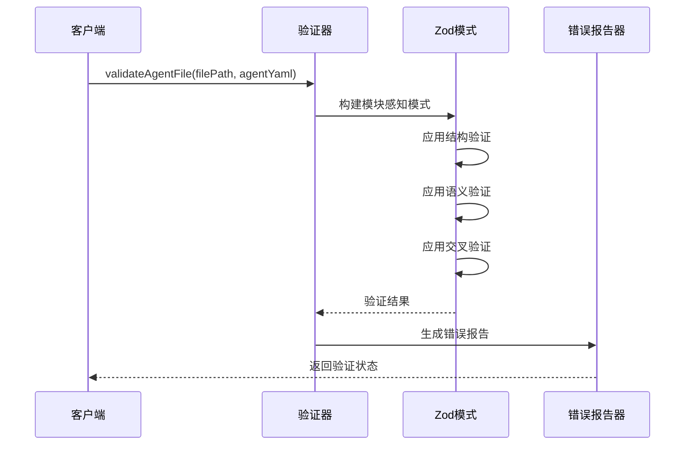

**图表来源**
- [agent.js](file://tools/schema/agent.js#L18-L390)

### 触发器验证规则

触发器验证确保命令标识符的格式正确性和唯一性。

| 验证规则 | 正则表达式 | 错误消息 | 处理策略 |
|---------|-----------|---------|---------|
| 格式检查 | ^[a-z0-9]+(?:-[a-z0-9]+)*$ | 必须是kebab-case格式 | 自动修正或拒绝 |
| 唯一性检查 | 无重复值 | 不得重复使用 | 报告冲突位置 |
| 长度限制 | 最大64字符 | 超出长度限制 | 截断或拒绝 |
| 关键字保护 | 不允许的关键字 | 关键字被保留 | 替换或拒绝 |

**章节来源**
- [agent.js](file://tools/schema/agent.js#L40-L116)

### 默认值填充机制

默认值填充确保配置的完整性和一致性。

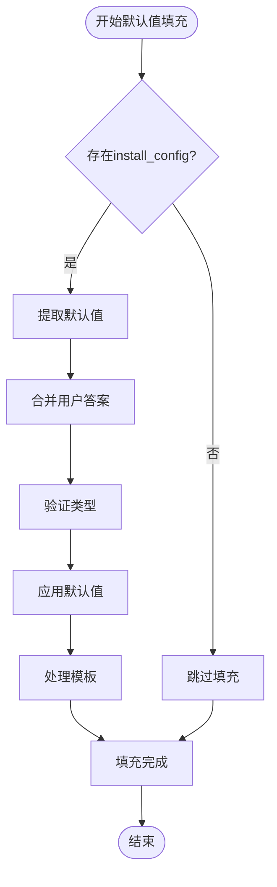

**图表来源**
- [template-engine.js](file://tools/cli/lib/agent/template-engine.js#L122-L141)

**章节来源**
- [template-engine.js](file://tools/cli/lib/agent/template-engine.js#L122-L141)

## 模板引擎处理

### 条件逻辑处理

模板引擎支持复杂的条件逻辑，包括相等比较、布尔判断和否定条件。

```mermaid
flowchart TD
Input[输入模板内容] --> ParseIf[解析{{#if}}条件]
ParseIf --> ParseUnless[解析{{#unless}}条件]
ParseUnless --> ProcessVars[处理变量替换]
ProcessVars --> Cleanup[清理空行]
Cleanup --> Output[输出最终内容]
ParseIf --> IfEqual{相等比较?}
IfEqual --> |是| CompareValue[比较变量值]
IfEqual --> |否| CheckBoolean[检查布尔值]
CompareValue --> Match{匹配成功?}
Match --> |是| IncludeBlock[包含代码块]
Match --> |否| ExcludeBlock[排除代码块]
CheckBoolean --> Truthy{真值判断}
Truthy --> |是| IncludeBlock
Truthy --> |否| ExcludeBlock
```

**图表来源**
- [template-engine.js](file://tools/cli/lib/agent/template-engine.js#L30-L56)

### 变量替换机制

变量替换支持简单的键值对替换和复杂的嵌套结构。

| 变量类型 | 语法格式 | 处理方式 | 示例 |
|---------|---------|---------|------|
| 简单变量 | {{variable}} | 直接替换 | {{project_root}} |
| 条件变量 | {{#if variable}}...{{/if}} | 条件渲染 | {{#if debug_mode}}启用调试{{/if}} |
| 否定条件 | {{#unless variable}}...{{/unless}} | 反向条件 | {{#unless production}}非生产环境{{/unless}} |
| 字符串比较 | {{#if variable == "value"}}...{{/if}} | 字面值比较 | {{#if env == "development"}}开发环境{{/if}} |

**章节来源**
- [template-engine.js](file://tools/cli/lib/agent/template-engine.js#L60-L77)

## 编译流程详解

### 完整编译管道

编译流程包含多个阶段，每个阶段都有特定的职责和输出。

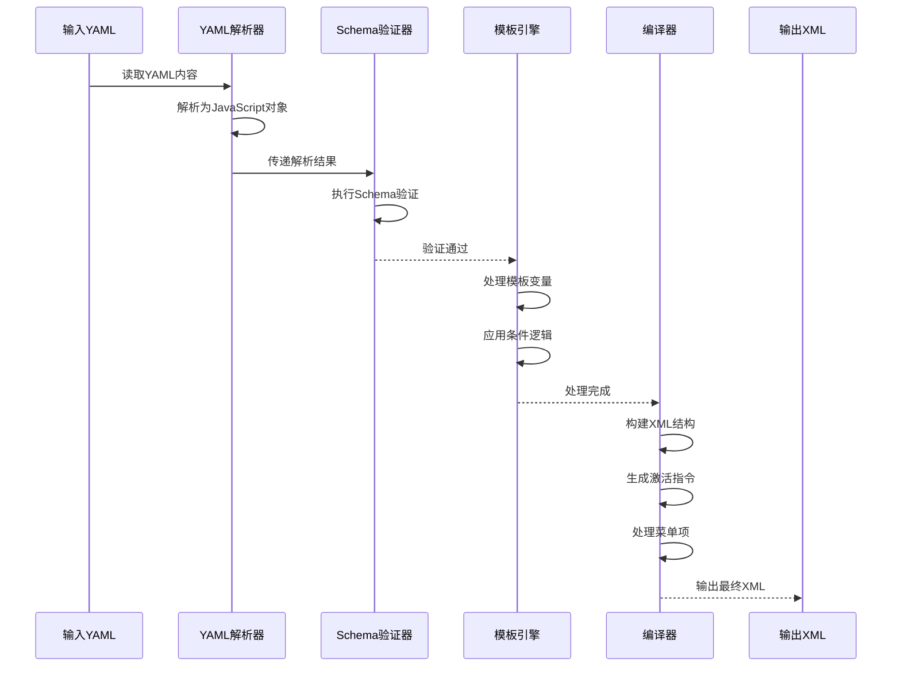

**图表来源**
- [compiler.js](file://tools/cli/lib/agent/compiler.js#L435-L482)

### 引用解析处理

引用解析确保配置中的相对路径和文件引用能够正确解析。

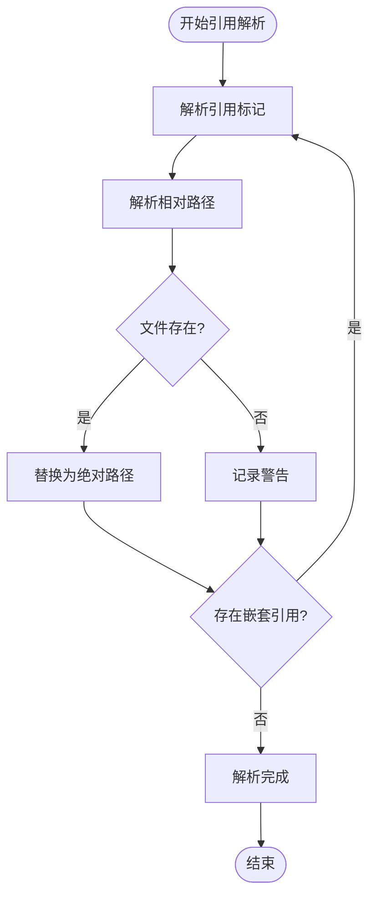

**章节来源**
- [compiler.js](file://tools/cli/lib/agent/compiler.js#L435-L482)

## XML生成机制

### 激活块构建

激活块是代理启动时执行的核心指令序列，包含标准步骤和自定义动作。

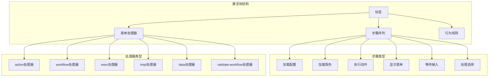

**图表来源**
- [compiler.js](file://tools/cli/lib/agent/compiler.js#L55-L177)

### 菜单项处理

菜单项处理支持传统格式和新式多触发器格式，提供灵活的交互方式。

| 菜单项类型 | 触发方式 | 执行目标 | 特殊属性 |
|-----------|---------|---------|---------|
| 传统格式 | 单一触发器 | 单一动作 | trigger字段 |
| 多触发器格式 | 多个触发器 | 复杂动作序列 | triggers数组 |
| 条件菜单 | 动态触发 | 条件动作 | 条件表达式 |
| Web专用 | Web触发 | Web操作 | web-only标志 |

**章节来源**
- [compiler.js](file://tools/cli/lib/agent/compiler.js#L251-L330)

### 前言生成机制

前言生成确保生成的XML文件具有正确的元数据和格式声明。

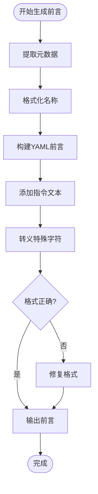

**图表来源**
- [compiler.js](file://tools/cli/lib/agent/compiler.js#L34-L46)

**章节来源**
- [compiler.js](file://tools/cli/lib/agent/compiler.js#L34-L46)

## 错误诊断与处理

### 常见错误类型

编译器提供详细的错误诊断信息，帮助开发者快速定位和解决问题。

| 错误类别 | 错误代码 | 常见原因 | 解决方案 |
|---------|---------|---------|---------|
| YAML解析错误 | parse_error | 语法错误、缩进问题 | 检查YAML语法 |
| Schema验证失败 | invalid_type | 类型不匹配 | 检查字段类型 |
| 必填字段缺失 | required | 字段未定义 | 添加必需字段 |
| 触发器冲突 | duplicate_trigger | 触发器重复 | 修改触发器名称 |
| 文件引用错误 | file_not_found | 文件不存在 | 检查文件路径 |
| 模板变量错误 | template_error | 变量未定义 | 检查变量定义 |

### 错误恢复策略

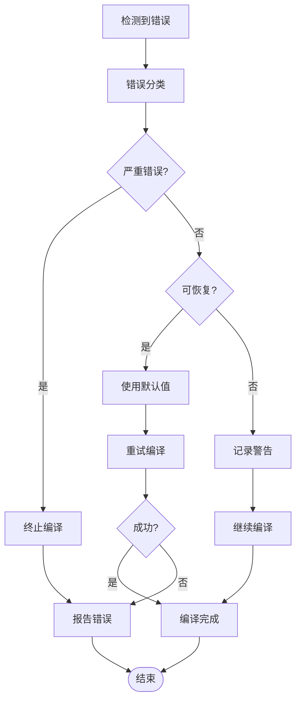

**章节来源**
- [agent.js](file://tools/schema/agent.js#L40-L116)

## 性能优化策略

### 编译缓存机制

编译器实现了智能缓存机制，避免重复编译相同配置。

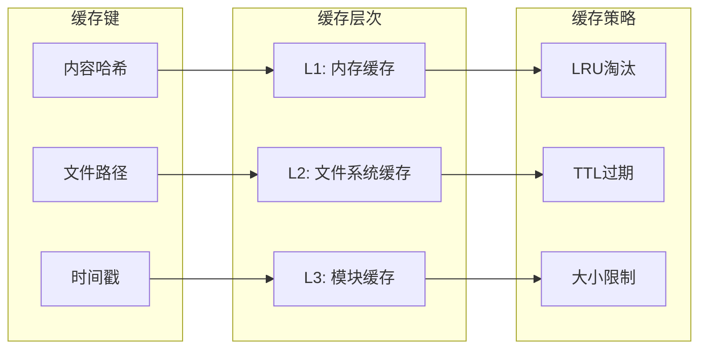

### 并行处理优化

对于大型配置文件，编译器支持并行处理以提高效率。

| 优化技术 | 应用场景 | 性能提升 | 实现复杂度 |
|---------|---------|---------|-----------|
| 异步解析 | 大型YAML文件 | 2-3倍 | 中等 |
| 并行验证 | 多文件验证 | 3-5倍 | 高 |
| 流式处理 | 大文件输出 | 1.5-2倍 | 中等 |
| 增量编译 | 部分更新 | 5-10倍 | 高 |

## 集成与扩展

### 与安装器的集成

编译器与安装器紧密集成，支持动态配置和部署。

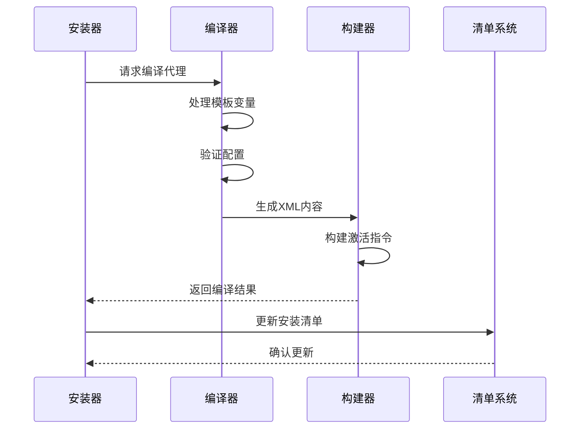

**图表来源**
- [installer.js](file://tools/cli/lib/agent/installer.js#L284-L684)

### 模板引擎扩展

模板引擎支持插件机制，允许第三方扩展功能。

| 扩展点 | 接口类型 | 扩展方式 | 示例 |
|-------|---------|---------|------|
| 变量处理器 | 函数接口 | 注册处理器 | 自定义变量类型 |
| 条件函数 | 表达式接口 | 添加函数 | 自定义逻辑运算 |
| 格式化器 | 过滤器接口 | 注册过滤器 | 数据格式转换 |
| 块处理器 | 块接口 | 扩展块类型 | 自定义控制结构 |

**章节来源**
- [template-engine.js](file://tools/cli/lib/agent/template-engine.js#L12-L25)

## 故障排除指南

### 常见编译问题

当编译过程中出现问题时，可以按照以下步骤进行排查：

1. **YAML语法检查**
   - 使用在线YAML验证器
   - 检查缩进和冒号使用
   - 验证特殊字符转义

2. **Schema验证失败**
   - 检查字段类型是否正确
   - 验证必填字段是否存在
   - 确认触发器格式符合要求

3. **模板变量错误**
   - 检查变量名拼写
   - 验证变量作用域
   - 确认默认值设置

4. **文件引用问题**
   - 验证文件路径正确性
   - 检查文件权限
   - 确认文件编码格式

### 调试技巧

| 调试方法 | 适用场景 | 使用方式 | 效果 |
|---------|---------|---------|------|
| 详细日志 | 编译错误 | 设置DEBUG环境变量 | 查看详细错误信息 |
| 分步验证 | Schema错误 | 逐个注释配置项 | 定位具体问题 |
| 单独测试 | 模板问题 | 使用最小配置 | 隔离模板错误 |
| 对比分析 | 格式问题 | 与示例对比 | 发现格式差异 |

### 性能问题诊断

当编译速度较慢时，可以考虑以下优化措施：

1. **减少模板复杂度**
   - 简化条件逻辑
   - 减少嵌套层级
   - 避免重复计算

2. **优化文件结构**
   - 合并小文件
   - 减少循环引用
   - 使用相对路径

3. **启用缓存机制**
   - 配置编译缓存
   - 使用增量编译
   - 优化缓存策略

**章节来源**
- [compiler.js](file://tools/cli/lib/agent/compiler.js#L435-L525)

## 结论

BMAD代理编译器是一个功能强大且设计精良的工具，它成功地将复杂的YAML配置转换为可执行的XML格式。通过严格的Schema验证、灵活的模板引擎和高效的编译流程，编译器为BMAD生态系统提供了坚实的基础支撑。

编译器的主要优势包括：
- **类型安全**：通过Zod Schema确保配置正确性
- **模板化支持**：强大的条件逻辑和变量替换功能
- **模块化设计**：支持核心和模块代理的不同处理路径
- **性能优化**：智能缓存和并行处理机制
- **错误友好**：详细的错误诊断和恢复策略

未来的发展方向可能包括：
- 更多的模板函数和过滤器
- 增强的调试和诊断功能
- 更好的性能优化策略
- 扩展的集成能力