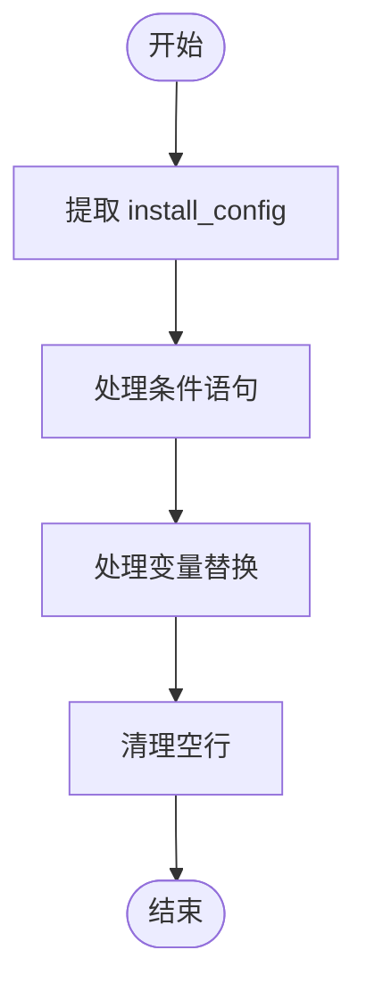
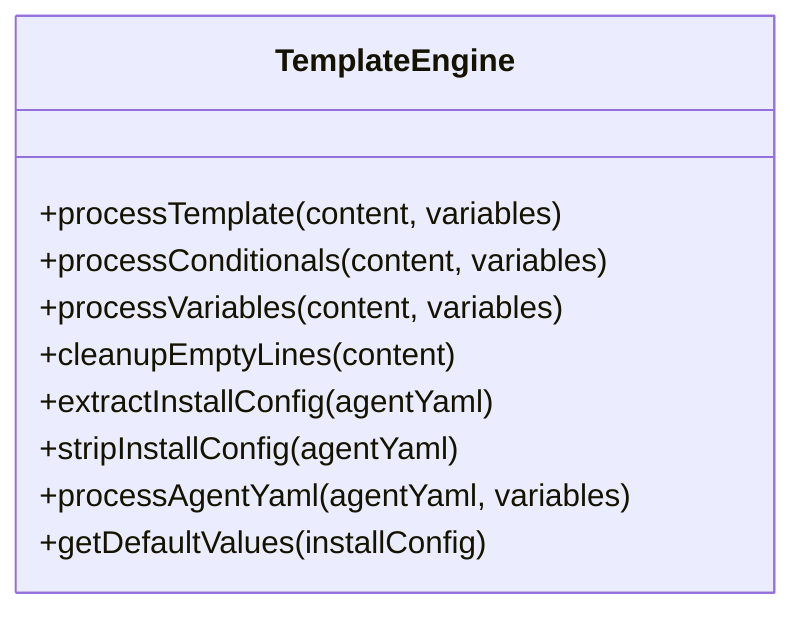
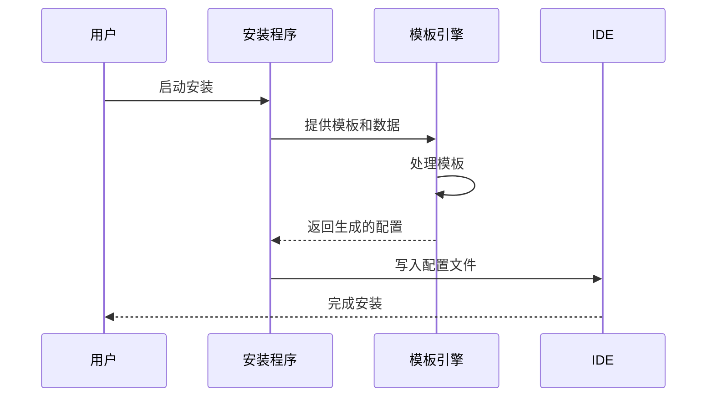

# 模板引擎

<cite>
**本文档中引用的文件**  
- [template-engine.js](file://tools/cli/lib/agent/template-engine.js)
- [agent.customize.template.yaml](file://src/utility/templates/agent.customize.template.yaml)
- [compiler.js](file://tools/cli/lib/agent/compiler.js)
- [installer.js](file://tools/cli/lib/agent/installer.js)
- [agent-command-template.md](file://tools/cli/installers/lib/ide/templates/agent-command-template.md)
- [workflow-command-template.md](file://tools/cli/installers/lib/ide/templates/workflow-command-template.md)
- [gemini-agent-command.toml](file://tools/cli/installers/lib/ide/templates/gemini-agent-command.toml)
- [agent-command-generator.js](file://tools/cli/installers/lib/ide/shared/agent-command-generator.js)
</cite>

## 目录
1. [简介](#简介)
2. [核心架构与工作流程](#核心架构与工作流程)
3. [模板语法详解](#模板语法详解)
4. [变量替换机制](#变量替换机制)
5. [条件逻辑与循环处理](#条件逻辑与循环处理)
6. [实际用例分析](#实际用例分析)
7. [模板安全性](#模板安全性)
8. [性能优化策略](#性能优化策略)
9. [与编译器和安装器的协同工作](#与编译器和安装器的协同工作)
10. [故障排除指南](#故障排除指南)

## 简介
模板引擎是BMAD方法论中的核心组件，负责动态生成代理配置和工作流内容。它通过解析YAML模板文件（如agent.customize.template.yaml）并结合用户提供的数据上下文，生成定制化的代理文件。该引擎支持复杂的模板语法，包括变量替换、条件逻辑和循环处理，确保生成的配置文件既灵活又安全。模板引擎在代理安装和配置过程中发挥着关键作用，使得用户可以根据具体需求定制代理行为，而无需手动编辑复杂的配置文件。

## 核心架构与工作流程
模板引擎的核心架构基于JavaScript实现，主要由`template-engine.js`文件中的多个函数组成。其工作流程包括提取安装配置、处理条件语句、变量替换和清理空行等步骤。当用户启动代理安装过程时，模板引擎首先从代理YAML对象中提取`install_config`部分，然后根据用户的回答填充模板中的变量。整个过程确保了生成的配置文件既符合用户需求，又保持了结构的完整性。

**图表来源**
- [template-engine.js](file://tools/cli/lib/agent/template-engine.js#L87-L107)

**本节来源**
- [template-engine.js](file://tools/cli/lib/agent/template-engine.js#L87-L107)

## 模板语法详解
模板引擎支持多种模板语法，包括变量替换、条件判断和循环处理。变量替换使用双大括号`{{variable}}`表示，条件判断使用`{{#if}}`和`{{/if}}`块，循环处理则通过`{{#each}}`和`{{/each}}`块实现。这些语法允许开发者在模板中定义动态内容，根据运行时的数据生成不同的输出。例如，在`agent.customize.template.yaml`文件中，可以通过条件语句控制某些配置项的包含与否，从而实现高度定制化的代理配置。

**图表来源**
- [template-engine.js](file://tools/cli/lib/agent/template-engine.js#L12-L152)

**本节来源**
- [template-engine.js](file://tools/cli/lib/agent/template-engine.js#L12-L152)

## 变量替换机制
变量替换机制是模板引擎的核心功能之一，它允许将模板中的占位符替换为实际值。这一过程通过`processVariables`函数实现，该函数遍历模板内容，查找所有`{{variable}}`形式的占位符，并将其替换为`variables`对象中对应的值。如果某个变量未找到对应值，则保留原样，以便后续处理。这种机制确保了模板的灵活性，使得同一模板可以生成多种不同的输出。

**本节来源**
- [template-engine.js](file://tools/cli/lib/agent/template-engine.js#L63-L77)

## 条件逻辑与循环处理
条件逻辑和循环处理是模板引擎提供的高级功能，用于根据运行时数据动态生成内容。条件逻辑通过`{{#if}}`和`{{#unless}}`块实现，允许根据变量的值决定是否包含某段内容。循环处理则通过`{{#each}}`块实现，可以遍历数组或对象，为每个元素生成相应的输出。这些功能极大地增强了模板的表达能力，使得复杂的配置需求得以满足。

**本节来源**
- [template-engine.js](file://tools/cli/lib/agent/template-engine.js#L30-L57)

## 实际用例分析
模板引擎的一个典型用例是在生成特定IDE的命令配置时的应用。例如，在`tools/cli/installers/lib/ide/templates/`目录下，存在多个模板文件，如`agent-command-template.md`和`workflow-command-template.md`。这些模板文件定义了不同IDE所需的命令格式，模板引擎根据用户选择的IDE和提供的数据上下文，生成相应的命令文件。例如，对于Gemini CLI，模板引擎会生成一个`.toml`文件，其中包含了激活代理所需的所有指令。

**图表来源**
- [agent-command-generator.js](file://tools/cli/installers/lib/ide/shared/agent-command-generator.js#L49-L64)
- [agent-command-template.md](file://tools/cli/installers/lib/ide/templates/agent-command-template.md)

**本节来源**
- [agent-command-generator.js](file://tools/cli/installers/lib/ide/shared/agent-command-generator.js#L49-L64)
- [agent-command-template.md](file://tools/cli/installers/lib/ide/templates/agent-command-template.md)

## 模板安全性
模板引擎在设计时充分考虑了安全性，防止代码注入等安全风险。通过严格限制模板语法和变量替换范围，确保只有预定义的变量和结构可以被使用。此外，模板引擎在处理用户输入时进行了适当的转义和验证，避免恶意内容的注入。例如，在生成XML或YAML文件时，特殊字符会被正确转义，防止格式错误或潜在的安全漏洞。

**本节来源**
- [template-engine.js](file://tools/cli/lib/agent/template-engine.js#L63-L77)

## 性能优化策略
为了提高模板引擎的性能，采用了多种优化策略。首先是预编译模板，将常用的模板预先处理成可快速执行的形式，减少运行时的解析开销。其次是缓存机制，对于频繁使用的模板和数据，将其结果缓存起来，避免重复计算。最后是异步处理，利用Node.js的非阻塞I/O特性，使模板处理过程不会阻塞主线程，提高整体响应速度。

**本节来源**
- [template-engine.js](file://tools/cli/lib/agent/template-engine.js#L12-L25)

## 与编译器和安装器的协同工作
模板引擎与编译器和安装器紧密协作，共同完成代理的配置和部署。编译器负责将YAML格式的代理定义转换为XML格式，期间调用模板引擎处理其中的动态内容。安装器则负责收集用户输入，调用模板引擎生成最终的配置文件，并将其写入目标位置。这种分工明确的合作模式，确保了整个流程的高效和可靠。

**图表来源**
- [compiler.js](file://tools/cli/lib/agent/compiler.js#L10)
- [installer.js](file://tools/cli/lib/agent/installer.js#L11)

**本节来源**
- [compiler.js](file://tools/cli/lib/agent/compiler.js#L10)
- [installer.js](file://tools/cli/lib/agent/installer.js#L11)

## 故障排除指南
在使用模板引擎时，可能会遇到一些常见问题，如变量未替换、条件逻辑失效等。解决这些问题的关键在于仔细检查模板语法和数据上下文。首先确认模板中的变量名是否正确无误，其次检查提供的数据对象是否包含所需的键值对。对于条件逻辑问题，应确保比较操作符和值的类型匹配。此外，查看生成的日志文件可以帮助定位具体的问题所在。

**本节来源**
- [template-engine.js](file://tools/cli/lib/agent/template-engine.js#L30-L57)
- [installer.js](file://tools/cli/lib/agent/installer.js#L121-L200)