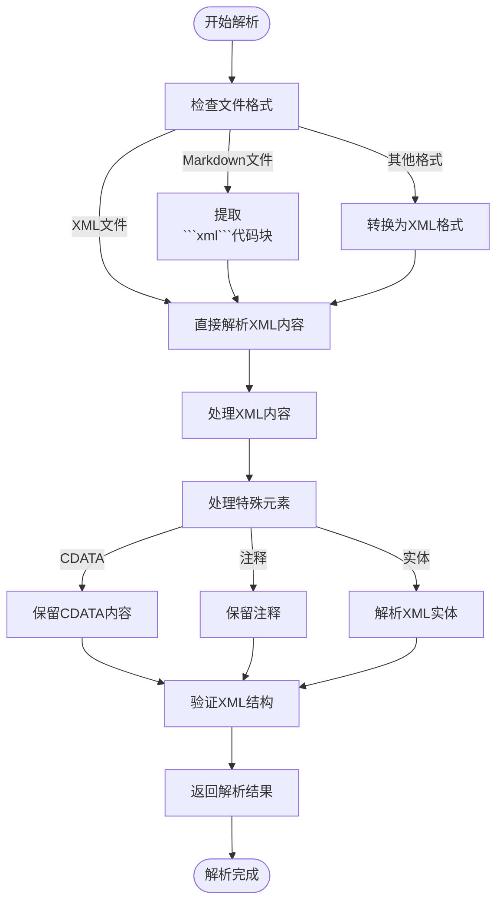
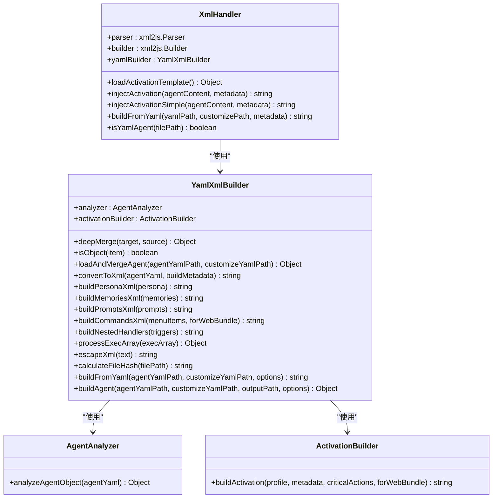
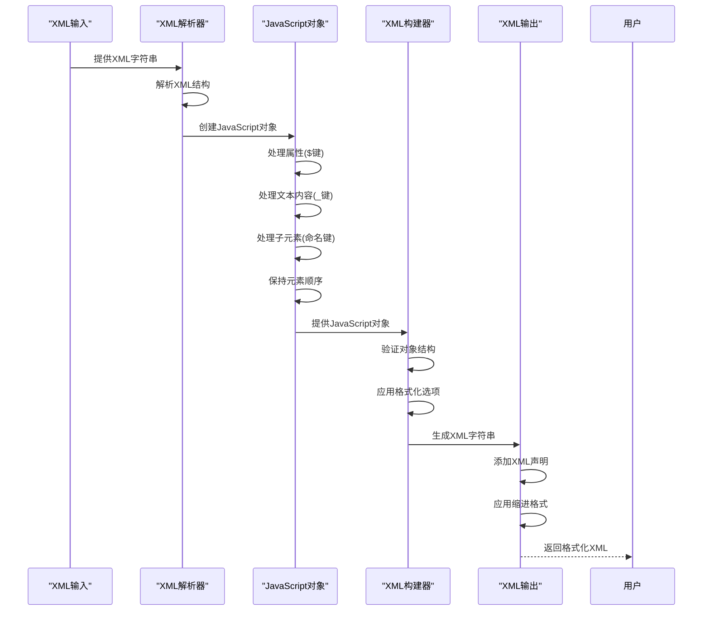
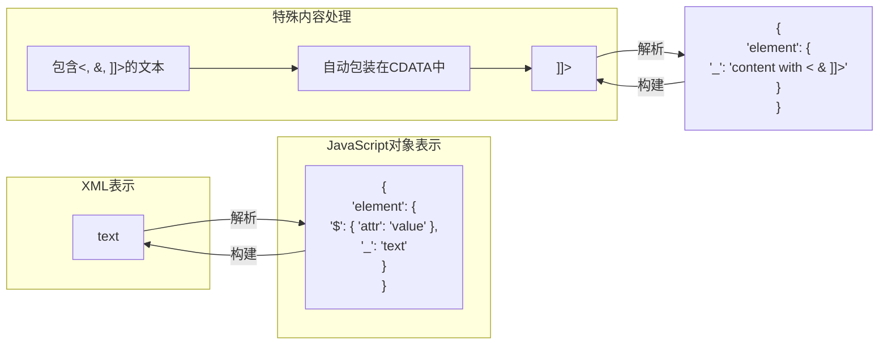
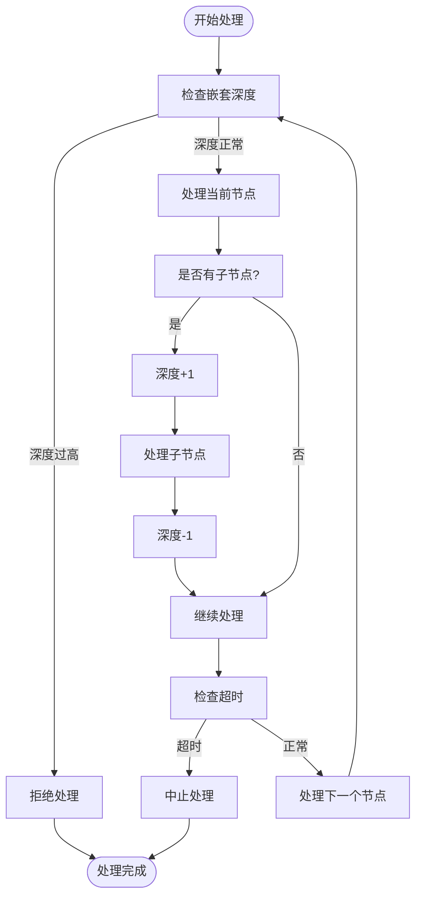
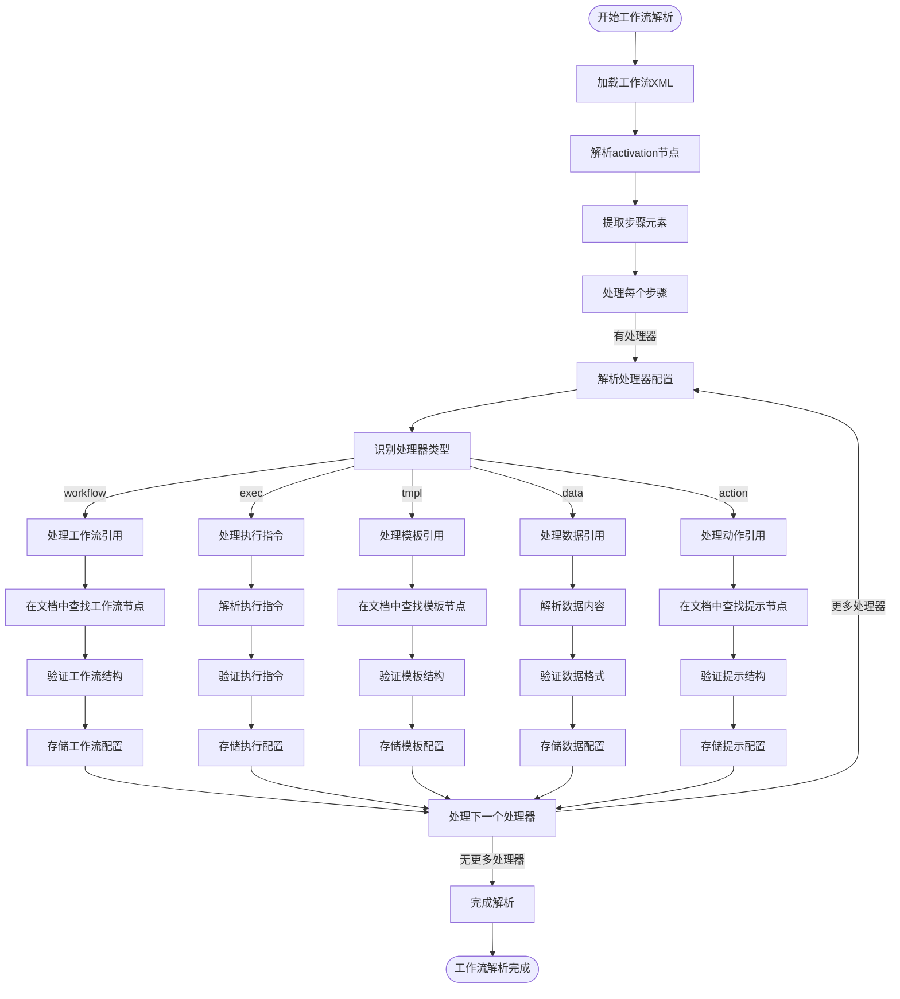
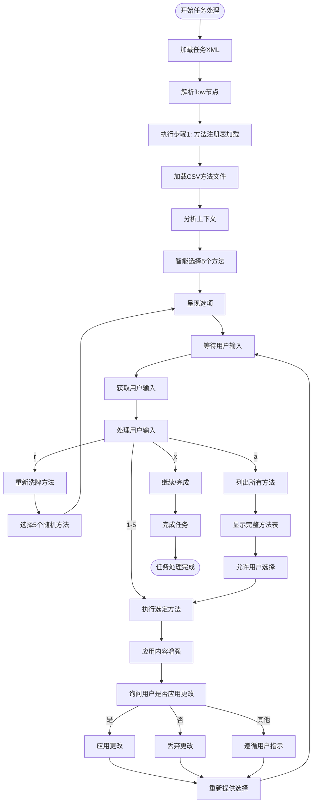

# XML处理工具

<cite>
**本文档引用的文件**  
- [xml-handler.js](file://tools/cli/lib/xml-handler.js)
- [yaml-xml-builder.js](file://tools/cli/lib/yaml-xml-builder.js)
- [xml-to-markdown.js](file://tools/cli/lib/xml-to-markdown.js)
- [web-bundler.js](file://tools/cli/bundlers/web-bundler.js)
- [generateXMLOutput.js](file://tools/flattener/xml.js)
- [agent-activation-ide.xml](file://src/utility/models/agent-activation-ide.xml)
- [bmad-web-orchestrator.agent.xml](file://src/core/agents/bmad-web-orchestrator.agent.xml)
- [workflow.xml](file://src/core/tasks/workflow.xml)
- [validate-workflow.xml](file://src/core/tasks/validate-workflow.xml)
- [advanced-elicitation.xml](file://src/core/tasks/advanced-elicitation.xml)
</cite>

## 目录
1. [简介](#简介)
2. [XML解析规则](#xml解析规则)
3. [命名空间与属性处理](#命名空间与属性处理)
4. [安全防护策略](#安全防护策略)
5. [XML到JavaScript对象转换](#xml到javascript对象转换)
6. [属性与文本节点映射](#属性与文本节点映射)
7. [循环引用检测](#循环引用检测)
8. [工作流定义解析](#工作流定义解析)
9. [任务指令处理](#任务指令处理)
10. [错误处理模式](#错误处理模式)
11. [性能优化建议](#性能优化建议)

## 简介
XML处理工具是BMAD系统的核心组件，负责处理XML格式的代理配置、工作流定义和任务指令。该工具提供完整的XML解析、转换和安全处理能力，支持从YAML到XML的转换、Markdown中XML块的提取以及大型项目文件的扁平化处理。系统通过xml2js库实现XML解析和构建，确保与现有XML结构的兼容性，同时提供安全的字符转义和内容处理机制。

**Section sources**
- [xml-handler.js](file://tools/cli/lib/xml-handler.js#L1-L230)
- [yaml-xml-builder.js](file://tools/cli/lib/yaml-xml-builder.js#L1-L607)

## XML解析规则
XML处理工具采用xml2js库进行XML解析，配置了特定的解析选项以保持原始结构的完整性。解析器配置preserveChildrenOrder为true以保持子元素顺序，explicitChildren为true以明确区分子元素和属性，explicitArray为false以避免不必要的数组包装。解析器使用$作为属性键，_作为字符键，确保JavaScript对象中属性和文本内容的清晰分离。

工具支持从多种来源提取XML内容，包括纯XML文件、Markdown文档中的代码块以及混合格式文件。对于Markdown文件，系统能够识别三重或四重反引号包围的XML代码块，并正确提取其内容。解析过程还包括对XML声明、注释和CDATA段的正确处理，确保所有XML特性都能被准确解析。



**Diagram sources**
- [xml-handler.js](file://tools/cli/lib/xml-handler.js#L13-L37)
- [web-bundler.js](file://tools/cli/bundlers/web-bundler.js#L877-L919)

**Section sources**
- [xml-handler.js](file://tools/cli/lib/xml-handler.js#L13-L37)
- [web-bundler.js](file://tools/cli/bundlers/web-bundler.js#L877-L919)

## 命名空间与属性处理
XML处理工具对命名空间和属性的处理遵循严格的规则。系统使用attrkey配置项（默认为$）来区分元素属性和子元素，确保在JavaScript对象表示中属性不会与子元素混淆。对于命名空间的支持，工具通过normalizeTags配置项控制标签名称的规范化，保持原始的命名空间前缀。

属性处理包括对特殊属性的识别和处理，如agentConfig="true"这样的标记属性。系统使用正则表达式模式匹配来识别具有特定属性的XML节点，例如匹配selfClosingPattern和withContentPattern来分别处理自闭合标签和包含内容的标签。属性值的处理还包括对项目根路径{project-root}和BMAD文件夹{bmad_folder}等占位符的替换，确保路径引用的正确解析。



**Diagram sources**
- [xml-handler.js](file://tools/cli/lib/xml-handler.js#L11-L229)
- [yaml-xml-builder.js](file://tools/cli/lib/yaml-xml-builder.js#L11-L606)

**Section sources**
- [xml-handler.js](file://tools/cli/lib/xml-handler.js#L11-L229)
- [yaml-xml-builder.js](file://tools/cli/lib/yaml-xml-builder.js#L11-L606)

## 安全防护策略
XML处理工具实施了多层次的安全防护策略，防止XML注入攻击和恶意内容处理。系统对所有XML内容进行严格的字符转义，将&、<、>、"和'等特殊字符转换为相应的实体引用。对于包含潜在危险字符的内容，工具使用CDATA段进行包装，确保内容被当作纯文本处理而非可执行代码。

安全策略还包括对文件路径的验证和清理，防止路径遍历攻击。系统在处理{project-root}和{bmad_folder}等占位符时，会进行严格的路径验证，确保不会访问到项目目录之外的文件。对于XML外部实体，系统默认禁用其解析，防止XXE（XML外部实体）攻击。此外，工具还实现了输入验证机制，在处理XML内容前检查其结构完整性，拒绝格式错误或恶意构造的XML文档。

```mermaid
flowchart TD
Start([开始安全处理]) --> CheckContent["检查内容安全性"]
CheckContent --> |包含特殊字符| EscapeChars["转义XML特殊字符"]
CheckContent --> |包含]]>| HandleCDATA["处理CDATA边界"]
CheckContent --> |包含路径引用| ValidatePath["验证路径安全性"]
EscapeChars --> PreventInjection["防止XML注入"]
HandleCDATA --> PreventInjection
ValidatePath --> PreventInjection
PreventInjection --> CheckStructure["验证XML结构"]
CheckStructure --> |结构有效| ProcessSafely["安全处理XML"]
CheckStructure --> |结构无效| RejectInput["拒绝输入"]
ProcessSafely --> ApplyWhitelist["应用白名单过滤"]
ApplyWhitelist --> FinalOutput["生成最终输出"]
RejectInput --> FinalOutput
FinalOutput --> End([处理完成])
```

**Diagram sources**
- [xml-handler.js](file://tools/cli/lib/xml-handler.js#L50-L58)
- [web-bundler.js](file://tools/cli/bundlers/web-bundler.js#L1352-L1359)
- [xml.js](file://tools/flattener/xml.js#L49-L65)

**Section sources**
- [xml-handler.js](file://tools/cli/lib/xml-handler.js#L50-L58)
- [web-bundler.js](file://tools/cli/bundlers/web-bundler.js#L1352-L1359)
- [xml.js](file://tools/flattener/xml.js#L49-L65)

## XML到JavaScript对象转换
XML处理工具通过xml2js库实现XML到JavaScript对象的双向转换。解析器配置为将XML文档转换为具有特定结构的JavaScript对象，其中元素属性存储在$键下，文本内容存储在_键下，子元素按名称组织。这种结构化表示使得在JavaScript中处理XML数据变得直观和高效。

转换过程保持了XML文档的层次结构和顺序信息。通过preserveChildrenOrder选项，系统确保子元素的顺序在转换后的对象中得以保留。对于重复的子元素，系统根据explicitArray配置决定是否将其包装在数组中。转换后的JavaScript对象可以直接用于进一步的处理、分析或修改，然后再通过构建器转换回XML格式。



**Diagram sources**
- [xml-handler.js](file://tools/cli/lib/xml-handler.js#L13-L37)
- [xml-handler.js](file://tools/cli/lib/xml-handler.js#L86-L118)

**Section sources**
- [xml-handler.js](file://tools/cli/lib/xml-handler.js#L13-L37)
- [xml-handler.js](file://tools/cli/lib/xml-handler.js#L86-L118)

## 属性与文本节点映射
XML处理工具对属性和文本节点的映射遵循清晰的规则。在解析过程中，元素属性被映射到对象的$属性下，而元素的文本内容被映射到_属性下。这种分离确保了属性和内容在JavaScript对象表示中不会混淆。对于同时包含属性和文本内容的元素，系统能够正确地同时保留两者。

在构建XML时，系统将JavaScript对象中的$属性转换回XML属性，将_属性转换回元素的文本内容。对于CDATA段的处理，工具能够识别需要特殊处理的内容（包含<、&或]]>的文本），并自动将其包装在CDATA标记中，确保内容的完整性和正确性。这种智能的映射机制使得在JavaScript中修改XML内容变得简单而安全。



**Diagram sources**
- [xml-handler.js](file://tools/cli/lib/xml-handler.js#L14-L21)
- [xml.js](file://tools/flattener/xml.js#L49-L65)

**Section sources**
- [xml-handler.js](file://tools/cli/lib/xml-handler.js#L14-L21)
- [xml.js](file://tools/flattener/xml.js#L49-L65)

## 循环引用检测
XML处理工具通过异步处理和流式输出机制有效避免了循环引用问题。在处理大型XML文档时，系统采用基于流的处理方式，逐块读取和写入内容，而不是一次性将整个文档加载到内存中。这种方法不仅减少了内存使用，还防止了因递归处理导致的栈溢出。

对于可能存在的循环引用，工具在处理过程中实施了深度限制和超时机制。在解析和构建XML时，系统跟踪当前处理的嵌套深度，当超过预设阈值时会抛出错误。此外，异步操作使用setTimeout进行调度，防止长时间运行的操作阻塞事件循环。这些机制共同确保了工具在处理复杂或潜在恶意的XML结构时的稳定性和安全性。



**Diagram sources**
- [xml.js](file://tools/flattener/xml.js#L32-L84)
- [web-bundler.js](file://tools/cli/bundlers/web-bundler.js#L1660-L1681)

**Section sources**
- [xml.js](file://tools/flattener/xml.js#L32-L84)
- [web-bundler.js](file://tools/cli/bundlers/web-bundler.js#L1660-L1681)

## 工作流定义解析
XML处理工具在工作流定义解析中扮演关键角色，特别是在bmad-web-orchestrator.agent.xml中定义的激活流程。系统解析工作流XML节点，提取步骤、处理器和规则，并将其转换为可执行的指令序列。每个工作流步骤包含编号(n属性)和描述文本，工具确保按顺序执行这些步骤。

工作流处理器(handlers)的解析是核心功能之一，系统识别不同类型的处理器（如workflow、exec、tmpl等），并提取相应的执行参数。对于工作流处理器，工具解析workflow属性以确定要执行的工作流ID，并在XML文档中查找对应的节点。这种基于ID的查找机制使得工作流可以在同一个XML文档中被引用和执行，而无需外部文件访问。



**Diagram sources**
- [bmad-web-orchestrator.agent.xml](file://src/core/agents/bmad-web-orchestrator.agent.xml#L1-L113)
- [workflow.xml](file://src/core/tasks/workflow.xml)

**Section sources**
- [bmad-web-orchestrator.agent.xml](file://src/core/agents/bmad-web-orchestrator.agent.xml#L1-L113)
- [workflow.xml](file://src/core/tasks/workflow.xml)

## 任务指令处理
XML处理工具在任务指令处理中实现了复杂的逻辑，特别是在advanced-elicitation.xml中定义的高级引导任务。系统解析任务XML，提取流程(flow)、集成(integration)和LLM指令等部分，并将其转换为可执行的任务序列。每个任务步骤包含编号(n属性)和标题(title属性)，工具确保按顺序执行这些步骤。

任务处理的核心是响应处理(response-handling)机制，系统识别不同的用户输入（如数字选择、r重新洗牌、a列出全部、x继续），并执行相应的操作。对于方法选择，工具从CSV文件中加载方法注册表，根据上下文智能选择最合适的方法，并允许用户交互式地选择和应用这些方法。这种灵活的任务处理机制使得系统能够适应不同的使用场景和用户需求。



**Diagram sources**
- [advanced-elicitation.xml](file://src/core/tasks/advanced-elicitation.xml#L1-L116)
- [validate-workflow.xml](file://src/core/tasks/validate-workflow.xml)

**Section sources**
- [advanced-elicitation.xml](file://src/core/tasks/advanced-elicitation.xml#L1-L116)
- [validate-workflow.xml](file://src/core/tasks/validate-workflow.xml)

## 错误处理模式
XML处理工具实现了全面的错误处理模式，确保在各种异常情况下系统的稳定运行。系统采用try-catch块包裹关键操作，捕获并处理解析、构建和文件操作中的异常。对于XML解析错误，工具提供详细的错误信息，包括错误类型、位置和建议的修复方法。

错误处理还包括对文件存在性的验证，在读取文件前检查其是否存在，避免因文件缺失导致的崩溃。对于无效的XML内容，系统提供验证功能，使用validate-bundles.js工具检查XML文件的有效性，并生成详细的验证报告。此外，工具还实现了降级机制，在主要处理方法失败时使用备用方法（如injectActivationSimple作为injectActivation的备用方法）。

**Section sources**
- [xml-handler.js](file://tools/cli/lib/xml-handler.js#L49-L58)
- [xml-handler.js](file://tools/cli/lib/xml-handler.js#L132-L135)
- [validate-bundles.js](file://tools/validate-bundles.js#L36-L64)

## 性能优化建议
为了优化XML处理工具的性能，建议采用以下策略：使用流式处理大型XML文件，避免一次性加载整个文档到内存中；缓存频繁访问的XML解析结果，减少重复解析的开销；批量处理多个XML文件，利用并行处理提高效率；优化正则表达式模式，减少不必要的回溯；使用CDN或本地缓存静态XML资源，减少网络延迟。

对于大型项目，建议使用flattener工具将多个文件合并为单个XML文档，减少文件I/O操作。在处理频繁变化的XML内容时，可以实现差异更新机制，只重新处理修改的部分而非整个文档。此外，合理配置xml2js解析器选项，如设置合适的标签和属性名称限制，可以提高解析速度并减少内存使用。

**Section sources**
- [xml.js](file://tools/flattener/xml.js)
- [web-bundler.js](file://tools/cli/bundlers/web-bundler.js)
- [xml-handler.js](file://tools/cli/lib/xml-handler.js)