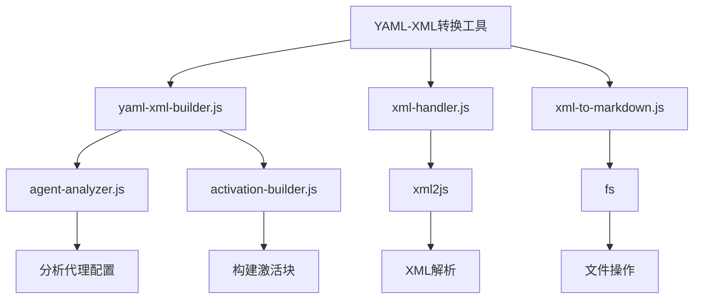
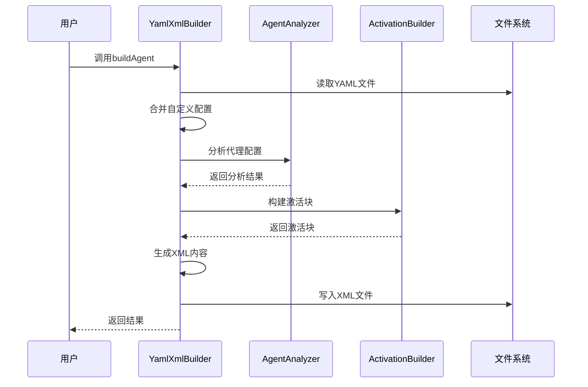
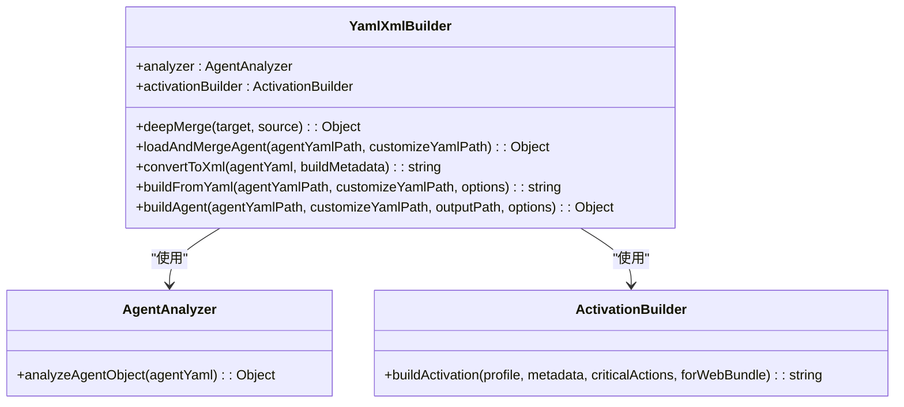
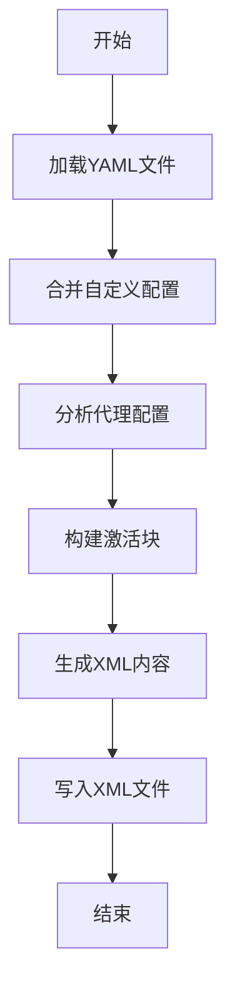
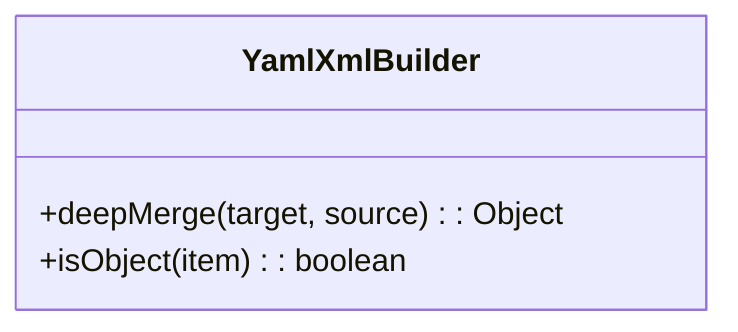
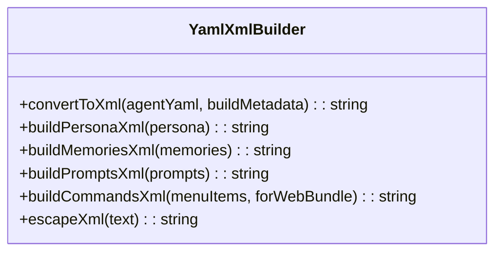
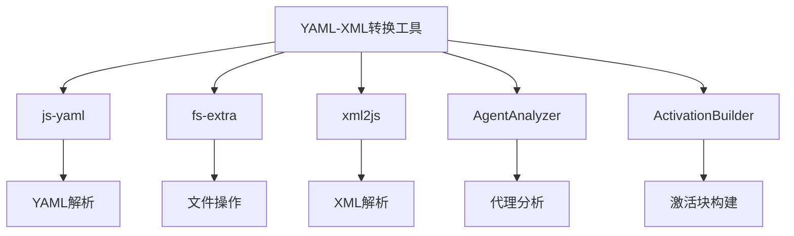

# YAML-XML转换工具

<cite>
**本文档引用的文件**   
- [yaml-xml-builder.js](file://tools/cli/lib/yaml-xml-builder.js)
- [xml-handler.js](file://tools/cli/lib/xml-handler.js)
- [xml-to-markdown.js](file://tools/cli/lib/xml-to-markdown.js)
- [agent-activation-ide.xml](file://src/utility/models/agent-activation-ide.xml)
- [agent-activation-web.xml](file://src/utility/models/agent-activation-web.xml)
- [activation-rules.xml](file://src/utility/models/fragments/activation-rules.xml)
- [handler-data.xml](file://src/utility/models/fragments/handler-data.xml)
- [bmad-web-orchestrator.agent.xml](file://src/core/agents/bmad-web-orchestrator.agent.xml)
- [pm.agent.yaml](file://src/modules/bmm/agents/pm.agent.yaml)
- [tea.agent.yaml](file://src/modules/bmm/agents/tea.agent.yaml)
</cite>

## 目录
1. [引言](#引言)
2. [项目结构](#项目结构)
3. [核心组件](#核心组件)
4. [架构概述](#架构概述)
5. [详细组件分析](#详细组件分析)
6. [依赖分析](#依赖分析)
7. [性能考虑](#性能考虑)
8. [故障排除指南](#故障排除指南)
9. [结论](#结论)

## 引言
YAML-XML转换工具是BMAD系统的核心组件，负责在YAML和XML格式之间进行双向序列化。该工具支持配置文件生成、工作流模板构建等场景，通过智能的格式兼容性处理和数据类型映射规则，确保数据在不同格式间的准确转换。本技术文档深入探讨其双向序列化策略、格式兼容性处理和数据类型映射规则。

## 项目结构
YAML-XML转换工具主要位于`tools/cli/lib/`目录下，核心文件为`yaml-xml-builder.js`。该工具与`xml-handler.js`和`xml-to-markdown.js`协同工作，实现完整的YAML-XML转换功能。转换规则和片段存储在`src/utility/models/`目录下，包括激活规则、处理器定义等。

**图表来源**
- [yaml-xml-builder.js](file://tools/cli/lib/yaml-xml-builder.js)
- [xml-handler.js](file://tools/cli/lib/xml-handler.js)
- [xml-to-markdown.js](file://tools/cli/lib/xml-to-markdown.js)

**章节来源**
- [yaml-xml-builder.js](file://tools/cli/lib/yaml-xml-builder.js)
- [xml-handler.js](file://tools/cli/lib/xml-handler.js)

## 核心组件
YAML-XML转换工具的核心组件包括`YamlXmlBuilder`类，负责YAML到XML的转换。该类通过`deepMerge`方法实现YAML文件的深度合并，支持自定义配置的覆盖。转换过程中，工具会分析代理配置，确定所需的处理器，并构建相应的激活块。

**章节来源**
- [yaml-xml-builder.js](file://tools/cli/lib/yaml-xml-builder.js)

## 架构概述
YAML-XML转换工具采用模块化架构，通过`YamlXmlBuilder`类封装转换逻辑。该类依赖`AgentAnalyzer`进行代理配置分析，`ActivationBuilder`构建激活块。转换过程包括加载和合并YAML文件、分析代理配置、构建激活块、生成XML内容等步骤。

**图表来源**
- [yaml-xml-builder.js](file://tools/cli/lib/yaml-xml-builder.js)
- [agent-analyzer.js](file://tools/cli/lib/agent-analyzer.js)
- [activation-builder.js](file://tools/cli/lib/activation-builder.js)

## 详细组件分析

### YamlXmlBuilder类分析
`YamlXmlBuilder`类是YAML-XML转换工具的核心，提供YAML到XML的转换功能。该类通过`buildAgent`方法实现完整的转换流程，包括文件读取、配置合并、激活块构建和XML生成。

#### 类图

**图表来源**
- [yaml-xml-builder.js](file://tools/cli/lib/yaml-xml-builder.js)
- [agent-analyzer.js](file://tools/cli/lib/agent-analyzer.js)
- [activation-builder.js](file://tools/cli/lib/activation-builder.js)

#### 转换流程分析
YAML-XML转换工具的转换流程包括以下步骤：
1. 加载和合并YAML文件
2. 分析代理配置
3. 构建激活块
4. 生成XML内容

**图表来源**
- [yaml-xml-builder.js](file://tools/cli/lib/yaml-xml-builder.js)

**章节来源**
- [yaml-xml-builder.js](file://tools/cli/lib/yaml-xml-builder.js)

### 格式兼容性处理
YAML-XML转换工具通过`deepMerge`方法实现YAML文件的深度合并，确保格式兼容性。该方法支持对象和数组的合并，对于数组采用追加而非替换的策略。

**图表来源**
- [yaml-xml-builder.js](file://tools/cli/lib/yaml-xml-builder.js)

### 数据类型映射规则
YAML-XML转换工具通过`convertToXml`方法实现数据类型映射。该方法将YAML中的各种数据类型转换为相应的XML元素和属性。

**图表来源**
- [yaml-xml-builder.js](file://tools/cli/lib/yaml-xml-builder.js)

## 依赖分析
YAML-XML转换工具依赖多个外部库和内部模块，包括`js-yaml`用于YAML解析，`fs-extra`用于文件操作，`xml2js`用于XML解析。内部依赖包括`AgentAnalyzer`和`ActivationBuilder`。

**图表来源**
- [yaml-xml-builder.js](file://tools/cli/lib/yaml-xml-builder.js)
- [xml-handler.js](file://tools/cli/lib/xml-handler.js)

**章节来源**
- [yaml-xml-builder.js](file://tools/cli/lib/yaml-xml-builder.js)
- [xml-handler.js](file://tools/cli/lib/xml-handler.js)

## 性能考虑
YAML-XML转换工具在性能方面进行了优化，包括缓存机制、异步操作和批量处理。`ActivationBuilder`类使用缓存来存储片段内容，避免重复读取文件。转换过程采用异步操作，提高效率。

## 故障排除指南
在使用YAML-XML转换工具时，可能会遇到以下问题：
- YAML语法错误：使用`yaml-lint`进行验证
- 文件路径错误：检查文件路径是否正确
- 依赖缺失：确保所有依赖已正确安装

**章节来源**
- [yaml-xml-builder.js](file://tools/cli/lib/yaml-xml-builder.js)
- [yaml-format.js](file://tools/cli/lib/yaml-format.js)

## 结论
YAML-XML转换工具通过智能的双向序列化策略、格式兼容性处理和数据类型映射规则，实现了YAML和XML格式之间的高效转换。该工具在配置文件生成、工作流模板构建等场景中具有重要应用价值，为BMAD系统的灵活性和可扩展性提供了有力支持。