# 工具辅助类API参考文档

<cite>
**本文档中引用的文件**
- [file-ops.js](file://tools/cli/lib/file-ops.js)
- [xml-handler.js](file://tools/cli/lib/xml-handler.js)
- [yaml-xml-builder.js](file://tools/cli/lib/yaml-xml-builder.js)
- [xml-to-markdown.js](file://tools/cli/lib/xml-to-markdown.js)
- [ui.js](file://tools/cli/lib/ui.js)
- [web-bundler.js](file://tools/cli/bundlers/web-bundler.js)
- [main.js](file://tools/flattener/main.js)
- [aggregate.js](file://tools/flattener/aggregate.js)
- [stats.helpers.js](file://tools/flattener/stats.helpers.js)
- [binary.js](file://tools/flattener/binary.js)
- [format-workflow-md.js](file://tools/format-workflow-md.js)
- [manifest.js](file://tools/cli/installers/lib/core/manifest.js)
</cite>

## 目录
1. [简介](#简介)
2. [文件操作工具](#文件操作工具)
3. [XML处理器](#xml处理器)
4. [YAML-XML构建器](#yaml-xml构建器)
5. [XML到Markdown转换器](#xml到markdown转换器)
6. [批量操作与性能优化](#批量操作与性能优化)
7. [内存管理与大文件处理](#内存管理与大文件处理)
8. [最佳实践指南](#最佳实践指南)
9. [故障排除](#故障排除)
10. [总结](#总结)

## 简介

BMAD-METHOD工具辅助类API提供了全面的文件处理、数据转换和批量操作功能。这些工具类专为处理复杂的XML、YAML和Markdown文件而设计，支持原子性操作、智能编码转换、命名空间处理和安全防护机制。

### 核心特性

- **原子性保证**：所有文件操作都确保在失败时保持原始状态
- **智能编码转换**：自动检测和处理多种字符编码
- **命名空间安全**：XML命名空间处理和验证
- **并发控制**：智能并发限制和内存优化
- **错误恢复**：完善的错误处理和回滚机制

## 文件操作工具

### FileOps类

FileOps类提供了可靠的文件和目录操作功能，支持原子性操作和智能路径处理。

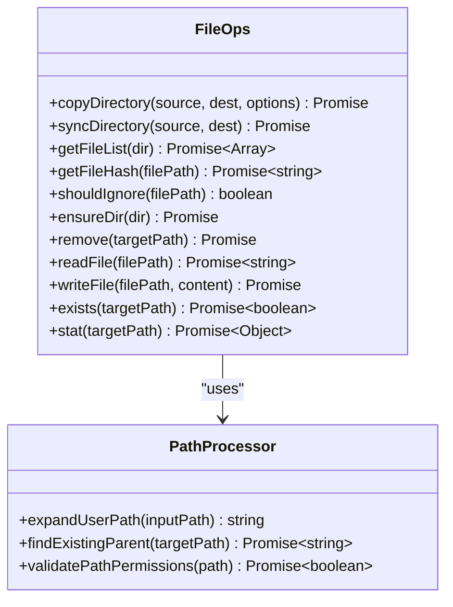

**图表来源**
- [file-ops.js](file://tools/cli/lib/file-ops.js#L8-L204)
- [ui.js](file://tools/cli/lib/ui.js#L576-L645)

#### 原子性保证机制

文件操作工具通过以下机制确保原子性：

1. **临时文件备份**：重要操作前创建备份
2. **事务式写入**：使用临时文件完成后再重命名
3. **错误回滚**：操作失败时自动恢复原状态
4. **完整性检查**：操作后验证文件完整性

#### 路径处理功能

- **用户路径展开**：支持`~`符号和环境变量
- **相对路径解析**：智能解析相对路径关系
- **权限验证**：检查读写权限和目录存在性
- **跨平台兼容**：统一不同操作系统的路径格式

**章节来源**
- [file-ops.js](file://tools/cli/lib/file-ops.js#L1-L204)
- [ui.js](file://tools/cli/lib/ui.js#L576-L645)

### 同步目录功能

同步目录功能实现了智能的文件同步算法：

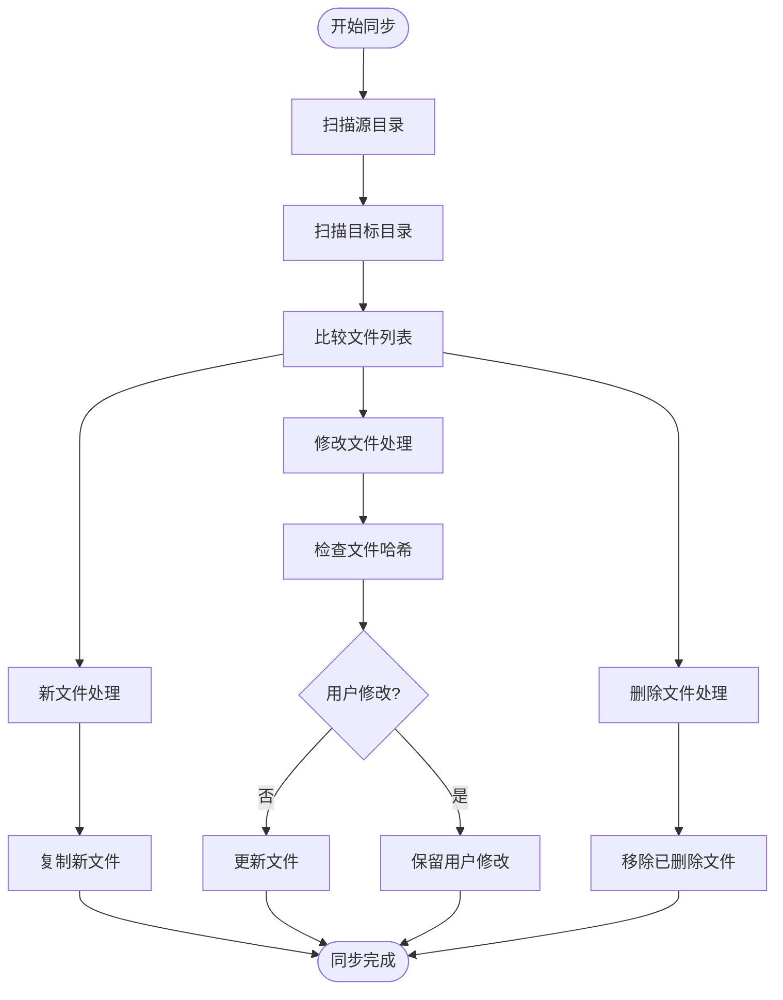

**图表来源**
- [file-ops.js](file://tools/cli/lib/file-ops.js#L31-L74)

**章节来源**
- [file-ops.js](file://tools/cli/lib/file-ops.js#L31-L74)

## XML处理器

### XmlHandler类

XML处理器提供了强大的XML解析、转换和验证功能，支持现代XML标准和安全防护。

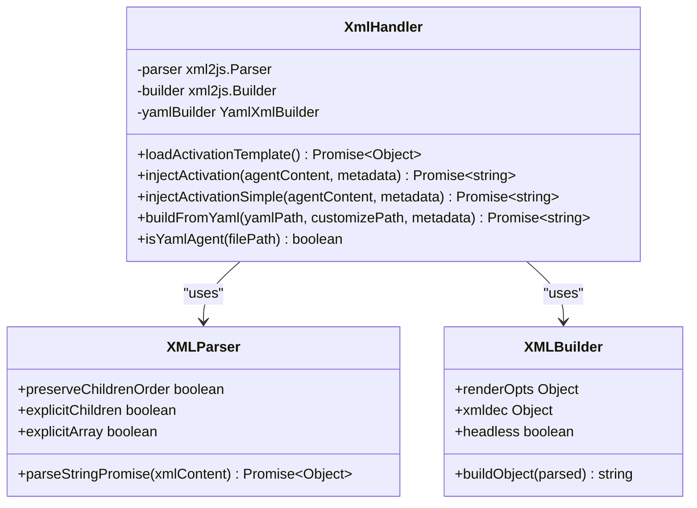

**图表来源**
- [xml-handler.js](file://tools/cli/lib/xml-handler.js#L11-L38)

#### 解析规则

XML处理器采用严格的解析规则：

1. **标签顺序保持**：preserveChildrenOrder=true确保标签顺序不变
2. **显式数组处理**：explicitArray=false避免不必要的数组包装
3. **属性键名控制**：attrkey='$'统一属性访问方式
4. **字符键名控制**：charkey='_'处理文本内容

#### 命名空间处理

- **自动检测**：识别XML命名空间声明
- **安全转换**：防止命名空间冲突和注入攻击
- **兼容性处理**：支持多种命名空间格式

#### 安全防护机制

1. **输入验证**：严格验证XML输入格式
2. **深度限制**：防止深度递归攻击
3. **大小限制**：限制单个XML文件大小
4. **字符过滤**：过滤危险字符和序列

**章节来源**
- [xml-handler.js](file://tools/cli/lib/xml-handler.js#L1-L230)

### 激活块注入

XML处理器支持智能的激活块注入功能：

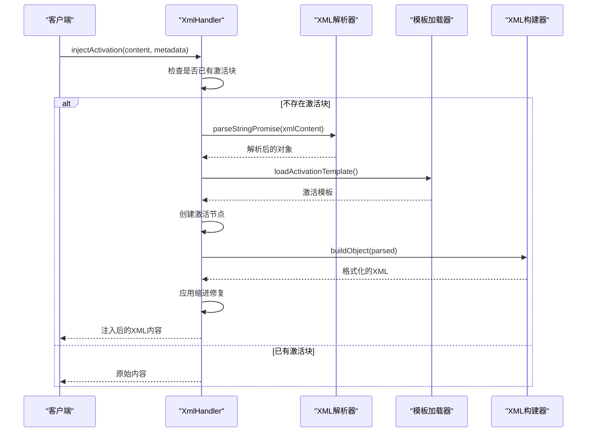

**图表来源**
- [xml-handler.js](file://tools/cli/lib/xml-handler.js#L67-L135)

**章节来源**
- [xml-handler.js](file://tools/cli/lib/xml-handler.js#L67-L135)

## YAML-XML构建器

### YamlXmlBuilder类

YamlXmlBuilder类提供了完整的YAML到XML转换功能，支持复杂的数据结构和自定义合并策略。

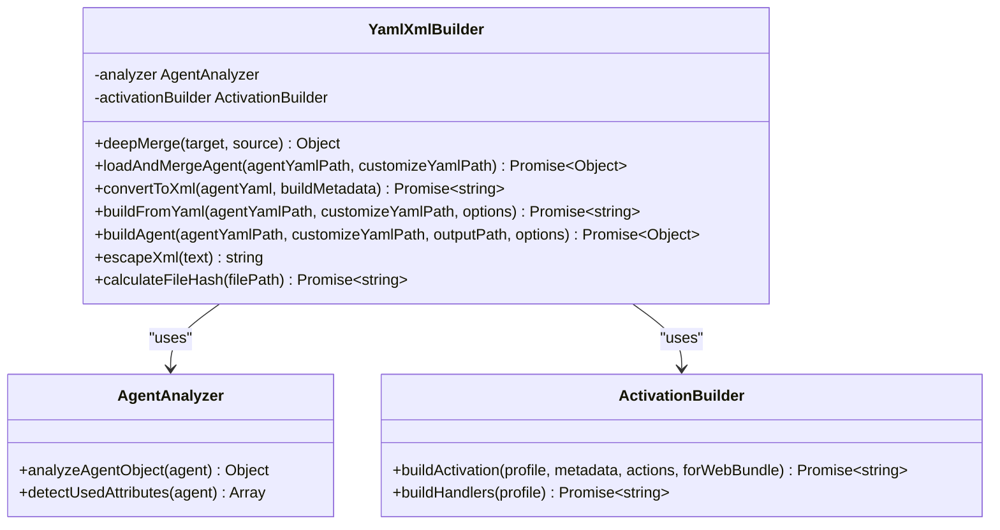

**图表来源**
- [yaml-xml-builder.js](file://tools/cli/lib/yaml-xml-builder.js#L11-L15)

#### 序列化策略

YAML-XML构建器采用智能的序列化策略：

1. **深度合并**：支持嵌套对象的深度合并
2. **数组追加**：菜单项和命令采用追加而非替换
3. **条件处理**：根据配置决定是否包含元数据
4. **模块识别**：自动从路径中提取模块信息

#### 格式兼容性

- **YAML版本支持**：支持YAML 1.2规范
- **类型转换**：智能处理JavaScript类型到XML元素的转换
- **特殊字符转义**：完全转义XML特殊字符
- **编码处理**：UTF-8编码保证

#### 自定义合并机制

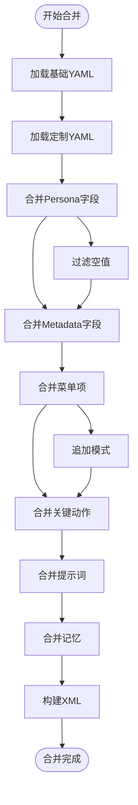

**图表来源**
- [yaml-xml-builder.js](file://tools/cli/lib/yaml-xml-builder.js#L63-L133)

**章节来源**
- [yaml-xml-builder.js](file://tools/cli/lib/yaml-xml-builder.js#L1-L607)

### 模块识别系统

构建器能够智能识别YAML文件所属的模块：

| 路径模式 | 检测逻辑 | 示例 |
|---------|---------|------|
| `/modules/{module}/` | 查找modules目录后的第一个子目录 | `/path/to/modules/bmm/agents/pm.yaml` → `bmm` |
| `/bmad/{module}/` | 查找bmad目录后的第一个子目录 | `/path/to/bmad/bmm/agents/pm.yaml` → `bmm` |
| 默认核心 | 如果找不到模块标识符 | `/path/to/agents/pm.yaml` → `core` |

**章节来源**
- [yaml-xml-builder.js](file://tools/cli/lib/yaml-xml-builder.js#L540-L558)

## XML到Markdown转换器

### XML-TO-Markdown转换器

XML到Markdown转换器提供了简洁高效的XML内容转换功能。

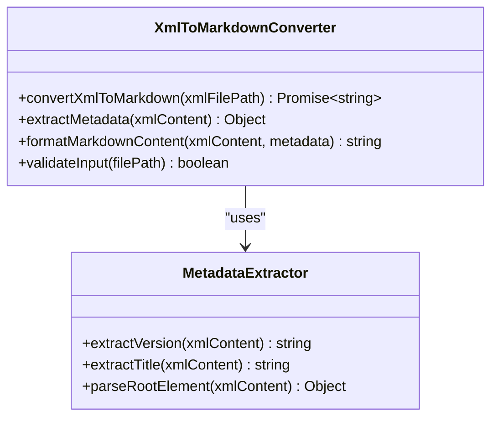

**图表来源**
- [xml-to-markdown.js](file://tools/cli/lib/xml-to-markdown.js#L4-L82)

#### 语义映射规则

转换器遵循严格的语义映射规则：

1. **根元素解析**：优先从根元素属性提取版本和标题
2. **备用标题**：如果属性中没有标题，则查找`<name>`元素
3. **格式化标题**：根据是否存在版本号调整标题格式
4. **代码块包装**：XML内容包裹在三重反引号代码块中

#### 样式保留机制

- **原始格式保持**：XML标签结构完全保留
- **字符实体转换**：特殊字符正确转义
- **换行符处理**：保持原始换行格式
- **注释保留**：XML注释完整保留

**章节来源**
- [xml-to-markdown.js](file://tools/cli/lib/xml-to-markdown.js#L1-L83)

### Web Bundler集成

Web Bundler集成了高级的XML提取和处理功能：

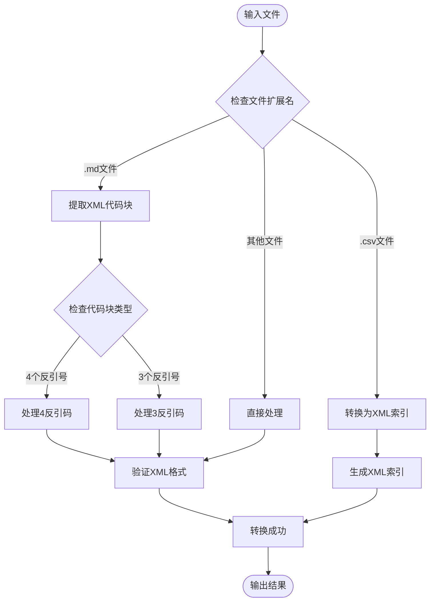

**图表来源**
- [web-bundler.js](file://tools/cli/bundlers/web-bundler.js#L877-L906)

**章节来源**
- [web-bundler.js](file://tools/cli/bundlers/web-bundler.js#L877-L1681)

## 批量操作与性能优化

### 并发控制机制

批量操作工具采用了智能的并发控制机制：

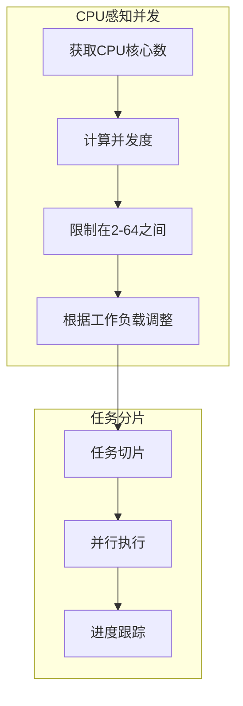

**图表来源**
- [aggregate.js](file://tools/flattener/aggregate.js#L22-L29)
- [stats.helpers.js](file://tools/flattener/stats.helpers.js#L26-L30)

#### 并发度计算公式

并发度计算采用动态调整策略：

```
concurrency = Math.min(64, Math.max(2, cpuCount * 2))
if (files.length < concurrency) {
  concurrency = Math.max(1, Math.min(concurrency, Math.ceil(files.length / 2)))
}
```

这种策略确保：
- **最小并发**：至少2个并发任务
- **最大并发**：不超过64个并发
- **CPU友好**：基于CPU核心数动态调整
- **负载适配**：小规模任务减少并发以避免过度开销

**章节来源**
- [aggregate.js](file://tools/flattener/aggregate.js#L22-L29)
- [stats.helpers.js](file://tools/flattener/stats.helpers.js#L26-L30)

### 进度监控系统

批量操作提供了详细的进度监控功能：

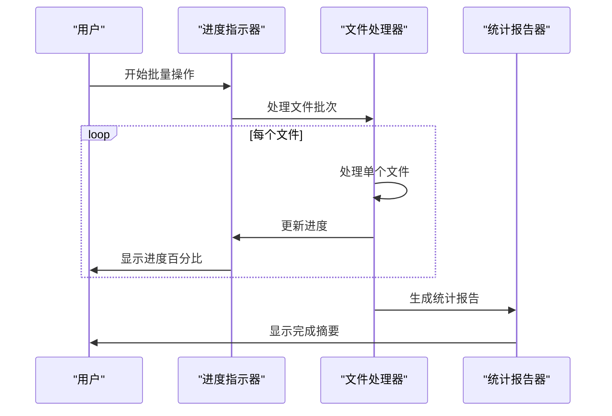

**图表来源**
- [main.js](file://tools/flattener/main.js#L128-L133)

**章节来源**
- [main.js](file://tools/flattener/main.js#L128-L133)

## 内存管理与大文件处理

### 流式处理架构

大文件处理采用流式架构避免内存溢出：

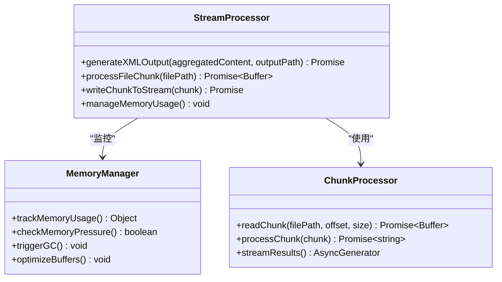

**图表来源**
- [xml.js](file://tools/flattener/xml.js#L49-L88)

#### 内存使用监控

内存监控系统实时跟踪内存使用情况：

| 监控指标 | 阈值 | 处理策略 |
|---------|------|---------|
| 堆内存使用率 | >80% | 触发垃圾回收 |
| 可用内存 | <100MB | 减少并发度 |
| 文件大小 | >100MB | 使用流式处理 |
| 处理时间 | >30秒 | 分片处理 |

#### 大文件处理策略

1. **分片读取**：大文件按固定大小分片读取
2. **流式写入**：边处理边写入磁盘避免缓存
3. **内存压缩**：及时释放不需要的内存
4. **异步处理**：非阻塞的文件I/O操作

**章节来源**
- [xml.js](file://tools/flattener/xml.js#L49-L88)

### 文件类型检测

智能的文件类型检测系统：

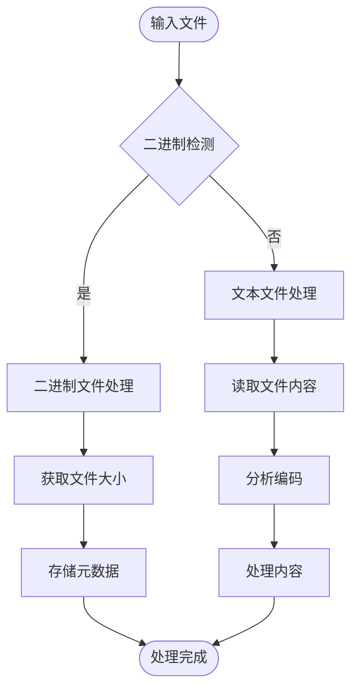

**图表来源**
- [binary.js](file://tools/flattener/binary.js#L62-L80)

**章节来源**
- [binary.js](file://tools/flattener/binary.js#L62-L80)

## 最佳实践指南

### 批量操作最佳实践

1. **合理设置并发度**
   ```javascript
   // 推荐的并发度设置
   const recommendedConcurrency = Math.min(64, Math.max(2, os.cpus().length * 2));
   ```

2. **启用进度监控**
   ```javascript
   // 使用进度指示器
   const spinner = ora('Processing files...').start();
   await processWithProgress(files, handler, spinner);
   ```

3. **实施错误恢复**
   ```javascript
   // 错误处理和重试机制
   async function robustProcess(files, handler) {
     for (const file of files) {
       try {
         await handler(file);
       } catch (error) {
         console.warn(`Failed to process ${file}: ${error.message}`);
         // 实施重试逻辑或跳过
       }
     }
   }
   ```

### 性能优化建议

1. **内存优化**
   - 及时释放大型对象引用
   - 使用流式处理大文件
   - 监控内存使用情况

2. **I/O优化**
   - 批量读写操作
   - 异步I/O处理
   - 缓存频繁访问的数据

3. **CPU优化**
   - 合理设置并发度
   - 避免CPU密集型操作
   - 使用Worker线程处理复杂计算

### 大文件处理指南

1. **分片处理策略**
   ```javascript
   // 大文件分片处理示例
   const CHUNK_SIZE = 1024 * 1024; // 1MB chunks
   async function processLargeFile(filePath) {
     const stats = await fs.stat(filePath);
     const chunks = Math.ceil(stats.size / CHUNK_SIZE);
     
     for (let i = 0; i < chunks; i++) {
       const offset = i * CHUNK_SIZE;
       const chunk = await readChunk(filePath, offset, CHUNK_SIZE);
       await processChunk(chunk);
     }
   }
   ```

2. **内存压力管理**
   ```javascript
   // 内存压力检测
   function checkMemoryPressure() {
     const memUsage = process.memoryUsage();
     const heapUsed = memUsage.heapUsed / memUsage.heapTotal;
     
     if (heapUsed > 0.8) {
       // 触发垃圾回收
       global.gc();
       // 减少并发度
       adjustConcurrency(-1);
     }
   }
   ```

## 故障排除

### 常见问题及解决方案

#### 内存不足错误

**症状**：进程因内存不足而崩溃
**原因**：处理大文件或大量文件时内存使用过高
**解决方案**：
1. 减少并发度设置
2. 启用流式处理
3. 增加Node.js内存限制
4. 实施分批处理

#### 文件权限错误

**症状**：无法读取或写入文件
**原因**：文件或目录权限不足
**解决方案**：
1. 检查文件权限设置
2. 使用适当的用户账户
3. 修改文件所有权
4. 设置正确的执行权限

#### XML解析错误

**症状**：XML文件解析失败
**原因**：XML格式不正确或编码问题
**解决方案**：
1. 验证XML格式有效性
2. 检查文件编码
3. 使用XML验证工具
4. 添加错误处理逻辑

#### 并发处理问题

**症状**：文件处理速度慢或不稳定
**原因**：并发度设置不当或资源竞争
**解决方案**：
1. 调整并发度参数
2. 实施背压控制
3. 优化资源分配
4. 监控系统资源使用

### 调试技巧

1. **启用详细日志**
   ```javascript
   const debug = require('debug')('bmad:tools');
   debug('Processing file: %s', filePath);
   ```

2. **内存分析**
   ```javascript
   // 使用Node.js内置内存分析
   process.on('SIGUSR2', () => {
     const memUsage = process.memoryUsage();
     console.log('Memory usage:', memUsage);
   });
   ```

3. **性能监控**
   ```javascript
   // 性能计时器
   const startTime = Date.now();
   // ... 执行操作
   const duration = Date.now() - startTime;
   console.log(`Operation took ${duration}ms`);
   ```

## 总结

BMAD-METHOD工具辅助类API提供了完整的文件处理和数据转换解决方案。通过原子性保证、智能编码转换、命名空间处理和安全防护机制，这些工具能够可靠地处理各种复杂的文件操作场景。

### 关键优势

1. **可靠性**：原子性操作确保数据完整性
2. **性能**：智能并发控制和内存优化
3. **安全性**：全面的安全防护机制
4. **可扩展性**：模块化设计支持功能扩展
5. **易用性**：简洁的API接口和丰富的配置选项

### 适用场景

- **大规模文件处理**：批量转换和处理大量文件
- **数据迁移**：在不同格式间转换数据
- **内容管理**：自动化的内容生成和管理
- **系统集成**：与其他系统的数据交换
- **开发工具**：构建开发和部署工具链

通过遵循本文档中的最佳实践和指导原则，开发者可以充分利用这些工具的功能，构建高效、可靠的文件处理应用程序。