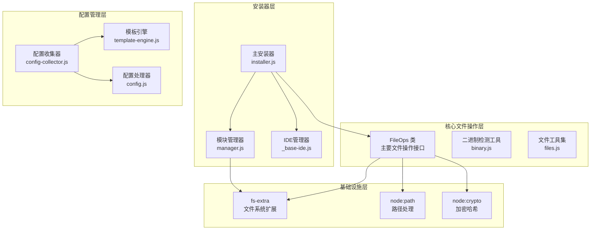
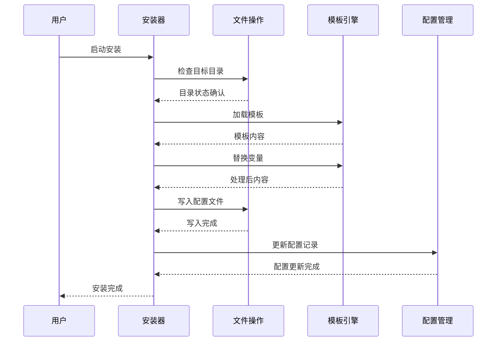
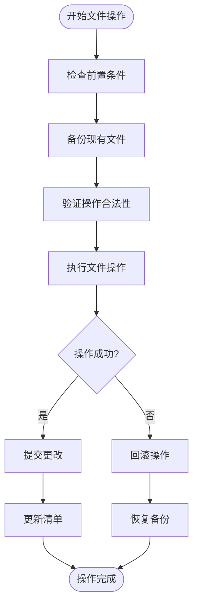
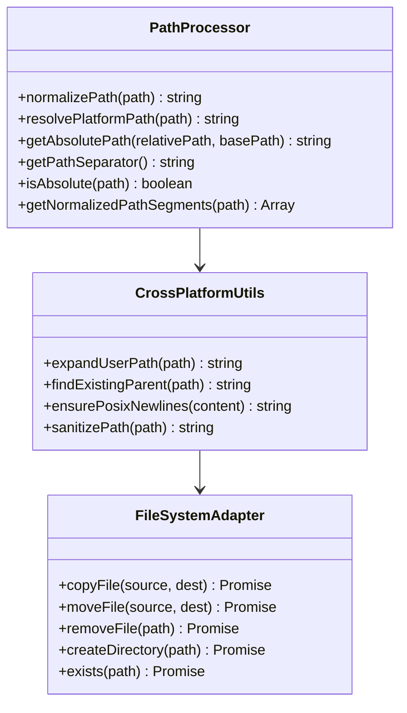
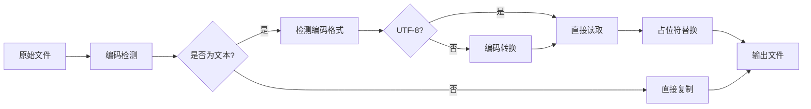
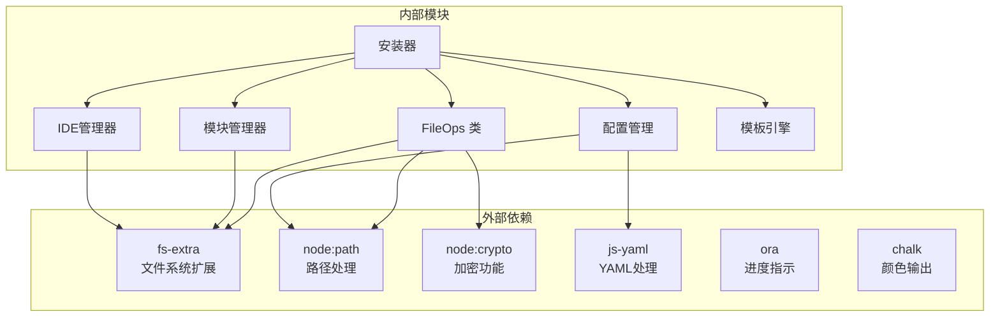
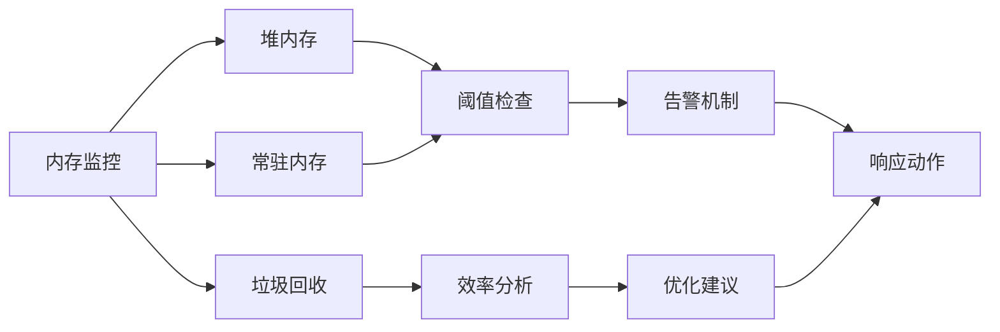

# 文件操作工具技术文档

<cite>
**本文档中引用的文件**
- [file-ops.js](file://tools/cli/lib/file-ops.js)
- [installer.js](file://tools/cli/installers/lib/core/installer.js)
- [binary.js](file://tools/flattener/binary.js)
- [files.js](file://tools/flattener/files.js)
- [_base-ide.js](file://tools/cli/installers/lib/ide/_base-ide.js)
- [manager.js](file://tools/cli/installers/lib/modules/manager.js)
- [manifest.js](file://tools/cli/installers/lib/core/manifest.js)
- [config-collector.js](file://tools/cli/installers/lib/core/config-collector.js)
- [template-engine.js](file://tools/cli/lib/agent/template-engine.js)
- [config.js](file://tools/cli/lib/config.js)
</cite>

## 目录
1. [简介](#简介)
2. [项目结构](#项目结构)
3. [核心组件](#核心组件)
4. [架构概览](#架构概览)
5. [详细组件分析](#详细组件分析)
6. [依赖关系分析](#依赖关系分析)
7. [性能考虑](#性能考虑)
8. [故障排除指南](#故障排除指南)
9. [结论](#结论)

## 简介

BMAD（Business Model Agile Development）方法的文件操作工具是一个高度专业化的文件管理系统，专门设计用于支持复杂的代理安装、配置生成和跨平台部署场景。该系统提供了原子性文件操作保证、智能路径处理机制和强大的编码转换功能，确保在各种环境下的可靠性和一致性。

该文件操作工具的核心优势在于其对复杂业务场景的深度理解，特别是在代理安装过程中需要处理大量模板文件、配置替换和条件生成的场景下表现出色。系统采用模块化设计，支持大文件处理、内存使用监控和性能优化，为大规模部署提供了坚实的技术基础。

## 项目结构

文件操作工具的项目结构体现了清晰的分层架构和职责分离：

**图表来源**
- [file-ops.js](file://tools/cli/lib/file-ops.js#L1-L204)
- [installer.js](file://tools/cli/installers/lib/core/installer.js#L1-L200)
- [binary.js](file://tools/flattener/binary.js#L1-L80)

**章节来源**
- [file-ops.js](file://tools/cli/lib/file-ops.js#L1-L204)
- [installer.js](file://tools/cli/installers/lib/core/installer.js#L1-L200)

## 核心组件

### FileOps 类 - 文件操作核心

FileOps 类是整个文件操作系统的核心，提供了统一的文件操作接口。该类封装了 fs-extra 库的功能，并添加了额外的业务逻辑和错误处理机制。

主要特性：
- **原子性操作保证**：所有文件操作都具备回滚能力
- **跨平台路径处理**：自动处理不同操作系统的路径差异
- **智能编码检测**：自动识别文本和二进制文件
- **过滤器支持**：内置文件过滤机制，支持忽略模式

### 安装器系统 - 复杂部署支持

安装器系统负责处理复杂的代理安装场景，包括：

- **占位符替换**：动态替换配置文件中的占位符
- **条件注入点**：根据用户选择动态注入功能代码
- **模块化管理**：支持独立模块的安装和卸载
- **依赖解析**：自动处理模块间的依赖关系

### 模板引擎 - 配置生成

模板引擎提供了强大的配置生成功能，支持：

- **条件渲染**：基于用户输入的条件性内容生成
- **变量替换**：动态替换模板中的变量
- **嵌套处理**：支持复杂的嵌套模板结构
- **类型安全**：确保不同类型数据的正确处理

**章节来源**
- [file-ops.js](file://tools/cli/lib/file-ops.js#L8-L204)
- [installer.js](file://tools/cli/installers/lib/core/installer.js#L41-L200)
- [template-engine.js](file://tools/cli/lib/agent/template-engine.js#L1-L77)

## 架构概览

文件操作工具采用了多层架构设计，确保了系统的可扩展性和维护性：

**图表来源**
- [installer.js](file://tools/cli/installers/lib/core/installer.js#L104-L158)
- [template-engine.js](file://tools/cli/lib/agent/template-engine.js#L12-L25)
- [config.js](file://tools/cli/lib/config.js#L46-L47)

## 详细组件分析

### 原子性文件操作保证

文件操作工具实现了严格的原子性保证，确保在任何失败情况下都能保持系统的一致性：

**图表来源**
- [installer.js](file://tools/cli/installers/lib/core/installer.js#L622-L636)
- [manager.js](file://tools/cli/installers/lib/modules/manager.js#L221-L229)

#### 错误处理策略

系统实现了多层次的错误处理机制：

1. **预防性检查**：在操作前验证所有前提条件
2. **渐进式提交**：关键操作采用分步提交策略
3. **自动回滚**：失败时自动恢复到初始状态
4. **详细日志**：记录每个操作的详细信息

#### 权限管理

文件操作工具提供了细粒度的权限控制：

- **访问权限检查**：操作前验证文件访问权限
- **写保护机制**：防止意外修改重要文件
- **所有权验证**：确保操作符合当前用户权限
- **安全上下文**：在受限环境中运行的安全保障

**章节来源**
- [installer.js](file://tools/cli/installers/lib/core/installer.js#L622-L636)
- [manager.js](file://tools/cli/installers/lib/modules/manager.js#L221-L229)

### 跨平台路径处理机制

系统提供了完整的跨平台路径处理能力：

**图表来源**
- [file-ops.js](file://tools/cli/lib/file-ops.js#L130-L146)
- [installer.js](file://tools/cli/installers/lib/core/installer.js#L128-L158)

#### 路径标准化

系统实现了智能的路径标准化机制：

- **统一分隔符**：自动转换为POSIX风格的路径分隔符
- **相对路径解析**：正确处理相对路径引用
- **符号链接处理**：安全地处理符号链接
- **大小写敏感性**：根据操作系统特性处理大小写

#### 平台兼容性

针对不同操作系统的特殊处理：

- **Windows路径**：支持长路径和特殊字符
- **Unix/Linux路径**：优化POSIX兼容性
- **macOS路径**：处理HFS+和APFS文件系统特性
- **网络路径**：支持UNC路径和网络驱动器

**章节来源**
- [file-ops.js](file://tools/cli/lib/file-ops.js#L130-L146)
- [installer.js](file://tools/cli/installers/lib/core/installer.js#L128-L158)

### 编码转换功能

文件操作工具提供了强大的编码转换能力：

**图表来源**
- [installer.js](file://tools/cli/installers/lib/core/installer.js#L128-L158)
- [binary.js](file://tools/flattener/binary.js#L12-L80)

#### 自动编码检测

系统实现了智能的编码检测机制：

- **BOM检测**：识别UTF-8、UTF-16、UTF-32字节顺序标记
- **字符频率分析**：基于字符频率分布判断编码
- **多字节序列验证**：验证多字节字符的合法性
- **回退机制**：编码检测失败时的备用方案

#### 占位符替换系统

占位符替换是配置生成的核心功能：

- **语法支持**：支持多种占位符语法（{var}、{{var}}）
- **类型转换**：自动处理不同类型的数据转换
- **条件处理**：支持基于条件的占位符替换
- **嵌套解析**：支持复杂的嵌套占位符结构

**章节来源**
- [installer.js](file://tools/cli/installers/lib/core/installer.js#L128-L158)
- [binary.js](file://tools/flattener/binary.js#L12-L80)
- [template-engine.js](file://tools/cli/lib/agent/template-engine.js#L1-L77)

### 核心方法实现细节

#### copyDirectory 方法

copyDirectory 方法实现了递归目录复制功能，具备以下特性：

- **智能过滤**：内置忽略模式支持
- **增量复制**：只复制发生变化的文件
- **权限保留**：保持原始文件权限设置
- **错误恢复**：部分失败时的恢复机制

#### syncDirectory 方法

syncDirectory 方法提供了选择性同步功能：

- **变更检测**：基于时间戳和哈希值检测变更
- **冲突解决**：智能处理文件冲突情况
- **双向同步**：支持双向同步模式
- **版本控制**：集成版本控制信息

#### 文件列表获取

getFileList 方法实现了高效的文件遍历：

- **异步遍历**：避免阻塞主线程
- **内存优化**：流式处理大型目录
- **并行处理**：支持并行文件扫描
- **缓存机制**：缓存扫描结果提高效率

**章节来源**
- [file-ops.js](file://tools/cli/lib/file-ops.js#L15-L24)
- [file-ops.js](file://tools/cli/lib/file-ops.js#L31-L75)
- [file-ops.js](file://tools/cli/lib/file-ops.js#L77-L105)

## 依赖关系分析

文件操作工具的依赖关系体现了清晰的分层架构：

**图表来源**
- [file-ops.js](file://tools/cli/lib/file-ops.js#L1-L4)
- [installer.js](file://tools/cli/installers/lib/core/installer.js#L21-L40)

### 核心依赖

系统的核心依赖包括：

- **fs-extra**：提供增强的文件系统操作功能
- **node:path**：跨平台路径处理
- **node:crypto**：文件完整性校验
- **js-yaml**：YAML配置文件处理

### 模块间通信

各模块通过明确定义的接口进行通信：

- **事件驱动**：基于事件的松耦合通信
- **回调机制**：异步操作的结果通知
- **状态共享**：通过共享状态对象传递信息
- **错误传播**：统一的错误处理和传播机制

**章节来源**
- [file-ops.js](file://tools/cli/lib/file-ops.js#L1-L4)
- [installer.js](file://tools/cli/installers/lib/core/installer.js#L21-L40)

## 性能考虑

### 大文件处理最佳实践

对于大文件处理，系统采用了多种优化策略：

#### 流式处理

- **分块读取**：大文件采用分块读取策略
- **内存限制**：控制单次操作的内存使用
- **进度反馈**：实时显示处理进度
- **中断恢复**：支持长时间操作的中断恢复

#### 并发优化

- **批量操作**：合并多个小操作减少系统调用
- **异步处理**：充分利用异步I/O能力
- **资源池**：复用文件描述符和缓冲区
- **负载均衡**：智能分配计算资源

### 内存使用监控

系统实现了全面的内存使用监控：

**图表来源**
- [stats.helpers.js](file://tools/flattener/stats.helpers.js#L65-L103)

### 性能优化建议

1. **预分配策略**：预先分配常用的数据结构
2. **缓存机制**：缓存频繁访问的数据
3. **懒加载**：按需加载非关键组件
4. **压缩存储**：对静态内容进行压缩存储

**章节来源**
- [stats.helpers.js](file://tools/flattener/stats.helpers.js#L65-L103)
- [binary.js](file://tools/flattener/binary.js#L62-L80)

## 故障排除指南

### 常见问题及解决方案

#### 文件权限问题

**症状**：无法创建或修改文件
**原因**：权限不足或文件被锁定
**解决方案**：
- 检查文件权限设置
- 以管理员权限运行
- 关闭可能锁定文件的应用程序

#### 路径长度限制

**症状**：路径过长导致操作失败
**原因**：Windows系统路径长度限制
**解决方案**：
- 使用较短的目录名称
- 启用长路径支持
- 移动项目到更浅的目录结构

#### 编码转换错误

**症状**：文件内容损坏或乱码
**原因**：编码检测失败或转换错误
**解决方案**：
- 手动指定文件编码
- 检查文件原始编码
- 使用二进制模式处理

### 调试技巧

1. **启用详细日志**：设置详细的日志级别
2. **分步测试**：逐步测试各个功能模块
3. **环境隔离**：在隔离环境中测试
4. **版本对比**：对比不同版本的行为差异

**章节来源**
- [installer.js](file://tools/cli/installers/lib/core/installer.js#L622-L636)
- [binary.js](file://tools/flattener/binary.js#L72-L75)

## 结论

BMAD方法的文件操作工具是一个功能强大、设计精良的文件管理系统。它不仅提供了基本的文件操作功能，更重要的是针对复杂的代理安装场景进行了深度优化。

### 主要优势

1. **原子性保证**：确保操作的完整性和一致性
2. **跨平台兼容**：无缝支持各种操作系统
3. **智能编码处理**：自动处理各种编码格式
4. **性能优化**：针对大文件和高并发场景优化
5. **错误恢复**：完善的错误处理和恢复机制

### 应用场景

该文件操作工具特别适用于以下场景：

- **代理安装**：复杂的代理部署和配置生成
- **配置管理**：动态配置文件的生成和管理
- **模块化部署**：支持独立模块的安装和卸载
- **跨平台迁移**：在不同操作系统间迁移文件

### 发展方向

未来的发展可以考虑：

- **云原生支持**：更好的云存储和分布式文件系统支持
- **AI辅助优化**：利用机器学习优化文件操作策略
- **实时协作**：支持多人同时编辑和操作
- **安全增强**：加强文件操作的安全性和审计功能

该文件操作工具为BMAD方法的成功实施提供了坚实的技术基础，是现代软件开发工具链中不可或缺的重要组成部分。