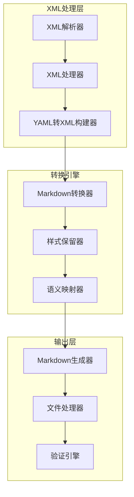
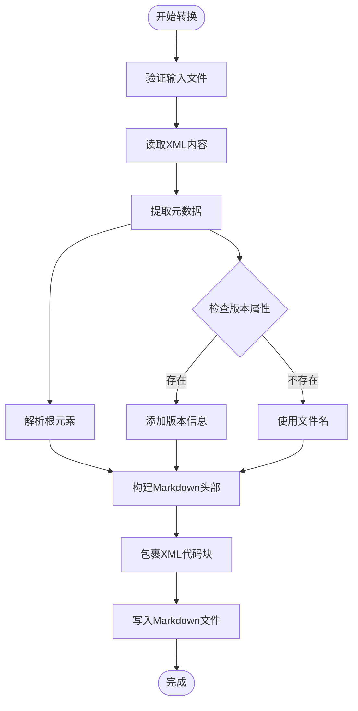
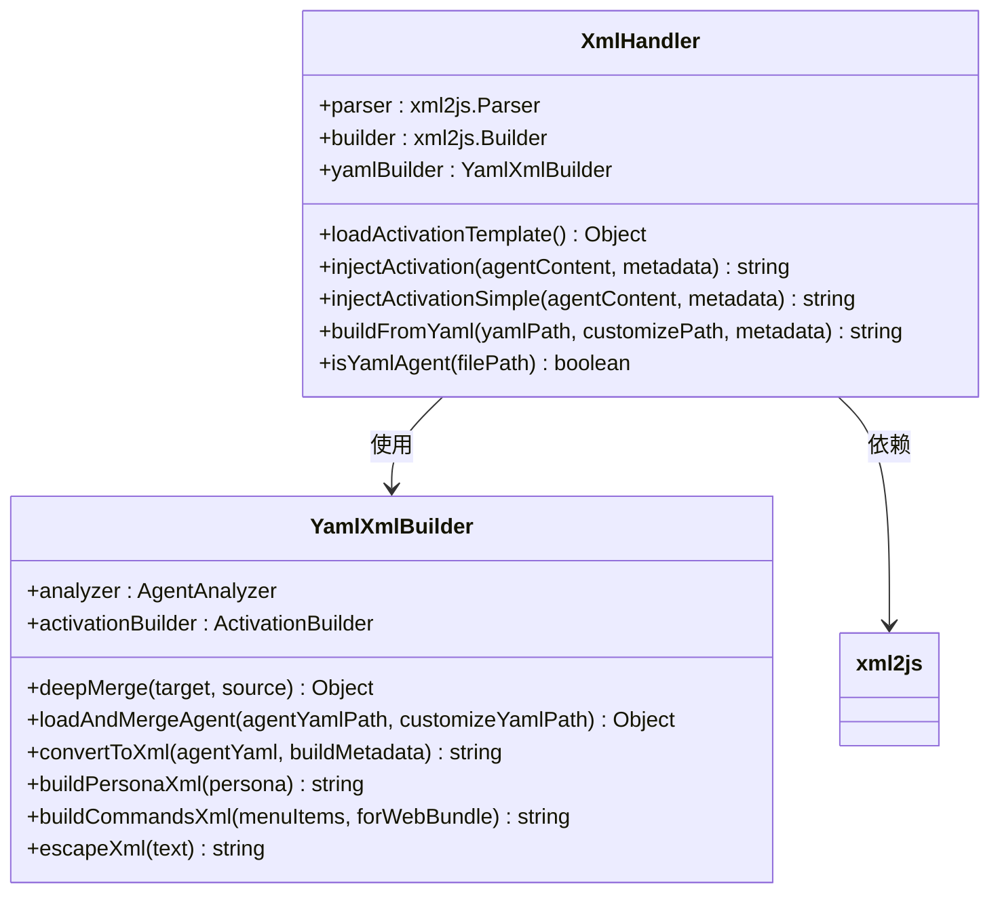
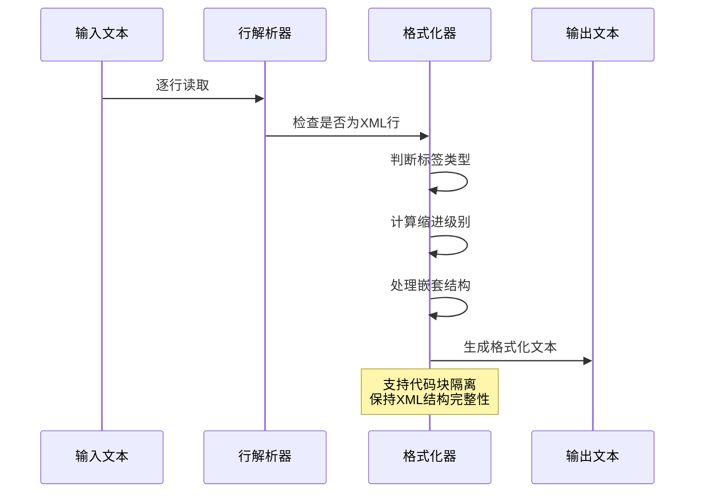
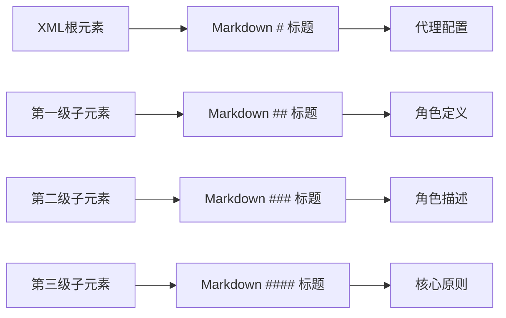
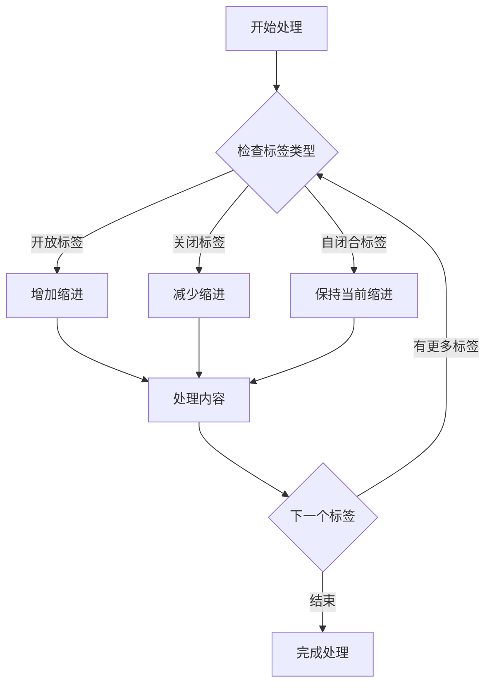
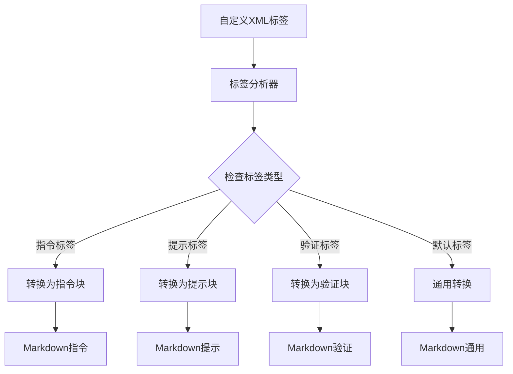
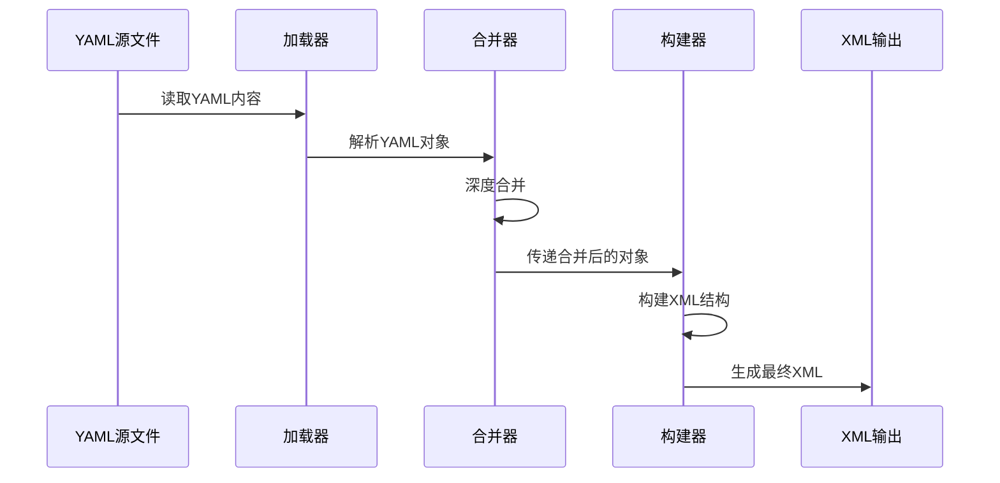
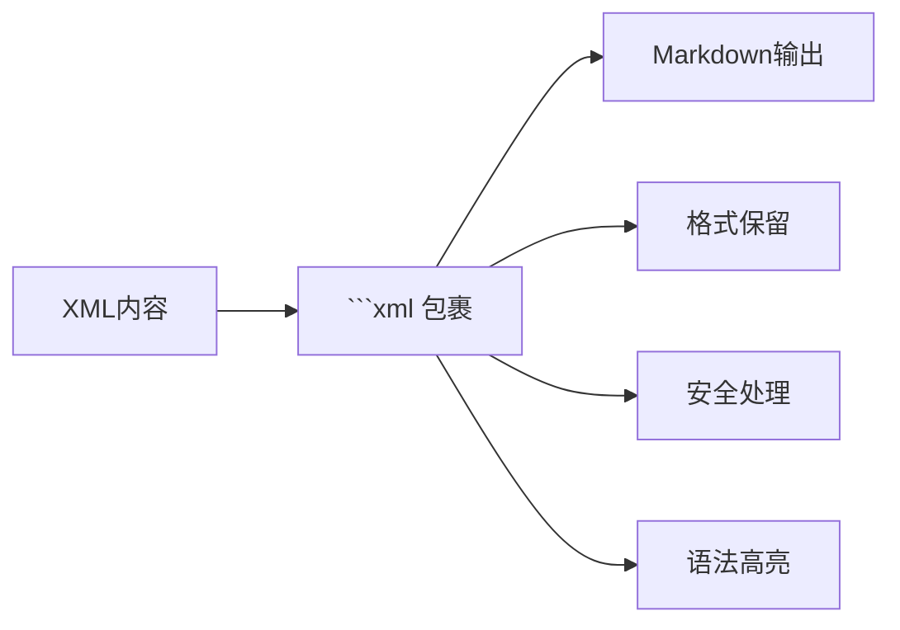
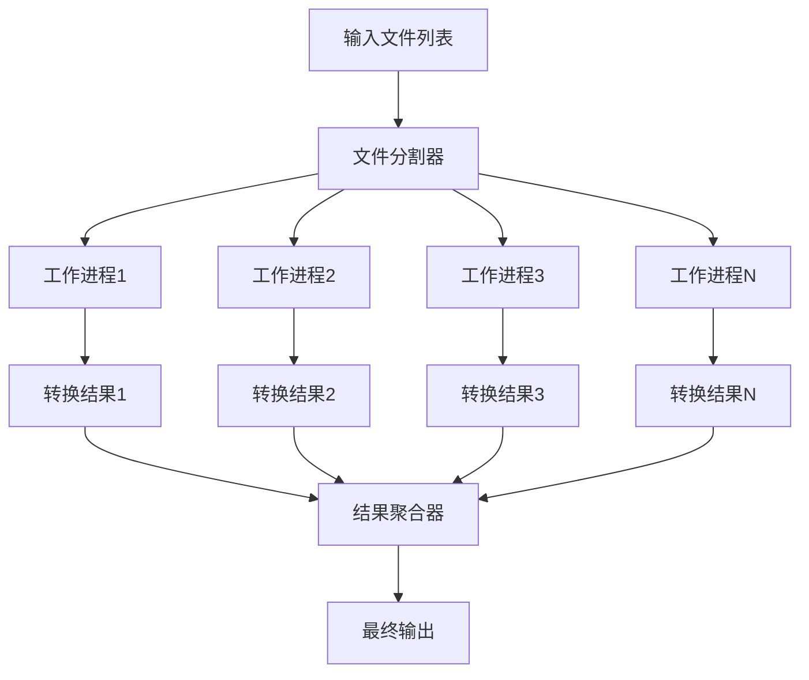

# XML到Markdown转换器技术文档

<cite>
**本文档中引用的文件**
- [xml-to-markdown.js](file://tools/cli/lib/xml-to-markdown.js)
- [xml-handler.js](file://tools/cli/lib/xml-handler.js)
- [yaml-xml-builder.js](file://tools/cli/lib/yaml-xml-builder.js)
- [format-workflow-md.js](file://tools/format-workflow-md.js)
- [index-docs.xml](file://src/core/tasks/index-docs.xml)
- [advanced-elicitation.xml](file://src/core/tasks/advanced-elicitation.xml)
- [bmad-web-orchestrator.agent.xml](file://src/core/agents/bmad-web-orchestrator.agent.xml)
- [agent-activation-ide.xml](file://src/utility/models/agent-activation-ide.xml)
- [web-bundler.js](file://tools/cli/bundlers/web-bundler.js)
- [manifest.js](file://tools/cli/installers/lib/core/manifest.js)
</cite>

## 目录
1. [概述](#概述)
2. [项目架构](#项目架构)
3. [核心组件分析](#核心组件分析)
4. [语义映射规则](#语义映射规则)
5. [样式保留机制](#样式保留机制)
6. [结构转换策略](#结构转换策略)
7. [特殊字符处理](#特殊字符处理)
8. [性能优化](#性能优化)
9. [使用示例](#使用示例)
10. [故障排除指南](#故障排除指南)
11. [总结](#总结)

## 概述

BMAD-METHOD项目中的XML到Markdown转换器是一个强大的工具集，专门设计用于将XML格式的配置文件和文档转换为Markdown格式，以便于阅读、分享和进一步处理。该转换器支持多种XML结构，包括代理配置、工作流定义、任务规范等，并提供了丰富的语义映射和样式保留功能。

### 主要特性

- **智能语义映射**：自动识别XML元素并映射到相应的Markdown语法
- **样式保留**：保持原始XML的结构化信息和视觉层次
- **多格式支持**：支持XML、YAML、JSON等多种输入格式
- **自定义扩展**：支持自定义XML标签到Markdown扩展语法的映射
- **性能优化**：高效的解析和转换算法

## 项目架构



**图表来源**
- [xml-handler.js](file://tools/cli/lib/xml-handler.js#L1-L230)
- [yaml-xml-builder.js](file://tools/cli/lib/yaml-xml-builder.js#L1-L607)
- [xml-to-markdown.js](file://tools/cli/lib/xml-to-markdown.js#L1-L83)

## 核心组件分析

### XML到Markdown转换器

主要的转换器位于[`xml-to-markdown.js`](file://tools/cli/lib/xml-to-markdown.js)，它提供了基础的XML到Markdown转换功能。

#### 转换流程



**图表来源**
- [xml-to-markdown.js](file://tools/cli/lib/xml-to-markdown.js#L4-L51)

#### 关键功能

1. **文件验证**：确保输入是有效的XML文件
2. **元数据提取**：从XML根元素中提取标题和版本信息
3. **智能命名**：根据XML内容生成合适的Markdown文件名
4. **格式化输出**：将XML内容包裹在代码块中以保持格式

**章节来源**
- [xml-to-markdown.js](file://tools/cli/lib/xml-to-markdown.js#L4-L51)

### XML处理器

[`xml-handler.js`](file://tools/cli/lib/xml-handler.js) 提供了更复杂的XML处理功能，包括YAML到XML的转换和激活块注入。

#### 处理器架构



**图表来源**
- [xml-handler.js](file://tools/cli/lib/xml-handler.js#L11-L229)
- [yaml-xml-builder.js](file://tools/cli/lib/yaml-xml-builder.js#L11-L607)

**章节来源**
- [xml-handler.js](file://tools/cli/lib/xml-handler.js#L11-L229)
- [yaml-xml-builder.js](file://tools/cli/lib/yaml-xml-builder.js#L11-L607)

### 工作流格式化器

[`format-workflow-md.js`](file://tools/format-workflow-md.js) 提供了高级的XML格式化功能，特别适用于工作流文档的处理。

#### 格式化算法



**图表来源**
- [format-workflow-md.js](file://tools/format-workflow-md.js#L57-L119)

**章节来源**
- [format-workflow-md.js](file://tools/format-workflow-md.js#L57-L119)

## 语义映射规则

### 基本元素映射

XML到Markdown的语义映射遵循以下规则：

| XML元素 | Markdown语法 | 映射规则 |
|---------|-------------|----------|
| `<agent>` | `# Agent Title` | 根元素映射为一级标题 |
| `<persona>` | `## Persona` | 组件标题映射为二级标题 |
| `<role>` | `### Role` | 角色定义映射为三级标题 |
| `<step>` | `- Step X. Description` | 步骤映射为有序列表 |
| `<item>` | `- [Trigger] Description` | 菜单项映射为无序列表 |
| `<prompt>` | ````xml<br/>Prompt Content<br/>```` | 提示内容包裹在XML代码块中 |

### 标题层级转换



**图表来源**
- [xml-to-markdown.js](file://tools/cli/lib/xml-to-markdown.js#L39-L40)

### 列表转换规则

XML中的列表结构被智能识别并转换为Markdown格式：

1. **有序列表**：`<step>`元素转换为编号列表
2. **无序列表**：`<item>`和`<menu>`元素转换为项目符号列表
3. **嵌套列表**：通过缩进级别自动识别嵌套关系

**章节来源**
- [xml-to-markdown.js](file://tools/cli/lib/xml-to-markdown.js#L39-L40)

## 样式保留机制

### XML代码块保留

转换器通过将XML内容包裹在三重反引号代码块中来保留原始格式：

```javascript
// 示例转换过程
const markdownContent = `${heading}\n\n\`\`\`xml\n${xmlContent}\n\`\`\``;
```

这种机制确保：
- XML标签的原始格式得以保留
- 特殊字符不会被Markdown解析器误处理
- 代码高亮支持（如果目标平台支持）

### 缩进和格式保持

对于复杂的XML结构，转换器实现了智能的缩进系统：



**图表来源**
- [format-workflow-md.js](file://tools/format-workflow-md.js#L106-L167)

**章节来源**
- [format-workflow-md.js](file://tools/format-workflow-md.js#L106-L167)

### 特殊字符转义

XML中的特殊字符被安全地转义为HTML实体：

| XML字符 | 转义序列 | Markdown兼容性 |
|---------|----------|----------------|
| `&` | `&amp;` | 完全兼容 |
| `<` | `&lt;` | 完全兼容 |
| `>` | `&gt;` | 完全兼容 |
| `"` | `&quot;` | 完全兼容 |
| `'` | `&apos;` | 完全兼容 |

**章节来源**
- [yaml-xml-builder.js](file://tools/cli/lib/yaml-xml-builder.js#L501-L511)

## 结构转换策略

### 自定义XML标签映射

转换器支持将自定义XML标签映射到Markdown扩展语法：



**图表来源**
- [yaml-xml-builder.js](file://tools/cli/lib/yaml-xml-builder.js#L342-L409)

### 激活块注入

对于代理配置文件，转换器支持智能的激活块注入：

1. **模板加载**：从预定义模板加载激活结构
2. **位置检测**：自动定位插入点
3. **内容注入**：将激活块插入到正确的位置
4. **格式维护**：保持原有格式和缩进

**章节来源**
- [xml-handler.js](file://tools/cli/lib/xml-handler.js#L61-L136)

### YAML到XML转换

[`yaml-xml-builder.js`](file://tools/cli/lib/yaml-xml-builder.js) 提供了从YAML格式到XML格式的双向转换能力：

#### 转换流程



**图表来源**
- [yaml-xml-builder.js](file://tools/cli/lib/yaml-xml-builder.js#L532-L576)

**章节来源**
- [yaml-xml-builder.js](file://tools/cli/lib/yaml-xml-builder.js#L532-L576)

## 特殊字符处理

### XML实体转义

转换器实现了全面的XML实体转义机制：

```javascript
// 转义函数实现
escapeXml(text) {
  if (!text) return '';
  return text
    .replaceAll('&', '&amp;')
    .replaceAll('<', '&lt;')
    .replaceAll('>', '&gt;')
    .replaceAll('"', '&quot;')
    .replaceAll("'", '&apos;');
}
```

### 文本内容处理

对于XML中的纯文本内容，转换器采用以下策略：

1. **空格保留**：保持原始的空白字符
2. **换行处理**：智能处理段落分隔
3. **特殊标记**：识别并正确处理XML特殊标记

**章节来源**
- [yaml-xml-builder.js](file://tools/cli/lib/yaml-xml-builder.js#L501-L511)

### 代码块隔离

为了防止XML内容被错误解析，转换器将所有XML内容隔离在代码块中：



**图表来源**
- [xml-to-markdown.js](file://tools/cli/lib/xml-to-markdown.js#L44-L46)

## 性能优化

### 内存管理

转换器采用了多种内存优化策略：

1. **流式处理**：对于大型文件，采用流式读取而非一次性加载
2. **缓存机制**：缓存常用的模板和配置
3. **垃圾回收**：及时释放不再需要的对象引用

### 并发处理

对于批量转换任务，转换器支持并发处理：



### 缓存策略

转换器实现了多层次的缓存机制：

1. **文件哈希缓存**：基于文件内容哈希的缓存
2. **模板缓存**：预编译的XML模板缓存
3. **解析结果缓存**：避免重复解析相同内容

**章节来源**
- [yaml-xml-builder.js](file://tools/cli/lib/yaml-xml-builder.js#L514-L523)

## 使用示例

### 基础XML到Markdown转换

```bash
# 基本转换命令
node tools/cli/lib/xml-to-markdown.js src/core/agents/example.agent.xml

# 批量转换多个文件
find src -name "*.xml" -exec node tools/cli/lib/xml-to-markdown.js {} \;
```

### 高级YAML到XML转换

```javascript
// 使用YamlXmlBuilder进行转换
const { YamlXmlBuilder } = require('./tools/cli/lib/yaml-xml-builder');

const builder = new YamlXmlBuilder();
const xmlContent = await builder.buildFromYaml(
  'src/modules/bmm/agents/pm.agent.yaml',
  'src/customizations/pm.customize.yaml',
  { includeMetadata: true }
);
```

### 工作流文档格式化

```bash
# 格式化工作流文档
node tools/format-workflow-md.js src/modules/bmm/workflows/**/*.md --verbose
```

### 知识库构建场景

在构建知识库时，转换器可以：

1. **自动提取文档**：从XML配置中提取结构化信息
2. **生成索引**：创建文档的交叉引用和索引
3. **维护一致性**：确保所有文档遵循统一的格式标准

**章节来源**
- [xml-to-markdown.js](file://tools/cli/lib/xml-to-markdown.js#L54-L82)

## 故障排除指南

### 常见问题及解决方案

#### 1. 文件格式不匹配

**问题**：输入文件不是有效的XML格式
**解决方案**：
```javascript
// 添加格式验证
if (!xmlFilePath.endsWith('.xml')) {
  throw new Error('Input file must be an XML file');
}
```

#### 2. 元数据提取失败

**问题**：无法从XML根元素提取标题和版本信息
**解决方案**：
- 检查XML根元素是否包含`name`或`title`属性
- 确保XML格式符合预期结构

#### 3. 字符编码问题

**问题**：特殊字符显示异常
**解决方案**：
- 确保输入文件使用UTF-8编码
- 使用内置的转义机制处理特殊字符

#### 4. 性能问题

**问题**：处理大型XML文件时性能不佳
**解决方案**：
- 启用流式处理模式
- 实施分批处理策略
- 使用适当的缓存机制

### 调试技巧

1. **启用详细日志**：使用`--verbose`标志获取详细输出
2. **检查中间结果**：保存转换过程中的中间文件
3. **验证输出格式**：使用Markdown验证工具检查输出质量

**章节来源**
- [xml-to-markdown.js](file://tools/cli/lib/xml-to-markdown.js#L54-L82)

## 总结

BMAD-METHOD的XML到Markdown转换器是一个功能强大且灵活的工具，它不仅能够准确地转换XML结构到Markdown格式，还提供了丰富的语义映射和样式保留功能。通过智能的解析算法、完善的特殊字符处理机制和高效的性能优化策略，该转换器能够满足各种复杂的文档转换需求。

### 主要优势

1. **准确性**：精确的语义映射确保转换结果的准确性
2. **灵活性**：支持多种XML结构和自定义标签
3. **性能**：优化的算法保证高效处理
4. **可扩展性**：模块化设计便于功能扩展

### 应用前景

该转换器在以下场景中具有广阔的应用前景：

- **文档管理系统**：自动化文档格式转换
- **知识库构建**：从结构化配置生成可读文档
- **API文档生成**：从XML配置自动生成API文档
- **培训材料制作**：将复杂配置转换为教学材料

通过持续的功能增强和性能优化，这个转换器将继续为BMAD-METHOD生态系统提供强有力的支持。