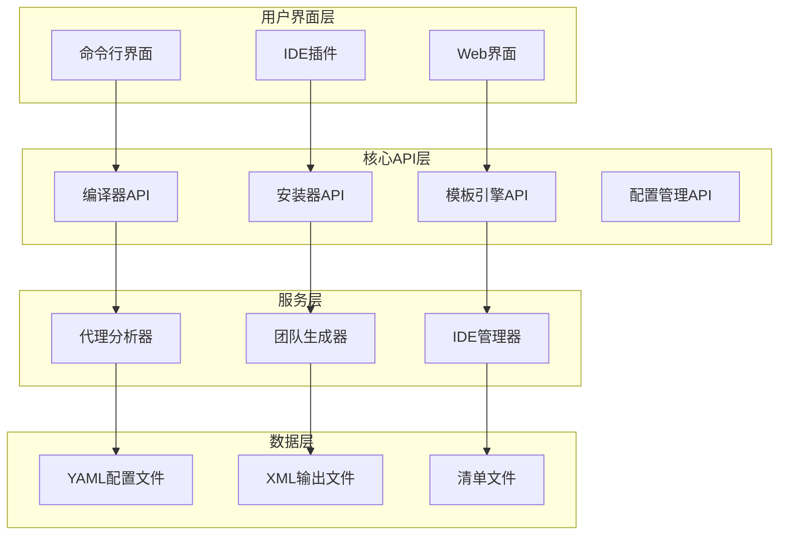
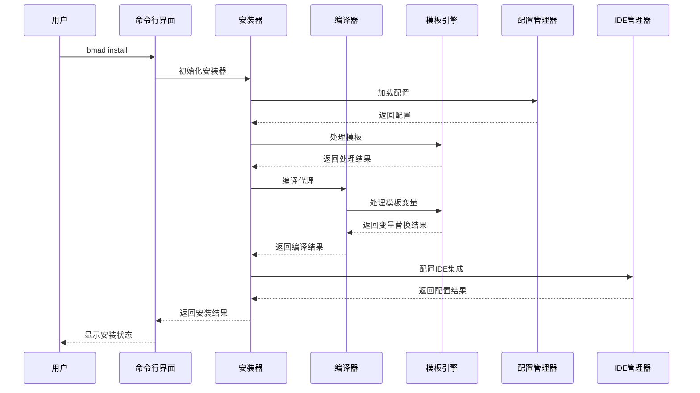
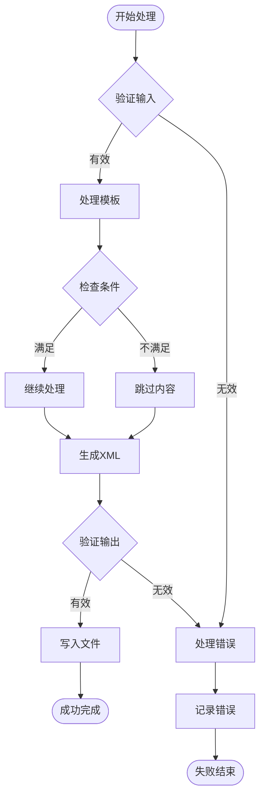

# BMAD-METHOD核心API详细参考文档

<cite>
**本文档中引用的文件**
- [compiler.js](file://tools/cli/lib/agent/compiler.js)
- [installer.js](file://tools/cli/lib/agent/installer.js)
- [template-engine.js](file://tools/cli/lib/agent/template-engine.js)
- [agent-analyzer.js](file://tools/cli/lib/agent-analyzer.js)
- [agent-party-generator.js](file://tools/cli/lib/agent-party-generator.js)
- [config.js](file://tools/cli/lib/config.js)
- [yaml-xml-builder.js](file://tools/cli/lib/yaml-xml-builder.js)
- [bmad-master.agent.yaml](file://src/core/agents/bmad-master.agent.yaml)
- [architect.agent.yaml](file://src/modules/bmm/agents/architect.agent.yaml)
- [design-thinking-coach.agent.yaml](file://src/modules/cis/agents/design-thinking-coach.agent.yaml)
- [bmad-builder.agent.yaml](file://src/modules/bmb/agents/bmad-builder.agent.yaml)
- [installer.js](file://tools/cli/installers/lib/core/installer.js)
- [config-collector.js](file://tools/cli/installers/lib/core/config-collector.js)
- [manager.js](file://tools/cli/installers/lib/ide/manager.js)
</cite>

## 目录
1. [简介](#简介)
2. [项目架构概览](#项目架构概览)
3. [代理安装器API](#代理安装器api)
4. [编译器API](#编译器api)
5. [模板引擎API](#模板引擎api)
6. [配置管理器API](#配置管理器api)
7. [代理分析器API](#代理分析器api)
8. [代理团队生成器API](#代理团队生成器api)
9. [IDE管理器API](#ide管理器api)
10. [工作流协作关系](#工作流协作关系)
11. [性能考量与最佳实践](#性能考量与最佳实践)
12. [故障排除指南](#故障排除指南)
13. [总结](#总结)

## 简介

BMAD-METHOD（Business Model Agile Development Method）是一个强大的AI代理开发框架，提供了完整的代理生命周期管理工具链。本文档详细介绍了BMAD的核心API系统，包括代理安装器、编译器、模板引擎等关键组件的接口定义、使用方法和最佳实践。

该框架采用模块化设计，支持多种部署环境（IDE集成和Web应用），提供灵活的配置管理和动态代理生成能力。核心API系统通过标准化的接口实现了代理的发现、编译、安装和运行管理。

## 项目架构概览

BMAD-METHOD采用分层架构设计，核心API分布在多个模块中：



**图表来源**
- [compiler.js](file://tools/cli/lib/agent/compiler.js#L1-L50)
- [installer.js](file://tools/cli/lib/agent/installer.js#L1-L50)
- [template-engine.js](file://tools/cli/lib/agent/template-engine.js#L1-L50)

**章节来源**
- [compiler.js](file://tools/cli/lib/agent/compiler.js#L1-L100)
- [installer.js](file://tools/cli/lib/agent/installer.js#L1-L100)

## 代理安装器API

### 核心功能概述

代理安装器是BMAD框架的核心组件之一，负责代理的发现、配置、编译和部署。它提供了完整的代理生命周期管理功能，支持多种部署模式和配置选项。

### 主要API接口

#### 1. 发现和加载代理

```javascript
// 发现可用代理
discoverAgents(searchPath: string): Array<AgentInfo>

// 加载代理配置
loadAgentConfig(yamlPath: string): AgentConfig
```

#### 2. 安装和部署

```javascript
// 安装代理到目标位置
installAgent(agentInfo: AgentInfo, answers: Answers, targetPath: string): InstallationResult

// 复制侧车文件
copySidecarFiles(sourceDir: string, targetDir: string, excludeYaml: string): Array<string>
```

#### 3. 配置管理

```javascript
// 检测BMAD项目
detectBmadProject(targetPath: string): ProjectInfo | null

// 更新代理ID
updateAgentId(compiledContent: string, targetPath: string): string
```

### 使用示例

```javascript
// 基本代理安装流程
const installer = new Installer();
const agents = installer.discoverAgents('./custom/agents');
const result = await installer.installAgent(agents[0], userAnswers, './bmad/agents');
```

### 参数类型和返回值

| 函数名 | 参数类型 | 返回值类型 | 异常情况 |
|--------|----------|------------|----------|
| discoverAgents | string | AgentInfo[] | 目录不存在时返回空数组 |
| loadAgentConfig | string | AgentConfig | 文件读取失败或格式错误 |
| installAgent | AgentInfo, Answers, string | InstallationResult | 权限不足、磁盘空间不足 |
| detectBmadProject | string | ProjectInfo \| null | 路径无效或权限问题 |

**章节来源**
- [installer.js](file://tools/cli/lib/agent/installer.js#L40-L200)

## 编译器API

### 核心功能概述

编译器API负责将YAML格式的代理定义转换为标准的XML格式，同时处理模板变量替换、激活块构建和各种XML结构的生成。

### 主要API接口

#### 1. 核心编译功能

```javascript
// 编译单个代理文件
compileAgentFile(yamlPath: string, options?: CompileOptions): CompileResult

// 完整编译管道
compileAgent(yamlContent: string, answers?: Answers, agentName?: string, targetPath?: string): CompileResult

// 直接XML编译
compileToXml(agentYaml: object, agentName?: string, targetPath?: string): string
```

#### 2. XML结构构建

```javascript
// 构建激活块
buildSimpleActivation(criticalActions: Array<string>, menuItems: Array<object>, deploymentType: string): string

// 构建人物模型XML
buildPersonaXml(persona: object): string

// 构建菜单XML
buildMenuXml(menuItems: Array<object>): string
```

### 模板处理机制

编译器支持复杂的模板语法处理：

```javascript
// 模板语法处理
processTemplate(content: string, variables: object): string

// 变量替换
processVariables(content: string, variables: object): string

// 条件语句处理
processConditionals(content: string, variables: object): string
```

### 使用示例

```javascript
// 创建自定义代理编译
const { compileAgent } = require('./compiler');
const yamlContent = fs.readFileSync('./agent.yaml', 'utf8');
const result = compileAgent(yamlContent, userAnswers, 'custom-agent', './compiled/');
```

### 性能优化特性

- **增量编译**：支持部分更新和缓存机制
- **并行处理**：多文件编译时的并发处理
- **内存优化**：大文件编译时的流式处理

**章节来源**
- [compiler.js](file://tools/cli/lib/agent/compiler.js#L380-L525)

## 模板引擎API

### 核心功能概述

模板引擎专门处理代理配置中的动态内容生成，支持条件逻辑、变量替换和复杂的数据处理。

### 主要API接口

#### 1. 基础模板处理

```javascript
// 处理完整模板
processTemplate(content: string, variables: object): string

// 变量替换
processVariables(content: string, variables: object): string

// 条件处理
processConditionals(content: string, variables: object): string
```

#### 2. 配置提取和处理

```javascript
// 提取安装配置
extractInstallConfig(agentYaml: object): InstallConfig | null

// 移除安装配置
stripInstallConfig(agentYaml: object): object

// 获取默认值
getDefaultValues(installConfig: object): object
```

### 模板语法支持

模板引擎支持以下语法：

| 语法类型 | 语法格式 | 示例 | 功能描述 |
|----------|----------|------|----------|
| 变量替换 | `{{variable}}` | `{{agent_name}}` | 替换为对应变量值 |
| 条件判断 | `{{#if variable}}...{{/if}}` | `{{#if is_expert}}...{{/if}}` | 根据变量值决定是否包含内容 |
| 否定判断 | `{{#unless variable}}...{{/unless}}` | `{{#unless skip_menu}}...{{/unless}}` | 变量为假时包含内容 |
| 字符串比较 | `{{#if variable == "value"}}...{{/if}}` | `{{#if type == "expert"}}...{{/if}}` | 字符串精确匹配 |

### 使用示例

```javascript
// 处理带有条件的模板
const templateEngine = require('./template-engine');
const processed = templateEngine.processTemplate(templateContent, {
  agent_type: 'expert',
  has_workflow: true,
  deployment_target: 'ide'
});
```

**章节来源**
- [template-engine.js](file://tools/cli/lib/agent/template-engine.js#L1-L153)

## 配置管理器API

### 核心功能概述

配置管理器提供统一的配置加载、保存和验证功能，支持YAML格式和深度合并操作。

### 主要API接口

#### 1. 配置文件操作

```javascript
// 加载YAML配置
loadYaml(configPath: string): Promise<object>

// 保存YAML配置
saveYaml(configPath: string, config: object): Promise<void>

// 处理配置文件
processConfig(configPath: string, replacements: object): Promise<void>
```

#### 2. 配置验证和合并

```javascript
// 深度合并配置
mergeConfigs(base: object, override: object): object

// 验证配置
validateConfig(config: object, schema: object): ValidationResult

// 获取配置值
getValue(config: object, path: string, defaultValue?: any): any

// 设置配置值
setValue(config: object, path: string, value: any): void
```

### 配置验证机制

```javascript
// 验证结果结构
interface ValidationResult {
  valid: boolean;
  errors: string[];
  warnings: string[];
}
```

### 使用示例

```javascript
// 配置管理器使用示例
const configManager = new Config();
const config = await configManager.loadYaml('./config.yaml');
const merged = configManager.mergeConfigs(config, { debug: true });
await configManager.saveYaml('./config.yaml', merged);
```

**章节来源**
- [config.js](file://tools/cli/lib/config.js#L1-L213)

## 代理分析器API

### 核心功能概述

代理分析器负责解析代理YAML文件，分析其结构和需求，确定所需的处理器类型和激活指令。

### 主要API接口

#### 1. 分析功能

```javascript
// 分析代理对象
analyzeAgentObject(agentYaml: object): AgentProfile

// 分析代理文件
analyzeAgentFile(filePath: string): Promise<AgentProfile>

// 检查所需处理器
needsHandler(profile: AgentProfile, handlerType: string): boolean
```

#### 2. 分析结果结构

```javascript
interface AgentProfile {
  usedAttributes: string[];
  hasPrompts: boolean;
  menuItems: Array<object>;
}
```

### 支持的处理器类型

| 处理器类型 | 描述 | 用途 |
|------------|------|------|
| action | 动作处理器 | 执行内联指令 |
| workflow | 工作流处理器 | 运行完整的工作流 |
| exec | 执行处理器 | 直接命令执行 |
| tmpl | 模板处理器 | 应用模板文件 |
| data | 数据处理器 | 加载数据文件 |
| validate-workflow | 验证处理器 | 验证工作流配置 |

### 使用示例

```javascript
// 分析代理需求
const analyzer = new AgentAnalyzer();
const profile = await analyzer.analyzeAgentFile('./agent.yaml');
if (analyzer.needsHandler(profile, 'workflow')) {
  console.log('此代理需要工作流处理器');
}
```

**章节来源**
- [agent-analyzer.js](file://tools/cli/lib/agent-analyzer.js#L1-L110)

## 代理团队生成器API

### 核心功能概述

代理团队生成器负责创建代理清单文件，支持Web捆绑和本地安装两种模式。

### 主要API接口

#### 1. 团队生成

```javascript
// 生成代理团队清单
generateAgentParty(agentDetails: Array<AgentDetail>, options?: PartyOptions): string

// 写入代理清单
writeAgentParty(filePath: string, agentDetails: Array<AgentDetail>, options?: PartyOptions): Promise<string>
```

#### 2. 详情提取

```javascript
// 提取代理详情
extractAgentDetails(content: string, moduleName: string, agentName: string): AgentDetail

// 应用配置覆盖
applyConfigOverrides(details: AgentDetail, configContent: string): AgentDetail
```

### XML格式输出

生成的代理清单采用XML格式，包含以下结构：

```xml
<manifest id="bmad/_cfg/agent-manifest.csv" version="1.0">
  <description>代理清单描述</description>
  
  <!-- 代理信息 -->
  <agent id="bmad/module/agents/agent.md" name="AgentName" title="Title" icon="🤖">
    <persona>
      <role>角色描述</role>
      <identity>身份描述</identity>
      <communication_style>沟通风格</communication_style>
      <principles>原则列表</principles>
    </persona>
  </agent>
  
  <!-- 统计信息 -->
  <statistics>
    <total_agents>总数</total_agents>
    <modules>模块列表</modules>
    <last_updated>最后更新时间</last_updated>
  </statistics>
</manifest>
```

### 使用示例

```javascript
// 生成代理团队清单
const partyGenerator = new AgentPartyGenerator();
const xmlContent = partyGenerator.generateAgentParty(agents, { forWeb: true });
await partyGenerator.writeAgentParty('./agent-manifest.xml', agents);
```

**章节来源**
- [agent-party-generator.js](file://tools/cli/lib/agent-party-generator.js#L1-L207)

## IDE管理器API

### 核心功能概述

IDE管理器提供统一的IDE集成接口，支持多种IDE平台的自动配置和代理安装。

### 主要API接口

#### 1. 平台管理

```javascript
// 获取可用IDE列表
getAvailableIdes(): Array<IDEInfo>

// 获取首选IDE
getPreferredIdes(): Array<IDEInfo>

// 获取其他IDE
getOtherIdes(): Array<IDEInfo>

// 检测已安装IDE
detectInstalledIdes(projectDir: string): Promise<Array<string>>
```

#### 2. 配置管理

```javascript
// 设置BMAD文件夹名称
setBmadFolderName(bmadFolderName: string): void

// 安装IDE配置
setup(ideName: string, projectDir: string, bmadDir: string, options?: object): Promise<SetupResult>

// 清理IDE配置
cleanup(projectDir: string): Promise<Array<CleanupResult>>

// 安装自定义代理启动器
installCustomAgentLaunchers(ides: Array<string>, projectDir: string, agentName: string, agentPath: string, metadata: object): Promise<object>
```

### 支持的IDE平台

| IDE名称 | 类型 | 特性 |
|---------|------|------|
| claude-code | 专业级 | 企业级AI辅助开发 |
| github-copilot | 开源 | GitHub集成AI助手 |
| vscode | 通用 | VS Code扩展支持 |
| cursor | 新兴 | Cursor编辑器集成 |

### 使用示例

```javascript
// IDE管理器使用示例
const ideManager = new IdeManager();
const ides = ideManager.getAvailableIdes();
const result = await ideManager.setup('claude-code', './project', './bmad');
```

**章节来源**
- [manager.js](file://tools/cli/installers/lib/ide/manager.js#L1-L245)

## 工作流协作关系

### 核心API协作图



**图表来源**
- [installer.js](file://tools/cli/lib/agent/installer.js#L380-L500)
- [compiler.js](file://tools/cli/lib/agent/compiler.js#L435-L480)

### 数据流处理

核心API系统遵循以下数据流处理模式：

1. **输入阶段**：YAML配置文件 → 解析器 → 对象模型
2. **处理阶段**：模板引擎 → 变量替换 → 条件处理 → 结构构建
3. **输出阶段**：XML生成器 → 最终输出 → 文件写入

### 错误处理策略



**图表来源**
- [template-engine.js](file://tools/cli/lib/agent/template-engine.js#L25-L80)
- [compiler.js](file://tools/cli/lib/agent/compiler.js#L380-L430)

**章节来源**
- [installer.js](file://tools/cli/lib/agent/installer.js#L380-L800)
- [yaml-xml-builder.js](file://tools/cli/lib/yaml-xml-builder.js#L1-L200)

## 性能考量与最佳实践

### 内存使用优化

1. **流式处理**：对于大型文件，使用流式读取而非一次性加载
2. **缓存策略**：合理使用缓存减少重复计算
3. **垃圾回收**：及时释放不需要的对象引用

### 线程安全性

- **无状态设计**：核心API设计为无状态，支持并发调用
- **不可变对象**：返回的对象采用不可变设计
- **锁机制**：在必要时使用适当的同步机制

### 性能监控指标

| 指标类型 | 监控项 | 目标值 | 优化建议 |
|----------|--------|--------|----------|
| 响应时间 | 单次编译时间 | < 2秒 | 使用并行处理 |
| 内存使用 | 编译过程峰值 | < 512MB | 实施流式处理 |
| 吞吐量 | 每秒处理文件数 | > 10个/秒 | 优化算法复杂度 |
| 错误率 | 处理失败比例 | < 0.1% | 增强错误处理 |

### 最佳实践建议

1. **批量操作**：对多个文件的操作使用批量处理
2. **异步处理**：长时间运行的操作使用异步模式
3. **资源池化**：对于频繁创建的对象使用对象池
4. **缓存利用**：合理利用配置和模板缓存

## 故障排除指南

### 常见问题及解决方案

#### 1. 编译错误

**问题**：代理编译失败
**原因**：YAML格式错误或模板变量缺失
**解决方案**：
```javascript
// 添加错误检查
try {
  const result = compileAgent(yamlContent, answers);
} catch (error) {
  console.error('编译失败:', error.message);
  // 检查YAML格式和模板变量
}
```

#### 2. 安装权限问题

**问题**：无法写入目标目录
**原因**：权限不足或磁盘空间不足
**解决方案**：
```javascript
// 检查权限和空间
const stats = fs.statSync(targetDir);
if (stats.mode & 0o200 === 0) {
  console.error('权限不足');
}
```

#### 3. 模板处理异常

**问题**：模板变量替换失败
**原因**：变量名拼写错误或未提供默认值
**解决方案**：
```javascript
// 提供默认值
const processed = processTemplate(template, {
  variable_name: defaultValue || ''
});
```

### 调试技巧

1. **启用详细日志**：设置适当的日志级别
2. **分步调试**：将复杂操作分解为多个步骤
3. **单元测试**：为关键功能编写单元测试
4. **性能分析**：使用性能分析工具识别瓶颈

**章节来源**
- [config.js](file://tools/cli/lib/config.js#L120-L180)
- [template-engine.js](file://tools/cli/lib/agent/template-engine.js#L100-L153)

## 总结

BMAD-METHOD的核心API系统提供了完整的代理开发和部署解决方案。通过模块化的架构设计，各个组件可以独立使用，也可以协同工作实现复杂的代理管理功能。

### 主要优势

1. **模块化设计**：各API组件职责明确，易于维护和扩展
2. **灵活配置**：支持多种部署模式和配置选项
3. **高性能**：优化的处理流程和内存使用
4. **可扩展性**：良好的接口设计支持新功能添加

### 发展方向

1. **云原生支持**：增强对云平台的集成能力
2. **AI辅助开发**：集成更多的AI辅助功能
3. **可视化工具**：提供图形化的代理开发界面
4. **生态系统**：构建更丰富的第三方扩展生态

通过深入理解和正确使用这些核心API，开发者可以高效地构建和管理复杂的AI代理系统，充分发挥BMAD-METHOD框架的强大功能。