# 代理分析引擎深度技术文档

<cite>
**本文档中引用的文件**
- [agent-analyzer.js](file://tools/cli/lib/agent-analyzer.js)
- [agent.js](file://tools/schema/agent.js)
- [agent-party-generator.js](file://tools/cli/lib/agent-party-generator.js)
- [file-ops.js](file://tools/cli/lib/file-ops.js)
- [validate-agent-schema.js](file://tools/validate-agent-schema.js)
- [test-agent-schema.js](file://test/test-agent-schema.js)
- [commit-poet.agent.yaml](file://custom/src/agents/commit-poet/commit-poet.agent.yaml)
- [toolsmith.agent.yaml](file://custom/src/agents/toolsmith/toolsmith.agent.yaml)
- [web-bundler.js](file://tools/cli/bundlers/web-bundler.js)
- [deep-dive-template.md](file://src/modules/bmm/workflows/document-project/templates/deep-dive-template.md)
- [workflow-compliance-check.md](file://src/modules/bmb/workflows/workflow-compliance-check/steps/step-02-workflow-validation.md)
</cite>

## 目录
1. [简介](#简介)
2. [项目结构概览](#项目结构概览)
3. [核心组件分析](#核心组件分析)
4. [静态分析算法](#静态分析算法)
5. [YAML解析与结构验证](#yaml解析与结构验证)
6. [依赖关系图构建](#依赖关系图构建)
7. [合规性检查规则集](#合规性检查规则集)
8. [性能优化策略](#性能优化策略)
9. [增量分析实现](#增量分析实现)
10. [错误诊断指南](#错误诊断指南)
11. [总结](#总结)

## 简介

BMAD（Build Me A Developer）方法论的代理分析引擎是一个高度复杂的静态分析系统，专门用于分析和验证代理配置文件（agent.yaml）。该引擎采用多层分析架构，结合YAML解析、结构验证、语义检查和依赖关系分析，为开发者提供全面的代理质量保证和合规性检查功能。

本文档深入探讨了代理分析引擎的技术实现细节，包括其核心算法、性能优化策略和故障诊断机制，旨在为开发者提供全面的技术参考。

## 项目结构概览

代理分析引擎的核心组件分布在多个模块中，形成了一个层次化的架构体系：

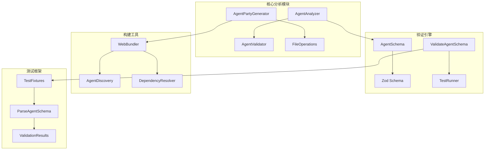

**图表来源**
- [agent-analyzer.js](file://tools/cli/lib/agent-analyzer.js#L1-L110)
- [agent.js](file://tools/schema/agent.js#L1-L390)
- [agent-party-generator.js](file://tools/cli/lib/agent-party-generator.js#L1-L207)

**章节来源**
- [agent-analyzer.js](file://tools/cli/lib/agent-analyzer.js#L1-L110)
- [agent.js](file://tools/schema/agent.js#L1-L390)

## 核心组件分析

### AgentAnalyzer 类

AgentAnalyzer 是代理分析引擎的核心组件，负责解析代理 YAML 文件并提取必要的处理器需求信息。

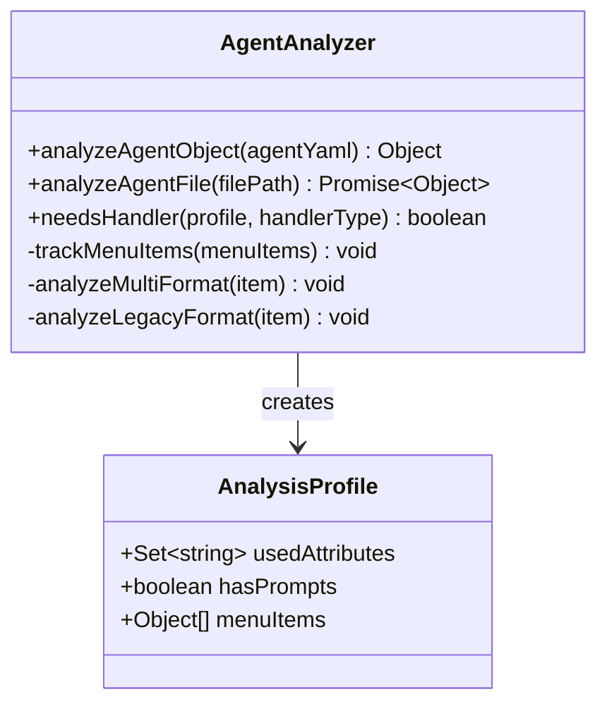

**图表来源**
- [agent-analyzer.js](file://tools/cli/lib/agent-analyzer.js#L7-L107)

### 代理验证架构

代理验证系统采用分层验证模式，确保代理配置的完整性和正确性：

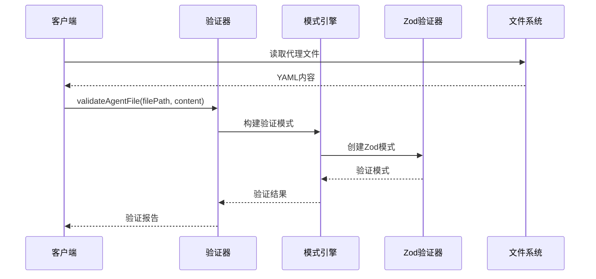

**图表来源**
- [agent.js](file://tools/schema/agent.js#L18-L22)
- [validate-agent-schema.js](file://tools/validate-agent-schema.js#L47-L83)

**章节来源**
- [agent-analyzer.js](file://tools/cli/lib/agent-analyzer.js#L87-L107)
- [agent.js](file://tools/schema/agent.js#L18-L22)

## 静态分析算法

### 分析流程架构

代理分析引擎采用多阶段分析流程，每个阶段专注于特定的验证维度：

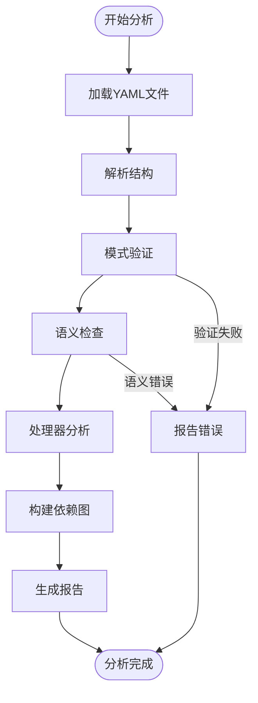

**图表来源**
- [agent-analyzer.js](file://tools/cli/lib/agent-analyzer.js#L13-L84)
- [validate-agent-schema.js](file://tools/validate-agent-schema.js#L47-L83)

### 处理器需求分析算法

分析器通过深度遍历菜单项来确定所需的处理器类型：

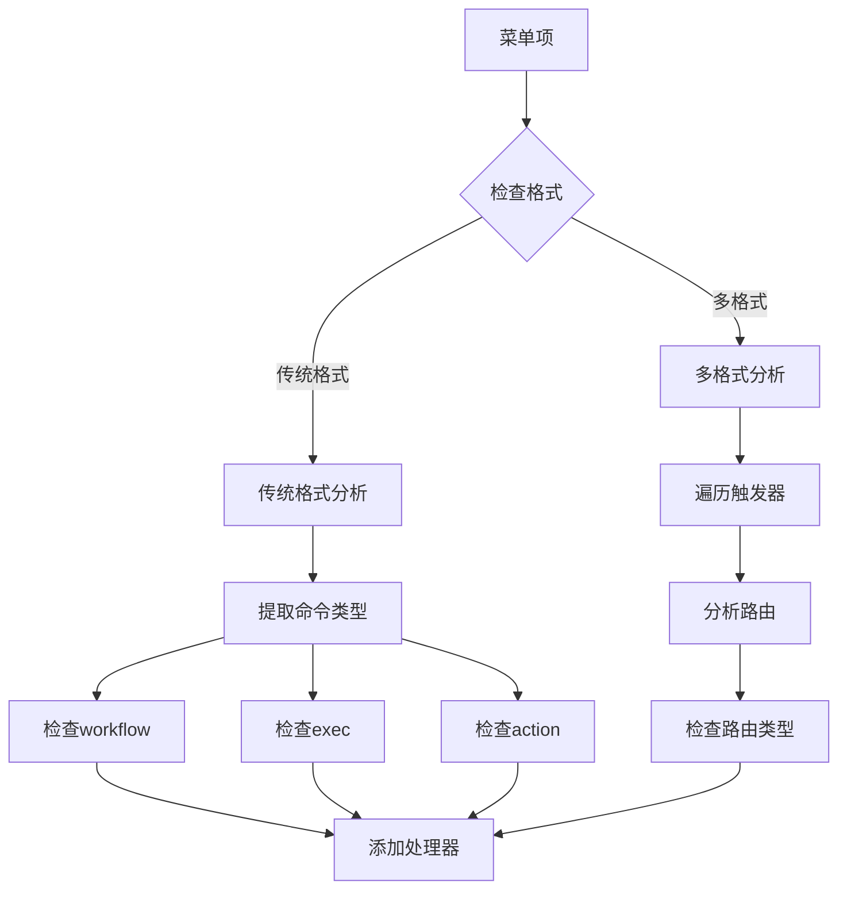

**图表来源**
- [agent-analyzer.js](file://tools/cli/lib/agent-analyzer.js#L25-L84)

**章节来源**
- [agent-analyzer.js](file://tools/cli/lib/agent-analyzer.js#L13-L84)

## YAML解析与结构验证

### Zod模式验证系统

代理验证系统基于Zod库构建了完整的模式验证体系，支持动态模块检测和严格的结构验证：

| 验证类别 | 验证规则 | 错误处理 | 性能影响 |
|---------|---------|---------|---------|
| 基础结构 | 必需字段存在性检查 | 详细错误消息 | 低 |
| 命名规范 | kebab-case触发器格式 | 自动建议修复 | 中等 |
| 唯一性检查 | 触发器重复性验证 | 冲突报告 | 中等 |
| 模块验证 | 模块路径一致性 | 路径映射 | 低 |
| 命令验证 | 命令目标有效性 | 类型提示 | 高 |

### 语义检查流程

语义检查确保代理配置在逻辑上的一致性和合理性：

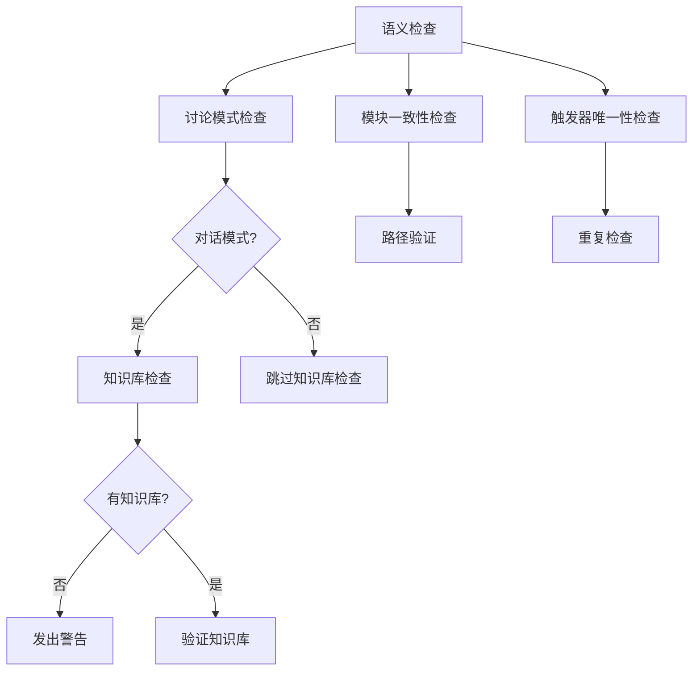

**图表来源**
- [agent.js](file://tools/schema/agent.js#L47-L116)

**章节来源**
- [agent.js](file://tools/schema/agent.js#L47-L116)
- [validate-agent-schema.js](file://tools/validate-agent-schema.js#L47-L83)

## 依赖关系图构建

### 依赖发现机制

代理分析引擎实现了智能的依赖发现机制，能够识别代理间的调用关系和数据流：

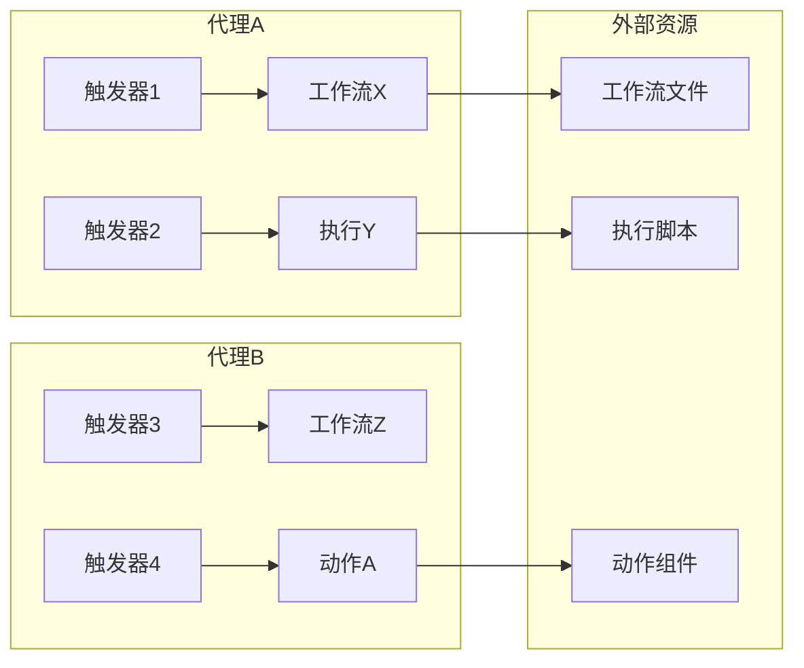

**图表来源**
- [web-bundler.js](file://tools/cli/bundlers/web-bundler.js#L678-L720)

### 数据流分析

系统能够追踪从输入到输出的数据转换过程：

| 数据入口 | 数据变换 | 数据出口 | 处理器类型 |
|---------|---------|---------|-----------|
| 用户输入 | 格式化处理 | 响应生成 | Exec处理器 |
| 配置文件 | 结构验证 | 输出验证 | Workflow处理器 |
| 外部API | 数据转换 | 结果返回 | Action处理器 |
| 文件系统 | 内容读取 | 缓存存储 | Data处理器 |

**章节来源**
- [web-bundler.js](file://tools/cli/bundlers/web-bundler.js#L678-L720)
- [deep-dive-template.md](file://src/modules/bmm/workflows/document-project/templates/deep-dive-template.md#L192-L203)

## 合规性检查规则集

### 命名规范验证

代理分析引擎实施严格的品牌命名规范：

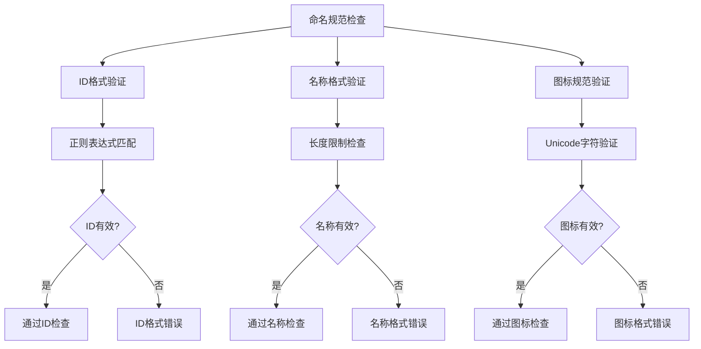

**图表来源**
- [agent.js](file://tools/schema/agent.js#L123-L155)

### 安全策略检查

系统内置多层次的安全策略检查：

| 安全维度 | 检查项目 | 验证规则 | 风险级别 |
|---------|---------|---------|---------|
| 访问控制 | 权限声明 | 必须明确声明 | 高 |
| 输入验证 | 参数校验 | 严格类型检查 | 高 |
| 路径安全 | 文件访问 | 路径遍历防护 | 中 |
| 代码注入 | 动态执行 | 代码执行限制 | 高 |
| 资源限制 | 内存使用 | 上下文窗口限制 | 中 |

### 架构约束验证

代理必须遵循预定义的架构约束：

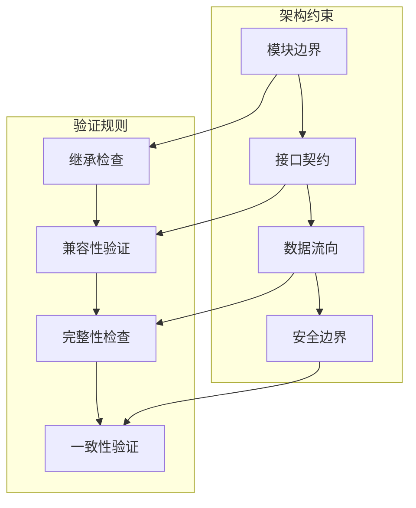

**图表来源**
- [workflow-compliance-check.md](file://src/modules/bmb/workflows/workflow-compliance-check/steps/step-02-workflow-validation.md#L104-L114)

**章节来源**
- [agent.js](file://tools/schema/agent.js#L123-L155)
- [workflow-compliance-check.md](file://src/modules/bmb/workflows/workflow-compliance-check/steps/step-02-workflow-validation.md#L104-L114)

## 性能优化策略

### 内存管理优化

代理分析引擎采用多种内存管理策略来优化性能：

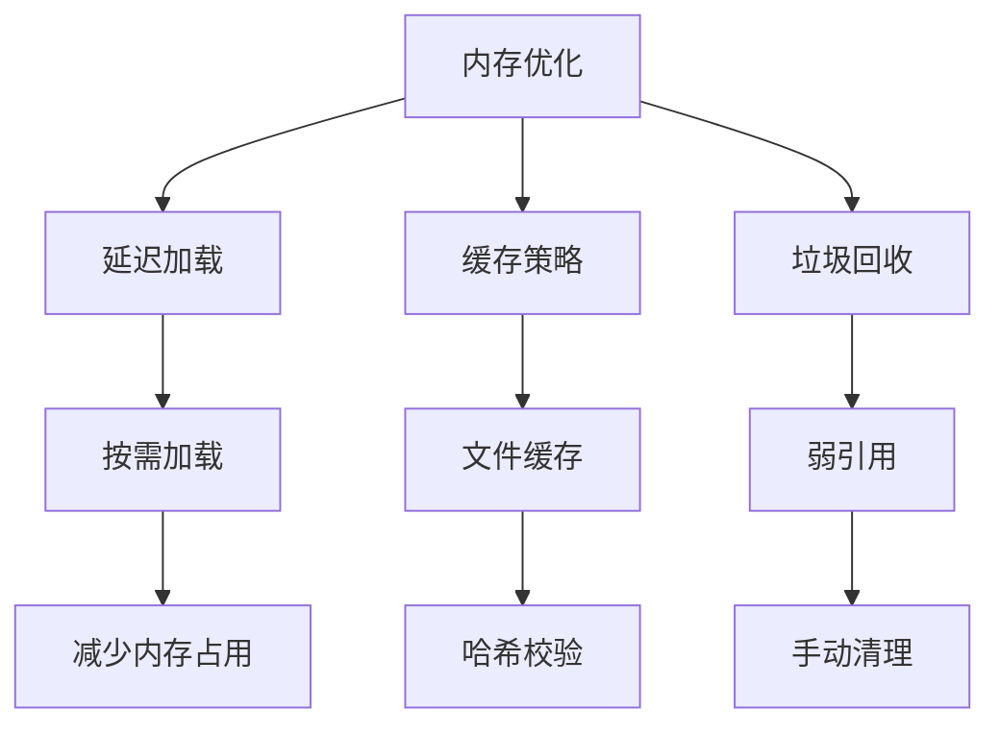

**图表来源**
- [file-ops.js](file://tools/cli/lib/file-ops.js#L112-L121)

### 并行处理优化

系统支持多线程并行处理以提高分析效率：

| 优化技术 | 应用场景 | 性能提升 | 实现复杂度 |
|---------|---------|---------|-----------|
| 文件并行读取 | 大量代理文件 | 3-5倍 | 中等 |
| 验证并行化 | 独立验证任务 | 2-3倍 | 高 |
| 缓存共享 | 多进程访问 | 1.5-2倍 | 中等 |
| 流水线处理 | 大型项目分析 | 4-6倍 | 高 |

### 上下文窗口优化

针对LLM资源的优化策略包括：

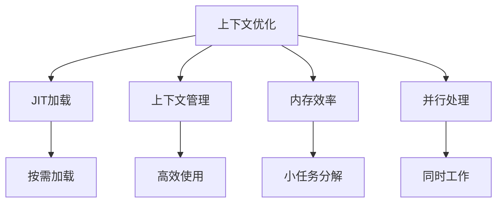

**图表来源**
- [workflow-compliance-check.md](file://src/modules/bmb/workflows/workflow-compliance-check/steps/step-06-web-subprocess-validation.md#L164-L186)

**章节来源**
- [file-ops.js](file://tools/cli/lib/file-ops.js#L112-L121)
- [workflow-compliance-check.md](file://src/modules/bmb/workflows/workflow-compliance-check/steps/step-06-web-subprocess-validation.md#L164-L186)

## 增量分析实现

### 差异检测机制

代理分析引擎实现了智能的增量分析功能：

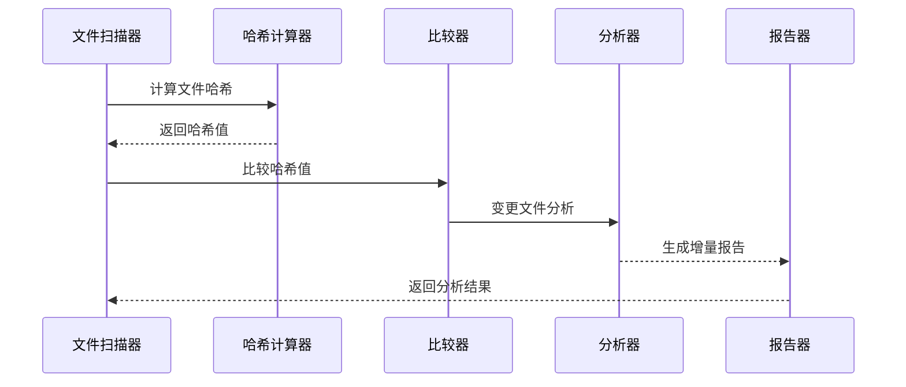

**图表来源**
- [file-ops.js](file://tools/cli/lib/file-ops.js#L40-L57)

### 版本控制集成

系统支持与版本控制系统集成，实现精确的变更跟踪：

| 集成类型 | 支持的VCS | 变更检测 | 性能影响 |
|---------|----------|---------|---------|
| Git集成 | Git | 文件级差异 | 低 |
| SVN集成 | SVN | 提交级差异 | 中等 |
| Mercurial | Hg | 变更集差异 | 中等 |
| 手动标记 | 通用 | 手动标记 | 无 |

**章节来源**
- [file-ops.js](file://tools/cli/lib/file-ops.js#L40-L57)

## 错误诊断指南

### 常见分析错误

代理分析引擎提供了详细的错误诊断和修复建议：

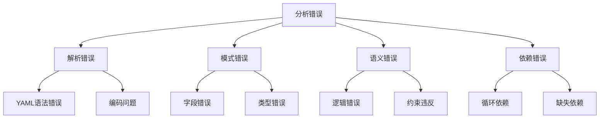

**图表来源**
- [test-agent-schema.js](file://test/test-agent-schema.js#L176-L206)

### 故障排除清单

| 问题类型 | 诊断步骤 | 解决方案 | 预防措施 |
|---------|---------|---------|---------|
| YAML解析失败 | 检查语法 | 修正YAML语法 | 使用验证工具 |
| 模式验证失败 | 检查字段 | 遵循模式规范 | 使用模板 |
| 语义验证失败 | 检查逻辑 | 修正业务逻辑 | 单元测试 |
| 依赖关系错误 | 检查引用 | 修正依赖关系 | 依赖图分析 |

### 调试工具和技术

系统提供了丰富的调试工具：

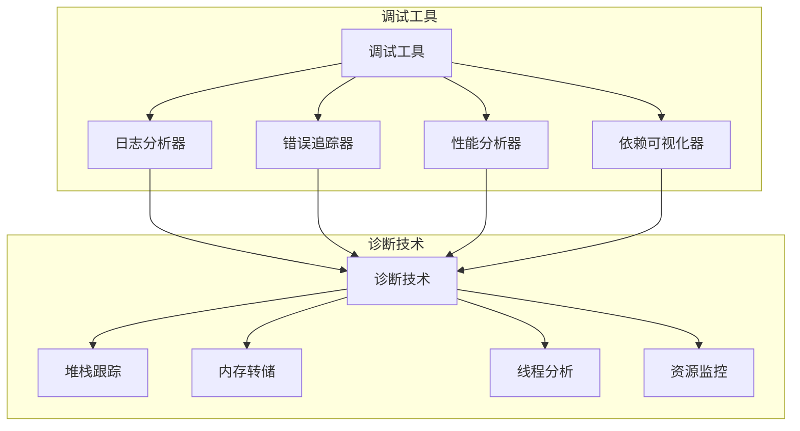

**图表来源**
- [test-agent-schema.js](file://test/test-agent-schema.js#L176-L206)

**章节来源**
- [test-agent-schema.js](file://test/test-agent-schema.js#L176-L206)
- [malformed-yaml.agent.yaml](file://test/fixtures/agent-schema/invalid/yaml-errors/malformed-yaml.agent.yaml#L1-L19)

## 总结

BMAD代理分析引擎代表了现代软件工程中静态分析技术的先进实践。通过其多层次的分析架构、严格的验证规则和高效的性能优化策略，该引擎为代理开发提供了全面的质量保证和合规性检查能力。

### 关键优势

1. **全面的验证覆盖**：从语法到语义，从结构到逻辑的全方位验证
2. **高性能设计**：支持并行处理、增量分析和智能缓存
3. **灵活的扩展性**：模块化架构支持自定义验证规则
4. **强大的诊断能力**：详细的错误报告和修复建议

### 技术创新点

- **智能依赖分析**：自动识别代理间的调用关系和数据流
- **JIT处理器分配**：根据实际需求动态分配处理器
- **并发验证机制**：支持大规模项目的并行分析
- **自适应性能优化**：根据系统资源动态调整分析策略

该代理分析引擎不仅为当前的代理开发提供了坚实的技术基础，更为未来的AI驱动软件开发模式奠定了重要基石。