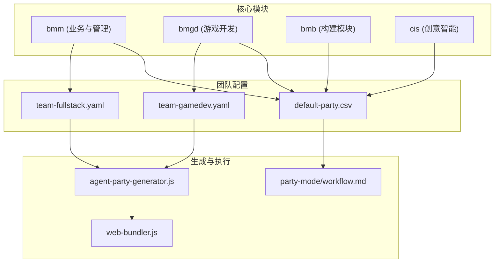
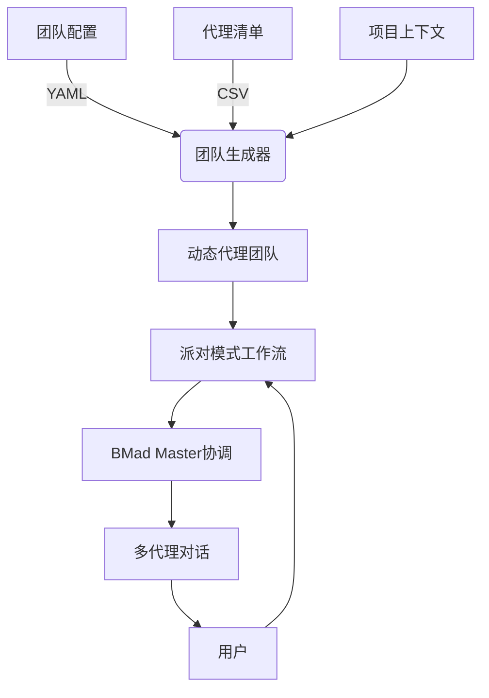
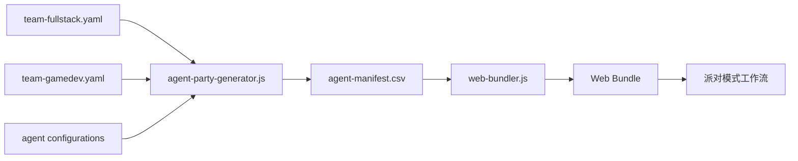

# 代理团队生成

<cite>
**本文档引用的文件**  
- [party-mode.md](file://src/modules/bmm/docs/party-mode.md)
- [agent-party-generator.js](file://tools/cli/lib/agent-party-generator.js)
- [agent-manifest.csv](file://src/modules/bmm/teams/default-party.csv)
- [team-gamedev.yaml](file://src/modules/bmgd/teams/team-gamedev.yaml)
- [team-fullstack.yaml](file://src/modules/bmm/teams/team-fullstack.yaml)
- [step-01-agent-loading.md](file://src/core/workflows/party-mode/steps/step-01-agent-loading.md)
- [workflow.md](file://src/core/workflows/party-mode/workflow.md)
- [web-bundler.js](file://tools/cli/bundlers/web-bundler.js)
- [product-brief.md](file://src/modules/bmm/workflows/1-analysis/product-brief/steps/step-04-metrics.md)
- [test-design.md](file://src/modules/bmm/workflows/testarch/test-design/instructions.md)
</cite>

## 目录
1. [引言](#引言)
2. [项目结构](#项目结构)
3. [核心组件](#核心组件)
4. [架构概述](#架构概述)
5. [详细组件分析](#详细组件分析)
6. [依赖分析](#依赖分析)
7. [性能考量](#性能考量)
8. [故障排除指南](#故障排除指南)
9. [结论](#结论)

## 引言

代理团队生成器是BMAD方法论中的核心协作机制，它能够基于项目上下文（如技术栈、项目规模和开发阶段）动态构建多代理协作网络。该系统通过智能算法选择合适的代理成员，分配角色，并匹配能力，从而形成高效的团队拓扑结构。无论是串行、并行还是混合执行模式，团队生成器都能根据任务需求做出最优决策。本文档将深入探讨团队配置的序列化格式、运行时实例化过程以及与其他系统组件的集成方式，并提供评估团队协作效率的关键指标。

## 项目结构

代理团队生成器的实现分布在多个模块中，主要位于`src/modules/`目录下。核心功能由`bmm`（Business & Management Module）和`bmgd`（Game Development Module）等模块提供，而团队配置文件则存储在各自的`teams/`子目录中。团队定义使用YAML格式，包含团队名称、图标、描述、成员列表及关联的工作流。代理清单（agent-manifest.csv）是团队生成的关键输入，它汇总了所有已安装代理的元数据，供“派对模式”（Party Mode）等协作功能使用。



**Diagram sources**
- [team-fullstack.yaml](file://src/modules/bmm/teams/team-fullstack.yaml)
- [team-gamedev.yaml](file://src/modules/bmgd/teams/team-gamedev.yaml)
- [default-party.csv](file://src/modules/bmm/teams/default-party.csv)
- [agent-party-generator.js](file://tools/cli/lib/agent-party-generator.js)
- [web-bundler.js](file://tools/cli/bundlers/web-bundler.js)

**Section sources**
- [src/modules/](file://src/modules/)
- [src/core/workflows/party-mode/](file://src/core/workflows/party-mode/)

## 核心组件

代理团队生成的核心在于“派对模式”（Party Mode）的实现。该模式通过读取`agent-manifest.csv`文件来加载所有已安装的代理，并由“BMad Master”代理进行协调。对于每个用户消息或话题，系统会进行相关性分析，识别出最适合参与讨论的2-3个代理，从而确保讨论的平衡性和全面性。代理的个性、角色和原则被合并，以实现角色一致的响应生成。团队拓扑结构的生成逻辑支持串行、并行和混合模式，决策依据包括话题领域、专业知识要求和对话上下文。

**Section sources**
- [party-mode.md](file://src/modules/bmm/docs/party-mode.md)
- [workflow.md](file://src/core/workflows/party-mode/workflow.md)
- [step-01-agent-loading.md](file://src/core/workflows/party-mode/steps/step-01-agent-loading.md)

## 架构概述

代理团队生成的架构是一个分层系统，从团队配置到运行时执行。在配置层，YAML文件定义了团队的静态成员。在构建层，`agent-party-generator.js`等工具将这些配置与代理清单结合，生成可执行的代理集合。在运行时层，“派对模式”工作流负责动态激活团队，根据实时输入智能选择代理，并协调多代理对话。整个过程由“BMad Master”作为协调者，确保对话流畅且富有成效。



**Diagram sources**
- [team-fullstack.yaml](file://src/modules/bmm/teams/team-fullstack.yaml)
- [agent-manifest.csv](file://src/modules/bmm/teams/default-party.csv)
- [agent-party-generator.js](file://tools/cli/lib/agent-party-generator.js)
- [workflow.md](file://src/core/workflows/party-mode/workflow.md)

## 详细组件分析

### 团队配置与序列化

团队配置采用YAML格式进行序列化，清晰地定义了团队的元数据和成员。例如，`team-fullstack.yaml`定义了一个名为“Team Plan and Architect”的团队，包含分析师、架构师、产品经理、敏捷教练和UX设计师等角色。`team-gamedev.yaml`则定义了一个游戏开发团队，包含游戏设计师、开发者、架构师和敏捷教练。`party`字段指向一个CSV文件（如`default-party.csv`），该文件包含了所有代理的详细信息，如名称、显示名、角色、身份、沟通风格和原则。

#### 团队配置示例
```yaml
bundle:
  name: Team Plan and Architect
  icon: 🚀
  description: 能够进行项目分析、设计和架构的团队。
agents:
  - analyst
  - architect
  - pm
  - sm
  - ux-designer
party: "./default-party.csv"
```

**Section sources**
- [team-fullstack.yaml](file://src/modules/bmm/teams/team-fullstack.yaml)
- [team-gamedev.yaml](file://src/modules/bmgd/teams/team-gamedev.yaml)

### 运行时实例化与集成

团队的运行时实例化主要通过`web-bundler.js`和`agent-party-generator.js`完成。`web-bundler.js`在打包过程中会检查团队配置，如果存在`party` CSV文件，则将其作为`agent-manifest.csv`包含在最终的包中。`agent-party-generator.js`则负责生成`agent-manifest.csv`的内容，它会按模块对代理进行分组，并将代理的详细信息（如角色、身份、沟通风格和原则）提取并格式化为CSV或XML。

#### 代理清单生成逻辑
```javascript
function generateAgentParty(agentDetails, options = {}) {
    const agentsByModule = {
        bmm: [],
        cis: [],
        core: [],
        custom: [],
    };

    // 按模块对代理进行分组
    for (const agent of agentDetails) {
        const moduleKey = agentsByModule[agent.module] ? agent.module : 'custom';
        agentsByModule[moduleKey].push(agent);
    }

    // 构建清单内容
    let xmlContent = `<!-- 由 BMAD-CORE™ 提供支持 -->
    <manifest id="bmad/_cfg/agent-manifest.csv" version="1.0">
        <description>
            所有已安装代理的完整名单，用于高效的多代理协调。
        </description>`;
    
    // 为每个模块添加代理
    for (const [module, agents] of Object.entries(agentsByModule)) {
        if (agents.length === 0) continue;
        xmlContent += `\n  <module name="${module}">`;
        for (const agent of agents) {
            xmlContent += `\n    <agent name="${agent.name}" displayName="${agent.displayName}" role="${agent.role}" />`;
        }
        xmlContent += '\n  </module>';
    }
    xmlContent += '\n</manifest>';
    return xmlContent;
}
```

**Diagram sources**
- [agent-party-generator.js](file://tools/cli/lib/agent-party-generator.js)
- [web-bundler.js](file://tools/cli/bundlers/web-bundler.js)

**Section sources**
- [agent-party-generator.js](file://tools/cli/lib/agent-party-generator.js)
- [web-bundler.js](file://tools/cli/bundlers/web-bundler.js)

### 团队协作效率评估

团队协作的效率通过多种指标进行评估。首先，**决策质量**是关键，通过“派对模式”可以汇集不同领域的视角（技术、创意、战略），从而做出更全面的决策。其次，**问题解决速度**得到提升，因为多个代理可以并行思考和提出解决方案。此外，**创新性**也显著增强，不同代理之间的“交叉授粉”（cross-pollination）能激发出单一代理无法产生的创意。最后，**风险识别**能力更强，例如在“调用糟糕架构”示例中，架构师、开发者、产品经理和测试架构师能从各自角度分析问题，共同揭示根本原因。

**Section sources**
- [party-mode.md](file://src/modules/bmm/docs/party-mode.md)
- [product-brief.md](file://src/modules/bmm/workflows/1-analysis/product-brief/steps/step-04-metrics.md)
- [test-design.md](file://src/modules/bmm/workflows/testarch/test-design/instructions.md)

## 依赖分析

代理团队生成器依赖于多个核心组件。它依赖于`agent-manifest.csv`来获取代理的元数据，依赖于`web-bundler.js`在打包时将团队配置和代理清单集成到最终产物中。`agent-party-generator.js`是生成代理清单的核心工具，它依赖于各个代理的YAML配置文件来提取角色和原则等信息。此外，团队生成器与“派对模式”工作流紧密耦合，后者是团队动态协作的执行引擎。



**Diagram sources**
- [team-fullstack.yaml](file://src/modules/bmm/teams/team-fullstack.yaml)
- [team-gamedev.yaml](file://src/modules/bmgd/teams/team-gamedev.yaml)
- [agent-party-generator.js](file://tools/cli/lib/agent-party-generator.js)
- [web-bundler.js](file://tools/cli/bundlers/web-bundler.js)
- [workflow.md](file://src/core/workflows/party-mode/workflow.md)

**Section sources**
- [tools/cli/lib/agent-party-generator.js](file://tools/cli/lib/agent-party-generator.js)
- [tools/cli/bundlers/web-bundler.js](file://tools/cli/bundlers/web-bundler.js)

## 性能考量

代理团队生成的性能主要体现在启动时间和运行时开销上。团队配置的解析和代理清单的生成是构建时操作，对运行时性能影响较小。运行时的主要开销在于“派对模式”的协调逻辑，即对每个用户输入进行相关性分析和代理选择。由于通常只选择2-3个代理参与对话，因此响应延迟保持在可接受范围内。系统的可扩展性良好，可以轻松添加新的代理和团队配置，而不会显著影响核心性能。

## 故障排除指南

在使用代理团队生成器时，可能会遇到一些常见问题：
- **问题：** 总是相同的代理在响应。
  **解决方案：** 尝试提出更具体的问题，或明确要求其他代理（如“游戏设计师，你的想法呢？”）。
- **问题：** 讨论陷入循环。
  **解决方案：** 由“BMad Master”进行总结并引导，或用户直接做出决定并推进。
- **问题：** 代理未使用自定义设置。
  **解决方案：** 确保在创建自定义文件后运行了 `npx bmad-method install` 命令以重新构建代理。
- **问题：** 代理清单文件未找到。
  **解决方案：** 检查团队配置文件中的`party`路径是否正确，并确保该文件存在于指定位置。

**Section sources**
- [party-mode.md](file://src/modules/bmm/docs/party-mode.md#troubleshooting)

## 结论

代理团队生成器是BMAD方法论中一个强大而灵活的协作工具。它通过将静态的团队配置与动态的运行时协调相结合，实现了基于上下文的智能多代理协作。通过YAML和CSV格式的序列化，团队可以轻松定义和复用。其核心的“派对模式”工作流能够根据话题智能选择代理，促进跨领域的知识共享和创新。该系统不仅提高了决策质量和问题解决效率，还为复杂项目提供了一个高效的集体智慧平台。随着更多工作流集成“派对模式”，其在需求收集、技术评审和战略规划中的应用前景将更加广阔。