# 配置与分析

<cite>
**本文档中引用的文件**
- [agent-config-template.md](file://src/utility/models/agent-config-template.md)
- [config.js](file://tools/cli/lib/config.js)
- [agent-analyzer.js](file://tools/cli/lib/agent-analyzer.js)
- [agent-party-generator.js](file://tools/cli/lib/agent-party-generator.js)
- [config-collector.js](file://tools/cli/installers/lib/core/config-collector.js)
- [ide-config-manager.js](file://tools/cli/installers/lib/core/ide-config-manager.js)
- [activation-builder.js](file://tools/cli/lib/activation-builder.js)
- [xml-handler.js](file://tools/cli/lib/xml-handler.js)
- [yaml-xml-builder.js](file://tools/cli/lib/yaml-xml-builder.js)
- [team-fullstack.yaml](file://src/modules/bmm/teams/team-fullstack.yaml)
- [creative-squad.yaml](file://src/modules/cis/teams/creative-squad.yaml)
- [install-config.yaml](file://src/core/_module-installer/install-config.yaml)
- [commit-poet.agent.yaml](file://custom/src/agents/commit-poet/commit-poet.agent.yaml)
- [architect.agent.yaml](file://src/modules/bmm/agents/architect.agent.yaml)
- [generate-project-context.md](file://src/modules/bmm/workflows/generate-project-context/workflow.md)
- [document-project.yaml](file://src/modules/bmm/workflows/document-project/workflow.yaml)
</cite>

## 目录
1. [简介](#简介)
2. [项目结构概览](#项目结构概览)
3. [配置管理系统](#配置管理系统)
4. [代理分析器架构](#代理分析器架构)
5. [代理团队生成器](#代理团队生成器)
6. [激活构建系统](#激活构建系统)
7. [XML处理与转换](#xml处理与转换)
8. [工作流与模板系统](#工作流与模板系统)
9. [性能优化策略](#性能优化策略)
10. [分布式部署考虑](#分布式部署考虑)
11. [故障排除指南](#故障排除指南)
12. [总结](#总结)

## 简介

BMAD（Brainstorming Multi-Agent Development）方法是一个复杂的多代理系统，通过精心设计的配置管理和静态分析算法实现智能代理协作。本文档深入探讨了该系统的核心组件：配置管理器的层级结构、代理分析器的静态分析算法、代理团队生成器的动态协作网络构建机制，以及相关的API调用时序和异常处理模式。

该系统采用模块化架构，支持多层次的配置继承和运行时合并策略，能够根据项目上下文动态生成多代理协作网络，并通过智能的静态分析确保系统的稳定性和可维护性。

## 项目结构概览

BMAD系统采用分层模块化架构，主要包含以下核心组件：

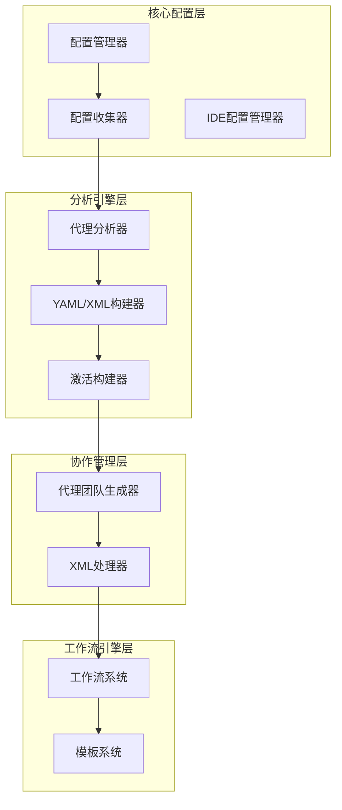

**图表来源**
- [config.js](file://tools/cli/lib/config.js#L1-L213)
- [agent-analyzer.js](file://tools/cli/lib/agent-analyzer.js#L1-L110)
- [agent-party-generator.js](file://tools/cli/lib/agent-party-generator.js#L1-L207)

**章节来源**
- [config.js](file://tools/cli/lib/config.js#L1-L213)
- [agent-analyzer.js](file://tools/cli/lib/agent-analyzer.js#L1-L110)
- [agent-party-generator.js](file://tools/cli/lib/agent-party-generator.js#L1-L207)

## 配置管理系统

### 层级结构与继承机制

BMAD配置管理系统采用多层级继承结构，支持从核心配置到模块特定配置的逐层覆盖：

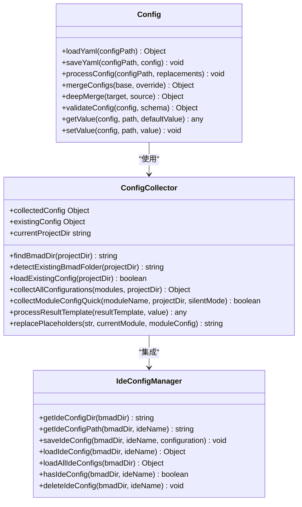

**图表来源**
- [config.js](file://tools/cli/lib/config.js#L8-L213)
- [config-collector.js](file://tools/cli/installers/lib/core/config-collector.js#L9-L855)
- [ide-config-manager.js](file://tools/cli/installers/lib/core/ide-config-manager.js#L9-L155)

### 配置项解析与运行时合并策略

系统实现了智能的配置合并策略，支持多种数据类型的递归合并：

| 合并类型 | 处理策略 | 示例场景 |
|---------|---------|---------|
| 对象合并 | 深度递归合并 | 嵌套配置对象 |
| 数组追加 | 合并数组内容 | 菜单项列表 |
| 字符串替换 | 完全覆盖 | 标识符和路径 |
| 布尔值设置 | 直接赋值 | 功能开关 |
| 默认值保留 | 条件性应用 | 用户未修改的配置 |

### 配置缓存策略

系统采用多级缓存机制优化性能：

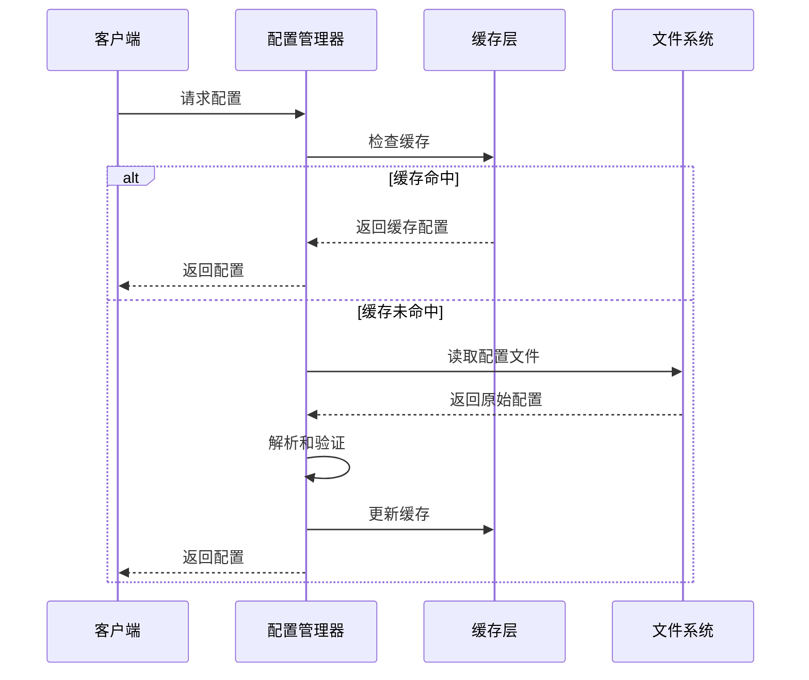

**图表来源**
- [config.js](file://tools/cli/lib/config.js#L14-L39)
- [config-collector.js](file://tools/cli/installers/lib/core/config-collector.js#L85-L129)

**章节来源**
- [config.js](file://tools/cli/lib/config.js#L1-L213)
- [config-collector.js](file://tools/cli/installers/lib/core/config-collector.js#L1-L855)
- [ide-config-manager.js](file://tools/cli/installers/lib/core/ide-config-manager.js#L1-L155)

## 代理分析器架构

### 静态分析算法

代理分析器采用多层次静态分析算法，能够准确识别代理所需的处理器类型：

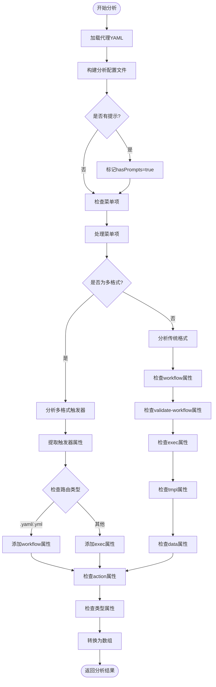

**图表来源**
- [agent-analyzer.js](file://tools/cli/lib/agent-analyzer.js#L13-L85)

### 依赖关系图构建

系统能够构建完整的代理依赖关系图：

| 代理类型 | 所需处理器 | 触发条件 | 优先级 |
|---------|-----------|---------|--------|
| 基础代理 | handler-action.xml | 基本交互 | 高 |
| 工作流代理 | handler-workflow.xml | 复杂流程 | 中 |
| 验证代理 | handler-validate-workflow.xml | 流程验证 | 中 |
| 模板代理 | handler-tmpl.xml | 内容模板 | 低 |
| 数据代理 | handler-data.xml | 数据处理 | 低 |
| 多格式代理 | handler-multi.xml | 复合操作 | 高 |

### 合规性检查机制

代理分析器内置严格的合规性检查：

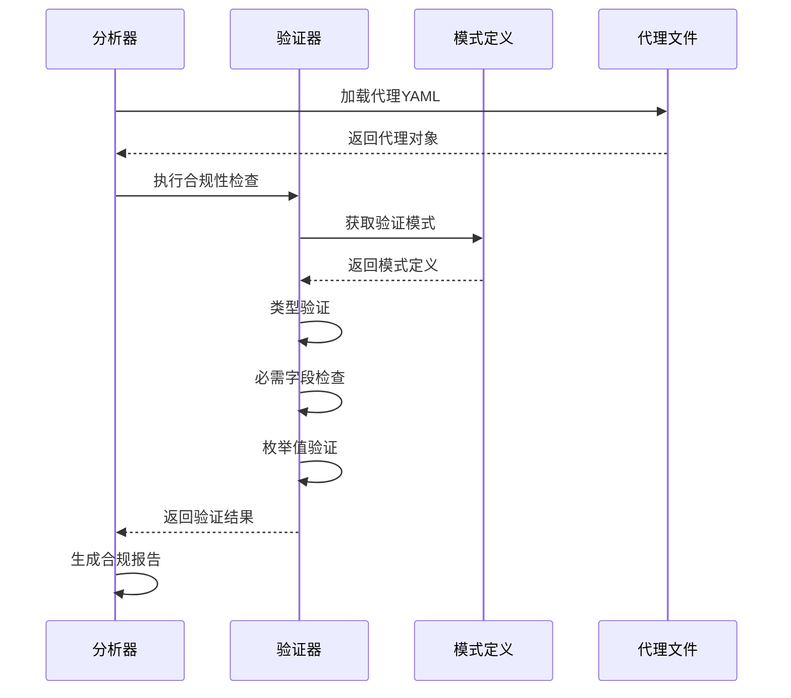

**图表来源**
- [agent-analyzer.js](file://tools/cli/lib/agent-analyzer.js#L121-L166)

**章节来源**
- [agent-analyzer.js](file://tools/cli/lib/agent-analyzer.js#L1-L110)

## 代理团队生成器

### 动态协作网络构建

代理团队生成器基于项目上下文动态构建多代理协作网络：

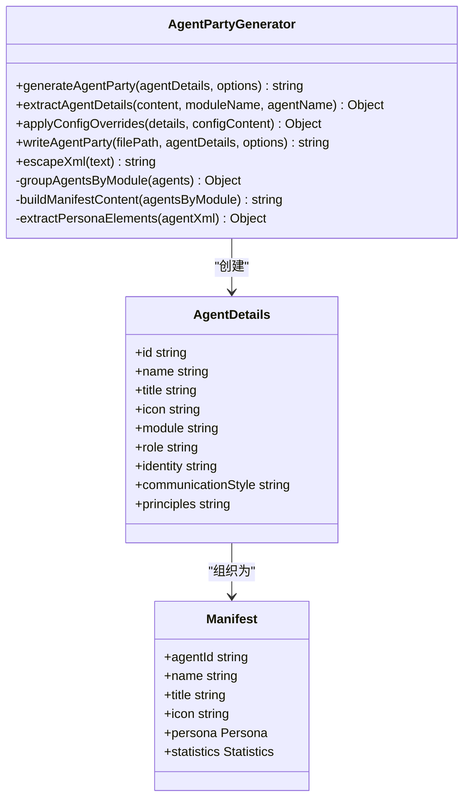

**图表来源**
- [agent-party-generator.js](file://tools/cli/lib/agent-party-generator.js#L4-L207)

### 团队配置管理

系统支持多种团队配置模式：

| 团队类型 | 配置方式 | 适用场景 | 特点 |
|---------|---------|---------|------|
| 固定团队 | 明确列出代理 | 项目开发 | 稳定可靠 |
| 全员团队 | "*"通配符 | 创意工作 | 灵活开放 |
| 模块团队 | 按模块分组 | 功能开发 | 结构清晰 |
| 自定义团队 | 动态组合 | 特殊需求 | 精确控制 |

### 代理清单生成

系统自动生成代理清单文件，支持快速检索和管理：

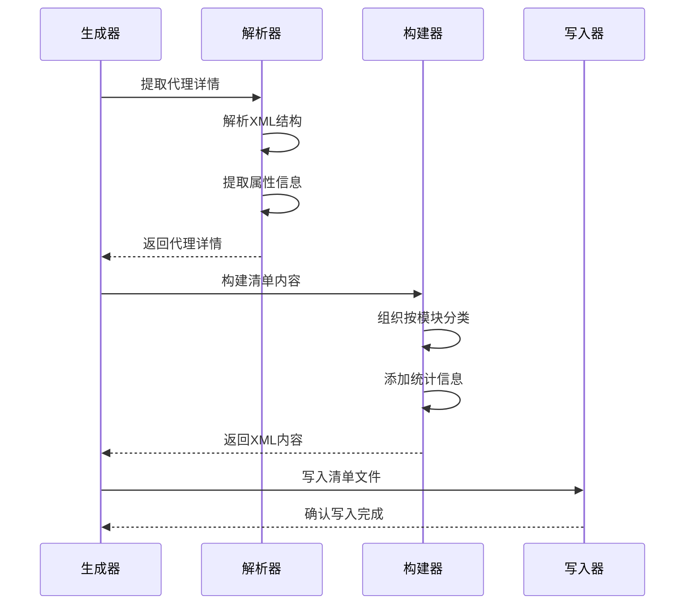

**图表来源**
- [agent-party-generator.js](file://tools/cli/lib/agent-party-generator.js#L11-L72)

**章节来源**
- [agent-party-generator.js](file://tools/cli/lib/agent-party-generator.js#L1-L207)
- [team-fullstack.yaml](file://src/modules/bmm/teams/team-fullstack.yaml#L1-L13)
- [creative-squad.yaml](file://src/modules/cis/teams/creative-squad.yaml#L1-L8)

## 激活构建系统

### 模块化激活框架

激活构建系统采用模块化设计，支持动态处理器注入：

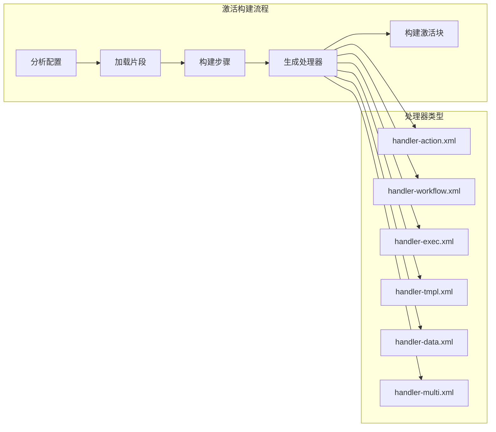

**图表来源**
- [activation-builder.js](file://tools/cli/lib/activation-builder.js#L1-L169)

### 片段缓存机制

系统实现了高效的片段缓存机制：

| 缓存级别 | 存储位置 | 生命周期 | 清理策略 |
|---------|---------|---------|---------|
| 内存缓存 | Map对象 | 运行时 | 手动清理 |
| 文件缓存 | 磁盘存储 | 持久化 | 版本控制 |
| 编译缓存 | 内存+磁盘 | 会话期间 | 自动过期 |

### Web Bundle支持

系统支持Web Bundle模式，提供优化的激活结构：

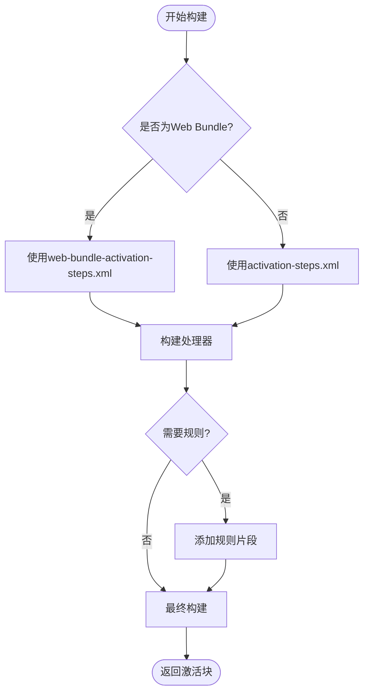

**图表来源**
- [activation-builder.js](file://tools/cli/lib/activation-builder.js#L44-L74)

**章节来源**
- [activation-builder.js](file://tools/cli/lib/activation-builder.js#L1-L169)

## XML处理与转换

### YAML到XML转换引擎

YAML/XML构建器提供了强大的转换能力：

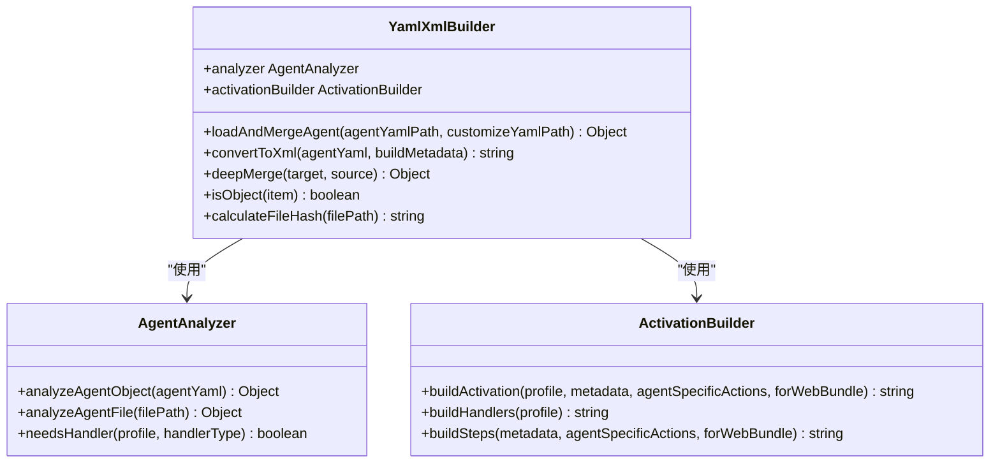

**图表来源**
- [yaml-xml-builder.js](file://tools/cli/lib/yaml-xml-builder.js#L1-L200)
- [agent-analyzer.js](file://tools/cli/lib/agent-analyzer.js#L1-L110)
- [activation-builder.js](file://tools/cli/lib/activation-builder.js#L1-L169)

### 智能激活注入

系统能够智能地将激活块注入到代理文件中：

| 注入方式 | 适用场景 | 优势 | 注意事项 |
|---------|---------|------|---------|
| XML解析注入 | 新版YAML代理 | 保持格式一致性 | 需要完整XML结构 |
| 字符串注入 | 传统XML代理 | 兼容性强 | 可能破坏格式 |
| 模板注入 | Web Bundle | 性能最优 | 需要预定义模板 |

### 元数据处理

转换过程中自动处理丰富的元数据信息：

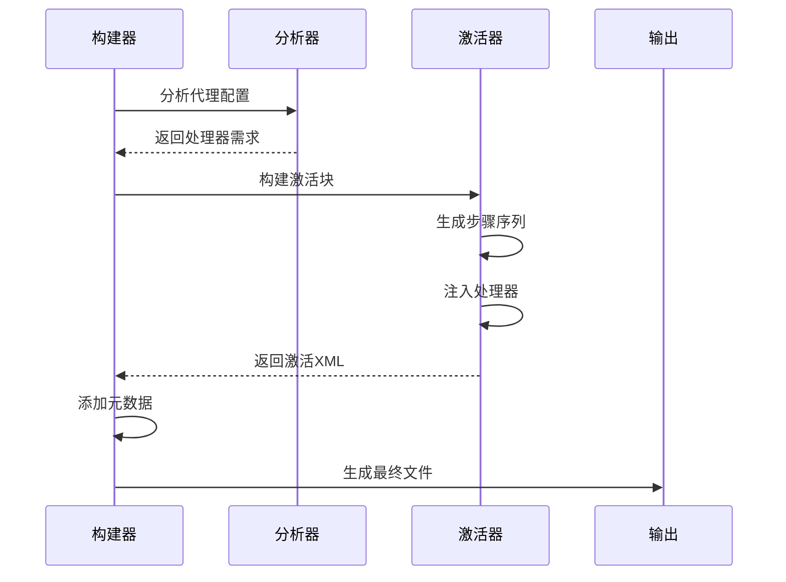

**图表来源**
- [yaml-xml-builder.js](file://tools/cli/lib/yaml-xml-builder.js#L144-L166)
- [xml-handler.js](file://tools/cli/lib/xml-handler.js#L1-L230)

**章节来源**
- [yaml-xml-builder.js](file://tools/cli/lib/yaml-xml-builder.js#L1-L607)
- [xml-handler.js](file://tools/cli/lib/xml-handler.js#L1-L230)

## 工作流与模板系统

### 工作流架构

BMAD支持复杂的工作流系统，具有以下特点：

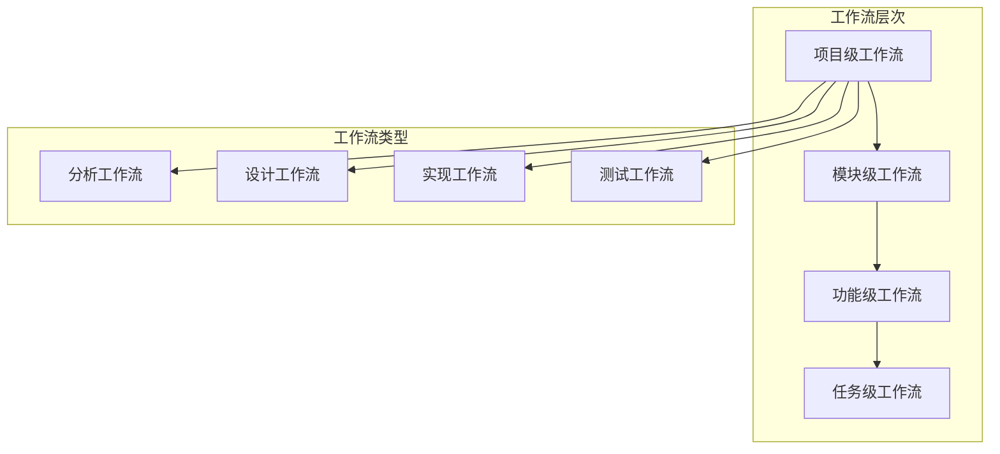

**图表来源**
- [generate-project-context.md](file://src/modules/bmm/workflows/generate-project-context/workflow.md#L1-L49)
- [document-project.yaml](file://src/modules/bmm/workflows/document-project/workflow.yaml#L1-L32)

### 模板系统

系统提供了灵活的模板系统支持：

| 模板类型 | 用途 | 特点 | 示例 |
|---------|------|------|------|
| 项目上下文模板 | 项目初始化 | 动态生成 | project-context-template.md |
| 文档模板 | 文档生成 | 结构化输出 | 文档项目工作流 |
| 配置模板 | 配置生成 | 参数化 | install-config.yaml |
| 工作流模板 | 流程定义 | 可重用 | workflow-template.md |

### 配置占位符系统

系统支持复杂的配置占位符替换：

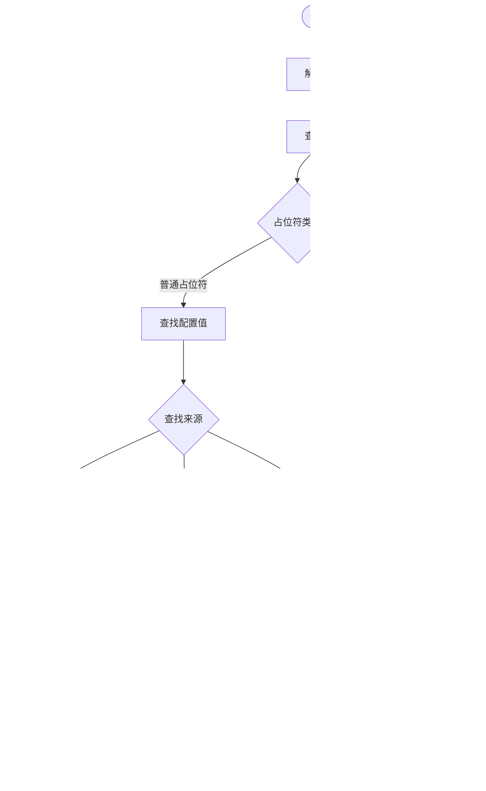

**图表来源**
- [config-collector.js](file://tools/cli/installers/lib/core/config-collector.js#L555-L592)

**章节来源**
- [generate-project-context.md](file://src/modules/bmm/workflows/generate-project-context/workflow.md#L1-L49)
- [document-project.yaml](file://src/modules/bmm/workflows/document-project/workflow.yaml#L1-L32)
- [install-config.yaml](file://src/core/_module-installer/install-config.yaml#L1-L36)

## 性能优化策略

### 缓存优化

系统实现了多层缓存策略：

| 缓存类型 | 缓存内容 | 缓存时间 | 清理策略 |
|---------|---------|---------|---------|
| 配置缓存 | 解析后的配置对象 | 运行时 | 手动清理 |
| 片段缓存 | XML片段内容 | 会话期间 | 自动过期 |
| 分析缓存 | 代理分析结果 | 持久化 | 版本控制 |
| 模板缓存 | 渲染后的模板 | 应用重启 | 重启清理 |

### 并行处理

系统支持并行处理多个组件：

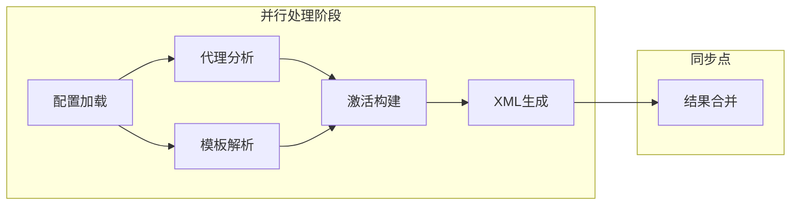

### 内存管理

系统采用智能内存管理策略：

- **延迟加载**：按需加载配置和模板
- **对象池**：重用分析器和构建器实例
- **垃圾回收**：及时释放不再使用的缓存
- **内存监控**：监控内存使用情况

## 分布式部署考虑

### 配置同步

在分布式环境中，配置同步至关重要：

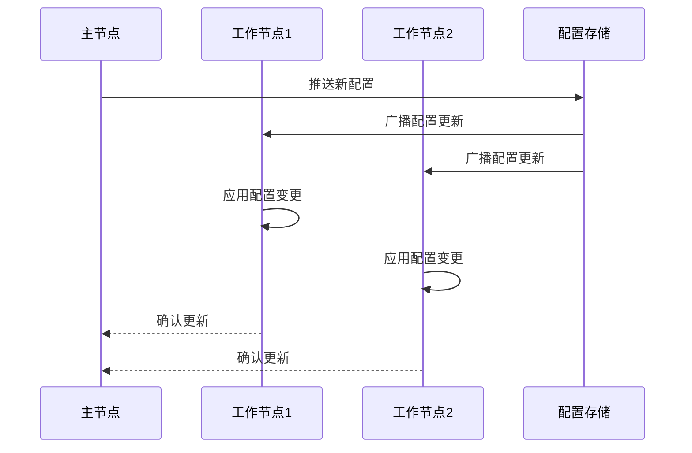

### 负载均衡

系统支持负载均衡策略：

| 负载均衡策略 | 适用场景 | 实现方式 | 优势 |
|-------------|---------|---------|------|
| 轮询调度 | 均匀分布请求 | 循环选择节点 | 简单有效 |
| 权重调度 | 不同节点能力 | 基于权重分配 | 提高效率 |
| 最少连接 | 动态负载感知 | 选择空闲最少节点 | 减少延迟 |
| 一致性哈希 | 会话保持 | 哈希环分配 | 稳定性好 |

### 故障恢复

系统具备完善的故障恢复机制：

- **健康检查**：定期检测组件状态
- **自动重试**：失败时自动重试
- **降级服务**：部分功能不可用时的备选方案
- **状态恢复**：系统崩溃后的状态恢复

## 故障排除指南

### 常见问题诊断

| 问题类型 | 症状 | 可能原因 | 解决方案 |
|---------|------|---------|---------|
| 配置加载失败 | 配置文件不存在或格式错误 | 文件路径错误、YAML语法错误 | 检查文件路径和语法 |
| 代理分析失败 | 分析结果为空或错误 | 代理文件格式不正确 | 验证代理文件结构 |
| 激活构建失败 | 生成的XML无效 | 片段缺失或处理器冲突 | 检查所需处理器 |
| 工作流执行失败 | 流程中断或错误 | 路径配置错误或权限问题 | 检查路径和权限 |

### 调试工具

系统提供了丰富的调试工具：

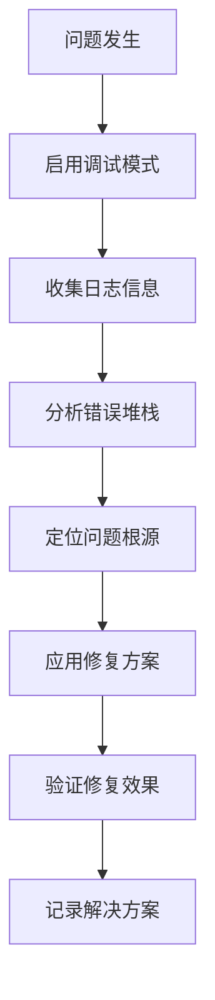

### 性能监控

系统内置性能监控功能：

- **响应时间监控**：跟踪各组件响应时间
- **资源使用监控**：监控CPU、内存使用情况
- **错误率监控**：跟踪错误发生频率
- **吞吐量监控**：监控系统处理能力

**章节来源**
- [config.js](file://tools/cli/lib/config.js#L1-L213)
- [agent-analyzer.js](file://tools/cli/lib/agent-analyzer.js#L1-L110)
- [activation-builder.js](file://tools/cli/lib/activation-builder.js#L1-L169)

## 总结

BMAD配置与分析系统是一个高度复杂且精密设计的多代理协作平台。通过深入分析其核心组件，我们可以看到：

1. **配置管理系统**采用了多层级继承和智能合并策略，支持灵活的配置定制和版本控制。

2. **代理分析器**运用了先进的静态分析算法，能够准确识别代理需求并构建完整的依赖关系图。

3. **代理团队生成器**基于项目上下文动态构建协作网络，支持多种团队配置模式。

4. **激活构建系统**提供了模块化的激活框架，支持Web Bundle和传统部署模式。

5. **XML处理与转换**引擎实现了高效的YAML到XML转换，支持智能激活注入和元数据处理。

6. **工作流与模板系统**提供了灵活的工作流定义和模板管理能力。

7. **性能优化**策略包括多层缓存、并行处理和智能内存管理，确保系统高效运行。

8. **分布式部署**考虑涵盖了配置同步、负载均衡和故障恢复等关键方面。

该系统的设计充分体现了现代软件架构的最佳实践，为大规模多代理系统的开发和部署提供了完整的解决方案。通过合理利用这些组件和特性，开发者可以构建出功能强大、性能优异的智能代理系统。