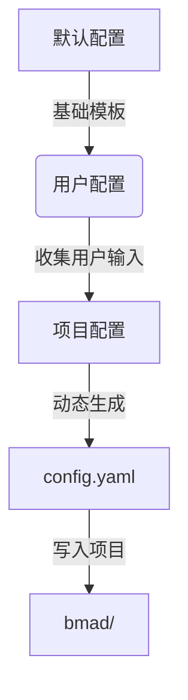
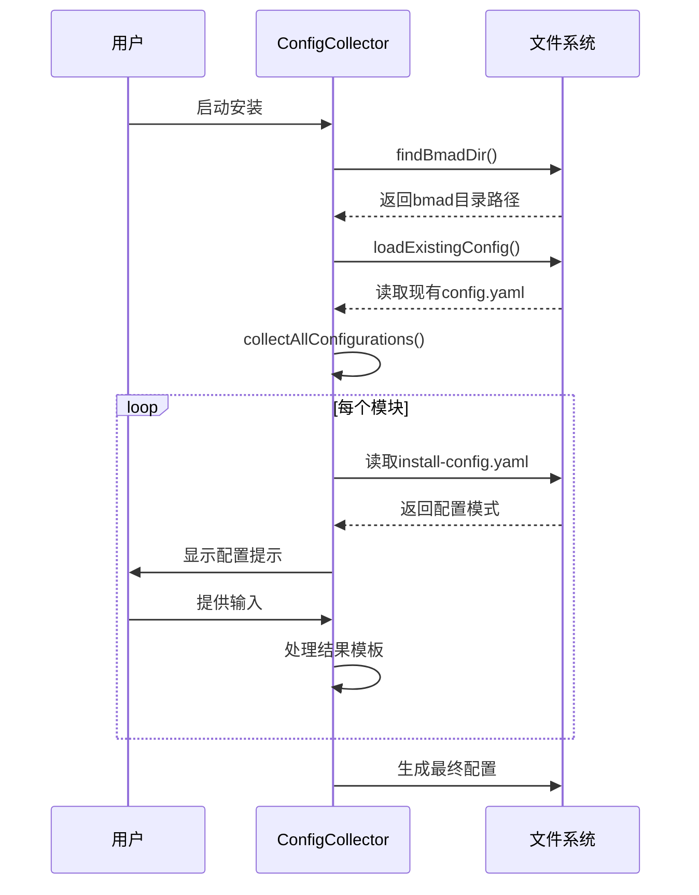
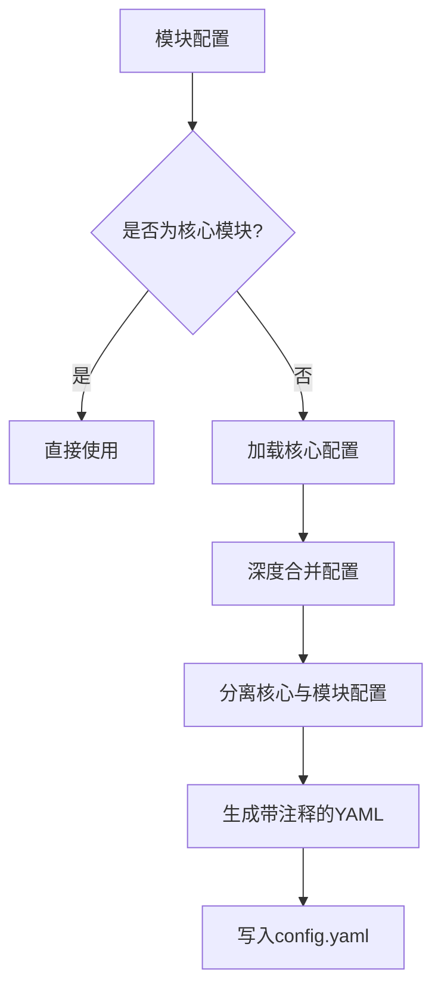
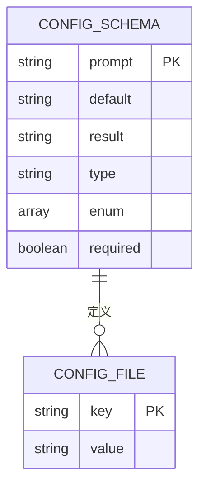
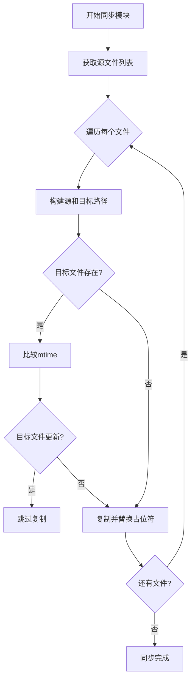

# 配置管理

<cite>
**本文档引用的文件**   
- [config.js](file://tools/cli/lib/config.js)
- [config-collector.js](file://tools/cli/installers/lib/core/config-collector.js)
- [installer.js](file://tools/cli/installers/lib/core/installer.js)
- [manifest.js](file://tools/cli/installers/lib/core/manifest.js)
- [manifest-generator.js](file://tools/cli/installers/lib/core/manifest-generator.js)
- [install-config.yaml](file://src/core/_module-installer/install-config.yaml)
- [install-config.yaml](file://src/modules/bmb/_module-installer/install-config.yaml)
</cite>

## 目录
1. [简介](#简介)
2. [配置层级结构](#配置层级结构)
3. [配置解析流程](#配置解析流程)
4. [配置合并与优先级](#配置合并与优先级)
5. [配置文件格式与验证](#配置文件格式与验证)
6. [配置缓存与性能优化](#配置缓存与性能优化)
7. [分布式环境下的配置同步](#分布式环境下的配置同步)
8. [错误处理与故障排除](#错误处理与故障排除)
9. [结论](#结论)

## 简介
本技术文档全面阐述了BMAD方法论中的配置管理系统。该系统采用模块化设计，支持核心配置、用户配置和项目配置的多层级结构。文档详细说明了配置项的解析流程、环境变量注入方式、运行时动态合并策略，以及配置缓存机制的实现细节和性能优化方案。同时，文档还涵盖了配置文件格式规范、验证规则、错误处理模式，并提供了在分布式环境下进行配置同步的最佳实践。

**Section sources**
- [config.js](file://tools/cli/lib/config.js#L1-L213)
- [config-collector.js](file://tools/cli/installers/lib/core/config-collector.js#L1-L855)

## 配置层级结构
BMAD的配置管理系统采用清晰的层级结构，主要分为三个层次：默认配置、用户配置和项目配置。默认配置存储在系统源码中，作为所有安装的基础。用户配置通过交互式安装过程收集，允许用户自定义如`bmad_folder`、`user_name`等核心参数。项目配置则在安装时根据所选模块动态生成，每个模块（如`bmb`、`bmgd`）都有其独立的配置文件。

**Diagram sources**
- [install-config.yaml](file://src/core/_module-installer/install-config.yaml#L1-L36)
- [install-config.yaml](file://src/modules/bmb/_module-installer/install-config.yaml#L1-L32)

**Section sources**
- [config-collector.js](file://tools/cli/installers/lib/core/config-collector.js#L136-L162)
- [installer.js](file://tools/cli/installers/lib/core/installer.js#L414-L423)

## 配置解析流程
配置解析流程始于`ConfigCollector`类，该类负责收集所有模块的配置。流程首先通过`findBmadDir`方法定位项目中的BMAD目录，然后使用`loadExistingConfig`加载已存在的配置文件。对于每个模块，系统会读取其`install-config.yaml`文件，该文件定义了配置项的提示、默认值和结果模板。

**Diagram sources**
- [config-collector.js](file://tools/cli/installers/lib/core/config-collector.js#L85-L129)
- [config-collector.js](file://tools/cli/installers/lib/core/config-collector.js#L136-L162)

**Section sources**
- [config-collector.js](file://tools/cli/installers/lib/core/config-collector.js#L464-L564)
- [installer.js](file://tools/cli/installers/lib/core/installer.js#L194-L258)

## 配置合并与优先级
配置合并遵循“后覆盖先”的原则，通过`deepMerge`方法实现深度合并。核心配置（core）具有最高优先级，会被直接合并到非核心模块的配置中。在合并过程中，系统会分离模块特定的配置项和核心配置项，并在生成的`config.yaml`文件中用注释明确标识核心配置值。

**Diagram sources**
- [config.js](file://tools/cli/lib/config.js#L76-L104)
- [installer.js](file://tools/cli/installers/lib/core/installer.js#L1195-L1240)

**Section sources**
- [config.js](file://tools/cli/lib/config.js#L76-L104)
- [installer.js](file://tools/cli/installers/lib/core/installer.js#L1195-L1240)

## 配置文件格式与验证
配置文件采用YAML格式，具有严格的结构和验证规则。系统通过`validateConfig`方法对配置进行验证，检查必填字段、数据类型和枚举值。配置模式（schema）定义在`install-config.yaml`文件中，包含`prompt`（提示）、`default`（默认值）、`result`（结果模板）等关键字段。环境变量通过`{value}`和`{project-root}`等占位符注入。

**Diagram sources**
- [config.js](file://tools/cli/lib/config.js#L121-L166)
- [install-config.yaml](file://src/core/_module-installer/install-config.yaml#L1-L36)

**Section sources**
- [config.js](file://tools/cli/lib/config.js#L121-L166)
- [config-collector.js](file://tools/cli/installers/lib/core/config-collector.js#L631-L793)

## 配置缓存与性能优化
系统通过文件时间戳（mtime）实现智能缓存，避免覆盖用户修改的文件。在同步模块文件时，`syncModule`方法会比较源文件和目标文件的修改时间，仅当源文件更新时才进行复制。此外，`ManifestGenerator`会为所有安装的文件计算SHA256哈希值，用于检测文件是否被修改，从而在更新时保留用户自定义内容。

**Diagram sources**
- [manager.js](file://tools/cli/installers/lib/modules/manager.js#L721-L743)
- [manifest-generator.js](file://tools/cli/installers/lib/core/manifest-generator.js#L621-L628)

**Section sources**
- [manager.js](file://tools/cli/installers/lib/modules/manager.js#L721-L743)
- [manifest-generator.js](file://tools/cli/installers/lib/core/manifest-generator.js#L621-L628)

## 分布式环境下的配置同步
在分布式环境下，配置同步的关键在于`manifest.yaml`和`files-manifest.csv`文件。`manifest.yaml`记录了安装的版本、日期和模块列表，而`files-manifest.csv`则包含了每个文件的哈希值。通过比较这些清单文件，系统可以精确地识别出哪些文件需要更新，哪些文件是用户自定义的，从而实现安全、高效的增量更新。

**Section sources**
- [manifest.js](file://tools/cli/installers/lib/core/manifest.js#L1-L114)
- [manifest-generator.js](file://tools/cli/installers/lib/core/manifest-generator.js#L1-L693)

## 错误处理与故障排除
系统实现了多层次的错误处理机制。在配置加载时，使用`try-catch`块捕获解析错误，并发出警告而非中断流程。对于文件操作，系统会检查路径是否存在，并在失败时提供详细的错误信息（如权限被拒绝或磁盘空间不足）。在配置验证阶段，系统会收集所有错误和警告，并在安装完成后统一报告。

**Section sources**
- [config-collector.js](file://tools/cli/installers/lib/core/config-collector.js#L117-L119)
- [installer.js](file://tools/cli/installers/lib/core/installer.js#L508-L517)

## 结论
BMAD的配置管理系统是一个健壮、灵活且用户友好的解决方案。它通过清晰的层级结构、高效的解析流程和智能的缓存机制，确保了配置的一致性和性能。系统对错误处理的重视和对分布式同步的支持，使其能够适应复杂的开发环境。遵循本文档中的最佳实践，可以确保配置管理系统的稳定运行和高效维护。