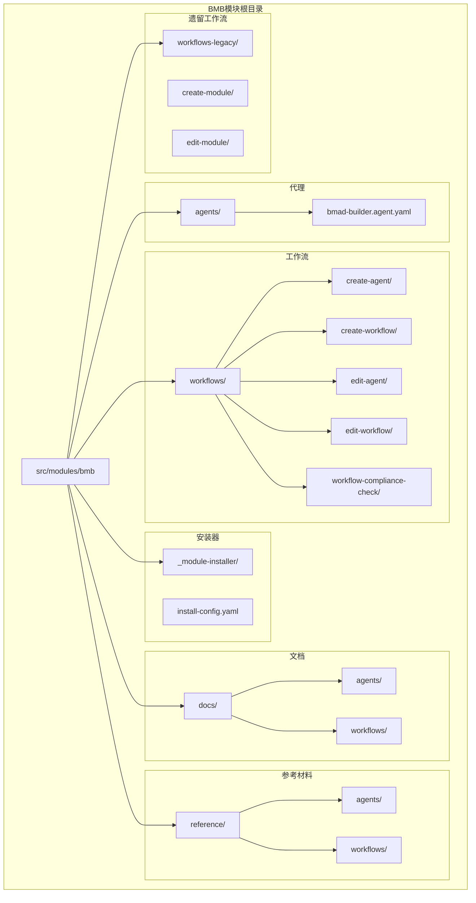
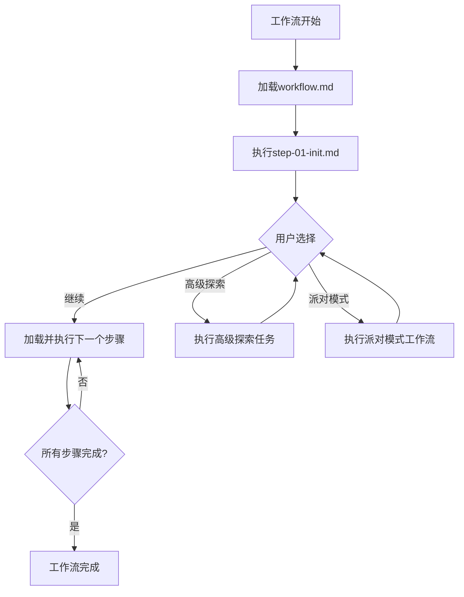
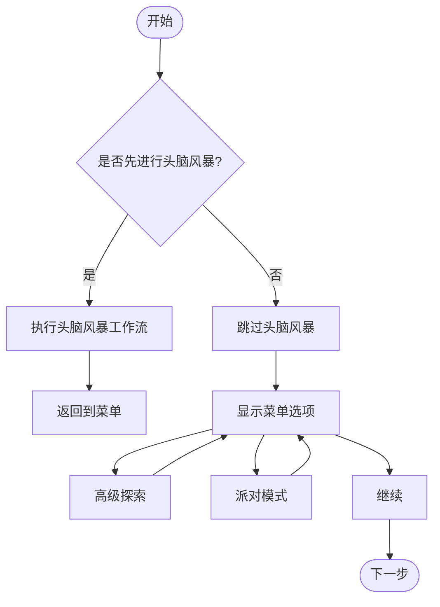
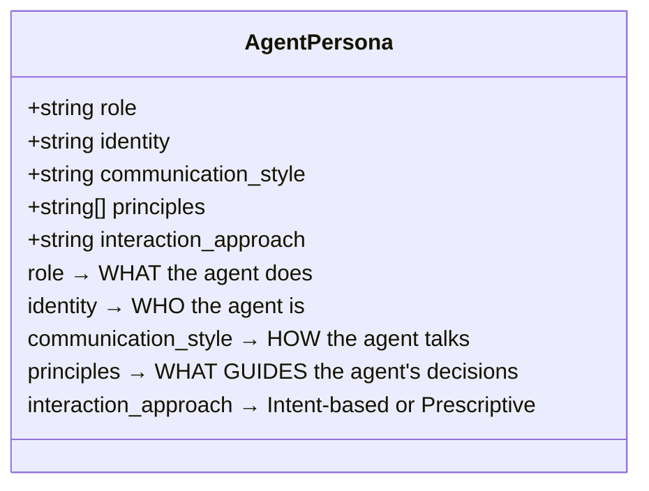
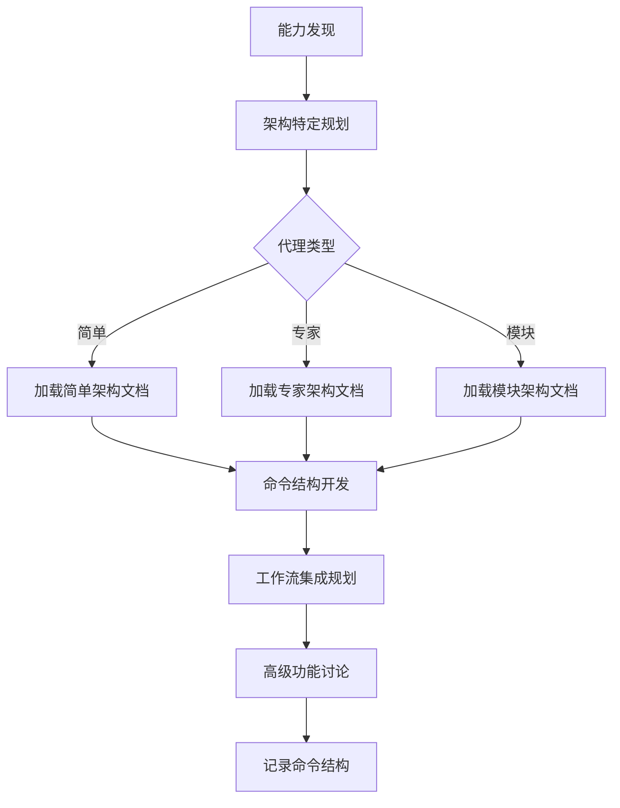
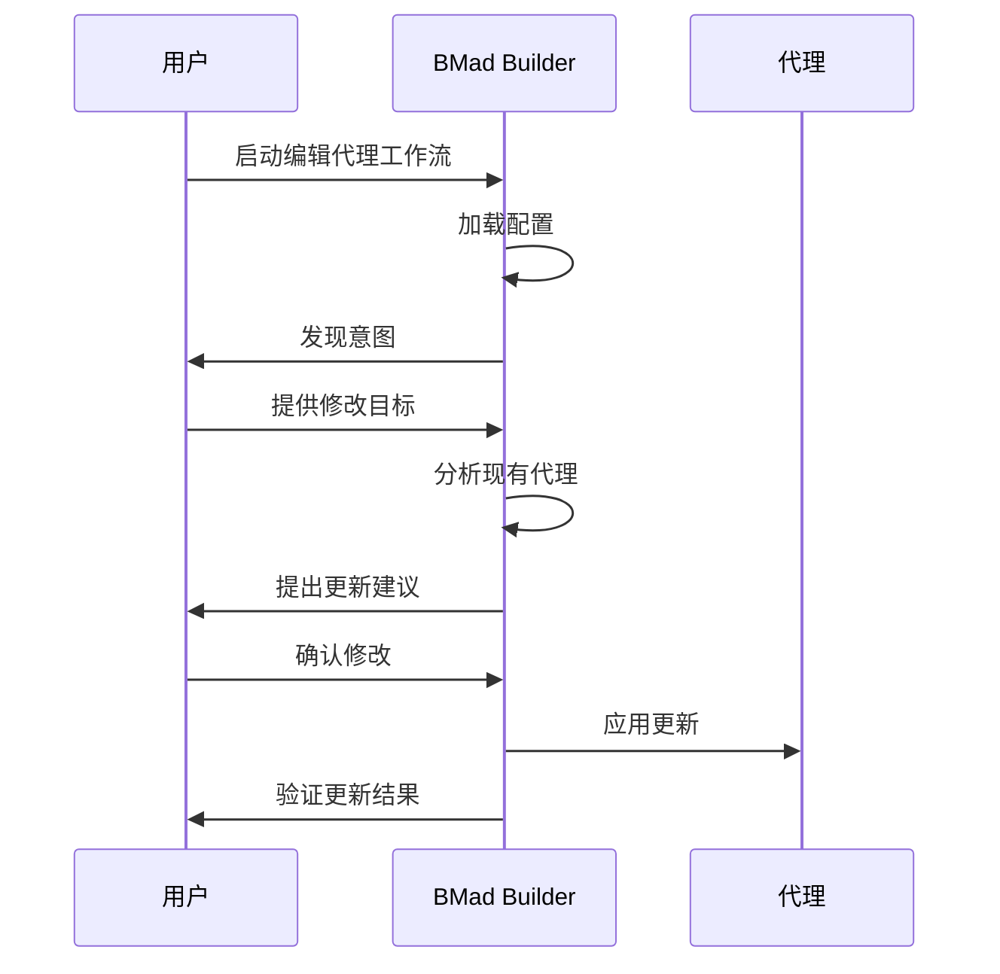
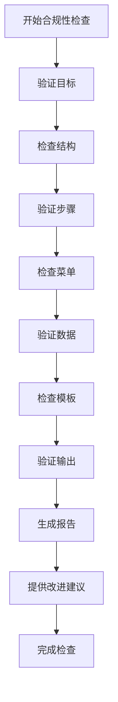
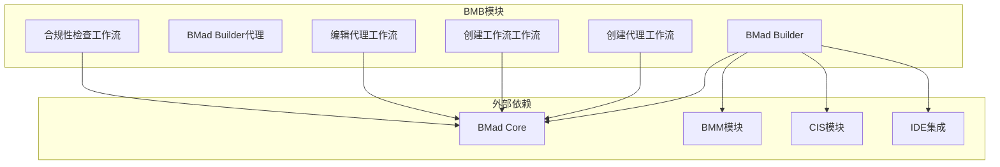

# BMad Builder (BMB)

<cite>
**本文档引用的文件**
- [bmad-builder.agent.yaml](file://src/modules/bmb/agents/bmad-builder.agent.yaml)
- [README.md](file://src/modules/bmb/README.md)
- [create-agent/workflow.md](file://src/modules/bmb/workflows/create-agent/workflow.md)
- [create-agent/steps/step-01-brainstorm.md](file://src/modules/bmb/workflows/create-agent/steps/step-01-brainstorm.md)
- [create-agent/steps/step-03-persona.md](file://src/modules/bmb/workflows/create-agent/steps/step-03-persona.md)
- [create-agent/steps/step-04-commands.md](file://src/modules/bmb/workflows/create-agent/steps/step-04-commands.md)
- [create-agent/templates/agent_persona.md](file://src/modules/bmb/workflows/create-agent/templates/agent_persona.md)
- [create-agent/templates/agent_commands.md](file://src/modules/bmb/workflows/create-agent/templates/agent_commands.md)
- [edit-agent/workflow.md](file://src/modules/bmb/workflows/edit-agent/workflow.md)
- [workflow-compliance-check/workflow.md](file://src/modules/bmb/workflows/workflow-compliance-check/workflow.md)
- [understanding-agent-types.md](file://src/modules/bmb/docs/agents/understanding-agent-types.md)
- [architecture.md](file://src/modules/bmb/docs/workflows/architecture.md)
- [commit-poet.agent.yaml](file://src/modules/bmb/reference/agents/simple-examples/commit-poet.agent.yaml)
- [security-engineer.agent.yaml](file://src/modules/bmb/reference/agents/module-examples/security-engineer.agent.yaml)
</cite>

## 目录
1. [简介](#简介)
2. [项目结构](#项目结构)
3. [核心组件](#核心组件)
4. [架构概述](#架构概述)
5. [详细组件分析](#详细组件分析)
6. [依赖分析](#依赖分析)
7. [性能考虑](#性能考虑)
8. [故障排除指南](#故障排除指南)
9. [结论](#结论)

## 简介
BMad Builder (BMB) 模块是BMad框架的核心工具集，专门用于创建、自定义和扩展BMad组件，包括代理、工作流和完整模块。BMB提供了一套系统化的方法，通过引导式工作流帮助用户从头脑风暴到最终部署，逐步构建符合BMad核心标准的代理和工作流。该模块支持三种主要的代理架构：简单代理、专家代理和模块代理，每种架构都针对不同的使用场景和集成需求。BMB通过其独特的"步骤文件架构"（Step-File Architecture）确保了工作流的纪律性执行，采用即时加载（JIT Loading）和顺序执行原则，防止跳过步骤或优化序列。此外，BMB还提供了强大的合规性检查工作流，通过对抗性分析对现有工作流进行系统性验证，确保质量和一致性。用户可以通过BMad Builder代理或直接执行工作流文件来启动创建过程，该模块集成了丰富的参考材料和模板，支持从头开始创建新模块或编辑现有组件。

## 项目结构
BMad Builder (BMB) 模块具有清晰的目录结构，将代理、工作流、文档和参考材料组织在逻辑分明的子目录中。该结构支持模块化开发和易于导航，确保所有组件都能被快速定位和理解。



**Diagram sources**
- [README.md](file://src/modules/bmb/README.md)

**Section sources**
- [README.md](file://src/modules/bmb/README.md)

## 核心组件
BMad Builder (BMB) 模块的核心组件包括BMad Builder代理、创建代理工作流、创建工作流工作流、编辑代理工作流、工作流合规性检查以及详细的文档和参考材料。BMad Builder代理是整个模块的中心枢纽，通过其菜单系统提供创建、编辑和验证代理及工作流的功能。创建代理工作流是一个包含11个步骤的引导式流程，从头脑风暴到庆祝完成，帮助用户系统性地构建代理。创建工作流工作流则专注于设计结构化的工作流，采用步骤文件架构确保纪律性执行。编辑代理工作流允许用户修改现有代理，而工作流合规性检查则通过8个系统性验证步骤确保工作流的质量和一致性。此外，模块还提供了全面的文档，详细说明了代理类型、工作流架构和最佳实践。

**Section sources**
- [README.md](file://src/modules/bmb/README.md)
- [bmad-builder.agent.yaml](file://src/modules/bmb/agents/bmad-builder.agent.yaml)

## 架构概述
BMad Builder (BMB) 模块的架构基于"步骤文件架构"（Step-File Architecture），这是一种将工作流分解为多个自包含、微小文件的设计模式。这种架构的核心原则包括微文件设计、即时加载、顺序执行、状态跟踪和追加式构建。每个工作流由一个主工作流文件（workflow.md）和多个步骤文件（steps/*.md）组成，主文件定义了工作流的配置和角色，而每个步骤文件则包含特定的指令和规则。系统采用即时加载机制，确保在任何时刻只有当前步骤文件在内存中，从而防止预加载未来步骤或跳过步骤。状态通过输出文档的前言（frontmatter）进行跟踪，使用`stepsCompleted`数组记录已完成的步骤。这种架构确保了工作流的纪律性执行，同时保持了灵活性和可维护性。



**Diagram sources**
- [architecture.md](file://src/modules/bmb/docs/workflows/architecture.md)
- [create-agent/workflow.md](file://src/modules/bmb/workflows/create-agent/workflow.md)

## 详细组件分析
BMad Builder (BMB) 模块的详细组件分析涵盖了创建代理的完整流程，从头脑风暴到验证的各个阶段。该分析深入探讨了如何定义代理的个性、命令和触发器，并展示了如何通过YAML配置文件实现这些功能。

### 创建代理流程分析
创建代理流程是一个包含11个步骤的引导式工作流，旨在帮助用户系统性地构建符合BMad核心标准的代理。该流程从可选的头脑风暴阶段开始，然后逐步引导用户完成代理发现、个性塑造、命令设计、命名、构建、验证、设置、自定义、工具构建和最终庆祝。

#### 头脑风暴阶段


**Diagram sources**
- [create-agent/steps/step-01-brainstorm.md](file://src/modules/bmb/workflows/create-agent/steps/step-01-brainstorm.md)

**Section sources**
- [create-agent/steps/step-01-brainstorm.md](file://src/modules/bmb/workflows/create-agent/steps/step-01-brainstorm.md)

#### 个性塑造阶段
个性塑造阶段是创建代理流程中的关键步骤，它指导用户使用四字段系统来开发代理的完整个性。这四个字段分别是：角色（Role）、身份（Identity）、沟通风格（Communication_Style）和原则（Principles），每个字段都有其独特的用途。



**Diagram sources**
- [create-agent/steps/step-03-persona.md](file://src/modules/bmb/workflows/create-agent/steps/step-03-persona.md)
- [create-agent/templates/agent_persona.md](file://src/modules/bmb/workflows/create-agent/templates/agent_persona.md)

**Section sources**
- [create-agent/steps/step-03-persona.md](file://src/modules/bmb/workflows/create-agent/steps/step-03-persona.md)
- [create-agent/templates/agent_persona.md](file://src/modules/bmb/workflows/create-agent/templates/agent_persona.md)

#### 命令设计阶段
命令设计阶段将用户的期望能力转化为结构化的YAML命令系统。该阶段根据代理类型（简单、专家或模块）加载相应的架构文档，并指导用户规划工作流集成和高级功能。



**Diagram sources**
- [create-agent/steps/step-04-commands.md](file://src/modules/bmb/workflows/create-agent/steps/step-04-commands.md)
- [create-agent/templates/agent_commands.md](file://src/modules/bmb/workflows/create-agent/templates/agent_commands.md)

**Section sources**
- [create-agent/steps/step-04-commands.md](file://src/modules/bmb/workflows/create-agent/steps/step-04-commands.md)
- [create-agent/templates/agent_commands.md](file://src/modules/bmb/workflows/create-agent/templates/agent_commands.md)

### 代理类型分析
BMad Builder (BMB) 支持三种主要的代理架构：简单代理、专家代理和模块代理。这些类型主要区别在于架构和集成方式，而不是能力限制。

```mermaid
erDiagram
AGENT_TYPES {
string type PK
string self_contained
string persistent_memory
string knowledge_base
string domain_restriction
string personal_workflows
string module_workflows
string team_integration
}
AGENT_TYPES ||--o{ SIMPLE : "Simple"
AGENT_TYPES ||--o{ EXPERT : "Expert"
AGENT_TYPES ||--o{ MODULE : "Module"
class SIMPLE {
self_contained: ✓ All in YAML
persistent_memory: ✗ Stateless
knowledge_base: ✗
domain_restriction: ✗ System-wide
personal_workflows: ✗
module_workflows: ✗
team_integration: Solo utility
}
class EXPERT {
self_contained: Sidecar files
persistent_memory: ✓ memories.md
knowledge_base: ✓ sidecar/knowledge/
domain_restriction: ✓ Sidecar only
personal_workflows: ✓ If critical_actions loads workflow engine
module_workflows: ✗
team_integration: Personal assistant
}
class MODULE {
self_contained: Sidecar optional
persistent_memory: ✓ If needed
knowledge_base: Module/shared
domain_restriction: Optional
personal_workflows: ✗
module_workflows: ✓ Shared workflows
team_integration: Team member
}
```

**Diagram sources**
- [understanding-agent-types.md](file://src/modules/bmb/docs/agents/understanding-agent-types.md)

**Section sources**
- [understanding-agent-types.md](file://src/modules/bmb/docs/agents/understanding-agent-types.md)

### 编辑和合规性工作流分析
BMad Builder (BMB) 提供了编辑现有代理和工作流的能力，以及一个专门的合规性检查工作流来确保质量。

#### 编辑代理工作流


**Diagram sources**
- [edit-agent/workflow.md](file://src/modules/bmb/workflows/edit-agent/workflow.md)

**Section sources**
- [edit-agent/workflow.md](file://src/modules/bmb/workflows/edit-agent/workflow.md)

#### 工作流合规性检查


**Diagram sources**
- [workflow-compliance-check/workflow.md](file://src/modules/bmb/workflows/workflow-compliance-check/workflow.md)

**Section sources**
- [workflow-compliance-check/workflow.md](file://src/modules/bmb/workflows/workflow-compliance-check/workflow.md)

## 依赖分析
BMad Builder (BMB) 模块与BMad核心框架及其他模块（如BMM和CIS）紧密集成。BMB依赖于BMad核心的代理编译和工作流执行功能，同时为BMM和CIS等模块提供代理和工作流创建能力。这种依赖关系是双向的：BMB利用核心功能来实现其工作流，同时为其他模块提供扩展和自定义的能力。此外，BMB还依赖于各种IDE集成，以在不同开发环境中提供一致的用户体验。



**Diagram sources**
- [README.md](file://src/modules/bmb/README.md)
- [bmad-builder.agent.yaml](file://src/modules/bmb/agents/bmad-builder.agent.yaml)

**Section sources**
- [README.md](file://src/modules/bmb/README.md)
- [bmad-builder.agent.yaml](file://src/modules/bmb/agents/bmad-builder.agent.yaml)

## 性能考虑
BMad Builder (BMB) 模块的性能主要得益于其"步骤文件架构"和即时加载机制。通过将工作流分解为微小的、自包含的文件，系统能够最小化内存使用，因为任何时候只有当前步骤文件在内存中。这种设计不仅提高了性能，还增强了系统的可维护性和可扩展性。顺序执行和状态跟踪机制确保了工作流的可靠性和一致性，防止了由于跳过步骤或状态不一致导致的错误。此外，追加式构建方法减少了I/O操作的开销，因为文档是通过追加内容逐步构建的，而不是反复读写整个文件。

## 故障排除指南
当使用BMad Builder (BMB) 模块时，如果遇到问题，首先应检查工作流是否遵循了严格的执行规则。确保没有尝试同时加载多个步骤文件，始终在执行前完整读取当前步骤文件，并且只有在用户选择"继续"（C）时才进入下一步。如果工作流似乎卡住或行为异常，请检查输出文档的前言（frontmatter）中的`stepsCompleted`数组，以确定最后完成的步骤。对于代理创建问题，请参考`src/modules/bmb/reference/agents/`目录下的示例代理，如`commit-poet.agent.yaml`和`security-engineer.agent.yaml`，以验证YAML配置的正确性。如果合规性检查失败，请仔细阅读生成的报告，其中会详细列出严重性分级的违规项和改进建议。

**Section sources**
- [commit-poet.agent.yaml](file://src/modules/bmb/reference/agents/simple-examples/commit-poet.agent.yaml)
- [security-engineer.agent.yaml](file://src/modules/bmb/reference/agents/module-examples/security-engineer.agent.yaml)

## 结论
BMad Builder (BMB) 模块为扩展和自定义BMad框架提供了一个强大而系统的工具集。通过其引导式工作流、清晰的架构原则和全面的文档，BMB使用户能够以一致和高质量的方式创建代理、工作流和完整模块。该模块的核心创新在于其"步骤文件架构"，它通过微文件设计、即时加载和顺序执行确保了工作流的纪律性。BMB不仅支持从头开始创建新组件，还提供了编辑现有组件和进行合规性检查的能力，形成了一个完整的开发生命周期。通过支持简单代理、专家代理和模块代理三种架构，BMB能够满足从独立工具到团队集成解决方案的各种需求。随着模块市场的不断发展，BMB将成为推动BMad生态系统创新和共享的关键力量。