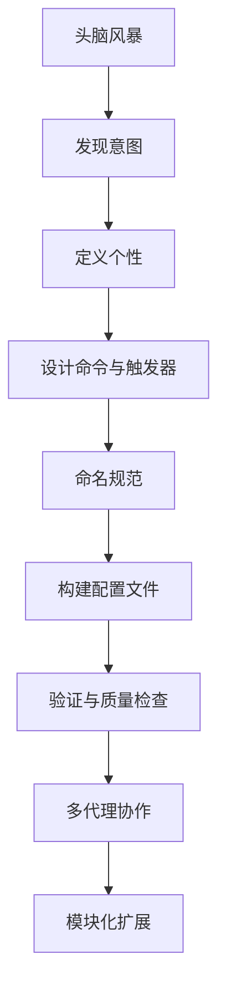

# 创建代理

<cite>
**本文档中引用的文件**   
- [commit-poet.agent.yaml](file://custom/src/agents/commit-poet/commit-poet.agent.yaml)
- [toolsmith.agent.yaml](file://custom/src/agents/toolsmith/toolsmith.agent.yaml)
- [agent-validation-checklist.md](file://src/modules/bmb/workflows/create-agent/data/agent-validation-checklist.md)
- [communication-presets.csv](file://src/modules/bmb/workflows/create-agent/data/communication-presets.csv)
- [workflow.md](file://src/modules/bmb/workflows/create-agent/workflow.md)
- [step-01-brainstorm.md](file://src/modules/bmb/workflows/create-agent/steps/step-01-brainstorm.md)
- [step-02-discover.md](file://src/modules/bmb/workflows/create-agent/steps/step-02-discover.md)
- [step-03-persona.md](file://src/modules/bmb/workflows/create-agent/steps/step-03-persona.md)
- [step-04-commands.md](file://src/modules/bmb/workflows/create-agent/steps/step-04-commands.md)
- [step-07-validate.md](file://src/modules/bmb/workflows/create-agent/steps/step-07-validate.md)
- [step-08-setup.md](file://src/modules/bmb/workflows/create-agent/steps/step-08-setup.md)
- [step-09-customize.md](file://src/modules/bmb/workflows/create-agent/steps/step-09-customize.md)
- [step-11-celebrate.md](file://src/modules/bmb/workflows/create-agent/steps/step-11-celebrate.md)
</cite>

## 目录
1. [介绍](#介绍)
2. [代理创建流程](#代理创建流程)
3. [发现意图](#发现意图)
4. [定义个性](#定义个性)
5. [设计命令与触发器](#设计命令与触发器)
6. [命名规范](#命名规范)
7. [构建配置文件](#构建配置文件)
8. [验证与质量检查](#验证与质量检查)
9. [多代理协作](#多代理协作)
10. [模块化扩展](#模块化扩展)

## 介绍

创建自定义代理是一个系统化的过程，涵盖了从头脑风暴到验证的完整工作流。本指南详细解释了如何创建符合BMAD方法的代理，包括发现意图、定义个性、设计命令与触发器、命名规范、构建配置文件等步骤。通过实际示例如commit-poet.agent.yaml，展示如何编写符合规范的代理YAML文件。同时，详细说明了agent-validation-checklist.md中的质量检查标准，并提供常见错误及其修复方法。此外，还描述了communication-presets.csv在多代理协作中的作用，以及该工作流如何支持安全的自定义和模块化扩展。

## 代理创建流程

创建代理的工作流遵循一个结构化的步骤序列，确保每个代理都经过精心设计和验证。整个流程从头脑风暴开始，逐步深入到发现意图、定义个性、设计命令与触发器、命名规范、构建配置文件，最后进行验证和质量检查。



**图示来源**
- [workflow.md](file://src/modules/bmb/workflows/create-agent/workflow.md)

**章节来源**
- [workflow.md](file://src/modules/bmb/workflows/create-agent/workflow.md)

## 发现意图

发现意图是创建代理的第一步，旨在明确代理的核心目的和目标用户。通过与用户的互动，引导他们思考代理将解决的问题、主要用户群体以及代理的独特之处。

### 头脑风暴

在正式进入发现意图之前，可以选择进行头脑风暴，以激发创意并探索可能的代理概念。头脑风暴的好处包括快速生成多个代理概念、探索不同的用例和方法、发现独特的功能组合以及获得创意提示。

**章节来源**
- [step-01-brainstorm.md](file://src/modules/bmb/workflows/create-agent/steps/step-01-brainstorm.md)

### 目的发现

通过自然对话的方式，引导用户阐述代理的核心目的。关键问题包括：
- 你的代理将帮助解决哪些问题或挑战？
- 代理的主要用户是谁？
- 与现有解决方案相比，你的代理有何独特之处？
- 代理将处理哪些具体任务或工作流？

继续对话，直到代理的目的清晰明了。

**章节来源**
- [step-02-discover.md](file://src/modules/bmb/workflows/create-agent/steps/step-02-discover.md)

## 定义个性

定义个性是创建代理的关键步骤之一，它决定了代理的行为方式和沟通风格。个性由四个字段组成：角色、身份、沟通风格和原则。

### 角色

角色描述了代理的功能和能力。例如，“战略业务分析师+需求专家”或“代码审查专家”。

### 身份

身份描述了代理的背景和经验。例如，“拥有8年以上连接市场洞察与战略经验的高级分析师”。

### 沟通风格

沟通风格描述了代理的说话方式。例如，“像 pulp 超级英雄一样说话，充满戏剧性和英雄语言”。

### 原则

原则描述了指导代理决策的信念和操作哲学。例如，“每个业务挑战都有根本原因。基于证据得出结论。”

**章节来源**
- [step-03-persona.md](file://src/modules/bmb/workflows/create-agent/steps/step-03-persona.md)

## 设计命令与触发器

设计命令与触发器是将用户需求转化为具体功能的过程。每个命令都需要一个触发词（用户说的内容）、描述（它做什么）以及工作流引用或直接动作。

### 命令结构

命令的结构如下：
- **触发词**：用户输入的关键词。
- **描述**：命令的功能描述。
- **动作**：执行的具体操作或引用的工作流。

### 工作流集成

对于需要调用工作流的命令，需要验证路径是否正确、确保工作流兼容性，并记录集成点。如果需要新的工作流，则记录创建需求。

**章节来源**
- [step-04-commands.md](file://src/modules/bmb/workflows/create-agent/steps/step-04-commands.md)

## 命名规范

命名规范确保代理的名称清晰且具有描述性。代理的文件名应使用连字符命名法（kebab-case），并以`.agent.yaml`结尾。

### 文件命名

- 文件名：`{agent-name}.agent.yaml`
- 示例：`commit-poet.agent.yaml`

**章节来源**
- [agent-validation-checklist.md](file://src/modules/bmb/workflows/create-agent/data/agent-validation-checklist.md)

## 构建配置文件

构建配置文件是将所有设计元素整合到YAML文件中的过程。配置文件包括元数据、个性、提示和菜单等部分。

### 元数据

元数据包含代理的基本信息，如ID、名称、标题和图标。

```yaml
agent:
  metadata:
    id: .bmad/agents/commit-poet/commit-poet.md
    name: "Inkwell Von Comitizen"
    title: "Commit Message Artisan"
    icon: "📜"
    type: simple
```

### 个性

个性部分定义了代理的角色、身份、沟通风格和原则。

```yaml
persona:
  role: |
    I am a Commit Message Artisan - transforming code changes into clear, meaningful commit history.
  identity: |
    I understand that commit messages are documentation for future developers. Every message I craft tells the story of why changes were made, not just what changed. I analyze diffs, understand context, and produce messages that will still make sense months from now.
  communication_style: "Poetic drama and flair with every turn of a phrase. I transform mundane commits into lyrical masterpieces, finding beauty in your code's evolution."
  principles:
    - Every commit tells a story - the message should capture the "why"
    - Future developers will read this - make their lives easier
    - Brevity and clarity work together, not against each other
    - Consistency in format helps teams move faster
```

### 提示

提示部分定义了代理在不同情境下的响应。

```yaml
prompts:
  - id: write-commit
    content: |
      <instructions>
      I'll craft a commit message for your changes. Show me:
      - The diff or changed files, OR
      - A description of what you changed and why

      I'll analyze the changes and produce a message in conventional commit format.
      </instructions>

      <process>
      1. Understand the scope and nature of changes
      2. Identify the primary intent (feature, fix, refactor, etc.)
      3. Determine appropriate scope/module
      4. Craft subject line (imperative mood, concise)
      5. Add body explaining "why" if non-obvious
      6. Note breaking changes or closed issues
      </process>

      Show me your changes and I'll craft the message.
```

### 菜单

菜单部分定义了用户可以使用的命令。

```yaml
menu:
  - trigger: write
    action: "#write-commit"
    description: "Craft a commit message for your changes"
  - trigger: analyze
    action: "#analyze-changes"
    description: "Analyze changes before writing the message"
  - trigger: improve
    action: "#improve-message"
    description: "Improve an existing commit message"
  - trigger: batch
    action: "#batch-commits"
    description: "Create cohesive messages for multiple commits"
```

**章节来源**
- [commit-poet.agent.yaml](file://custom/src/agents/commit-poet/commit-poet.agent.yaml)

## 验证与质量检查

验证与质量检查确保代理符合BMAD标准。使用agent-validation-checklist.md中的检查清单来验证代理的质量。

### YAML结构验证

- [ ] YAML解析无错误
- [ ] `agent.metadata`包含：`id`、`name`、`title`、`icon`
- [ ] `agent.metadata.module`存在（如果是模块代理）
- [ ] `agent.persona`存在，包含角色、身份、沟通风格、原则
- [ ] `agent.menu`存在，至少有一个项目
- [ ] 文件名是连字符命名法并以`.agent.yaml`结尾

### 个性验证

- [ ] **角色**仅包含知识/技能/能力（代理做什么）
- [ ] **身份**仅包含背景/经验/上下文（代理是谁）
- [ ] **沟通风格**仅包含口头模式（无行为、无角色陈述、无原则）
- [ ] **原则**包含操作哲学和行为准则

### 常见问题及修复方法

#### 问题：沟通风格包含行为

**问题**："Experienced analyst who ensures all stakeholders are heard"
**修复**：提取到适当的字段：
- identity: "Senior analyst with 8+ years..."
- communication_style: "Treats analysis like a treasure hunt"
- principles: "Ensure all stakeholder voices heard"

#### 问题：侧车文件引用损坏（专家代理）

**问题**：菜单项引用`tmpl="templates/daily.md"`但文件不存在
**修复**：创建文件或修复路径以指向实际文件

#### 问题：使用旧类型名称

**问题**：注释中提到"full agent"或"hybrid agent"
**修复**：更新为Simple/Expert/Module术语

#### 问题：菜单触发器以星号开头

**问题**：`trigger: "*create"`在YAML中
**修复**：删除星号 - 编译器会自动添加：`trigger: "create"`

**章节来源**
- [agent-validation-checklist.md](file://src/modules/bmb/workflows/create-agent/data/agent-validation-checklist.md)

## 多代理协作

多代理协作通过communication-presets.csv文件实现，该文件定义了不同代理之间的通信预设。这些预设帮助代理在协作时保持一致的沟通风格和行为模式。

### 通信预设

communication-presets.csv文件包含不同类别的通信风格，如冒险、分析、创意等。每个预设都有唯一的ID、类别、名称、风格文本、关键特征和示例。

```csv
id,category,name,style_text,key_traits,sample
1,adventurous,pulp-superhero,"Talks like a pulp super hero with dramatic flair and heroic language","epic_language,dramatic_pauses,justice_metaphors","Fear not! Together we shall TRIUMPH!"
2,adventurous,film-noir,"Mysterious and cynical like a noir detective. Follows hunches.","hunches,shadows,cynical_wisdom,atmospheric","Something didn't add up. My gut said dig deeper."
```

**章节来源**
- [communication-presets.csv](file://src/modules/bmb/workflows/create-agent/data/communication-presets.csv)

## 模块化扩展

模块化扩展支持代理的安全自定义和灵活扩展。通过定义不同的代理类型（简单、专家、模块），可以满足不同场景的需求。

### 简单代理

简单代理是自包含的，所有内容都在单个YAML文件中。适用于单一用途的实用程序，每次运行独立，逻辑适合YAML。

### 专家代理

专家代理具有个人侧车文件，支持持久记忆和领域限制的知识库。适用于需要跨会话记忆、个人知识库和随时间学习的场景。

### 模块代理

模块代理用于工作流编排、团队集成和共享基础设施。适用于协调工作流、与其他代理协作和专业操作的场景。

**章节来源**
- [step-08-setup.md](file://src/modules/bmb/workflows/create-agent/steps/step-08-setup.md)
- [step-09-customize.md](file://src/modules/bmb/workflows/create-agent/steps/step-09-customize.md)