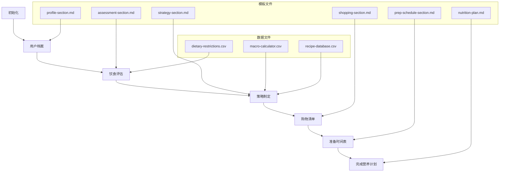

# 创建工作流

<cite>
**本文档中引用的文件**  
- [workflow.md](file://src/modules/bmb/workflows/create-workflow/workflow.md)
- [workflow-plan.md](file://src/modules/bmb/workflows/create-workflow/templates/workflow-plan.md)
- [workflow-template.md](file://src/modules/bmb/docs/workflows/workflow-template.md)
- [step-01-init.md](file://src/modules/bmb/workflows/create-workflow/steps/step-01-init.md)
- [step-02-gather.md](file://src/modules/bmb/workflows/create-workflow/steps/step-02-gather.md)
- [meal-prep-nutrition/workflow.md](file://src/modules/bmb/reference/workflows/meal-prep-nutrition/workflow.md)
- [meal-prep-nutrition/steps/step-01-init.md](file://src/modules/bmb/reference/workflows/meal-prep-nutrition/steps/step-01-init.md)
- [meal-prep-nutrition/templates/nutrition-plan.md](file://src/modules/bmb/reference/workflows/meal-prep-nutrition/templates/nutrition-plan.md)
- [meal-prep-nutrition/templates/profile-section.md](file://src/modules/bmb/reference/workflows/meal-prep-nutrition/templates/profile-section.md)
- [requirements-section.md](file://src/modules/bmb/workflows/create-workflow/templates/requirements-section.md)
- [design-section.md](file://src/modules/bmb/workflows/create-workflow/templates/design-section.md)
- [step-file.md](file://src/modules/bmb/workflows/create-workflow/templates/step-file.md)
- [workflow.md](file://src/modules/bmb/workflows/create-workflow/templates/workflow.md)
</cite>

## 目录
1. [引言](#引言)
2. [工作流架构概述](#工作流架构概述)
3. [从需求收集到最终评审的全过程](#从需求收集到最终评审的全过程)
4. [核心工具选择与内存需求评估](#核心工具选择与内存需求评估)
5. [外部工具集成与安装指导](#外部工具集成与安装指导)
6. [模板文件的使用方法](#模板文件的使用方法)
7. [BMB模块中meal-prep-nutrition工作流案例分析](#bmb模块中meal-prep-nutrition工作流案例分析)
8. [确保工作流与BMAD框架兼容的最佳实践](#确保工作流与bmad框架兼容的最佳实践)

## 引言

创建工作流是BMAD方法论中的核心实践之一，旨在通过结构化、可重复的步骤来实现特定目标。本文件详细解释了从需求收集到最终评审的全过程，涵盖了核心工具选择、内存需求评估、外部工具集成和安装指导等内容。特别关注如何使用`templates/`目录中的模板文件构建结构化工作流，特别是`workflow-plan.md`的使用方法。通过BMB模块中`meal-prep-nutrition`工作流的实际案例，展示多步骤、模板化工作流的设计模式，并提供关于如何确保工作流与BMAD框架兼容的最佳实践。

**Section sources**
- [workflow.md](file://src/modules/bmb/workflows/create-workflow/workflow.md)

## 工作流架构概述

BMAD工作流采用**分步文件架构**（step-file architecture）进行严格的执行控制。这种架构确保每个步骤都是独立的指令文件，必须严格按照顺序执行，不能跳过或优化。

### 核心原则

- **微文件设计**：每个步骤都是一个自包含的指令文件，作为整体工作流的一部分必须精确遵循
- **即时加载**：仅当前步骤文件在内存中——永远不要在被告知之前加载未来的步骤文件
- **顺序强制执行**：步骤文件内的序列必须按顺序完成，不允许跳过或优化
- **状态跟踪**：当工作流生成文档时，在输出文件的前言中使用`stepsCompleted`数组记录进度
- **仅追加构建**：根据指示将内容追加到输出文件中进行构建

### 步骤处理规则

1. **完整阅读**：在采取任何行动之前，始终完整阅读整个步骤文件
2. **遵循顺序**：按顺序执行所有编号部分，绝不偏离
3. **等待输入**：如果出现菜单，则暂停并等待用户选择
4. **检查继续**：如果步骤有包含“继续”选项的菜单，只有当用户选择“C”（继续）时才进入下一步
5. **保存状态**：在加载下一步之前更新输出文件前言中的`stepsCompleted`
6. **加载下一步**：在指示时，加载、完整阅读然后执行下一个步骤文件

### 关键规则（无例外）

- 🛑 **绝不**同时加载多个步骤文件
- 📖 **始终**在执行前完整阅读步骤文件
- 🚫 **绝不**跳过步骤或优化序列
- 💾 **始终**在为特定步骤写入最终输出时更新输出文件的前言
- 🎯 **始终**遵循步骤文件中的确切指令
- ⏸️ **始终**在菜单处暂停并等待用户输入
- 📋 **绝不**从未来步骤创建心理待办事项列表

**Section sources**
- [workflow.md](file://src/modules/bmb/workflows/create-workflow/workflow.md#L15-L45)

## 从需求收集到最终评审的全过程

创建工作流的过程分为几个关键阶段：初始化、需求收集、设计、实现、审查和验证。每个阶段都有明确的目标和交付物。

### 初始化阶段

初始化阶段的目标是检测延续状态并设置项目上下文。这包括检查是否存在现有的工作流文件夹，如果是，则处理延续逻辑；如果不存在，则开始新的工作流创建会话。

#### 初始化序列

1. **配置加载**：从`{project-root}/{bmad_folder}/[module]/config.yaml`加载并读取完整配置，解析如`project_name`、`output_folder`、`user_name`等变量
2. **第一步执行**：加载、完整阅读然后执行`{workflow_path}/steps/step-01-init.md`以开始工作流

### 需求收集阶段

需求收集阶段通过协作对话收集全面的需求，这些需求将指导结构化工作流的设计，使其符合用户的需求和用例。

#### 需求收集过程

1. **工作流目的和范围**：探索工作流要解决的具体问题、主要用户和主要成果
2. **工作流类型分类**：确定工作流类型（文档、操作、交互、自主、元工作流）
3. **工作流流程和步骤结构**：确定是否为线性、循环、分支或迭代结构
4. **用户交互风格**：了解所需的交互级别，是高度协作还是大部分自主
5. **指令风格**（基于意图 vs 规定性）：决定AI应如何在此工作流中执行
6. **输入要求**：识别工作流启动所需的数据或文档
7. **输出规范**：定义工作流产生的内容
8. **目标位置和模块配置**：确定工作流将创建的位置
9. **技术约束**：讨论特定工具、依赖关系或集成需求
10. **成功标准**：定义工作流成功的衡量标准

### 设计阶段

设计阶段基于收集到的需求创建工作流结构。这包括定义步骤结构、交互设计、数据流架构、文件组织、AI角色定义、质量保证和特殊功能。

### 实现阶段

实现阶段将设计转化为实际的工作流文件。这包括创建步骤文件、模板文件和必要的支持文件。

### 审查和验证阶段

审查和验证阶段确保工作流按预期工作，并满足所有需求和质量标准。这包括测试工作流、修复任何问题并获得最终批准。

**Section sources**
- [step-01-init.md](file://src/modules/bmb/workflows/create-workflow/steps/step-01-init.md)
- [step-02-gather.md](file://src/modules/bmb/workflows/create-workflow/steps/step-02-gather.md)

## 核心工具选择与内存需求评估

在创建工作流时，选择合适的核心工具对于确保效率和性能至关重要。BMAD框架提供了多种工具来支持不同的工作流需求。

### 核心工具选择

- **CLI工具**：用于命令行操作，如安装、构建、清理等
- **任务处理器**：用于执行复杂的任务，如高级启发式方法、索引文档等
- **工作流引擎**：用于管理和执行多步骤工作流
- **模板引擎**：用于生成和填充模板文件

### 内存需求评估

由于BMAD工作流采用即时加载策略，内存需求主要取决于当前步骤文件的大小和复杂性。建议遵循以下最佳实践：

- **保持步骤文件小而专注**：每个步骤文件应只包含必要的信息和指令
- **避免加载不必要的数据**：只在需要时加载输入文件和依赖项
- **定期清理内存**：在步骤完成后释放不再需要的数据

**Section sources**
- [workflow.md](file://src/modules/bmb/workflows/create-workflow/workflow.md#L20-L23)
- [step-01-init.md](file://src/modules/bmb/workflows/create-workflow/steps/step-01-init.md#L64-L67)

## 外部工具集成与安装指导

BMAD框架支持与多种外部工具的集成，以增强工作流的功能和灵活性。

### 外部工具集成

- **IDE集成**：支持多种IDE，如Auggie、Claude Code、Cursor等，通过特定的安装脚本和配置文件实现
- **捆绑器**：支持Web捆绑器和其他构建工具，用于打包和分发工作流
- **测试框架**：集成自动化测试工具，确保工作流的质量和可靠性

### 安装指导

1. **安装CLI工具**：使用npm或其他包管理器安装BMAD CLI工具
2. **配置环境**：设置项目根目录、BMAD文件夹名称和其他环境变量
3. **安装模块**：使用CLI命令安装所需的模块和工作流
4. **验证安装**：运行测试命令确保所有组件正确安装

**Section sources**
- [tools/cli/installers/lib/ide](file://tools/cli/installers/lib/ide)
- [tools/cli/commands](file://tools/cli/commands)

## 模板文件的使用方法

`templates/`目录中的模板文件是创建结构化工作流的关键。这些模板提供了标准化的结构和内容，确保所有工作流的一致性和质量。

### workflow-plan.md的使用方法

`workflow-plan.md`模板用于创建工作流创建计划，捕获所有需求和设计细节，然后才构建实际的工作流。

#### 模板结构

```markdown
# 工作流创建计划：{{workflowName}}

**创建时间：** {{date}}
**作者：** {{user_name}}
**模块：** {{targetModule}}
**类型：** {{workflowType}}

## 执行摘要

{{executiveSummary}}

## 需求分析

[需求将从步骤2追加到这里]

## 详细设计

[设计细节将从步骤3追加到这里]

## 实施计划

[实施计划将从步骤4追加到这里]

## 审查和验证

[审查结果将从步骤5追加到这里]

---

## 最终配置

### 要生成的输出文件

{{#outputFiles}}

- {{type}}: {{path}}
  {{/outputFiles}}

### 目标位置

- **文件夹**： {{targetWorkflowPath}}
- **模块**： {{targetModule}}
- **自定义位置**： {{customWorkflowLocation}}

### 最终检查清单

- [ ] 所有需求已记录
- [ ] 工作流已设计并批准
- [ ] 文件已成功生成
- [ ] 工作流已测试并验证

## 准备实施

当您批准此计划后，我将在指定位置生成所有工作流文件，其结构和内容如上所述。
```

#### 使用步骤

1. **复制模板**：将`workflow-plan.md`模板复制到新工作流的目录中
2. **替换占位符**：用实际值替换所有占位符，如`{{workflowName}}`、`{{date}}`等
3. **填充内容**：根据需求收集和设计阶段的结果填充各个部分
4. **生成文件**：使用填充后的计划生成实际的工作流文件

**Section sources**
- [workflow-plan.md](file://src/modules/bmb/workflows/create-workflow/templates/workflow-plan.md)
- [requirements-section.md](file://src/modules/bmb/workflows/create-workflow/templates/requirements-section.md)
- [design-section.md](file://src/modules/bmb/workflows/create-workflow/templates/design-section.md)

## BMB模块中meal-prep-nutrition工作流案例分析

`meal-prep-nutrition`工作流是一个多步骤、模板化工作流的优秀示例，展示了如何通过协作对话创建个性化的营养计划。

### 工作流概述

该工作流旨在通过营养专家和用户之间的协作对话，创建个性化的膳食计划。它遵循标准的BMAD工作流架构，具有清晰的步骤划分和模板化的内容生成。

### 步骤分解

1. **初始化**：检测延续状态并创建输出文档
2. **用户档案**：收集用户的个人资料、营养目标和饮食偏好
3. **饮食评估**：评估用户的当前饮食习惯和营养摄入
4. **策略制定**：制定个性化的膳食策略和营养目标
5. **购物清单**：生成购物清单（如适用）
6. **准备时间表**：创建膳食准备时间表

### 模板使用

该工作流使用多个模板文件来生成结构化的内容：

- `nutrition-plan.md`：主模板，定义了营养计划的整体结构
- `profile-section.md`：用户档案部分的模板
- `assessment-section.md`：饮食评估部分的模板
- `strategy-section.md`：策略制定部分的模板
- `shopping-section.md`：购物清单部分的模板
- `prep-schedule-section.md`：准备时间表部分的模板

### 数据流

工作流通过一系列步骤逐步构建最终的营养计划文档。每个步骤都会将相关内容追加到输出文件中，同时更新前言中的`stepsCompleted`数组以跟踪进度。

**Diagram sources**
- [meal-prep-nutrition/workflow.md](file://src/modules/bmb/reference/workflows/meal-prep-nutrition/workflow.md)
- [meal-prep-nutrition/steps/step-01-init.md](file://src/modules/bmb/reference/workflows/meal-prep-nutrition/steps/step-01-init.md)
- [meal-prep-nutrition/templates/nutrition-plan.md](file://src/modules/bmb/reference/workflows/meal-prep-nutrition/templates/nutrition-plan.md)



**Section sources**
- [meal-prep-nutrition/workflow.md](file://src/modules/bmb/reference/workflows/meal-prep-nutrition/workflow.md)
- [meal-prep-nutrition/steps/step-01-init.md](file://src/modules/bmb/reference/workflows/meal-prep-nutrition/steps/step-01-init.md)
- [meal-prep-nutrition/templates/nutrition-plan.md](file://src/modules/bmb/reference/workflows/meal-prep-nutrition/templates/nutrition-plan.md)

## 确保工作流与BMAD框架兼容的最佳实践

为了确保工作流与BMAD框架兼容并遵循最佳实践，请遵循以下指南：

### 遵循标准架构

- **不要修改核心架构部分**：保持`WORKFLOW ARCHITECTURE`部分不变，只自定义角色描述和目标
- **使用标准模板**：始终使用提供的模板文件作为起点
- **保持角色协作性**：强调伙伴关系而非客户-供应商关系

### 具体目标和角色定义

- **明确目标**：用一个清晰的句子描述结果
- **具体角色**：明确定义AI和用户的角色及专长领域

### 测试和验证

- **包含web_bundle**：为生产就绪的工作流设置为true
- **测试路径**：验证步骤文件路径存在且正确
- **全面测试**：在不同场景下测试工作流，确保其按预期工作

### 文档和维护

- **详细文档**：为每个工作流提供详细的文档，包括目的、用法和示例
- **定期维护**：定期审查和更新工作流以适应新的需求和技术变化

通过遵循这些最佳实践，可以确保创建工作流不仅功能强大，而且易于维护和扩展，从而最大化其长期价值。

**Section sources**
- [workflow-template.md](file://src/modules/bmb/docs/workflows/workflow-template.md)
- [meal-prep-nutrition/workflow.md](file://src/modules/bmb/reference/workflows/meal-prep-nutrition/workflow.md)