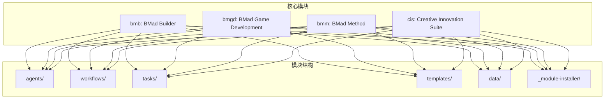
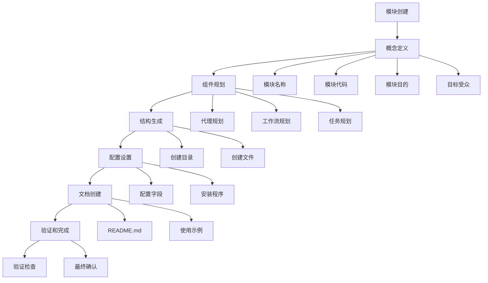
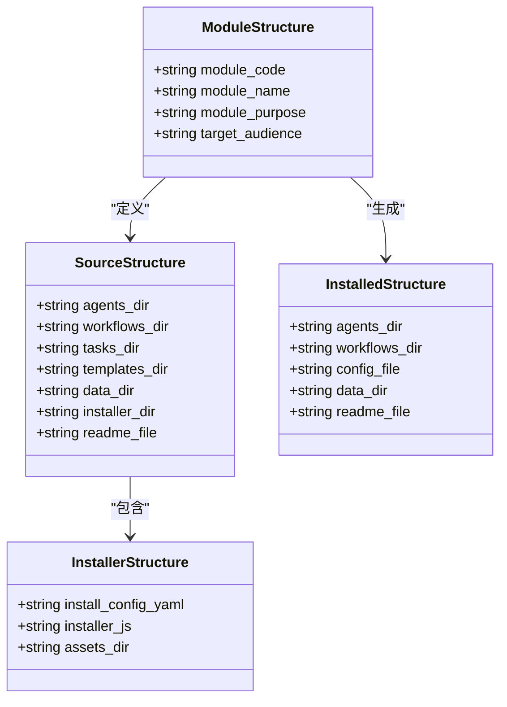
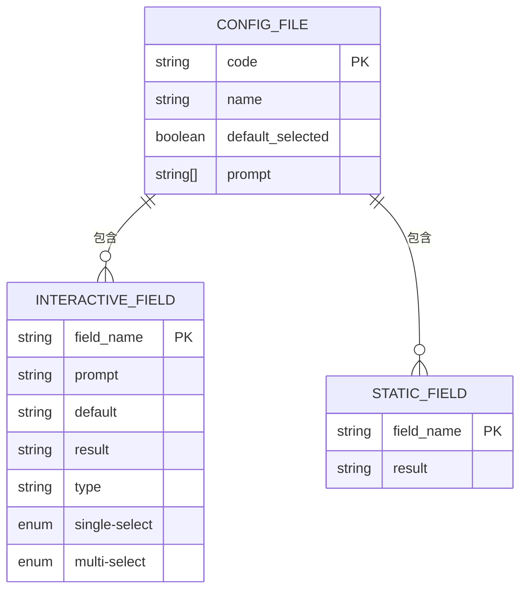
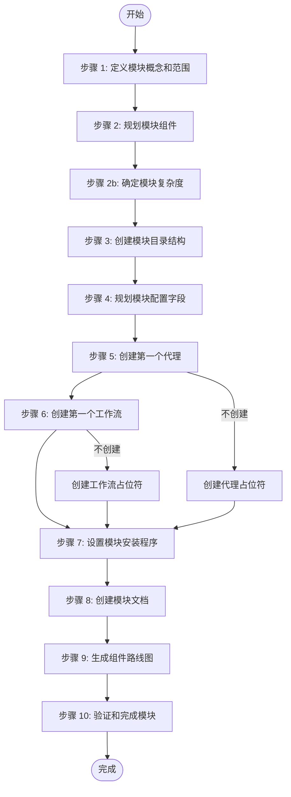

# 创建模块

<cite>
**本文档中引用的文件**  
- [module-structure.md](file://src/modules/bmb/workflows-legacy/create-module/module-structure.md)
- [instructions.md](file://src/modules/bmb/workflows-legacy/create-module/instructions.md)
- [checklist.md](file://src/modules/bmb/workflows-legacy/create-module/checklist.md)
- [install-config.yaml](file://src/modules/bmb/_module-installer/install-config.yaml)
- [installer.js](file://src/modules/bmb/_module-installer/installer.js)
- [create-module/workflow.yaml](file://src/modules/bmb/workflows-legacy/create-module/workflow.yaml)
- [install-config.yaml](file://src/core/_module-installer/install-config.yaml)
</cite>

## 目录
1. [简介](#简介)
2. [项目结构](#项目结构)
3. [核心组件](#核心组件)
4. [架构概述](#架构概述)
5. [详细组件分析](#详细组件分析)
6. [依赖分析](#依赖分析)
7. [性能考虑](#性能考虑)
8. [故障排除指南](#故障排除指南)
9. [结论](#结论)

## 简介
本文档详细说明了如何使用create-module工作流创建新的BMB模块。文档涵盖了模块初始化的完整流程，包括结构生成、安装配置和模板应用。详细解释了module-structure.md中定义的目录规范和文件组织要求，以及install-config.yaml模板如何配置模块安装行为。提供从零开始构建兼容BMB模块的分步指南，并强调与未来模块市场的兼容性设计。

## 项目结构
BMAD项目采用模块化架构，每个模块都是一个自包含的功能包。核心模块包括bmb（BMad Builder）、bmgd（BMad Game Development）、bmm（BMad Method）和cis（Creative Innovation Suite）。每个模块都有标准的目录结构，包含agents、workflows、tasks、templates、data和_module-installer等目录。



**图示来源**
- [module-structure.md](file://src/modules/bmb/workflows-legacy/create-module/module-structure.md#L1-L401)

**本节来源**
- [module-structure.md](file://src/modules/bmb/workflows-legacy/create-module/module-structure.md#L1-L401)
- [project_structure](#project_structure)

## 核心组件
创建新模块的核心组件包括模块结构定义、安装配置和初始化工作流。模块结构由module-structure.md文件定义，安装配置由install-config.yaml文件管理，初始化过程由create-module工作流驱动。这些组件共同确保模块的一致性和可安装性。

**本节来源**
- [module-structure.md](file://src/modules/bmb/workflows-legacy/create-module/module-structure.md#L1-L401)
- [instructions.md](file://src/modules/bmb/workflows-legacy/create-module/instructions.md#L1-L578)
- [checklist.md](file://src/modules/bmb/workflows-legacy/create-module/checklist.md#L1-L236)

## 架构概述
BMB模块的架构设计遵循清晰的分层模式，确保模块的可维护性和可扩展性。模块分为源代码结构和安装后结构，通过安装程序进行转换。核心架构元素包括模块标识、组件规划、配置管理和安装基础设施。



**图示来源**
- [instructions.md](file://src/modules/bmb/workflows-legacy/create-module/instructions.md#L1-L578)
- [checklist.md](file://src/modules/bmb/workflows-legacy/create-module/checklist.md#L1-L236)

## 详细组件分析
### 模块结构分析
模块结构遵循标准化的目录布局，确保所有模块的一致性。源模块结构包含开发时所需的全部文件，而安装后结构则包含运行时所需的精简版本。

#### 目录结构


**图示来源**
- [module-structure.md](file://src/modules/bmb/workflows-legacy/create-module/module-structure.md#L1-L401)

**本节来源**
- [module-structure.md](file://src/modules/bmb/workflows-legacy/create-module/module-structure.md#L1-L401)
- [instructions.md](file://src/modules/bmb/workflows-legacy/create-module/instructions.md#L1-L578)

### 安装配置分析
安装配置是模块可定制性的关键，通过install-config.yaml文件定义模块的安装时行为。该文件既包含静态配置值，也包含需要用户输入的交互式字段。

#### 配置文件结构


**图示来源**
- [install-config.yaml](file://src/modules/bmb/_module-installer/install-config.yaml#L1-L32)
- [install-config.yaml](file://src/core/_module-installer/install-config.yaml#L1-L36)

**本节来源**
- [install-config.yaml](file://src/modules/bmb/_module-installer/install-config.yaml#L1-L32)
- [install-config.yaml](file://src/core/_module-installer/install-config.yaml#L1-L36)
- [module-structure.md](file://src/modules/bmb/workflows-legacy/create-module/module-structure.md#L174-L228)

### 初始化工作流分析
创建模块的初始化工作流是一个多步骤的交互式过程，引导用户完成模块创建的各个阶段。工作流从概念定义开始，逐步推进到组件规划、结构生成、配置设置和最终验证。

#### 工作流步骤


**图示来源**
- [instructions.md](file://src/modules/bmb/workflows-legacy/create-module/instructions.md#L1-L578)

**本节来源**
- [instructions.md](file://src/modules/bmb/workflows-legacy/create-module/instructions.md#L1-L578)
- [workflow.yaml](file://src/modules/bmb/workflows-legacy/create-module/workflow.yaml#L1-L100)

## 依赖分析
BMB模块系统具有清晰的依赖关系，确保模块间的独立性和可组合性。核心依赖包括模块与核心配置的继承关系、模块间的引用机制以及安装程序的执行顺序。

```mermaid
graph TD
CoreConfig[核心配置] --> |继承| BMBModule
CoreConfig --> |继承| BMGDModule
CoreConfig --> |继承| BMMModule
CoreConfig --> |继承| CISModule
BMBModule --> |创建| NewModule
NewModule --> |引用| BMBModule
NewModule --> |引用| BMGDModule
NewModule --> |引用| BMMModule
NewModule --> |引用| CISModule
IDE[IDE安装] --> |触发| CoreInstaller
CoreInstaller --> |执行| ModuleInstaller
class CoreConfig,BMBModule,BMGDModule,BMMModule,CISModule,NewModule,CoreInstaller,ModuleInstaller,IDE,NewModule;
```

**图示来源**
- [install-config.yaml](file://src/core/_module-installer/install-config.yaml#L1-L36)
- [install-config.yaml](file://src/modules/bmb/_module-installer/install-config.yaml#L1-L32)

**本节来源**
- [install-config.yaml](file://src/core/_module-installer/install-config.yaml#L1-L36)
- [install-config.yaml](file://src/modules/bmb/_module-installer/install-config.yaml#L1-L32)
- [installer.js](file://src/core/_module-installer/installer.js#L1-L61)

## 性能考虑
在创建BMB模块时，性能考虑主要集中在模块加载时间、配置解析效率和安装过程的优化。通过遵循模块设计最佳实践，可以确保模块的高效运行。

- **模块大小**: 保持模块精简，只包含必要的组件
- **配置复杂度**: 避免过度复杂的配置选项
- **安装脚本**: 确保installer.js脚本高效执行
- **依赖管理**: 最小化外部依赖

## 故障排除指南
在创建和安装BMB模块时可能遇到的常见问题及解决方案：

**本节来源**
- [checklist.md](file://src/modules/bmb/workflows-legacy/create-module/checklist.md#L1-L236)
- [instructions.md](file://src/modules/bmb/workflows-legacy/create-module/instructions.md#L1-L578)

## 结论
创建BMB模块是一个结构化的过程，涉及模块结构定义、组件规划、配置设置和文档创建。通过遵循module-structure.md中定义的规范和使用create-module工作流，可以确保模块的一致性和可安装性。install-config.yaml模板提供了灵活的配置机制，使模块能够适应不同的使用场景。从零开始构建兼容BMB模块的分步指南为开发者提供了清晰的路径，而与未来模块市场的兼容性设计则确保了模块的长期价值。