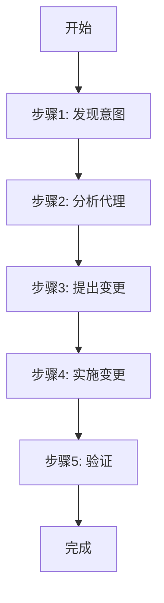

# 编辑代理

<cite>
**本文档中引用的文件**  
- [step-01-discover-intent.md](file://src/modules/bmb/workflows/edit-agent/steps/step-01-discover-intent.md)
- [step-02-analyze-agent.md](file://src/modules/bmb/workflows/edit-agent/steps/step-02-analyze-agent.md)
- [step-03-propose-changes.md](file://src/modules/bmb/workflows/edit-agent/steps/step-03-propose-changes.md)
- [step-04-apply-changes.md](file://src/modules/bmb/workflows/edit-agent/steps/step-04-apply-changes.md)
- [step-05-validate.md](file://src/modules/bmb/workflows/edit-agent/steps/step-05-validate.md)
- [workflow.md](file://src/modules/bmb/workflows/edit-agent/workflow.md)
- [agent-validation-checklist.md](file://src/modules/bmb/workflows/create-agent/data/agent-validation-checklist.md)
- [understanding-agent-types.md](file://src/modules/bmb/docs/agents/understanding-agent-types.md)
- [agent-compilation.md](file://src/modules/bmb/docs/agents/agent-compilation.md)
- [commit-poet.agent.yaml](file://src/modules/bmb/reference/agents/simple-examples/commit-poet.agent.yaml)
- [journal-keeper.agent.yaml](file://src/modules/bmb/reference/agents/expert-examples/journal-keeper/journal-keeper.agent.yaml)
</cite>

## 目录
1. [介绍](#介绍)
2. [编辑代理工作流概览](#编辑代理工作流概览)
3. [步骤1：发现意图](#步骤1发现意图)
4. [步骤2：分析代理](#步骤2分析代理)
5. [步骤3：提出变更](#步骤3提出变更)
6. [步骤4：实施变更](#步骤4实施变更)
7. [步骤5：验证](#步骤5验证)
8. [最佳实践与注意事项](#最佳实践与注意事项)
9. [结论](#结论)

## 介绍

编辑代理是BMAD方法论中的一个关键工作流，旨在安全、系统地修改现有代理，同时保持系统稳定性和遵循最佳实践。该流程通过五个核心步骤——发现意图、分析代理、提出变更、实施变更和验证——确保所有修改都是有目的、有记录且可验证的。本文档详细解释了每个步骤的执行协议、规则和最佳实践，结合实际文件示例，展示了如何通过结构化方法迭代优化代理，防止破坏性变更。

## 编辑代理工作流概览

编辑代理工作流采用**步骤文件架构**（step-file architecture），确保执行的纪律性和可追溯性。每个步骤都被封装在一个独立的Markdown文件中，必须按顺序精确执行，不允许跳过或优化。该工作流的核心原则包括：

- **微文件设计**：每个步骤文件自包含，是整体工作流的一部分。
- **即时加载**：仅在需要时加载当前步骤文件，不预加载后续步骤。
- **顺序执行**：必须严格按照顺序完成步骤，不允许跳步。
- **状态跟踪**：在上下文中记录进度，确保工作流的连续性。
- **追加式构建**：通过追加内容来构建输出文档。

该工作流强调协作性，编辑者与代理所有者是平等的合作伙伴关系。编辑者提供架构专业知识和编辑技能，而用户则提供代理及其改进目标，共同协作以提升代理质量。



**Diagram sources**
- [workflow.md](file://src/modules/bmb/workflows/edit-agent/workflow.md)

## 步骤1：发现意图

### 目标

获取要编辑的代理路径，并理解用户希望通过编辑实现的目标。

### 执行协议

此步骤的核心是作为**促进者**而非内容生成器，通过直接提问来明确用户需求。必须严格遵守以下规则：

- **禁止**在未获得用户输入的情况下生成内容。
- **禁止**加载任何文档或分析代理内容。
- **禁止**提出解决方案或建议。
- 必须等待用户明确选择“继续”（Continue）选项后，才能进入下一步。

### 操作流程

1. **获取代理路径**  
   向用户询问：“您想编辑哪个代理？请提供以下路径之一：
   - `.agent.yaml` 文件路径（简单代理）
   - 包含 `.agent.yaml` 的文件夹路径（专家代理，含侧车文件）”

2. **理解编辑目标**  
   询问用户：“您想对这个代理进行哪些更改？”  
   倾听并澄清以下可能的目标：
   - 修复功能问题
   - 更新个性/沟通风格
   - 添加或删除命令
   - 修复引用或路径
   - 重组侧车文件（专家代理）
   - 更新以符合新标准

3. **确认理解**  
   总结用户的意图：“所以您想编辑位于 {{agent_path}} 的代理，以实现 {{user_goals}}。对吗？”

4. **呈现菜单选项**  
   显示菜单：“**选择一个选项：** [A] 高级启发 [P] 派对模式 [C] 继续”  
   - **A**：执行高级启发任务，深入挖掘需求。
   - **P**：启动派对模式，进行协作讨论。
   - **C**：加载并执行下一步文件 `step-02-analyze-agent.md`。

**Section sources**
- [step-01-discover-intent.md](file://src/modules/bmb/workflows/edit-agent/steps/step-01-discover-intent.md)

## 步骤2：分析代理

### 目标

加载代理及其相关文档，根据用户在步骤1中陈述的目标进行针对性分析，识别需要修复的具体问题。

### 执行协议

此步骤的核心是**聚焦分析**，仅针对用户的目标进行，不进行无关的文档加载或解决方案的提出。必须遵守“即时加载”（JIT）原则，仅在需要时加载相关文档。

### 操作流程

1. **加载代理文件**  
   根据步骤1提供的路径加载代理文件：
   - **简单代理**：加载 `.agent.yaml` 文件，所有内容都在一个文件中。
   - **专家代理**：加载 `.agent.yaml` 文件，并清点所有侧车文件（模板、文档、知识库文件等）。

2. **基于目标加载相关文档**  
   仅根据用户目标加载必要的文档：
   - **个性/沟通问题**：加载 `agent-compilation.md` 和 `communication-presets.csv`。
   - **功能/引用问题**：加载 `menu_patterns.md` 和 `agent-compilation.md`。
   - **侧车/结构问题**：加载 `expert_architecture.md`。
   - **代理类型混淆**：加载 `understanding_agent_types.md`。

3. **针对性分析**  
   根据用户目标进行具体分析：
   - **个性问题**：检查 `communication_style` 字段是否混入了行为、身份或原则描述。例如，避免出现“确保”、“总是”、“相信”等红字词。
   - **功能问题**：验证工作流引用的有效性，检查菜单处理模式，验证YAML语法。
   - **侧车问题**：映射菜单项与侧车文件的引用，识别未使用的孤立文件，检查引用文件是否存在。

4. **报告发现**  
   向用户报告分析结果：“根据您想 {{user_goal}} 的目标，我发现以下问题：”
   - 描述具体问题。
   - 展示代理中的相关部分。
   - 引用标准文档说明为何这是问题。

5. **呈现菜单选项**  
   显示菜单：“**选择一个选项：** [A] 高级启发 [P] 派对模式 [C] 继续”，等待用户选择后进入下一步。

**Section sources**
- [step-02-analyze-agent.md](file://src/modules/bmb/workflows/edit-agent/steps/step-02-analyze-agent.md)

## 步骤3：提出变更

### 目标

基于步骤2的分析结果，提出具体的、有针对性的变更建议，并在应用前获得用户的明确批准。

### 执行协议

此步骤的核心是**提出变更**，而非应用变更。必须获得用户的明确批准后才能进行下一步。

### 操作流程

1. **逐个提出变更**  
   每次只提出一个最重要的变更，使用清晰的前后对比：
   ```
   我建议修复 {{问题}}，因为 {{原因}}。

   **当前：**
   ```yaml
   {{ current_code }}
   ```

   **建议：**
   ```yaml
   {{ proposed_code }}
   ```

   这将有助于 {{好处}}。
   ```

2. **解释理由**  
   解释变更的重要性、如何符合BMAD最佳实践，并在需要时引用已加载的文档。

3. **获取用户批准**  
   询问用户：“这个变更看起来如何？我可以应用它吗？” 必须等待用户的明确同意。

4. **重复过程**  
   对步骤2中识别的每个问题重复上述过程，逐一提出、解释并获得批准。

5. **跟踪批准的变更**  
   记录哪些变更被批准，哪些被拒绝，为下一步应用做准备。

6. **呈现菜单选项**  
   在所有变更都经过审查并获得批准后，显示菜单：“**选择一个选项：** [A] 高级启发 [P] 派对模式 [C] 继续”，进入应用阶段。

**Section sources**
- [step-03-propose-changes.md](file://src/modules/bmb/workflows/edit-agent/steps/step-03-propose-changes.md)

## 步骤4：实施变更

### 目标

使用“编辑”工具，将用户在步骤3中批准的所有变更直接应用到代理文件中。

### 执行协议

此步骤的核心是**精确应用**，只能应用已批准的变更，禁止进行任何额外修改。

### 操作流程

1. **加载代理文件**  
   读取完整的代理文件，了解当前状态。

2. **应用已批准的变更**  
   使用“编辑”工具，逐个应用步骤3中批准的变更：
   - **YAML变更**：直接修改 `.agent.yaml` 文件。
   - **侧车文件变更**：修改特定的侧车文件。

3. **确认每个变更**  
   每应用一个变更后，确认：“已应用变更：{{描述}} ✓ 已正确更新 ✓ 文件已保存”。

4. **完成所有变更**  
   重复应用和确认过程，直到所有批准的变更都已应用。

5. **验证变更完成**  
   总结：“已成功应用 {{数量}} 个变更，所有修改均与步骤3中的用户批准一致，代理文件已更新并保存。”

6. **呈现菜单选项**  
   显示菜单：“**选择一个选项：** [A] 高级启发 [P] 派对模式 [C] 继续”，进入验证阶段。

**Section sources**
- [step-04-apply-changes.md](file://src/modules/bmb/workflows/edit-agent/steps/step-04-apply-changes.md)

## 步骤5：验证

### 目标

验证已应用的变更是否正确工作，并确保修改后的代理符合BMAD最佳实践和标准。

### 执行协议

此步骤的核心是**验证**，禁止在验证过程中进行任何额外修改。

### 操作流程

1. **加载验证标准**  
   加载并阅读 `agent-validation-checklist.md`。

2. **加载更新后的代理文件**  
   读取应用变更后的代理文件。

3. **检查每个已应用的变更**  
   逐一验证每个变更是否正确应用且功能正常。

4. **运行标准验证清单**  
   检查关键项目：
   - YAML语法有效且格式正确。
   - 个性字段正确分离（如适用）。
   - 所有引用和路径解析正确（如适用）。
   - 菜单结构符合BMAD模式（如适用）。
   - 代理编译要求已满足（如适用）。

5. **报告验证结果**  
   “验证结果：
   ✓ 所有 {{数量}} 个变更均已正确应用
   ✓ 代理符合BMAD标准和最佳实践
   ✓ 修改部分无问题
   ✓ 可以使用”

6. **呈现最终菜单**  
   显示菜单：“**选择一个选项：** [A] 编辑另一个代理 [P] 派对模式 [C] 完成”，结束工作流。

**Section sources**
- [step-05-validate.md](file://src/modules/bmb/workflows/edit-agent/steps/step-05-validate.md)

## 最佳实践与注意事项

### 代理类型理解

BMAD中的代理类型（简单、专家、模块）定义的是**架构和集成方式**，而非能力限制。所有类型都具有相同的I/O和执行能力。

- **简单代理**：自包含，所有内容在YAML文件中，无持久记忆。
- **专家代理**：使用侧车文件，可拥有持久记忆（`memories.md`）和知识库，适合个人助理。
- **模块代理**：专为特定模块生态系统（如BMM）设计，集成团队工作流。

选择类型应基于状态和集成需求，而非功能。

### 代理编译

代理的YAML源文件在编译时会自动注入大量内容，**切勿在YAML中重复这些内容**：
- **前言**（Frontmatter）：由编译器自动生成。
- **激活块**（Activation Block）：由`critical_actions`生成。
- **菜单增强**：自动添加`*help`和`*exit`，并为触发器添加`*`前缀。
- **菜单处理器和规则**：根据使用情况自动注入。

您的工作是定义个性、提示和菜单动作，编译器负责处理样板代码。

### 代码级分析示例

以 `commit-poet.agent.yaml` 为例，其 `communication_style` 被定义为“Poetic drama and flair with every turn of a phrase...”，这是一个纯粹的沟通风格描述，不包含行为或原则，符合最佳实践。

而 `journal-keeper.agent.yaml` 作为专家代理，其 `critical_actions` 明确加载了侧车文件 `memories.md` 和 `instructions.md`，并限制了操作范围，体现了专家代理的持久性和领域限制特性。

**Section sources**
- [understanding-agent-types.md](file://src/modules/bmb/docs/agents/understanding-agent-types.md)
- [agent-compilation.md](file://src/modules/bmb/docs/agents/agent-compilation.md)
- [commit-poet.agent.yaml](file://src/modules/bmb/reference/agents/simple-examples/commit-poet.agent.yaml)
- [journal-keeper.agent.yaml](file://src/modules/bmb/reference/agents/expert-examples/journal-keeper/journal-keeper.agent.yaml)

## 结论

编辑代理工作流通过其严格的五步法，为代理的迭代优化提供了一个安全、可靠且可追溯的框架。通过从发现意图开始，经过深入分析、谨慎提出、精确实施到最终验证，该流程确保了任何变更都是深思熟虑且无副作用的。这种结构化方法不仅防止了破坏性变更，还通过强制执行最佳实践和标准，持续提升了整个系统的质量和稳定性。遵循此工作流，可以自信地对代理进行现代化改造和功能增强，同时保持系统的整体健康。