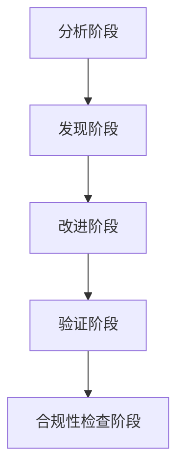

# 编辑工作流

<cite>
**本文档中引用的文件**  
- [workflow.md](file://src/modules/bmb/workflows/edit-workflow/workflow.md)
- [step-01-analyze.md](file://src/modules/bmb/workflows/edit-workflow/steps/step-01-analyze.md)
- [step-02-discover.md](file://src/modules/bmb/workflows/edit-workflow/steps/step-02-discover.md)
- [step-03-improve.md](file://src/modules/bmb/workflows/edit-workflow/steps/step-03-improve.md)
- [step-04-validate.md](file://src/modules/bmb/workflows/edit-workflow/steps/step-04-validate.md)
- [step-05-compliance-check.md](file://src/modules/bmb/workflows/edit-workflow/steps/step-05-compliance-check.md)
- [workflow-analysis.md](file://src/modules/bmb/workflows/edit-workflow/templates/workflow-analysis.md)
- [improvement-goals.md](file://src/modules/bmb/workflows/edit-workflow/templates/improvement-goals.md)
- [improvement-log.md](file://src/modules/bmb/workflows/edit-workflow/templates/improvement-log.md)
- [validation-results.md](file://src/modules/bmb/workflows/edit-workflow/templates/validation-results.md)
- [completion-summary.md](file://src/modules/bmb/workflows/edit-workflow/templates/completion-summary.md)
- [workflow-compliance-check.md](file://src/modules/bmb/workflows/workflow-compliance-check/workflow.md)
</cite>

## 目录
1. [简介](#简介)
2. [五步编辑机制](#五步编辑机制)
3. [分析阶段详解](#分析阶段详解)
4. [发现阶段详解](#发现阶段详解)
5. [改进阶段详解](#改进阶段详解)
6. [验证阶段详解](#验证阶段详解)
7. [合规性检查阶段详解](#合规性检查阶段详解)
8. [分析报告与改进日志](#分析报告与改进日志)
9. [实际应用案例](#实际应用案例)
10. [结论](#结论)

## 简介
编辑工作流是一种智能工作流编辑系统，旨在帮助用户修改现有工作流，同时遵循最佳实践。该系统采用五步机制（分析、发现、改进、验证、合规性检查）来确保工作流的修改既有效又符合架构规范。通过与工作流所有者协作，该系统将工作流设计模式、最佳实践和协作引导相结合，实现高质量的工作流优化。

**文档来源**
- [workflow.md](file://src/modules/bmb/workflows/edit-workflow/workflow.md#L1-L59)

## 五步编辑机制
编辑工作流的核心是五步机制，每一步都有明确的目标和执行规则。这五个步骤分别是：分析、发现、改进、验证和合规性检查。每个步骤都通过独立的文件进行管理，确保执行的精确性和可追溯性。

**图表来源**
- [workflow.md](file://src/modules/bmb/workflows/edit-workflow/workflow.md#L1-L59)

**章节来源**
- [workflow.md](file://src/modules/bmb/workflows/edit-workflow/workflow.md#L1-L59)

## 分析阶段详解
分析阶段的目标是深入理解目标工作流的结构、目的和潜在改进领域。在此阶段，系统作为引导者，而不是内容生成器，专注于发现和分析，而不是编辑。

### 执行流程
1. **获取工作流信息**：询问用户目标工作流的路径和改进目标。
2. **加载工作流文件**：加载目标工作流的所有相关文件，包括`workflow.md`、`steps/`目录、`templates/`目录等。
3. **确定工作流格式**：检测工作流是新独立格式、旧XML格式还是混合格式。
4. **聚焦分析**：根据用户的改进目标，进行针对性的分析，包括结构分析、内容分析和合规性分析。
5. **呈现分析结果**：以对话方式向用户分享分析结果，包括工作流的目的、结构、格式类型和初步发现。
6. **确认理解**：通过提问确认用户对分析结果的理解，并允许用户调整分析重点。

**章节来源**
- [step-01-analyze.md](file://src/modules/bmb/workflows/edit-workflow/steps/step-01-analyze.md#L1-L222)

## 发现阶段详解
发现阶段的目标是与用户协作，发现他们希望改进的内容及其原因。此阶段的重点是理解改进目标，而不是提出具体解决方案。

### 执行流程
1. **理解动机**：通过开放式问题了解用户编辑工作流的动机，如用户反馈、遇到的问题、新需求等。
2. **探索用户体验**：询问用户在运行工作流时的反馈，包括混淆的步骤、卡住的点、重复的部分等。
3. **评估当前性能**：讨论工作流是否达到了预期结果，用户的成功率、失败率和质量问题是关注重点。
4. **识别增长机会**：探讨用户希望添加的新功能、与其他工作流的集成、扩展用例等。
5. **评估指令风格**：讨论当前的指令风格是否适合用户，是否需要更具体或更灵活的指导。
6. **深入探讨重点区域**：根据分析阶段确定的重点区域，进行更深入的探讨。
7. **组织改进机会**：将改进机会分为关键问题、重要改进和锦上添花的增强。
8. **协作优先级排序**：与用户协作，根据影响、实施难度、依赖关系和时间限制等因素，对改进机会进行优先级排序。

**章节来源**
- [step-02-discover.md](file://src/modules/bmb/workflows/edit-workflow/steps/step-02-discover.md#L1-L254)

## 改进阶段详解
改进阶段的目标是协作性地改进工作流，迭代地处理每个已识别的问题。在此阶段，系统作为引导者，指导改进过程，但用户做出决策并批准更改。

### 执行流程
1. **加载参考材料**：根据具体改进需求，加载相关文档，如`step-template.md`、`workflow-template.md`等。
2. **迭代处理每个改进**：
   - **解释当前状态**：展示相关部分的当前内容，并解释其可能导致的问题。
   - **提出改进方案**：基于最佳实践，提出具体的改进方案，并说明其好处。
   - **协作确定方法**：询问用户对建议的看法，是否需要修改，是否有顾虑。
   - **获得明确批准**：在应用更改前，获得用户的明确批准。
   - **应用并展示结果**：应用更改并展示更新后的内容，确认用户是否满意。
3. **常见改进模式**：
   - **步骤流改进**：合并冗余步骤、拆分复杂步骤、重新排序以改善流程、添加缺失的过渡。
   - **指令风格优化**：将指令性内容转换为基于意图的内容，为模糊指令添加结构，平衡指导与自主性。
   - **变量一致性修复**：确保变量命名一致（snake_case），验证变量在`workflow.md`中定义，更新所有出现的地方。
   - **菜单系统更新**：标准化菜单模式，确保正确实现A/P/C选项，修复菜单处理逻辑，添加高级启发式处理。
   - **前端合规性**：在`workflow.md`中添加必需字段，确保路径变量语法正确，根据需要包含`web_bundle`配置，移除未使用的字段。
   - **模板更新**：使模板变量与步骤输出对齐，改进变量命名，添加缺失的模板部分，测试变量替换。
4. **跟踪所有更改**：记录每个改进的更改内容、更改原因、修改的文件和用户批准。

**章节来源**
- [step-03-improve.md](file://src/modules/bmb/workflows/edit-workflow/steps/step-03-improve.md#L1-L218)

## 验证阶段详解
验证阶段的目标是验证所有改进并准备完成摘要。此阶段的重点是验证和完成，而不是进行额外的编辑。

### 执行流程
1. **全面验证检查**：
   - **文件结构验证**：检查所有必需文件是否存在，目录结构是否正确，文件名是否符合约定，路径引用是否解析正确。
   - **配置验证**：检查`workflow.md`前端内容是否完整，所有变量是否格式正确，路径变量是否使用正确语法，是否存在硬编码路径。
   - **步骤文件合规性**：检查每个步骤是否遵循模板结构，是否包含必需规则，菜单处理是否正确实现，步骤编号是否连续，步骤文件大小是否合理（5-10KB）。
   - **跨文件一致性**：检查变量名称是否在文件间匹配，是否存在孤立引用，依赖关系是否正确定义，模板变量是否与输出匹配。
   - **最佳实践遵守**：检查是否实现了协作对话，是否包含错误处理，是否遵循命名约定，指令是否清晰具体。
2. **呈现验证结果**：加载`validationTemplate`并记录发现的问题，如果发现问题，清晰解释并提出修复建议；如果全部通过，热情确认成功。
3. **创建完成摘要**：加载`completionTemplate`并准备：
   - 转型故事
   - 关键改进
   - 对用户的影响
   - 测试的下一步
4. **指导下一步**：根据所做的更改，建议测试编辑后的工作流、使用示例数据运行、获取用户反馈或进行额外的优化。
5. **记录最终状态**：在`{outputFile}`中更新验证结果、完成摘要、变更日志摘要和建议。

**章节来源**
- [step-04-validate.md](file://src/modules/bmb/workflows/edit-workflow/steps/step-04-validate.md#L1-L194)

## 合规性检查阶段详解
合规性检查阶段的目标是运行全面的合规性验证，确保编辑后的工作流符合所有BMAD标准。此阶段通过`workflow-compliance-check`工作流执行，确保工作流的质量和合规性。

### 执行流程
1. **初始化合规性验证**：向用户介绍最终的质量检查，说明验证将检查模板合规性、文件大小优化、CSV数据文件标准、意图与指令性谱系对齐、Web搜索和子流程优化以及整体工作流流程和目标对齐。
2. **启动合规性检查工作流**：执行`workflow-compliance-check`工作流，对编辑后的工作流进行全面的8阶段合规性分析。
3. **监控验证进度**：提供验证进度的更新，包括工作流.md验证、逐步合规性检查、文件大小和格式分析、意图谱系评估、Web搜索优化分析和生成全面的合规性报告。
4. **合规性报告分析**：
   - **审查验证结果**：提供整体评估、关键问题、主要问题、次要问题和合规性分数。
   - **呈现关键发现**：总结模板遵守情况、文件优化、意图谱系、性能优化和整体流程的验证结果。
5. **问题解决选项**：
   - **审查合规性问题**：列出关键、主要和次要问题。
   - **提供解决选项**：自动修复、手动指导、返回编辑、接受现状或详细审查。
6. **最终验证确认**：根据用户选择处理问题，确认最终的合规性状态，确保所有关键问题已解决，主要问题已处理或接受，合规性文档完整，用户了解任何剩余的次要问题。
7. **完成文档**：记录最终的合规性状态，提供下一步的指导，包括测试工作流、监控性能、收集反馈和定期合规性检查。

**章节来源**
- [step-05-compliance-check.md](file://src/modules/bmb/workflows/edit-workflow/steps/step-05-compliance-check.md#L1-L246)

## 分析报告与改进日志
编辑工作流使用模板文件生成分析报告和改进日志，确保所有更改都有记录和可追溯。

### 分析报告
分析报告模板`workflow-analysis.md`包含以下部分：
- **目标工作流**：路径、名称、模块、格式。
- **结构分析**：类型、总步骤数、步骤流模式、文件结构。
- **内容特征**：目的、指令风格、用户交互、复杂性。
- **初步评估**：优势、潜在问题、格式特定说明。
- **最佳实践合规性**：步骤文件结构、前端内容使用、菜单实现、变量一致性。

**章节来源**
- [workflow-analysis.md](file://src/modules/bmb/workflows/edit-workflow/templates/workflow-analysis.md#L1-L57)

### 改进日志
改进日志模板`improvement-log.md`记录每次改进的详细信息，包括：
- **变更摘要**：日期、改进区域、用户目标。
- **所做更改**：问题描述、解决方案、更改理由、修改的文件、更改前后的内容、用户批准、预期影响。

**章节来源**
- [improvement-log.md](file://src/modules/bmb/workflows/edit-workflow/templates/improvement-log.md#L1-L41)

## 实际应用案例
通过编辑工作流的五步机制，可以显著提升工作流的效率和可靠性。例如，一个用户反馈工作流在某些步骤中过于复杂且指令不清晰。通过分析阶段，系统识别出这些步骤并确定其为改进重点。在发现阶段，用户确认了这些问题是主要痛点，并希望简化流程。在改进阶段，系统建议合并冗余步骤、拆分复杂步骤，并将指令性内容转换为基于意图的内容。经过用户批准后，这些更改被应用。在验证阶段，系统确认所有更改都符合最佳实践，并生成了完成摘要。最后，在合规性检查阶段，系统运行全面的合规性验证，确保工作流符合所有BMAD标准。最终，工作流的用户体验得到显著改善，成功率提高，用户反馈更加积极。

**章节来源**
- [workflow.md](file://src/modules/bmb/workflows/edit-workflow/workflow.md#L1-L59)
- [step-01-analyze.md](file://src/modules/bmb/workflows/edit-workflow/steps/step-01-analyze.md#L1-L222)
- [step-02-discover.md](file://src/modules/bmb/workflows/edit-workflow/steps/step-02-discover.md#L1-L254)
- [step-03-improve.md](file://src/modules/bmb/workflows/edit-workflow/steps/step-03-improve.md#L1-L218)
- [step-04-validate.md](file://src/modules/bmb/workflows/edit-workflow/steps/step-04-validate.md#L1-L194)
- [step-05-compliance-check.md](file://src/modules/bmb/workflows/edit-workflow/steps/step-05-compliance-check.md#L1-L246)

## 结论
编辑工作流的五步机制提供了一种系统化的方法来修改和改进现有工作流。通过分析、发现、改进、验证和合规性检查，确保了工作流的修改既有效又符合架构规范。结合`workflow-analysis.md`模板文件，可以生成详细的分析报告和改进日志，确保所有更改都有记录和可追溯。实际应用案例表明，该流程可以显著提升工作流的效率和可靠性，同时确保向后兼容性。