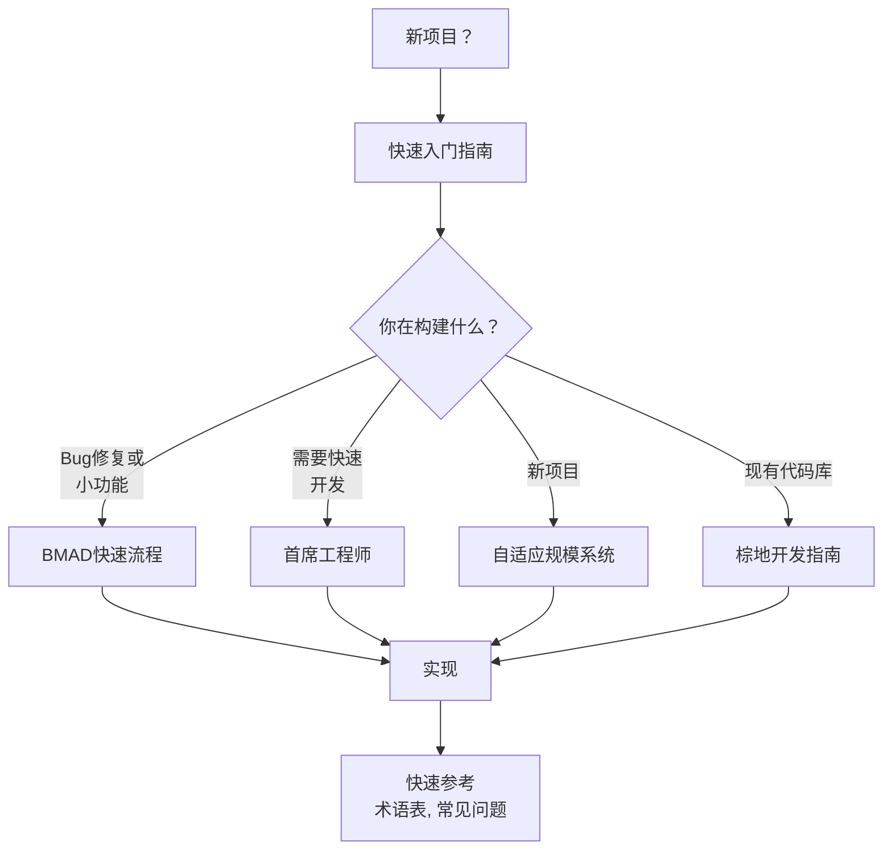
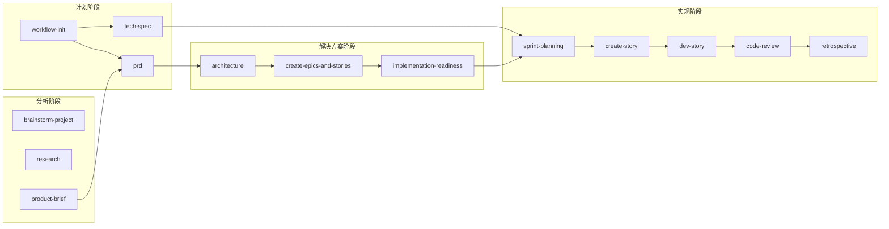

# BMad 方法 (BMM)

<cite>
**本文档中引用的文件**  
- [README.md](file://src/modules/bmm/README.md)
- [docs/README.md](file://src/modules/bmm/docs/README.md)
- [workflows-analysis.md](file://src/modules/bmm/docs/workflows-analysis.md)
- [workflows-planning.md](file://src/modules/bmm/docs/workflows-planning.md)
- [workflows-solutioning.md](file://src/modules/bmm/docs/workflows-solutioning.md)
- [workflows-implementation.md](file://src/modules/bmm/docs/workflows-implementation.md)
- [analyst.agent.yaml](file://src/modules/bmm/agents/analyst.agent.yaml)
- [pm.agent.yaml](file://src/modules/bmm/agents/pm.agent.yaml)
- [architect.agent.yaml](file://src/modules/bmm/agents/architect.agent.yaml)
- [dev.agent.yaml](file://src/modules/bmm/agents/dev.agent.yaml)
- [sm.agent.yaml](file://src/modules/bmm/agents/sm.agent.yaml)
- [product-brief/workflow.md](file://src/modules/bmm/workflows/1-analysis/product-brief/workflow.md)
- [prd/workflow.md](file://src/modules/bmm/workflows/2-plan-workflows/prd/workflow.md)
- [architecture/workflow.md](file://src/modules/bmm/workflows/3-solutioning/architecture/workflow.md)
- [create-epics-and-stories/workflow.yaml](file://src/modules/bmm/workflows/3-solutioning/create-epics-and-stories/workflow.yaml)
- [sprint-planning/workflow.yaml](file://src/modules/bmm/workflows/4-implementation/sprint-planning/workflow.yaml)
- [dev-story/workflow.md](file://src/modules/bmm/workflows/4-implementation/dev-story/workflow.md)
- [code-review/workflow.md](file://src/modules/bmm/workflows/4-implementation/code-review/workflow.md)
- [team-fullstack.yaml](file://src/modules/bmm/teams/team-fullstack.yaml)
- [install-config.yaml](file://src/modules/bmm/_module-installer/install-config.yaml)
</cite>

## 目录
1. [引言](#引言)
2. [BMM 模块概述](#bmm-模块概述)
3. [BMM 的四个主要阶段](#bmm-的四个主要阶段)
4. [分析阶段](#分析阶段)
5. [计划阶段](#计划阶段)
6. [解决方案阶段](#解决方案阶段)
7. [实现阶段](#实现阶段)
8. [工作流与依赖关系](#工作流与依赖关系)
9. [与其他模块的集成](#与其他模块的集成)
10. [结论](#结论)

## 引言

BMad 方法 (BMM) 是一个为敏捷开发设计的AI驱动工作流引擎，旨在通过结构化、可扩展的流程引导开发团队从产品简报到代码审查的完整开发周期。BMM 的核心是其四阶段方法论：分析、计划、解决方案和实现，每个阶段都由专门的AI代理和预定义的工作流驱动。该方法论适应不同项目规模和复杂度，确保开发过程的连贯性和高质量输出。本文档将全面解释BMM的角色、目的及其四个主要阶段，并阐述其如何与其他模块（如BMB和CIS）集成以提供完整的开发体验。

## BMM 模块概述

BMM（BMad Method Module）是BMAD-METHOD项目的核心模块，作为AI驱动的敏捷开发的协调系统，提供完整的生命周期管理。它通过12个专业AI代理和34个工作流，覆盖从项目启动到交付的各个阶段。

**模块结构**：
```
bmm/
├── agents/          # 12个专业AI代理（项目经理、分析师、架构师等）
├── workflows/       # 34个工作流，分为4个阶段 + 测试
├── teams/           # 预配置的代理团队
├── tasks/           # 原子工作单元
├── testarch/        # 综合测试基础设施
└── docs/            # 完整的用户文档
```

BMM的核心概念包括**自适应规模设计**，它根据项目复杂度（0-4级）自动调整工作流程，以及**以故事为中心的实现**，确保开发过程的纪律性和质量。BMM还支持**多代理协作**，通过“派对模式”（Party Mode）协调多个代理进行战略决策和复杂问题解决。

**Section sources**
- [README.md](file://src/modules/bmm/README.md#L1-L129)

## BMM 的四个主要阶段

BMM将开发过程划分为四个逻辑阶段，形成一个清晰的、逐步推进的工作流。这四个阶段是：**分析**（Analysis）、**计划**（Planning）、**解决方案**（Solutioning）和**实现**（Implementation）。每个阶段都有明确的目标、关键活动和预期输出，共同引导开发过程从模糊的产品构想走向具体的代码实现。

该方法论的设计原则是**渐进式细化**。在早期阶段，重点是探索“做什么”和“为什么”，而在后期阶段，则专注于“如何做”和具体的实施。这种结构化的方法确保了在投入大量开发资源之前，需求和设计已经过充分的验证和细化。

**Diagram sources**
- [docs/README.md](file://src/modules/bmm/docs/README.md#L212-L238)



## 分析阶段

分析阶段（Phase 1）是可选的探索和发现阶段，旨在在进入详细规划之前验证想法、理解市场并生成战略背景。其核心原则是：如果需求已经明确，则应跳过此阶段。

**目标**：进行战略性的思考，验证假设，为后续的规划阶段提供坚实的基础。

**关键活动**：
- **头脑风暴项目**（`brainstorm-project`）：探索多种解决方案和架构方法。
- **研究**（`research`）：进行市场、技术、竞争、用户和领域研究。
- **产品简报**（`product-brief`）：定义产品愿景和战略。

**预期输出**：
- `product-brief.md`：包含执行摘要、问题陈述、目标用户和MVP范围的产品简报。
- `market-research.md`、`technical-research.md`等：各种研究的报告。
- `brainstorm-output.md`：解决方案选项及其权衡分析。

这些输出将直接作为规划阶段（Phase 2）的输入，特别是`prd`工作流。例如，`product-brief.md`会为PRD的创建提供战略背景。

**Section sources**
- [workflows-analysis.md](file://src/modules/bmm/docs/workflows-analysis.md#L1-L200)
- [analyst.agent.yaml](file://src/modules/bmm/agents/analyst.agent.yaml#L1-L50)

## 计划阶段

计划阶段（Phase 2）是所有项目的必经阶段，它将战略愿景转化为可操作的需求。BMM采用**自适应规模系统**，根据项目复杂度自动选择合适的规划深度。

**目标**：明确定义“做什么”和“为什么”，为技术设计和实现奠定基础。

**关键活动**：
- **`workflow-init`**：统一的入口点，分析项目描述并推荐合适的规划路径（快速流程、BMad方法、企业方法）。
- **`tech-spec`**：为简单变更（如bug修复）创建轻量级技术规范。
- **`prd`**：为中大型项目创建包含功能需求（FRs）和非功能需求（NFRs）的产品需求文档。
- **`create-ux-design`**：可选的UX设计规范。

**预期输出**：
- `tech-spec.md`：技术文档，包含问题陈述、实现细节和验收标准。
- `PRD.md`：战略性的PRD，包含FRs/NFRs。
- `ux-design.md`：UX设计规范。

**规划路径**：
1.  **快速流程**（Quick Flow）：适用于简单变更，通过`tech-spec`直接进入实现阶段。
2.  **BMad方法**（BMad Method）：适用于中大型项目，通过`prd`工作流，然后进入解决方案阶段。
3.  **企业方法**（Enterprise Method）：适用于企业级需求，使用与BMad方法相同的规划流程，但有更严格的解决方案要求。

**Section sources**
- [workflows-planning.md](file://src/modules/bmm/docs/workflows-planning.md#L1-L200)
- [pm.agent.yaml](file://src/modules/bmm/agents/pm.agent.yaml#L1-L51)

## 解决方案阶段

解决方案阶段（Phase 3）将规划阶段定义的“做什么”转化为“如何做”的技术设计。此阶段对于多史诗（epic）项目至关重要，因为它通过记录架构决策来防止代理冲突。

**目标**：做出明确的技术决策，确保所有开发代理在实现时保持一致。

**关键活动**：
- **`architecture`**：由架构师代理主导，创建技术架构和架构决策记录（ADRs）。
- **`create-epics-and-stories`**：由项目经理代理主导，将PRD中的需求分解为可实现的史诗和用户故事。
- **`implementation-readiness`**：由架构师代理进行的门禁检查，验证规划和解决方案的完整性。

**预期输出**：
- `architecture.md`：包含系统架构、数据架构、API架构和ADRs的决策文档。
- `epics.md` 和 `*.story.md`：分解后的史诗和用户故事文件。
- `implementation-readiness-report.md`：门禁检查报告。

**重要原则**：在V6版本中，`create-epics-and-stories`工作流在`architecture`之后运行，以确保故事的分解是基于已确定的技术决策，从而提高质量。

**Section sources**
- [workflows-solutioning.md](file://src/modules/bmm/docs/workflows-solutioning.md#L1-L200)
- [architect.agent.yaml](file://src/modules/bmm/agents/architect.agent.yaml#L1-L50)

## 实现阶段

实现阶段（Phase 4）是迭代的、基于冲刺的开发周期，采用**以故事为中心的工作流**。每个故事都必须完整地经历其生命周期，然后才能开始下一个故事。

**目标**：高质量地迭代实现用户故事。

**关键活动**：
- **`sprint-planning`**：由Scrum Master（SM）代理初始化冲刺跟踪文件。
- **`create-story`**：由SM代理从史诗待办事项中创建下一个故事。
- **`dev-story`**：由开发者（DEV）代理实现故事，包括编写代码和测试。
- **`code-review`**：由DEV代理进行代码审查，这是一个强制性的质量关卡。
- **`retrospective`**：在史诗完成后，由SM代理进行回顾，提取经验教训。

**故事生命周期**：
1.  **待办**（TODO）：故事已识别但未开始。
2.  **进行中**（IN PROGRESS）：正在实现。
3.  **准备审查**（READY FOR REVIEW）：实现完成，等待代码审查。
4.  **完成**（DONE）：通过审查并完成。

**典型冲刺流程**：
1.  SM运行`sprint-planning`（一次）。
2.  对于每个故事：
    a.  SM运行`create-story`。
    b.  DEV运行`dev-story`。
    c.  DEV运行`code-review`。
    d.  如果审查失败，DEV修复问题并重新运行`dev-story`和`code-review`。
3.  在史诗完成后，SM运行`retrospective`。

**Section sources**
- [workflows-implementation.md](file://src/modules/bmm/docs/workflows-implementation.md#L1-L172)
- [dev.agent.yaml](file://src/modules/bmm/agents/dev.agent.yaml#L1-L50)
- [sm.agent.yaml](file://src/modules/bmm/agents/sm.agent.yaml#L1-L50)

## 工作流与依赖关系

BMM的工作流通过一个结构化的依赖关系链连接，确保开发过程的有序进行。`workflow-init`是所有项目的统一入口点，它负责发现项目需求并智能地路由到适当的规划路径。

**工作流转换示例**：

**BMad方法/企业方法路径**：
```
PRD (PM) → 架构 (架构师)
  → create-epics-and-stories (PM)  ← V6: 在架构之后！
  → implementation-readiness (架构师)
  → sprint-planning (SM, 一次)
  → [每个史诗]:
      → 故事循环 (SM/DEV)
      → retrospective (SM)
  → [下一个史诗]
```

**快速流程路径**：
```
tech-spec (PM) → 直接进入 Phase 4 (实现)
```

**关键依赖**：
- **分析 → 计划**：`product-brief.md`和`research.md`文件为`prd`工作流提供输入。
- **计划 → 解决方案**：`PRD.md`是`architecture`和`create-epics-and-stories`工作流的主要输入。
- **解决方案 → 实现**：`architecture.md`和`epics.md`文件为`dev-story`和`code-review`工作流提供上下文。

`workflow-status`工作流是贯穿始终的通用入口点，它可以检查当前状态并推荐下一步操作。

**Diagram sources**
- [workflows-implementation.md](file://src/modules/bmm/docs/workflows-implementation.md#L132-L143)



## 与其他模块的集成

BMM并非孤立运行，它与BMAD-METHOD生态系统中的其他模块紧密集成，以提供完整的开发体验。

**与BMB（BMad Builder）的集成**：
BMB模块专注于创建和管理自定义代理和工作流。BMM可以利用BMB创建的自定义代理来扩展其功能。例如，一个为特定领域（如金融或医疗）定制的代理可以被集成到BMM的团队中，参与`prd`或`architecture`工作流，提供领域专业知识。

**与CIS（Creative Intelligence Suite）的集成**：
CIS模块提供创意和创新工作流，如设计思维、创新策略和问题解决。BMM的分析阶段（Phase 1）可以与CIS的工作流无缝集成。例如，在项目初期，可以先运行CIS的`design-thinking`工作流进行创意探索，然后将产出作为输入传递给BMM的`brainstorm-project`或`product-brief`工作流，从而将创意转化为结构化的产品需求。

**多模块协作**：
通过“派对模式”（Party Mode），BMM、BMB、CIS和自定义模块中的代理可以实时协作。例如，在`architecture`工作流中，如果遇到一个复杂的创新挑战，可以启动派对模式，邀请CIS的“创新战略家”代理和BMB的“专家代理”共同参与讨论，从而做出更全面的决策。

**Section sources**
- [team-fullstack.yaml](file://src/modules/bmm/teams/team-fullstack.yaml#L1-L13)
- [install-config.yaml](file://src/modules/bmm/_module-installer/install-config.yaml#L1-L15)
- [cis/install-config.yaml](file://src/modules/cis/_module-installer/install-config.yaml#L1-L15)
- [cis/workflows/README.md](file://src/modules/cis/workflows/README.md#L131-L140)

## 结论

BMad 方法 (BMM) 是一个强大且结构化的AI驱动工作流引擎，它通过四个清晰的阶段——分析、计划、解决方案和实现——为敏捷开发提供了完整的生命周期管理。其自适应规模系统确保了方法论能够灵活地应用于从简单bug修复到复杂企业级项目的各种场景。通过强制性的质量关卡（如代码审查）和以故事为中心的开发纪律，BMM保证了高质量的交付。此外，BMM与BMB和CIS等模块的深度集成，使其成为一个可扩展的平台，能够整合创意、构建和开发功能，为现代软件开发提供了一个全面、智能的解决方案。遵循BMM的结构化工作流，团队可以系统性地从产品构想走向高质量的代码实现。