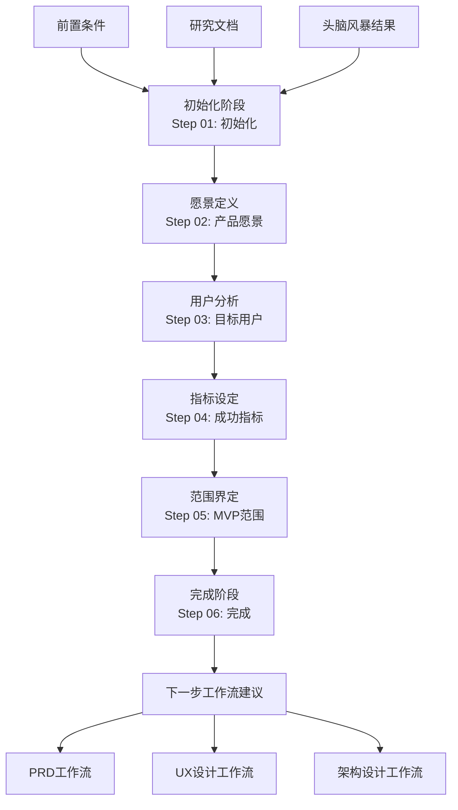
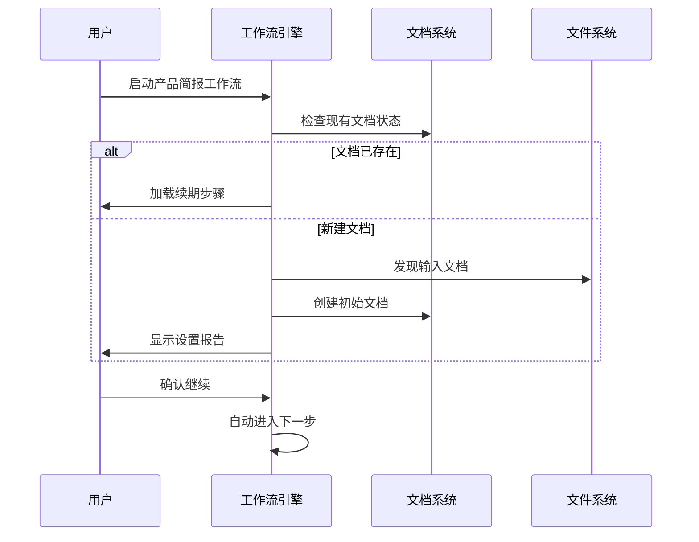
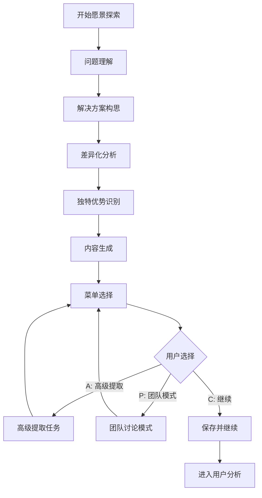
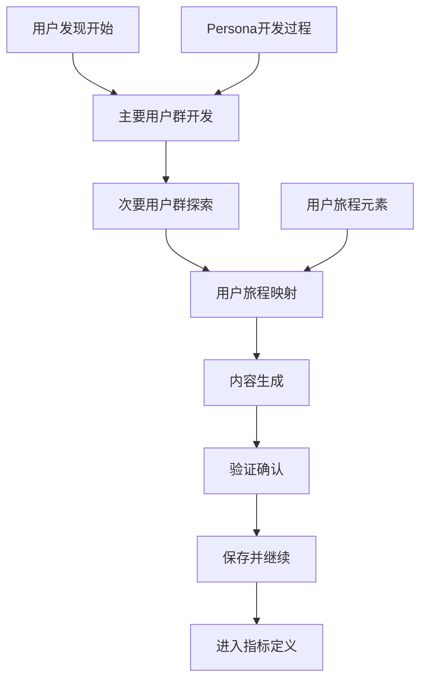
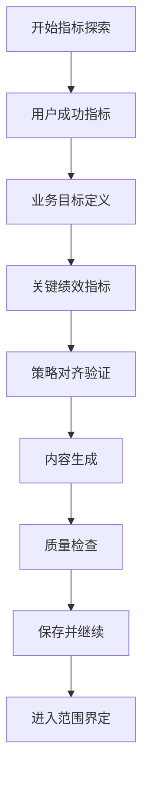
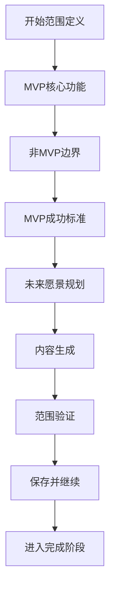
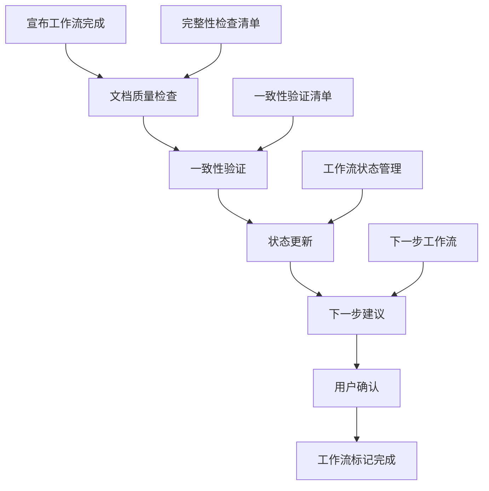
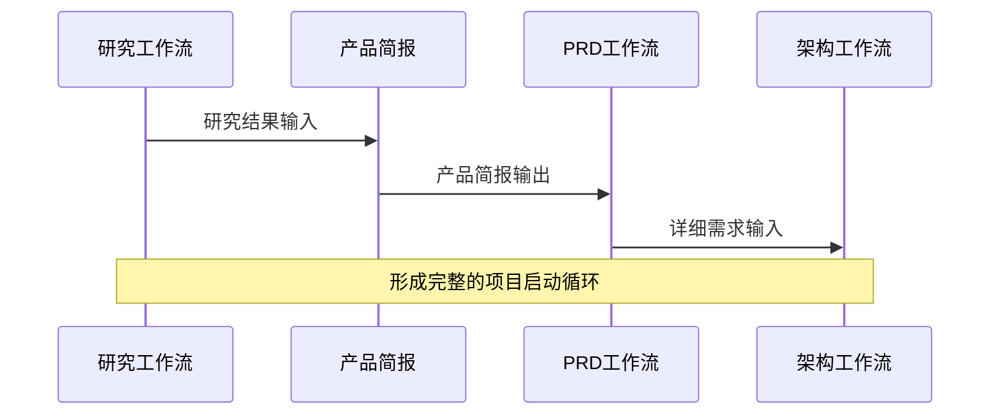

# 产品简报工作流详细文档

<cite>
**本文档引用的文件**
- [workflow.md](file://src/modules/bmm/workflows/1-analysis/product-brief/workflow.md)
- [step-01-init.md](file://src/modules/bmm/workflows/1-analysis/product-brief/steps/step-01-init.md)
- [step-02-vision.md](file://src/modules/bmm/workflows/1-analysis/product-brief/steps/step-02-vision.md)
- [step-03-users.md](file://src/modules/bmm/workflows/1-analysis/product-brief/steps/step-03-users.md)
- [step-04-metrics.md](file://src/modules/bmm/workflows/1-analysis/product-brief/steps/step-04-metrics.md)
- [step-05-scope.md](file://src/modules/bmm/workflows/1-analysis/product-brief/steps/step-05-scope.md)
- [step-06-complete.md](file://src/modules/bmm/workflows/1-analysis/product-brief/steps/step-06-complete.md)
- [product-brief.template.md](file://src/modules/bmm/workflows/1-analysis/product-brief/product-brief.template.md)
- [workflows-analysis.md](file://src/modules/bmm/docs/workflows-analysis.md)
- [project-context-template.md](file://src/modules/bmm/data/project-context-template.md)
</cite>

## 目录
1. [简介](#简介)
2. [工作流架构概述](#工作流架构概述)
3. [六步核心流程详解](#六步核心流程详解)
4. [产品简报模板结构](#产品简报模板结构)
5. [配置选项与使用示例](#配置选项与使用示例)
6. [与其他工作流的集成](#与其他工作流的集成)
7. [最佳实践与指导原则](#最佳实践与指导原则)
8. [故障排除指南](#故障排除指南)
9. [总结](#总结)

## 简介

产品简报工作流是BMAD方法论中项目启动阶段的核心工具，通过系统化的六步骤方法帮助团队建立清晰的产品战略方向。该工作流采用协作式的方法，结合业务分析师的专业知识和领域专家的洞察力，共同构建一个全面的产品愿景文档。

产品简报作为项目的战略基石，为后续的PRD制定、架构设计和技术规划提供了明确的方向和决策依据。它不仅定义了产品的核心价值主张，还建立了可衡量的成功标准和清晰的实施边界。

## 工作流架构概述

产品简报工作流基于严格的步骤文件架构设计，确保每个阶段都有明确的目标和输出。整个工作流遵循以下核心原则：



**图表来源**
- [workflow.md](file://src/modules/bmm/workflows/1-analysis/product-brief/workflow.md#L15-L59)

### 核心架构特点

1. **微文件设计**: 每个步骤都是独立的指令文件，包含完整的执行逻辑
2. **即时加载**: 只有当前步骤文件在内存中，避免信息过载
3. **顺序执行**: 严格按照步骤顺序执行，不允许跳过或优化
4. **状态跟踪**: 通过文档前置元数据记录进度
5. **增量构建**: 通过追加内容的方式构建最终文档

**章节来源**
- [workflow.md](file://src/modules/bmm/workflows/1-analysis/product-brief/workflow.md#L19-L45)

## 六步核心流程详解

### 步骤1: 初始化 (Step 01: 初始化)

初始化阶段是整个工作流的基础，负责设置工作环境和检测现有状态。

#### 执行流程



**图表来源**
- [step-01-init.md](file://src/modules/bmm/workflows/1-analysis/product-brief/steps/step-01-init.md#L64-L170)

#### 关键功能

- **状态检测**: 自动识别现有工作流状态
- **输入发现**: 智能发现相关的研究和头脑风暴文档
- **模板应用**: 使用标准化模板创建新文档
- **上下文加载**: 将相关文档内容加载到内存中

#### 预期输出

- 初始化完成的文档结构
- 发现的相关输入文档列表
- 清晰的设置报告

**章节来源**
- [step-01-init.md](file://src/modules/bmm/workflows/1-analysis/product-brief/steps/step-01-init.md#L1-L193)

### 步骤2: 产品愿景 (Step 02: 产品愿景)

愿景定义阶段是整个工作流的核心，负责建立清晰的产品使命和价值主张。

#### 执行流程



**图表来源**
- [step-02-vision.md](file://src/modules/bmm/workflows/1-analysis/product-brief/steps/step-02-vision.md#L65-L177)

#### 深度探索维度

1. **问题空间探索**: 深入理解用户面临的挑战和痛点
2. **竞争分析**: 分析现有解决方案的局限性
3. **创新机会**: 寻找独特的解决思路
4. **价值主张**: 建立差异化竞争优势

#### 关键产出物

- 执行摘要：简洁明了的产品概述
- 核心愿景：详细的问题陈述和解决方案
- 独特不同点：竞争优势分析

**章节来源**
- [step-02-vision.md](file://src/modules/bmm/workflows/1-analysis/product-brief/steps/step-02-vision.md#L1-L204)

### 步骤3: 目标用户 (Step 03: 目标用户)

用户分析阶段专注于创建详细的用户画像和使用场景。

#### 执行流程



**图表来源**
- [step-03-users.md](file://src/modules/bmm/workflows/1-analysis/product-brief/steps/step-03-users.md#L65-L180)

#### 详细用户画像要素

1. **基本信息**: 真实姓名、背景故事、角色定位
2. **问题体验**: 当前面临的具体挑战
3. **成功愿景**: 使用产品后的理想状态
4. **动机因素**: 行为背后的驱动力
5. **使用场景**: 具体的交互时刻

#### 用户旅程映射

- **发现阶段**: 如何了解到产品
- **入门阶段**: 首次使用的体验
- **核心使用**: 日常使用的主要流程
- **成功时刻**: 产品创造价值的关键节点
- **长期关系**: 产品如何融入用户的日常生活

**章节来源**
- [step-03-users.md](file://src/modules/bmm/workflows/1-analysis/product-brief/steps/step-03-users.md#L1-L207)

### 步骤4: 成功指标 (Step 04: 成功指标)

指标定义阶段建立可测量的成功标准，确保产品发展方向与业务目标一致。

#### 执行流程



**图表来源**
- [step-04-metrics.md](file://src/modules/bmm/workflows/1-analysis/product-brief/steps/step-04-metrics.md#L65-L210)

#### 指标分类体系

1. **用户成功指标**: 关注用户体验和价值实现
   - 行为指标：用户完成特定动作的频率
   - 结果指标：用户获得的实际收益
   - 情感指标：用户满意度和忠诚度

2. **业务目标**: 支撑公司整体战略
   - 成长指标：用户获取和市场渗透
   - 参与指标：使用模式和留存率
   - 财务指标：收入和盈利能力
   - 战略指标：市场份额和竞争优势

3. **关键绩效指标 (KPI)**: 具体可测量的指标
   - 数量指标：具体数值目标
   - 时间指标：达成目标的时间框架
   - 条件指标：达成目标的前提条件

#### 连接原则

确保每个指标都能追溯到：
- 用户需求的根本原因
- 业务战略的直接支持
- 可行的测量方法
- 可采取的行动方案

**章节来源**
- [step-04-metrics.md](file://src/modules/bmm/workflows/1-analysis/product-brief/steps/step-04-metrics.md#L1-L210)

### 步骤5: MVP范围 (Step 05: MVP范围)

范围界定阶段定义最小可行产品边界，平衡功能完整性和实施可行性。

#### 执行流程



**图表来源**
- [step-05-scope.md](file://src/modules/bmm/workflows/1-analysis/product-brief/steps/step-05-scope.md#L65-L224)

#### MVP定义准则

1. **解决核心问题**: 必须有效解决主要痛点
2. **用户价值**: 为用户提供实质性收益
3. **可行性**: 在可用资源和时间内可实现
4. **可测试性**: 允许基于用户反馈进行迭代

#### 边界管理策略

- **明确排除**: 清晰定义不在MVP范围内的功能
- **延迟理由**: 解释为什么某些功能需要推迟
- **时间线考虑**: 为未来版本设定合理的时间表
- **权衡说明**: 向利益相关者解释取舍决策

#### 未来演进路径

- **后MVP增强**: 基于核心功能的扩展计划
- **规模考虑**: 产品成长和扩展的能力
- **生态系统**: 平台或生态系统的扩展机会
- **长期差异化**: 长期竞争优势的构建

**章节来源**
- [step-05-scope.md](file://src/modules/bmm/workflows/1-analysis/product-brief/steps/step-05-scope.md#L1-L224)

### 步骤6: 完成 (Step 06: 完成)

完成阶段标志着工作流的正式结束，同时为后续工作提供清晰的指导。

#### 执行流程



**图表来源**
- [step-06-complete.md](file://src/modules/bmm/workflows/1-analysis/product-brief/steps/step-06-complete.md#L62-L130)

#### 完成验证清单

1. **内容完整性**: 确保所有必要部分都已包含
2. **协作质量**: 验证内容是通过协作产生的
3. **状态更新**: 正确更新工作流状态文件
4. **下步指导**: 提供清晰的后续行动建议
5. **用户确认**: 确认用户理解下一步选项

#### 下一步工作流推荐

1. **PRD工作流**: 创建详细的产品需求文档
   - 基于产品简报建立详细要求
   - 用户画像支持旅程映射
   - 成功指标成为验收标准
   - MVP范围转化为功能规格

2. **UX设计工作流**: 用户体验研究和设计
3. **架构设计工作流**: 技术架构规划
4. **领域研究工作流**: 深入市场或领域研究

**章节来源**
- [step-06-complete.md](file://src/modules/bmm/workflows/1-analysis/product-brief/steps/step-06-complete.md#L1-L200)

## 产品简报模板结构

产品简报模板采用标准化的Markdown格式，确保文档的一致性和可读性。

### 基础模板结构

```markdown
# 产品简报: {{project_name}}

**日期:** {{date}}
**作者:** {{user_name}}

---

<!-- 内容将通过协作工作流步骤逐步追加 -->
```

### 标准化内容结构

产品简报按照以下标准化结构组织内容：

1. **执行摘要**: 产品概述和核心价值主张
2. **核心愿景**: 详细的问题陈述和解决方案
3. **目标用户**: 用户画像和使用场景
4. **成功指标**: 可测量的成功标准
5. **MVP范围**: 最小可行产品边界
6. **未来愿景**: 长期发展蓝图

### 前置元数据管理

工作流自动维护文档的前置元数据，包括：

- `stepsCompleted`: 已完成的步骤列表
- `inputDocuments`: 引用的输入文档
- `workflowType`: 工作流类型标识
- `lastStep`: 最后处理的步骤编号
- `project_name`: 项目名称
- `user_name`: 用户名称
- `date`: 创建日期

**章节来源**
- [product-brief.template.md](file://src/modules/bmm/workflows/1-analysis/product-brief/product-brief.template.md#L1-L9)

## 配置选项与使用示例

### 企业级项目配置

对于企业级项目，产品简报需要特别关注商业价值和战略对齐：

#### 配置要点

1. **业务目标对齐**: 明确与公司战略目标的关联
2. **ROI分析**: 包含投资回报率的量化评估
3. **风险评估**: 识别关键业务风险和缓解措施
4. **合规考虑**: 考虑行业法规和合规要求

#### 使用示例

```yaml
# 企业级配置示例
business_goals:
  - 增加市场份额10%
  - 提升客户留存率至85%
  - 实现年度收入增长20%

success_metrics:
  - 月活跃用户增长15%
  - 客户获取成本降低20%
  - 净推荐值提升至70+
```

### 绿色项目配置

针对环保和可持续发展项目的产品简报：

#### 配置要点

1. **环境影响评估**: 量化项目的环境效益
2. **可持续发展目标**: 对应联合国SDGs目标
3. **碳足迹计算**: 包含碳排放相关的指标
4. **绿色技术应用**: 强调环保技术创新

#### 使用示例

```yaml
# 绿色项目配置示例
environmental_impact:
  - 年减少碳排放量: "10,000吨"
  - 能源效率提升: "30%"
  - 废弃物减少: "50%"

sustainability_goals:
  - SDG 7: 可负担的清洁能源
  - SDG 13: 气候行动
  - SDG 15: 生态系统保护
```

### 技术复杂度配置

根据不同项目的技术复杂度调整工作流深度：

#### 简单项目配置

- 跳过高级提取和团队讨论
- 直接进入内容生成和保存
- 重点关注核心要素

#### 复杂项目配置

- 启用高级提取任务深入分析
- 使用团队模式引入多角度观点
- 增加迭代验证环节

**章节来源**
- [project-context-template.md](file://src/modules/bmm/data/project-context-template.md#L1-L41)

## 与其他工作流的集成

产品简报工作流与BMAD方法论的其他工作流形成了完整的项目生命周期链条。

### 与研究工作流的闭环



**图表来源**
- [workflows-analysis.md](file://src/modules/bmm/docs/workflows-analysis.md#L168-L181)

### 集成关系矩阵

| 分析输出 | 规划输入 | 集成方式 |
|---------|---------|---------|
| product-brief.md | **prd** 工作流 | 直接输入，作为详细需求的基础 |
| market-research.md | **prd** 上下文 | 提供市场洞察和验证需求 |
| domain-research.md | **prd** 上下文 | 提供领域专业知识和限制 |
| technical-research.md | **architecture** (第3阶段) | 提供技术可行性和架构选择 |
| competitive-intelligence.md | **prd** 定位 | 提供竞争分析和差异化策略 |

### 流程模式

#### 绿地项目完整流程

```
1. brainstorm-project - 探索多种方法
2. research (市场/技术/领域) - 验证可行性
3. product-brief - 捕获战略视野
4. → 第2阶段: prd
```

#### 跳过分析流程

```
→ 第2阶段: prd 或 tech-spec 直接开始
```

#### 技术研究专用流程

```
1. research (技术) - 评估技术方案
2. → 第3阶段: architecture (在ADR中使用发现)
```

**章节来源**
- [workflows-analysis.md](file://src/modules/bmm/docs/workflows-analysis.md#L210-L230)

## 最佳实践与指导原则

### 1. 不要过度投入分析

分析是可选的。如果需求清晰，可以直接跳转到第2阶段（规划）。

### 2. 在工作流间迭代

常见模式：头脑风暴 → 研究（验证）→ 简报（综合）

### 3. 记录假设

分析揭示和验证假设。明确记录这些假设以便规划阶段挑战。

### 4. 保持战略聚焦

关注"什么"和"为什么"，而不是"如何"。将实现留给规划和解决方案阶段。

### 5. 让利益相关者参与

使用分析工作流在承诺详细规划之前对齐利益相关者。

### 6. 避免过度分析

通常需要几小时到1-2天。如果耗时更长，可能是在过度分析。转向规划阶段。

### 7. 利用协作优势

工作流强调协作式方法，结合业务分析师的专业知识和领域专家的洞见。

### 8. 维护文档质量

每个步骤完成后都要进行质量检查，确保内容的完整性和一致性。

**章节来源**
- [workflows-analysis.md](file://src/modules/bmm/docs/workflows-analysis.md#L184-L210)

## 故障排除指南

### 常见问题及解决方案

#### 问题1: 工作流卡在某个步骤

**症状**: 无法继续到下一个步骤

**原因**: 
- 未正确保存当前步骤的内容
- 前置元数据未更新
- 缺少必要的用户确认

**解决方案**:
1. 检查前置元数据中的 `stepsCompleted` 数组
2. 确认用户选择了正确的菜单选项（C继续）
3. 验证内容是否正确保存到文档

#### 问题2: 输入文档未被发现

**症状**: 相关的研究或头脑风暴文档未被加载

**原因**:
- 文件路径不正确
- 文件格式不符合预期
- 权限问题

**解决方案**:
1. 检查文件是否位于正确的输出目录
2. 确认文件命名符合发现规则
3. 验证文件格式和编码

#### 问题3: 生成的内容质量不高

**症状**: 产出的内容缺乏深度或不够具体

**原因**:
- 缺乏充分的用户输入
- 未充分利用协作功能
- 忽略了高级提取和团队讨论

**解决方案**:
1. 鼓励用户提供更多细节
2. 充分利用A/P/C菜单功能
3. 在适当情况下启用高级功能

#### 问题4: 工作流状态不一致

**症状**: 工作流状态文件显示错误的完成状态

**原因**:
- 文件写入失败
- 状态更新逻辑错误
- 并发访问冲突

**解决方案**:
1. 检查文件权限和磁盘空间
2. 重新运行相关步骤
3. 手动修复状态文件

### 验证清单

#### 初始化阶段验证
- [ ] 输入文档正确发现和加载
- [ ] 模板正确应用
- [ ] 前置元数据正确初始化

#### 执行阶段验证
- [ ] 每个步骤按顺序执行
- [ ] 用户输入得到充分考虑
- [ ] 内容正确追加到文档
- [ ] 前置元数据及时更新

#### 完成阶段验证
- [ ] 所有必需部分都已包含
- [ ] 工作流状态正确更新
- [ ] 下一步建议清晰明确
- [ ] 用户确认完成

## 总结

产品简报工作流是BMAD方法论中项目启动阶段的战略性工具，通过系统化的六步骤方法确保产品开发从清晰的战略视角出发。该工作流的核心价值在于：

### 主要优势

1. **结构化思考**: 通过标准化步骤引导深度思考
2. **协作驱动**: 结合专业分析和领域知识的优势
3. **渐进式构建**: 通过增量方式建立高质量文档
4. **质量保证**: 每个阶段都有明确的质量控制点
5. **无缝集成**: 与后续工作流形成完整闭环

### 战略意义

产品简报作为项目的战略基石，为：
- **PRD制定**: 提供详细需求的基础
- **架构设计**: 支持技术决策的制定
- **团队对齐**: 确保所有利益相关者理解产品方向
- **决策支持**: 为资源分配和优先级排序提供依据

### 实施建议

1. **充分准备**: 在开始前准备好相关背景资料
2. **积极参与**: 用户应提供充分的领域知识输入
3. **质量优先**: 不要急于求成，确保每个阶段的质量
4. **持续改进**: 根据项目特点调整工作流参数
5. **文档维护**: 定期回顾和更新产品简报内容

通过遵循本文档的指导原则和最佳实践，团队可以充分发挥产品简报工作流的价值，为成功的项目开发奠定坚实基础。