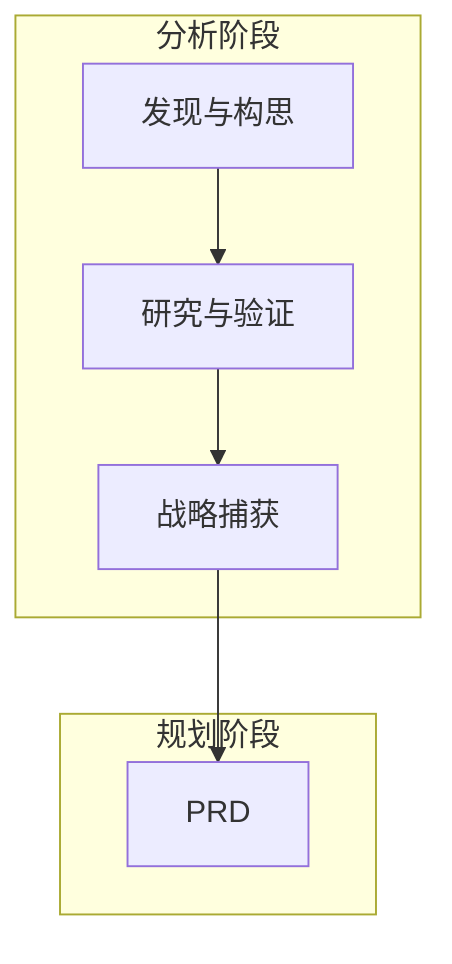
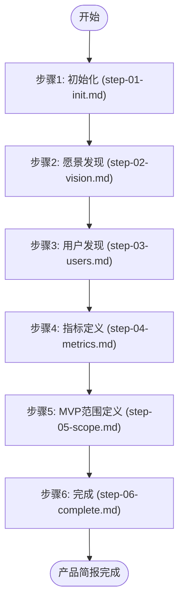
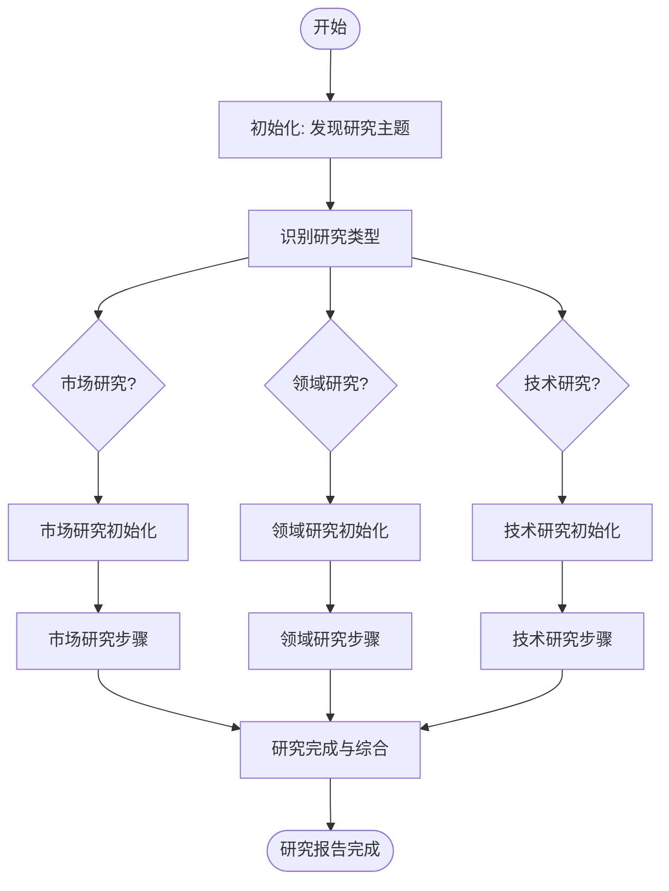

# 分析阶段

<cite>
**本文档中引用的文件**  
- [workflows-analysis.md](file://src/modules/bmm/docs/workflows-analysis.md)
- [product-brief](file://src/modules/bmm/workflows/1-analysis/product-brief)
- [research](file://src/modules/bmm/workflows/1-analysis/research)
- [step-01-init.md](file://src/modules/bmm/workflows/1-analysis/product-brief/steps/step-01-init.md)
- [step-02-vision.md](file://src/modules/bmm/workflows/1-analysis/product-brief/steps/step-02-vision.md)
- [step-03-users.md](file://src/modules/bmm/workflows/1-analysis/product-brief/steps/step-03-users.md)
- [step-04-metrics.md](file://src/modules/bmm/workflows/1-analysis/product-brief/steps/step-04-metrics.md)
- [step-05-scope.md](file://src/modules/bmm/workflows/1-analysis/product-brief/steps/step-05-scope.md)
- [step-06-complete.md](file://src/modules/bmm/workflows/1-analysis/product-brief/steps/step-06-complete.md)
- [workflow.md](file://src/modules/bmm/workflows/1-analysis/product-brief/workflow.md)
- [market-steps](file://src/modules/bmm/workflows/1-analysis/research/market-steps)
- [domain-steps](file://src/modules/bmm/workflows/1-analysis/research/domain-steps)
- [technical-steps](file://src/modules/bmm/workflows/1-analysis/research/technical-steps)
</cite>

## 目录
1. [引言](#引言)
2. [分析阶段概述](#分析阶段概述)
3. [产品简报工作流](#产品简报工作流)
4. [研究工作流](#研究工作流)
5. [工作流执行机制](#工作流执行机制)
6. [配置与使用示例](#配置与使用示例)
7. [决策依据与后续阶段](#决策依据与后续阶段)

## 引言

分析阶段是项目启动的关键准备阶段，旨在通过结构化的工作流为项目奠定坚实的战略基础。该阶段包含两个核心工作流：产品简报（product-brief）和研究（research），它们共同帮助团队验证想法、理解市场、定义产品愿景并生成战略上下文。本文档将详细阐述这两个核心工作流的执行流程、输入输出及相互关系，并通过实际的步骤文件展示其逐步推进机制。

## 分析阶段概述

分析阶段的工作流是可选的探索和发现工具，旨在在项目规划前帮助验证想法、理解市场并生成战略上下文。其核心原则是帮助团队在投入实施前进行战略性思考。当需求已经明确时，可以跳过此阶段。

### 分析阶段的核心工作流

分析阶段包含三类可选工作流：

- **发现与构思**（可选）：如 `brainstorm-project`，用于探索解决方案和架构。
- **研究与验证**（可选）：如 `research`，用于进行市场、技术、竞争、用户、领域和AI研究。
- **战略捕获**（推荐用于新项目）：如 `product-brief`，用于定义产品愿景和策略。

这些工作流的输出将直接输入到第二阶段（规划）的工作流中，特别是 `prd` 工作流。



**图示来源**
- [workflows-analysis.md](file://src/modules/bmm/docs/workflows-analysis.md#L17-L33)

**本节来源**
- [workflows-analysis.md](file://src/modules/bmm/docs/workflows-analysis.md#L1-L33)

## 产品简报工作流

产品简报工作流是一个协作式的、逐步发现的过程，旨在创建全面的产品简报。它通过与用户作为同行伙伴合作，共同定义产品的核心愿景、目标用户、成功指标和MVP范围。

### 执行流程

产品简报工作流采用**步骤文件架构**（step-file architecture），确保执行的纪律性。其核心原则包括：

- **微文件设计**：每个步骤都是一个独立的指令文件，必须严格按照顺序执行。
- **即时加载**：仅在被告知时才加载下一个步骤文件，避免提前加载。
- **顺序执行**：步骤必须按顺序完成，不允许跳过或优化。
- **状态跟踪**：在输出文件的前置元数据（frontmatter）中使用 `stepsCompleted` 数组来跟踪文档进度。
- **仅追加构建**：通过按指示向输出文件追加内容来构建文档。



**图示来源**
- [workflow.md](file://src/modules/bmm/workflows/1-analysis/product-brief/workflow.md#L15-L26)
- [step-01-init.md](file://src/modules/bmm/workflows/1-analysis/product-brief/steps/step-01-init.md)
- [step-06-complete.md](file://src/modules/bmm/workflows/1-analysis/product-brief/steps/step-06-complete.md)

**本节来源**
- [workflow.md](file://src/modules/bmm/workflows/1-analysis/product-brief/workflow.md)
- [step-01-init.md](file://src/modules/bmm/workflows/1-analysis/product-brief/steps/step-01-init.md)
- [step-06-complete.md](file://src/modules/bmm/workflows/1-analysis/product-brief/steps/step-06-complete.md)

### 核心步骤详解

#### 步骤1：初始化 (step-01-init.md)

此步骤专注于工作流的初始化和文档设置，不生成任何内容。其主要任务是检查是否存在现有的工作流状态，如果存在，则读取完整的文件（包括前置元数据），以确保正确处理延续性。

**关键执行规则**：
- 仅专注于初始化和设置，不生成内容。
- 禁止查看后续步骤或假设来自它们的知识。
- 在用户选择“继续”之前，禁止加载下一个步骤。

#### 步骤2：愿景发现 (step-02-vision.md)

此步骤的目标是通过协作分析，发现和定义核心产品愿景、问题陈述和独特价值主张。

**执行流程**：
1.  开始愿景发现对话。
2.  深入理解问题。
3.  分析当前解决方案。
4.  协作构思解决方案。
5.  定义独特优势。
6.  生成执行摘要内容。
7.  呈现菜单选项供用户选择。

**菜单选项**：
- **[A] 高级启发**：执行高级启发任务以深入挖掘和优化内容。
- **[P] 聚会模式**：执行聚会模式工作流，引入不同视角。
- **[C] 继续**：保存内容，更新前置元数据，然后加载并执行下一个步骤。

#### 步骤3：用户发现 (step-03-users.md)

此步骤的目标是定义目标用户，创建丰富的用户画像，并绘制他们与产品交互的关键旅程。

**执行流程**：
1.  开始用户发现。
2.  开发主要用户群体。
3.  探索次要用户群体。
4.  绘制用户旅程。
5.  生成目标用户内容。
6.  呈现菜单选项。

#### 步骤4：指标定义 (step-04-metrics.md)

此步骤的目标是定义全面的成功指标，包括用户成功、业务目标和关键绩效指标（KPI）。

**执行流程**：
1.  开始成功指标发现。
2.  定义用户成功指标。
3.  定义业务目标。
4.  开发关键绩效指标（KPI）。
5.  将指标与战略对齐。
6.  生成成功指标内容。
7.  呈现菜单选项。

#### 步骤5：MVP范围定义 (step-05-scope.md)

此步骤的目标是定义MVP（最小可行产品）的范围，明确边界，并规划未来愿景。

**执行流程**：
1.  开始范围定义。
2.  定义MVP核心功能。
3.  确定MVP范围外的功能。
4.  定义MVP成功标准。
5.  探索未来愿景。
6.  生成MVP范围内容。
7.  呈现菜单选项。

#### 步骤6：完成 (step-06-complete.md)

这是产品简报工作流的最后一步，负责完成工作流、更新状态文件，并建议项目的下一步。

**执行流程**：
1.  宣布工作流完成。
2.  更新工作流状态文件。
3.  建议下一步工作流。
4.  提供战略考虑。

**建议的下一步工作流**：
- `workflow prd`：创建详细的产品需求文档（PRD）。
- `workflow create-ux-design`：进行UX研究和设计。
- `workflow create-architecture`：进行技术架构规划。

**本节来源**
- [step-02-vision.md](file://src/modules/bmm/workflows/1-analysis/product-brief/steps/step-02-vision.md)
- [step-03-users.md](file://src/modules/bmm/workflows/1-analysis/product-brief/steps/step-03-users.md)
- [step-04-metrics.md](file://src/modules/bmm/workflows/1-analysis/product-brief/steps/step-04-metrics.md)
- [step-05-scope.md](file://src/modules/bmm/workflows/1-analysis/product-brief/steps/step-05-scope.md)
- [step-06-complete.md](file://src/modules/bmm/workflows/1-analysis/product-brief/steps/step-06-complete.md)

## 研究工作流

研究工作流旨在通过当前的网络数据和验证过的来源，对多个领域（市场、技术、领域、竞争、用户）进行全面、详尽的研究。

### 执行流程

研究工作流采用**微文件架构**（micro-file architecture）与**基于路由的发现**（routing-based discovery）相结合的方式。

1.  **初始化**：加载配置并解析项目名称、输出文件夹、用户姓名等变量。
2.  **研究类型发现**：通过与用户协作，明确研究主题、目标和范围。
3.  **研究类型识别与路由**：根据用户的选择，将工作流路由到相应的子工作流：
    - **市场研究**：研究市场、客户、竞争。
    - **领域研究**：研究行业、法规、技术趋势。
    - **技术研究**：研究技术评估、架构决策、实施方法。
4.  **子工作流执行**：进入相应的子工作流（如 `market-steps`），进行深入研究。
5.  **完成与综合**：生成包含引言、详细目录和执行摘要的完整研究报告。



**图示来源**
- [workflow.md](file://src/modules/bmm/workflows/1-analysis/research/workflow.md#L31-L37)
- [market-steps](file://src/modules/bmm/workflows/1-analysis/research/market-steps)
- [domain-steps](file://src/modules/bmm/workflows/1-analysis/research/domain-steps)
- [technical-steps](file://src/modules/bmm/workflows/1-analysis/research/technical-steps)

**本节来源**
- [workflow.md](file://src/modules/bmm/workflows/1-analysis/research/workflow.md)
- [market-steps](file://src/modules/bmm/workflows/1-analysis/research/market-steps)
- [domain-steps](file://src/modules/bmm/workflows/1-analysis/research/domain-steps)
- [technical-steps](file://src/modules/bmm/workflows/1-analysis/research/technical-steps)

### 研究类型详解

#### 市场研究 (market-steps)

市场研究子工作流专注于市场分析、客户洞察和竞争格局。

**核心步骤**：
- `step-01-init.md`：确认研究理解，建立清晰的研究范围。
- `step-02-customer-insights.md`：分析客户行为和洞察。
- `step-03-customer-pain-points.md`：识别客户痛点。
- `step-04-customer-decisions.md`：分析客户决策过程。
- `step-05-competitive-analysis.md`：进行竞争分析。
- `step-06-research-completion.md`：完成研究，生成综合报告。

#### 领域研究 (domain-steps)

领域研究子工作流专注于行业特定的深度分析，包括法规和合规性。

**核心步骤**：
- `step-01-init.md`：确认领域研究的范围和方法。
- `step-02-domain-analysis.md`：进行行业分析。
- `step-03-competitive-landscape.md`：分析竞争格局。
- `step-04-regulatory-focus.md`：聚焦法规和合规要求。
- `step-05-technical-trends.md`：评估技术趋势。
- `step-06-research-synthesis.md`：综合研究结果。

#### 技术研究 (technical-steps)

技术研究子工作流专注于技术评估、架构决策和实施方法。

**核心步骤**：
- `step-01-init.md`：确认技术研究的范围和方法。
- `step-02-technical-overview.md`：提供技术概览。
- `step-03-integration-patterns.md`：研究集成模式。
- `step-04-architectural-patterns.md`：分析架构模式。
- `step-05-implementation-research.md`：研究实施方法。
- `step-06-research-synthesis.md`：综合技术研究结果。

**本节来源**
- [market-steps](file://src/modules/bmm/workflows/1-analysis/research/market-steps)
- [domain-steps](file://src/modules/bmm/workflows/1-analysis/research/domain-steps)
- [technical-steps](file://src/modules/bmm/workflows/1-analysis/research/technical-steps)

## 工作流执行机制

分析阶段的工作流通过一系列精心设计的步骤文件来实现其逐步推进机制。每个步骤文件都包含明确的指令、执行规则和上下文边界，确保了过程的严谨性和可重复性。

### 逐步推进机制

以 `step-01-init.md` 文件为例，其执行机制如下：

1.  **检查现有状态**：首先检查输出文件夹中是否已存在产品简报文件。如果存在，则读取整个文件（包括前置元数据）以确定已完成的步骤。
2.  **处理延续性**：如果文档已存在且包含 `stepsCompleted` 前置元数据，则根据已完成的步骤决定下一步操作。
3.  **初始化文档结构**：如果文档不存在或为新工作流，则初始化文档结构，并在前置元数据中设置 `stepsCompleted: [1]`。
4.  **等待用户输入**：在加载下一个步骤之前，必须等待用户选择“继续”（'C'）选项。
5.  **更新状态并加载**：在用户确认后，更新前置元数据，然后加载并执行下一个步骤文件。

这种机制确保了工作流的每一步都经过用户确认，避免了自动化决策，从而保证了产出的质量和相关性。

**本节来源**
- [step-01-init.md](file://src/modules/bmm/workflows/1-analysis/product-brief/steps/step-01-init.md#L64-L76)

## 配置与使用示例

分析阶段的工作流可以根据项目类型灵活调整研究深度。

### 配置选项

- **`enable_web_research`**：默认为 `true`，启用网络研究功能。
- **`document_output_language`**：指定文档输出的语言。
- **`user_skill_level`**：根据用户技能水平调整交互的复杂度。

### 使用示例

以下是根据项目类型选择工作流的常见模式：

#### 绿色领域软件项目（完整分析）
```
1. brainstorm-project - 探索解决方案方法
2. research (market/technical/domain) - 验证可行性
3. product-brief - 捕获战略愿景
4. → 第二阶段：prd
```

#### 技术研究（仅限）
```
1. research (technical) - 评估技术
2. → 第三阶段：architecture (在ADR中使用发现)
```

#### 跳过分析（需求明确）
```
→ 第二阶段：直接进行 prd 或 tech-spec
```

这些模式为团队提供了清晰的决策路径，可以根据项目的具体情况选择最合适的分析深度。

**本节来源**
- [workflows-analysis.md](file://src/modules/bmm/docs/workflows-analysis.md#L208-L230)

## 决策依据与后续阶段

分析阶段的产出物为后续的规划阶段提供了关键的决策依据。

### 产出物与输入关系

| 分析产出物 | 规划阶段输入 |
| :--- | :--- |
| product-brief.md | **prd** 工作流 |
| market-research.md | **prd** 上下文 |
| domain-research.md | **prd** 上下文 |
| technical-research.md | **architecture** (第三阶段) |
| competitive-intelligence.md | **prd** 定位 |

规划阶段的工作流会自动加载这些文档（如果它们存在于输出文件夹中），从而确保战略的连续性。

### 最佳实践

1.  **不要过度投入分析**：如果需求已经明确，应跳过分析阶段，直接进入规划。
2.  **在工作流之间迭代**：常见的模式是：构思 → 研究（验证） → 简报（综合）。
3.  **记录假设**：分析阶段会揭示和验证假设，应明确记录下来供规划阶段挑战。
4.  **保持战略性**：专注于“做什么”和“为什么”，将“如何做”留给规划和解决方案阶段。
5.  **让利益相关者参与**：在投入详细规划之前，使用分析工作流来与利益相关者达成一致。

通过遵循这些原则，分析阶段能够有效地为项目奠定基础，确保后续工作建立在坚实的战略和市场理解之上。

**本节来源**
- [workflows-analysis.md](file://src/modules/bmm/docs/workflows-analysis.md#L168-L179)
- [workflows-analysis.md](file://src/modules/bmm/docs/workflows-analysis.md#L184-L205)