# 市场研究

<cite>
**本文档中引用的文件**  
- [step-01-init.md](file://src/modules/bmm/workflows/1-analysis/research/market-steps/step-01-init.md)
- [step-02-customer-behavior.md](file://src/modules/bmm/workflows/1-analysis/research/market-steps/step-02-customer-behavior.md)
- [step-02-customer-insights.md](file://src/modules/bmm/workflows/1-analysis/research/market-steps/step-02-customer-insights.md)
- [step-03-customer-pain-points.md](file://src/modules/bmm/workflows/1-analysis/research/market-steps/step-03-customer-pain-points.md)
- [step-04-customer-decisions.md](file://src/modules/bmm/workflows/1-analysis/research/market-steps/step-04-customer-decisions.md)
- [step-05-competitive-analysis.md](file://src/modules/bmm/workflows/1-analysis/research/market-steps/step-05-competitive-analysis.md)
- [step-06-research-completion.md](file://src/modules/bmm/workflows/1-analysis/research/market-steps/step-06-research-completion.md)
</cite>

## 目录
1. [引言](#引言)
2. [市场研究路径概述](#市场研究路径概述)
3. [初始化阶段](#初始化阶段)
4. [客户行为分析](#客户行为分析)
5. [客户洞察分析](#客户洞察分析)
6. [痛点识别](#痛点识别)
7. [决策路径分析](#决策路径分析)
8. [竞争分析](#竞争分析)
9. [研究完成与综合](#研究完成与综合)
10. [定性与定量研究结合](#定性与定量研究结合)
11. [用户画像与市场定位](#用户画像与市场定位)
12. [配置选项与使用示例](#配置选项与使用示例)
13. [产品功能设计输入](#产品功能设计输入)

## 引言

市场研究是项目分析阶段的关键环节，为产品开发和用户体验优化提供深入的用户和市场洞察。本研究路径通过六个系统化步骤，从初始化到研究完成，全面理解目标用户的行为模式、核心痛点和决策过程。该框架结合定性与定量研究方法，通过多维度数据收集策略，构建精准的用户画像和市场定位，为产品功能设计提供直接输入。

**本研究路径的核心价值在于：**
- 通过结构化流程确保研究的完整性和系统性
- 结合多种研究方法提高洞察的深度和广度
- 提供可操作的洞察，直接指导产品开发决策
- 建立数据驱动的产品设计基础

## 市场研究路径概述

市场研究路径采用六步法系统化地收集和分析用户与市场数据：

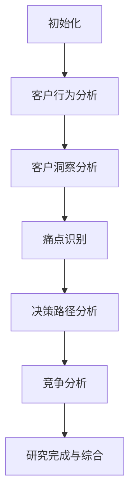

**图示来源**
- [step-01-init.md](file://src/modules/bmm/workflows/1-analysis/research/market-steps/step-01-init.md)
- [step-02-customer-behavior.md](file://src/modules/bmm/workflows/1-analysis/research/market-steps/step-02-customer-behavior.md)
- [step-03-customer-pain-points.md](file://src/modules/bmm/workflows/1-analysis/research/market-steps/step-03-customer-pain-points.md)
- [step-04-customer-decisions.md](file://src/modules/bmm/workflows/1-analysis/research/market-steps/step-04-customer-decisions.md)
- [step-05-competitive-analysis.md](file://src/modules/bmm/workflows/1-analysis/research/market-steps/step-05-competitive-analysis.md)
- [step-06-research-completion.md](file://src/modules/bmm/workflows/1-analysis/research/market-steps/step-06-research-completion.md)

该研究路径的设计原则包括：
- **系统性**：每个步骤都有明确的目标和输出
- **迭代性**：允许在必要时返回前序步骤进行补充研究
- **数据驱动**：所有结论都基于可验证的数据来源
- **用户中心**：始终以用户需求和体验为核心

## 初始化阶段

研究的初始化阶段是确保研究方向正确性的关键步骤，主要任务是确认研究理解、明确研究范围和建立研究框架。

### 研究理解确认

初始化阶段首先确认对研究主题和目标的理解：

```markdown
**研究主题**: {{research_topic}}
**研究目标**: {{research_goals}}
**研究类型**: 市场研究，使用当前{{current_year}}数据
**方法**: 全面的市场分析，严格的来源验证
```

### 研究范围界定

通过一系列问题细化研究范围：

- "是否有特定的客户群体或{{research_topic}}方面需要优先考虑？"
- "应关注特定地理区域还是全球市场？"
- "这是用于市场进入、扩展、产品开发还是其他商业目的？"
- "是否有特定的竞争对手或市场细分需要分析？"

### 初始范围文档

立即创建初始研究范围文档，确保研究的透明度和可追溯性：

```markdown
# 市场研究: {{research_topic}}

## 研究初始化

### 研究理解确认
**主题**: {{research_topic}}
**目标**: {{research_goals}}
**研究类型**: 市场研究
**数据时效性**: {{current_year}}，严格的来源验证
**日期**: {{date}}

### 研究范围
**市场分析重点**:
- 市场规模、增长预测和动态
- 客户群体、行为模式和洞察
- 竞争格局和定位分析
- 战略建议和实施指导

### 下一步
**研究流程**:
1. ✅ 初始化和范围设定（当前步骤）
2. 客户洞察和行为分析
3. 竞争格局分析
4. 战略综合和建议
```

**本节来源**
- [step-01-init.md](file://src/modules/bmm/workflows/1-analysis/research/market-steps/step-01-init.md#L36-L183)

## 客户行为分析

客户行为分析阶段通过多维度数据收集，深入理解客户的行为模式、偏好和互动方式。

### 并行研究执行

采用并行搜索策略，同时执行多个网络搜索：

```
WebSearch: "{{research_topic}} 客户行为模式 {{current_year}}"
WebSearch: "{{research_topic}} 客户人口统计 {{current_year}}"
WebSearch: "{{research_topic}} 心理特征分析 {{current_year}}"
WebSearch: "{{research_topic}} 客户行为驱动因素 {{current_year}}"
```

### 分析维度

客户行为分析涵盖以下关键维度：

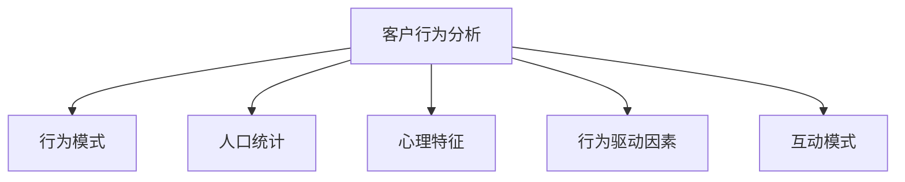

**图示来源**
- [step-02-customer-behavior.md](file://src/modules/bmm/workflows/1-analysis/research/market-steps/step-02-customer-behavior.md#L36-L76)

### 内容结构

分析结果按照以下结构记录：

```markdown
## 客户行为和细分

### 客户行为模式
[客户行为模式分析，附来源引用]

### 人口统计细分
[人口统计分析，附来源引用]

### 心理特征分析
[心理特征分析，附来源引用]

### 行为驱动因素和影响
[行为驱动因素分析，附来源引用]

### 客户互动模式
[客户互动分析，附来源引用]
```

**本节来源**
- [step-02-customer-behavior.md](file://src/modules/bmm/workflows/1-analysis/research/market-steps/step-02-customer-behavior.md#L1-L236)

## 客户洞察分析

客户洞察分析阶段整合多维度数据，形成对客户的全面理解。

### 并行洞察研究

执行多个并行的网络搜索：

```
WebSearch: "[产品/服务/市场] 客户行为模式 {{current_year}}"
WebSearch: "[产品/服务/市场] 客户痛点挑战 {{current_year}}"
WebSearch: "[产品/服务/市场] 客户决策过程 {{current_year}}"
```

### 分析框架

客户洞察分析框架包括：

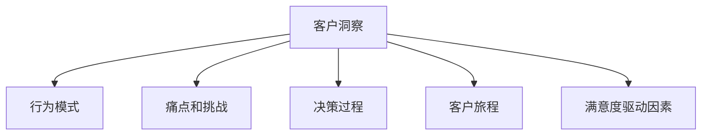

**图示来源**
- [step-02-customer-insights.md](file://src/modules/bmm/workflows/1-analysis/research/market-steps/step-02-customer-insights.md#L33-L76)

### 内容结构

分析结果按照以下结构记录：

```markdown
## 客户洞察

### 客户行为模式
[客户行为分析，附来源引用]

### 痛点和挑战
[痛点分析，附来源引用]

### 决策过程
[决策分析，附来源引用]

### 客户旅程映射
[客户旅程分析，附来源引用]

### 满意度驱动因素
[满意度分析，附来源引用]
```

**本节来源**
- [step-02-customer-insights.md](file://src/modules/bmm/workflows/1-analysis/research/market-steps/step-02-customer-insights.md#L1-L170)

## 痛点识别

痛点识别阶段专注于发现客户面临的挑战、未满足的需求和使用障碍。

### 并行痛点研究

执行多个并行的网络搜索：

```
WebSearch: "{{research_topic}} 客户痛点挑战 {{current_year}}"
WebSearch: "{{research_topic}} 客户挫折 {{current_year}}"
WebSearch: "{{research_topic}} 未满足的客户需求 {{current_year}}"
WebSearch: "{{research_topic}} 客户采用障碍 {{current_year}}"
```

### 分析维度

痛点识别涵盖以下关键维度：

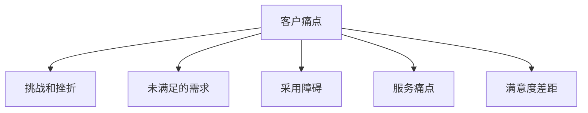

**图示来源**
- [step-03-customer-pain-points.md](file://src/modules/bmm/workflows/1-analysis/research/market-steps/step-03-customer-pain-points.md#L37-L64)

### 内容结构

分析结果按照以下结构记录：

```markdown
## 客户痛点和需求

### 客户挑战和挫折
[客户挑战分析，附来源引用]

### 未满足的客户需求
[未满足需求分析，附来源引用]

### 采用障碍
[采用障碍分析，附来源引用]

### 服务和支持痛点
[服务痛点分析，附来源引用]

### 客户满意度差距
[满意度差距分析，附来源引用]
```

**本节来源**
- [step-03-customer-pain-points.md](file://src/modules/bmm/workflows/1-analysis/research/market-steps/step-03-customer-pain-points.md#L1-L248)

## 决策路径分析

决策路径分析阶段深入研究客户的决策过程、影响因素和旅程映射。

### 并行决策研究

执行多个并行的网络搜索：

```
WebSearch: "{{research_topic}} 客户决策过程 {{current_year}}"
WebSearch: "{{research_topic}} 购买标准因素 {{current_year}}"
WebSearch: "{{research_topic}} 客户旅程映射 {{current_year}}"
WebSearch: "{{research_topic}} 决策影响因素 {{current_year}}"
```

### 决策旅程映射

客户决策旅程包括以下阶段：

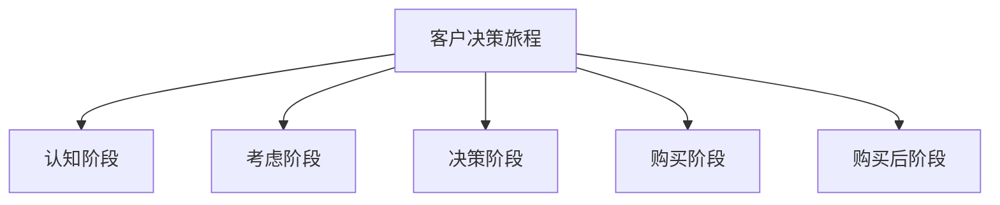

**图示来源**
- [step-04-customer-decisions.md](file://src/modules/bmm/workflows/1-analysis/research/market-steps/step-04-customer-decisions.md#L56-L63)

### 内容结构

分析结果按照以下结构记录：

```markdown
## 客户决策过程和旅程

### 客户决策过程
[决策过程分析，附来源引用]

### 决策因素和标准
[决策因素分析，附来源引用]

### 客户旅程映射
[旅程映射分析，附来源引用]

### 接触点分析
[接触点分析，附来源引用]

### 信息收集模式
[信息收集分析，附来源引用]
```

**本节来源**
- [step-04-customer-decisions.md](file://src/modules/bmm/workflows/1-analysis/research/market-steps/step-04-customer-decisions.md#L1-L258)

## 竞争分析

竞争分析阶段全面评估竞争格局、市场定位和差异化机会。

### 竞争研究执行

执行多个网络搜索：

```
WebSearch: "{{research_topic}} 主要市场参与者 {{current_year}}"
WebSearch: "{{research_topic}} 市场份额分析 {{current_year}}"
WebSearch: "{{research_topic}} 竞争定位策略 {{current_year}}"
WebSearch: "{{research_topic}} 竞争优势和劣势 {{current_year}}"
```

### 分析维度

竞争分析涵盖以下关键维度：

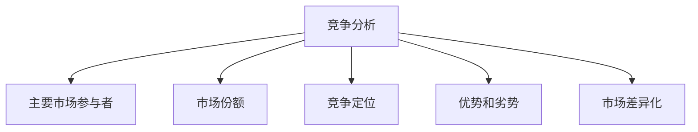

**图示来源**
- [step-05-competitive-analysis.md](file://src/modules/bmm/workflows/1-analysis/research/market-steps/step-05-competitive-analysis.md#L35-L47)

### 内容结构

分析结果按照以下结构记录：

```markdown
## 竞争格局

### 主要市场参与者
[主要参与者分析，附来源引用]

### 市场份额分析
[市场份额分析，附来源引用]

### 竞争定位
[定位分析，附来源引用]

### 优势和劣势
[SWOT分析，附来源引用]

### 市场差异化
[差异化分析，附来源引用]
```

**本节来源**
- [step-05-competitive-analysis.md](file://src/modules/bmm/workflows/1-analysis/research/market-steps/step-05-competitive-analysis.md#L1-L176)

## 研究完成与综合

研究完成阶段将所有研究发现综合成一份全面的市场研究报告。

### 战略综合

进行战略综合，整合所有研究发现：

```
WebSearch: "市场进入策略最佳实践 {{current_year}}"
WebSearch: "市场研究风险评估框架 {{current_year}}"
```

### 完整文档结构

生成完整的市场研究报告：

```markdown
# [引人注目的标题]: 综合{{research_topic}}市场研究

## 执行摘要
[关键市场发现和战略影响的简要概述]

## 目录
- 市场研究介绍和方法论
- {{research_topic}}市场分析和动态
- 客户洞察和行为分析
- 竞争格局和定位
- 战略市场建议
- 市场进入和增长策略
- 风险评估和缓解
- 实施路线图和成功指标
- 未来市场展望和机会
```

### 综合分析框架

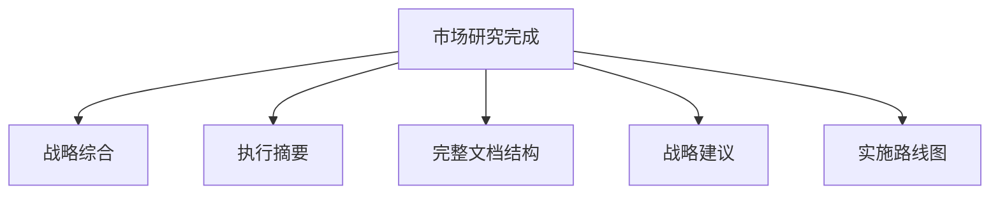

**图示来源**
- [step-06-research-completion.md](file://src/modules/bmm/workflows/1-analysis/research/market-steps/step-06-research-completion.md#L36-L81)

**本节来源**
- [step-06-research-completion.md](file://src/modules/bmm/workflows/1-analysis/research/market-steps/step-06-research-completion.md#L1-L476)

## 定性与定量研究结合

本研究路径成功地将定性与定量研究方法相结合，提供全面的市场洞察。

### 定量研究方法

定量研究主要通过以下方式实施：

- **网络搜索分析**：使用特定关键词进行系统化搜索
- **数据验证**：要求所有事实声明都有多个独立来源验证
- **置信度评估**：对不确定的数据应用置信度水平
- **时效性要求**：始终使用{{current_year}}数据确保信息的时效性

### 定性研究方法

定性研究主要通过以下方式实施：

- **跨维度分析**：识别行为、痛点和决策之间的模式联系
- **质量评估**：识别研究差距和数据局限性
- **多视角呈现**：当来源冲突时呈现多种观点
- **深度洞察**：关注可操作的客户洞察而非表面信息

### 结合优势

定性与定量研究结合的优势包括：

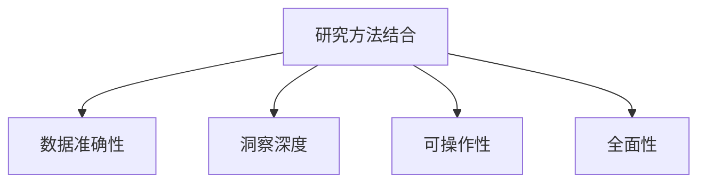

**本节来源**
- [step-02-customer-behavior.md](file://src/modules/bmm/workflows/1-analysis/research/market-steps/step-02-customer-behavior.md#L213-L229)
- [step-03-customer-pain-points.md](file://src/modules/bmm/workflows/1-analysis/research/market-steps/step-03-customer-pain-points.md#L224-L241)
- [step-04-customer-decisions.md](file://src/modules/bmm/workflows/1-analysis/research/market-steps/step-04-customer-decisions.md#L245-L251)

## 用户画像与市场定位

基于研究发现，构建详细的用户画像和市场定位策略。

### 用户画像构建

用户画像构建流程：

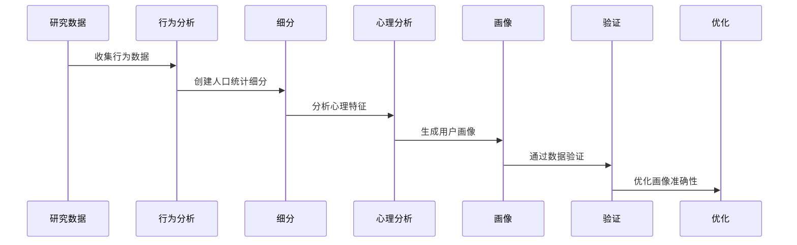

**图示来源**
- [step-02-customer-behavior.md](file://src/modules/bmm/workflows/1-analysis/research/market-steps/step-02-customer-behavior.md#L131-L137)

### 市场定位策略

市场定位策略框架：

```markdown
## 市场定位策略

### 定位机会
[市场差异化机会分析]

### 竞争差距
[未满足的市场需求和机会]

### 定位框架
[推荐的定位方法]
```

**本节来源**
- [step-06-research-completion.md](file://src/modules/bmm/workflows/1-analysis/research/market-steps/step-06-research-completion.md#L196-L202)

## 配置选项与使用示例

本研究路径可根据不同产品类型调整研究重点。

### 配置选项

研究路径的可配置参数：

| 参数 | 描述 | 示例值 |
|------|------|--------|
| research_topic | 研究主题 | 智能手机、电动汽车、在线教育 |
| research_goals | 研究目标 | 市场进入、产品优化、竞争分析 |
| geographic_focus | 地理重点 | 全球、北美、亚太地区 |
| customer_segments | 客户群体 | 消费者、企业、中小企业 |

### 使用示例

不同产品类型的研究重点调整：

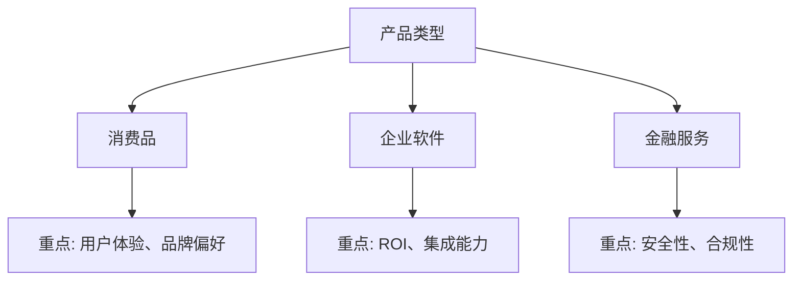

**本节来源**
- [step-01-init.md](file://src/modules/bmm/workflows/1-analysis/research/market-steps/step-01-init.md#L63-L69)

## 产品功能设计输入

市场研究为产品功能设计和用户体验优化提供直接输入。

### 功能设计指导

研究发现如何指导产品功能设计：

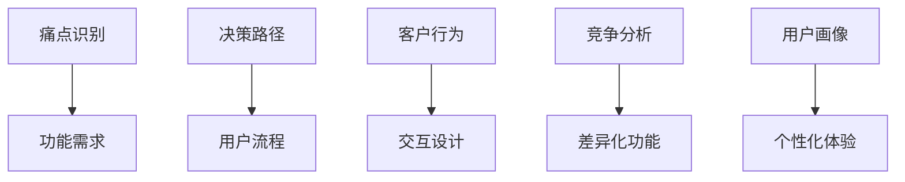

**图示来源**
- [step-03-customer-pain-points.md](file://src/modules/bmm/workflows/1-analysis/research/market-steps/step-03-customer-pain-points.md#L159-L166)
- [step-04-customer-decisions.md](file://src/modules/bmm/workflows/1-analysis/research/market-steps/step-04-customer-decisions.md#L169-L176)

### 设计输入框架

将研究发现转化为设计输入的框架：

```markdown
## 产品功能设计输入

### 基于痛点的功能
[解决关键痛点的功能建议]

### 基于决策路径的流程
[优化决策流程的用户界面设计]

### 基于行为模式的交互
[符合用户行为模式的交互设计]

### 基于竞争分析的差异化
[超越竞争对手的差异化功能]
```

**本节来源**
- [step-06-research-completion.md](file://src/modules/bmm/workflows/1-analysis/research/market-steps/step-06-research-completion.md#L214-L221)