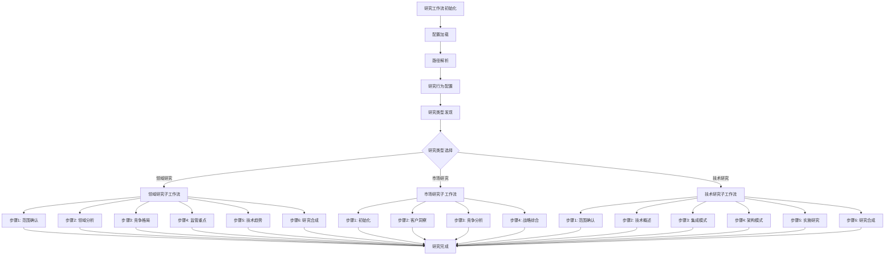
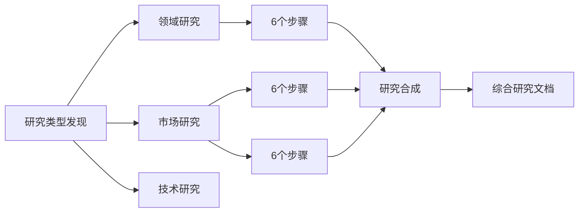
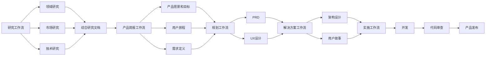

# 研究工作流

<cite>
**本文档引用文件**  
- [workflow.md](file://src/modules/bmm/workflows/1-analysis/research/workflow.md)
- [step-01-init.md](file://src/modules/bmm/workflows/1-analysis/research/domain-steps/step-01-init.md)
- [step-02-domain-analysis.md](file://src/modules/bmm/workflows/1-analysis/research/domain-steps/step-02-domain-analysis.md)
- [step-03-competitive-landscape.md](file://src/modules/bmm/workflows/1-analysis/research/domain-steps/step-03-competitive-landscape.md)
- [step-04-regulatory-focus.md](file://src/modules/bmm/workflows/1-analysis/research/domain-steps/step-04-regulatory-focus.md)
- [step-05-technical-trends.md](file://src/modules/bmm/workflows/1-analysis/research/domain-steps/step-05-technical-trends.md)
- [step-06-research-synthesis.md](file://src/modules/bmm/workflows/1-analysis/research/domain-steps/step-06-research-synthesis.md)
- [market-steps/step-01-init.md](file://src/modules/bmm/workflows/1-analysis/research/market-steps/step-01-init.md)
- [technical-steps/step-01-init.md](file://src/modules/bmm/workflows/1-analysis/research/technical-steps/step-01-init.md)
- [research.template.md](file://src/modules/bmm/workflows/1-analysis/research/research.template.md)
- [product-brief/workflow.md](file://src/modules/bmm/workflows/1-analysis/product-brief/workflow.md)
</cite>

## 目录
1. [引言](#引言)
2. [工作流架构](#工作流架构)
3. [研究路径概览](#研究路径概览)
4. [领域研究路径](#领域研究路径)
5. [市场研究路径](#市场研究路径)
6. [技术研究路径](#技术研究路径)
7. [研究模板与文档结构](#研究模板与文档结构)
8. [配置选项与使用示例](#配置选项与使用示例)
9. [跨领域整合方法](#跨领域整合方法)
10. [与产品简报的知识链条](#与产品简报的知识链条)
11. [结论](#结论)

## 引言

研究工作流是一个系统化的多维度分析框架，旨在通过领域、市场和技术三个研究路径全面评估项目可行性。该工作流采用微文件架构和基于路由的发现机制，确保研究过程的结构化和可追溯性。每个研究路径包含六个步骤，从范围确认到最终合成，形成完整的闭环。工作流强调使用当前年份的网络数据和严格的来源验证，确保研究结果的权威性和时效性。本研究工作流为产品简报提供坚实的数据支持，并与后续的架构决策形成知识链条，支持从研究到实施的无缝过渡。

**研究工作流目标**：通过当前网络数据和验证来源，跨多个领域进行全面、详尽的研究，生成具有引人入胜叙事和适当引用的完整研究文档。

**最终交付物**：一份完整的、可作为研究主题权威参考的研究文档，包含：
- 引人入胜的叙事性引言
- 全面的目录
- 带有适当引用的详细研究部分
- 执行摘要和结论

**Section sources**
- [workflow.md](file://src/modules/bmm/workflows/1-analysis/research/workflow.md#L6-L26)

## 工作流架构

研究工作流采用**微文件架构**与**基于路由的发现**相结合的设计模式。这种架构将复杂的多维度研究分解为独立、可管理的步骤文件，通过动态路由机制实现研究路径的灵活选择和执行。

**核心架构原则**：
- **微文件设计**：每个研究类型（领域、市场、技术）都有独立的步骤文件夹，每个步骤是一个自包含的指令文件。
- **路由式发现**：第一步（step-01）负责发现研究类型并路由到相应的子工作流，实现动态路径选择。
- **顺序执行**：在每个研究类型内部，步骤按严格顺序执行，确保研究逻辑的完整性。
- **状态跟踪**：研究进度通过文档前言（frontmatter）中的`stepsCompleted`数组进行跟踪，确保过程可追溯。
- **追加式构建**：研究文档通过在输出文件中追加内容的方式逐步构建，保持文档的连贯性。

**执行协议**：
- **完整阅读**：在执行任何操作前，必须完整阅读整个步骤文件。
- **用户确认**：在关键节点（如继续、完成）必须等待用户选择，确保用户对研究方向的控制。
- **状态更新**：在加载下一步之前，必须更新文档前言中的`stepsCompleted`数组。
- **禁止预加载**：绝不允许同时加载多个步骤文件，确保研究过程的专注性和准确性。

**初始化流程**：
1. **配置加载**：从项目根目录的配置文件中加载`project_name`、`output_folder`、`user_name`等参数。
2. **路径解析**：确定已安装路径、模板路径和默认输出文件路径。
3. **研究行为配置**：启用网络研究，设置数据验证标准，确保所有事实声明都有来源引用。



**Diagram sources**
- [workflow.md](file://src/modules/bmm/workflows/1-analysis/research/workflow.md#L29-L37)
- [workflow.md](file://src/modules/bmm/workflows/1-analysis/research/workflow.md#L40-L56)

**Section sources**
- [workflow.md](file://src/modules/bmm/workflows/1-analysis/research/workflow.md#L29-L56)

## 研究路径概览

研究工作流提供三种核心研究路径：领域研究、市场研究和技术研究。每种路径都包含六个标准化步骤，确保研究过程的系统性和一致性。用户在工作流初始化阶段选择最适合其需求的研究类型，系统将自动路由到相应的子工作流。

**研究类型选项**：
1. **领域研究** - 行业分析、监管、特定领域的技术趋势
   _最适合：理解行业背景、监管环境、生态系统_

2. **市场研究** - 市场规模、增长、竞争、客户洞察
   _最适合：理解市场动态、客户行为、竞争格局_

3. **技术研究** - 技术评估、架构决策、实施方法
   _最适合：技术可行性、技术选择、实施策略_

**研究标准**：
- **全面覆盖**：详尽的研究，无关键缺口
- **来源验证**：每个事实声明都引用来自当前年份的URL
- **文档长度**：根据研究主题的需要而定
- **专业结构**：引人入胜的叙事性引言、详细的目录和全面的摘要
- **权威来源**：所有关键声明都有多个独立来源

**并行执行协调**：
虽然三种研究路径是独立的，但它们可以并行执行以获得更全面的洞察。例如，一个项目可以同时启动领域研究和市场研究，然后将结果整合到一个综合报告中。配置文件中的`enable_web_research`参数控制网络研究功能，允许根据项目复杂度调整研究深度。



**Diagram sources**
- [workflow.md](file://src/modules/bmm/workflows/1-analysis/research/workflow.md#L135-L145)

**Section sources**
- [workflow.md](file://src/modules/bmm/workflows/1-analysis/research/workflow.md#L135-L145)

## 领域研究路径

领域研究路径专注于行业分析、监管环境和技术趋势，旨在为特定领域提供全面的背景理解。该路径包含六个步骤，从范围确认到最终合成，形成一个完整的分析闭环。

### 步骤1: 领域研究范围确认

此步骤是范围确认阶段，不进行实际研究。其主要任务是与用户确认研究范围和方法。

**执行任务**：
- 确认研究主题 `{{research_topic}}` 和研究目标 `{{research_goals}}`
- 明确领域研究范围，包括行业分析、监管环境、技术模式、经济因素和供应链分析
- 确认研究方法，强调使用当前年份的网络数据和严格的来源验证

**范围确认内容**：
- **行业分析** - 市场结构、关键参与者、竞争动态
- **监管要求** - 合规标准、法律框架
- **技术趋势** - 创新模式、数字化转型
- **经济因素** - 市场规模、增长预测、经济影响
- **供应链分析** - 价值链、生态系统、合作伙伴

**成功指标**：
- 领域研究范围与用户清晰确认
- 所有分析领域均已识别和解释
- 强调了当前年份的网络数据要求
- 在用户选择“继续”后正确路由到下一步

**Section sources**
- [domain-steps/step-01-init.md](file://src/modules/bmm/workflows/1-analysis/research/domain-steps/step-01-init.md#L1-L137)

### 步骤2: 领域分析

此步骤进行深入的行业分析，重点关注市场规模、增长和行业动态。

**执行协议**：
- 使用当前年份的网络搜索获取最新行业数据
- 执行并行网络搜索，同时分析不同行业领域
- 立即将内容写入文档，确保研究过程的透明性

**并行研究执行**：
- `WebSearch: "{{research_topic}} 市场规模价值 {{current_year}}"`
- `WebSearch: "{{research_topic}} 市场增长率动态 {{current_year}}"`
- `WebSearch: "{{research_topic}} 市场细分结构 {{current_year}}"`
- `WebSearch: "{{research_topic}} 行业趋势演变 {{current_year}}"`

**内容结构**：
```markdown
## 行业分析

### 市场规模和估值
[市场规模分析，附来源引用]

### 市场动态和增长
[市场动态分析，附来源引用]

### 市场结构和细分
[市场结构分析，附来源引用]

### 行业趋势和演变
[行业趋势分析，附来源引用]

### 竞争动态
[竞争动态分析，附来源引用]
```

**成功指标**：
- 市场规模和估值彻底分析
- 增长动态和市场结构已记录
- 行业趋势和演变模式已识别
- 竞争动态已明确映射
- 关键洞察已通过多个来源验证

**Section sources**
- [domain-steps/step-02-domain-analysis.md](file://src/modules/bmm/workflows/1-analysis/research/domain-steps/step-02-domain-analysis.md#L1-L229)

### 步骤3: 竞争格局

此步骤分析竞争格局、关键参与者和生态系统。

**执行任务**：
- 识别主要市场参与者及其市场份额
- 分析竞争强度和市场集中度
- 评估进入壁垒和创新压力
- 映射生态系统关系和价值链

**内容结构**：
```markdown
## 竞争格局

### 主要市场参与者
[主要参与者分析，附来源引用]

### 市场集中度
[市场集中度分析，附来源引用]

### 竞争强度
[竞争强度分析，附来源引用]

### 进入壁垒
[进入壁垒分析，附来源引用]

### 创新压力
[创新压力分析，附来源引用]
```

**成功指标**：
- 主要市场参与者已识别和分析
- 市场集中度和竞争强度已量化
- 进入壁垒和创新压力已评估
- 生态系统关系已映射

**Section sources**
- [domain-steps/step-03-competitive-landscape.md](file://src/modules/bmm/workflows/1-analysis/research/domain-steps/step-03-competitive-landscape.md)

### 步骤4: 监管重点

此步骤详细分析监管框架、合规要求和标准。

**执行任务**：
- 识别适用于该领域的所有相关法规和标准
- 分析合规要求和法律框架
- 评估监管变化对行业的影响
- 提供合规策略建议

**内容结构**：
```markdown
## 监管重点

### 相关法规和标准
[法规和标准分析，附来源引用]

### 合规要求
[合规要求分析，附来源引用]

### 监管影响
[监管影响分析，附来源引用]

### 合规策略
[合规策略建议，附来源引用]
```

**成功指标**：
- 所有相关法规和标准已识别
- 合规要求已详细分析
- 监管影响已评估
- 合规策略建议已提供

**Section sources**
- [domain-steps/step-04-regulatory-focus.md](file://src/modules/bmm/workflows/1-analysis/research/domain-steps/step-04-regulatory-focus.md)

### 步骤5: 技术趋势

此步骤分析新兴技术、数字化转型趋势和未来展望。

**执行任务**：
- 识别该领域的新兴技术和创新
- 分析数字化转型趋势和模式
- 预测未来行业发展方向
- 评估实施机会和挑战

**内容结构**：
```markdown
## 技术趋势和创新

### 新兴技术
[新兴技术分析，附来源引用]

### 数字化转型
[数字化转型分析，附来源引用]

### 创新模式
[创新模式分析，附来源引用]

### 未来展望
[未来展望和预测，附来源引用]

### 实施机会
[实施机会分析，附来源引用]

### 挑战和风险
[挑战和风险评估，附来源引用]
```

**成功指标**：
- 新兴技术和创新已识别
- 数字化转型趋势已明确记录
- 未来展望和预测已分析
- 实施机会和挑战已映射
- 战略建议已提供

**Section sources**
- [domain-steps/step-05-technical-trends.md](file://src/modules/bmm/workflows/1-analysis/research/domain-steps/step-05-technical-trends.md#L82-L234)

### 步骤6: 研究合成

此步骤生成最终的综合性研究文档，整合所有研究发现。

**执行任务**：
- 生成引人入胜的叙事性引言
- 创建详细的目录
- 撰写执行摘要和结论
- 确保所有部分都有完整的来源引用

**最终交付物**：
- 权威性的研究文档，可作为持续使用的参考
- 建立专业信誉的全面研究
- 为知情决策提供战略洞察
- 维持最高研究质量标准

**成功指标**：
- 所有领域研究步骤已完成
- 综合性领域研究文档已生成
- 专业文档结构（引言、目录、摘要）已建立
- 所有部分已附上来源引用
- 领域研究工作流状态已更新为完成

**Section sources**
- [domain-steps/step-06-research-synthesis.md](file://src/modules/bmm/workflows/1-analysis/research/domain-steps/step-06-research-synthesis.md#L344-L444)

## 市场研究路径

市场研究路径专注于市场规模、增长、竞争和客户洞察，旨在为市场动态和客户行为提供深入理解。

### 步骤1: 市场研究初始化

此步骤确认对研究主题和目标的理解，并建立明确的研究范围。

**执行任务**：
- 确认研究主题 `{{research_topic}}` 和研究目标 `{{research_goals}}`
- 定义市场分析重点区域，包括市场规模、客户洞察、竞争格局和战略建议
- 建立研究方法，强调使用当前年份的数据和严格的来源验证

**研究范围**：
- 市场规模、增长动态和趋势
- 客户洞察和行为分析
- 竞争格局和定位分析
- 战略建议和实施指导

**成功指标**：
- 研究主题和目标准确理解
- 市场研究范围明确定义
- 初始范围文档立即写入文件
- 用户有机会审查和修改范围

**Section sources**
- [market-steps/step-01-init.md](file://src/modules/bmm/workflows/1-analysis/research/market-steps/step-01-init.md#L1-L183)

### 步骤2: 客户洞察

此步骤进行深入的客户洞察分析，重点关注行为模式和需求。

**执行协议**：
- 使用当前年份的网络搜索获取最新客户数据
- 执行并行网络搜索，同时分析不同客户领域
- 在用户选择“继续”后将内容保存到文档

**并行研究执行**：
- `WebSearch: "[产品/服务/市场] 客户行为模式 {{current_year}}"`
- `WebSearch: "[产品/服务/市场] 客户痛点挑战 {{current_year}}"`
- `WebSearch: "[产品/服务/市场] 客户决策过程 {{current_year}}"`

**内容结构**：
```markdown
## 客户洞察

### 客户行为模式
[客户行为分析，附来源引用]

### 痛点和挑战
[痛点分析，附来源引用]

### 决策过程
[决策过程分析，附来源引用]

### 客户旅程映射
[客户旅程分析，附来源引用]

### 客户满意度驱动因素
[满意度驱动因素分析，附来源引用]

### 人口统计特征
[人口统计特征分析，附来源引用]

### 心理特征
[心理特征分析，附来源引用]
```

**成功指标**：
- 客户行为模式已识别
- 痛点和挑战已清楚记录
- 决策过程已彻底分析
- 客户旅程洞察已捕获
- 客户满意度驱动因素已识别

**Section sources**
- [market-steps/step-02-customer-insights.md](file://src/modules/bmm/workflows/1-analysis/research/market-steps/step-02-customer-insights.md#L1-L199)

### 步骤3: 竞争分析

此步骤分析竞争格局、市场定位和战略优势。

**执行任务**：
- 识别市场领导者和新兴竞争者
- 分析竞争强度和市场集中度
- 评估竞争差距和机会
- 提供市场定位策略建议

**内容结构**：
```markdown
## 竞争分析

### 市场领导者
[市场领导者分析，附来源引用]

### 新兴竞争者
[新兴竞争者分析，附来源引用]

### 竞争强度
[竞争强度分析，附来源引用]

### 竞争差距
[竞争差距分析，附来源引用]

### 市场定位策略
[市场定位策略建议，附来源引用]
```

**成功指标**：
- 市场领导者和新兴竞争者已识别
- 竞争强度和市场集中度已分析
- 竞争差距和机会已评估
- 市场定位策略建议已提供

**Section sources**
- [market-steps/step-03-competitive-analysis.md](file://src/modules/bmm/workflows/1-analysis/research/market-steps/step-03-competitive-analysis.md)

### 步骤4: 战略综合

此步骤生成最终的综合性市场研究文档，整合所有研究发现。

**执行任务**：
- 生成引人入胜的叙事性引言
- 创建详细的目录
- 撰写执行摘要和战略建议
- 确保所有部分都有完整的来源引用

**最终交付物**：
- 权威性的市场研究文档，可作为持续使用的参考
- 建立专业市场信誉的全面研究
- 为知情决策提供战略市场洞察
- 维持最高市场研究质量标准

**成功指标**：
- 所有市场研究步骤已完成
- 综合性市场研究文档已生成
- 专业市场文档结构（引言、目录、摘要）已建立
- 所有市场部分已附上来源引用
- 市场研究工作流状态已更新为完成

**Section sources**
- [market-steps/step-06-research-completion.md](file://src/modules/bmm/workflows/1-analysis/research/market-steps/step-06-research-completion.md#L1-L476)

## 技术研究路径

技术研究路径专注于技术评估、架构决策和实施方法，旨在为技术可行性和选择提供深入理解。

### 步骤1: 技术研究范围确认

此步骤确认技术研究的范围和方法。

**执行任务**：
- 确认研究主题 `{{research_topic}}` 和研究目标 `{{research_goals}}`
- 明确技术研究范围，包括架构分析、实施方法、技术栈、集成模式和性能考虑
- 确认研究方法，强调使用当前年份的网络数据和严格的来源验证

**范围确认内容**：
- **架构分析** - 设计模式、框架、系统架构
- **实施方法** - 开发方法论、编码模式
- **技术栈** - 语言、框架、工具、平台
- **集成模式** - API、协议、互操作性
- **性能考虑** - 可扩展性、优化、模式

**成功指标**：
- 技术研究范围与用户清晰确认
- 所有技术分析领域均已识别和解释
- 强调了当前年份的网络数据要求
- 在用户选择“继续”后正确路由到下一步

**Section sources**
- [technical-steps/step-01-init.md](file://src/modules/bmm/workflows/1-analysis/research/technical-steps/step-01-init.md#L1-L137)

### 步骤2: 技术概述

此步骤提供技术领域的全面概述。

**执行任务**：
- 分析相关技术的当前状态和趋势
- 识别关键技术栈和工具
- 评估技术成熟度和采用率
- 提供技术选择建议

**内容结构**：
```markdown
## 技术概述

### 技术领域现状
[技术现状分析，附来源引用]

### 关键技术栈
[技术栈分析，附来源引用]

### 技术成熟度
[技术成熟度分析，附来源引用]

### 技术采用率
[技术采用率分析，附来源引用]

### 技术选择建议
[技术选择建议，附来源引用]
```

**成功指标**：
- 技术领域现状已全面分析
- 关键技术栈已识别
- 技术成熟度和采用率已评估
- 技术选择建议已提供

**Section sources**
- [technical-steps/step-02-technical-overview.md](file://src/modules/bmm/workflows/1-analysis/research/technical-steps/step-02-technical-overview.md)

### 步骤3: 集成模式

此步骤分析系统集成模式、API和通信协议。

**执行任务**：
- 识别常见的集成模式和架构
- 分析API设计和最佳实践
- 评估通信协议和互操作性
- 提供集成策略建议

**内容结构**：
```markdown
## 集成模式

### 集成架构
[集成架构分析，附来源引用]

### API设计
[API设计分析，附来源引用]

### 通信协议
[通信协议分析，附来源引用]

### 互操作性
[互操作性分析，附来源引用]

### 集成策略
[集成策略建议，附来源引用]
```

**成功指标**：
- 集成模式和架构已识别
- API设计和最佳实践已分析
- 通信协议和互操作性已评估
- 集成策略建议已提供

**Section sources**
- [technical-steps/step-03-integration-patterns.md](file://src/modules/bmm/workflows/1-analysis/research/technical-steps/step-03-integration-patterns.md)

### 步骤4: 架构模式

此步骤分析系统架构模式、设计决策和最佳实践。

**执行任务**：
- 识别适用于该领域的架构模式
- 分析设计决策和权衡
- 评估可扩展性和性能模式
- 提供架构建议

**内容结构**：
```markdown
## 架构模式

### 架构模式
[架构模式分析，附来源引用]

### 设计决策
[设计决策分析，附来源引用]

### 可扩展性
[可扩展性分析，附来源引用]

### 性能模式
[性能模式分析，附来源引用]

### 架构建议
[架构建议，附来源引用]
```

**成功指标**：
- 架构模式已识别
- 设计决策和权衡已分析
- 可扩展性和性能模式已评估
- 架构建议已提供

**Section sources**
- [technical-steps/step-04-architectural-patterns.md](file://src/modules/bmm/workflows/1-analysis/research/technical-steps/step-04-architectural-patterns.md)

### 步骤5: 实施研究

此步骤分析实施方法、技术采用和开发工作流。

**执行任务**：
- 分析技术采用策略和迁移模式
- 评估开发工作流和工具生态系统
- 研究测试、部署和运营实践
- 提供成本优化和资源管理策略

**内容结构**：
```markdown
## 实施研究

### 技术采用
[技术采用分析，附来源引用]

### 开发工作流
[开发工作流分析，附来源引用]

### 测试和部署
[测试和部署分析，附来源引用]

### 运营实践
[运营实践分析，附来源引用]

### 成本优化
[成本优化策略，附来源引用]
```

**成功指标**：
- 技术采用策略和迁移模式已记录
- 开发工作流和工具生态系统已分析
- 测试、部署和运营实践已映射
- 团队组织和技能要求已识别
- 成本优化和资源管理策略已提供

**Section sources**
- [technical-steps/step-05-implementation-research.md](file://src/modules/bmm/workflows/1-analysis/research/technical-steps/step-05-implementation-research.md#L151-L184)

### 步骤6: 研究合成

此步骤生成最终的综合性技术研究文档，整合所有研究发现。

**执行任务**：
- 生成引人入胜的叙事性引言
- 创建详细的目录
- 撰写执行摘要和结论
- 确保所有部分都有完整的来源引用

**最终交付物**：
- 权威性的技术研究文档，可作为持续使用的参考
- 建立技术信誉的全面研究
- 为知情决策提供战略技术洞察
- 维持最高技术研究质量标准

**成功指标**：
- 所有技术研究步骤已完成
- 综合性技术研究文档已生成
- 专业技术文档结构（引言、目录、摘要）已建立
- 所有技术部分已附上来源引用
- 技术研究工作流状态已更新为完成

**Section sources**
- [technical-steps/step-06-research-synthesis.md](file://src/modules/bmm/workflows/1-analysis/research/technical-steps/step-06-research-synthesis.md#L406-L487)

## 研究模板与文档结构

研究工作流使用标准化的模板和文档结构，确保所有研究输出的一致性和专业性。

### 研究模板

研究模板定义了研究文档的基本结构和元数据。

```markdown
# 研究报告: {{research_type}}

**日期:** {{date}}
**作者:** {{user_name}}
**研究类型:** {{research_type}}
**数据时效性:** {{current_year}}

---

## 研究概述

[研究概述和方法论将在此处追加]

---

<!-- 内容将通过研究工作流步骤依次追加 -->
```

**模板特点**：
- 使用变量（如`{{research_type}}`、`{{date}}`）实现动态内容填充
- 包含必要的元数据（日期、作者、研究类型、数据时效性）
- 预留了研究概述和内容追加的位置
- 采用清晰的分隔符（`---`）区分不同部分

**Section sources**
- [research.template.md](file://src/modules/bmm/workflows/1-analysis/research/research.template.md#L1-L17)

### 文档结构

研究文档采用专业结构，包含引人入胜的引言、详细的目录和全面的摘要。

**完整文档结构**：
- **执行摘要**：关键发现和战略影响的简要概述
- **目录**：完整的导航结构，便于参考
- **研究引言和方法论**：研究重要性、方法和目标的描述
- **详细研究部分**：按主题组织的深入分析
- **战略建议**：基于研究发现的可操作建议
- **未来展望**：对行业发展的前瞻性分析
- **来源文档**：所有研究来源的完整记录
- **附录**：支持性数据和资源

**结构优势**：
- 确保研究文档的全面性和专业性
- 提供清晰的导航和参考
- 增强文档的可信度和权威性
- 支持从研究到决策的无缝过渡

**Section sources**
- [market-steps/step-06-research-completion.md](file://src/modules/bmm/workflows/1-analysis/research/market-steps/step-06-research-completion.md#L81-L327)

## 配置选项与使用示例

研究工作流提供了灵活的配置选项，允许根据项目复杂度调整研究深度和范围。

### 配置选项

**核心配置参数**：
- `project_name`: 项目名称
- `output_folder`: 输出文件夹路径
- `user_name`: 用户名称
- `communication_language`: 通信语言
- `document_output_language`: 文档输出语言
- `user_skill_level`: 用户技能水平
- `enable_web_research`: 是否启用网络研究（默认为true）

**路径配置**：
- `installed_path`: 工作流安装路径
- `template_path`: 模板路径
- `default_output_file`: 默认输出文件路径（动态基于研究类型）

**研究行为配置**：
- **当前数据**：网络搜索中始终使用`{{current_year}}`
- **来源验证**：所有事实声明都需要来源引用
- **反幻觉协议**：绝不呈现没有验证来源的信息
- **多来源**：关键声明需要至少2个独立来源
- **冲突解决**：呈现相互矛盾的观点并注明差异
- **置信度水平**：用[高/中/低置信度]标记不确定数据

**Section sources**
- [workflow.md](file://src/modules/bmm/workflows/1-analysis/research/workflow.md#L44-L55)

### 使用示例

**示例1: 电动汽车市场研究**
- **研究主题**: 欧洲电动汽车市场
- **研究目标**: 了解市场动态、客户行为和竞争格局
- **研究类型**: 市场研究
- **配置**: `enable_web_research = true`, `document_output_language = "zh-CN"`
- **执行**: 启动市场研究路径，分析市场规模、客户洞察和竞争格局

**示例2: 医疗保健云迁移技术研究**
- **研究主题**: 医疗保健云迁移策略
- **研究目标**: 评估技术可行性、选择架构和实施方法
- **研究类型**: 技术研究
- **配置**: `user_skill_level = "expert"`, `communication_language = "en"`
- **执行**: 启动技术研究路径，分析技术栈、集成模式和架构决策

**示例3: 可持续包装监管领域研究**
- **研究主题**: 可持续包装法规
- **研究目标**: 理解行业背景、监管环境和生态系统
- **研究类型**: 领域研究
- **配置**: `enable_web_research = true`, `document_output_language = "zh-CN"`
- **执行**: 启动领域研究路径，分析监管框架、技术趋势和竞争格局

**并行执行示例**：
一个大型项目可以同时启动领域研究和市场研究，然后将结果整合到一个综合报告中。例如，一个新能源汽车项目可以并行进行：
- **领域研究**: 分析可持续能源政策和环保法规
- **市场研究**: 分析消费者对电动汽车的接受度和购买行为
- **技术研究**: 评估电池技术和充电基础设施

**Section sources**
- [workflow.md](file://src/modules/bmm/workflows/1-analysis/research/workflow.md#L104-L110)

## 跨领域整合方法

研究工作流支持跨领域整合，允许将不同研究路径的结果合并，形成更全面的洞察。

### 整合策略

**并行执行**：
- 同时启动多个研究路径（领域、市场、技术）
- 每个路径独立运行，但共享相同的配置和上下文
- 在最终合成阶段整合所有发现

**数据共享**：
- 使用统一的变量系统（如`{{research_topic}}`、`{{current_year}}`）确保一致性
- 共享配置参数（如`output_folder`、`user_name`）
- 统一来源验证标准

**综合报告**：
- 将不同研究路径的输出合并到一个主文档中
- 创建跨领域的执行摘要
- 识别领域、市场和技术之间的相互关系
- 提供综合性的战略建议

### 整合优势

**全面性**：
- 避免单一视角的局限性
- 提供360度的项目可行性评估
- 识别跨领域的机会和风险

**效率**：
- 并行执行减少总研究时间
- 标准化流程确保一致性
- 自动化整合减少手动工作

**决策支持**：
- 为产品简报提供多维度数据支持
- 支持更明智的架构决策
- 增强战略规划的准确性

**Section sources**
- [workflow.md](file://src/modules/bmm/workflows/1-analysis/research/workflow.md#L135-L145)

## 与产品简报的知识链条

研究工作流与产品简报工作流形成紧密的知识链条，为产品开发提供从研究到实施的无缝过渡。

### 知识传递

**研究到简报**：
- 研究工作流的输出（综合研究文档）作为产品简报的输入
- 研究发现为产品愿景、目标和范围提供数据支持
- 市场洞察指导用户旅程和需求定义
- 技术研究为架构决策和实施策略提供依据

**产品简报工作流**：
- **目标**：通过协作的逐步发现，创建全面的产品简报
- **角色**：作为创造性的业务分析师，与用户平等合作
- **原则**：结构化思维和引导技能与用户的领域专业知识和产品愿景相结合

**知识链条**：
1. **研究阶段**：通过领域、市场和技术研究，全面评估项目可行性
2. **简报阶段**：基于研究发现，创建产品简报，定义产品愿景、目标和范围
3. **规划阶段**：基于简报，规划工作流，创建PRD、UX设计等
4. **解决方案阶段**：基于规划，进行架构设计、创建用户故事等
5. **实施阶段**：基于解决方案，进行开发、代码审查等

### 协同优势

**数据驱动决策**：
- 确保产品决策基于全面、验证的研究数据
- 减少假设和猜测
- 增强产品战略的可信度

**无缝过渡**：
- 研究工作流的输出直接支持产品简报的创建
- 避免信息丢失和重复工作
- 加速从研究到实施的进程

**持续迭代**：
- 产品开发过程中可以启动新的研究来验证假设
- 研究工作流支持持续学习和适应
- 形成闭环的知识管理系统



**Diagram sources**
- [product-brief/workflow.md](file://src/modules/bmm/workflows/1-analysis/product-brief/workflow.md#L7-L9)

**Section sources**
- [product-brief/workflow.md](file://src/modules/bmm/workflows/1-analysis/product-brief/workflow.md#L7-L9)

## 结论

研究工作流是一个强大而系统的多维度分析框架，通过领域、市场和技术三个研究路径全面评估项目可行性。该工作流采用微文件架构和基于路由的发现机制，确保研究过程的结构化、可追溯和高效。每个研究路径包含六个标准化步骤，从范围确认到最终合成，形成完整的分析闭环。

工作流强调使用当前年份的网络数据和严格的来源验证，确保研究结果的权威性和时效性。标准化的模板和文档结构保证了所有研究输出的一致性和专业性。灵活的配置选项允许根据项目复杂度调整研究深度和范围，支持并行执行和跨领域整合。

研究工作流与产品简报工作流形成紧密的知识链条，为产品开发提供从研究到实施的无缝过渡。研究发现为产品决策提供坚实的数据支持，确保产品战略基于全面、验证的洞察。这种系统化的研究方法不仅提高了决策质量，还加速了从概念到产品的进程，为组织的创新和成功提供了强有力的支持。