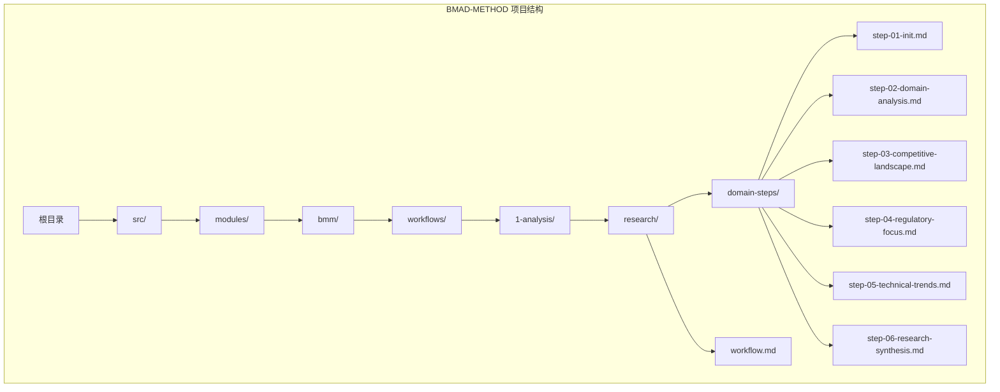
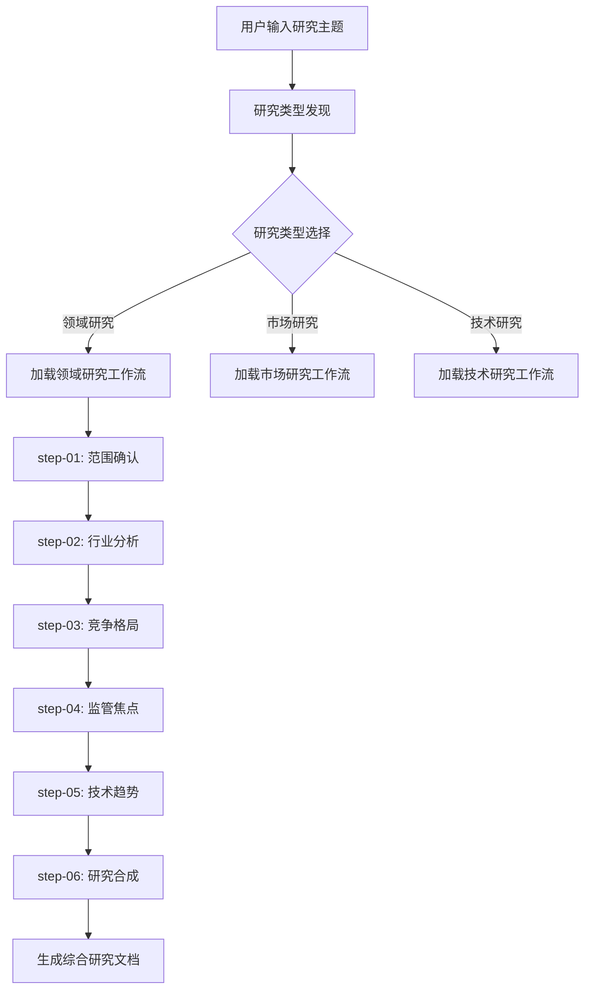
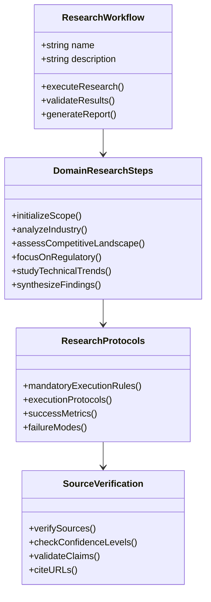
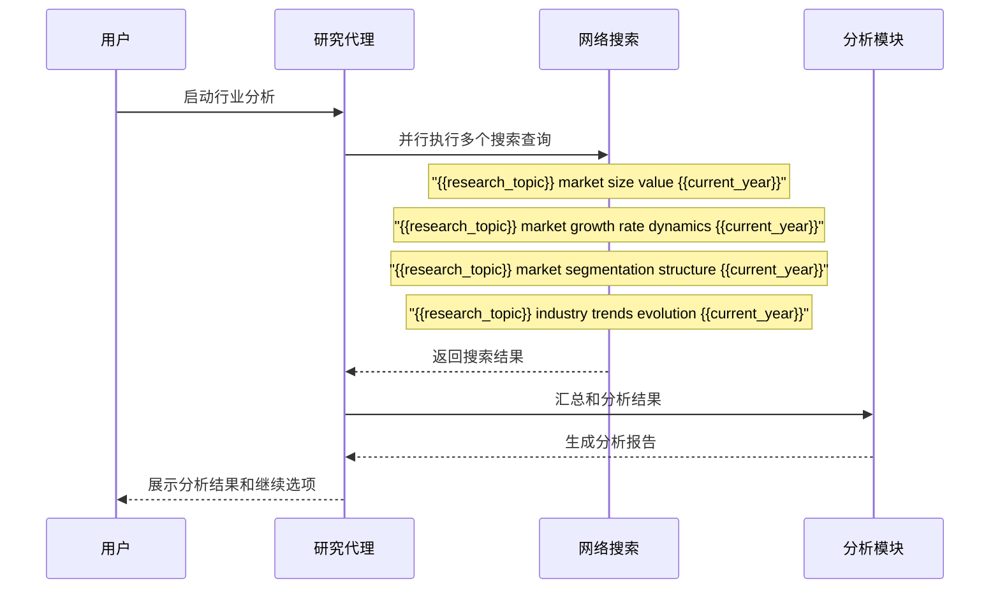
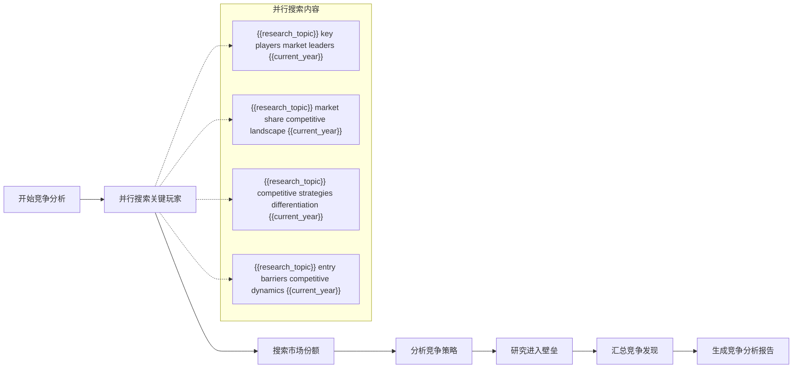
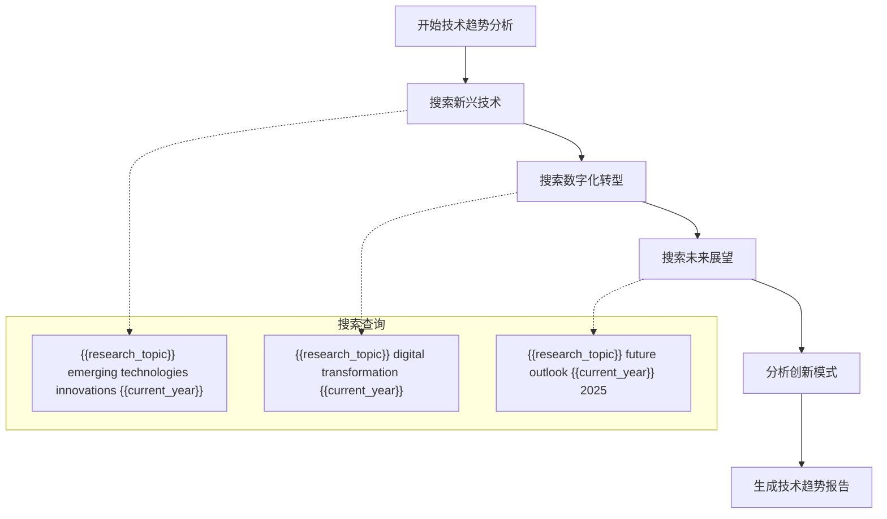

# 领域研究

<cite>
**本文档引用的文件**
- [workflow.md](file://src/modules/bmm/workflows/1-analysis/research/workflow.md)
- [step-01-init.md](file://src/modules/bmm/workflows/1-analysis/research/domain-steps/step-01-init.md)
- [step-02-domain-analysis.md](file://src/modules/bmm/workflows/1-analysis/research/domain-steps/step-02-domain-analysis.md)
- [step-03-competitive-landscape.md](file://src/modules/bmm/workflows/1-analysis/research/domain-steps/step-03-competitive-landscape.md)
- [step-04-regulatory-focus.md](file://src/modules/bmm/workflows/1-analysis/research/domain-steps/step-04-regulatory-focus.md)
- [step-05-technical-trends.md](file://src/modules/bmm/workflows/1-analysis/research/domain-steps/step-05-technical-trends.md)
- [step-06-research-synthesis.md](file://src/modules/bmm/workflows/1-analysis/research/domain-steps/step-06-research-synthesis.md)
- [README.md](file://README.md)
</cite>

## 目录
1. [引言](#引言)
2. [项目结构概述](#项目结构概述)
3. [核心组件分析](#核心组件分析)
4. [架构概览](#架构概览)
5. [详细组件分析](#详细组件分析)
6. [依赖关系分析](#依赖关系分析)
7. [性能考虑](#性能考虑)
8. [故障排除指南](#故障排除指南)
9. [结论](#结论)

## 引言

BMAD-METHOD（Build More, Architect Dreams）是一个基于人工智能的敏捷开发框架，专门设计用于通过系统化的方法评估项目所处的行业领域。该框架的核心在于其领域研究功能，这是一个经过精心设计的六步骤标准化流程，能够全面评估项目所在的行业环境，为产品决策提供战略依据。

领域研究是BMAD-METHOD分析阶段的核心组成部分，它通过六个标准化步骤（从初始化到研究合成）系统性地评估项目所处的行业领域。该研究路径不仅提供了对行业现状的深入理解，还识别了潜在的痛点和合规风险，为后续的产品规划和实施奠定了坚实的基础。

## 项目结构概述

BMAD-METHOD采用模块化架构设计，其中领域研究功能位于`src/modules/bmm/workflows/1-analysis/research/`目录下。该目录包含了完整的领域研究工作流程，包括初始化步骤、行业分析、竞争格局评估、监管重点分析、技术趋势研究和最终的研究合成。



**图表来源**
- [workflow.md](file://src/modules/bmm/workflows/1-analysis/research/workflow.md#L1-L199)
- [step-01-init.md](file://src/modules/bmm/workflows/1-analysis/research/domain-steps/step-01-init.md#L1-L137)

**章节来源**
- [workflow.md](file://src/modules/bmm/workflows/1-analysis/research/workflow.md#L1-L199)

## 核心组件分析

### 研究工作流架构

BMAD-METHOD的领域研究采用微文件架构和基于路由的发现机制。每个研究类型都有其独立的步骤文件夹，第01步负责发现研究类型并路由到适当的工作流子流程，然后按照研究类型内的顺序推进。



**图表来源**
- [workflow.md](file://src/modules/bmm/workflows/1-analysis/research/workflow.md#L135-L166)

### 研究行为标准

领域研究遵循严格的研究行为标准，确保高质量的研究输出：

- **当前数据优先**：始终使用{{current_year}}进行网络搜索
- **来源验证**：要求所有事实声明都有URL引用
- **反幻觉协议**：绝不呈现没有验证来源的信息
- **多源验证**：关键声明需要至少2个独立来源
- **冲突解决**：呈现相互矛盾的观点并注明差异
- **置信水平**：对不确定数据标记[高/中/低置信度]

**章节来源**
- [workflow.md](file://src/modules/bmm/workflows/1-analysis/research/workflow.md#L60-L95)

## 架构概览

### 微文件架构设计

BMAD-METHOD采用创新的微文件架构，每个工作流步骤都是独立的Markdown文件，包含明确的执行规则、协议和成功指标。这种设计使得工作流易于理解和维护，同时支持并行处理和灵活的路由机制。



**图表来源**
- [workflow.md](file://src/modules/bmm/workflows/1-analysis/research/workflow.md#L28-L50)
- [step-01-init.md](file://src/modules/bmm/workflows/1-analysis/research/domain-steps/step-01-init.md#L3-L20)

## 详细组件分析

### 步骤1：领域研究范围确认

领域研究的第一步专注于范围确认，这是整个研究过程中最关键的环节之一。该步骤确保研究目标明确，方法得当，为后续的深入分析奠定基础。

#### 执行规则和协议

该步骤严格遵循以下执行规则：
- ❌ 绝不生成未经用户确认的内容
- 📖 关键：在采取任何行动之前始终阅读完整的步骤文件
- ✅ 专注于确认领域研究范围和方法
- 💬 确认理解领域研究目标
- 🔍 仅进行范围确认 - 不进行实际研究

#### 范围确认内容

领域研究范围包括：
- **行业分析**：行业结构、市场动态和竞争格局
- **监管环境**：合规要求、法规和标准
- **技术模式**：创新趋势、技术采用和数字化转型
- **经济因素**：市场规模、增长趋势和经济影响
- **供应链**：价值链分析和生态系统关系

**章节来源**
- [step-01-init.md](file://src/modules/bmm/workflows/1-analysis/research/domain-steps/step-01-init.md#L31-L137)

### 步骤2：行业分析

行业分析是领域研究的核心部分，专注于市场大小、增长和行业动态。该步骤采用并行研究执行方法，同时进行多个网络搜索以获得全面的行业洞察。

#### 并行行业研究执行



**图表来源**
- [step-02-domain-analysis.md](file://src/modules/bmm/workflows/1-analysis/research/domain-steps/step-02-domain-analysis.md#L55-L89)

#### 行业分析内容结构

行业分析包含以下关键部分：
- **市场规模和估值**：当前市场估值、增长率、细分市场和经济影响
- **市场动态和增长**：增长驱动因素、增长障碍、周期性模式和市场成熟度
- **市场结构和细分**：主要细分市场、子细分分析、地理分布和垂直整合
- **行业趋势和演变**：新兴趋势、历史演变、技术整合和未来展望
- **竞争动态**：市场集中度、竞争强度、进入壁垒和创新压力

**章节来源**
- [step-02-domain-analysis.md](file://src/modules/bmm/workflows/1-analysis/research/domain-steps/step-02-domain-analysis.md#L36-L229)

### 步骤3：竞争格局分析

竞争格局分析专注于关键玩家、市场份额和竞争动态。该步骤采用并行研究方法，同时分析多个竞争维度以获得全面的竞争视角。

#### 竞争研究方法



**图表来源**
- [step-03-competitive-landscape.md](file://src/modules/bmm/workflows/1-analysis/research/domain-steps/step-03-competitive-landscape.md#L55-L71)

#### 竞争分析内容结构

竞争分析涵盖以下方面：
- **关键玩家和市场领导者**：主导玩家及其市场地位
- **市场份额和竞争定位**：当前市场份额分解和竞争定位
- **竞争策略和差异化**：成本领导策略、差异化策略、专注/利基策略
- **商业模式和价值主张**：主要商业模式、收入流、价值链整合
- **竞争动态和进入壁垒**：新进入者障碍、竞争强度、市场整合趋势

**章节来源**
- [step-03-competitive-landscape.md](file://src/modules/bmm/workflows/1-analysis/research/domain-steps/step-03-competitive-landscape.md#L36-L163)

### 步骤4：监管焦点分析

监管焦点分析专注于影响研究主题的特定法规和合规要求。该步骤涵盖适用的法规、行业标准、数据保护要求和实施考虑。

#### 监管研究重点

监管分析包括：
- **具体法规和合规框架**：适用于该领域的特定法规
- **行业标准和最佳实践**：技术标准、最佳实践和指南
- **许可和认证要求**：必要的许可证和认证
- **数据保护和隐私**：GDPR、CCPA和其他数据保护法律
- **环境和安全要求**：环境法规和安全标准

**章节来源**
- [step-04-regulatory-focus.md](file://src/modules/bmm/workflows/1-analysis/research/domain-steps/step-04-regulatory-focus.md#L36-L206)

### 步骤5：技术趋势分析

技术趋势分析专注于新兴技术和创新模式，重点关注影响研究主题的新技术发展和数字化转型趋势。

#### 技术研究方法



**图表来源**
- [step-05-technical-trends.md](file://src/modules/bmm/workflows/1-analysis/research/domain-steps/step-05-technical-trends.md#L53-L81)

**章节来源**
- [step-05-technical-trends.md](file://src/modules/bmm/workflows/1-analysis/research/domain-steps/step-05-technical-trends.md#L1-L132)

### 步骤6：研究合成

研究合成为整个领域研究过程的最终步骤，负责生成综合性、权威性的研究文档。该步骤整合所有先前收集的信息，提供战略洞见和行动建议。

#### 文档结构规划

研究合成采用专业的文档结构：
- **引言和方法论**：研究重要性和方法学描述
- **行业概述和市场动态**：市场分析和结构分析
- **技术景观和创新趋势**：技术趋势和数字化转型
- **监管框架和合规要求**：法规分析和风险评估
- **竞争格局和生态系统分析**：竞争分析和生态系统
- **战略洞见和领域机会**：跨领域整合和战略机会
- **实施考虑和风险评估**：实施框架和风险管理
- **未来展望和战略规划**：长期趋势和战略建议
- **研究方法论和来源验证**：质量保证和验证
- **附录和附加资源**：详细数据表和资源列表

**章节来源**
- [step-06-research-synthesis.md](file://src/modules/bmm/workflows/1-analysis/research/domain-steps/step-06-research-synthesis.md#L33-L444)

## 依赖关系分析

### 组件耦合和内聚性

领域研究工作流展示了良好的模块化设计，每个步骤都具有明确的责任边界和清晰的接口。步骤之间通过前言（frontmatter）状态进行协调，确保研究过程的连贯性。

```mermaid
graph LR
A[step-01: 范围确认] --> B[step-02: 行业分析]
B --> C[step-03: 竞争格局]
C --> D[step-04: 监管焦点]
D --> E[step-05: 技术趋势]
E --> F[step-06: 研究合成]
subgraph "状态管理"
G[stepsCompleted: [1]]
H[stepsCompleted: [1, 2]]
I[stepsCompleted: [1, 2, 3]]
J[stepsCompleted: [1, 2, 3, 4]]
K[stepsCompleted: [1, 2, 3, 4, 5]]
L[stepsCompleted: [1, 2, 3, 4, 5, 6]]
end
A -.-> G
B -.-> H
C -.-> I
D -.-> J
E -.-> K
F -.-> L
```

**图表来源**
- [step-01-init.md](file://src/modules/bmm/workflows/1-analysis/research/domain-steps/step-01-init.md#L18-L22)
- [step-02-domain-analysis.md](file://src/modules/bmm/workflows/1-analysis/research/domain-steps/step-02-domain-analysis.md#L18-L22)

### 外部依赖和集成点

领域研究依赖于外部网络搜索能力，确保使用最新的{{current_year}}数据。研究过程集成了多种数据源，包括市场研究报告、行业分析、公司网站和投资分析。

**章节来源**
- [workflow.md](file://src/modules/bmm/workflows/1-analysis/research/workflow.md#L40-L50)

## 性能考虑

### 研究效率优化

领域研究采用多种策略来提高研究效率：

- **并行处理**：同时执行多个网络搜索以加快信息收集
- **智能路由**：根据研究类型自动路由到相应的工作流
- **增量更新**：通过前言状态跟踪研究进度，支持断点续传
- **模板化输出**：使用预定义模板确保一致的文档结构

### 数据质量和验证

研究过程包含严格的质量控制措施：
- **多源验证**：关键声明需要至少2个独立来源
- **置信水平评估**：对不确定数据进行置信度标记
- **冲突解决**：呈现相互矛盾的观点并注明差异
- **来源追溯**：所有事实声明都有URL引用

## 故障排除指南

### 常见问题和解决方案

#### 部分理解导致的决策错误

**问题**：只阅读部分步骤文件就采取行动
**解决方案**：严格遵循"CRITICAL: ALWAYS read the complete step file"规则

**章节来源**
- [step-01-init.md](file://src/modules/bmm/workflows/1-analysis/research/domain-steps/step-01-init.md#L7-L8)

#### 缺少关键研究内容

**问题**：遗漏重要的研究领域
**解决方案**：确保涵盖所有五个研究领域：行业分析、竞争格局、监管焦点、技术趋势和生态系统分析

**章节来源**
- [step-01-init.md](file://src/modules/bmm/workflows/1-analysis/research/domain-steps/step-01-init.md#L42-L54)

#### 未使用当前年份数据

**问题**：在搜索中未使用{{current_year}}
**解决方案**：严格遵循"ALWAYS use {{current_year}} in web searches"规则

**章节来源**
- [step-02-domain-analysis.md](file://src/modules/bmm/workflows/1-analysis/research/domain-steps/step-02-domain-analysis.md#L9-L10)

## 结论

BMAD-METHOD的领域研究功能代表了AI驱动研究方法的重大进步。通过其六步骤标准化流程，该框架能够系统性地评估项目所处的行业领域，识别关键的市场动态、竞争格局、监管要求和技术趋势。

该研究路径的核心优势包括：

1. **系统性方法**：通过标准化步骤确保全面覆盖所有关键研究领域
2. **实时数据**：使用{{current_year}}的最新数据确保研究的相关性
3. **质量保证**：严格的来源验证和多源交叉检查确保研究质量
4. **战略价值**：提供深入的战略洞见，为产品决策提供有力支持
5. **可扩展性**：模块化设计支持不同项目类型的定制化研究深度

领域研究不仅为项目分析阶段提供了宝贵的洞察，还与市场研究和技术研究形成了有效的互补。通过这种综合性的研究方法，BMAD-METHOD能够为复杂项目的成功实施奠定坚实的基础。

该框架的设计体现了现代AI辅助研究的最佳实践，将自动化搜索能力与专业知识相结合，为用户提供既高效又准确的研究体验。随着AI技术的不断发展，这种系统化的研究方法将在未来的项目管理和产品开发中发挥越来越重要的作用。