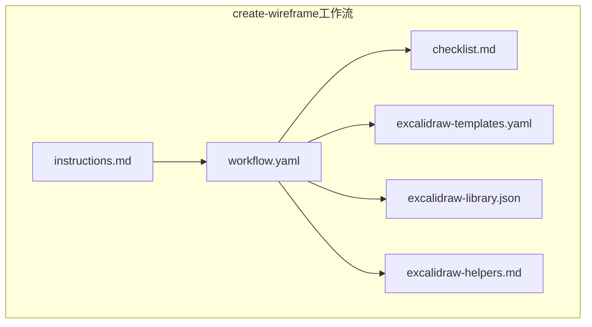
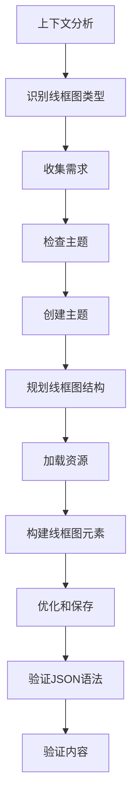
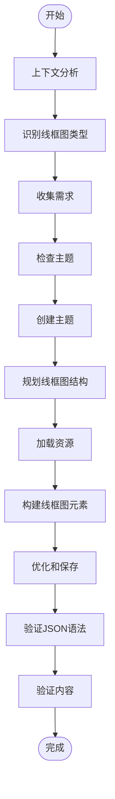
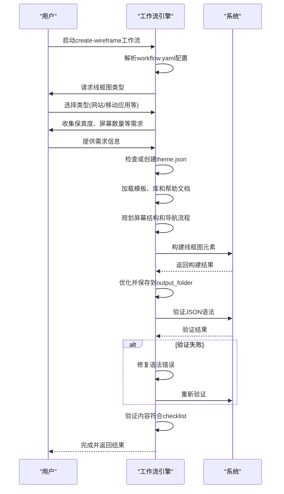
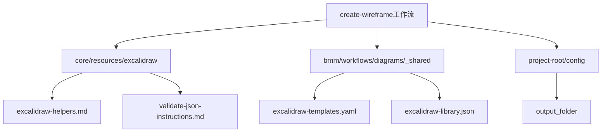

# UI设计

<cite>
**本文档中引用的文件**  
- [instructions.md](file://src/modules/bmm/workflows/diagrams/create-wireframe/instructions.md)
- [workflow.yaml](file://src/modules/bmm/workflows/diagrams/create-wireframe/workflow.yaml)
- [checklist.md](file://src/modules/bmm/workflows/diagrams/create-wireframe/checklist.md)
- [excalidraw-templates.yaml](file://src/modules/bmm/workflows/diagrams/_shared/excalidraw-templates.yaml)
- [excalidraw-library.json](file://src/modules/bmm/workflows/diagrams/_shared/excalidraw-library.json)
- [excalidraw-helpers.md](file://src/core/resources/excalidraw/excalidraw-helpers.md)
- [step-13-responsive-accessibility.md](file://src/modules/bmm/workflows/2-plan-workflows/create-ux-design/steps/step-13-responsive-accessibility.md)
</cite>

## 目录
1. [介绍](#介绍)
2. [项目结构](#项目结构)
3. [核心组件](#核心组件)
4. [架构概述](#架构概述)
5. [详细组件分析](#详细组件分析)
6. [依赖分析](#依赖分析)
7. [性能考虑](#性能考虑)
8. [故障排除指南](#故障排除指南)
9. [结论](#结论)

## 介绍
本文档详细介绍了BMAD-METHOD框架中的UI设计工作流，重点是`create-wireframe`工作流。该工作流指导用户从需求分析到最终线框图输出的完整流程，使用Excalidraw格式创建网站或应用程序的线框图。文档深入解释了checklist.md中的验证步骤、instructions.md中的操作指南以及workflow.yaml中的执行逻辑。通过实际使用场景示例，展示了如何利用此工作流快速生成响应式界面设计，并阐述了与其他设计工作流的集成方式以及如何确保设计符合可访问性标准。

## 项目结构
`create-wireframe`工作流位于`src/modules/bmm/workflows/diagrams/create-wireframe/`目录下，其结构遵循微文件架构原则，每个步骤都是一个独立的文件，包含嵌入式规则。工作流使用YAML配置文件定义路径、资源和输出设置，并通过XML指令文件控制执行流程。

**图源**  
- [workflow.yaml](file://src/modules/bmm/workflows/diagrams/create-wireframe/workflow.yaml)
- [instructions.md](file://src/modules/bmm/workflows/diagrams/create-wireframe/instructions.md)

**本节来源**  
- [workflow.yaml](file://src/modules/bmm/workflows/diagrams/create-wireframe/workflow.yaml)

## 核心组件
`create-wireframe`工作流的核心组件包括：instructions.md文件，它包含了XML格式的详细操作指令；workflow.yaml文件，它定义了工作流的配置、路径和资源；checklist.md文件，它提供了线框图创建的验证清单；以及共享的Excalidraw资源文件，包括模板、库和帮助文档。

**本节来源**  
- [instructions.md](file://src/modules/bmm/workflows/diagrams/create-wireframe/instructions.md)
- [workflow.yaml](file://src/modules/bmm/workflows/diagrams/create-wireframe/workflow.yaml)
- [checklist.md](file://src/modules/bmm/workflows/diagrams/create-wireframe/checklist.md)

## 架构概述
`create-wireframe`工作流采用分步式架构，从上下文分析开始，经过线框图类型识别、需求收集、主题创建、结构规划、资源加载、元素构建、优化保存、JSON语法验证到内容验证的完整流程。工作流通过XML指令文件中的`<step>`和`<substep>`标签定义执行顺序，并使用`{variables}`进行动态路径解析。

**图源**  
- [instructions.md](file://src/modules/bmm/workflows/diagrams/create-wireframe/instructions.md#L10-L132)

## 详细组件分析
### create-wireframe工作流分析
`create-wireframe`工作流通过一系列有序步骤指导用户创建用户界面原型。工作流首先进行上下文分析，提取线框图类型、保真度级别、屏幕数量、设备类型和保存位置等关键信息。然后通过交互式提问收集用户需求，创建或使用现有的主题文件，并规划线框图的整体结构。

#### 操作指南分析

**图源**  
- [instructions.md](file://src/modules/bmm/workflows/diagrams/create-wireframe/instructions.md)

#### 验证清单分析

```mermaid
flowchart TD
Layout["布局结构"] --> Grid["网格对齐(20px)"]
Layout --> Spacing["一致的元素间距"]
Layout --> Hierarchy["正确的层次结构"]
UI["UI元素"] --> Interactive["交互元素清晰标记"]
UI --> Sizing["按钮、输入框适当大小"]
UI --> Readability["文本标签可读"]
Fidelity["保真度"] --> Level["匹配请求的保真度级别"]
Fidelity --> Detail["适当的细节水平"]
Fidelity --> Placeholder["使用占位符内容"]
Annotations["注释"] --> Interactions["关键交互注释"]
Annotations --> Flow["多屏流程指示器"]
Annotations --> Notes["重要说明"]
Technical["技术质量"] --> Grouping["元素正确分组"]
Technical --> GridSnap["对齐到网格"]
Technical --> ValidJSON["JSON有效"]
Technical --> CorrectLocation["保存到正确位置"]
```

**图源**  
- [checklist.md](file://src/modules/bmm/workflows/diagrams/create-wireframe/checklist.md)

#### 执行逻辑分析

**图源**  
- [workflow.yaml](file://src/modules/bmm/workflows/diagrams/create-wireframe/workflow.yaml)
- [instructions.md](file://src/modules/bmm/workflows/diagrams/create-wireframe/instructions.md)

**本节来源**  
- [instructions.md](file://src/modules/bmm/workflows/diagrams/create-wireframe/instructions.md)
- [workflow.yaml](file://src/modules/bmm/workflows/diagrams/create-wireframe/workflow.yaml)
- [checklist.md](file://src/modules/bmm/workflows/diagrams/create-wireframe/checklist.md)

### 实际使用场景
`create-wireframe`工作流可用于快速生成响应式界面设计。例如，当需要为一个新移动应用创建原型时，工作流会引导用户选择"移动应用(iOS/Android)"类型，设置高保真度，指定5个屏幕，并选择"经典线框图"样式。工作流将自动加载适当的模板和库，构建包含导航、内容区域和交互元素的线框图，并确保所有元素对齐到20px网格，符合可访问性标准。

**本节来源**  
- [instructions.md](file://src/modules/bmm/workflows/diagrams/create-wireframe/instructions.md)
- [excalidraw-templates.yaml](file://src/modules/bmm/workflows/diagrams/_shared/excalidraw-templates.yaml)

## 依赖分析
`create-wireframe`工作流依赖于多个核心资源和配置文件。它通过workflow.yaml文件中的变量引用加载核心Excalidraw资源，包括帮助文档、JSON验证指令、模板和库文件。工作流还依赖于项目根目录下的配置文件来确定输出文件夹等路径。

**图源**  
- [workflow.yaml](file://src/modules/bmm/workflows/diagrams/create-wireframe/workflow.yaml)

**本节来源**  
- [workflow.yaml](file://src/modules/bmm/workflows/diagrams/create-wireframe/workflow.yaml)

## 性能考虑
`create-wireframe`工作流的设计考虑了执行效率和资源优化。通过预定义的模板和库文件，减少了重复创建基本元素的时间。工作流在最后阶段会自动剥离未使用的元素和标记为`isDeleted: true`的元素，以优化输出文件大小。JSON语法验证步骤确保了生成文件的正确性，避免了因语法错误导致的后续处理失败。

## 故障排除指南
当使用`create-wireframe`工作流时，可能会遇到一些常见问题。如果JSON验证失败，应仔细阅读错误信息，定位语法错误的位置，并修复缺失的逗号、括号或引号。对于设计元素对齐问题，应确保所有元素都对齐到20px网格。组件复用问题可以通过使用Excalidraw库中的预定义组件来解决。跨设备适配问题可以通过在响应式设计策略中明确定义断点和布局变化来处理。

**本节来源**  
- [instructions.md](file://src/modules/bmm/workflows/diagrams/create-wireframe/instructions.md#L114-L124)
- [step-13-responsive-accessibility.md](file://src/modules/bmm/workflows/2-plan-workflows/create-ux-design/steps/step-13-responsive-accessibility.md)

## 结论
`create-wireframe`工作流提供了一个系统化的方法来创建用户界面原型，从需求分析到最终输出的完整流程。通过结合操作指南、验证清单和执行逻辑，该工作流确保了线框图的质量和一致性。与其他设计工作流的集成能力，如响应式设计和可访问性工作流，使得它成为一个强大的UI设计工具。遵循本文档中的指导，用户可以高效地生成符合标准的界面设计原型。