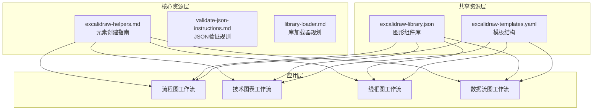
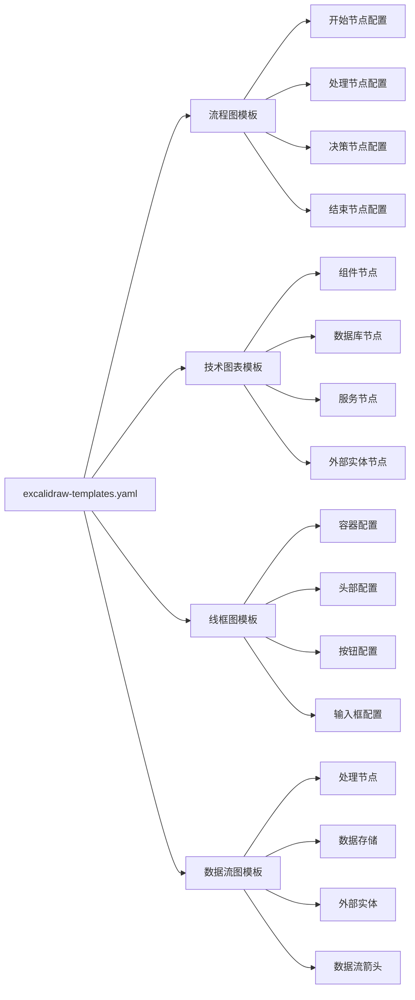
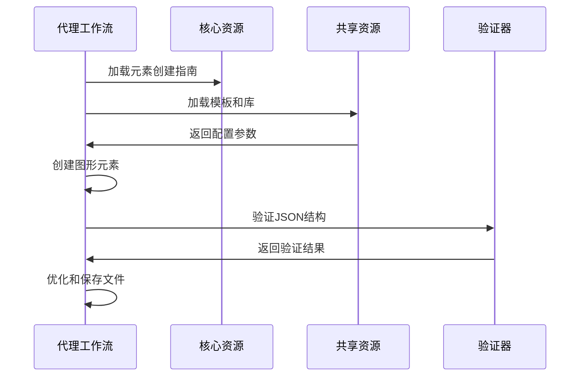
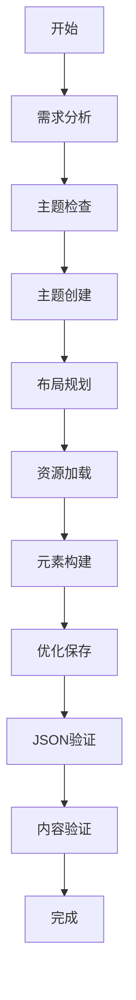
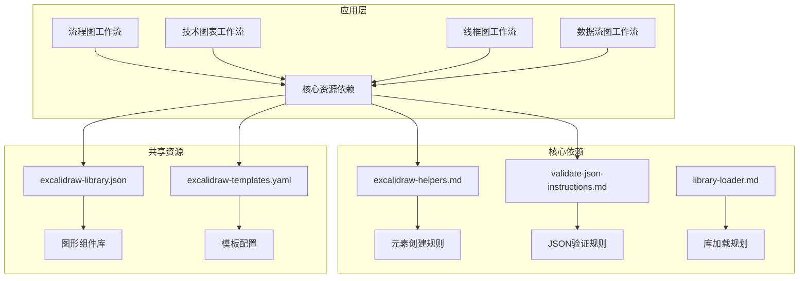
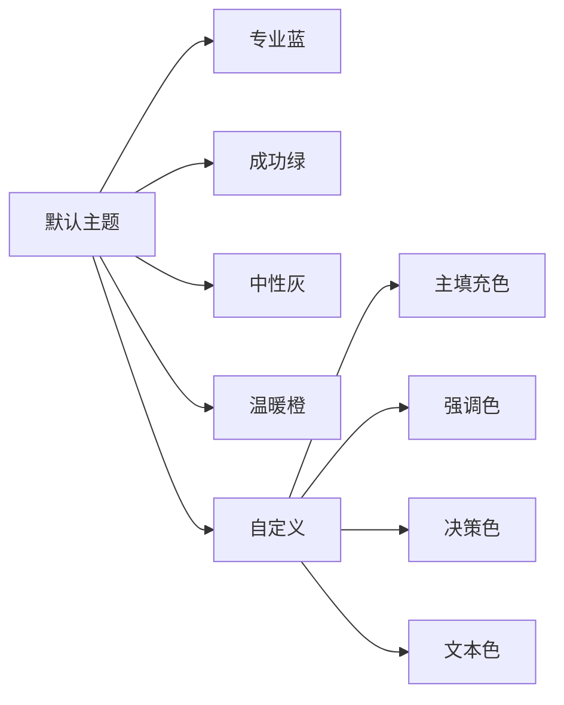

# 共享资源

<cite>
**本文档中引用的文件**
- [excalidraw-library.json](file://src/modules/bmm/workflows/diagrams/_shared/excalidraw-library.json)
- [excalidraw-templates.yaml](file://src/modules/bmm/workflows/diagrams/_shared/excalidraw-templates.yaml)
- [workflow-method-greenfield.excalidraw](file://src/modules/bmm/docs/images/workflow-method-greenfield.excalidraw)
- [excalidraw-helpers.md](file://src/core/resources/excalidraw/excalidraw-helpers.md)
- [library-loader.md](file://src/core/resources/excalidraw/library-loader.md)
- [README.md](file://src/core/resources/excalidraw/README.md)
- [create-flowchart/workflow.yaml](file://src/modules/bmm/workflows/diagrams/create-flowchart/workflow.yaml)
- [create-diagram/workflow.yaml](file://src/modules/bmm/workflows/diagrams/create-diagram/workflow.yaml)
- [create-wireframe/workflow.yaml](file://src/modules/bmm/workflows/diagrams/create-wireframe/workflow.yaml)
- [create-dataflow/workflow.yaml](file://src/modules/bmm/workflows/diagrams/create-dataflow/workflow.yaml)
</cite>

## 目录
1. [简介](#简介)
2. [项目结构概览](#项目结构概览)
3. [核心共享资源](#核心共享资源)
4. [架构概述](#架构概述)
5. [详细组件分析](#详细组件分析)
6. [依赖关系分析](#依赖关系分析)
7. [性能考虑](#性能考虑)
8. [故障排除指南](#故障排除指南)
9. [结论](#结论)

## 简介

BMAD方法的共享设计资源系统是一个精心设计的架构，旨在为跨项目的设计一致性提供统一的图形组件库。该系统通过 `_shared` 目录下的核心资源文件，确保所有设计元素的一致性和可重用性，同时支持灵活的扩展和自定义。

共享资源系统的核心价值在于：
- **统一的设计语言**：确保跨项目的设计一致性
- **模块化架构**：支持灵活的扩展和自定义
- **版本管理策略**：保证设计资源的演进稳定性
- **最佳实践集成**：提供经过验证的设计模式

## 项目结构概览

共享设计资源系统采用分层架构，将通用知识与领域特定内容分离：



**图表来源**
- [excalidraw-helpers.md](file://src/core/resources/excalidraw/excalidraw-helpers.md#L1-L128)
- [excalidraw-library.json](file://src/modules/bmm/workflows/diagrams/_shared/excalidraw-library.json#L1-L91)
- [excalidraw-templates.yaml](file://src/modules/bmm/workflows/diagrams/_shared/excalidraw-templates.yaml#L1-L128)

**章节来源**
- [README.md](file://src/core/resources/excalidraw/README.md#L1-L161)

## 核心共享资源

### Excalidraw图形组件库 (excalidraw-library.json)

excalidraw-library.json 是整个共享资源系统的核心，定义了统一的图形组件库，包含标准化的形状、颜色和样式规范。

#### 组件库结构

| 组件类型 | 形状 | 尺寸 | 颜色方案 | 用途 |
|---------|------|------|----------|------|
| 开始/结束节点 | 椭圆 | 120×60 | 蓝色背景 (#e3f2fd) | 流程图起点和终点 |
| 处理节点 | 矩形 | 160×80 | 蓝色背景 (#e3f2fd) | 标准处理步骤 |
| 决策节点 | 菱形 | 140×100 | 橙色背景 (#fff3e0) | 条件判断点 |
| 数据存储 | 矩形 | 140×80 | 绿色背景 (#e8f5e9) | 数据持久化 |
| 外部实体 | 矩形 | 120×80 | 紫色背景 (#f3e5f5) | 系统边界 |

#### 设计原则

1. **一致性原则**：所有组件使用相同的颜色编码系统
2. **可读性优先**：确保文本标签清晰可见
3. **比例协调**：组件尺寸遵循视觉平衡原则
4. **语义明确**：颜色和形状反映其功能含义

**章节来源**
- [excalidraw-library.json](file://src/modules/bmm/workflows/diagrams/_shared/excalidraw-library.json#L1-L91)

### Excalidraw模板系统 (excalidraw-templates.yaml)

excalidraw-templates.yaml 提供了结构化的模板框架，支持多种类型的图表创建。

#### 模板分类



**图表来源**
- [excalidraw-templates.yaml](file://src/modules/bmm/workflows/diagrams/_shared/excalidraw-templates.yaml#L1-L128)

#### 布局参数

每个模板都包含详细的布局参数：

| 参数类别 | 描述 | 默认值 | 适用场景 |
|---------|------|--------|----------|
| 视口设置 | 初始显示范围 | x:0, y:0, zoom:1 | 标准视图 |
| 网格系统 | 对齐基准 | size:20px | 精确对齐 |
| 垂直间距 | 元素间垂直距离 | 100px-120px | 流程图布局 |
| 水平间距 | 元素间水平距离 | 180px-200px | 水平排列 |

**章节来源**
- [excalidraw-templates.yaml](file://src/modules/bmm/workflows/diagrams/_shared/excalidraw-templates.yaml#L1-L128)

## 架构概述

共享设计资源系统采用分层架构，确保通用知识与领域特定内容的有效分离。



**图表来源**
- [create-flowchart/workflow.yaml](file://src/modules/bmm/workflows/diagrams/create-flowchart/workflow.yaml#L1-L27)
- [excalidraw-helpers.md](file://src/core/resources/excalidraw/excalidraw-helpers.md#L1-L128)

### 架构原则

1. **单一职责原则**：核心资源负责通用知识，代理负责领域特定逻辑
2. **依赖倒置原则**：高层模块不依赖低层模块的具体实现
3. **开闭原则**：对扩展开放，对修改封闭
4. **接口隔离原则**：提供最小化的接口契约

**章节来源**
- [README.md](file://src/core/resources/excalidraw/README.md#L120-L161)

## 详细组件分析

### 元素创建指南 (excalidraw-helpers.md)

excalidraw-helpers.md 定义了完整的元素创建标准，是所有图形创建工作的基础指南。

#### 文本宽度计算

```mermaid
flowchart TD
A[输入文本] --> B[计算字符长度]
B --> C[乘以字体大小]
C --> D[乘以0.6系数]
D --> E[加20像素边距]
E --> F[四舍五入到最近10]
F --> G[输出文本宽度]
H[网格对齐] --> I[Math.round(value/20)*20]
I --> J[确保20px网格对齐]
```

**图表来源**
- [excalidraw-helpers.md](file://src/core/resources/excalidraw/excalidraw-helpers.md#L3-L13)

#### 元素分组规则

元素创建必须遵循严格的分组规则：

1. **唯一ID生成**：为形状、文本和组分别生成唯一标识符
2. **容器关联**：文本元素必须有正确的容器ID指向父形状
3. **绑定更新**：连接形状时必须更新 `boundElements` 数组
4. **组ID同步**：所有相关元素必须使用相同的组ID

#### 箭头创建模式

系统支持两种箭头类型：

**直线箭头**（用于正向流程）：
- 适用于从左到右或从上到下的简单连接
- 使用两点坐标定义路径
- 自动计算绑定间隙

**肘形箭头**（用于复杂路由）：
- 适用于向上、向后或复杂路径的连接
- 支持中间点定义复杂的折线路径
- 可以处理多个转向点

**章节来源**
- [excalidraw-helpers.md](file://src/core/resources/excalidraw/excalidraw-helpers.md#L1-L128)

### 工作流集成分析

不同类型的图表创建工作流展示了共享资源的实际应用。

#### 流程图创建工作流



**图表来源**
- [create-flowchart/workflow.yaml](file://src/modules/bmm/workflows/diagrams/create-flowchart/workflow.yaml#L1-L27)

#### 技术图表创建工作流

技术图表工作流更加复杂，涉及多种组件类型：

1. **图表类型识别**：系统架构、ERD、UML等
2. **组件映射**：实体、属性、关系的识别
3. **符号标准**：选择标准、简化或严格UML-ERD格式
4. **布局算法**：自动定位和连接组件

**章节来源**
- [create-diagram/workflow.yaml](file://src/modules/bmm/workflows/diagrams/create-diagram/workflow.yaml#L1-L27)

### workflow-method-greenfield.excalidraw 示例分析

workflow-method-greenfield.excalidraw 是一个重要的参考文件，展示了最佳实践的设计模式。

#### 设计模式特点

1. **层次化结构**：清晰的阶段划分和子阶段组织
2. **颜色编码系统**：使用蓝色表示启动阶段，绿色表示执行阶段
3. **文本标签优化**：合理的文本换行和对齐方式
4. **箭头连接规范**：一致的箭头样式和连接点处理

#### 最佳实践体现

- **一致性**：所有相同类型的元素使用相同的样式
- **可读性**：适当的间距和对比度确保信息清晰传达
- **扩展性**：预留空间支持未来添加新的阶段或步骤
- **维护性**：清晰的分组结构便于后续修改

**章节来源**
- [workflow-method-greenfield.excalidraw](file://src/modules/bmm/docs/images/workflow-method-greenfield.excalidraw#L1-L800)

## 依赖关系分析

共享资源系统的依赖关系体现了良好的软件架构设计。



**图表来源**
- [create-flowchart/workflow.yaml](file://src/modules/bmm/workflows/diagrams/create-flowchart/workflow.yaml#L16-L21)
- [create-diagram/workflow.yaml](file://src/modules/bmm/workflows/diagrams/create-diagram/workflow.yaml#L16-L21)

### 版本管理策略

为了确保设计资源的演进不会破坏现有工作流，系统采用了以下版本管理策略：

1. **向后兼容性**：新版本必须保持与旧版本的兼容性
2. **渐进式更新**：通过特性标志控制新功能的启用
3. **迁移路径**：提供从旧版本到新版本的平滑迁移方案
4. **回滚机制**：支持快速回滚到稳定版本

### 扩展和自定义机制

系统提供了多种扩展和自定义选项：

#### 主题系统



#### 模板定制

用户可以通过修改 `excalidraw-templates.yaml` 文件来自定义模板：

- **尺寸调整**：根据具体需求调整元素尺寸
- **间距优化**：调整垂直和水平间距参数
- **颜色方案**：替换默认的颜色配置
- **新增元素**：添加新的预定义元素类型

**章节来源**
- [excalidraw-templates.yaml](file://src/modules/bmm/workflows/diagrams/_shared/excalidraw-templates.yaml#L1-L128)

## 性能考虑

共享设计资源系统在设计时充分考虑了性能优化：

### 资源加载优化

1. **按需加载**：只加载当前工作流所需的资源
2. **缓存机制**：重复使用的资源会被缓存以提高访问速度
3. **压缩传输**：资源文件经过压缩以减少网络传输时间

### 渲染性能

1. **批量操作**：将多个元素操作合并为单次批量处理
2. **增量更新**：只重新渲染发生变化的部分
3. **内存管理**：及时释放不再需要的资源引用

### 文件大小优化

1. **精简结构**：移除不必要的元数据和历史记录
2. **压缩算法**：使用高效的JSON压缩算法
3. **冗余消除**：删除重复的配置项和未使用的元素

## 故障排除指南

### 常见问题及解决方案

#### JSON验证失败

**症状**：生成的Excalidraw文件无法正常打开
**原因**：JSON语法错误或结构不完整
**解决方案**：
1. 检查所有引号是否正确配对
2. 确保数组和对象的括号匹配
3. 验证所有必需字段的存在
4. 使用内置的JSON验证工具进行调试

#### 元素对齐问题

**症状**：图形元素没有正确对齐
**原因**：网格对齐规则未正确应用
**解决方案**：
1. 确保所有坐标值都是20的倍数
2. 检查间距参数设置
3. 验证元素间的相对位置计算

#### 主题应用异常

**症状**：颜色方案没有正确应用
**原因**：主题配置错误或颜色值无效
**解决方案**：
1. 验证颜色值是否为有效的十六进制格式
2. 检查主题配置文件的语法
3. 确认元素类型与主题映射关系

**章节来源**
- [excalidraw-helpers.md](file://src/core/resources/excalidraw/excalidraw-helpers.md#L104-L128)

### 调试技巧

1. **逐步验证**：每次修改后立即验证结果
2. **日志记录**：启用详细的调试日志
3. **单元测试**：为关键功能编写自动化测试
4. **可视化检查**：使用Excalidraw编辑器预览效果

## 结论

BMAD方法的共享设计资源系统代表了一个成熟的设计工具架构，它成功地平衡了标准化和灵活性的需求。通过 `_shared` 目录下的核心资源文件，系统实现了：

### 核心优势

1. **设计一致性**：统一的图形组件库确保跨项目的设计语言一致性
2. **开发效率**：标准化的工作流程减少了重复劳动
3. **质量保证**：严格的验证规则确保生成文件的质量
4. **可维护性**：清晰的架构分层便于长期维护

### 未来发展

系统规划了多个重要发展方向：

1. **外部库加载器**：支持从社区库加载额外的图形组件
2. **主题管理系统**：提供更灵活的用户自定义主题功能
3. **组件库增强**：建立更丰富的可重用组件集合
4. **智能布局算法**：提供自动化的元素定位和连接功能

### 最佳实践建议

对于希望使用或扩展这套共享资源的开发者，建议：

1. **深入理解架构原则**：掌握分层架构的设计理念
2. **遵循命名约定**：使用一致的文件和变量命名
3. **保持向后兼容**：在升级时注意兼容性问题
4. **积极参与社区**：贡献改进和反馈以促进系统发展

这套共享设计资源系统不仅是一个技术工具，更是BMAD方法论在设计领域的具体体现，为团队协作和项目交付提供了坚实的基础。