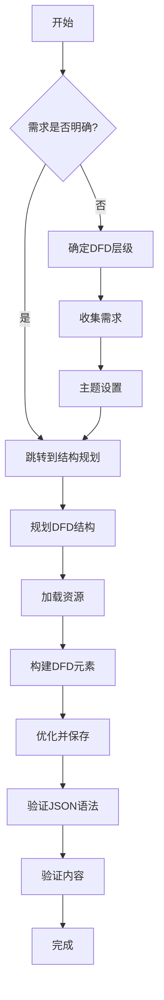
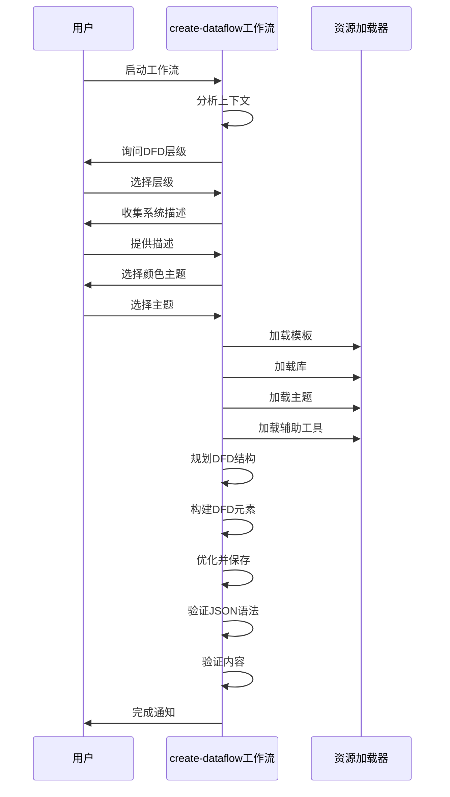
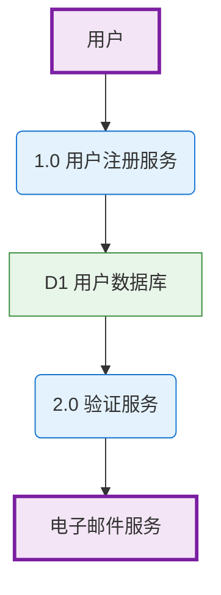

# 数据流图设计

<cite>
**本文档引用的文件**  
- [checklist.md](file://src/modules/bmm/workflows/diagrams/create-dataflow/checklist.md)
- [instructions.md](file://src/modules/bmm/workflows/diagrams/create-dataflow/instructions.md)
- [workflow.yaml](file://src/modules/bmm/workflows/diagrams/create-dataflow/workflow.yaml)
- [excalidraw-templates.yaml](file://src/modules/bmm/workflows/diagrams/_shared/excalidraw-templates.yaml)
- [excalidraw-library.json](file://src/modules/bmm/workflows/diagrams/_shared/excalidraw-library.json)
- [excalidraw-helpers.md](file://src/core/resources/excalidraw/excalidraw-helpers.md)
</cite>

## 目录
1. [引言](#引言)
2. [数据流图工作流概述](#数据流图工作流概述)
3. [质量检查标准分析](#质量检查标准分析)
4. [最佳实践指南](#最佳实践指南)
5. [执行步骤解析](#执行步骤解析)
6. [实际应用案例](#实际应用案例)
7. [工具价值讨论](#工具价值讨论)
8. [结论](#结论)

## 引言
数据流图（Data Flow Diagram, DFD）是系统分析和设计中的重要可视化工具，用于展示系统中数据的流动路径。本文档深入探讨create-dataflow工作流的设计与实现，该工作流能够帮助用户创建符合标准的DFD图，支持从上下文图（Level 0）到详细子流程（Level 2）的多种抽象层次。通过集成Excalidraw格式，该工作流提供了高质量的可视化输出，同时确保了技术准确性和用户体验。

## 数据流图工作流概述
create-dataflow工作流是一个专门用于创建数据流图的自动化流程，它遵循标准的DFD符号规范，并通过一系列有序步骤引导用户完成图表的创建。该工作流位于`src/modules/bmm/workflows/diagrams/create-dataflow/`目录下，由`workflow.yaml`文件定义其配置和行为。

**Diagram sources**
- [workflow.yaml](file://src/modules/bmm/workflows/diagrams/create-dataflow/workflow.yaml)

**Section sources**
- [workflow.yaml](file://src/modules/bmm/workflows/diagrams/create-dataflow/workflow.yaml)

## 质量检查标准分析
checklist.md文件定义了创建数据流图时必须满足的质量检查标准，这些标准分为四个主要类别：DFD符号、结构、完整性和技术质量。

### DFD符号标准
该工作流严格遵循标准的DFD符号规范：
- **处理过程**：使用圆形或椭圆形表示，编号为1.0、2.0等
- **数据存储**：使用平行线或矩形表示，命名为D1、D2等
- **外部实体**：使用矩形表示，具有粗边框
- **数据流**：使用带标签的箭头表示，显示数据名称和方向

### 结构标准
结构完整性是确保DFD有效性的关键：
- 所有处理过程必须正确编号
- 所有数据流必须用数据名称标记
- 所有数据存储必须适当命名
- 外部实体必须清晰标识
- 确保没有孤立的处理过程（未连接的）

### 完整性标准
完整性检查确保DFD的逻辑一致性：
- 所有输入和输出都已考虑在内
- 维持数据守恒原则
- 选择适当的层级（上下文图/Level 0/Level 1）
- 避免外部实体之间的直接数据流
- 避免数据存储之间的直接数据流

### 技术质量标准
技术质量确保输出文件的可用性：
- 所有元素正确分组
- 箭头有适当的绑定
- 文本可读且大小合适
- 没有标记为`isDeleted: true`的元素
- JSON格式有效
- 文件保存到正确位置

**Section sources**
- [checklist.md](file://src/modules/bmm/workflows/diagrams/create-dataflow/checklist.md)

## 最佳实践指南
instructions.md文件提供了创建数据流图的最佳实践，指导用户如何识别关键数据节点和标注数据转换规则。

### 识别关键数据节点
工作流通过以下步骤帮助用户识别关键数据节点：
1. **上下文分析**：首先审查用户请求，提取DFD层级、处理过程、数据存储和外部实体
2. **需求收集**：主动询问系统中的处理过程、数据存储和外部实体
3. **结构规划**：列出所有处理过程（带编号）、数据存储（D1、D2等）和外部实体
4. **映射数据流**：明确所有数据流及其标签

### 标注数据转换规则
在创建DFD时，应遵循以下标注规则：
- **处理过程**：使用动词短语（如"处理订单"、"验证用户"）
- **数据存储**：使用名词短语（如"客户数据库"、"订单记录"）
- **外部实体**：使用名词短语（如"客户"、"支付网关"）
- **数据流**：使用具体的数据名称（如"订单信息"、"支付详情"）

### 布局最佳实践
合理的布局对于DFD的可读性至关重要：
- 外部实体放置在边缘
- 处理过程集中在中心
- 数据存储位于处理过程之间
- 尽量减少交叉的数据流
- 采用从左到右或从上到下的流动方向

**Section sources**
- [instructions.md](file://src/modules/bmm/workflows/diagrams/create-dataflow/instructions.md)

## 执行步骤解析
workflow.yaml文件定义了create-dataflow工作流的执行步骤，这些步骤按照逻辑顺序组织，确保用户能够系统地完成DFD的创建。

### 初始化阶段
工作流首先加载必要的配置和资源：
- 从`bmm/config.yaml`加载配置源
- 设置输出文件夹路径
- 定义工作流的安装路径和共享资源路径

### 资源加载
工作流依赖于多个核心资源：
- **模板**：从`excalidraw-templates.yaml`加载`dataflow`部分
- **库**：加载`excalidraw-library.json`中的预定义元素
- **主题**：加载用户选择的颜色主题
- **辅助工具**：加载`excalidraw-helpers.md`中的标准DFD符号规范

**Diagram sources**
- [workflow.yaml](file://src/modules/bmm/workflows/diagrams/create-dataflow/workflow.yaml)
- [instructions.md](file://src/modules/bmm/workflows/diagrams/create-dataflow/instructions.md)

**Section sources**
- [workflow.yaml](file://src/modules/bmm/workflows/diagrams/create-dataflow/workflow.yaml)
- [instructions.md](file://src/modules/bmm/workflows/diagrams/create-dataflow/instructions.md)

## 实际应用案例
### 微服务架构中的用户数据流追踪
在微服务架构中，create-dataflow工作流可以帮助追踪用户数据在整个系统中的流动路径。例如，当用户注册时，数据流可能包括：
1. **外部实体**：用户
2. **处理过程**：1.0 用户注册服务
3. **数据存储**：D1 用户数据库
4. **处理过程**：2.0 验证服务
5. **外部实体**：电子邮件服务

通过创建Level 1 DFD，团队可以清晰地看到数据如何在不同微服务之间流动，识别潜在的瓶颈和安全风险。

### 数据管道中的瓶颈识别
在复杂的数据管道中，create-dataflow工作流可以帮助识别性能瓶颈。通过创建Level 2 DFD，可以详细展示每个子过程：
- 数据提取
- 数据清洗
- 数据转换
- 数据加载

每个处理过程的详细分解有助于识别耗时最长的环节，从而进行针对性优化。

**Diagram sources**
- [excalidraw-templates.yaml](file://src/modules/bmm/workflows/diagrams/_shared/excalidraw-templates.yaml)
- [excalidraw-library.json](file://src/modules/bmm/workflows/diagrams/_shared/excalidraw-library.json)

## 工具价值讨论
create-dataflow工作流在技术评审、系统优化和团队协作中具有重要价值。

### 技术评审
在技术评审过程中，DFD图提供了系统架构的直观视图，帮助评审人员快速理解数据流动和处理逻辑。标准化的符号和布局确保了评审的一致性和准确性。

### 系统优化
通过可视化数据流，团队可以更容易地识别冗余处理、不必要的数据转换和潜在的性能瓶颈。这为系统优化提供了明确的方向和依据。

### 团队协作
DFD图作为一种通用语言，促进了开发、测试、运维和业务团队之间的沟通。它消除了术语差异，确保所有团队成员对系统有相同的理解。

### 自动化优势
与手动创建DFD相比，create-dataflow工作流提供了以下优势：
- **一致性**：确保所有DFD遵循相同的标准和规范
- **效率**：自动化大部分创建过程，节省大量时间
- **准确性**：内置验证机制确保输出的技术正确性
- **可维护性**：易于更新和修改，适应系统变化

## 结论
create-dataflow工作流是一个强大而实用的工具，它通过标准化的流程和自动化机制，帮助用户创建高质量的数据流图。通过遵循checklist.md中的质量检查标准和instructions.md中的最佳实践，用户可以确保其DFD图既符合技术规范又具有良好的可读性。该工作流在微服务架构分析、数据管道优化和跨团队协作中展现出显著价值，是系统设计和分析过程中不可或缺的工具。