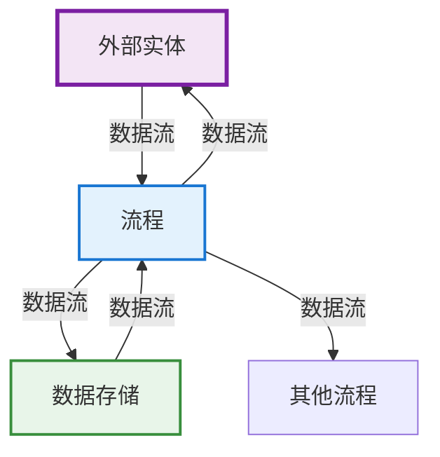
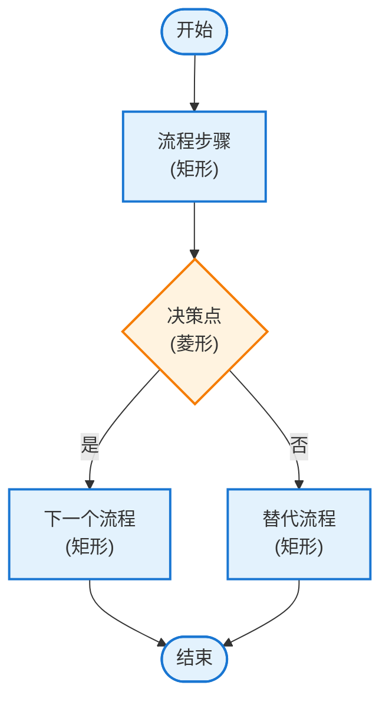
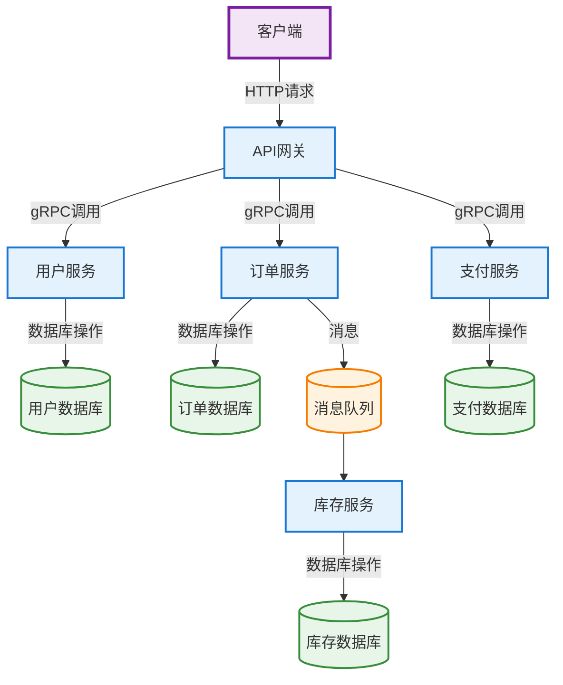
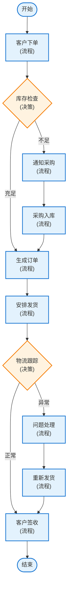

# 架构与数据流图

<cite>
**本文档引用的文件**  
- [create-dataflow/checklist.md](file://src/modules/bmm/workflows/diagrams/create-dataflow/checklist.md)
- [create-dataflow/instructions.md](file://src/modules/bmm/workflows/diagrams/create-dataflow/instructions.md)
- [create-dataflow/workflow.yaml](file://src/modules/bmm/workflows/diagrams/create-dataflow/workflow.yaml)
- [create-flowchart/checklist.md](file://src/modules/bmm/workflows/diagrams/create-flowchart/checklist.md)
- [create-flowchart/instructions.md](file://src/modules/bmm/workflows/diagrams/create-flowchart/instructions.md)
- [create-flowchart/workflow.yaml](file://src/modules/bmm/workflows/diagrams/create-flowchart/workflow.yaml)
- [excalidraw-templates.yaml](file://src/modules/bmm/workflows/diagrams/_shared/excalidraw-templates.yaml)
- [excalidraw-library.json](file://src/modules/bmm/workflows/diagrams/_shared/excalidraw-library.json)
- [excalidraw-helpers.md](file://src/core/resources/excalidraw/excalidraw-helpers.md)
- [validate-json-instructions.md](file://src/core/resources/excalidraw/validate-json-instructions.md)
</cite>

## 目录
1. [引言](#引言)
2. [create-dataflow工作流分析](#create-dataflow工作流分析)
3. [create-flowchart工作流分析](#create-flowchart工作流分析)
4. [质量保证标准](#质量保证标准)
5. [最佳实践指南](#最佳实践指南)
6. [执行机制分析](#执行机制分析)
7. [跨领域应用示例](#跨领域应用示例)
8. [技术评审与团队沟通](#技术评审与团队沟通)
9. [结论](#结论)

## 引言

本综合文档旨在深入分析BMAD-METHOD框架中的架构与数据流图工作流，重点阐述`create-dataflow`和`create-flowchart`两个核心工作流。文档将详细解释这些工作流如何帮助用户可视化系统组件间的数据流动和业务流程逻辑，分析相关的质量保证标准、最佳实践指南和执行机制，并提供跨领域的应用示例。

## create-dataflow工作流分析

`create-dataflow`工作流是一个专门用于创建数据流图（DFD）的系统，它遵循标准的DFD符号和结构，帮助用户可视化系统组件间的数据流动。

### 数据流图的核心功能

该工作流通过一系列结构化步骤，引导用户创建符合标准的数据流图。其主要功能包括：

- **上下文分析**：首先分析用户请求，提取DFD级别、流程、数据存储和外部实体等关键信息。
- **DFD级别识别**：提供多种DFD级别选择，包括上下文图（0级）、1级DFD、2级DFD和自定义选项。
- **需求收集**：系统化地收集用户关于流程、数据存储和外部实体的描述。
- **主题设置**：提供多种配色方案选择，包括标准DFD、彩色DFD、极简DFD和自定义选项。
- **结构规划**：列出所有流程、数据存储和外部实体，并映射数据流，确保结构完整性。

**Section sources**
- [instructions.md](file://src/modules/bmm/workflows/diagrams/create-dataflow/instructions.md#L1-L131)
- [workflow.yaml](file://src/modules/bmm/workflows/diagrams/create-dataflow/workflow.yaml#L1-L28)

### 数据流图的构建规则

`create-dataflow`工作流严格遵循DFD构建规则，确保生成的图表专业且准确。

**Diagram sources**
- [excalidraw-templates.yaml](file://src/modules/bmm/workflows/diagrams/_shared/excalidraw-templates.yaml#L97-L128)
- [excalidraw-library.json](file://src/modules/bmm/workflows/diagrams/_shared/excalidraw-library.json#L57-L88)

**Section sources**
- [checklist.md](file://src/modules/bmm/workflows/diagrams/create-dataflow/checklist.md#L1-L40)
- [instructions.md](file://src/modules/bmm/workflows/diagrams/create-dataflow/instructions.md#L77-L103)

## create-flowchart工作流分析

`create-flowchart`工作流专注于创建流程图，用于可视化业务流程、算法逻辑、用户旅程和数据处理管道。

### 流程图的核心功能

该工作流提供了一个全面的流程图创建框架，支持多种类型的流程可视化。

- **智能需求收集**：在提问前分析用户已提供的信息，避免重复询问。
- **流程类型识别**：支持业务流程、算法逻辑、用户旅程和数据处理管道等多种流程类型。
- **复杂度评估**：根据流程步骤数量和决策点数量评估流程复杂度。
- **主题创建**：提供多种专业配色方案，包括专业蓝色、成功绿色、中性灰色和温暖橙色。
- **布局规划**：系统化地规划流程图布局，确保结构清晰合理。

**Section sources**
- [instructions.md](file://src/modules/bmm/workflows/diagrams/create-flowchart/instructions.md#L1-L242)
- [workflow.yaml](file://src/modules/bmm/workflows/diagrams/create-flowchart/workflow.yaml#L1-L28)

### 流程图的构建规则

`create-flowchart`工作流遵循严格的构建规则，确保生成的流程图专业且易于理解。

**Diagram sources**
- [excalidraw-templates.yaml](file://src/modules/bmm/workflows/diagrams/_shared/excalidraw-templates.yaml#L1-L31)
- [excalidraw-library.json](file://src/modules/bmm/workflows/diagrams/_shared/excalidraw-library.json#L21-L56)

**Section sources**
- [checklist.md](file://src/modules/bmm/workflows/diagrams/create-flowchart/checklist.md#L1-L50)
- [instructions.md](file://src/modules/bmm/workflows/diagrams/create-flowchart/instructions.md#L172-L214)

## 质量保证标准

两个工作流都包含严格的质量保证标准，通过checklist.md文件定义了详细的验证清单。

### 数据流图质量标准

`create-dataflow`的checklist.md定义了五个维度的质量标准：

- **DFD符号**：确保流程用圆形/椭圆形表示，数据存储用平行线或矩形表示，外部实体用矩形表示，数据流用带标签的箭头表示。
- **结构**：要求所有流程正确编号，所有数据流用数据名称标记，数据存储命名恰当，外部实体清晰标识。
- **完整性**：确保所有输入输出都已考虑，没有孤立的流程，数据守恒，级别适当。
- **布局**：要求逻辑流向（从左到右，从上到下），避免不必要的交叉数据流，布局平衡，保持网格对齐。
- **技术质量**：所有元素正确分组，箭头有正确的绑定，文本可读且大小合适，没有标记为删除的元素，JSON有效。

**Section sources**
- [checklist.md](file://src/modules/bmm/workflows/diagrams/create-dataflow/checklist.md#L1-L40)

### 流程图质量标准

`create-flowchart`的checklist.md定义了六个维度的质量标准：

- **元素结构**：所有带标签的形状都有匹配的groupIds，所有文本元素都有指向父形状的containerId，文本宽度计算正确，文本对齐设置正确。
- **布局和对齐**：所有元素对齐到20px网格，元素间保持一致的间距（最小60px），保持垂直对齐，没有重叠元素。
- **连接**：所有箭头都有startBinding和endBinding，连接形状的boundElements数组已更新，箭头类型适当，绑定间隙设置为10。
- **主题和样式**：主题颜色一致应用，所有形状使用主题主填充色，所有边框使用主题强调色，文本颜色可读。
- **组合**：元素数量少于50个，尽可能引用库组件，没有重复的元素定义。
- **输出质量**：没有标记为删除的元素，JSON有效，文件保存到正确位置。

**Section sources**
- [checklist.md](file://src/modules/bmm/workflows/diagrams/create-flowchart/checklist.md#L1-L50)

## 最佳实践指南

instructions.md文件提供了详细的最佳实践指南，指导用户如何有效地使用这些工作流。

### 数据流图最佳实践

`create-dataflow`的instructions.md提供了系统的DFD创建指南：

- **遵循标准DFD符号**：严格按照helpers文件中的标准DFD符号创建元素。
- **构建顺序**：按照外部实体→流程→数据存储→数据流的顺序构建。
- **DFD规则**：流程用编号（1.0, 2.0）和动词短语表示，数据存储用名称（D1, D2）和名词短语表示，外部实体用名称和名词短语表示，数据流用数据名称标记，箭头显示方向。
- **布局原则**：外部实体放在边缘，流程放在中心，数据存储放在流程之间，尽量减少交叉流，采用从左到右或从上到下的流向。

**Section sources**
- [instructions.md](file://src/modules/bmm/workflows/diagrams/create-dataflow/instructions.md#L77-L103)

### 流程图最佳实践

`create-flowchart`的instructions.md提供了详细的流程图创建指南：

- **元素创建规则**：为每个带标签的形状生成唯一ID，计算文本宽度，设置文本对齐，更新boundElements。
- **箭头创建规则**：根据流向选择直箭头（向前）或弯头箭头（向上/向后），设置正确的绑定，更新连接形状的boundElements。
- **对齐规则**：所有x, y对齐到20px网格，垂直流保持相同的x坐标，元素间保持60px间距。
- **构建顺序**：按照开始点→流程步骤→决策点→结束点→连接箭头的顺序构建。

**Section sources**
- [instructions.md](file://src/modules/bmm/workflows/diagrams/create-flowchart/instructions.md#L172-L214)

## 执行机制分析

workflow.yaml文件定义了工作流的执行机制和配置参数。

### 工作流配置结构

两个工作流的workflow.yaml文件具有相似的结构：

- **基础信息**：包含工作流名称、描述和作者。
- **配置源**：指定配置文件的来源，用于获取输出文件夹等配置。
- **安装路径**：定义工作流组件的安装路径。
- **资源引用**：引用instructions.md、checklist.md、helpers、templates和library等关键资源。
- **输出文件**：定义默认输出文件路径，使用时间戳确保文件名唯一。
- **运行模式**：设置为独立运行（standalone: true），不作为Web包运行。

```mermaid
graph TD
A[workflow.yaml] --> B[config_source]
A --> C[output_folder]
A --> D[installed_path]
A --> E[instructions]
A --> F[validation]
A --> G[helpers]
A --> H[json_validation]
A --> I[templates]
A --> J[library]
A --> K[default_output_file]
A --> L[standalone]
A --> M[web_bundle]
style A fill:#f5f5f5,stroke:#616161,stroke-width:2px
style B fill:#e8f5e9,stroke:#388e3c,stroke-width:1px
style C fill:#e8f5e9,stroke:#388e3c,stroke-width:1px
style D fill:#e8f5e9,stroke:#388e3c,stroke-width:1px
style E fill:#e8f5e9,stroke:#388e3c,stroke-width:1px
style F fill:#e8f5e9,stroke:#388e3c,stroke-width:1px
style G fill:#e8f5e9,stroke:#388e3c,stroke-width:1px
style H fill:#e8f5e9,stroke:#388e3c,stroke-width:1px
style I fill:#e8f5e9,stroke:#388e3c,stroke-width:1px
style J fill:#e8f5e9,stroke:#388e3c,stroke-width:1px
style K fill:#e8f5e9,stroke:#388e3c,stroke-width:1px
style L fill:#e8f5e9,stroke:#388e3c,stroke-width:1px
style M fill:#e8f5e9,stroke:#388e3c,stroke-width:1px
```

**Diagram sources**
- [create-dataflow/workflow.yaml](file://src/modules/bmm/workflows/diagrams/create-dataflow/workflow.yaml#L1-L28)
- [create-flowchart/workflow.yaml](file://src/modules/bmm/workflows/diagrams/create-flowchart/workflow.yaml#L1-L28)

**Section sources**
- [create-dataflow/workflow.yaml](file://src/modules/bmm/workflows/diagrams/create-dataflow/workflow.yaml#L1-L28)
- [create-flowchart/workflow.yaml](file://src/modules/bmm/workflows/diagrams/create-flowchart/workflow.yaml#L1-L28)

### 执行流程

工作流的执行流程遵循XML指令文件中定义的步骤：

1. **上下文分析**：分析用户请求，提取关键信息。
2. **需求收集**：通过交互式提问收集缺失信息。
3. **主题设置**：检查或创建主题文件，确定配色方案。
4. **结构规划**：规划图表结构，与用户确认。
5. **资源加载**：加载模板、库和辅助文件。
6. **元素构建**：按照规则构建图表元素。
7. **优化保存**：清理未使用元素，保存文件。
8. **JSON验证**：验证JSON语法，修复错误。
9. **内容验证**：根据checklist验证内容质量。

**Section sources**
- [instructions.md](file://src/modules/bmm/workflows/diagrams/create-dataflow/instructions.md#L10-L129)
- [instructions.md](file://src/modules/bmm/workflows/diagrams/create-flowchart/instructions.md#L10-L240)

## 跨领域应用示例

这些工作流在多个领域都有广泛的应用价值。

### 微服务架构设计

在微服务架构设计中，`create-dataflow`工作流可以用于可视化服务间的数据流动。

**Diagram sources**
- [excalidraw-templates.yaml](file://src/modules/bmm/workflows/diagrams/_shared/excalidraw-templates.yaml#L32-L61)
- [excalidraw-library.json](file://src/modules/bmm/workflows/diagrams/_shared/excalidraw-library.json#L41-L88)

### 业务流程优化

在业务流程优化中，`create-flowchart`工作流可以用于可视化和优化复杂的业务流程。

**Diagram sources**
- [excalidraw-templates.yaml](file://src/modules/bmm/workflows/diagrams/_shared/excalidraw-templates.yaml#L1-L31)
- [excalidraw-library.json](file://src/modules/bmm/workflows/diagrams/_shared/excalidraw-library.json#L21-L56)

## 技术评审与团队沟通

这些图表在技术评审和团队沟通中发挥着重要作用。

### 技术评审中的应用

在技术评审中，这些图表可以帮助团队：

- **可视化系统架构**：通过数据流图清晰展示系统组件和数据流动。
- **识别瓶颈**：通过流程图识别业务流程中的瓶颈和优化点。
- **验证设计**：使用checklist验证设计是否符合标准和最佳实践。
- **促进讨论**：提供共同的视觉参考，促进团队成员间的有效讨论。

### 团队沟通中的价值

在团队沟通中，这些图表具有以下价值：

- **跨职能理解**：帮助非技术人员理解技术架构和流程。
- **知识共享**：作为知识库的一部分，促进团队知识共享。
- **决策支持**：为技术决策提供可视化支持。
- **文档化**：作为项目文档的重要组成部分，记录系统设计和业务流程。

**Section sources**
- [checklist.md](file://src/modules/bmm/workflows/diagrams/create-dataflow/checklist.md#L1-L40)
- [checklist.md](file://src/modules/bmm/workflows/diagrams/create-flowchart/checklist.md#L1-L50)
- [instructions.md](file://src/modules/bmm/workflows/diagrams/create-dataflow/instructions.md#L1-L131)
- [instructions.md](file://src/modules/bmm/workflows/diagrams/create-flowchart/instructions.md#L1-L242)

## 结论

`create-dataflow`和`create-flowchart`工作流为架构设计和流程可视化提供了强大的工具。通过遵循标准化的符号、结构和最佳实践，这些工作流帮助用户创建专业、准确的图表。质量保证标准和执行机制确保了输出的一致性和可靠性。在微服务架构设计和业务流程优化等跨领域应用中，这些图表不仅有助于技术评审，还能促进团队沟通和知识共享。通过系统化地使用这些工作流，团队可以提高设计质量，优化流程，并增强协作效率。