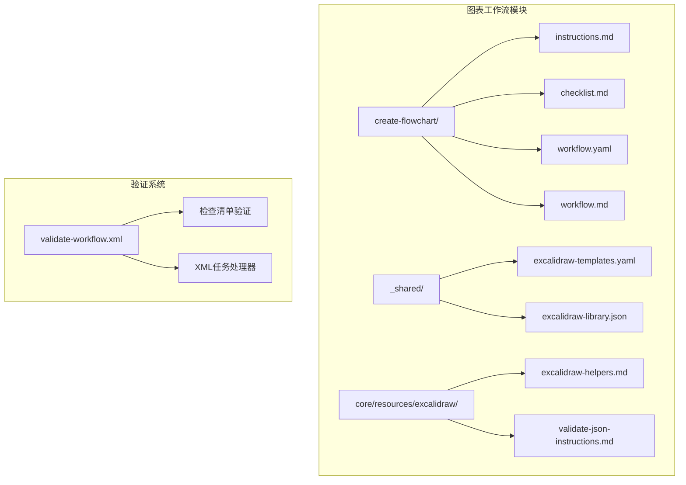
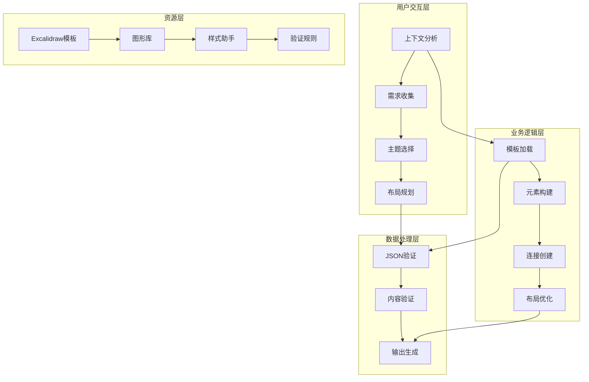
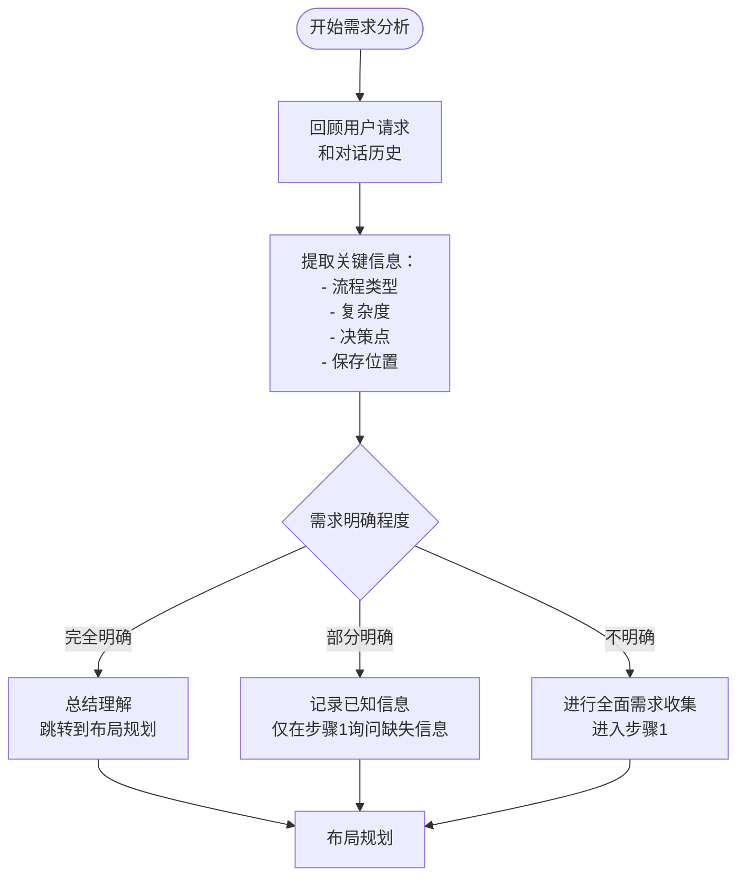
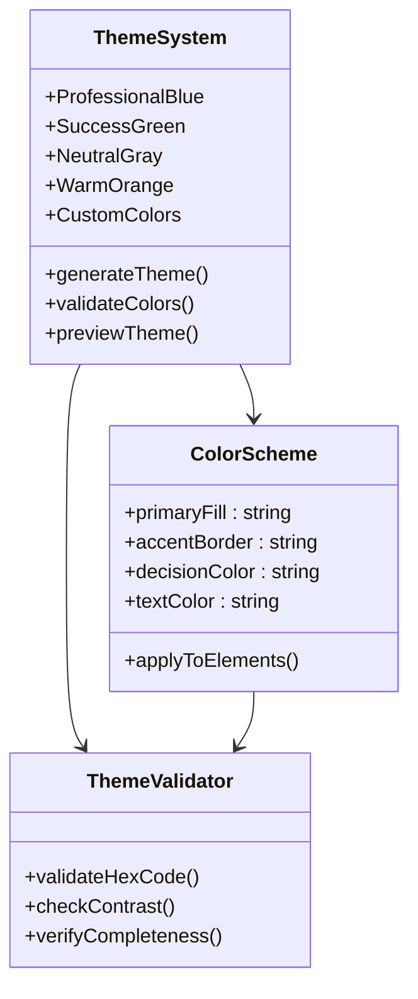
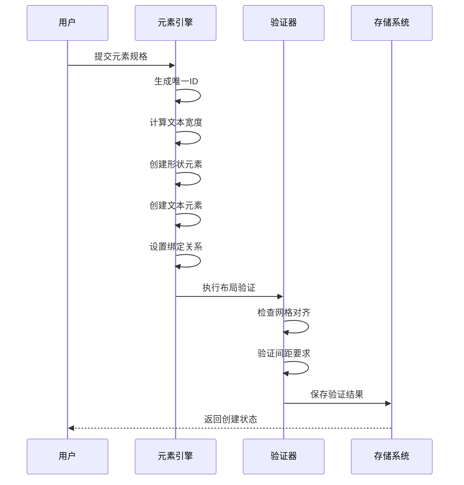
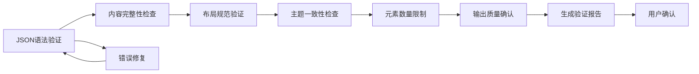
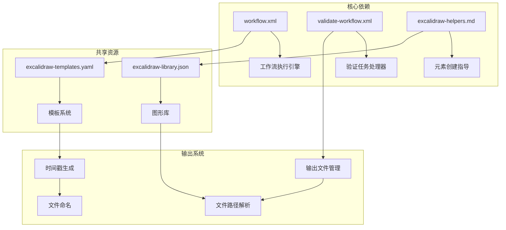

# 流程图设计

<cite>
**本文档引用的文件**
- [workflow.yaml](file://src/modules/bmm/workflows/diagrams/create-flowchart/workflow.yaml)
- [instructions.md](file://src/modules/bmm/workflows/diagrams/create-flowchart/instructions.md)
- [checklist.md](file://src/modules/bmm/workflows/diagrams/create-flowchart/checklist.md)
- [excalidraw-helpers.md](file://src/core/resources/excalidraw/excalidraw-helpers.md)
- [excalidraw-templates.yaml](file://src/modules/bmm/workflows/diagrams/_shared/excalidraw-templates.yaml)
- [excalidraw-library.json](file://src/modules/bmm/workflows/diagrams/_shared/excalidraw-library.json)
- [validate-workflow.xml](file://src/core/tasks/validate-workflow.xml)
- [create-diagram/instructions.md](file://src/modules/bmm/workflows/diagrams/create-diagram/instructions.md)
</cite>

## 目录
1. [简介](#简介)
2. [项目结构](#项目结构)
3. [核心组件](#核心组件)
4. [架构概览](#架构概览)
5. [详细组件分析](#详细组件分析)
6. [依赖关系分析](#依赖关系分析)
7. [性能考虑](#性能考虑)
8. [故障排除指南](#故障排除指南)
9. [结论](#结论)

## 简介

create-flowchart工作流是一个专门用于创建Excalidraw格式流程图的自动化系统。该工作流通过智能引导用户完成从需求分析到最终输出的完整流程，支持复杂的业务流程建模，包括操作步骤、决策分支、并行路径和循环结构的可视化表达。

该系统的核心价值在于：
- **智能化需求收集**：通过上下文分析和交互式提问，准确理解用户需求
- **标准化输出**：确保生成的流程图符合专业设计规范
- **灵活的主题定制**：支持多种颜色方案和自定义主题
- **严格的质量控制**：通过多层次验证确保输出质量

## 项目结构

create-flowchart工作流位于BMAD方法论框架的图表创建工作流模块中，其目录结构体现了清晰的功能分离：

**图表来源**
- [workflow.yaml](file://src/modules/bmm/workflows/diagrams/create-flowchart/workflow.yaml#L1-L28)
- [excalidraw-templates.yaml](file://src/modules/bmm/workflows/diagrams/_shared/excalidraw-templates.yaml#L1-L128)

**章节来源**
- [workflow.yaml](file://src/modules/bmm/workflows/diagrams/create-flowchart/workflow.yaml#L1-L28)

## 核心组件

### 工作流引擎配置

工作流的核心配置定义了其执行环境和资源依赖：

| 配置项 | 值 | 描述 |
|--------|-----|------|
| 名称 | create-excalidraw-flowchart | 工作流标识符 |
| 描述 | 创建Excalidraw格式流程图 | 工作流功能概述 |
| 输出文件 | {output_folder}/diagrams/flowchart-{timestamp}.excalidraw | 自动生成的输出路径 |
| 独立性 | true | 支持独立运行 |
| Web捆绑 | false | 不包含Web运行时 |

### 资源管理系统

工作流依赖多个核心资源：

- **模板系统**：提供预定义的流程图元素和布局模式
- **库系统**：包含可重用的图形组件
- **助手文件**：提供元素创建和布局指导
- **验证系统**：确保输出质量

**章节来源**
- [workflow.yaml](file://src/modules/bmm/workflows/diagrams/create-flowchart/workflow.yaml#L1-L28)

## 架构概览

create-flowchart工作流采用分层架构设计，确保功能的模块化和可维护性：

**图表来源**
- [instructions.md](file://src/modules/bmm/workflows/diagrams/create-flowchart/instructions.md#L10-L242)
- [excalidraw-helpers.md](file://src/core/resources/excalidraw/excalidraw-helpers.md#L1-L128)

## 详细组件分析

### 智能需求分析模块

工作流的第一步是智能上下文分析，这体现了现代AI驱动的设计思维：

**图表来源**
- [instructions.md](file://src/modules/bmm/workflows/diagrams/create-flowchart/instructions.md#L10-L29)

### 交互式需求收集系统

需求收集过程采用多维度分类法，确保全面覆盖各种流程类型：

| 流程类型 | 描述 | 适用场景 |
|----------|------|----------|
| 业务流程流 | 文档业务工作流程、审批流程、运营程序 | 企业流程优化 |
| 算法/逻辑流 | 可视化代码逻辑、决策树、计算过程 | 技术文档编写 |
| 用户旅程流 | 映射用户交互、导航路径、体验流程 | UX/UI设计 |
| 数据处理管道 | 展示数据转换、ETL过程、处理阶段 | 数据工程 |
| 其他 | 特定的流程图需求 | 专业领域应用 |

**章节来源**
- [instructions.md](file://src/modules/bmm/workflows/diagrams/create-flowchart/instructions.md#L31-L75)

### 主题定制系统

主题系统提供了丰富的视觉定制选项，支持专业化的品牌化需求：

**图表来源**
- [instructions.md](file://src/modules/bmm/workflows/diagrams/create-flowchart/instructions.md#L95-L151)

### 元素创建和布局引擎

这是工作流的核心技术组件，负责按照严格的设计规范创建流程图元素：

**图表来源**
- [excalidraw-helpers.md](file://src/core/resources/excalidraw/excalidraw-helpers.md#L17-L32)

### 连接系统（箭头创建）

连接系统支持两种类型的箭头，适应不同的流向需求：

| 箭头类型 | 使用场景 | 技术特征 |
|----------|----------|----------|
| 直线箭头 | 前向流动（左到右、上到下） | 简单两点连接 |
| 弯曲箭头 | 向上流动、反向流动、复杂路由 | 支持中间点 |

**章节来源**
- [excalidraw-helpers.md](file://src/core/resources/excalidraw/excalidraw-helpers.md#L40-L93)

### 验证和质量控制系统

质量控制贯穿整个工作流的每个阶段：

**图表来源**
- [checklist.md](file://src/modules/bmm/workflows/diagrams/create-flowchart/checklist.md#L1-L50)
- [validate-workflow.xml](file://src/core/tasks/validate-workflow.xml#L1-L89)

**章节来源**
- [instructions.md](file://src/modules/bmm/workflows/diagrams/create-flowchart/instructions.md#L222-L238)
- [checklist.md](file://src/modules/bmm/workflows/diagrams/create-flowchart/checklist.md#L1-L50)

## 依赖关系分析

create-flowchart工作流与BMAD方法论框架的其他组件存在密切的依赖关系：

**图表来源**
- [workflow.yaml](file://src/modules/bmm/workflows/diagrams/create-flowchart/workflow.yaml#L10-L22)

**章节来源**
- [workflow.yaml](file://src/modules/bmm/workflows/diagrams/create-flowchart/workflow.yaml#L10-L22)

## 性能考虑

### 元素数量优化

工作流对元素数量设置了合理的限制，确保输出文件的可管理性和渲染性能：

- **最大元素数**：50个元素以内
- **重复检测**：自动识别和避免重复元素定义
- **清理机制**：移除未使用的元素和删除标记

### 渲染性能优化

- **网格对齐**：所有坐标都对齐到20像素网格
- **间距标准化**：元素间保持60像素的最小间距
- **批量操作**：按类型分组处理元素，提高处理效率

### 内存使用优化

- **渐进式构建**：一次只处理一个部分，减少内存占用
- **及时清理**：构建完成后立即清理临时数据
- **增量验证**：只验证必要的部分，避免全量扫描

## 故障排除指南

### 常见问题及解决方案

| 问题类型 | 症状 | 解决方案 |
|----------|------|----------|
| JSON语法错误 | 验证失败，显示语法错误位置 | 根据错误提示修复引号、逗号或括号 |
| 布局混乱 | 元素重叠或间距不当 | 检查网格对齐设置和间距参数 |
| 主题不一致 | 颜色显示异常 | 验证十六进制颜色代码格式 |
| 元素缺失 | 某些步骤或决策点未显示 | 检查元素ID生成和绑定关系 |

### 调试技巧

1. **逐步验证**：在每个关键步骤后进行验证
2. **日志跟踪**：启用详细的执行日志
3. **预览检查**：在最终保存前进行多次预览
4. **备份策略**：在修改前保存原始文件

**章节来源**
- [instructions.md](file://src/modules/bmm/workflows/diagrams/create-flowchart/instructions.md#L222-L238)

## 结论

create-flowchart工作流代表了现代流程图设计工具的发展方向，它将人工智能的智能引导能力与专业的设计规范相结合，为用户提供了一个既高效又高质量的流程图创建解决方案。

### 主要优势

1. **智能化用户体验**：通过上下文分析和交互式提问，大大降低了使用门槛
2. **标准化输出质量**：严格的质量控制确保每份输出都符合专业标准
3. **灵活的定制能力**：支持多种主题和布局选项，满足不同场景需求
4. **完整的验证体系**：多层次的质量保证机制确保输出的可靠性

### 应用价值

- **业务流程优化**：帮助企业清晰地展示和优化内部流程
- **新员工培训**：提供标准化的入职流程和操作指南
- **跨部门沟通**：通过可视化降低沟通成本，提高协作效率
- **技术文档编写**：为复杂的技术流程提供直观的说明

该工作流不仅是一个工具，更是一种设计理念的体现，它展示了如何通过技术手段提升人类的创造力和工作效率。随着AI技术的不断发展，这种智能化的设计工具将在各个领域发挥越来越重要的作用。