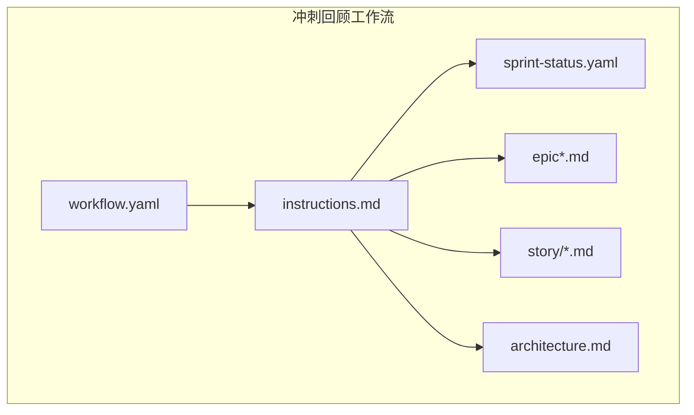
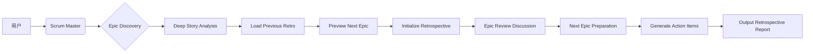
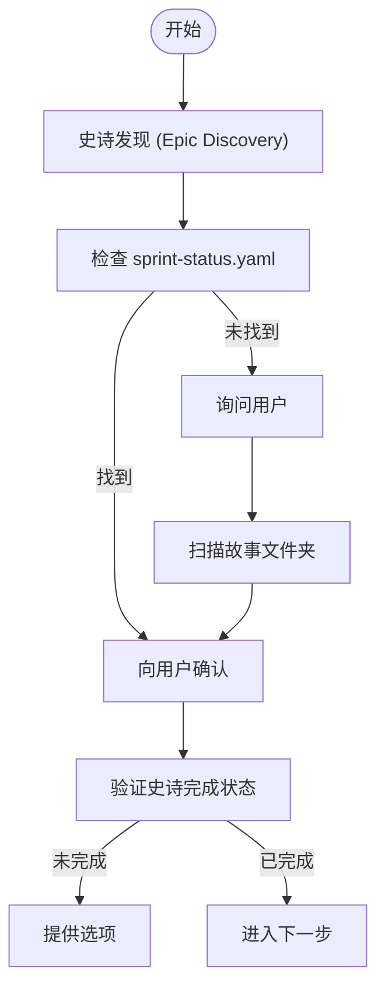
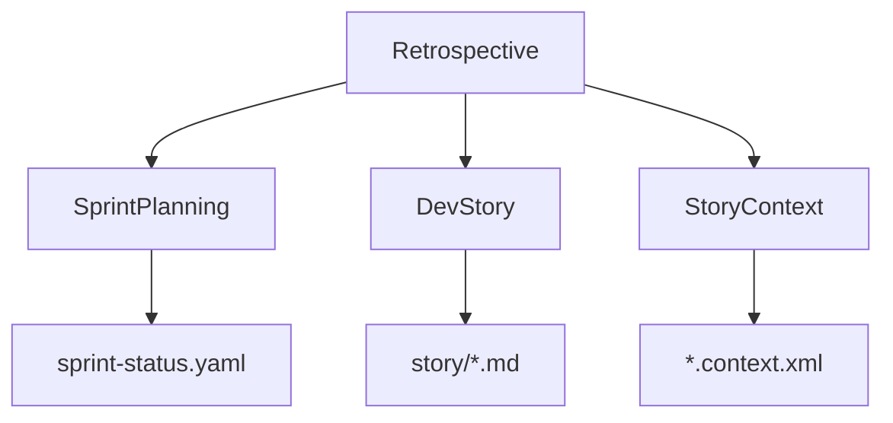

# 冲刺回顾

<cite>
**本文档引用的文件**   
- [workflow.yaml](file://src/modules/bmgd/workflows/4-production/retrospective/workflow.yaml)
- [instructions.md](file://src/modules/bmgd/workflows/4-production/retrospective/instructions.md)
- [sprint-planning/workflow.yaml](file://src/modules/bmgd/workflows/4-production/sprint-planning/workflow.yaml)
- [sprint-planning/instructions.md](file://src/modules/bmgd/workflows/4-production/sprint-planning/instructions.md)
- [sprint-status-template.yaml](file://src/modules/bmgd/workflows/4-production/sprint-planning/sprint-status-template.yaml)
</cite>

## 目录
1. [引言](#引言)
2. [项目结构](#项目结构)
3. [核心组件](#核心组件)
4. [架构概述](#架构概述)
5. [详细组件分析](#详细组件分析)
6. [依赖分析](#依赖分析)
7. [性能考虑](#性能考虑)
8. [故障排除指南](#故障排除指南)
9. [结论](#结论)
10. [附录](#附录)（如有必要）

## 引言
本文档深入解析了BMAD方法论中的冲刺回顾工作流，详细阐述了`retrospective`工作流的设计与实施。该工作流旨在在史诗（Epic）完成后，通过系统性的回顾会议来审查整体成功情况、提取经验教训，并探索可能影响下一史诗的新信息。文档将详细说明工作流如何与冲刺规划形成闭环反馈，将回顾中产生的改进建议转化为下一轮冲刺的具体行动。

## 项目结构
冲刺回顾工作流是BMAD方法论中实现持续改进的关键环节，它与冲刺规划、故事开发等流程紧密集成。工作流文件位于`src/modules/bmgd/workflows/4-production/retrospective/`目录下，主要由`workflow.yaml`和`instructions.md`两个文件构成。

**Diagram sources**
- [workflow.yaml](file://src/modules/bmgd/workflows/4-production/retrospective/workflow.yaml)
- [instructions.md](file://src/modules/bmgd/workflows/4-production/retrospective/instructions.md)

**Section sources**
- [workflow.yaml](file://src/modules/bmgd/workflows/4-production/retrospective/workflow.yaml)
- [instructions.md](file://src/modules/bmgd/workflows/4-production/retrospective/instructions.md)

## 核心组件
冲刺回顾工作流的核心在于其结构化的数据收集、问题分析和改进措施制定阶段。`workflow.yaml`文件定义了工作流的元数据、输入源和配置，而`instructions.md`文件则包含了详细的执行逻辑和引导脚本。

**Section sources**
- [workflow.yaml](file://src/modules/bmgd/workflows/4-production/retrospective/workflow.yaml)
- [instructions.md](file://src/modules/bmgd/workflows/4-production/retrospective/instructions.md)

## 架构概述
冲刺回顾工作流的架构设计遵循了模块化和可扩展的原则。它通过`workflow.yaml`文件中的`input_file_patterns`配置，智能地加载史诗、架构、产品需求等文档，支持完整的文档和分片文档两种模式。工作流的执行由`instructions.md`中的XML指令集驱动，确保了流程的标准化和一致性。

**Diagram sources**
- [workflow.yaml](file://src/modules/bmgd/workflows/4-production/retrospective/workflow.yaml)
- [instructions.md](file://src/modules/bmgd/workflows/4-production/retrospective/instructions.md)

## 详细组件分析

### 回顾工作流分析
冲刺回顾工作流的执行过程分为多个步骤，每个步骤都有明确的目标和行动。

#### 数据收集阶段
工作流首先通过`Epic Discovery`步骤确定要回顾的史诗。它会优先检查`sprint-status.yaml`文件，如果未找到，则会询问用户或扫描故事文件夹。一旦确定史诗编号，工作流会验证其完成状态，确保所有故事都已标记为“done”。

**Diagram sources**
- [instructions.md](file://src/modules/bmgd/workflows/4-production/retrospective/instructions.md#L32-L147)

#### 问题分析阶段
在`Deep Story Analysis`步骤中，工作流会深入分析每个故事文件，提取开发笔记、审查反馈、经验教训和技术债务等信息。通过合成跨故事的模式，工作流能够识别出团队共同的挣扎、反复出现的审查反馈和突破性时刻。

**Section sources**
- [instructions.md](file://src/modules/bmgd/workflows/4-production/retrospective/instructions.md#L165-L247)

#### 改进措施制定阶段
工作流通过`Next Epic Preparation Discussion`步骤，将回顾的成果与下一史诗的规划联系起来。它会预览下一史诗的内容，识别依赖关系和准备需求，并通过团队讨论确定关键的准备工作项。

**Section sources**
- [instructions.md](file://src/modules/bmgd/workflows/4-production/retrospective/instructions.md#L679-L800)

## 依赖分析
冲刺回顾工作流与多个其他组件存在依赖关系。它依赖于`sprint-planning`工作流生成的`sprint-status.yaml`文件来跟踪史诗和故事的状态。同时，它也依赖于`dev-story`工作流生成的故事文件来提取经验教训。

**Diagram sources**
- [workflow.yaml](file://src/modules/bmgd/workflows/4-production/retrospective/workflow.yaml)
- [sprint-planning/workflow.yaml](file://src/modules/bmgd/workflows/4-production/sprint-planning/workflow.yaml)

**Section sources**
- [workflow.yaml](file://src/modules/bmgd/workflows/4-production/retrospective/workflow.yaml)
- [sprint-planning/workflow.yaml](file://src/modules/bmgd/workflows/4-production/sprint-planning/workflow.yaml)

## 性能考虑
冲刺回顾工作流的设计考虑了性能和效率。通过使用`SELECTIVE_LOAD`策略，它只加载必要的文档，避免了不必要的I/O开销。此外，工作流的执行是增量的，允许在部分数据不可用的情况下继续执行。

## 故障排除指南
在执行冲刺回顾工作流时，可能会遇到一些常见挑战，如史诗未完成、前一次回顾未找到或下一史诗未定义。工作流通过提供清晰的选项和引导，帮助用户解决这些问题。

**Section sources**
- [instructions.md](file://src/modules/bmgd/workflows/4-production/retrospective/instructions.md#L109-L140)

## 结论
冲刺回顾工作流是BMAD方法论中实现持续改进的核心机制。通过结构化的数据收集、问题分析和改进措施制定，它帮助团队从每次史诗的执行中学习，并将这些学习成果转化为下一轮冲刺的具体行动。这种闭环反馈机制确保了团队能够不断优化其流程和实践。

## 附录
### 状态定义
**史诗状态：**
- `backlog`: 史诗存在于史诗文件中但未进行技术上下文创建
- `contexted`: 已创建史诗技术上下文

**故事状态：**
- `backlog`: 故事仅存在于史诗文件中
- `drafted`: 已在故事文件夹中创建故事文件
- `ready-for-dev`: 草稿已批准并创建了故事上下文
- `in-progress`: 开发人员正在积极实施
- `review`: 正在进行SM审查
- `done`: 故事已完成

**回顾状态：**
- `optional`: 可以完成但不是必需的
- `completed`: 回顾已完成

**Section sources**
- [sprint-status-template.yaml](file://src/modules/bmgd/workflows/4-production/sprint-planning/sprint-status-template.yaml)