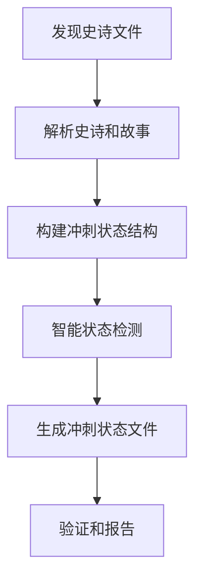
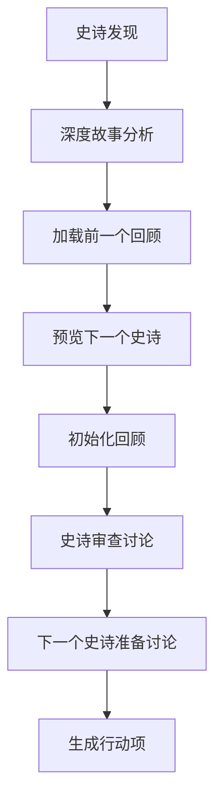

# 冲刺管理

<cite>
**本文档引用的文件**
- [sprint-planning/instructions.md](file://src/modules/bmgd/workflows/4-production/sprint-planning/instructions.md)
- [sprint-planning/checklist.md](file://src/modules/bmgd/workflows/4-production/sprint-planning/checklist.md)
- [sprint-planning/sprint-status-template.yaml](file://src/modules/bmgd/workflows/4-production/sprint-planning/sprint-status-template.yaml)
- [sprint-planning/workflow.yaml](file://src/modules/bmgd/workflows/4-production/sprint-planning/workflow.yaml)
- [retrospective/instructions.md](file://src/modules/bmgd/workflows/4-production/retrospective/instructions.md)
- [retrospective/workflow.yaml](file://src/modules/bmgd/workflows/4-production/retrospective/workflow.yaml)
</cite>

## 目录
1. [引言](#引言)
2. [冲刺计划工作流](#冲刺计划工作流)
3. [回顾工作流](#回顾工作流)
4. [闭环迭代机制](#闭环迭代机制)
5. [实际应用案例](#实际应用案例)
6. [结论](#结论)

## 引言
本文档全面介绍敏捷开发周期中的冲刺计划（sprint-planning）和回顾（retrospective）两个核心工作流。这两个工作流构成了敏捷开发的计划-执行-回顾闭环，支持团队的持续改进和迭代优化。文档详细阐述了如何使用检查清单确保计划完整性，如何利用状态模板统一跟踪任务状态，以及如何通过回顾会议促进团队学习和改进。

## 冲刺计划工作流
冲刺计划工作流旨在生成和管理冲刺状态跟踪文件，从史诗文件中提取所有史诗和用户故事，并跟踪它们在整个开发周期中的状态。该工作流通过自动化的状态检测和验证机制，确保开发进度的透明性和可追踪性。

**图示来源**
- [sprint-planning/workflow.yaml](file://src/modules/bmgd/workflows/4-production/sprint-planning/workflow.yaml#L1-L52)
- [sprint-planning/instructions.md](file://src/modules/bmgd/workflows/4-production/sprint-planning/instructions.md#L1-L235)

**本节来源**
- [sprint-planning/workflow.yaml](file://src/modules/bmgd/workflows/4-production/sprint-planning/workflow.yaml#L1-L52)
- [sprint-planning/instructions.md](file://src/modules/bmgd/workflows/4-production/sprint-planning/instructions.md#L1-L235)

### 冲刺计划流程
冲刺计划工作流遵循一个结构化的五步流程：

1. **文档发现**：首先搜索完整的史诗文档，如果未找到则检查分片版本。优先使用完整的文档，确保获取所有史诗和故事的完整信息。
2. **解析史诗和故事**：从史诗文件中提取史诗编号和故事ID，将故事格式从"Epic.Story: Title"转换为kebab-case键。
3. **构建冲刺状态结构**：为每个史诗创建条目，包括史诗条目、故事条目和回顾条目，按顺序组织。
4. **智能状态检测**：通过检查相关文件的存在来自动检测状态，如技术上下文文件、故事文件等。
5. **生成和验证**：生成冲刺状态文件并执行验证检查，确保数据的完整性和准确性。

该工作流使用`sprint-status-template.yaml`作为模板，生成包含所有史诗、故事和回顾的状态跟踪文件。状态检测遵循预定义的状态机，确保状态转换的正确性。

**本节来源**
- [sprint-planning/instructions.md](file://src/modules/bmgd/workflows/4-production/sprint-planning/instructions.md#L1-L235)
- [sprint-planning/sprint-status-template.yaml](file://src/modules/bmgd/workflows/4-production/sprint-planning/sprint-status-template.yaml#L1-L56)

### 角色职责和计划流程
根据`instructions.md`中定义的计划流程，冲刺计划工作流涉及多个角色的协作。Scrum Master负责协调整个计划过程，确保所有史诗和故事被正确识别和跟踪。开发团队成员负责提供故事的详细信息和状态更新。产品负责人确保史诗和故事的业务价值得到充分体现。

计划流程强调史诗应该在故事起草前被"上下文化"（contexted），这确保了技术上下文的建立，为后续开发提供了坚实的基础。故事通常按顺序处理，但支持并行工作，以充分利用团队容量。

**本节来源**
- [sprint-planning/instructions.md](file://src/modules/bmgd/workflows/4-production/sprint-planning/instructions.md#L1-L235)
- [sprint-planning/checklist.md](file://src/modules/bmgd/workflows/4-production/sprint-planning/checklist.md#L1-L34)

## 回顾工作流
回顾工作流在史诗完成后运行，旨在审查整体成功，提取经验教训，并探索新出现的信息如何影响下一个史诗。该工作流通过结构化的讨论和分析，促进团队的持续改进。

**图示来源**
- [retrospective/workflow.yaml](file://src/modules/bmgd/workflows/4-production/retrospective/workflow.yaml#L1-L58)
- [retrospective/instructions.md](file://src/modules/bmgd/workflows/4-production/retrospective/instructions.md#L1-L1444)

**本节来源**
- [retrospective/workflow.yaml](file://src/modules/bmgd/workflows/4-production/retrospective/workflow.yaml#L1-L58)
- [retrospective/instructions.md](file://src/modules/bmgd/workflows/4-production/retrospective/instructions.md#L1-L1444)

### 回顾会议组织
回顾工作流通过一个精心设计的六步过程组织回顾会议：

1. **史诗发现**：首先检查`sprint-status.yaml`文件，找出最近完成的史诗。如果无法确定，则直接询问用户。
2. **深度故事分析**：审查所有故事记录，提取关键主题，如开发挑战、审查反馈模式和经验教训。
3. **加载前一个回顾**：查找并整合前一个史诗的回顾，检查之前承诺的行动项是否完成。
4. **预览下一个史诗**：查看下一个史诗的计划，识别依赖关系和准备工作。
5. **初始化回顾**：设置回顾的上下文，包括交付指标、质量和业务成果。
6. **讨论和生成行动项**：引导团队讨论成功之处和挑战，生成具体的行动项。

该工作流强调心理安全，禁止指责，专注于系统和流程。所有代理对话必须使用"Name (Role): dialogue"格式，创建自然的来回交流。

**本节来源**
- [retrospective/instructions.md](file://src/modules/bmgd/workflows/4-production/retrospective/instructions.md#L1-L1444)
- [retrospective/workflow.yaml](file://src/modules/bmgd/workflows/4-production/retrospective/workflow.yaml#L1-L58)

### 改进建议跟踪机制
回顾工作流通过一个系统化的机制跟踪改进建议。在讨论过程中，Scrum Master会记录所有识别出的挑战和机会，并将其转化为具体的行动项。这些行动项包括明确的所有权和可衡量的目标。

工作流特别强调对前一个回顾的跟进，检查之前承诺的行动项是否完成。这创建了一个连续性，确保团队从过去的经验中学习并持续改进。对于未完成的行动项，工作流会探索未完成的原因，并确定如何在当前上下文中解决这些问题。

**本节来源**
- [retrospective/instructions.md](file://src/modules/bmgd/workflows/4-production/retrospective/instructions.md#L1-L1444)
- [retrospective/workflow.yaml](file://src/modules/bmgd/workflows/4-production/retrospective/workflow.yaml#L1-L58)

## 闭环迭代机制
冲刺计划和回顾工作流共同形成了一个完整的计划-执行-回顾闭环，支持敏捷开发的迭代优化。这个闭环机制确保了团队在每个迭代中都能学习和改进。

**图示来源**
- [sprint-planning/instructions.md](file://src/modules/bmgd/workflows/4-production/sprint-planning/instructions.md#L1-L235)
- [retrospective/instructions.md](file://src/modules/bmgd/workflows/4-production/retrospective/instructions.md#L1-L1444)

**本节来源**
- [sprint-planning/instructions.md](file://src/modules/bmgd/workflows/4-production/sprint-planning/instructions.md#L1-L235)
- [retrospective/instructions.md](file://src/modules/bmgd/workflows/4-production/retrospective/instructions.md#L1-L1444)

### 计划-执行-回顾循环
这个闭环机制的工作原理如下：冲刺计划工作流为开发周期设定明确的目标和跟踪机制。在执行阶段，团队根据计划开发功能。完成后，回顾工作流启动，审查整个周期的成果，提取经验教训。

关键的连接点是回顾工作流对前一个回顾的跟进和对下一个史诗的准备。这确保了改进措施被实际应用，并且下一个周期的计划考虑了之前的经验。例如，如果前一个周期中数据库迁移是一个挑战，回顾工作流会识别这一点，并在下一个周期的准备讨论中提出改进迁移流程的行动项。

**本节来源**
- [sprint-planning/instructions.md](file://src/modules/bmgd/workflows/4-production/sprint-planning/instructions.md#L1-L235)
- [retrospective/instructions.md](file://src/modules/bmgd/workflows/4-production/retrospective/instructions.md#L1-L1444)

### 状态机和流程控制
两个工作流都遵循预定义的状态机，确保流程的可控性和一致性。冲刺计划工作流中的故事状态机为：`backlog → drafted → ready-for-dev → in-progress → review → done`。回顾工作流中的回顾状态为：`optional ↔ completed`。

这些状态机不仅定义了状态转换，还包含了重要的工作流注释。例如，史诗应该在故事起草前被"上下文化"，故事应该在标记为"完成"之前通过"审查"阶段。这些规则确保了开发过程的质量和纪律性。

**本节来源**
- [sprint-planning/instructions.md](file://src/modules/bmgd/workflows/4-production/sprint-planning/instructions.md#L1-L235)
- [retrospective/instructions.md](file://src/modules/bmgd/workflows/4-production/retrospective/instructions.md#L1-L1444)

## 实际应用案例
为了说明如何配置和执行这些工作流以适应不同规模的开发团队，我们提供以下实际应用案例。

### 小型团队应用
对于小型团队，冲刺计划工作流可以简化为一个集中的过程。团队可以使用默认的`sprint-status-template.yaml`，并定期运行冲刺计划工作流来更新状态。回顾工作流可以每月举行一次，重点关注最重要的改进机会。

在这种配置下，团队可以将`sprint-planning`和`retrospective`工作流集成到他们的日常开发流程中。例如，每当完成一个史诗时，自动触发回顾工作流，确保及时捕获经验教训。

**本节来源**
- [sprint-planning/sprint-status-template.yaml](file://src/modules/bmgd/workflows/4-production/sprint-planning/sprint-status-template.yaml#L1-L56)
- [retrospective/instructions.md](file://src/modules/bmgd/workflows/4-production/retrospective/instructions.md#L1-L1444)

### 大型团队应用
对于大型团队，这些工作流可以配置为支持更复杂的组织结构。可以为不同的子团队创建独立的冲刺状态文件，并使用`discover_inputs`协议来整合所有输入。

在回顾工作流中，可以配置更详细的分析过程，包括对技术债务、测试覆盖率和生产事件的深入分析。行动项可以分配给特定的子团队，并在后续的回顾中跟踪其进展。

**本节来源**
- [sprint-planning/workflow.yaml](file://src/modules/bmgd/workflows/4-production/sprint-planning/workflow.yaml#L1-L52)
- [retrospective/workflow.yaml](file://src/modules/bmgd/workflows/4-production/retrospective/workflow.yaml#L1-L58)

## 结论
冲刺计划和回顾工作流是敏捷开发周期中的关键组成部分，它们共同形成了一个强大的计划-执行-回顾闭环。通过使用`checklist.md`中的检查项确保计划完整性，并利用`sprint-status-template.yaml`统一跟踪任务状态，团队可以实现高效的开发流程。

`instructions.md`中定义的计划流程和角色职责为团队提供了清晰的指导，而回顾工作流的持续改进机制确保了团队能够从每个迭代中学习和成长。这些工作流可以灵活配置，以适应不同规模和复杂度的开发团队，支持敏捷开发的迭代优化。

**本节来源**
- [sprint-planning/instructions.md](file://src/modules/bmgd/workflows/4-production/sprint-planning/instructions.md#L1-L235)
- [retrospective/instructions.md](file://src/modules/bmgd/workflows/4-production/retrospective/instructions.md#L1-L1444)
- [sprint-planning/checklist.md](file://src/modules/bmgd/workflows/4-production/sprint-planning/checklist.md#L1-L34)
- [sprint-planning/sprint-status-template.yaml](file://src/modules/bmgd/workflows/4-production/sprint-planning/sprint-status-template.yaml#L1-L56)