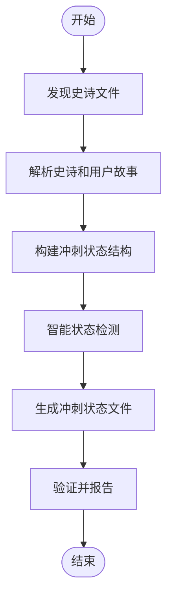

# 冲刺规划

<cite>
**本文档中引用的文件**  
- [workflow.yaml](file://src/modules/bmgd/workflows/4-production/sprint-planning/workflow.yaml)
- [instructions.md](file://src/modules/bmgd/workflows/4-production/sprint-planning/instructions.md)
- [checklist.md](file://src/modules/bmgd/workflows/4-production/sprint-planning/checklist.md)
- [sprint-status-template.yaml](file://src/modules/bmgd/workflows/4-production/sprint-planning/sprint-status-template.yaml)
- [workflow.yaml](file://src/modules/bmm/workflows/4-implementation/sprint-planning/workflow.yaml)
- [instructions.md](file://src/modules/bmm/workflows/4-implementation/sprint-planning/instructions.md)
- [checklist.md](file://src/modules/bmm/workflows/4-implementation/sprint-planning/checklist.md)
- [sprint-status-template.yaml](file://src/modules/bmm/workflows/4-implementation/sprint-planning/sprint-status-template.yaml)
- [workflows-planning.md](file://src/modules/bmm/docs/workflows-planning.md)
- [workflows-implementation.md](file://src/modules/bmm/docs/workflows-implementation.md)
- [quick-start.md](file://src/modules/bmm/docs/quick-start.md)
- [test-priorities-matrix.md](file://src/modules/bmm/testarch/knowledge/test-priorities-matrix.md)
</cite>

## 目录
1. [引言](#引言)
2. [冲刺规划流程](#冲刺规划流程)
3. [规划会议组织与角色职责](#规划会议组织与角色职责)
4. [规划完整性检查](#规划完整性检查)
5. [任务状态跟踪标准化](#任务状态跟踪标准化)
6. [流程定制配置示例](#流程定制配置示例)
7. [最佳实践建议](#最佳实践建议)
8. [结论](#结论)

## 引言

冲刺规划是软件开发过程中的关键环节，它将战略愿景转化为可执行的任务。本文档详细介绍了sprint-planning工作流的实现机制，包括任务分解、工作量评估和资源分配等核心流程。通过分析workflow.yaml中定义的冲刺规划流程步骤，解释instructions.md中规定的规划会议组织流程和团队成员角色职责，阐述checklist.md中列出的关键检查项如何确保规划的完整性，并描述sprint-status-template.yaml如何标准化任务状态跟踪以支持跨团队协作和进度可视化。此外，文档还提供了根据团队规模和项目复杂度定制规划流程的配置示例，以及时间盒管理、优先级排序技巧和应对计划偏差策略等最佳实践建议。

**Section sources**
- [workflows-planning.md](file://src/modules/bmm/docs/workflows-planning.md#L1-L452)

## 冲刺规划流程

冲刺规划流程由workflow.yaml文件定义，其主要目标是生成和管理冲刺状态跟踪文件，提取所有史诗（epics）和用户故事（stories）并跟踪其在整个开发周期中的状态。该流程采用智能状态检测机制，通过检查相关文件的存在与否来自动更新任务状态。

### 任务分解与工作量评估

在冲刺规划过程中，首先需要对史诗和用户故事进行解析和提取。系统会搜索匹配`epics_pattern`的所有文件，从史诗标题（如`## Epic 1:`）和用户故事标题（如`### Story 1.1: User Authentication`）中提取信息。用户故事的ID会被转换为kebab-case格式，例如`1-1-user-authentication`。

工作量评估基于任务的状态流转。每个史诗和用户故事都有明确的状态定义，从`backlog`到`done`的完整流程确保了工作量的合理分配和跟踪。

### 资源分配

资源分配通过状态检测机制实现。对于每个史诗，系统会检查技术上下文文件（`epic-{num}-context.md`）是否存在，如果存在则将其状态设置为`contexted`。对于每个用户故事，系统会检查故事文件（`{story-key}.md`）和故事上下文文件（`{story-key}-context.md`）是否存在，从而确定其当前状态。



**Diagram sources**
- [workflow.yaml](file://src/modules/bmgd/workflows/4-production/sprint-planning/workflow.yaml#L1-L52)
- [instructions.md](file://src/modules/bmgd/workflows/4-production/sprint-planning/instructions.md#L1-L235)

**Section sources**
- [workflow.yaml](file://src/modules/bmgd/workflows/4-production/sprint-planning/workflow.yaml#L1-L52)
- [instructions.md](file://src/modules/bmgd/workflows/4-production/sprint-planning/instructions.md#L1-L235)

## 规划会议组织与角色职责

规划会议的组织流程和团队成员角色职责在instructions.md中有明确规定。会议的主要目标是确保所有团队成员对冲刺目标有共同的理解，并明确各自的责任。

### 规划会议流程

1. **文档发现**：首先进行全面的史诗文件加载，确保获取所有相关的史诗和用户故事。
2. **解析工作项**：解析史诗文件并提取所有工作项，包括史诗编号、用户故事ID和标题。
3. **构建状态结构**：为每个发现的史诗创建条目，并按顺序生成相应的用户故事和回顾条目。
4. **智能状态检测**：通过检查相关文件的存在与否来确定每个任务的当前状态。
5. **生成状态文件**：创建或更新`sprint-status.yaml`文件，包含所有任务的状态信息。
6. **验证与报告**：执行验证检查，确保覆盖完整性和状态合法性，并向用户报告生成结果。

### 团队成员角色职责

- **项目经理（PM）**：负责整体规划和协调，确保所有任务都得到适当分配。
- **架构师（Architect）**：提供技术指导，确保解决方案符合架构要求。
- **开发人员（Dev）**：负责具体实现，确保代码质量和按时交付。
- **Scrum Master（SM）**：主持会议，确保流程顺利进行，并解决任何障碍。

**Section sources**
- [instructions.md](file://src/modules/bmgd/workflows/4-production/sprint-planning/instructions.md#L1-L235)

## 规划完整性检查

checklist.md中列出的关键检查项确保了规划的完整性，涵盖了需求确认、技术可行性评估和风险识别等方面。

### 核心验证

#### 完整性检查

- [ ] 每个在史诗文件中找到的史诗都出现在`sprint-status.yaml`中
- [ ] 每个在史诗文件中找到的用户故事都出现在`sprint-status.yaml`中
- [ ] 每个史诗都有对应的回顾条目
- [ ] `sprint-status.yaml`中没有不存在于史诗文件中的项目

#### 解析验证

比较史诗文件与生成的`sprint-status.yaml`：

```
史诗文件包含:                冲刺状态包含:
✓ Epic 1                            ✓ epic-1: [状态]
  ✓ Story 1.1: 用户认证              ✓ 1-1-user-auth: [状态]
  ✓ Story 1.2: 账户管理              ✓ 1-2-account-mgmt: [状态]
  ✓ Story 1.3: 植物命名              ✓ 1-3-plant-naming: [状态]
                                    ✓ epic-1-retrospective: [状态]
✓ Epic 2                            ✓ epic-2: [状态]
  ✓ Story 2.1: 个性模型              ✓ 2-1-personality-model: [状态]
  ✓ Story 2.2: 聊天界面              ✓ 2-2-chat-interface: [状态]
                                    ✓ epic-2-retrospective: [状态]
```

#### 最终检查

- [ ] 史诗总数匹配
- [ ] 用户故事总数匹配
- [ ] 所有项目都按预期顺序排列（史诗、其用户故事、其回顾）

**Section sources**
- [checklist.md](file://src/modules/bmgd/workflows/4-production/sprint-planning/checklist.md#L1-L34)

## 任务状态跟踪标准化

sprint-status-template.yaml定义了任务状态跟踪的标准格式，支持跨团队协作和进度可视化。

### 状态定义

#### 史诗状态

- **backlog**：史诗存在于史诗文件中但未进行技术上下文处理
- **contexted**：已创建史诗技术上下文（在起草用户故事之前必需）

#### 用户故事状态

- **backlog**：用户故事仅存在于史诗文件中
- **drafted**：已在故事文件夹中创建故事文件
- **ready-for-dev**：草稿已批准且已创建故事上下文
- **in-progress**：开发人员正在积极实施
- **review**：正在由SM审查（通过代码审查工作流）
- **done**：已完成

#### 回顾状态

- **optional**：可以完成但不是必需的
- **completed**：回顾已完成

### 工作流说明

- 史诗应在用户故事可以`drafted`之前被`contexted`
- 如果团队容量允许，用户故事可以并行工作
- SM通常在前一个用户故事`done`后起草下一个用户故事，以融入学习成果
- 开发人员将用户故事移至`review`，SM审查后，开发人员再将其移至`done`

```mermaid
stateDiagram-v2
[*] --> backlog
backlog --> contexted : 史诗
contexted --> drafted : 用户故事
drafted --> ready-for-dev : 用户故事
ready-for-dev --> in-progress : 用户故事
in-progress --> review : 用户故事
review --> done : 用户故事
optional --> completed : 回顾
completed --> optional : 回顾
```

**Diagram sources**
- [sprint-status-template.yaml](file://src/modules/bmgd/workflows/4-production/sprint-planning/sprint-status-template.yaml#L1-L56)
- [instructions.md](file://src/modules/bmgd/workflows/4-production/sprint-planning/instructions.md#L193-L235)

**Section sources**
- [sprint-status-template.yaml](file://src/modules/bmgd/workflows/4-production/sprint-planning/sprint-status-template.yaml#L1-L56)
- [instructions.md](file://src/modules/bmgd/workflows/4-production/sprint-planning/instructions.md#L193-L235)

## 流程定制配置示例

根据团队规模和项目复杂度，可以通过调整配置文件来自定义规划流程。

### 小型团队配置

对于小型团队，可以简化流程，减少不必要的步骤。例如，可以跳过某些验证步骤或合并部分任务。

```yaml
config_source: "{project-root}/{bmad_folder}/bmm/config.yaml"
output_folder: "{config_source}:output_folder"
user_name: "{config_source}:user_name"
communication_language: "{config_source}:communication_language"
date: system-generated
sprint_artifacts: "{config_source}:sprint_artifacts"
tracking_system: "file-system"
story_location: "{config_source}:sprint_artifacts"
story_location_absolute: "{config_source}:sprint_artifacts"
status_file: "{sprint_artifacts}/sprint-status.yaml"
```

### 大型团队配置

对于大型团队，需要更详细的配置以支持复杂的协作需求。可以启用更多的验证步骤和状态检测机制。

```yaml
config_source: "{project-root}/{bmad_folder}/bmgd/config.yaml"
output_folder: "{config_source}:output_folder"
user_name: "{config_source}:user_name"
communication_language: "{config_source}:communication_language"
date: system-generated
sprint_artifacts: "{config_source}:sprint_artifacts"
tracking_system: "file-system"
story_location: "{config_source}:sprint_artifacts"
story_location_absolute: "{config_source}:sprint_artifacts"
status_file: "{sprint_artifacts}/sprint-status.yaml"
```

**Section sources**
- [workflow.yaml](file://src/modules/bmm/workflows/4-implementation/sprint-planning/workflow.yaml#L1-L54)
- [workflow.yaml](file://src/modules/bmgd/workflows/4-production/sprint-planning/workflow.yaml#L1-L52)

## 最佳实践建议

### 时间盒管理

使用时间盒管理方法，为每个任务分配固定的时间段。这有助于提高效率并避免过度投入。

### 优先级排序技巧

采用风险基础自动化优先级分类器，根据收入影响、用户影响、安全风险等因素计算测试优先级。例如：

```typescript
export function calculatePriority(factors: PriorityFactors): Priority {
  const { revenueImpact, userImpact, securityRisk, complianceRequired, previousFailure, complexity, usage } = factors;

  // P0: 收入关键、安全或合规
  if (revenueImpact === 'critical' || securityRisk || complianceRequired || (previousFailure && revenueImpact === 'high')) {
    return 'P0';
  }

  // P0: 高收入 + 高复杂性 + 频繁使用
  if (revenueImpact === 'high' && complexity === 'high' && usage === 'frequent') {
    return 'P0';
  }

  // P1: 核心用户旅程（大多数受影响 + 频繁使用）
  if (userImpact === 'all' || userImpact === 'majority') {
    if (usage === 'frequent' || complexity === 'high') {
      return 'P1';
    }
  }

  // P2: 次要功能（部分影响，偶尔使用）
  if (userImpact === 'some' || usage === 'occasional') {
    return 'P2';
  }

  // P3: 很少使用，影响低
  return 'P3';
}
```

### 应对计划偏差的策略

当需求发生变化时，运行`correct-course`工作流来分析变更的影响，提出解决方案（继续、转向、暂停），并更新受影响的文档。这确保了规划的灵活性和适应性。

**Section sources**
- [test-priorities-matrix.md](file://src/modules/bmm/testarch/knowledge/test-priorities-matrix.md#L159-L271)
- [workflows-planning.md](file://src/modules/bmm/docs/workflows-planning.md#L250-L269)

## 结论

冲刺规划是确保项目成功的关键步骤。通过详细的流程定义、明确的角色职责、完整的检查项和标准化的状态跟踪，团队可以有效地管理任务分解、工作量评估和资源分配。根据团队规模和项目复杂度定制规划流程，并遵循最佳实践建议，如时间盒管理、优先级排序技巧和应对计划偏差的策略，可以显著提高开发效率和产品质量。最终，一个结构化且灵活的冲刺规划流程将为项目的顺利实施提供坚实的基础。