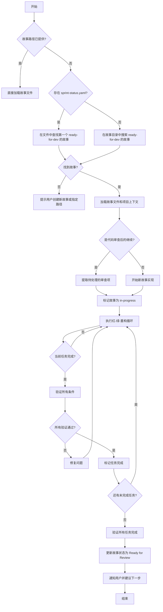
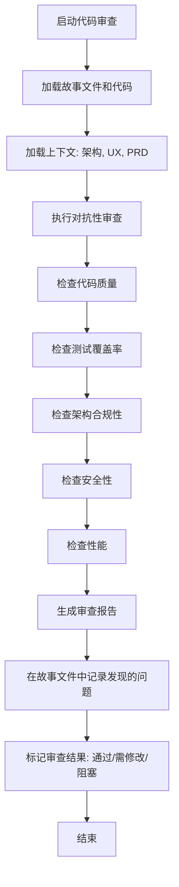
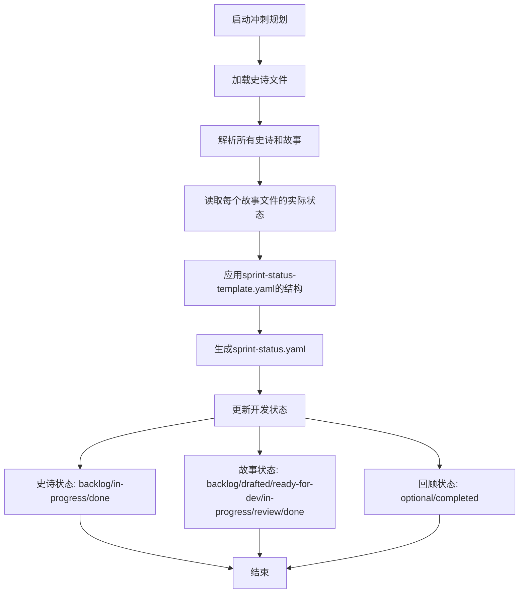
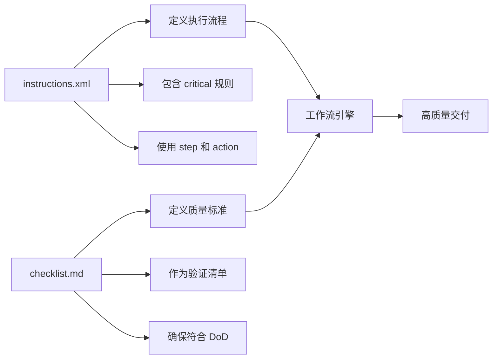
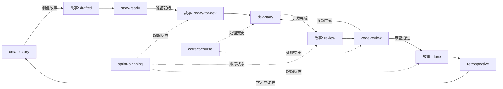

# 实现阶段

<cite>
**本文档中引用的文件**  
- [dev-story/workflow.yaml](file://src/modules/bmm/workflows/4-implementation/dev-story/workflow.yaml)
- [dev-story/instructions.xml](file://src/modules/bmm/workflows/4-implementation/dev-story/instructions.xml)
- [code-review/workflow.yaml](file://src/modules/bmm/workflows/4-implementation/code-review/workflow.yaml)
- [code-review/checklist.md](file://src/modules/bmm/workflows/4-implementation/code-review/checklist.md)
- [sprint-planning/workflow.yaml](file://src/modules/bmm/workflows/4-implementation/sprint-planning/workflow.yaml)
- [sprint-planning/sprint-status-template.yaml](file://src/modules/bmm/workflows/4-implementation/sprint-planning/sprint-status-template.yaml)
- [sprint-planning/checklist.md](file://src/modules/bmm/workflows/4-implementation/sprint-planning/checklist.md)
- [correct-course/workflow.yaml](file://src/modules/bmm/workflows/4-implementation/correct-course/workflow.yaml)
- [correct-course/checklist.md](file://src/modules/bmm/workflows/4-implementation/correct-course/checklist.md)
- [create-story/workflow.yaml](file://src/modules/bmm/workflows/4-implementation/create-story/workflow.yaml)
- [create-story/template.md](file://src/modules/bmm/workflows/4-implementation/create-story/template.md)
- [create-story/checklist.md](file://src/modules/bmm/workflows/4-implementation/create-story/checklist.md)
- [retrospective/workflow.yaml](file://src/modules/bmm/workflows/4-implementation/retrospective/workflow.yaml)
</cite>

## 目录
1. [引言](#引言)
2. [开发故事工作流](#开发故事工作流)
3. [代码审查工作流](#代码审查工作流)
4. [冲刺规划工作流](#冲刺规划工作流)
5. [纠正措施工作流](#纠正措施工作流)
6. [指令文件解析](#指令文件解析)
7. [实现阶段闭环机制](#实现阶段闭环机制)
8. [结论](#结论)

## 引言

实现阶段是BMAD-METHOD方法论中的核心执行环节，它将前期分析、规划和解决方案设计的成果转化为可运行的代码。该阶段通过一系列结构化的工作流（workflow）确保开发过程的系统性、可追溯性和高质量交付。本阶段涵盖四个核心工作流：开发故事（dev-story）、代码审查（code-review）、冲刺规划（sprint-planning）和纠正措施（correct-course），它们共同构成了一个从任务到代码再到质量保证的完整闭环。这些工作流由YAML配置文件定义，并通过XML指令文件和Markdown模板进行指导，确保了流程的自动化和标准化。

**本节来源**
- [dev-story/workflow.yaml](file://src/modules/bmm/workflows/4-implementation/dev-story/workflow.yaml)
- [code-review/workflow.yaml](file://src/modules/bmm/workflows/4-implementation/code-review/workflow.yaml)

## 开发故事工作流

`dev-story`工作流是开发者完成单个用户故事的核心执行引擎。它严格遵循红-绿-重构（Red-Green-Refactor）的测试驱动开发（TDD）原则，指导开发者从任务发现到最终交付的全过程。

该工作流首先通过`sprint-status.yaml`文件或直接在故事目录中查找状态为“ready-for-dev”的故事。一旦找到，它会将故事状态更新为“in-progress”，并开始处理任务列表。工作流的核心是`instructions.xml`文件，它定义了20个关键步骤，确保开发过程的严谨性。例如，步骤5强制要求开发者必须先编写失败的测试（红阶段），然后编写最简代码使其通过（绿阶段），最后进行代码重构（重构阶段）。

工作流强调连续执行，除非遇到明确的停止条件（HALT condition），否则不允许中途暂停。它会逐个处理任务和子任务，只有在所有测试通过、文件列表更新、变更日志记录且所有验收标准（Acceptance Criteria）都满足后，才会将故事标记为“Ready for Review”。整个过程被详细记录在故事文件的“Dev Agent Record”部分，确保了开发过程的完全可追溯。

**图示来源**
- [dev-story/workflow.yaml](file://src/modules/bmm/workflows/4-implementation/dev-story/workflow.yaml)
- [dev-story/instructions.xml](file://src/modules/bmm/workflows/4-implementation/dev-story/instructions.xml)

**本节来源**
- [dev-story/workflow.yaml](file://src/modules/bmm/workflows/4-implementation/dev-story/workflow.yaml)
- [dev-story/instructions.xml](file://src/modules/bmm/workflows/4-implementation/dev-story/instructions.xml)

## 代码审查工作流

`code-review`工作流是一个对抗性的高级开发者审查流程，旨在发现并解决代码中的潜在问题。与简单的“看起来不错”不同，该工作流被设计为必须找到3到10个具体问题，涵盖代码质量、测试覆盖率、架构合规性、安全性和性能等多个维度。

该工作流通过`workflow.yaml`文件配置，其核心是`instructions.xml`和`checklist.md`。`checklist.md`文件定义了审查的详细标准，包括代码风格、错误处理、依赖管理、安全漏洞和性能瓶颈等。工作流会智能地加载相关的上下文文件，如系统架构文档、UX设计规范和相关的史诗（epic）文件，以确保审查的全面性。

审查过程是系统性的。它首先分析代码实现是否符合架构决策，然后检查测试的充分性，特别是边界条件和错误处理场景。对于安全审查，它会检查是否存在常见的漏洞，如注入攻击或不安全的API调用。审查结果会以结构化的方式记录在故事文件的“Senior Developer Review (AI)”部分，包含问题描述、严重性等级和具体的修复建议。开发者必须解决所有标记为“Changes Requested”的问题后，故事才能进入下一个状态。

**图示来源**
- [code-review/workflow.yaml](file://src/modules/bmm/workflows/4-implementation/code-review/workflow.yaml)
- [code-review/checklist.md](file://src/modules/bmm/workflows/4-implementation/code-review/checklist.md)

**本节来源**
- [code-review/workflow.yaml](file://src/modules/bmm/workflows/4-implementation/code-review/workflow.yaml)
- [code-review/checklist.md](file://src/modules/bmm/workflows/4-implementation/code-review/checklist.md)

## 冲刺规划工作流

`sprint-planning`工作流负责生成和管理冲刺状态跟踪文件（`sprint-status.yaml`），为整个开发团队提供一个清晰的项目进度视图。该工作流是敏捷冲刺组织的核心，它自动化了状态跟踪的过程，减少了手动管理的开销。

工作流的核心是`sprint-status-template.yaml`文件，它定义了状态文件的结构和状态定义。该模板包含一个示例结构，其中定义了史诗（Epic）和故事（Story）的各种状态，如“backlog”、“drafted”、“ready-for-dev”、“in-progress”、“review”和“done”。工作流会扫描输出目录中的所有`epic*.md`文件，提取其中的所有故事，并根据它们在故事文件中的实际状态，动态生成一个完整的`sprint-status.yaml`文件。

这个状态文件成为了所有其他工作流的单一事实来源。`dev-story`工作流依赖它来查找下一个要开发的故事，`code-review`工作流可以据此了解故事的上下文，而`correct-course`工作流则利用它来评估变更的影响。通过这种方式，`sprint-planning`工作流实现了对项目进度的集中化、自动化的管理，确保了团队成员对项目状态有一致的理解。

**图示来源**
- [sprint-planning/workflow.yaml](file://src/modules/bmm/workflows/4-implementation/sprint-planning/workflow.yaml)
- [sprint-planning/sprint-status-template.yaml](file://src/modules/bmm/workflows/4-implementation/sprint-planning/sprint-status-template.yaml)

**本节来源**
- [sprint-planning/workflow.yaml](file://src/modules/bmm/workflows/4-implementation/sprint-planning/workflow.yaml)
- [sprint-planning/sprint-status-template.yaml](file://src/modules/bmm/workflows/4-implementation/sprint-planning/sprint-status-template.yaml)
- [sprint-planning/checklist.md](file://src/modules/bmm/workflows/4-implementation/sprint-planning/checklist.md)

## 纠正措施工作流

`correct-course`工作流是应对项目执行过程中出现重大变更或偏差的管理机制。当需求变更、技术障碍或优先级调整等“重大变化”发生时，该工作流提供了一个结构化的分析和响应框架。

该工作流的设计理念是“导航”而非“阻止”变化。它首先会加载所有相关的上下文文件，包括产品需求文档（PRD）、所有史诗、系统架构和UX设计，以全面分析变更的影响范围。基于这些信息，工作流会提出多种解决方案，并评估每种方案的技术可行性、工作量和风险。

工作流的输出是一个详细的变更提案（`sprint-change-proposal-{date}.md`），其中包含变更的背景、影响分析、推荐的解决方案以及实施路线图。这个提案可以路由给项目经理或技术负责人进行决策。一旦方案被批准，`correct-course`工作流可以协调后续的执行，例如更新史诗、重新规划冲刺或触发`create-story`工作流来创建新的开发任务。这确保了项目在面对不确定性时仍能保持有序和可控。

**本节来源**
- [correct-course/workflow.yaml](file://src/modules/bmm/workflows/4-implementation/correct-course/workflow.yaml)
- [correct-course/checklist.md](file://src/modules/bmm/workflows/4-implementation/correct-course/checklist.md)

## 指令文件解析

指令文件是BMAD-METHOD工作流的“大脑”，它们以结构化的方式定义了每个工作流的执行逻辑和规则。其中，`instructions.xml`和`checklist.md`是最关键的两种类型。

`instructions.xml`文件使用XML标签定义了工作流的精确执行步骤。例如，在`dev-story/instructions.xml`中，`<step>`标签定义了从1到10的十个主要步骤，每个步骤都有明确的目标（`goal`）和一系列`<action>`。文件中的`<critical>`标签强调了绝对不能违反的规则，如“必须按顺序执行所有步骤”和“除非遇到停止条件，否则绝不暂停”。这种机器可读的指令确保了工作流执行的一致性和可靠性。

`checklist.md`文件则提供了质量检查的清单。它是一个Markdown格式的待办事项列表，列出了完成某项任务所需满足的所有条件。例如，`code-review/checklist.md`会列出代码审查必须检查的项目，如“是否有适当的错误处理？”、“代码是否符合命名约定？”等。这些清单作为质量门禁（quality gate），确保了交付成果的高标准。

**图示来源**
- [dev-story/instructions.xml](file://src/modules/bmm/workflows/4-implementation/dev-story/instructions.xml)
- [code-review/checklist.md](file://src/modules/bmm/workflows/4-implementation/code-review/checklist.md)

**本节来源**
- [dev-story/instructions.xml](file://src/modules/bmm/workflows/4-implementation/dev-story/instructions.xml)
- [code-review/checklist.md](file://src/modules/bmm/workflows/4-implementation/code-review/checklist.md)
- [create-story/template.md](file://src/modules/bmm/workflows/4-implementation/create-story/template.md)

## 实现阶段闭环机制

实现阶段通过四个核心工作流的紧密协作，形成了一个从任务到代码再到质量保证的完整闭环。这个闭环始于`create-story`工作流，它根据史诗创建新的用户故事，并将其状态初始化为“drafted”。随后，`story-ready`工作流（或手动操作）会将故事状态更新为“ready-for-dev”。

`dev-story`工作流是闭环的执行核心。它从`sprint-status.yaml`中选取“ready-for-dev”的故事，进行开发，并在完成后将其状态更新为“review”。紧接着，`code-review`工作流介入，对代码进行严格的审查。如果审查发现问题，故事状态可能被重置，开发者需要回到`dev-story`工作流进行修复。

当代码审查通过后，故事状态变为“done”，标志着开发任务的完成。`sprint-planning`工作流持续监控整个过程，实时更新`sprint-status.yaml`，为团队提供透明的进度视图。如果在过程中出现重大偏差，`correct-course`工作流会启动，分析影响并提出解决方案，确保项目能够及时调整方向。

这个闭环机制确保了每个用户故事都经过了定义、开发、审查和确认的完整生命周期，极大地提高了软件交付的质量和可预测性。

**图示来源**
- [create-story/workflow.yaml](file://src/modules/bmm/workflows/4-implementation/create-story/workflow.yaml)
- [dev-story/workflow.yaml](file://src/modules/bmm/workflows/4-implementation/dev-story/workflow.yaml)
- [code-review/workflow.yaml](file://src/modules/bmm/workflows/4-implementation/code-review/workflow.yaml)
- [sprint-planning/workflow.yaml](file://src/modules/bmm/workflows/4-implementation/sprint-planning/workflow.yaml)
- [correct-course/workflow.yaml](file://src/modules/bmm/workflows/4-implementation/correct-course/workflow.yaml)
- [retrospective/workflow.yaml](file://src/modules/bmm/workflows/4-implementation/retrospective/workflow.yaml)

**本节来源**
- [create-story/workflow.yaml](file://src/modules/bmm/workflows/4-implementation/create-story/workflow.yaml)
- [dev-story/workflow.yaml](file://src/modules/bmm/workflows/4-implementation/dev-story/workflow.yaml)
- [code-review/workflow.yaml](file://src/modules/bmm/workflows/4-implementation/code-review/workflow.yaml)
- [sprint-planning/workflow.yaml](file://src/modules/bmm/workflows/4-implementation/sprint-planning/workflow.yaml)
- [correct-course/workflow.yaml](file://src/modules/bmm/workflows/4-implementation/correct-course/workflow.yaml)

## 结论

实现阶段通过`dev-story`、`code-review`、`sprint-planning`和`correct-course`这四大工作流，构建了一个高度自动化、标准化且质量驱动的开发环境。`dev-story`工作流确保了开发过程的严谨性和可追溯性；`code-review`工作流通过对抗性审查保障了代码的高质量；`sprint-planning`工作流提供了对项目进度的实时、透明的视图；而`correct-course`工作流则赋予了项目应对变化的灵活性和韧性。这些工作流通过`instructions.xml`和`checklist.md`等指令文件进行精确控制，并以`sprint-status.yaml`作为状态协调的中心，共同形成了一个强大的闭环系统。这一系统不仅提升了开发效率，更重要的是，它系统性地降低了项目风险，确保了软件交付的可靠性和卓越性。