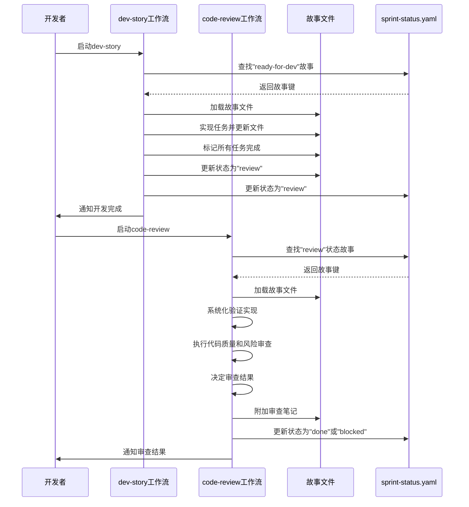
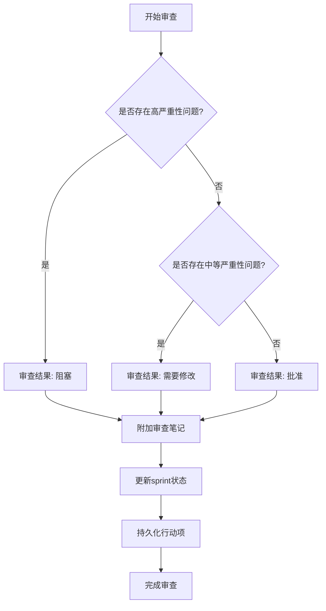

# 开发与代码审查

<cite>
**本文档引用的文件**  
- [dev-story/instructions.md](file://src/modules/bmgd/workflows/4-production/dev-story/instructions.md)
- [dev-story/checklist.md](file://src/modules/bmgd/workflows/4-production/dev-story/checklist.md)
- [code-review/instructions.md](file://src/modules/bmgd/workflows/4-production/code-review/instructions.md)
- [code-review/checklist.md](file://src/modules/bmgd/workflows/4-production/code-review/checklist.md)
</cite>

## 目录
1. [介绍](#介绍)
2. [dev-story 工作流详解](#dev-story-工作流详解)
3. [code-review 工作流详解](#code-review-工作流详解)
4. [工作流集成与协作机制](#工作流集成与协作机制)
5. [实际使用示例](#实际使用示例)
6. [常见问题与解决方案](#常见问题与解决方案)
7. [结论](#结论)

## 介绍
本文档详细描述了BMAD方法论中的两个核心工作流：dev-story和code-review。这两个工作流构成了软件开发过程中的开发与审查闭环，确保代码质量、需求符合性和团队协作效率。dev-story工作流指导开发者完成用户故事的实现，而code-review工作流则系统性地验证开发成果的质量和完整性。通过instructions.md文件中的XML指令和checklist.md中的质量检查项，这两个工作流实现了标准化、可重复和可验证的开发与审查过程。

## dev-story 工作流详解

dev-story工作流是开发者实现用户故事的核心流程。该工作流通过instructions.md文件中的XML指令定义了详细的执行步骤和输出标准。

### 开发任务执行流程
dev-story工作流从查找下一个准备开发的故事开始。系统会扫描sprint-status.yaml文件，找到状态为"ready-for-dev"的第一个故事。如果未找到合适的故事，系统会提供相应的操作建议，如运行story-context或create-story工作流。

一旦确定了开发目标，工作流会加载完整的故事文件，解析其各个部分，包括故事描述、验收标准、任务/子任务、开发笔记、开发代理记录、文件列表、变更日志和状态。如果存在上下文文件（.context.xml），系统会一并加载以获取更丰富的实现指导。

**工作流执行关键规则**：
- 必须按精确顺序执行所有步骤，不得跳过
- 不得因"里程碑"、"重大进展"或"会话边界"而停止
- 只有在所有验收标准满足且所有任务/子任务完成时才能结束
- 仅允许修改故事文件中的特定区域：任务/子任务复选框、开发代理记录（调试日志、完成笔记）、文件列表、变更日志和状态

### 开发质量检查项
checklist.md文件定义了开发故事完成时必须满足的质量检查项，确保开发成果的完整性和质量。

```mermaid
flowchart TD
A[任务完成] --> B[所有任务和子任务已标记完成]
A --> C[实现符合每个验收标准]
D[测试与质量] --> E[添加/更新单元测试]
D --> F[添加/更新集成测试]
D --> G[创建端到端测试]
D --> H[所有测试通过]
D --> I[代码检查通过]
J[故事文件更新] --> K[文件列表包含所有变更文件]
J --> L[开发代理记录包含相关笔记]
J --> M[变更日志包含变更摘要]
J --> N[仅修改允许的章节]
O[最终状态] --> P[成功执行回归套件]
O --> Q[故事状态设置为"Ready for Review"]
```

**开发质量检查项来源**
- [dev-story/checklist.md](file://src/modules/bmgd/workflows/4-production/dev-story/checklist.md)

**开发任务执行流程来源**
- [dev-story/instructions.md](file://src/modules/bmgd/workflows/4-production/dev-story/instructions.md#L1-L268)

## code-review 工作流详解

code-review工作流是代码质量的守门人，通过系统化的验证确保开发成果符合质量标准和需求要求。

### 审查流程设计
code-review工作流首先查找状态为"review"或"ready-for-review"的故事。如果未找到，系统会提供选项让用户选择运行dev-story工作流、检查sprint状态或进行临时审查。

审查过程分为几个关键阶段：发现和加载项目文档、解析故事上下文文件和规范输入、检测技术栈并建立最佳实践参考集，以及最重要的系统化验证阶段。



**审查流程设计来源**
- [code-review/instructions.md](file://src/modules/bmgd/workflows/4-production/code-review/instructions.md#L1-L399)

### 审查标准与质量评估
code-review工作流使用instructions.md中的XML指令作为审查标准进行代码质量评估。审查的核心是系统化验证，包括验收标准验证和任务完成验证。

**系统化验收标准验证**：
- 为每个验收标准创建验证清单
- 检查每个验收标准的实现情况（已实现/部分实现/缺失）
- 记录具体证据（文件:行号）
- 检查是否有相应的测试
- 生成验收标准覆盖率摘要

**系统化任务完成验证**：
- 为每个已完成的任务/子任务创建验证清单
- 检查任务是否真正完成
- 记录具体证据（文件:行号）
- 如果任务标记为完成但未实现，则标记为高严重性问题
- 生成任务完成摘要

审查结果基于验证结果决定：
- **阻塞**：存在高严重性问题（如缺失的验收标准、虚假完成的任务、关键架构违规）
- **需要修改**：存在中等严重性问题或多个低严重性问题
- **批准**：所有验收标准已实现，所有已完成任务已验证，无重大问题



**审查标准与质量评估来源**
- [code-review/instructions.md](file://src/modules/bmgd/workflows/4-production/code-review/instructions.md#L1-L399)
- [code-review/checklist.md](file://src/modules/bmgd/workflows/4-production/code-review/checklist.md)

## 工作流集成与协作机制

dev-story和code-review两个工作流通过精心设计的衔接机制确保开发成果符合审查要求，形成一个完整的开发-审查闭环。

### 状态管理与流程衔接
两个工作流通过sprint-status.yaml文件中的状态字段进行协调。dev-story工作流将故事状态从"ready-for-dev"更新为"in-progress"，完成开发后更新为"review"。code-review工作流检测到"review"状态的故事后开始审查，并根据审查结果将状态更新为"done"（批准）、"in-progress"（需要修改）或保持"review"（阻塞）。

这种状态驱动的流程确保了工作流之间的无缝衔接，避免了状态不一致和流程混乱。

### 审查延续机制
当code-review工作流发现需要修改的问题时，它会在故事文件中添加"Senior Developer Review (AI)"部分，列出需要解决的问题。同时，在任务/子任务部分创建"Review Follow-ups (AI)"子部分，包含带复选框的行动项。

当开发者重新启动dev-story工作流时，工作流会检测到审查部分的存在，并优先处理审查跟进任务。完成审查任务后，dev-story工作流会同时标记任务复选框和审查行动项复选框，确保审查问题得到彻底解决。

### 证据追踪与可验证性
两个工作流都强调证据追踪和可验证性。code-review工作流要求为每个验证提供具体证据（文件:行号），并在审查报告中包含完整的验证清单。这种机制确保了审查不是主观判断，而是基于客观证据的系统化验证。

dev-story工作流通过文件列表和变更日志记录所有变更，为审查提供了清晰的变更范围。这种透明的变更记录使审查更加高效和准确。

**工作流集成与协作机制来源**
- [dev-story/instructions.md](file://src/modules/bmgd/workflows/4-production/dev-story/instructions.md#L1-L268)
- [code-review/instructions.md](file://src/modules/bmgd/workflows/4-production/code-review/instructions.md#L1-L399)

## 实际使用示例

以下是一个开发者从开发到接受审查的完整流程示例。

### 开发阶段
1. 开发者启动dev-story工作流
2. 系统查找并加载状态为"ready-for-dev"的故事
3. 开发者实现故事中的任务，包括编写代码和测试
4. 开发者运行测试并验证实现符合所有验收标准
5. dev-story工作流自动更新故事文件，标记任务完成，更新文件列表和变更日志
6. 当所有任务完成后，工作流将故事状态更新为"review"并通知开发者

### 审查阶段
1. 开发者或团队负责人启动code-review工作流
2. 系统查找并加载状态为"review"的故事
3. code-review工作流系统化验证每个验收标准和已完成任务的实现
4. 审查发现一个高严重性问题：一个标记为完成的任务实际上没有实现
5. 工作流将审查结果设置为"阻塞"，并在故事文件中添加详细的审查笔记
6. sprint状态被更新为"review"（保持原状态）
7. 审查报告通知开发者需要解决的问题

### 修复与重新审查
1. 开发者查看审查笔记，理解需要解决的问题
2. 开发者启动dev-story工作流，系统检测到审查延续
3. 工作流优先处理审查跟进任务
4. 开发者实现之前遗漏的功能
5. dev-story工作流验证修复并更新故事文件
6. 故事状态再次更新为"review"
7. 重新启动code-review工作流，这次审查通过，状态更新为"done"

**实际使用示例来源**
- [dev-story/instructions.md](file://src/modules/bmgd/workflows/4-production/dev-story/instructions.md#L1-L268)
- [code-review/instructions.md](file://src/modules/bmgd/workflows/4-production/code-review/instructions.md#L1-L399)

## 常见问题与解决方案

### 问题1：找不到准备开发的故事
**症状**：dev-story工作流提示"未在sprint-status.yaml中找到ready-for-dev故事"
**解决方案**：
- 运行`story-context`工作流生成上下文文件并将草稿故事标记为就绪
- 运行`story-ready`工作流快速将草稿故事标记为就绪
- 运行`create-story`工作流创建新的故事
- 检查sprint-status.yaml文件查看当前sprint状态

### 问题2：审查发现虚假完成的任务
**症状**：code-review工作流将故事标记为"阻塞"，因为发现标记为完成但未实现的任务
**解决方案**：
- 仔细检查所有标记为完成的任务，确保每个任务都有相应的代码实现
- 在dev-story工作流中，只有在所有测试通过且验证成功后才标记任务完成
- 使用文件列表和变更日志跟踪所有变更，确保没有遗漏

### 问题3：状态更新失败
**症状**：工作流提示"故事文件已更新，但sprint-status更新失败"
**解决方案**：
- 检查sprint-status.yaml文件中是否存在对应的故事键
- 确保文件路径和权限正确
- 手动更新sprint状态以保持同步
- 检查工作流配置中的输出文件夹路径是否正确

### 问题4：临时审查模式
**症状**：用户希望审查特定文件而不通过标准工作流
**解决方案**：
- 在code-review工作流中选择选项3进行临时审查
- 指定要审查的文件路径或目录
- 指定审查重点（如质量、安全、需求符合性等）
- 系统将生成独立的审查报告

**常见问题与解决方案来源**
- [dev-story/instructions.md](file://src/modules/bmgd/workflows/4-production/dev-story/instructions.md#L1-L268)
- [code-review/instructions.md](file://src/modules/bmgd/workflows/4-production/code-review/instructions.md#L1-L399)

## 结论
dev-story和code-review工作流通过instructions.md中的XML指令和checklist.md中的质量检查项，实现了标准化、可重复和可验证的开发与审查过程。这两个工作流的集成协作确保了开发成果的质量和完整性，形成了一个完整的开发-审查闭环。通过状态管理、审查延续机制和证据追踪，这两个工作流不仅提高了代码质量，还增强了团队协作效率和项目透明度。开发者应充分理解这两个工作流的执行步骤和质量要求，以确保开发过程的顺利进行和高质量的交付。