# 开发故事工作流

<cite>
**本文档引用的文件**
- [src/modules/bmgd/workflows/4-production/dev-story/workflow.yaml](file://src/modules/bmgd/workflows/4-production/dev-story/workflow.yaml)
- [src/modules/bmgd/workflows/4-production/dev-story/instructions.xml](file://src/modules/bmgd/workflows/4-production/dev-story/instructions.xml)
- [src/modules/bmgd/workflows/4-production/dev-story/checklist.md](file://src/modules/bmgd/workflows/4-production/dev-story/checklist.md)
- [src/modules/bmm/workflows/4-implementation/dev-story/workflow.yaml](file://src/modules/bmm/workflows/4-implementation/dev-story/workflow.yaml)
- [src/modules/bmm/workflows/4-implementation/dev-story/instructions.xml](file://src/modules/bmm/workflows/4-implementation/dev-story/instructions.xml)
- [src/modules/bmm/docs/workflows-implementation.md](file://src/modules/bmm/docs/workflows-implementation.md)
- [src/modules/bmm/docs/workflows-planning.md](file://src/modules/bmm/docs/workflows-planning.md)
- [src/modules/bmm/docs/agents-guide.md](file://src/modules/bmm/docs/agents-guide.md)
- [src/modules/bmb/workflows-legacy/create-module/workflow.yaml](file://src/modules/bmb/workflows-legacy/create-module/workflow.yaml)
- [src/modules/bmb/workflows-legacy/create-module/instructions.md](file://src/modules/bmb/workflows-legacy/create-module/instructions.md)
- [src/modules/bmb/workflows-legacy/create-module/checklist.md](file://src/modules/bmb/workflows-legacy/create-module/checklist.md)
</cite>

## 目录
1. [概述](#概述)
2. [工作流架构](#工作流架构)
3. [核心组件分析](#核心组件分析)
4. [状态转换机制](#状态转换机制)
5. [开发任务指令集](#开发任务指令集)
6. [质量检查体系](#质量检查体系)
7. [实施模式对比](#实施模式对比)
8. [使用示例](#使用示例)
9. [常见问题与解决方案](#常见问题与解决方案)
10. [最佳实践](#最佳实践)

## 概述

开发故事工作流（dev-story）是BMAD方法论实现阶段的核心工作流，负责将用户故事从概念转化为可部署的代码实现。该工作流采用严格的测试驱动开发（TDD）模式，确保每个功能变更都经过完整的验证流程。

### 在BMAD方法论中的定位

开发故事工作流位于BMAD方法论的第4阶段（Implementation），是整个软件开发生命周期中的关键环节。它连接了前三个阶段的规划成果与最终的产品交付。

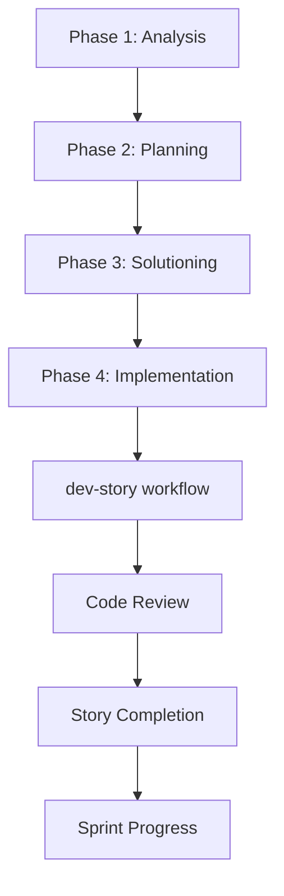

**图表来源**
- [src/modules/bmm/docs/workflows-implementation.md](file://src/modules/bmm/docs/workflows-implementation.md#L1-L27)

## 工作流架构

### 双版本架构设计

BMAD方法论提供了两套开发故事工作流，分别针对不同的应用场景：

#### BMB模块架构
适用于传统模块化开发场景，提供更灵活的配置选项和扩展能力。

#### BMM模块架构  
专为敏捷开发团队设计，集成到完整的BMAD方法论生态系统中。

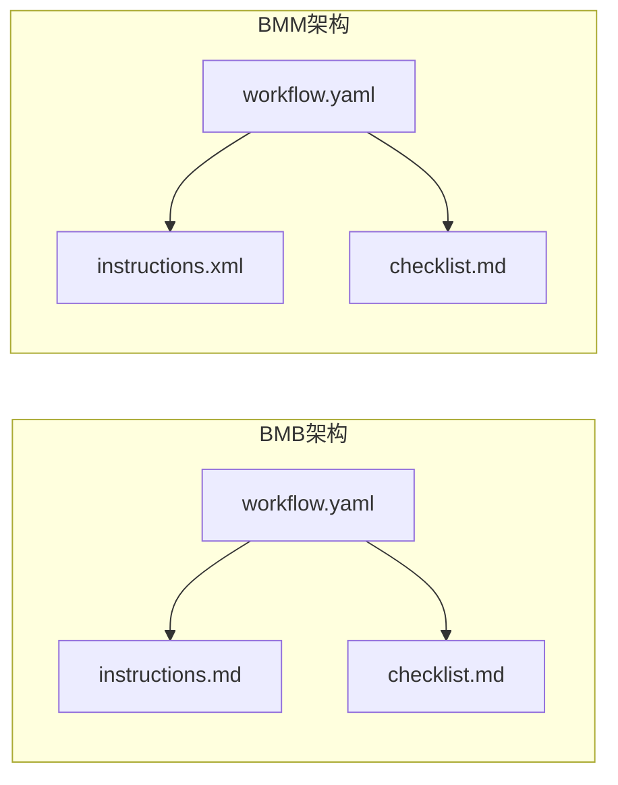

**图表来源**
- [src/modules/bmb/workflows-legacy/create-module/workflow.yaml](file://src/modules/bmb/workflows-legacy/create-module/workflow.yaml#L1-L53)
- [src/modules/bmm/workflows/4-implementation/dev-story/workflow.yaml](file://src/modules/bmm/workflows/4-implementation/dev-story/workflow.yaml#L1-L28)

**章节来源**
- [src/modules/bmgd/workflows/4-production/dev-story/workflow.yaml](file://src/modules/bmgd/workflows/4-production/dev-story/workflow.yaml#L1-L59)
- [src/modules/bmm/workflows/4-implementation/dev-story/workflow.yaml](file://src/modules/bmm/workflows/4-implementation/dev-story/workflow.yaml#L1-L28)

## 核心组件分析

### 配置管理系统

开发故事工作流通过复杂的配置系统管理项目上下文和环境变量：

#### 关键配置参数

| 参数名称 | 类型 | 描述 | 默认值 |
|---------|------|------|--------|
| `config_source` | 字符串 | 配置文件源路径 | `{project-root}/{bmad_folder}/bmgd/config.yaml` |
| `output_folder` | 字符串 | 输出目录路径 | 动态生成 |
| `user_name` | 字符串 | 用户标识 | 配置文件中定义 |
| `communication_language` | 字符串 | 通信语言 | 配置文件中定义 |
| `user_skill_level` | 字符串 | 用户技能级别 | 配置文件中定义 |
| `document_output_language` | 字符串 | 文档输出语言 | 配置文件中定义 |

#### 输入文件模式管理

工作流支持智能的输入文件发现和加载策略：

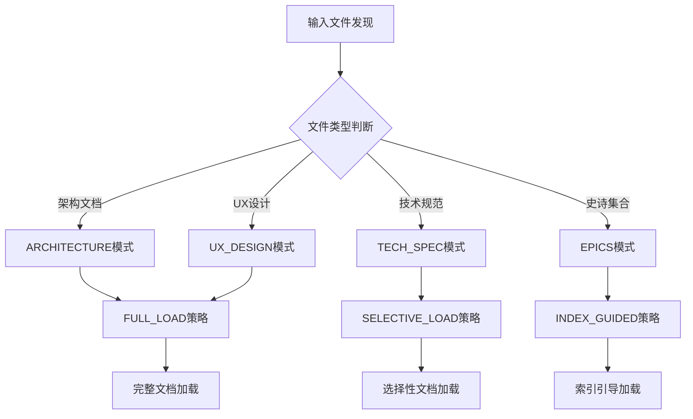

**图表来源**
- [src/modules/bmgd/workflows/4-production/dev-story/workflow.yaml](file://src/modules/bmgd/workflows/4-production/dev-story/workflow.yaml#L24-L49)

**章节来源**
- [src/modules/bmgd/workflows/4-production/dev-story/workflow.yaml](file://src/modules/bmgd/workflows/4-production/dev-story/workflow.yaml#L5-L20)

### 执行引擎设计

#### 步骤化执行流程

开发故事工作流采用严格的步骤化执行模型，确保每个阶段都得到充分验证：

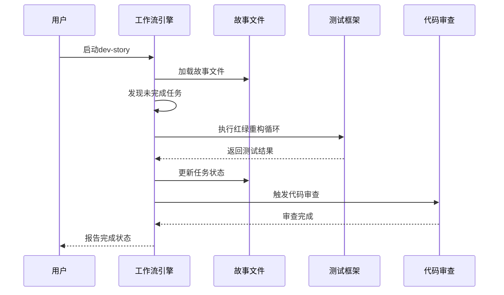

**图表来源**
- [src/modules/bmm/workflows/4-implementation/dev-story/instructions.xml](file://src/modules/bmm/workflows/4-implementation/dev-story/instructions.xml#L221-L249)

**章节来源**
- [src/modules/bmm/workflows/4-implementation/dev-story/instructions.xml](file://src/modules/bmm/workflows/4-implementation/dev-story/instructions.xml#L1-L406)

## 状态转换机制

### 故事生命周期状态

开发故事工作流实现了完整的状态转换机制，确保每个故事都按照既定流程推进：

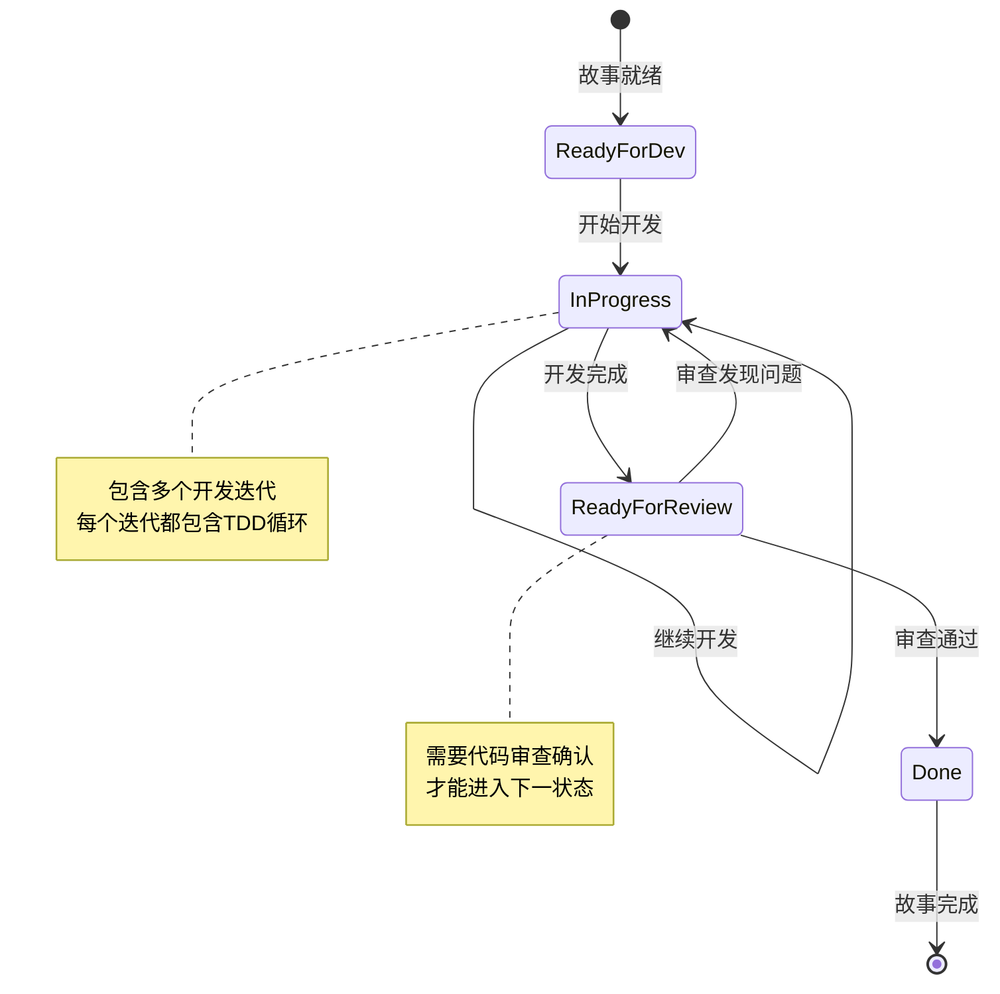

**图表来源**
- [src/modules/bmm/docs/workflows-implementation.md](file://src/modules/bmm/docs/workflows-implementation.md#L68-L76)

### 智能状态检测

工作流具备智能的状态检测能力，能够自动识别当前开发阶段并相应调整执行策略：

#### 审查延续检测

当故事需要修复审查中发现的问题时，工作流会自动识别并优先处理审查反馈：

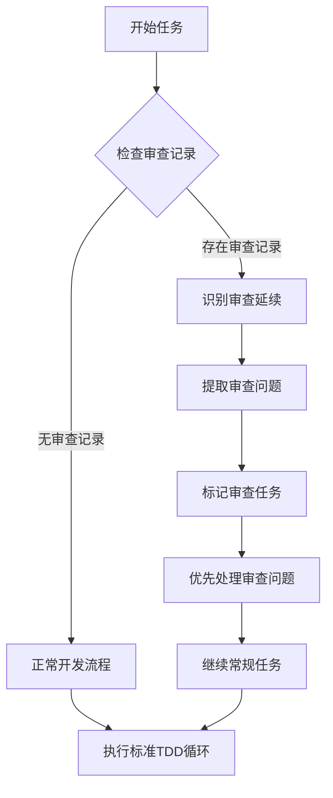

**图表来源**
- [src/modules/bmm/workflows/4-implementation/dev-story/instructions.xml](file://src/modules/bmm/workflows/4-implementation/dev-story/instructions.xml#L147-L184)

**章节来源**
- [src/modules/bmm/workflows/4-implementation/dev-story/instructions.xml](file://src/modules/bmm/workflows/4-implementation/dev-story/instructions.xml#L147-L184)

## 开发任务指令集

### TDD循环执行

开发故事工作流严格遵循测试驱动开发（TDD）循环，确保代码质量和功能正确性：

#### 红绿重构三阶段


**图表来源**
- [src/modules/bmm/workflows/4-implementation/dev-story/instructions.xml](file://src/modules/bmm/workflows/4-implementation/dev-story/instructions.xml#L221-L249)

#### 任务分解原则

每个任务都必须严格遵循故事文件中的描述，不允许添加额外功能：

| 任务类型 | 执行要求 | 验证标准 |
|---------|----------|----------|
| 功能实现 | 严格按照Acceptance Criteria | 所有AC必须满足 |
| 边界处理 | 覆盖所有边缘情况 | 测试覆盖率100% |
| 错误处理 | 实现适当的错误响应 | 异常场景测试通过 |
| 性能考虑 | 符合性能要求 | 性能基准测试通过 |

**章节来源**
- [src/modules/bmm/workflows/4-implementation/dev-story/instructions.xml](file://src/modules/bmm/workflows/4-implementation/dev-story/instructions.xml#L221-L249)

### 编码规范指导

#### 文件边界管理

工作流严格执行文件边界，确保每个变更都在指定范围内：

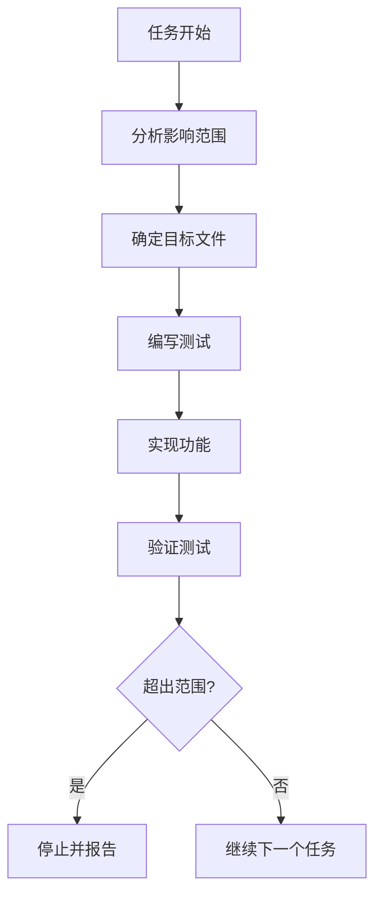

**图表来源**
- [src/modules/bmm/workflows/4-implementation/dev-story/instructions.xml](file://src/modules/bmm/workflows/4-implementation/dev-story/instructions.xml#L240-L249)

#### 代码质量标准

工作流要求所有代码必须符合以下质量标准：

- **测试覆盖率**：核心功能100%测试覆盖率
- **代码风格**：遵循项目编码规范
- **文档完整性**：新增功能必须包含文档注释
- **依赖管理**：不引入未经批准的外部依赖

**章节来源**
- [src/modules/bmm/workflows/4-implementation/dev-story/instructions.xml](file://src/modules/bmm/workflows/4-implementation/dev-story/instructions.xml#L251-L267)

## 质量检查体系

### 开发质量检查清单

开发故事工作流包含全面的质量检查体系，确保交付物符合专业标准：

#### 核心检查项目

```mermaid
mindmap
root((开发质量检查))
任务完成度
所有任务标记完成
满足所有验收标准
无遗漏子任务
测试质量
单元测试覆盖
集成测试验证
端到端测试
静态代码分析
文件完整性
文件列表更新
变更日志记录
调试信息保存
状态正确更新
最终状态
回归测试通过
故事状态更新
准备审查状态
```

**图表来源**
- [src/modules/bmgd/workflows/4-production/dev-story/checklist.md](file://src/modules/bmgd/workflows/4-production/dev-story/checklist.md#L15-L39)

#### 检查项详细说明

| 检查类别 | 具体项目 | 验证方法 | 不符合后果 |
|---------|----------|----------|-----------|
| 任务完成 | 所有任务标记[x] | 自动扫描故事文件 | 无法标记完成 |
| 测试质量 | 所有测试通过 | 运行测试套件 | 需修复测试 |
| 文件完整性 | 文件列表完整 | 对比修改前后 | 需补充文件信息 |
| 状态更新 | 故事状态正确 | 检查状态字段 | 需手动修正 |

**章节来源**
- [src/modules/bmgd/workflows/4-production/dev-story/checklist.md](file://src/modules/bmgd/workflows/4-production/dev-story/checklist.md#L15-L39)

### 自动化验证机制

#### 定义完成验证

工作流实现了增强的定义完成（Definition of Done）验证机制：

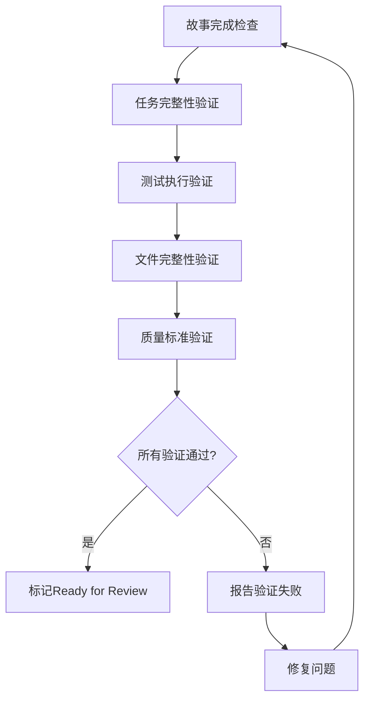

**图表来源**
- [src/modules/bmm/workflows/4-implementation/dev-story/instructions.xml](file://src/modules/bmm/workflows/4-implementation/dev-story/instructions.xml#L320-L340)

**章节来源**
- [src/modules/bmm/workflows/4-implementation/dev-story/instructions.xml](file://src/modules/bmm/workflows/4-implementation/dev-story/instructions.xml#L320-L340)

## 实施模式对比

### BMB vs BMM 架构差异

两种架构在设计理念和适用场景上存在显著差异：

#### 功能特性对比

| 特性 | BMB架构 | BMM架构 |
|------|---------|---------|
| 配置复杂度 | 高，支持自定义配置 | 中等，标准化配置 |
| 扩展能力 | 强，模块化设计 | 中等，工作流集成 |
| 学习曲线 | 较陡峭 | 相对平缓 |
| 适用场景 | 复杂项目，定制需求 | 标准敏捷开发 |

#### 执行效率对比

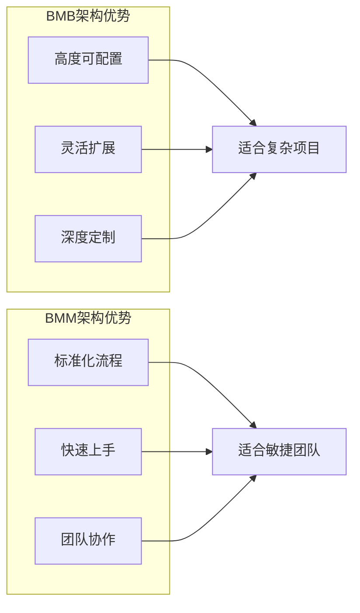

**图表来源**
- [src/modules/bmb/workflows-legacy/create-module/workflow.yaml](file://src/modules/bmb/workflows-legacy/create-module/workflow.yaml#L1-L53)
- [src/modules/bmm/workflows/4-implementation/dev-story/workflow.yaml](file://src/modules/bmm/workflows/4-implementation/dev-story/workflow.yaml#L1-L28)

**章节来源**
- [src/modules/bmb/workflows-legacy/create-module/workflow.yaml](file://src/modules/bmb/workflows-legacy/create-module/workflow.yaml#L1-L53)
- [src/modules/bmm/workflows/4-implementation/dev-story/workflow.yaml](file://src/modules/bmm/workflows/4-implementation/dev-story/workflow.yaml#L1-L28)

## 使用示例

### 完整开发流程示例

以下是一个典型的开发故事工作流使用示例：

#### 场景：实现用户认证功能

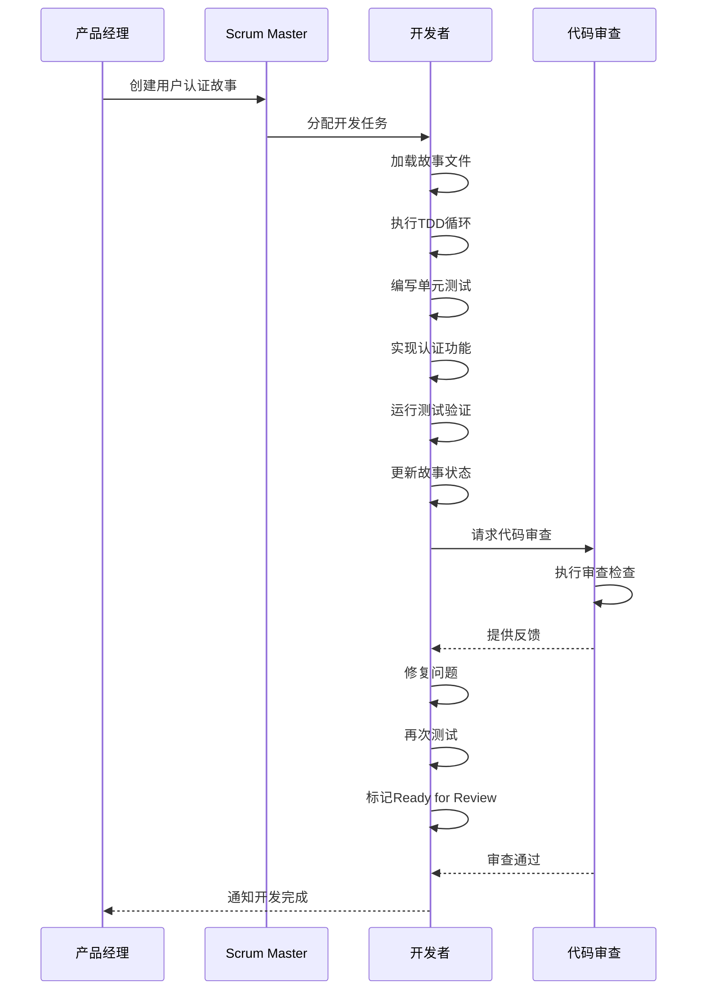

**图表来源**
- [src/modules/bmm/docs/workflows-implementation.md](file://src/modules/bmm/docs/workflows-implementation.md#L80-L108)

#### 实际操作步骤

1. **准备阶段**
   - 确认故事状态为"ready-for-dev"
   - 加载项目上下文和相关文档
   - 准备开发环境

2. **开发阶段**
   - 从故事文件中提取第一个未完成任务
   - 执行红绿重构循环
   - 记录开发过程和决策

3. **验证阶段**
   - 运行所有相关测试
   - 验证是否满足所有验收标准
   - 更新故事文件状态

4. **提交阶段**
   - 标记任务完成
   - 准备代码审查材料
   - 通知相关人员

**章节来源**
- [src/modules/bmm/workflows/4-implementation/dev-story/instructions.xml](file://src/modules/bmm/workflows/4-implementation/dev-story/instructions.xml#L15-L132)

### 常见使用模式

#### 快速修复模式

适用于简单的bug修复或小功能增强：

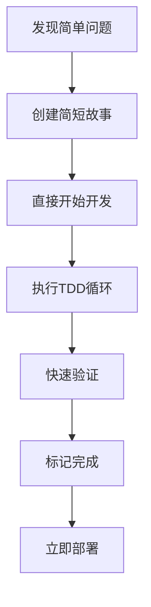

#### 复杂功能模式

适用于大型功能开发：

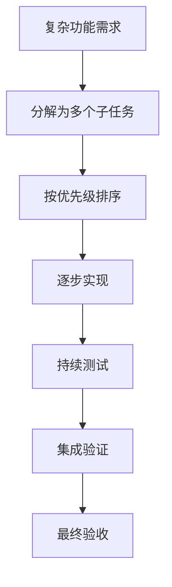

## 常见问题与解决方案

### 任务理解偏差

#### 问题描述
开发者可能误解故事要求或验收标准，导致实现偏离预期。

#### 解决方案
1. **明确沟通**：在开始开发前，仔细阅读故事描述和验收标准
2. **问题澄清**：遇到不确定的地方及时向产品经理或Scrum Master咨询
3. **原型验证**：必要时创建简单的原型来验证理解

#### 预防措施
- 建立清晰的需求文档标准
- 实施需求评审流程
- 提供充分的需求培训

### 检查项遗漏

#### 问题描述
开发者可能忘记执行某些质量检查项目，导致故事无法完成。

#### 解决方案
1. **清单驱动**：严格按照检查清单执行每个步骤
2. **自动化辅助**：利用工作流的自动验证功能
3. **同行检查**：让同事协助检查遗漏项

#### 预防措施
- 建立检查清单模板
- 实施定期的质量回顾
- 提供质量意识培训

### 上下文丢失

#### 问题描述
长时间开发可能导致上下文丢失，影响开发效率和质量。

#### 解决方案
1. **定期保存**：频繁保存工作进度
2. **上下文记录**：在Dev Agent Record中记录重要决策
3. **状态同步**：定期与团队同步开发状态

#### 预防措施
- 建立良好的开发习惯
- 使用版本控制系统
- 实施定期的状态检查

**章节来源**
- [src/modules/bmm/workflows/4-implementation/dev-story/instructions.xml](file://src/modules/bmm/workflows/4-implementation/dev-story/instructions.xml#L130-L132)

## 最佳实践

### 开发前准备

#### 环境配置
- 确保开发环境已正确配置
- 验证测试框架正常工作
- 准备必要的工具和资源

#### 上下文理解
- 仔细阅读故事文件和相关文档
- 理解业务背景和目标
- 识别潜在的技术风险

### 开发过程控制

#### TDD实践
- 始终先写测试
- 保持测试的独立性和可重复性
- 及时重构提高代码质量

#### 代码质量
- 遵循团队编码规范
- 编写清晰的注释和文档
- 避免过度工程化

### 质量保证

#### 自我验证
- 在提交前运行所有测试
- 检查代码风格和格式
- 验证功能是否满足需求

#### 团队协作
- 及时沟通遇到的问题
- 主动寻求代码审查
- 分享经验和最佳实践

### 持续改进

#### 反馈收集
- 收集团队成员的反馈
- 分析开发过程中的瓶颈
- 识别改进机会

#### 流程优化
- 定期回顾工作流程
- 更新最佳实践指南
- 培训新团队成员

**章节来源**
- [src/modules/bmm/docs/workflows-implementation.md](file://src/modules/bmm/docs/workflows-implementation.md#L116-L172)

## 结论

开发故事工作流是BMAD方法论实现阶段的核心工具，通过严格的TDD流程、完善的质量检查体系和智能化的状态管理，确保软件开发的质量和效率。无论是简单的bug修复还是复杂的功能开发，该工作流都能提供一致、可靠的方法论支撑。

随着BMAD方法论的不断发展，开发故事工作流也在持续优化，更好地适应不同规模和类型的项目需求。开发者应该深入理解其原理和最佳实践，充分发挥这一工具的价值，提升软件开发的整体质量。