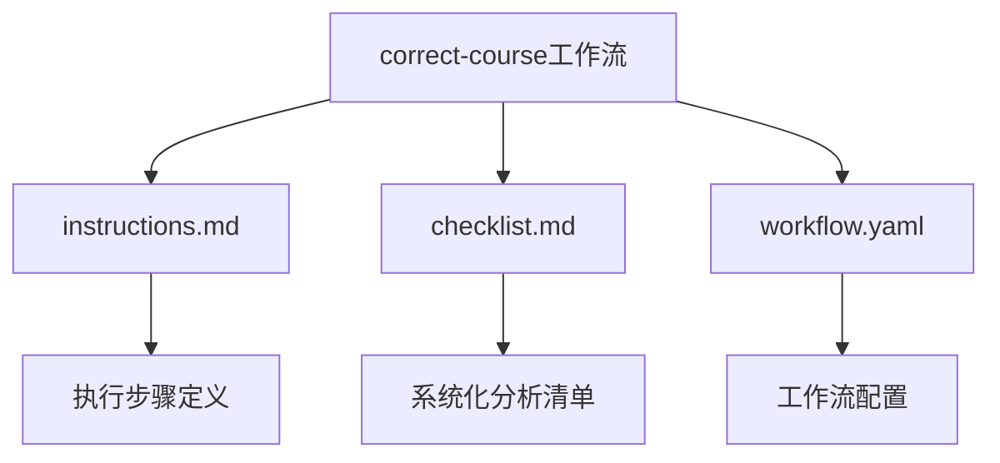
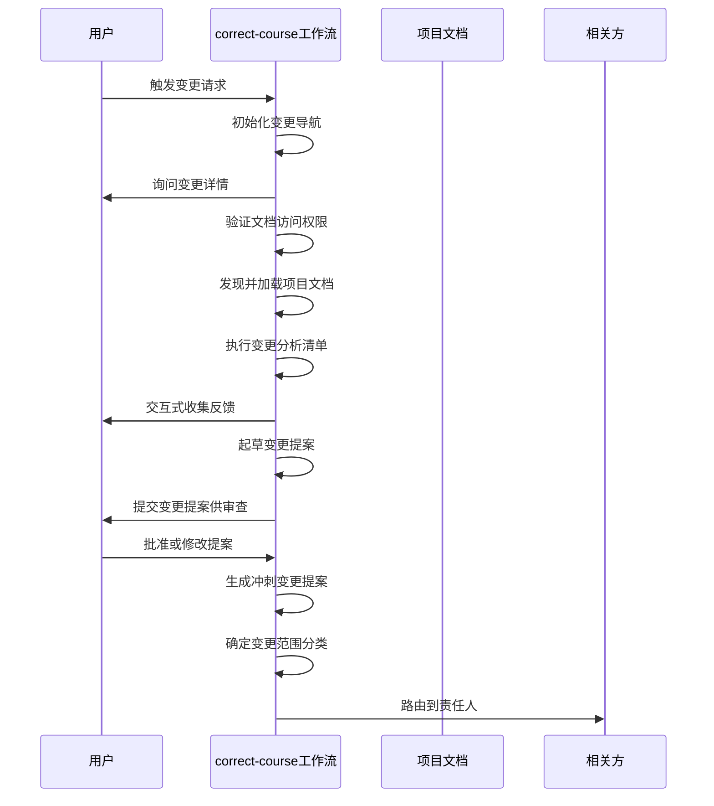
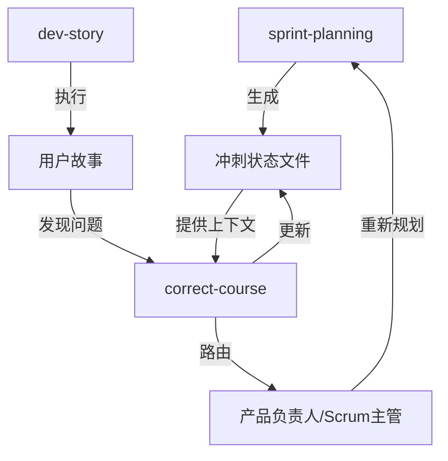
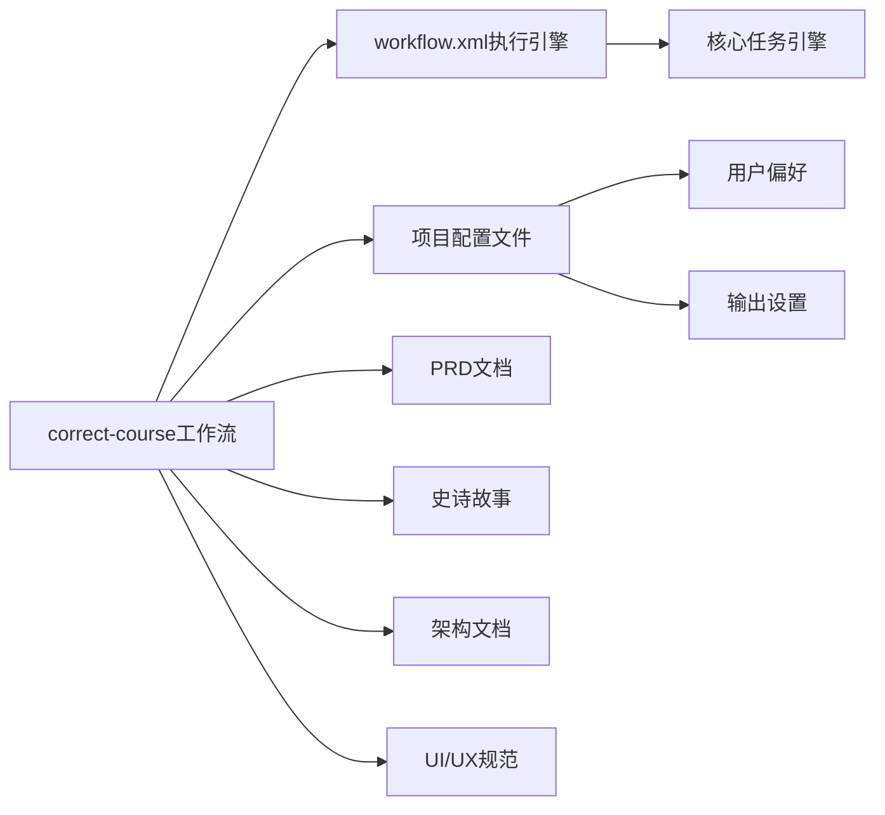

# 项目纠偏

<cite>
**本文档中引用的文件**  
- [instructions.md](file://src/modules/bmm/workflows/4-implementation/correct-course/instructions.md)
- [checklist.md](file://src/modules/bmm/workflows/4-implementation/correct-course/checklist.md)
- [workflow.yaml](file://src/modules/bmm/workflows/4-implementation/correct-course/workflow.yaml)
- [dev-story/workflow.yaml](file://src/modules/bmm/workflows/4-implementation/dev-story/workflow.yaml)
- [sprint-planning/workflow.yaml](file://src/modules/bmm/workflows/4-implementation/sprint-planning/workflow.yaml)
- [agents-guide.md](file://src/modules/bmm/docs/agents-guide.md)
</cite>

## 目录
1. [引言](#引言)
2. [项目结构](#项目结构)
3. [核心组件](#核心组件)
4. [架构概述](#架构概述)
5. [详细组件分析](#详细组件分析)
6. [依赖分析](#依赖分析)
7. [性能考虑](#性能考虑)
8. [故障排除指南](#故障排除指南)
9. [结论](#结论)

## 引言
项目纠偏工作流是BMAD方法论中用于处理项目执行过程中出现的重大偏差的关键机制。该工作流提供了一套系统化的流程，帮助团队识别项目风险和问题根源，制定纠正措施，并将变更请求正确地路由到相应的责任人。通过与日常开发工作流（如dev-story和sprint-planning）的集成，correct-course工作流能够在问题出现的早期阶段就及时发现并解决偏差，确保项目始终朝着正确的方向前进。

## 项目结构
项目纠偏功能主要分布在两个模块中：bmgd（BM Game Development）和bmm（BM Method）。这两个模块中的correct-course工作流具有相同的结构和功能，分别位于`src/modules/bmgd/workflows/4-production/correct-course/`和`src/modules/bmm/workflows/4-implementation/correct-course/`目录下。每个目录包含三个核心文件：instructions.md定义了工作流的执行步骤，checklist.md提供了系统化的分析清单，workflow.yaml则配置了工作流的元数据和输入输出设置。

**Diagram sources**
- [workflow.yaml](file://src/modules/bmm/workflows/4-implementation/correct-course/workflow.yaml)

**Section sources**
- [workflow.yaml](file://src/modules/bmm/workflows/4-implementation/correct-course/workflow.yaml)

## 核心组件
项目纠偏工作流的核心组件包括诊断流程、纠正措施指导和决策机制。诊断流程通过instructions.md中定义的六个步骤系统性地识别项目风险和问题根源。纠正措施指导则通过checklist.md中的详细清单，为团队提供恢复项目正轨的具体操作步骤。决策机制帮助团队根据变更的严重程度选择最合适的纠正策略，包括直接调整、潜在回滚或MVP审查。

**Section sources**
- [instructions.md](file://src/modules/bmm/workflows/4-implementation/correct-course/instructions.md)
- [checklist.md](file://src/modules/bmm/workflows/4-implementation/correct-course/checklist.md)

## 架构概述
项目纠偏工作流的架构设计遵循模块化和可重用的原则。它通过workflow.yaml文件中的配置项与项目其他部分进行集成，特别是通过`config_source`引用项目配置，通过`input_file_patterns`发现和加载项目文档。工作流的执行由核心任务引擎`{project-root}/{bmad_folder}/core/tasks/workflow.xml`控制，确保了执行的一致性和可靠性。

**Diagram sources**
- [workflow.yaml](file://src/modules/bmm/workflows/4-implementation/correct-course/workflow.yaml)
- [instructions.md](file://src/modules/bmm/workflows/4-implementation/correct-course/instructions.md)

## 详细组件分析

### 纠偏工作流分析
correct-course工作流通过一个六步流程系统性地处理项目偏差。第一步是初始化变更导航，确认变更触发点并收集用户对问题的描述。第二步是执行变更分析清单，通过与用户交互的方式系统性地评估变更的影响。第三步是起草具体的变更提案，为每个受影响的工件创建明确的编辑建议。

#### 对于API/服务组件：

**Diagram sources**
- [instructions.md](file://src/modules/bmm/workflows/4-implementation/correct-course/instructions.md)
- [checklist.md](file://src/modules/bmm/workflows/4-implementation/correct-course/checklist.md)

**Section sources**
- [instructions.md](file://src/modules/bmm/workflows/4-implementation/correct-course/instructions.md)
- [checklist.md](file://src/modules/bmm/workflows/4-implementation/correct-course/checklist.md)

### 与其他工作流的集成
correct-course工作流与dev-story和sprint-planning等实现阶段工作流紧密集成。当开发人员在执行dev-story工作流时遇到无法解决的问题，可以触发correct-course工作流来处理范围变更。sprint-planning工作流生成的冲刺状态文件为correct-course工作流提供了必要的上下文信息，使其能够准确评估变更对当前冲刺的影响。

**Diagram sources**
- [sprint-planning/workflow.yaml](file://src/modules/bmm/workflows/4-implementation/sprint-planning/workflow.yaml)
- [dev-story/workflow.yaml](file://src/modules/bmm/workflows/4-implementation/dev-story/workflow.yaml)

**Section sources**
- [sprint-planning/workflow.yaml](file://src/modules/bmm/workflows/4-implementation/sprint-planning/workflow.yaml)
- [dev-story/workflow.yaml](file://src/modules/bmm/workflows/4-implementation/dev-story/workflow.yaml)

## 依赖分析
项目纠偏工作流依赖于多个核心组件和项目文档。它依赖于workflow.xml执行引擎来驱动工作流的执行，依赖于项目配置文件来获取用户偏好和输出设置，依赖于PRD、史诗故事、架构文档和UI/UX规范等项目文档来评估变更的影响。这些依赖关系确保了工作流能够全面、准确地分析变更请求，并生成可操作的纠正方案。

**Diagram sources**
- [workflow.yaml](file://src/modules/bmm/workflows/4-implementation/correct-course/workflow.yaml)
- [instructions.md](file://src/modules/bmm/workflows/4-implementation/correct-course/instructions.md)

**Section sources**
- [workflow.yaml](file://src/modules/bmm/workflows/4-implementation/correct-course/workflow.yaml)
- [instructions.md](file://src/modules/bmm/workflows/4-implementation/correct-course/instructions.md)

## 性能考虑
项目纠偏工作流的设计考虑了执行效率和用户体验。通过提供增量和批量两种模式，用户可以根据具体情况选择最适合的交互方式。增量模式推荐用于复杂的变更，允许用户逐步审查和细化每个变更提案；批量模式适用于简单的变更，可以一次性提交所有变更供审查。这种灵活性确保了工作流既能处理复杂的项目偏差，又能高效地处理简单的变更请求。

## 故障排除指南
当项目纠偏工作流无法正常执行时，最常见的原因是变更触发点不明确或核心项目文档不可访问。工作流在第一步就设置了明确的停止条件：如果无法清楚理解触发变更的问题，或者无法访问PRD、史诗故事、架构和UI/UX等核心文档，工作流将停止执行并提示用户提供必要的信息。此外，如果用户未明确批准变更提案，工作流也不会继续执行，确保了所有变更都经过适当的审查和授权。

**Section sources**
- [instructions.md](file://src/modules/bmm/workflows/4-implementation/correct-course/instructions.md)
- [checklist.md](file://src/modules/bmm/workflows/4-implementation/correct-course/checklist.md)

## 结论
项目纠偏工作流是BMAD方法论中确保项目成功的关键组成部分。通过提供系统化的诊断流程、详细的纠正措施指导和清晰的决策机制，该工作流帮助团队有效地识别和解决项目执行过程中的偏差。与日常开发工作流的紧密集成使得团队能够在问题出现的早期阶段就及时发现并解决，最大限度地减少了对项目进度和质量的影响。通过遵循本文档中描述的最佳实践，团队可以充分利用correct-course工作流的功能，确保项目始终朝着正确的方向前进。