# 工作流状态管理

<cite>
**本文档中引用的文件**
- [workflow.yaml](file://src/modules/bmm/workflows/workflow-status/workflow.yaml)
- [project-levels.yaml](file://src/modules/bmm/workflows/workflow-status/project-levels.yaml)
- [workflow-status-template.yaml](file://src/modules/bmm/workflows/workflow-status/workflow-status-template.yaml)
- [enterprise-greenfield.yaml](file://src/modules/bmm/workflows/workflow-status/paths/enterprise-greenfield.yaml)
- [method-greenfield.yaml](file://src/modules/bmm/workflows/workflow-status/paths/method-greenfield.yaml)
- [enterprise-brownfield.yaml](file://src/modules/bmm/workflows/workflow-status/paths/enterprise-brownfield.yaml)
- [method-brownfield.yaml](file://src/modules/bmm/workflows/workflow-status/paths/method-brownfield.yaml)
- [init/workflow.yaml](file://src/modules/bmm/workflows/workflow-status/init/workflow.yaml)
- [instructions.md](file://src/modules/bmm/workflows/workflow-status/instructions.md)
- [init/instructions.md](file://src/modules/bmm/workflows/workflow-status/init/instructions.md)
</cite>

## 目录
1. [简介](#简介)
2. [系统架构概览](#系统架构概览)
3. [核心组件分析](#核心组件分析)
4. [项目成熟度等级](#项目成熟度等级)
5. [路径配置文件详解](#路径配置文件详解)
6. [状态管理生命周期](#状态管理生命周期)
7. [服务模式与交互](#服务模式与交互)
8. [故障排除指南](#故障排除指南)
9. [总结](#总结)

## 简介

BMAD-METHOD的工作流状态管理系统是一个智能化的项目进度跟踪框架，旨在为软件开发项目提供结构化的状态管理和进度控制。该系统通过workflow-status模块协调整个状态管理流程，支持从项目初始化到实施阶段的完整生命周期管理。

系统的核心设计理念是提供一个轻量级但功能完备的状态检查器，能够回答"我现在应该做什么？"这一关键问题。它通过读取YAML状态文件来跟踪工作流进展，并为各种类型的项目（绿色字段、棕色字段）提供定制化的工作流路径。

## 系统架构概览

工作流状态管理系统采用分层架构设计，包含以下主要层次：

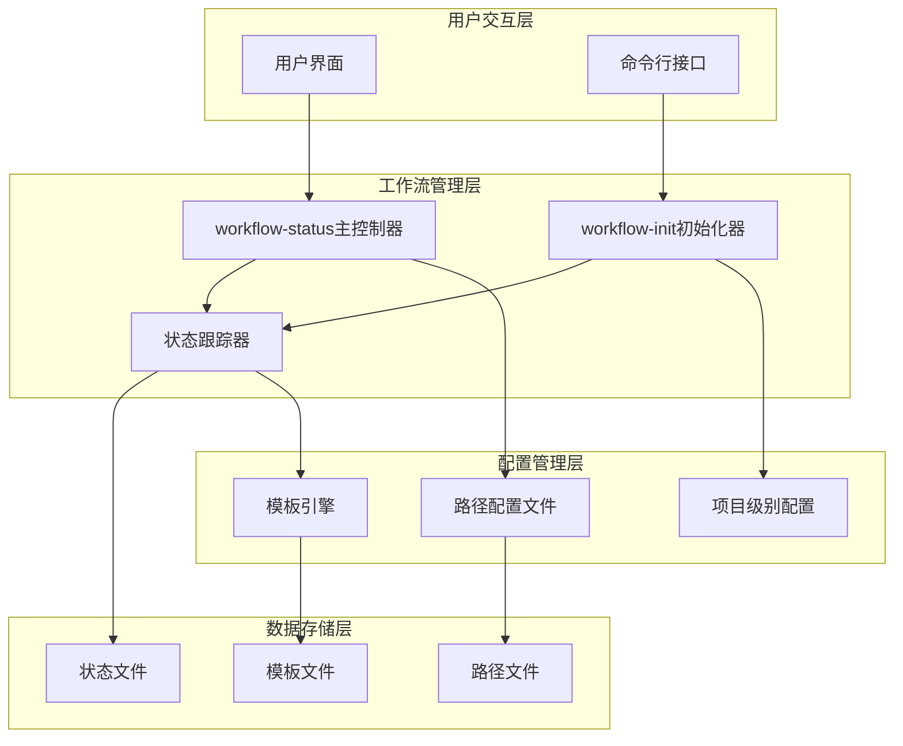

**图表来源**
- [workflow.yaml](file://src/modules/bmm/workflows/workflow-status/workflow.yaml#L1-L31)
- [init/workflow.yaml](file://src/modules/bmm/workflows/workflow-status/init/workflow.yaml#L1-L30)

**章节来源**
- [workflow.yaml](file://src/modules/bmm/workflows/workflow-status/workflow.yaml#L1-L31)
- [init/workflow.yaml](file://src/modules/bmm/workflows/workflow-status/init/workflow.yaml#L1-L30)

## 核心组件分析

### workflow-status 主控制器

workflow-status是整个状态管理系统的核心控制器，负责协调各个工作流组件的执行。其主要职责包括：

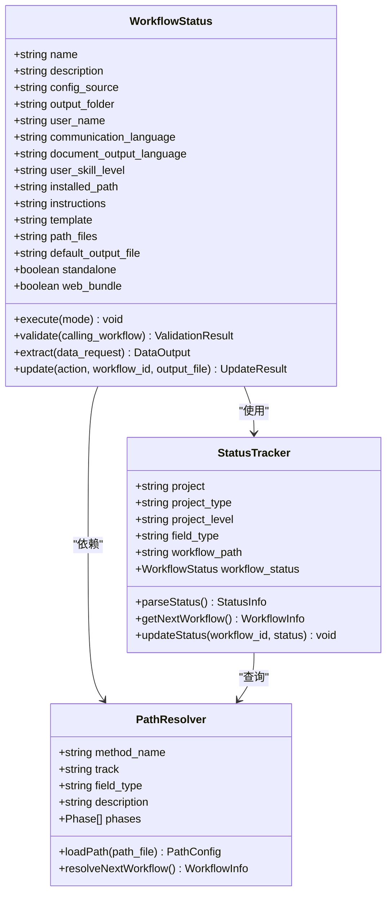

**图表来源**
- [workflow.yaml](file://src/modules/bmm/workflows/workflow-status/workflow.yaml#L1-L31)
- [workflow-status-template.yaml](file://src/modules/bmm/workflows/workflow-status/workflow-status-template.yaml#L1-L25)

### workflow-init 初始化器

workflow-init专门负责新项目的初始化设置，根据项目特征自动选择合适的工作流路径：

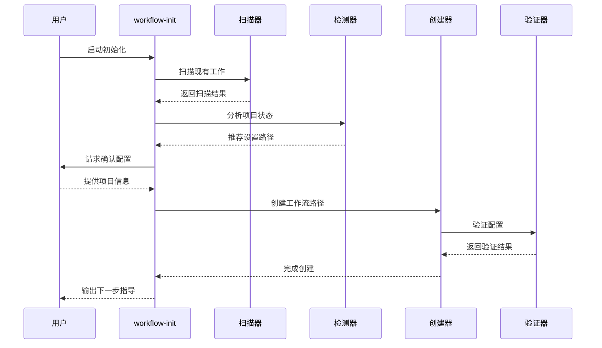

**图表来源**
- [init/instructions.md](file://src/modules/bmm/workflows/workflow-status/init/instructions.md#L1-L347)
- [init/workflow.yaml](file://src/modules/bmm/workflows/workflow-status/init/workflow.yaml#L1-L30)

**章节来源**
- [workflow.yaml](file://src/modules/bmm/workflows/workflow-status/workflow.yaml#L1-L31)
- [init/workflow.yaml](file://src/modules/bmm/workflows/workflow-status/init/workflow.yaml#L1-L30)

## 项目成熟度等级

项目成熟度等级系统提供了标准化的项目分类框架，帮助确定合适的规划方法和资源投入：

| 等级 | 名称 | 故事数量 | 描述 | 文档要求 | 架构需求 |
|------|------|----------|------|----------|----------|
| Level 0 | 单原子变更 | 1个故事 | Bug修复、小功能、单一微小变更 | 最小化 - 仅技术规范 | 否 |
| Level 1 | 小型功能 | 1-10个故事 | 小的连贯功能、最小文档 | 技术规范 | 否 |
| Level 2 | 中型项目 | 5-15个故事 | 多个功能、聚焦的产品需求文档 | 产品需求文档 + 可选技术规范 | 否 |
| Level 3 | 复杂系统 | 12-40个故事 | 子系统、集成、完整架构 | 产品需求文档 + 架构 + JIT技术规范 | 是 |
| Level 4 | 企业规模 | 40+个故事 | 多个产品、企业级架构 | 产品需求文档 + 架构 + JIT技术规范 | 是 |

系统还提供了智能检测提示，基于关键词和故事数量自动识别项目等级：

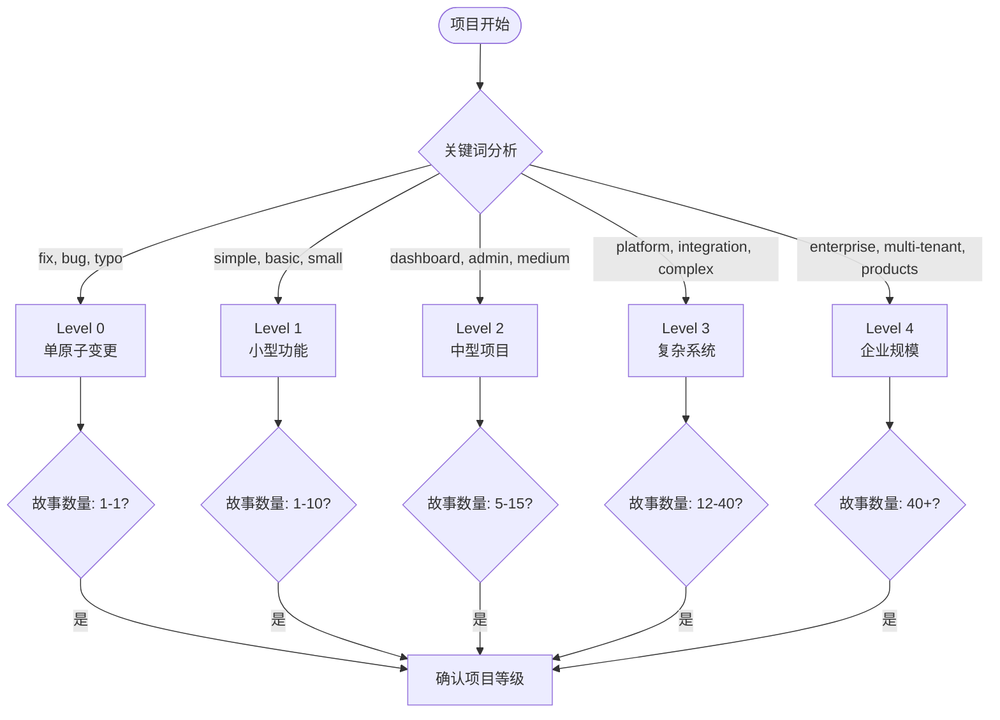

**图表来源**
- [project-levels.yaml](file://src/modules/bmm/workflows/workflow-status/project-levels.yaml#L1-L60)

**章节来源**
- [project-levels.yaml](file://src/modules/bmm/workflows/workflow-status/project-levels.yaml#L1-L60)

## 路径配置文件详解

路径配置文件定义了不同类型项目的工作流序列和阶段划分。系统支持四种主要路径配置：

### 方法绿色字段路径 (Method Greenfield)

适用于新构建的项目，提供完整的规划和解决方案阶段：

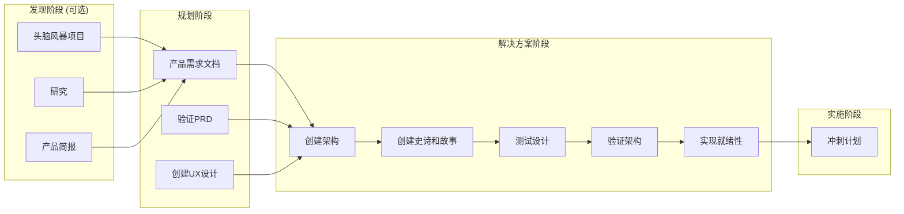

**图表来源**
- [method-greenfield.yaml](file://src/modules/bmm/workflows/workflow-status/paths/method-greenfield.yaml#L1-L103)

### 企业绿色字段路径 (Enterprise Greenfield)

扩展的企业级绿色字段路径，增加了安全、DevOps和测试策略：

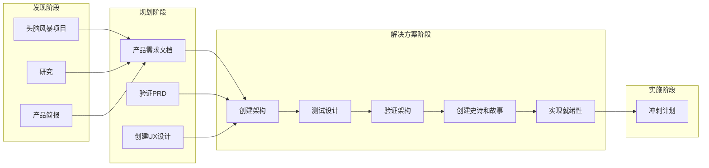

**图表来源**
- [enterprise-greenfield.yaml](file://src/modules/bmm/workflows/workflow-status/paths/enterprise-greenfield.yaml#L1-L116)

### 方法棕色字段路径 (Method Brownfield)

针对现有代码库的复杂改造项目：

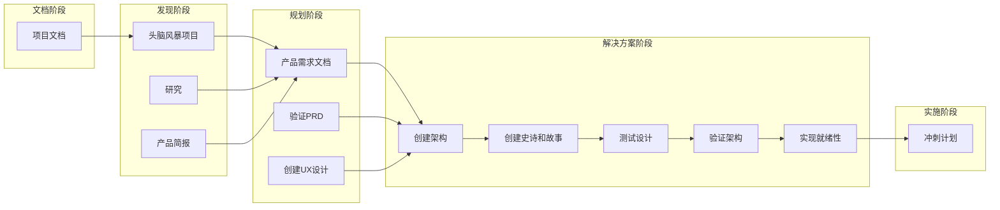

**图表来源**
- [method-brownfield.yaml](file://src/modules/bmm/workflows/workflow-status/paths/method-brownfield.yaml#L1-L112)

### 企业棕色字段路径 (Enterprise Brownfield)

企业级棕色字段路径，强调文档化和合规性：

**图表来源**
- [enterprise-brownfield.yaml](file://src/modules/bmm/workflows/workflow-status/paths/enterprise-brownfield.yaml#L1-L128)

**章节来源**
- [method-greenfield.yaml](file://src/modules/bmm/workflows/workflow-status/paths/method-greenfield.yaml#L1-L103)
- [enterprise-greenfield.yaml](file://src/modules/bmm/workflows/workflow-status/paths/enterprise-greenfield.yaml#L1-L116)
- [method-brownfield.yaml](file://src/modules/bmm/workflows/workflow-status/paths/method-brownfield.yaml#L1-L112)
- [enterprise-brownfield.yaml](file://src/modules/bmm/workflows/workflow-status/paths/enterprise-brownfield.yaml#L1-L128)

## 状态管理生命周期

工作流状态管理系统遵循严格的生命周期管理，确保项目按计划推进：

### 初始化阶段

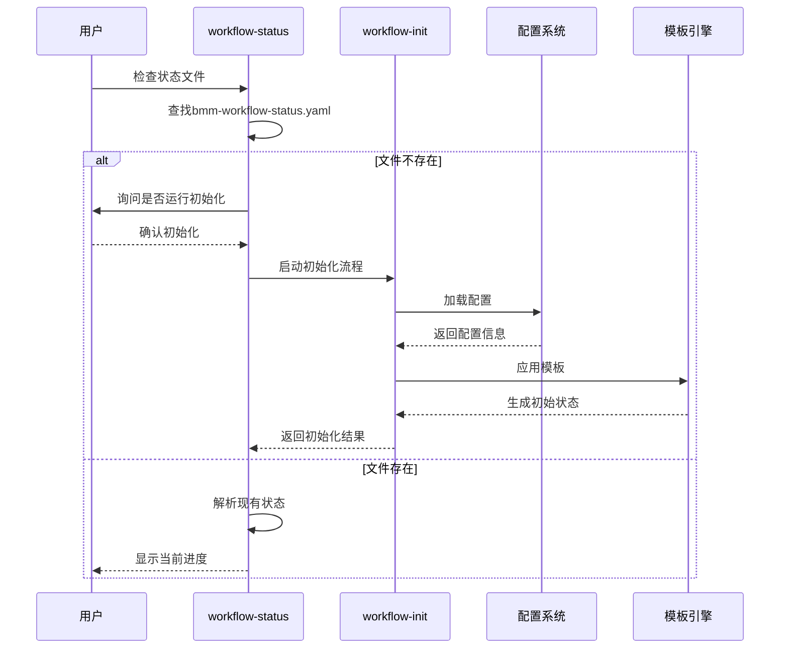

**图表来源**
- [instructions.md](file://src/modules/bmm/workflows/workflow-status/instructions.md#L39-L84)

### 进度跟踪阶段

系统通过状态文件跟踪每个工作流的完成情况：

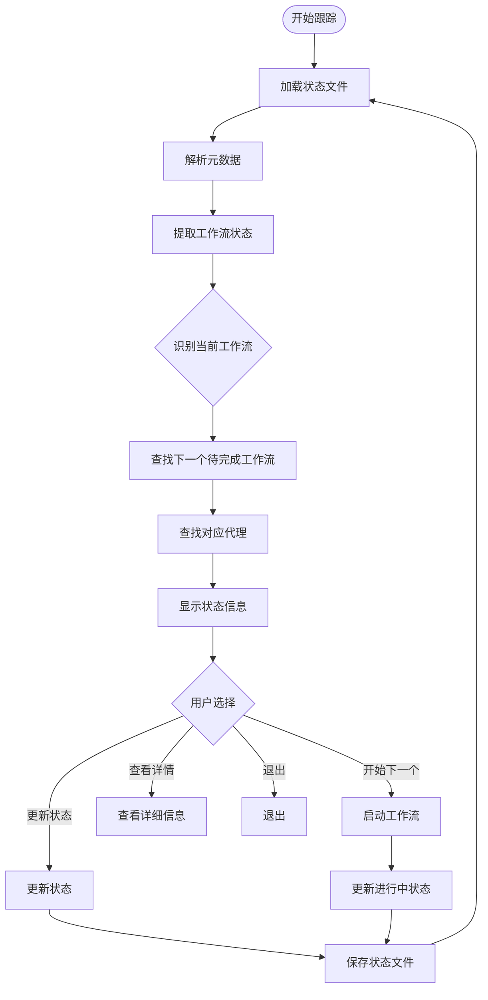

**图表来源**
- [instructions.md](file://src/modules/bmm/workflows/workflow-status/instructions.md#L85-L140)

### 状态转换规则

系统定义了明确的状态转换规则，确保工作流的正确执行：

| 当前状态 | 允许的操作 | 下一状态 | 条件 |
|----------|------------|----------|------|
| 未开始 | 开始工作流 | 进行中 | 必需工作流 |
| 未开始 | 跳过工作流 | 已跳过 | 可选/条件工作流 |
| 进行中 | 完成工作流 | 已完成 | 提供输出文件路径 |
| 已跳过 | 重新开始 | 进行中 | 用户选择 |
| 已完成 | 重新完成 | 已完成 | 覆盖现有路径 |

**章节来源**
- [instructions.md](file://src/modules/bmm/workflows/workflow-status/instructions.md#L1-L396)
- [init/instructions.md](file://src/modules/bmm/workflows/workflow-status/init/instructions.md#L1-L347)

## 服务模式与交互

workflow-status系统支持多种服务模式，适应不同的使用场景：

### 交互模式 (Interactive Mode)

默认模式，提供完整的用户交互体验：

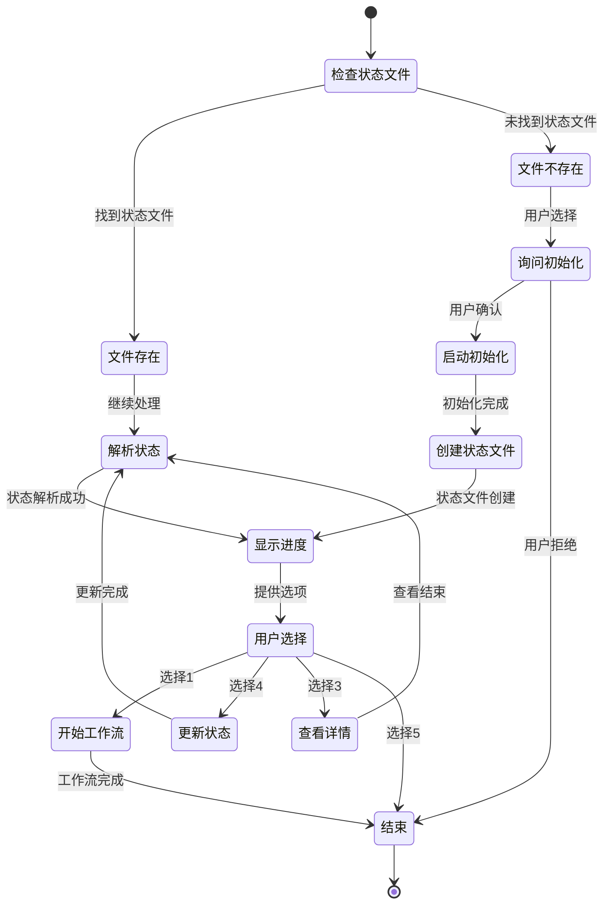

**图表来源**
- [instructions.md](file://src/modules/bmm/workflows/workflow-status/instructions.md#L11-L34)

### 验证模式 (Validate Mode)

用于其他工作流调用时的验证服务：

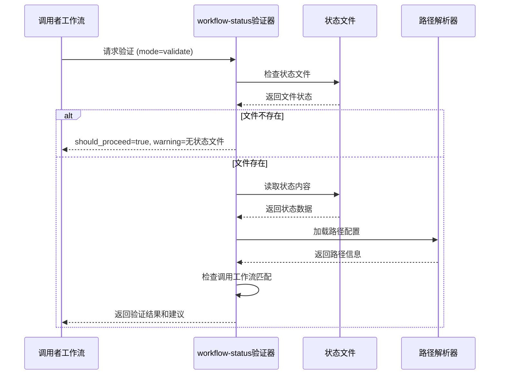

**图表来源**
- [instructions.md](file://src/modules/bmm/workflows/workflow-status/instructions.md#L199-L261)

### 数据提取模式 (Data Mode)

提供特定信息提取服务：

| 数据请求类型 | 返回内容 | 用途 |
|-------------|----------|------|
| project_config | 项目配置信息 | 获取项目基本信息 |
| workflow_status | 工作流状态列表 | 检查完成情况 |
| all | 完整状态数据 | 全面的状态分析 |

### 更新模式 (Update Mode)

集中化的状态文件更新服务：

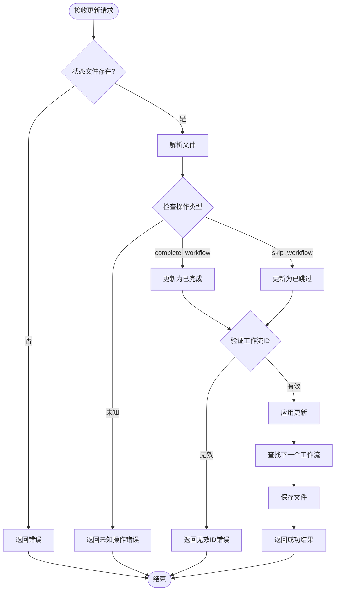

**图表来源**
- [instructions.md](file://src/modules/bmm/workflows/workflow-status/instructions.md#L327-L393)

**章节来源**
- [instructions.md](file://src/modules/bmm/workflows/workflow-status/instructions.md#L199-L396)

## 故障排除指南

### 常见问题及解决方案

#### 状态文件缺失问题

**症状**: 系统提示找不到工作流状态文件

**原因**: 新项目尚未运行workflow-init初始化

**解决方案**:
1. 运行 `/bmad:bmm:workflows:workflow-init` 命令
2. 按照向导完成项目初始化
3. 系统将自动生成状态文件并设置工作流路径

#### 工作流状态不一致

**症状**: 显示的下一个工作流与预期不符

**原因**: 状态文件可能被手动修改或与其他工具冲突

**解决方案**:
1. 使用 `/bmad:bmm:workflows:workflow-status` 查看完整状态
2. 检查状态文件中的workflow_status部分
3. 如有必要，运行初始化重新生成状态文件

#### 路径配置错误

**症状**: 工作流路径不符合项目实际情况

**解决方案**:
1. 检查项目类型 (绿色字段/棕色字段)
2. 确认项目规模等级
3. 重新运行初始化选择正确的路径配置

#### 权限问题

**症状**: 无法创建或更新状态文件

**解决方案**:
1. 检查输出目录权限
2. 确保有足够的磁盘空间
3. 验证配置文件中的路径设置

**章节来源**
- [instructions.md](file://src/modules/bmm/workflows/workflow-status/instructions.md#L39-L84)

## 总结

BMAD-METHOD的工作流状态管理系统提供了一个完整而灵活的项目进度跟踪解决方案。通过workflow-status模块，系统实现了：

1. **智能化的项目分类**: 基于项目成熟度等级提供定制化的工作流路径
2. **灵活的配置系统**: 支持多种项目类型和规划方法的组合
3. **完善的生命周期管理**: 从初始化到实施的全过程跟踪
4. **多模式交互支持**: 适应不同使用场景的服务模式
5. **强大的状态转换机制**: 确保工作流的正确执行和状态一致性

该系统不仅提高了项目管理的效率和质量，还为团队协作提供了清晰的指导框架。通过合理使用这些功能，开发团队可以更好地掌控项目进度，确保按时交付高质量的软件产品。