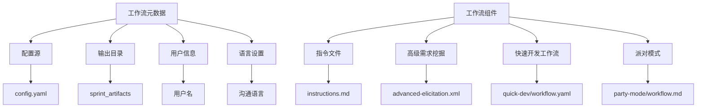
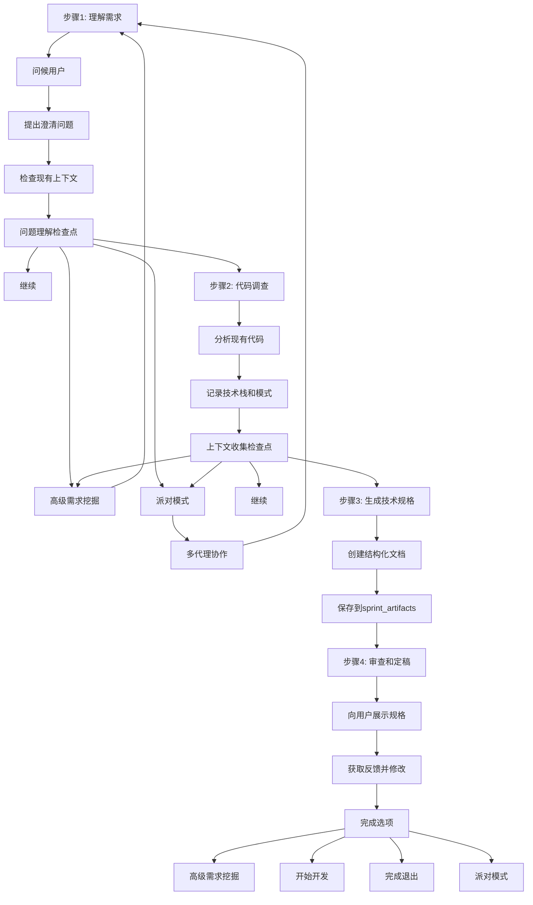

# 创建技术规格

<cite>
**本文档中引用的文件**  
- [workflow.yaml](file://src/modules/bmm/workflows/bmad-quick-flow/create-tech-spec/workflow.yaml)
- [instructions.md](file://src/modules/bmm/workflows/bmad-quick-flow/create-tech-spec/instructions.md)
- [bmad-quick-flow.md](file://src/modules/bmm/docs/bmad-quick-flow.md)
- [quick-dev/workflow.yaml](file://src/modules/bmm/workflows/bmad-quick-flow/quick-dev/workflow.yaml)
- [quick-dev/instructions.md](file://src/modules/bmm/workflows/bmad-quick-flow/quick-dev/instructions.md)
- [quick-flow-solo-dev.agent.yaml](file://src/modules/bmm/agents/quick-flow-solo-dev.agent.yaml)
</cite>

## 目录
1. [简介](#简介)
2. [工作流结构分析](#工作流结构分析)
3. [核心执行逻辑](#核心执行逻辑)
4. [输入输出参数详解](#输入输出参数详解)
5. [技术规格创建流程](#技术规格创建流程)
6. [最佳实践与关键考量](#最佳实践与关键考量)
7. [实际使用示例](#实际使用示例)
8. [与其他BMM工作流的集成](#与其他bmm工作流的集成)
9. [结论](#结论)

## 简介

创建技术规格（create-tech-spec）工作流是BMAD方法论中快速开发流程（Quick Flow）的核心组成部分，旨在通过结构化对话式工程方法，将模糊的需求转化为可立即实施的技术规格文档。该工作流专为快速迭代开发场景设计，适用于功能增强、缺陷修复和原型开发等场景。

此工作流由Quick Flow Solo Dev代理（Barry）驱动，通过系统化的步骤收集项目需求、分析现有代码库并生成包含完整上下文的技术规格，确保开发代理能够独立完成实现任务。技术规格文档不仅包含任务分解和验收标准，还整合了代码库模式、依赖关系和测试策略等关键上下文信息。

**Section sources**
- [bmad-quick-flow.md](file://src/modules/bmm/docs/bmad-quick-flow.md#L1-L529)

## 工作流结构分析

create-tech-spec工作流采用声明式YAML配置定义其结构和行为，包含元数据、配置引用、工作流组件和执行模式等关键部分。



**Diagram sources**
- [workflow.yaml](file://src/modules/bmm/workflows/bmad-quick-flow/create-tech-spec/workflow.yaml#L1-L27)

**Section sources**
- [workflow.yaml](file://src/modules/bmm/workflows/bmad-quick-flow/create-tech-spec/workflow.yaml#L1-L27)

## 核心执行逻辑

create-tech-spec工作流的核心执行逻辑分为四个结构化步骤，通过条件检查点实现灵活的流程控制。



**Diagram sources**
- [instructions.md](file://src/modules/bmm/workflows/bmad-quick-flow/create-tech-spec/instructions.md#L1-L116)

**Section sources**
- [instructions.md](file://src/modules/bmm/workflows/bmad-quick-flow/create-tech-spec/instructions.md#L1-L116)

## 输入输出参数详解

create-tech-spec工作流通过一系列参数化引用与系统其他组件进行交互，这些参数在运行时被动态解析。

### 配置参数
- **config_source**: 指向项目根目录下的配置文件，包含输出目录、用户信息等全局设置
- **output_folder**: 从配置源提取的输出目录路径
- **sprint_artifacts**: 存放冲刺相关工件的目录，技术规格将保存在此
- **user_name**: 当前用户的名称，用于个性化交互
- **communication_language**: 用户偏好的沟通语言
- **document_output_language**: 文档生成的语言
- **user_skill_level**: 用户技能水平，用于调整沟通方式

### 工作流组件参数
- **installed_path**: 工作流安装路径，用于定位相关资源文件
- **instructions**: 指向包含详细执行指令的Markdown文件
- **quick_dev_workflow**: 关联的快速开发工作流，可在规格完成后直接启动
- **party_mode_exec**: 派对模式工作流，用于复杂问题的多代理协作
- **advanced_elicitation**: 高级需求挖掘任务，用于深入探索需求细节

**Section sources**
- [workflow.yaml](file://src/modules/bmm/workflows/bmad-quick-flow/create-tech-spec/workflow.yaml#L7-L27)

## 技术规格创建流程

create-tech-spec工作流执行一个四步流程来创建技术规格文档，确保生成的规格具有足够的上下文供开发代理使用。

### 步骤1：需求理解
工作流首先通过对话方式收集用户需求，询问问题、影响范围、约束条件和现有代码等关键信息。同时检查输出目录和冲刺工件目录中是否存在现有上下文，避免重复工作。

### 步骤2：代码调查（适用于现有项目）
对于现有项目（brownfield），工作流会分析代码库，识别技术栈、代码模式、需要修改的文件和测试模式等。这些信息将被记录在技术规格中，为开发提供必要的上下文。

### 步骤3：生成技术规格
工作流根据预定义的结构生成技术规格文档，包含以下关键部分：
- **概述**：问题陈述、解决方案和范围界定
- **开发上下文**：代码库模式、参考文件和关键技术决策
- **实施计划**：具体任务列表和验收标准
- **附加上下文**：依赖关系、测试策略和注意事项

### 步骤4：审查和定稿
最后，工作流将生成的技术规格呈现给用户，确认是否准确捕捉了意图，并根据反馈进行必要的修改。规格完成后将保存到指定的冲刺工件目录。

**Section sources**
- [instructions.md](file://src/modules/bmm/workflows/bmad-quick-flow/create-tech-spec/instructions.md#L16-L116)

## 最佳实践与关键考量

根据bmad-quick-flow.md文档中的设计理念，创建技术规格时应遵循以下最佳实践：

### 适用场景
**适合使用**：
- 缺陷修复和补丁
- 小型功能添加（1-3天工作量）
- 概念验证和原型
- 性能优化
- API端点添加
- UI组件增强

**不推荐使用**：
- 大规模系统重构
- 复杂的多团队项目
- 新产品发布
- 需要大量UX设计的项目

### 关键考量因素
1. **上下文完整性**：技术规格必须包含开发代理实施所需的所有上下文
2. **语言一致性**：根据用户技能水平调整沟通方式，使用适当的术语和技术深度
3. **模式遵循**：始终遵循现有代码库的模式和约定
4. **任务可执行性**：任务分解应具体、可操作，避免模糊描述
5. **验收标准明确**：使用Given/When/Then格式定义清晰的验收标准

**Section sources**
- [bmad-quick-flow.md](file://src/modules/bmm/docs/bmad-quick-flow.md#L1-L529)

## 实际使用示例

以下是从需求输入到技术文档输出的完整过程示例：

### 场景：添加CSV导出功能
```
用户需求："添加导出到CSV功能"
处理流程：技术规格 → 开发 → 代码审查
步骤：规格 → 实现 → 测试 → 审查 → 部署
时间：1-2天
```

### 执行流程
1. 启动Quick Flow Solo Dev代理（Barry）
2. 执行`create-tech-spec`命令
3. 回答关于CSV导出功能的问题：
   - 问题：用户无法将数据导出为CSV格式
   - 解决方案：在数据管理界面添加"导出CSV"按钮
   - 范围：包含所有可见数据列，不包含敏感信息
4. 工作流分析现有代码，识别数据访问模式和UI组件
5. 生成技术规格文档，包含：
   - 任务1：在数据表格组件中添加导出按钮
   - 任务2：实现CSV格式化逻辑
   - 任务3：添加单元测试验证导出功能
   - 验收标准：点击按钮后下载包含正确数据的CSV文件
6. 用户审查并确认规格
7. 使用`quick-dev`工作流基于技术规格进行开发

**Section sources**
- [bmad-quick-flow.md](file://src/modules/bmm/docs/bmad-quick-flow.md#L396-L432)

## 与其他BMM工作流的集成

create-tech-spec工作流与其他BMM工作流紧密集成，形成完整的开发工作流生态系统。

### 与快速开发工作流的集成
create-tech-spec工作流与`quick-dev`工作流形成无缝衔接。技术规格完成后，用户可以选择直接启动`quick-dev`工作流进行实现。`quick-dev`工作流支持两种执行模式：
- **技术规格驱动模式**：加载技术规格文件，自动提取任务和验收标准
- **直接指令模式**：接受直接开发指令，可选择先进行规划


**Diagram sources**
- [bmad-quick-flow.md](file://src/modules/bmm/docs/bmad-quick-flow.md#L38-L69)
- [quick-dev/instructions.md](file://src/modules/bmm/workflows/bmad-quick-flow/quick-dev/instructions.md#L1-L106)

### 与派对模式的集成
当遇到复杂问题时，create-tech-spec工作流可以集成`party-mode`工作流，引入多个专家代理进行协作：
- **架构师**：提供设计决策
- **开发代理**：提供实现配对
- **QA代理**：提供测试策略
- **UX设计师**：提供用户体验建议
- **分析师**：提供需求清晰度

### 数据交换格式
工作流之间的数据交换主要通过以下格式进行：
- **技术规格文档**：Markdown格式，包含结构化的任务列表和验收标准
- **项目上下文**：`project-context.md`文件，定义项目标准和模式
- **配置文件**：YAML格式，包含全局设置和路径引用

**Section sources**
- [bmad-quick-flow.md](file://src/modules/bmm/docs/bmad-quick-flow.md#L338-L394)
- [quick-flow-solo-dev.agent.yaml](file://src/modules/bmm/agents/quick-flow-solo-dev.agent.yaml#L1-L37)

## 结论

create-tech-spec工作流是BMAD方法论中实现高效技术文档生成的核心工具。通过结构化的四步流程——需求理解、代码调查、规格生成和审查定稿，该工作流能够将模糊的需求转化为包含完整上下文的可执行技术规格。

该工作流的设计体现了快速开发流程的核心理念：在保持质量的同时最大限度地减少仪式感。通过与`quick-dev`、`party-mode`等其他工作流的紧密集成，create-tech-spec构成了一个完整的开发自动化生态系统，使开发代理能够从需求到部署独立完成任务。

关键成功因素包括确保技术规格的完整性、遵循现有代码模式、使用清晰的验收标准以及在必要时利用多代理协作。这种结构化但灵活的方法使团队能够在快速迭代的同时保持代码质量和一致性。