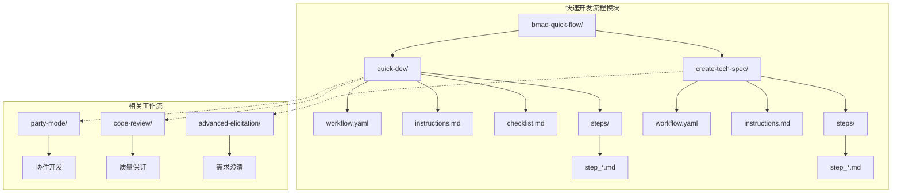
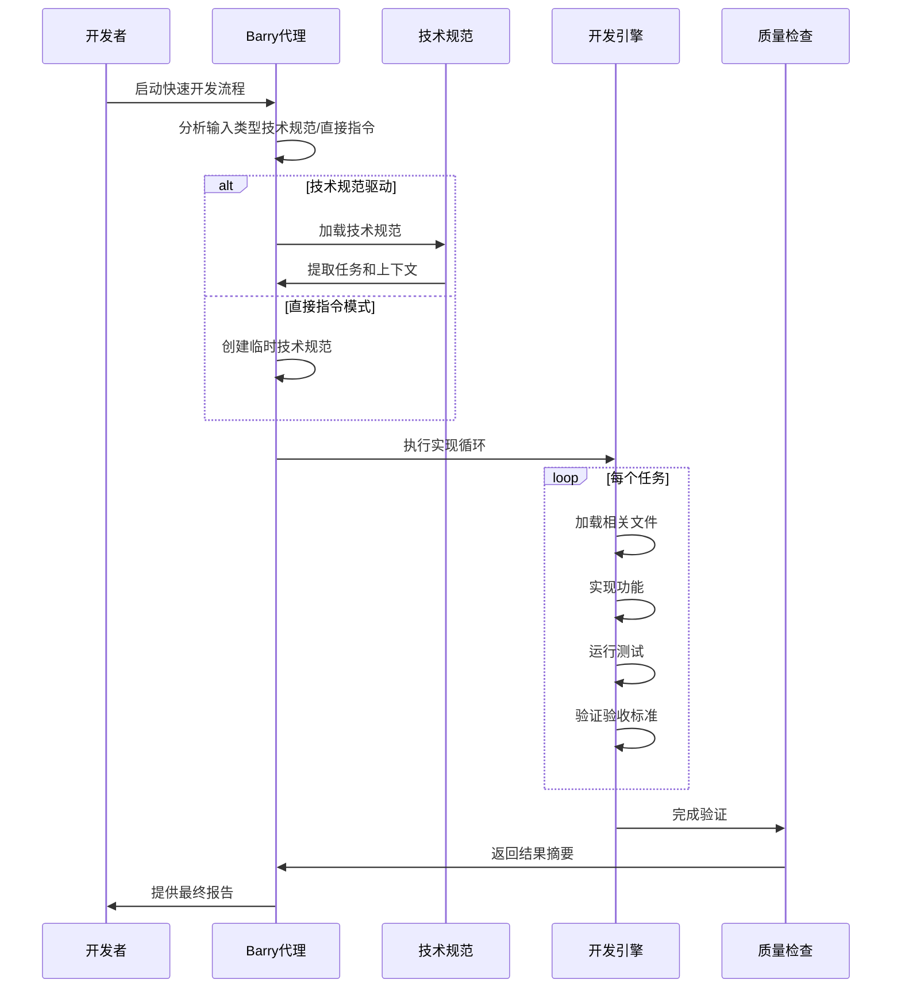
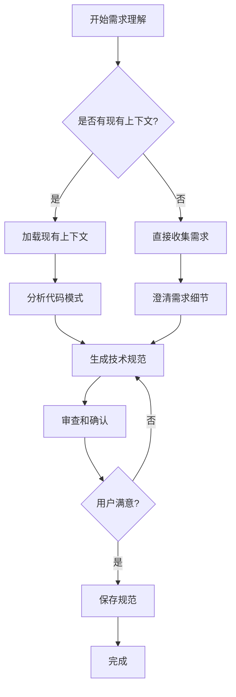
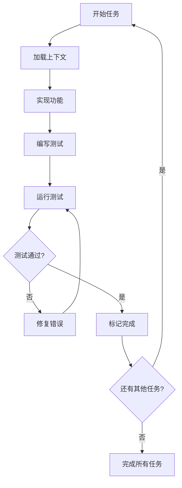
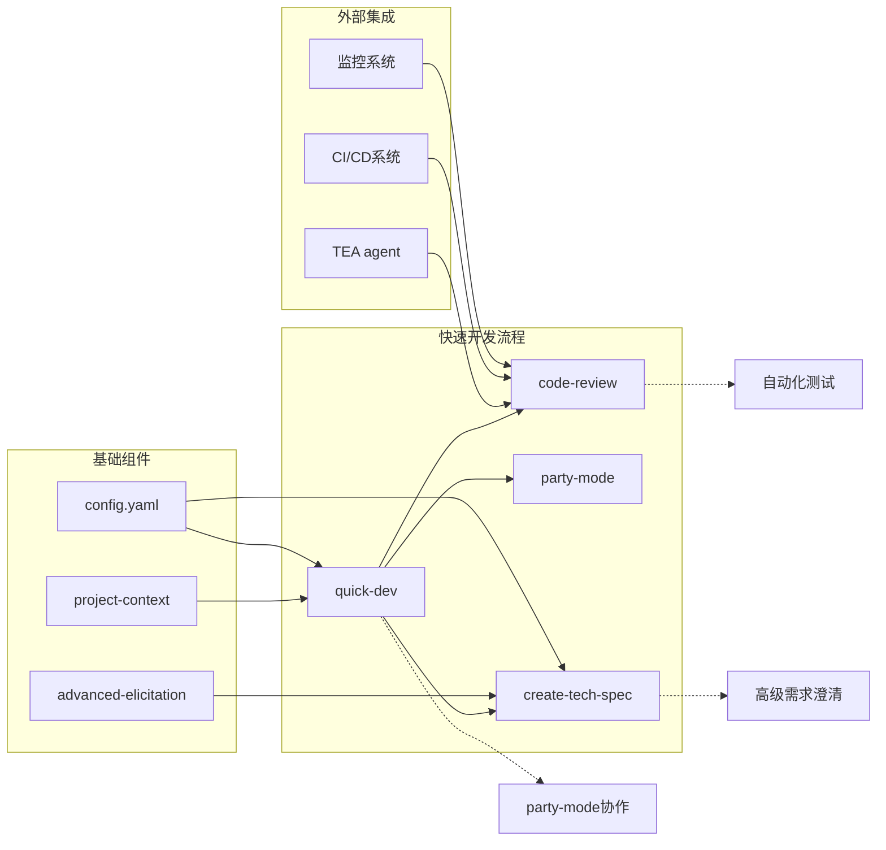

# 快速开发流程

<cite>
**本文档中引用的文件**
- [workflow.yaml](file://src/modules/bmm/workflows/bmad-quick-flow/quick-dev/workflow.yaml)
- [create-tech-spec.yaml](file://src/modules/bmm/workflows/bmad-quick-flow/create-tech-spec/workflow.yaml)
- [bmad-quick-flow.md](file://src/modules/bmm/docs/bmad-quick-flow.md)
- [quick-flow-solo-dev.md](file://src/modules/bmm/docs/quick-flow-solo-dev.md)
- [quick-dev-checklist.md](file://src/modules/bmm/workflows/bmad-quick-flow/quick-dev/checklist.md)
- [quick-dev-instructions.md](file://src/modules/bmm/workflows/bmad-quick-flow/quick-dev/instructions.md)
- [create-tech-spec-instructions.md](file://src/modules/bmm/workflows/bmad-quick-flow/create-tech-spec/instructions.md)
- [workflow-architecture-reference.md](file://src/modules/bmm/docs/workflow-architecture-reference.md)
</cite>

## 目录
1. [简介](#简介)
2. [项目结构](#项目结构)
3. [核心组件](#核心组件)
4. [架构概览](#架构概览)
5. [详细组件分析](#详细组件分析)
6. [依赖关系分析](#依赖关系分析)
7. [性能考虑](#性能考虑)
8. [故障排除指南](#故障排除指南)
9. [结论](#结论)

## 简介

BMAD快速开发流程（Quick Flow）是BMAD方法生态系统中最快速的端到端开发路径，专为独立开发者设计。它通过简化的三步流程实现了从想法到生产的极速交付，同时确保开发质量。该流程特别适用于经验丰富的团队或需要快速移动的较小功能。

快速开发流程的核心优势在于其灵活性和效率：既可以处理技术规范驱动的开发，也可以直接执行用户指令，避免了传统开发流程中的繁琐规划阶段。这种设计使得开发者能够专注于实际编码工作，而无需经历冗长的需求分析和设计阶段。

## 项目结构

快速开发流程在BMAD方法中的组织结构体现了其模块化设计理念：

**图表来源**
- [workflow.yaml](file://src/modules/bmm/workflows/bmad-quick-flow/quick-dev/workflow.yaml#L1-L30)
- [create-tech-spec.yaml](file://src/modules/bmm/workflows/bmad-quick-flow/create-tech-spec/workflow.yaml#L1-L27)

**章节来源**
- [bmad-quick-flow.md](file://src/modules/bmm/docs/bmad-quick-flow.md#L1-L50)

## 核心组件

### 主要工作流组件

快速开发流程包含两个核心工作流，每个都有特定的职责和执行模式：

#### 1. 技术规范创建工作流
负责将用户需求转化为可执行的技术规范，采用对话式工程方法进行需求澄清和上下文分析。

#### 2. 快速开发工作流  
执行技术规范或直接指令的实现，支持两种执行模式：
- **技术规范驱动模式**：加载现有技术规范并执行所有任务
- **直接指令模式**：接受清晰的开发指令并立即执行

### 关键配置参数

工作流配置包含了丰富的环境变量和路径设置：

| 配置项 | 描述 | 默认值 |
|--------|------|--------|
| `output_folder` | 输出文件夹路径 | `{config_source}:output_folder` |
| `sprint_artifacts` | 冲刺制品存储位置 | `{config_source}:sprint_artifacts` |
| `user_name` | 用户名称 | `{config_source}:user_name` |
| `communication_language` | 沟通语言 | `{config_source}:communication_language` |
| `user_skill_level` | 用户技能水平 | `{config_source}:user_skill_level` |

**章节来源**
- [workflow.yaml](file://src/modules/bmm/workflows/bmad-quick-flow/quick-dev/workflow.yaml#L6-L13)
- [create-tech-spec.yaml](file://src/modules/bmm/workflows/bmad-quick-flow/create-tech-spec/workflow.yaml#L6-L14)

## 架构概览

快速开发流程采用了高度集成的架构设计，通过智能代理和自动化工具链实现端到端的开发体验：

**图表来源**
- [quick-dev-instructions.md](file://src/modules/bmm/workflows/bmad-quick-flow/quick-dev/instructions.md#L59-L74)
- [quick-flow-solo-dev.md](file://src/modules/bmm/docs/quick-flow-solo-dev.md#L131-L159)

## 详细组件分析

### 技术规范创建工作流

技术规范创建工作流采用渐进式的方法，通过四个关键步骤生成高质量的技术规范：

#### 步骤1：需求理解
系统首先问候用户并收集需求描述，然后通过一系列澄清性问题深入了解问题范围、影响对象、约束条件和现有代码情况。

#### 步骤2：代码调查（如果是棕地项目）
对于需要修改现有代码的项目，系统会识别文件路径、阅读代码、识别模式/约定/依赖关系。

#### 步骤3：生成技术规范
使用预定义模板创建完整的技术规范，包含以下结构：
- 问题陈述和解决方案概述
- 开发上下文和模式
- 实现任务和验收标准
- 技术决策和依赖关系

#### 步骤4：审查和完成
向用户展示规范，询问是否准确捕获了意图，并根据需要进行调整。

**图表来源**
- [create-tech-spec-instructions.md](file://src/modules/bmm/workflows/bmad-quick-flow/create-tech-spec/instructions.md#L16-L115)

**章节来源**
- [create-tech-spec-instructions.md](file://src/modules/bmm/workflows/bmad-quick-flow/create-tech-spec/instructions.md#L1-L116)

### 快速开发工作流

快速开发工作流是整个流程的核心执行引擎，具有高度的灵活性和智能性：

#### 输入处理机制
系统能够智能识别两种输入模式：
1. **技术规范文件**：加载现有技术规范，提取任务、上下文和验收标准
2. **直接指令**：接受清晰的开发指令，提供可选的规划步骤

#### 实现循环
每个任务都遵循严格的执行循环：

**图表来源**
- [quick-dev-instructions.md](file://src/modules/bmm/workflows/bmad-quick-flow/quick-dev/instructions.md#L61-L74)

#### 错误处理和恢复
系统具备强大的错误处理能力：
- 最多允许3次失败后暂停请求指导
- 测试失败时必须修复才能继续
- 支持持续执行直到完成，不因里程碑停止

**章节来源**
- [quick-dev-instructions.md](file://src/modules/bmm/workflows/bmad-quick-flow/quick-dev/instructions.md#L1-L106)
- [quick-dev-checklist.md](file://src/modules/bmm/workflows/bmad-quick-flow/quick-dev/checklist.md#L1-L26)

### Barry代理（快速流程独行侠）

Barry代理是快速开发流程的智能核心，代表了BMAD方法中精英级的自主开发能力：

#### 代理特性
- **身份定位**：专注于自主执行的精英开发者
- **沟通风格**：直接、自信、以实现为导向
- **核心原则**：规划和执行是同一硬币的两面

#### 使用场景
- **快速流程开发**：小型到中型功能的快速交付
- **技术规范创建**：详细的实施计划
- **直接开发**：明确要求下的跳过广泛规划
- **代码审查**：高级技术验证
- **性能关键功能**：优化和可扩展性至关重要

**章节来源**
- [quick-flow-solo-dev.md](file://src/modules/bmm/docs/quick-flow-solo-dev.md#L1-L338)

## 依赖关系分析

快速开发流程与BMAD方法生态系统中的其他组件有着复杂的依赖关系：

**图表来源**
- [workflow.yaml](file://src/modules/bmm/workflows/bmad-quick-flow/quick-dev/workflow.yaml#L23-L27)
- [create-tech-spec.yaml](file://src/modules/bmm/workflows/bmad-quick-flow/create-tech-spec/workflow.yaml#L20-L24)

### 关键依赖项

1. **项目上下文**：定义项目标准的基础参考
2. **配置系统**：提供环境变量和路径设置
3. **Party模式**：在需要时提供专家协作
4. **代码审查**：可选的质量保证流程
5. **TEA代理**：自动化测试和质量保证

**章节来源**
- [workflow.yaml](file://src/modules/bmm/workflows/bmad-quick-flow/quick-dev/workflow.yaml#L15-L27)
- [create-tech-spec.yaml](file://src/modules/bmm/workflows/bmad-quick-flow/create-tech-spec/workflow.yaml#L15-L27)

## 性能考虑

快速开发流程在设计时充分考虑了性能优化，确保在保持质量的同时实现最快的交付速度：

### 执行效率优化
- **连续执行**：不因里程碑停止，直到完全完成
- **智能缓存**：利用项目上下文减少重复分析
- **并行处理**：测试和验证可以并行执行
- **增量更新**：技术规范状态实时更新

### 资源管理
- **内存优化**：写入即保存的架构避免内存积累
- **批量处理**：深度扫描级别的批处理策略
- **状态持久化**：断点续传功能支持长时间运行的任务

### 可扩展性设计
- **模块化架构**：易于添加新的工作流步骤
- **插件机制**：支持自定义检查项和验证规则
- **配置驱动**：通过配置文件调整行为

## 故障排除指南

### 常见问题及解决方案

#### 问题1：范围蔓延
**症状**：开发过程中出现新的需求
**解决方案**：参考技术规范，明确记录新需求

#### 问题2：未知模式或约定
**症状**：对现有代码模式不熟悉
**解决方案**：使用party-mode引入架构师或资深开发者

#### 问题3：测试瓶颈
**症状**：测试执行缓慢或失败
**解决方案**：利用TEA代理进行自动化测试生成

#### 问题4：集成冲突
**症状**：与其他功能产生冲突
**解决方案**：清晰记录依赖关系，协调受影响团队

### 紧急程序

#### 生产热修复
1. 从生产分支创建
2. 快速开发最小变更
3. 部署到暂存环境
4. 快速回归测试
5. 部署到生产
6. 合并到主分支

#### 关键缺陷处理
1. 立即调查
2. 如有必要启动party-mode
3. 快速修复并制定回滚计划
4. 事后文档记录

**章节来源**
- [bmad-quick-flow.md](file://src/modules/bmm/docs/bmad-quick-flow.md#L463-L497)

## 结论

BMAD快速开发流程代表了现代软件开发方法的重要创新，通过智能化的工作流设计实现了开发效率和质量的最佳平衡。其核心价值体现在：

### 主要优势
1. **极速交付**：从想法到生产的最短路径
2. **质量保证**：通过检查清单和可选代码审查确保质量
3. **灵活性**：支持多种输入模式和执行策略
4. **自主性**：Barry代理提供精英级的自主开发能力
5. **可扩展性**：可根据项目复杂度升级到更完整的流程

### 适用场景
- 小型功能改进和bug修复
- 快速原型和概念验证
- 性能优化和配置更改
- 内部工具开发
- 单人或小团队项目

### 发展前景
快速开发流程作为BMAD方法生态系统的重要组成部分，为独立开发者和小型团队提供了专业级的开发体验。随着AI技术的不断发展，该流程将继续演进，为软件开发带来更多的可能性和效率提升。

通过深入理解和正确应用快速开发流程，开发团队能够在保持高质量标准的同时，实现更快的交付周期和更高的开发满意度。