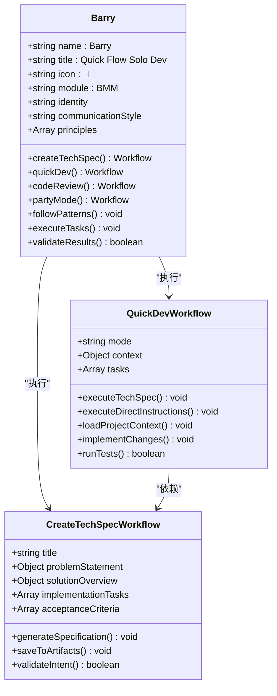
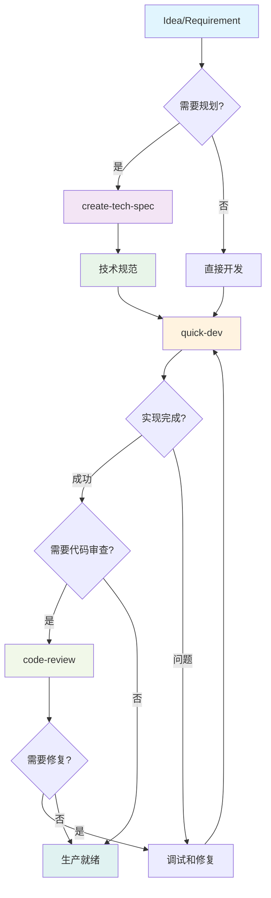
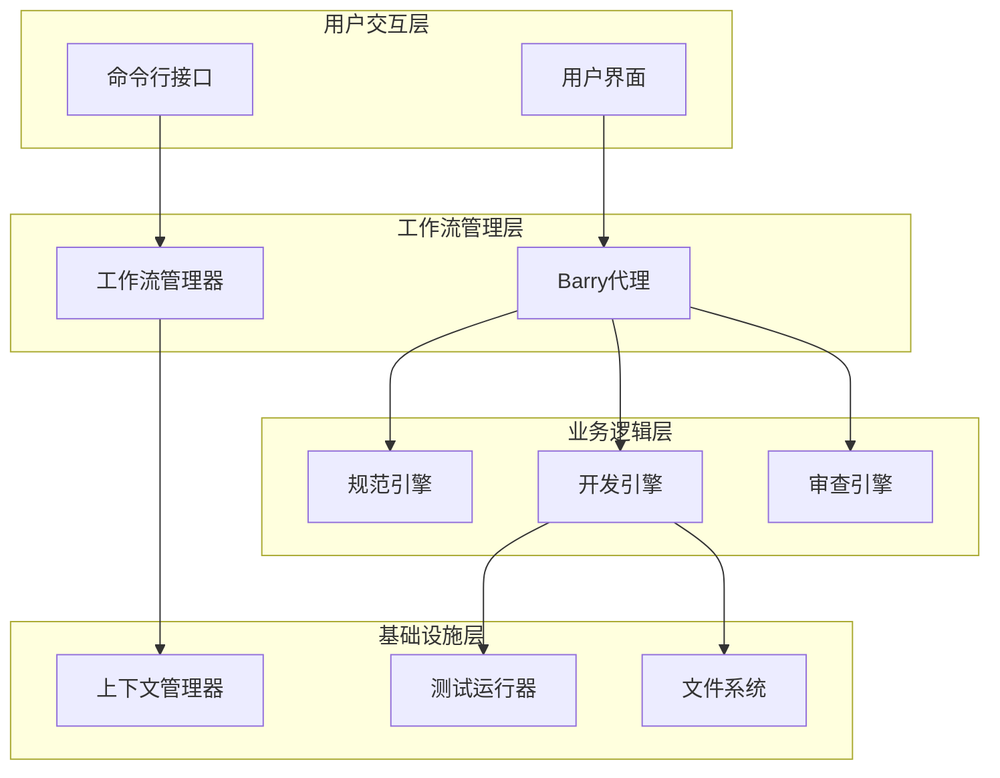
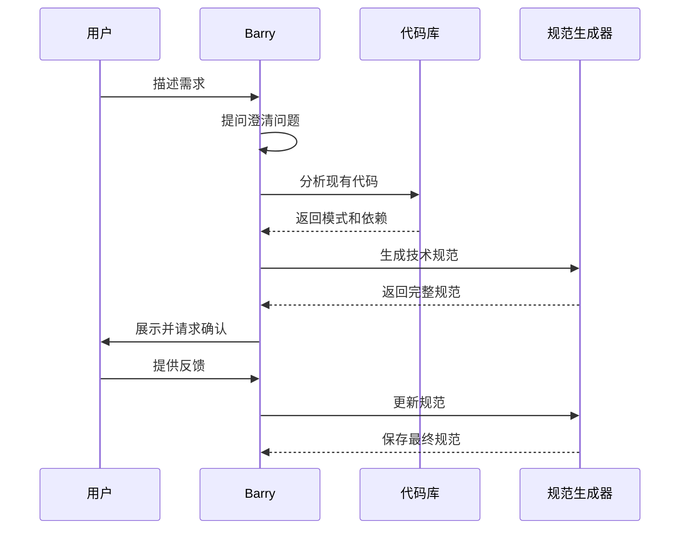
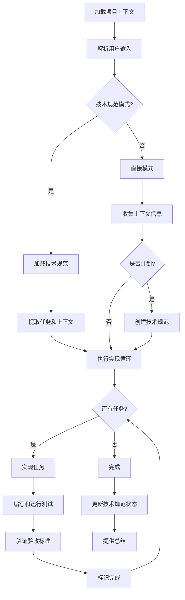
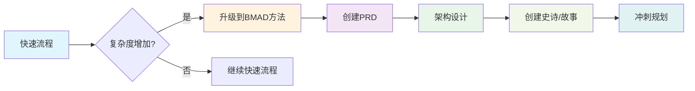
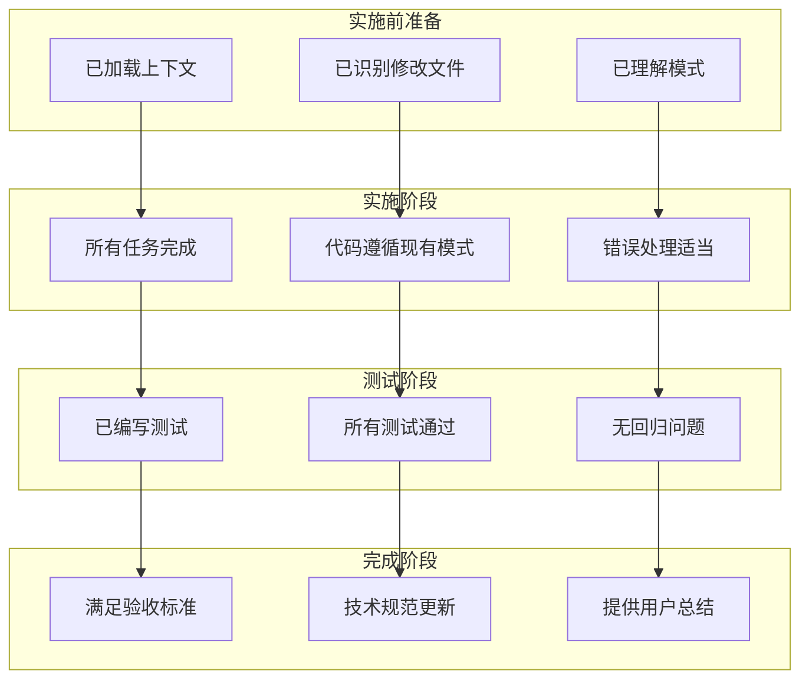

# 快速流程

<cite>
**本文档中引用的文件**
- [workflow.yaml](file://src/modules/bmm/workflows/bmad-quick-flow/quick-dev/workflow.yaml)
- [workflow.yaml](file://src/modules/bmm/workflows/bmad-quick-flow/create-tech-spec/workflow.yaml)
- [bmad-quick-flow.md](file://src/modules/bmm/docs/bmad-quick-flow.md)
- [quick-flow-solo-dev.md](file://src/modules/bmm/docs/quick-flow-solo-dev.md)
- [quick-flow-solo-dev.agent.yaml](file://src/modules/bmm/agents/quick-flow-solo-dev.agent.yaml)
- [instructions.md](file://src/modules/bmm/workflows/bmad-quick-flow/quick-dev/instructions.md)
- [instructions.md](file://src/modules/bmm/workflows/bmad-quick-flow/create-tech-spec/instructions.md)
- [checklist.md](file://src/modules/bmm/workflows/bmad-quick-flow/quick-dev/checklist.md)
- [checklist.md](file://src/modules/bmm/workflows/document-project/checklist.md)
- [workflows-implementation.md](file://src/modules/bmm/docs/workflows-implementation.md)
- [project-context-template.md](file://src/modules/bmm/data/project-context-template.md)
</cite>

## 目录
1. [简介](#简介)
2. [快速流程概述](#快速流程概述)
3. [核心组件分析](#核心组件分析)
4. [架构设计](#架构设计)
5. [详细工作流分析](#详细工作流分析)
6. [与标准BMM流程的关系](#与标准bmm流程的关系)
7. [质量保障机制](#质量保障机制)
8. [最佳实践指南](#最佳实践指南)
9. [故障排除](#故障排除)
10. [总结](#总结)

## 简介

BMAD-Quick-Flow是BMAD方法论生态系统中最快速的从想法到生产的路径。它是一个简化的三步流程，专为快速开发而设计，在不牺牲质量的前提下最大化开发速度。该流程特别适用于有经验的团队或需要快速交付的小型功能。

快速流程的核心理念是"规划和执行是同一枚硬币的两面"，强调敏捷性和实用性，而不是繁琐的官僚程序。通过消除交接环节和最大化速度，快速流程能够在保持高质量的同时实现极速交付。

## 快速流程概述

### 设计理念

快速流程基于以下核心原则构建：

1. **极简主义规划**：最小化规划但不完全省略
2. **端到端执行**：单一开发者完成从构思到部署的全过程
3. **模式遵循**：严格遵循现有代码库模式和约定
4. **持续验证**：在开发过程中不断验证和测试
5. **快速反馈**：立即获得结果并进行调整

### 适用场景

**完美应用场景：**
- Bug修复和补丁
- 小功能添加（1-3天工作量）
- 概念验证和原型开发
- 性能优化
- API端点添加
- UI组件增强
- 配置更改
- 内部工具开发

**不推荐场景：**
- 大规模系统重构
- 复杂多团队项目
- 新产品发布
- 需要 extensive UX设计的项目
- 企业级倡议
- 具有合规要求的关键系统

**Section sources**
- [bmad-quick-flow.md](file://src/modules/bmm/docs/bmad-quick-flow.md#L1-L50)

## 核心组件分析

### Barry - 快速流程独狼开发者

Barry是BMAD快速流程的核心代理，代表了能够自主执行的精英开发者。他生活在快速流程工作流中，从概念到部署以无情的效率完成项目。没有交接，没有延迟，只有纯粹、专注的开发。



**图表来源**
- [quick-flow-solo-dev.agent.yaml](file://src/modules/bmm/agents/quick-flow-solo-dev.agent.yaml#L1-L37)
- [workflow.yaml](file://src/modules/bmm/workflows/bmad-quick-flow/quick-dev/workflow.yaml#L1-L30)

### 工作流组件

快速流程包含两个主要的工作流：

1. **create-tech-spec工作流**：技术规范工程
2. **quick-dev工作流**：灵活开发执行

每个工作流都有其特定的角色和职责，共同构成完整的快速开发循环。

**Section sources**
- [quick-flow-solo-dev.agent.yaml](file://src/modules/bmm/agents/quick-flow-solo-dev.agent.yaml#L22-L37)
- [workflow.yaml](file://src/modules/bmm/workflows/bmad-quick-flow/create-tech-spec/workflow.yaml#L1-L27)

## 架构设计

### 整体架构图



**图表来源**
- [bmad-quick-flow.md](file://src/modules/bmm/docs/bmad-quick-flow.md#L39-L68)

### 技术架构层次

快速流程采用分层架构设计，确保各组件之间的清晰分离和高效协作：



**图表来源**
- [workflow.yaml](file://src/modules/bmm/workflows/bmad-quick-flow/quick-dev/workflow.yaml#L16-L30)
- [workflow.yaml](file://src/modules/bmm/workflows/bmad-quick-flow/create-tech-spec/workflow.yaml#L16-L27)

**Section sources**
- [bmad-quick-flow.md](file://src/modules/bmm/docs/bmad-quick-flow.md#L39-L70)

## 详细工作流分析

### 创建技术规范工作流

创建技术规范工作流是一个对话式规范工程过程，通过提问、调查代码并产生可实施的技术规范。

#### 核心特性

1. **对话式规范工程**：通过交互式问答收集需求
2. **自动代码库模式检测**：识别现有代码库的模式和约定
3. **上下文收集**：从现有代码中收集相关信息
4. **可实施的任务分解**：将规范分解为具体的实现任务
5. **验收标准定义**：使用Given/When/Then格式定义明确的验收标准

#### 流程步骤



**图表来源**
- [instructions.md](file://src/modules/bmm/workflows/bmad-quick-flow/create-tech-spec/instructions.md#L16-L116)

#### 输出产物

技术规范输出为 `{sprint_artifacts}/tech-spec-{slug}.md` 格式的Markdown文件，包含：

- 清晰的问题陈述和解决方案概述
- 开发上下文和代码库模式
- 具体的实现任务和验收标准
- 技术决策和权衡考虑
- 依赖关系和测试策略

**Section sources**
- [instructions.md](file://src/modules/bmm/workflows/bmad-quick-flow/create-tech-spec/instructions.md#L1-L116)

### 快速开发工作流

快速开发工作流提供灵活的开发执行，支持技术规范驱动和直接指令两种模式。

#### 执行模式

**模式A：技术规范驱动**
```bash
# 从技术规范执行
quick-dev tech-spec-feature-x.md
```

**模式B：直接指令**
```bash
# 直接开发命令
quick-dev "添加密码重置到认证服务"
quick-dev "修复图像处理中的内存泄漏"
```

#### 开发过程



**图表来源**
- [instructions.md](file://src/modules/bmm/workflows/bmad-quick-flow/quick-dev/instructions.md#L16-L106)

#### 关键特性

1. **上下文加载**：理解项目模式和约定
2. **连续执行**：不间断地完成所有任务
3. **错误处理**：适当的错误处理和恢复机制
4. **测试集成**：编写适当的测试并验证通过
5. **模式遵循**：遵循现有的代码库模式

**Section sources**
- [instructions.md](file://src/modules/bmm/workflows/bmad-quick-flow/quick-dev/instructions.md#L1-L106)

### 代码审查工作流

代码审查工作流提供高级别的技术验证，虽然可选但强烈推荐用于关键特性、团队项目或学习场景。

#### 审查重点

- 代码质量和模式
- 验收标准符合性
- 性能和可扩展性
- 安全考虑
- 可维护性和文档

**Section sources**
- [bmad-quick-flow.md](file://src/modules/bmm/docs/bmad-quick-flow.md#L163-L183)

## 与标准BMM流程的关系

### 流程对比矩阵

| 方面 | 快速流程 | BMAD方法 | 企业方法 |
|------|----------|----------|----------|
| **规划** | 最小化/可选 | 结构化 | 综合性 |
| **文档** | 基本必需 | 中等程度 | 广泛 |
| **团队规模** | 1-2名开发者 | 3-7名专家 | 8+企业团队 |
| **时间线** | 小时到天 | 周到月 | 月到季度 |
| **仪式** | 最小化 | 平衡 | 完整治理 |
| **灵活性** | 高 | 中等 | 结构化 |
| **风险级别** | 中等 | 低 | 很低 |

### 升级路径

当快速流程特性变得复杂时，可以升级到更全面的方法：



**图表来源**
- [bmad-quick-flow.md](file://src/modules/bmm/docs/bmad-quick-flow.md#L346-L363)

### Party模式集成

对于复杂的快速流程挑战，可以使用Party模式引入相关专家：

- **架构师**：负责设计决策
- **开发者**：负责实现配对
- **QA**：负责测试策略
- **UX设计师**：负责用户体验
- **分析师**：负责需求澄清

**Section sources**
- [bmad-quick-flow.md](file://src/modules/bmm/docs/bmad-quick-flow.md#L365-L384)

## 质量保障机制

### 检查清单系统

快速流程包含多层次的质量保障检查清单：

#### 快速开发检查清单



**图表来源**
- [checklist.md](file://src/modules/bmm/workflows/bmad-quick-flow/quick-dev/checklist.md#L1-L26)

#### 文档项目检查清单

文档项目工作流包含更广泛的验证检查清单，涵盖扫描级别、写入架构、批处理策略等多个方面。

**Section sources**
- [checklist.md](file://src/modules/bmm/workflows/bmad-quick-flow/quick-dev/checklist.md#L1-L26)
- [checklist.md](file://src/modules/bmm/workflows/document-project/checklist.md#L1-L246)

### 自动化测试集成

快速流程可以与TEA代理集成，实现自动化测试：

- 测试用例生成
- 自动化测试执行
- 覆盖率分析
- 测试修复模式

**Section sources**
- [bmad-quick-flow.md](file://src/modules/bmm/docs/bmad-quick-flow.md#L385-L393)

## 最佳实践指南

### 开始前的准备

1. **验证流程选择**
   - 功能是否足够小？
   - 是否有明确的需求？
   - 团队是否舒适于快速开发？

2. **准备上下文**
   - 准备好项目文档
   - 了解代码库模式
   - 提前识别受影响的组件

3. **设定明确边界**
   - 定义范围内外项目
   - 建立验收标准
   - 识别依赖关系

### 开发过程中的实践

1. **保持速度**
   - 不要过度工程化解决方案
   - 遵循现有模式
   - 保持测试与风险成比例

2. **保持专注**
   - 抵制范围蔓延
   - 如果可能，稍后处理边缘情况
   - 简短记录决策

3. **沟通进度**
   - 定期更新任务状态
   - 立即报告阻塞问题
   - 与团队分享学习成果

### 完成后的实践

1. **质量门控**
   - 确保测试通过
   - 验证验收标准
   - 考虑可选的代码审查

2. **知识转移**
   - 更新相关文档
   - 分享关键决策
   - 记录发现的模式

3. **生产就绪**
   - 验证部署要求
   - 检查监控需求
   - 制定回滚策略

**Section sources**
- [bmad-quick-flow.md](file://src/modules/bmm/docs/bmad-quick-flow.md#L200-L252)

## 故障排除

### 常见问题及解决方案

**问题：开发过程中范围蔓延**
**解决方案**：参考技术规范，明确记录新需求

**问题：未知的模式或约定**
**解决方案**：使用Party模式引入架构师或资深开发者

**问题：测试瓶颈**
**解决方案**：利用TEA代理进行自动化测试生成

**问题：集成冲突**
**解决方案**：记录依赖关系，协调受影响的团队

### 紧急程序

**生产热修复：**
1. 从生产分支创建
2. 使用最小变更进行快速开发
3. 部署到暂存环境
4. 进行快速回归测试
5. 部署到生产
6. 合并到主分支

**关键缺陷：**
1. 立即调查
2. 如有必要使用Party模式
3. 快速修复并制定回滚计划
4. 编写事后分析文档

**Section sources**
- [bmad-quick-flow.md](file://src/modules/bmm/docs/bmad-quick-flow.md#L463-L497)

## 总结

BMAD-Quick-Flow代表了敏捷开发方法的重要创新，它证明了在保持高质量的同时实现极速交付的可能性。通过消除交接环节、最大化速度和提供清晰的质量保障机制，快速流程为独立开发者和小型团队提供了强大的开发能力。

### 核心优势

1. **极速交付**：从想法到生产的最短路径
2. **质量保证**：通过检查清单和自动化测试确保质量
3. **灵活性**：支持多种执行模式和场景
4. **可扩展性**：可以根据需要升级到更全面的方法
5. **团队适应性**：既适合独立开发者也适合小型团队

### 应用建议

快速流程最适合：
- 快速迭代的产品开发
- 实验性功能的验证
- Bug修复和紧急维护
- 小规模的功能增强

对于更大、更复杂的项目，建议采用标准的BMAD方法论，但在必要时可以随时切换到快速流程来处理特定的子任务。

通过理解和正确应用快速流程，开发团队可以在保持高质量的同时显著提升交付速度，实现真正的敏捷开发目标。