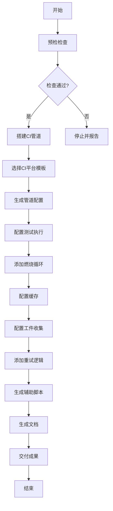
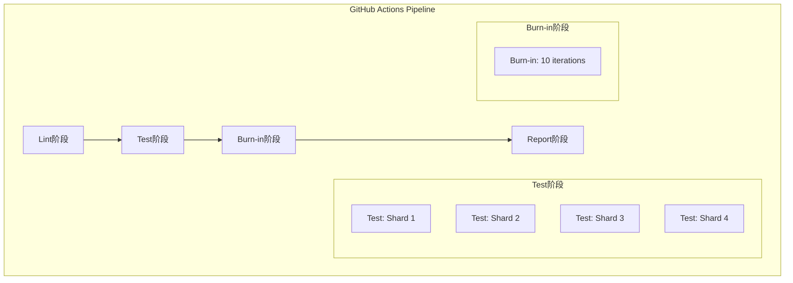
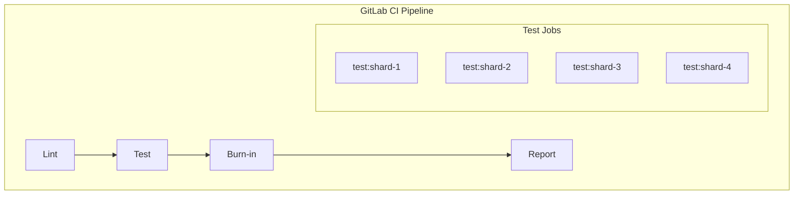
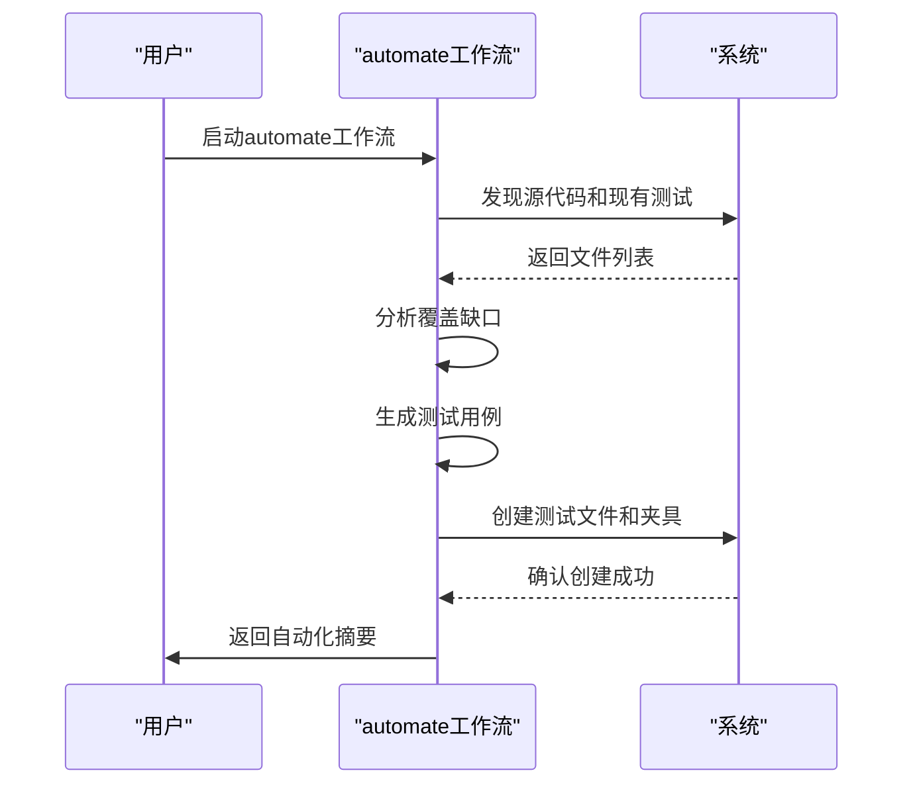
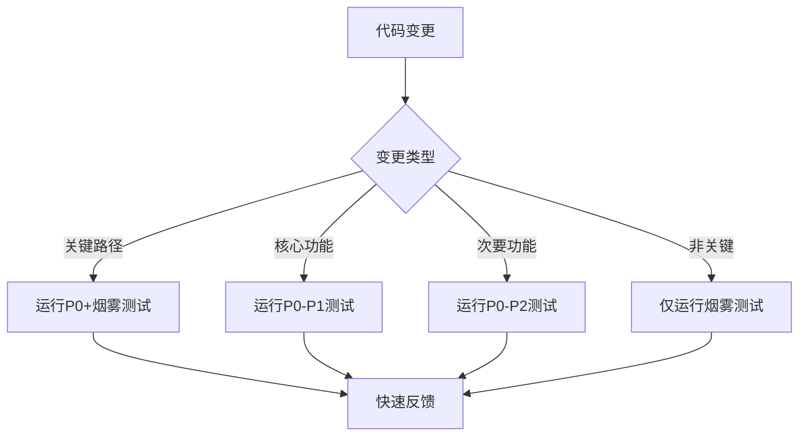
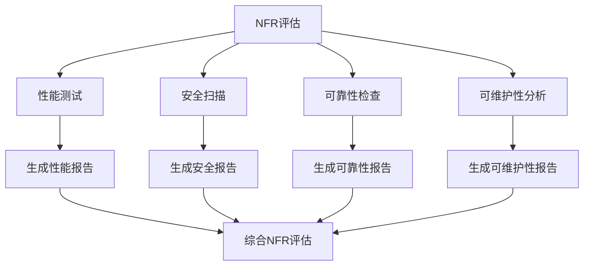
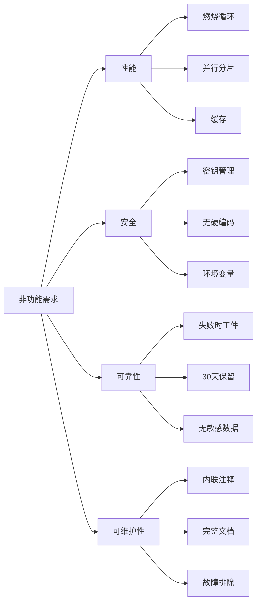
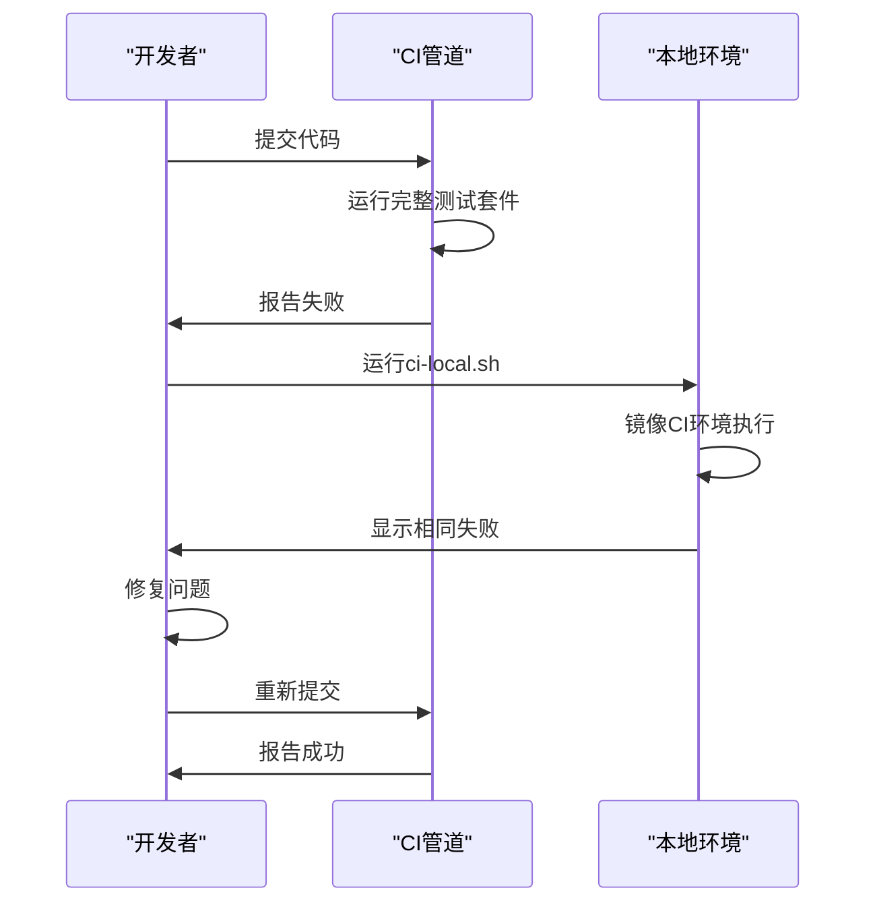
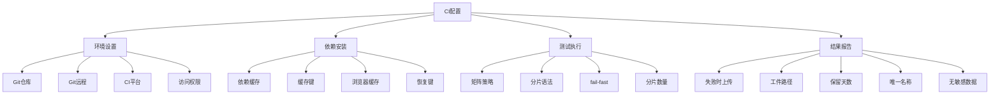
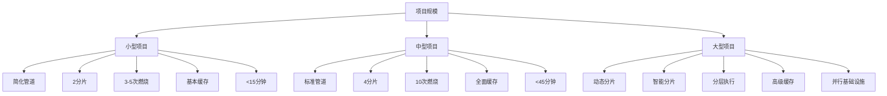

# CI/CD集成

<cite>
**本文档中引用的文件**  
- [workflow.yaml](file://src/modules/bmm/workflows/testarch/ci/workflow.yaml)
- [instructions.md](file://src/modules/bmm/workflows/testarch/ci/instructions.md)
- [checklist.md](file://src/modules/bmm/workflows/testarch/ci/checklist.md)
- [github-actions-template.yaml](file://src/modules/bmm/workflows/testarch/ci/github-actions-template.yaml)
- [gitlab-ci-template.yaml](file://src/modules/bmm/workflows/testarch/ci/gitlab-ci-template.yaml)
- [automate/workflow.yaml](file://src/modules/bmm/workflows/testarch/automate/workflow.yaml)
- [nfr-assess/workflow.yaml](file://src/modules/bmm/workflows/testarch/nfr-assess/workflow.yaml)
- [ci-burn-in.md](file://src/modules/bmm/testarch/knowledge/ci-burn-in.md)
- [selective-testing.md](file://src/modules/bmm/testarch/knowledge/selective-testing.md)
- [visual-debugging.md](file://src/modules/bmm/testarch/knowledge/visual-debugging.md)
- [playwright-config.md](file://src/modules/bmm/testarch/knowledge/playwright-config.md)
</cite>

## 目录
1. [简介](#简介)
2. [CI/CD工作流配置](#cicd工作流配置)
3. [主流CI平台快速配置](#主流ci平台快速配置)
4. [测试自动化执行](#测试自动化执行)
5. [非功能需求评估](#非功能需求评估)
6. [最佳实践应用案例](#最佳实践应用案例)
7. [CI配置检查项](#ci配置检查项)
8. [不同项目规模的优化建议](#不同项目规模的优化建议)

## 简介

BMAD-METHOD项目提供了一套完整的CI/CD集成解决方案，通过`testarch`模块实现了高质量的持续集成和测试自动化。该系统基于`workflow.yaml`定义的工作流，结合`instructions.md`中的详细指南和`checklist.md`中的验证清单，确保了CI/CD管道的可靠性和一致性。

核心CI/CD功能由`testarch`子模块实现，包括`ci`、`automate`和`nfr-assess`三个主要工作流，分别负责持续集成管道搭建、测试自动化扩展和非功能需求评估。这些工作流遵循最佳实践，通过模板化配置支持GitHub Actions和GitLab CI等主流平台。

**文档来源**
- [workflow.yaml](file://src/modules/bmm/workflows/testarch/ci/workflow.yaml#L1-L48)
- [instructions.md](file://src/modules/bmm/workflows/testarch/ci/instructions.md#L1-L535)

## CI/CD工作流配置

### 持续集成工作流解析

`ci/workflow.yaml`文件定义了测试架构师模块的CI/CD质量管道，其主要功能包括测试执行、燃烧循环（burn-in loops）和工件收集。该工作流通过自动化方式搭建生产就绪的CI/CD管道，确保测试的可靠执行和快速反馈。

工作流的关键特性包括：
- **自动平台检测**：根据Git远程地址自动选择CI平台（GitHub Actions或GitLab CI）
- **并行分片**：将测试分为4个并行作业，目标是每个分片执行时间<10分钟
- **燃烧循环**：运行10次迭代的燃烧循环来检测不稳定的测试
- **缓存配置**：配置依赖项缓存（npm/yarn）和浏览器缓存（Playwright/Cypress）
- **工件收集**：仅在失败时上传测试结果、跟踪、截图和视频

**图表来源**
- [workflow.yaml](file://src/modules/bmm/workflows/testarch/ci/workflow.yaml#L1-L48)
- [instructions.md](file://src/modules/bmm/workflows/testarch/ci/instructions.md#L1-L535)

**文档来源**
- [workflow.yaml](file://src/modules/bmm/workflows/testarch/ci/workflow.yaml#L1-L48)
- [instructions.md](file://src/modules/bmm/workflows/testarch/ci/instructions.md#L1-L535)

## 主流CI平台快速配置

### GitHub Actions配置

通过`github-actions-template.yaml`模板可以快速配置GitHub Actions CI管道。该模板包含以下关键组件：

- **触发器配置**：在推送和拉取请求到main/develop分支时触发，以及每周日2点UTC的定时触发
- **并发控制**：使用`concurrency`组确保同一分支的进行中工作流被取消
- **多阶段管道**：包含lint、test、burn-in和report四个阶段
- **并行分片**：使用matrix策略将测试分为4个并行作业
- **燃烧循环**：在拉取请求或定时触发时运行10次迭代的燃烧循环

**图表来源**
- [github-actions-template.yaml](file://src/modules/bmm/workflows/testarch/ci/github-actions-template.yaml#L1-L166)
- [instructions.md](file://src/modules/bmm/workflows/testarch/ci/instructions.md#L100-L105)

**文档来源**
- [github-actions-template.yaml](file://src/modules/bmm/workflows/testarch/ci/github-actions-template.yaml#L1-L166)
- [instructions.md](file://src/modules/bmm/workflows/testarch/ci/instructions.md#L80-L84)

### GitLab CI配置

通过`gitlab-ci-template.yaml`模板可以快速配置GitLab CI管道。该模板与GitHub Actions模板功能相当，但采用GitLab CI的YAML语法。

关键配置包括：
- **阶段定义**：明确的stages定义（lint、test、burn-in、report）
- **缓存配置**：基于package-lock.json文件哈希的缓存键
- **并行执行**：通过定义四个独立的测试作业（test:shard-1至test:shard-4）实现并行
- **条件执行**：使用rules规则控制燃烧循环仅在合并请求或定时触发时运行
- **工件保留**：失败时保留测试结果和报告，保留期为30天

**图表来源**
- [gitlab-ci-template.yaml](file://src/modules/bmm/workflows/testarch/ci/gitlab-ci-template.yaml#L1-L129)
- [instructions.md](file://src/modules/bmm/workflows/testarch/ci/instructions.md#L85-L88)

**文档来源**
- [gitlab-ci-template.yaml](file://src/modules/bmm/workflows/testarch/ci/gitlab-ci-template.yaml#L1-L129)
- [instructions.md](file://src/modules/bmm/workflows/testarch/ci/instructions.md#L85-L88)

## 测试自动化执行

### automate工作流详解

`automate/workflow.yaml`工作流负责扩展测试自动化覆盖率，其主要功能包括：

- **执行模式**：支持独立模式（standalone_mode: true）或与BMad系统集成
- **覆盖目标**：可配置为关键路径（critical-paths）、全面（comprehensive）或选择性（selective）覆盖
- **目录路径**：自动识别源代码目录和测试目录
- **工具集成**：集成read_file、write_file、create_directory等工具实现自动化

该工作流的目标是在代码实现后扩展测试覆盖范围，或分析现有代码库以生成全面的测试套件。

**图表来源**
- [automate/workflow.yaml](file://src/modules/bmm/workflows/testarch/automate/workflow.yaml#L1-L55)
- [instructions.md](file://src/modules/bmm/workflows/testarch/ci/instructions.md#L428-L434)

**文档来源**
- [automate/workflow.yaml](file://src/modules/bmm/workflows/testarch/automate/workflow.yaml#L1-L55)
- [instructions.md](file://src/modules/bmm/workflows/testarch/ci/instructions.md#L428-L434)

### 测试自动化最佳实践

根据`selective-testing.md`中的知识库内容，测试自动化应遵循以下最佳实践：

1. **标签化执行**：使用标签（如@smoke、@p0、@p1）组织测试，实现按风险优先级执行
2. **选择性测试**：基于git diff检测变更文件，仅运行受影响的测试
3. **分层执行策略**：
   - 每次提交运行烟雾测试（<5分钟）
   - 预合并运行完整回归测试（<30分钟）
   - 夜间或每周运行低优先级测试
4. **智能测试选择**：结合优先级元数据（P0-P3）和变更检测优化执行

**图表来源**
- [selective-testing.md](file://src/modules/bmm/testarch/knowledge/selective-testing.md#L1-L200)
- [instructions.md](file://src/modules/bmm/workflows/testarch/ci/instructions.md#L440-L457)

**文档来源**
- [selective-testing.md](file://src/modules/bmm/testarch/knowledge/selective-testing.md#L1-L200)
- [instructions.md](file://src/modules/bmm/workflows/testarch/ci/instructions.md#L440-L457)

## 非功能需求评估

### nfr-assess工作流解析

`nfr-assess/workflow.yaml`工作流负责评估性能、安全、可靠性、可维护性等非功能需求，其主要特点包括：

- **多维度评估**：涵盖安全、性能、可靠性、可维护性等标准类别
- **证据验证**：基于证据的验证方法，确保评估结果的客观性
- **自定义类别**：支持添加自定义的NFR类别
- **报告生成**：使用模板生成标准化的NFR评估报告

该工作流在发布前执行，确保系统满足所有非功能需求。

**图表来源**
- [nfr-assess/workflow.yaml](file://src/modules/bmm/workflows/testarch/nfr-assess/workflow.yaml#L1-L50)
- [instructions.md](file://src/modules/bmm/workflows/testarch/ci/instructions.md#L354-L380)

**文档来源**
- [nfr-assess/workflow.yaml](file://src/modules/bmm/workflows/testarch/nfr-assess/workflow.yaml#L1-L50)
- [instructions.md](file://src/modules/bmm/workflows/testarch/ci/instructions.md#L354-L380)

### 非功能需求测试要求

根据`ci-burn-in.md`和`visual-debugging.md`中的知识库内容，非功能需求测试应满足以下要求：

1. **性能测试**：
   - 燃烧循环运行10次迭代检测不稳定性
   - 设置合理的超时（操作15秒，导航30秒）
   - 使用并行分片优化执行时间

2. **安全测试**：
   - 在CI配置中避免硬编码凭据
   - 使用平台密钥管理系统管理敏感信息
   - 环境变量用于敏感数据

3. **可靠性测试**：
   - 仅在失败时上传工件以节省存储
   - 30天的默认保留期
   - 无敏感数据包含在工件中

4. **可维护性**：
   - 清晰的内联注释
   - 完整的文档（ci.md、ci-secrets-checklist.md）
   - 故障排除部分

**图表来源**
- [ci-burn-in.md](file://src/modules/bmm/testarch/knowledge/ci-burn-in.md#L1-L200)
- [visual-debugging.md](file://src/modules/bmm/testarch/knowledge/visual-debugging.md#L1-L200)

**文档来源**
- [ci-burn-in.md](file://src/modules/bmm/testarch/knowledge/ci-burn-in.md#L1-L200)
- [visual-debugging.md](file://src/modules/bmm/testarch/knowledge/visual-debugging.md#L1-L200)

## 最佳实践应用案例

### 实际项目中的最佳实践

根据`instructions.md`中提到的最佳实践，以下是实际项目中的应用案例：

1. **燃烧循环策略**：
   - 在拉取请求到main/develop分支时运行
   - 每周定时运行
   - 在测试基础设施变更后运行
   - 即使一次失败也视为测试不稳定

2. **选择性测试**：
   - 使用`git diff --name-only HEAD~1`检测变更文件
   - 仅运行受影响的测试以加快反馈
   - 主分支上仍运行完整套件
   - 小型PR可减少50-80%的CI时间

3. **本地CI镜像**：
   - 创建`scripts/ci-local.sh`脚本在本地镜像CI环境
   - 包含相同的Node版本、测试命令和阶段
   - 燃烧循环迭代次数减少（3次vs 10次）
   - 便于调试CI失败

**图表来源**
- [instructions.md](file://src/modules/bmm/workflows/testarch/ci/instructions.md#L404-L474)
- [playwright-config.md](file://src/modules/bmm/testarch/knowledge/playwright-config.md#L1-L200)

**文档来源**
- [instructions.md](file://src/modules/bmm/workflows/testarch/ci/instructions.md#L404-L474)
- [playwright-config.md](file://src/modules/bmm/testarch/knowledge/playwright-config.md#L1-L200)

## CI配置检查项

### CI配置关键环节

根据`checklist.md`中的验证清单，CI配置应包含以下关键环节：

#### 环境设置
- [ ] Git仓库已初始化
- [ ] Git远程已配置
- [ ] 团队已同意CI平台
- [ ] 访问CI平台设置

#### 依赖安装
- [ ] 依赖缓存已配置（npm/yarn）
- [ ] 缓存键使用lockfile哈希
- [ ] 浏览器缓存已配置（Playwright/Cypress）
- [ ] 恢复键已定义用于回退

#### 测试执行
- [ ] 矩阵策略已配置（默认4个分片）
- [ ] 分片语法对框架正确
- [ ] fail-fast设置为false
- [ ] 分片数量适合测试套件大小

#### 结果报告
- [ ] 工件仅在失败时上传
- [ ] 正确的工件路径（test-results/、traces/等）
- [ ] 保留天数已设置（默认30天）
- [ ] 工件名称每个分片唯一
- [ ] 工件中无敏感数据

**图表来源**
- [checklist.md](file://src/modules/bmm/workflows/testarch/ci/checklist.md#L1-L247)
- [instructions.md](file://src/modules/bmm/workflows/testarch/ci/instructions.md#L25-L30)

**文档来源**
- [checklist.md](file://src/modules/bmm/workflows/testarch/ci/checklist.md#L1-L247)
- [instructions.md](file://src/modules/bmm/workflows/testarch/ci/instructions.md#L25-L30)

## 不同项目规模下的CI/CD流水线优化建议

### 小型项目优化建议

对于小型项目（<100个测试），建议采用以下优化策略：

1. **简化管道**：合并lint和test阶段，减少作业数量
2. **减少分片**：使用2个分片而非4个，避免过度并行化开销
3. **缩短燃烧循环**：减少到3-5次迭代，加快反馈速度
4. **简化缓存**：仅缓存node_modules，避免复杂缓存配置
5. **快速反馈**：目标总管道时间<15分钟

### 中型项目优化建议

对于中型项目（100-500个测试），建议采用以下优化策略：

1. **标准配置**：使用默认的4分片配置
2. **完整燃烧循环**：保持10次迭代的燃烧循环
3. **全面缓存**：配置依赖项和浏览器二进制文件缓存
4. **选择性测试**：在PR中实现变更文件检测和选择性测试
5. **性能目标**：
   - Lint阶段：<2分钟
   - 测试阶段（每个分片）：<10分钟
   - 燃烧循环阶段：<30分钟
   - 总管道：<45分钟

### 大型项目优化建议

对于大型项目（>500个测试），建议采用以下优化策略：

1. **动态分片**：根据测试套件大小动态调整分片数量（6-8个分片）
2. **智能分片**：基于测试执行时间的历史数据进行智能分片，平衡各分片负载
3. **分层执行**：
   - PR：仅运行关键路径测试（P0）和变更相关测试
   - 预合并：运行P0-P1测试
   - 夜间：运行完整回归测试
4. **高级缓存**：使用分布式缓存解决方案，减少缓存恢复时间
5. **并行基础设施**：使用更多CI运行器，确保并行作业能同时执行
6. **监控和调优**：持续监控管道性能，根据实际运行时间调整配置

**图表来源**
- [instructions.md](file://src/modules/bmm/workflows/testarch/ci/instructions.md#L341-L348)
- [checklist.md](file://src/modules/bmm/workflows/testarch/ci/checklist.md#L107-L112)

**文档来源**
- [instructions.md](file://src/modules/bmm/workflows/testarch/ci/instructions.md#L341-L348)
- [checklist.md](file://src/modules/bmm/workflows/testarch/ci/checklist.md#L107-L112)