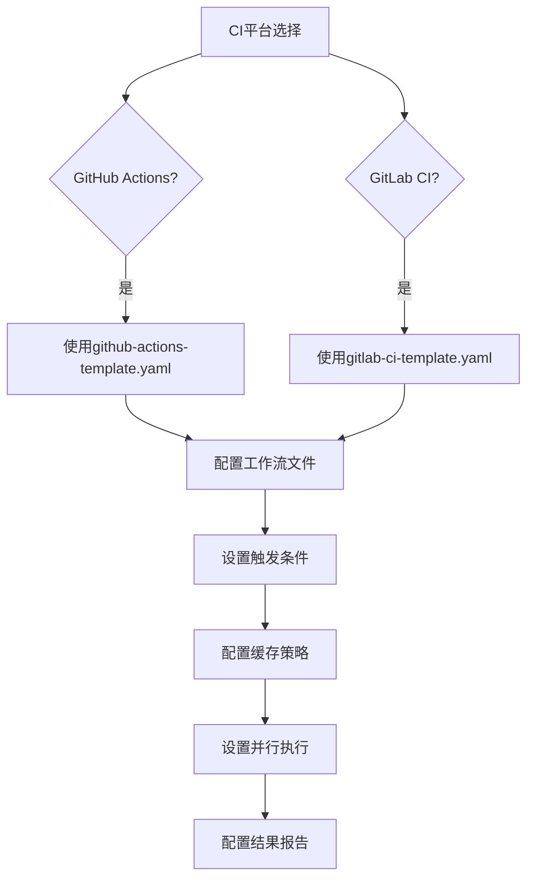
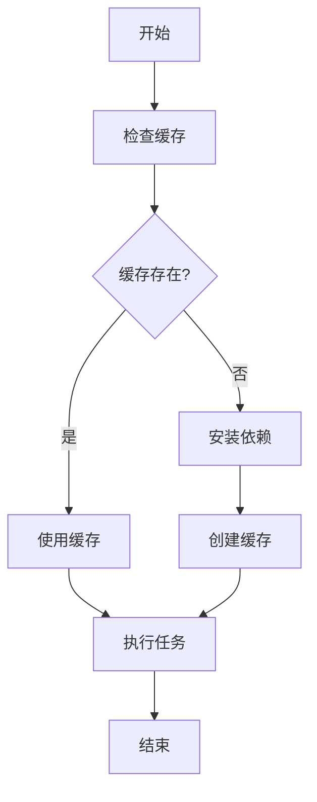
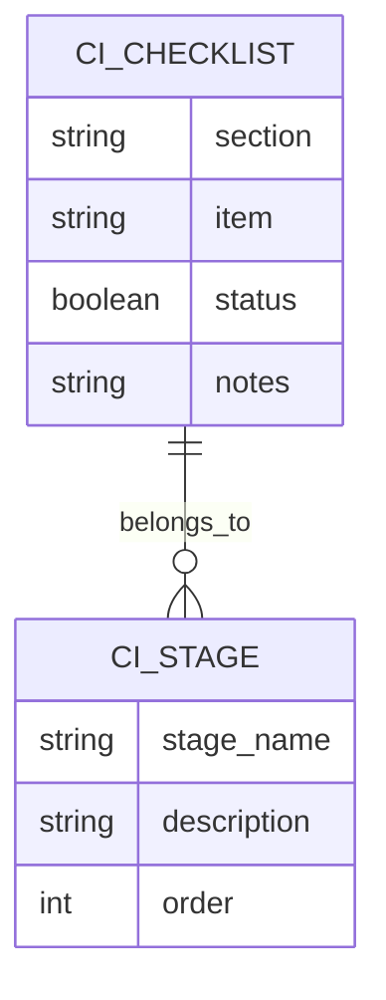

# CI流水线配置

<cite>
**本文档引用的文件**  
- [github-actions-template.yaml](file://src/modules/bmm/workflows/testarch/ci/github-actions-template.yaml)
- [gitlab-ci-template.yaml](file://src/modules/bmm/workflows/testarch/ci/gitlab-ci-template.yaml)
- [instructions.md](file://src/modules/bmm/workflows/testarch/ci/instructions.md)
- [checklist.md](file://src/modules/bmm/workflows/testarch/ci/checklist.md)
- [workflow.yaml](file://src/modules/bmb/workflows-legacy/create-module/workflow.yaml)
</cite>

## 目录
1. [CI工作流阶段解析](#ci工作流阶段解析)
2. [主流CI平台配置](#主流ci平台配置)
3. [CI配置最佳实践](#ci配置最佳实践)
4. [CI配置检查清单](#ci配置检查清单)
5. [不同项目规模的优化建议](#不同项目规模的优化建议)

## CI工作流阶段解析

深入解析CI流水线中定义的各个阶段和步骤，包括代码质量检查、测试执行、冒烟测试和结果报告等关键环节。

**Section sources**
- [github-actions-template.yaml](file://src/modules/bmm/workflows/testarch/ci/github-actions-template.yaml#L1-L166)
- [gitlab-ci-template.yaml](file://src/modules/bmm/workflows/testarch/ci/gitlab-ci-template.yaml#L1-L129)

## 主流CI平台配置

详细说明如何使用github-actions-template.yaml和gitlab-ci-template.yaml快速配置GitHub Actions和GitLab CI两大主流CI平台。

**Diagram sources**
- [github-actions-template.yaml](file://src/modules/bmm/workflows/testarch/ci/github-actions-template.yaml#L1-L166)
- [gitlab-ci-template.yaml](file://src/modules/bmm/workflows/testarch/ci/gitlab-ci-template.yaml#L1-L129)

**Section sources**
- [github-actions-template.yaml](file://src/modules/bmm/workflows/testarch/ci/github-actions-template.yaml#L1-L166)
- [gitlab-ci-template.yaml](file://src/modules/bmm/workflows/testarch/ci/gitlab-ci-template.yaml#L1-L129)

## CI配置最佳实践

阐述instructions.md中提到的CI配置最佳实践，包括环境变量管理、缓存策略、并行执行等。

### 环境变量管理

合理配置环境变量，确保敏感信息的安全性和配置的灵活性。

### 缓存策略

实施有效的缓存策略，显著减少CI流水线的执行时间。

**Diagram sources**
- [instructions.md](file://src/modules/bmm/workflows/testarch/ci/instructions.md#L76-L467)

### 并行执行

通过并行执行测试用例，大幅缩短测试阶段的执行时间。

**Section sources**
- [instructions.md](file://src/modules/bmm/workflows/testarch/ci/instructions.md#L76-L467)

## CI配置检查清单

解释checklist.md中的CI配置检查项，涵盖环境准备、依赖安装、构建执行、测试运行和结果报告等关键环节。

**Diagram sources**
- [checklist.md](file://src/modules/bmm/workflows/testarch/ci/checklist.md#L1-L247)

**Section sources**
- [checklist.md](file://src/modules/bmm/workflows/testarch/ci/checklist.md#L1-L247)

## 不同项目规模的优化建议

提供针对不同项目规模（小型、中型、大型）的CI流水线优化建议和性能调优技巧。

### 小型项目

对于小型项目，建议采用简化配置，重点关注核心功能的测试覆盖。

### 中型项目

中型项目需要平衡测试覆盖率和执行效率，建议实施分层测试策略。

### 大型项目

大型项目应重点关注性能优化和资源管理，建议采用分布式执行和智能调度。

**Section sources**
- [workflow.yaml](file://src/modules/bmb/workflows-legacy/create-module/workflow.yaml#L1-L53)
- [instructions.md](file://src/modules/bmm/workflows/testarch/ci/instructions.md#L76-L467)