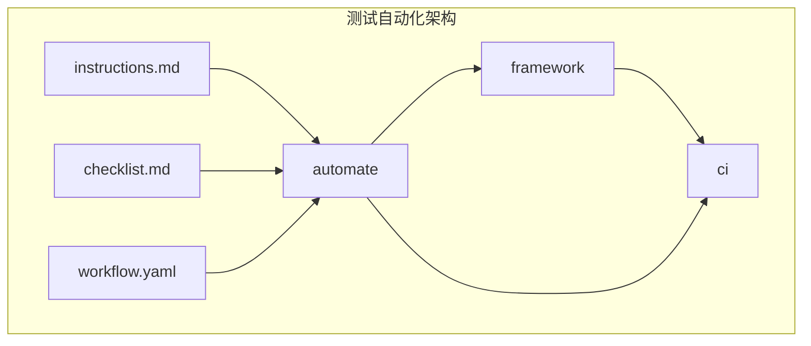
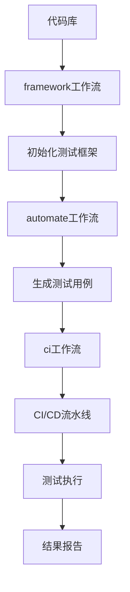
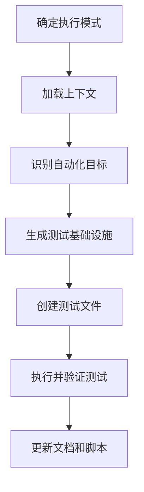
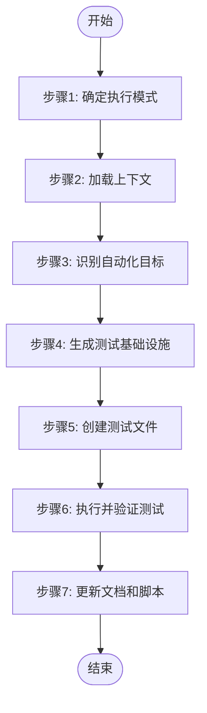
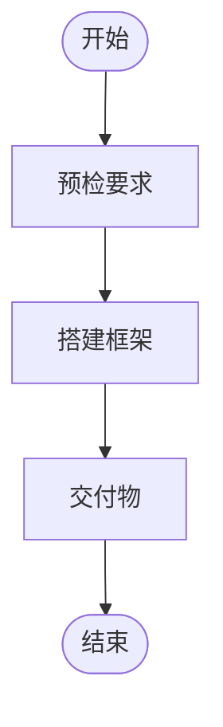
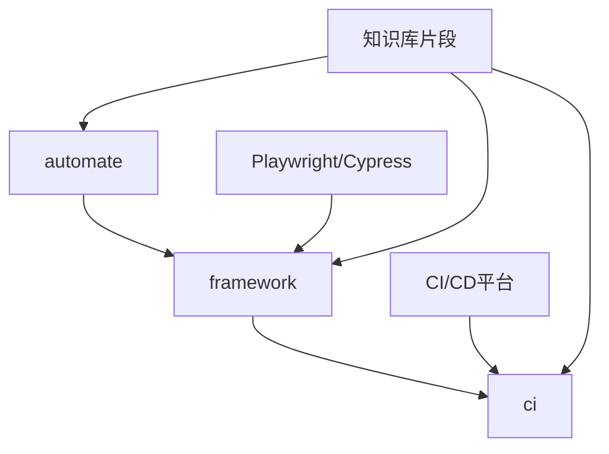

# 测试自动化

<cite>
**本文档引用的文件**   
- [workflow.yaml](file://src/modules/bmm/workflows/testarch/automate/workflow.yaml)
- [instructions.md](file://src/modules/bmm/workflows/testarch/automate/instructions.md)
- [checklist.md](file://src/modules/bmm/workflows/testarch/automate/checklist.md)
- [framework/workflow.yaml](file://src/modules/bmm/workflows/testarch/framework/workflow.yaml)
- [framework/instructions.md](file://src/modules/bmm/workflows/testarch/framework/instructions.md)
- [test/README.md](file://test/README.md)
</cite>

## 目录
1. [简介](#简介)
2. [项目结构](#项目结构)
3. [核心组件](#核心组件)
4. [架构概述](#架构概述)
5. [详细组件分析](#详细组件分析)
6. [依赖分析](#依赖分析)
7. [性能考虑](#性能考虑)
8. [故障排除指南](#故障排除指南)
9. [结论](#结论)
10. [附录](#附录) (如有必要)

## 简介
本文档深入分析了`automate/workflow.yaml`中定义的测试自动化执行流程，详细说明如何通过该工作流实现单元测试、集成测试和端到端测试的自动化执行。结合`instructions.md`中的指导原则，阐述了测试框架集成、测试用例管理、测试数据准备和测试结果收集的最佳实践。解释了`checklist.md`中的自动化测试检查项，包括测试覆盖率、执行稳定性、报告生成和失败分析等关键环节。说明了该自动化流程与`framework/workflow.yaml`中定义的测试架构框架的集成方式，并提供了实际项目中的自动化测试实施案例。

## 项目结构
该测试自动化系统位于`src/modules/bmm/workflows/testarch/`目录下，主要包含三个核心工作流：`automate`（自动化测试生成）、`framework`（测试框架初始化）和`ci`（CI/CD流水线）。每个工作流都包含`workflow.yaml`（工作流定义）、`instructions.md`（操作指南）和`checklist.md`（验证清单）三个核心文件。

**Diagram sources**
- [workflow.yaml](file://src/modules/bmm/workflows/testarch/automate/workflow.yaml)
- [instructions.md](file://src/modules/bmm/workflows/testarch/automate/instructions.md)
- [checklist.md](file://src/modules/bmm/workflows/testarch/automate/checklist.md)

**Section sources**
- [workflow.yaml](file://src/modules/bmm/workflows/testarch/automate/workflow.yaml)
- [instructions.md](file://src/modules/bmm/workflows/testarch/automate/instructions.md)

## 核心组件
测试自动化的核心是`automate/workflow.yaml`文件，它定义了一个可扩展的测试自动化工作流。该工作流支持两种执行模式：BMad集成模式（与BMad工件协同工作）和独立模式（独立分析代码库并生成测试）。工作流通过加载知识库片段（如`test-levels-framework.md`和`test-priorities-matrix.md`）来确保测试设计符合最佳实践。

**Section sources**
- [workflow.yaml](file://src/modules/bmm/workflows/testarch/automate/workflow.yaml)
- [instructions.md](file://src/modules/bmm/workflows/testarch/automate/instructions.md)

## 架构概述
测试自动化架构采用分层设计，从底层的测试框架初始化到上层的自动化测试生成和CI/CD集成。`framework`工作流负责初始化测试框架（Playwright或Cypress），创建目录结构，生成配置文件和测试基础设施。`automate`工作流在此基础上生成具体的测试用例，而`ci`工作流则负责将测试集成到CI/CD流水线中。

**Diagram sources**
- [framework/workflow.yaml](file://src/modules/bmm/workflows/testarch/framework/workflow.yaml)
- [automate/workflow.yaml](file://src/modules/bmm/workflows/testarch/automate/workflow.yaml)
- [ci/workflow.yaml](file://src/modules/bmm/workflows/testarch/ci/workflow.yaml)

## 详细组件分析

### 自动化工作流分析
`automate/workflow.yaml`定义了测试自动化的核心逻辑。它首先确定执行模式并加载上下文，然后识别自动化目标，生成测试基础设施，创建测试文件，执行并验证生成的测试，最后更新文档和脚本。

#### 自动化工作流步骤

**Diagram sources**
- [instructions.md](file://src/modules/bmm/workflows/testarch/automate/instructions.md#L45-L800)

#### 测试生成流程

**Diagram sources**
- [instructions.md](file://src/modules/bmm/workflows/testarch/automate/instructions.md#L45-L800)

**Section sources**
- [instructions.md](file://src/modules/bmm/workflows/testarch/automate/instructions.md#L45-L800)
- [workflow.yaml](file://src/modules/bmm/workflows/testarch/automate/workflow.yaml)

### 框架初始化分析
`framework`工作流负责初始化测试框架，包括选择框架（Playwright或Cypress）、创建目录结构、生成配置文件、实现夹具架构和数据工厂。

#### 框架初始化流程

**Diagram sources**
- [framework/instructions.md](file://src/modules/bmm/workflows/testarch/framework/instructions.md#L26-L482)

**Section sources**
- [framework/instructions.md](file://src/modules/bmm/workflows/testarch/framework/instructions.md#L26-L482)
- [framework/workflow.yaml](file://src/modules/bmm/workflows/testarch/framework/workflow.yaml)

## 依赖分析
测试自动化系统依赖于多个组件和工具。`automate`工作流依赖于`framework`工作流创建的测试框架，而`ci`工作流又依赖于前两者生成的测试套件。系统还依赖于外部工具如Playwright、Cypress和各种CI/CD平台。

**Diagram sources**
- [workflow.yaml](file://src/modules/bmm/workflows/testarch/automate/workflow.yaml)
- [framework/workflow.yaml](file://src/modules/bmm/workflows/testarch/framework/workflow.yaml)
- [ci/workflow.yaml](file://src/modules/bmm/workflows/testarch/ci/workflow.yaml)

**Section sources**
- [workflow.yaml](file://src/modules/bmm/workflows/testarch/automate/workflow.yaml)
- [framework/workflow.yaml](file://src/modules/bmm/workflows/testarch/framework/workflow.yaml)
- [ci/workflow.yaml](file://src/modules/bmm/workflows/testarch/ci/workflow.yaml)

## 性能考虑
测试自动化系统在设计时考虑了性能因素。`ci`工作流通过并行分片和缓存机制显著提高了CI执行速度。系统还通过"仅在失败时上传"的策略来减少存储开销，同时保持调试能力。自动化测试生成过程本身也经过优化，能够快速生成大量测试用例。

## 故障排除指南
当测试自动化流程出现问题时，应首先检查预检要求是否满足。对于`framework`工作流，确保`package.json`存在且没有现有的测试框架。对于`automate`工作流，确保框架已正确配置。对于`ci`工作流，确保Git仓库已初始化且本地测试通过。

**Section sources**
- [test/README.md](file://test/README.md#L1-L296)

## 结论
本文档详细分析了BMAD方法中的测试自动化系统，展示了如何通过`automate`、`framework`和`ci`三个工作流实现从测试框架初始化到自动化测试生成再到CI/CD集成的完整流程。该系统通过知识库片段确保测试设计符合最佳实践，并通过自动化验证和修复机制提高测试的可靠性和维护性。

## 附录
### 测试自动化检查清单
根据`automate/checklist.md`，测试自动化必须满足以下完成标准：
- [ ] **确定执行模式**（BMad集成、独立或自动发现）
- [ ] **加载并验证框架配置**
- [ ] **完成覆盖率分析**（如果analyze_coverage为true）
- [ ] **识别自动化目标**（需要测试的内容）
- [ ] **适当选择测试级别**（E2E、API、组件、单元）
- [ ] **避免重复覆盖**（同一行为不在多个级别测试）
- [ ] **分配测试优先级**（P0、P1、P2、P3）
- [ ] **创建/增强夹具架构**并实现自动清理
- [ ] **创建/增强数据工厂**使用faker（无硬编码数据）
- [ ] **创建/增强辅助工具**（如需要）
- [ ] **生成适当级别的测试文件**（E2E、API、组件、单元）
- [ ] **一致使用Given-When-Then格式**
- [ ] **在所有测试名称中添加优先级标签**（[P0]、[P1]、[P2]、[P3]）
- [ ] **在E2E测试中使用data-testid选择器**（而非CSS类）
- [ ] **应用网络优先模式**（导航前拦截路由）
- [ ] **强制执行质量标准**（无硬等待、无不稳定模式、自清理、确定性）
- [ ] **更新测试README**包含执行说明和模式
- [ ] **更新package.json脚本**包含测试执行命令
- [ ] **在本地运行测试套件**（如果run_tests_after_generation为true）
- [ ] **验证测试**（如果auto_validate启用）
- [ ] **修复失败**（如果auto_heal_failures启用且测试失败）
- [ ] **生成修复报告**（如果尝试修复）
- [ ] **标记无法修复的测试**使用test.fixme()和详细注释（如有）
- [ ] **创建自动化摘要**并保存到正确位置
- [ ] **正确格式化输出文件**
- [ ] **应用并记录知识库引用**（包括使用的修复片段）
- [ ] **无测试质量问题**（不稳定模式、竞争条件、硬编码数据、页面对象）