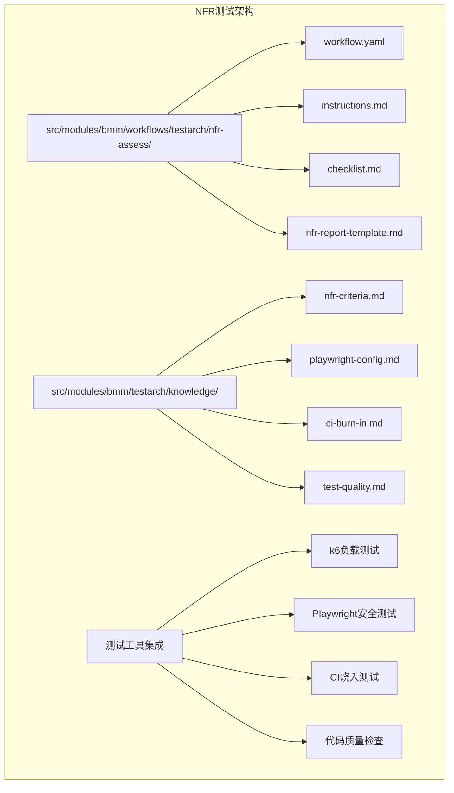
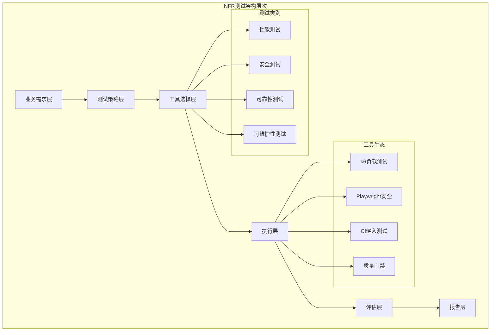
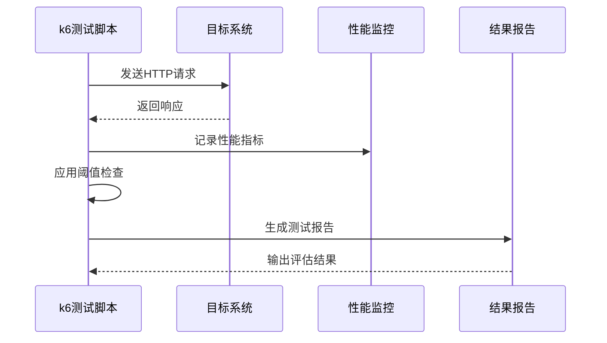
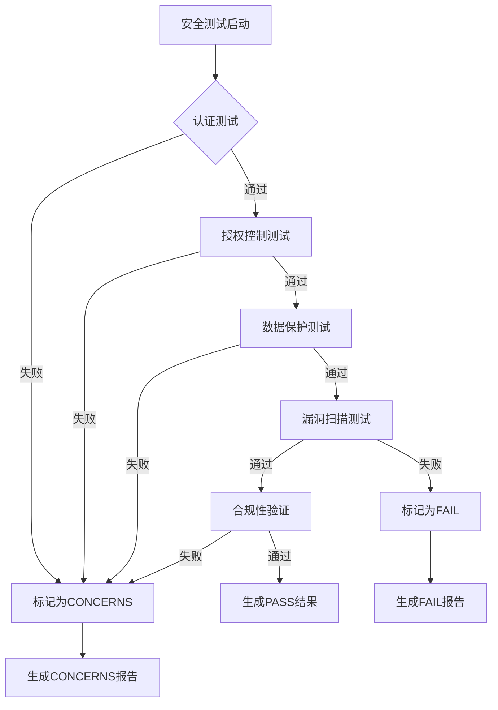
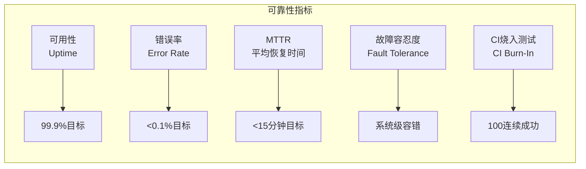
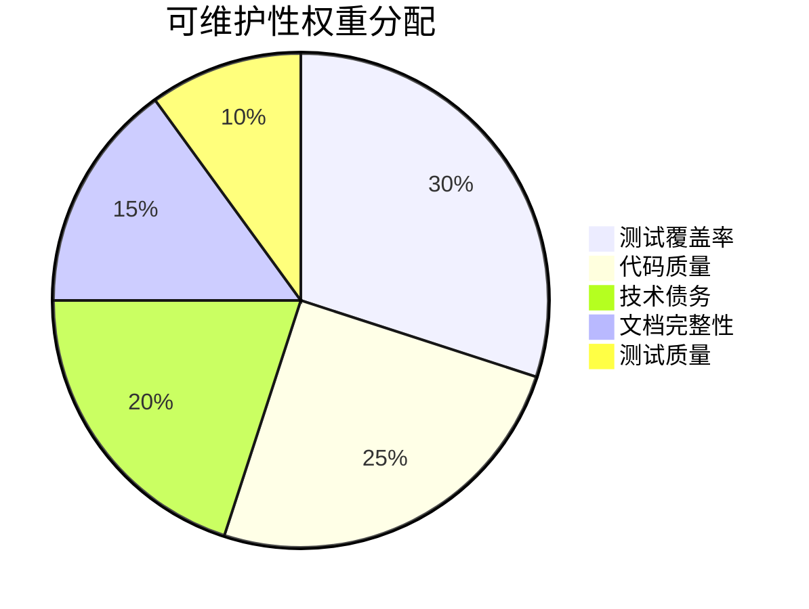
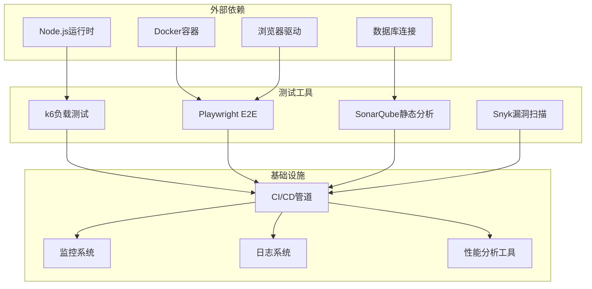

# 非功能需求测试

<cite>
**本文档引用的文件**
- [nfr-report-template.md](file://src/modules/bmm/workflows/testarch/nfr-assess/nfr-report-template.md)
- [workflow.yaml](file://src/modules/bmm/workflows/testarch/nfr-assess/workflow.yaml)
- [instructions.md](file://src/modules/bmm/workflows/testarch/nfr-assess/instructions.md)
- [checklist.md](file://src/modules/bmm/workflows/testarch/nfr-assess/checklist.md)
- [nfr-criteria.md](file://src/modules/bmm/testarch/knowledge/nfr-criteria.md)
- [playwright-config.md](file://src/modules/bmm/testarch/knowledge/playwright-config.md)
- [ci-burn-in.md](file://src/modules/bmm/testarch/knowledge/ci-burn-in.md)
- [test-quality.md](file://src/modules/bmm/testarch/knowledge/test-quality.md)
</cite>

## 目录
1. [概述](#概述)
2. [项目结构](#项目结构)
3. [核心组件](#核心组件)
4. [架构概览](#架构概览)
5. [详细组件分析](#详细组件分析)
6. [依赖关系分析](#依赖关系分析)
7. [性能考虑](#性能考虑)
8. [故障排除指南](#故障排除指南)
9. [结论](#结论)

## 概述

非功能需求（NFR）测试是软件质量保证的重要组成部分，专注于验证系统的性能、安全性、可靠性和可维护性等非功能性特征。本文档基于BMAD-METHOD框架中的NFR评估工作流，提供了全面的非功能测试指导。

NFR测试的核心原则包括：
- **自动化验证**：通过自动化测试而非手动检查清单验证NFR
- **客观标准**：使用可测量的阈值和明确的PASS/CONCERNS/FAIL分类
- **证据驱动**：基于具体证据进行评估，避免主观判断
- **持续集成**：将NFR测试集成到CI/CD管道中

## 项目结构

NFR测试相关文件主要分布在以下目录结构中：

**图表来源**
- [workflow.yaml](file://src/modules/bmm/workflows/testarch/nfr-assess/workflow.yaml#L1-L50)
- [nfr-criteria.md](file://src/modules/bmm/testarch/knowledge/nfr-criteria.md#L1-L100)

**章节来源**
- [workflow.yaml](file://src/modules/bmm/workflows/testarch/nfr-assess/workflow.yaml#L1-L50)
- [instructions.md](file://src/modules/bmm/workflows/testarch/nfr-assess/instructions.md#L1-L144)

## 核心组件

### NFR评估工作流

NFR评估工作流是一个自动化测试验证系统，包含以下核心组件：

1. **工作流引擎**：基于BMAD框架的自动化测试执行引擎
2. **证据收集器**：自动发现和收集各种NFR测试证据
3. **评估引擎**：基于预定义规则的自动化评估系统
4. **报告生成器**：自动生成标准化的NFR评估报告

### 测试工具集成

系统集成了多种专业的测试工具：

- **k6**：用于负载测试、压力测试和性能基准测试
- **Playwright**：用于端到端安全测试和可靠性验证
- **CI烧入测试**：确保测试稳定性
- **代码质量工具**：静态分析和覆盖率检查

**章节来源**
- [workflow.yaml](file://src/modules/bmm/workflows/testarch/nfr-assess/workflow.yaml#L20-L40)
- [nfr-criteria.md](file://src/modules/bmm/testarch/knowledge/nfr-criteria.md#L664-L668)

## 架构概览

NFR测试架构采用分层设计，确保各个测试组件之间的协调工作：

**图表来源**
- [nfr-criteria.md](file://src/modules/bmm/testarch/knowledge/nfr-criteria.md#L660-L670)
- [instructions.md](file://src/modules/bmm/workflows/testarch/nfr-assess/instructions.md#L10-L25)

## 详细组件分析

### 性能测试组件

性能测试是NFR评估的核心部分，重点关注响应时间、吞吐量和资源使用情况。

#### k6负载测试实现

k6是专门用于性能测试的工具，提供以下能力：

**图表来源**
- [nfr-criteria.md](file://src/modules/bmm/testarch/knowledge/nfr-criteria.md#L170-L250)

#### 性能指标定义

| 指标类型 | 默认阈值 | 评估标准 | 证据来源 |
|---------|---------|---------|---------|
| 响应时间P95 | < 500ms | 满足SLO/SLA要求 | k6负载测试结果 |
| 错误率 | < 1% | 系统稳定性验证 | 性能监控数据 |
| API响应时间P99 | < 1000ms | 关键路径性能 | 自定义指标 |
| 资源使用率 | CPU<70%, 内存<80% | 系统健康状态 | APM监控 |

**章节来源**
- [nfr-criteria.md](file://src/modules/bmm/testarch/knowledge/nfr-criteria.md#L170-L296)

### 安全测试组件

安全测试验证系统的认证、授权、数据保护和漏洞管理能力。

#### Playwright安全测试架构

**图表来源**
- [playwright-config.md](file://src/modules/bmm/testarch/knowledge/playwright-config.md#L1-L100)
- [nfr-criteria.md](file://src/modules/bmm/testarch/knowledge/nfr-criteria.md#L148-L161)

#### 安全测试检查项

| 测试类别 | 具体项目 | 验证标准 | 工具支持 |
|---------|---------|---------|---------|
| 认证强度 | JWT令牌过期 | 15分钟自动过期 | Playwright |
| 授权控制 | RBAC权限验证 | 403错误处理 | Playwright |
| 密钥管理 | 敏感信息不泄露 | 日志中无密码明文 | 自动化检查 |
| 输入验证 | SQL注入防护 | 输入参数安全过滤 | OWASP工具 |
| XSS防护 | 跨站脚本攻击 | 输出内容HTML转义 | 安全扫描工具 |

**章节来源**
- [nfr-criteria.md](file://src/modules/bmm/testarch/knowledge/nfr-criteria.md#L148-L161)

### 可靠性测试组件

可靠性测试关注系统的可用性、错误处理和恢复能力。

#### 可靠性评估维度

**图表来源**
- [nfr-criteria.md](file://src/modules/bmm/testarch/knowledge/nfr-criteria.md#L617-L647)

#### 可靠性测试策略

| 测试类型 | 目标指标 | 验证方法 | 失败处理 |
|---------|---------|---------|---------|
| 错误处理 | 优雅降级 | 模拟服务不可用 | 标记CONCERNS |
| 重试机制 | 3次重试 | 网络延迟模拟 | 验证重试逻辑 |
| 健康检查 | /api/health端点 | 响应状态验证 | 立即FAIL |
| 电路断路器 | 故障阈值检测 | 异常流量抑制 | 测试断路效果 |
| 离线处理 | 网络中断恢复 | 断网场景验证 | 评估恢复策略 |

**章节来源**
- [nfr-criteria.md](file://src/modules/bmm/testarch/knowledge/nfr-criteria.md#L617-L647)

### 可维护性测试组件

可维护性测试评估代码质量、测试覆盖率和技术债务。

#### 可维护性指标体系

**图表来源**
- [test-quality.md](file://src/modules/bmm/testarch/knowledge/test-quality.md#L1-L50)

**章节来源**
- [test-quality.md](file://src/modules/bmm/testarch/knowledge/test-quality.md#L1-L200)

## 依赖关系分析

NFR测试系统具有复杂的依赖关系网络：

**图表来源**
- [workflow.yaml](file://src/modules/bmm/workflows/testarch/nfr-assess/workflow.yaml#L29-L40)
- [ci-burn-in.md](file://src/modules/bmm/testarch/knowledge/ci-burn-in.md#L1-L50)

**章节来源**
- [workflow.yaml](file://src/modules/bmm/workflows/testarch/nfr-assess/workflow.yaml#L29-L40)
- [ci-burn-in.md](file://src/modules/bmm/testarch/knowledge/ci-burn-in.md#L1-L100)

## 性能考虑

### 测试执行优化

NFR测试需要在保证质量的前提下优化执行性能：

1. **并行执行**：多个测试套件同时运行
2. **智能调度**：基于变更内容选择测试范围
3. **缓存策略**：复用测试环境和依赖
4. **增量测试**：只运行变更相关的测试

### 资源消耗控制

| 资源类型 | 限制策略 | 监控指标 | 优化方法 |
|---------|---------|---------|---------|
| CPU使用率 | 并发数控制 | 实时监控 | 动态调整worker数量 |
| 内存占用 | 峰值限制 | 内存泄漏检测 | 及时清理临时数据 |
| 网络带宽 | 流量控制 | 吞吐量监控 | 连接池复用 |
| 存储空间 | 容量告警 | 磁盘使用率 | 定期清理测试产物 |

## 故障排除指南

### 常见问题及解决方案

#### 性能测试问题

**问题**：k6测试结果不稳定
**原因**：环境差异、并发设置不当
**解决方案**：
1. 使用标准化测试环境
2. 调整并发用户数和测试时长
3. 增加测试迭代次数（10次烧入）

**问题**：响应时间超过阈值
**原因**：系统瓶颈、配置不当
**解决方案**：
1. 分析性能瓶颈点
2. 优化数据库查询
3. 调整缓存策略

#### 安全测试问题

**问题**：认证测试失败
**原因**：令牌过期、权限不足
**解决方案**：
1. 更新认证凭据
2. 检查RBAC配置
3. 验证JWT密钥设置

**问题**：漏洞扫描发现高危漏洞
**原因**：依赖版本过旧
**解决方案**：
1. 更新依赖包版本
2. 执行安全补丁
3. 重新扫描验证

#### 可靠性测试问题

**问题**：错误率超出预期
**原因**：异常处理不完善
**解决方案**：
1. 完善错误捕获机制
2. 添加重试逻辑
3. 优化超时设置

**问题**：MTTR时间过长
**原因**：监控缺失、恢复流程复杂
**解决方案**：
1. 建立实时监控
2. 简化故障恢复步骤
3. 制定应急预案

**章节来源**
- [instructions.md](file://src/modules/bmm/workflows/testarch/nfr-assess/instructions.md#L100-L144)
- [checklist.md](file://src/modules/bmm/workflows/testarch/nfr-assess/checklist.md#L1-L130)

## 结论

非功能需求测试是确保软件系统质量的关键环节。通过BMAD-METHOD框架提供的NFR评估工作流，团队可以：

1. **建立标准化流程**：使用统一的测试方法和评估标准
2. **实现自动化验证**：减少人工干预，提高测试效率
3. **提供客观评估**：基于具体证据做出准确判断
4. **支持持续改进**：通过定期评估推动质量提升

成功的NFR测试需要：
- 明确的测试目标和阈值定义
- 适当的工具选择和配置
- 完善的证据收集和验证机制
- 持续的过程改进和优化

通过遵循本文档提供的指导原则和最佳实践，开发团队能够构建高质量、高性能、高可靠性的软件系统，满足业务需求和用户期望。