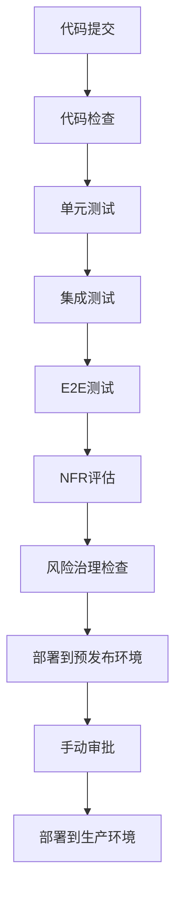
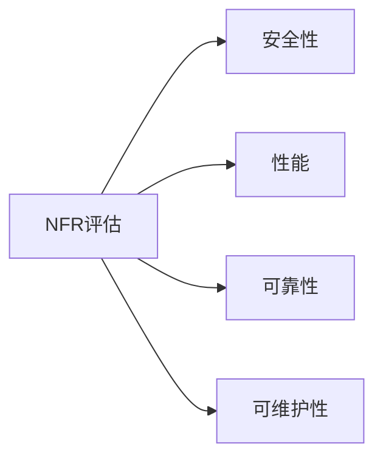

# 测试架构

<cite>
**本文档引用的文件**  
- [test-levels-framework.md](file://src/modules/bmm/testarch/knowledge/test-levels-framework.md)
- [api-request.md](file://src/modules/bmm/testarch/knowledge/api-request.md)
- [overview.md](file://src/modules/bmm/testarch/knowledge/overview.md)
- [risk-governance.md](file://src/modules/bmm/testarch/knowledge/risk-governance.md)
- [nfr-criteria.md](file://src/modules/bmm/testarch/knowledge/nfr-criteria.md)
- [auth-session.md](file://src/modules/bmm/testarch/knowledge/auth-session.md)
- [recurse.md](file://src/modules/bmm/testarch/knowledge/recurse.md)
- [fixtures-composition.md](file://src/modules/bmm/testarch/knowledge/fixtures-composition.md)
- [test-design/workflow.md](file://src/modules/bmm/workflows/testarch/test-design/workflow.md)
- [ci/workflow.yaml](file://src/modules/bmm/workflows/testarch/ci/workflow.yaml)
- [atdd/workflow.md](file://src/modules/bmm/workflows/testarch/atdd/workflow.md)
- [trace/workflow.md](file://src/modules/bmm/workflows/testarch/trace/workflow.md)
- [nfr-assess/workflow.md](file://src/modules/bmm/workflows/testarch/nfr-assess/workflow.md)
- [github-actions-template.yaml](file://src/modules/bmm/workflows/testarch/ci/github-actions-template.yaml)
- [gitlab-ci-template.yaml](file://src/modules/bmm/workflows/testarch/ci/gitlab-ci-template.yaml)
</cite>

## 目录
1. [引言](#引言)
2. [测试设计工作流](#测试设计工作流)
3. [CI/CD流水线配置](#cicd流水线配置)
4. [验收测试驱动开发（ATDD）](#验收测试驱动开发atdd)
5. [需求-测试追溯工作流](#需求-测试追溯工作流)
6. [非功能需求评估](#非功能需求评估)
7. [测试分层策略](#测试分层策略)
8. [CI模板使用指南](#ci模板使用指南)
9. [总结](#总结)

## 引言

本测试架构文档详细阐述了BMAD方法论中的测试设计、CI集成、验收测试驱动开发（ATDD）和测试追溯等关键工作流。文档基于项目中的知识文件和工作流配置，全面说明了如何通过系统化的方法确保软件质量。测试架构的核心是将测试活动集成到开发流程的每个阶段，从需求分析到部署，确保每个功能都有相应的测试覆盖，并通过自动化工具链实现持续验证。

测试架构强调使用`@seontechnologies/playwright-utils`等生产级工具，通过fixture-based（基于夹具）的实用程序来处理常见的测试模式，如API请求、网络记录、身份验证会话等。这种设计模式确保了测试的可重用性、可组合性和类型安全性。同时，通过风险治理和非功能需求（NFR）评估，将主观的“是否可以发布”辩论转化为基于数据的客观决策，确保发布质量。

**Section sources**
- [overview.md](file://src/modules/bmm/testarch/knowledge/overview.md)

## 测试设计工作流

测试设计工作流（`test-design/workflow.md`）是整个测试架构的起点，它指导如何系统地设计测试用例。该工作流的核心是将测试设计视为一个结构化的分析过程，而非简单的检查清单。它利用“效用树”（Utility Tree）来识别和分类风险，确保测试覆盖了所有关键路径。

工作流的关键步骤包括：
1.  **风险识别**：通过分析用户故事和验收标准，识别潜在的技术、安全、性能和业务风险。
2.  **风险分类与评分**：使用概率（1-3）和影响（1-3）的矩阵对风险进行评分，总分1-9。得分≥6的风险必须有明确的缓解计划。
3.  **测试用例生成**：根据风险评分和分类，生成具体的测试用例。高风险（得分≥6）的路径必须有端到端（E2E）测试覆盖。
4.  **测试级别决策**：遵循`test-levels-framework.md`的指导，决定使用单元测试、集成测试还是E2E测试。例如，纯业务逻辑应使用单元测试，而跨系统的用户旅程则使用E2E测试。
5.  **测试ID格式化**：所有测试用例遵循`{EPIC}.{STORY}-{LEVEL}-{SEQ}`的格式，例如`1.3-UNIT-001`，确保了测试的可追溯性。

该工作流确保了测试设计是主动的、基于风险的，而不是被动的、基于功能的，从而提高了测试的有效性和效率。

**Section sources**
- [test-design/workflow.md](file://src/modules/bmm/workflows/testarch/test-design/workflow.md)
- [risk-governance.md](file://src/modules/bmm/testarch/knowledge/risk-governance.md)
- [test-levels-framework.md](file://src/modules/bmm/testarch/knowledge/test-levels-framework.md)

## CI/CD流水线配置

`ci/workflow.yaml`文件定义了CI/CD流水线的自动化流程。该流水线旨在通过自动化测试和质量检查来保障代码质量和发布安全。流水线的设计遵循了“快速失败”原则，确保问题能在早期被发现。

流水线的主要阶段和配置如下：

**Diagram sources**
- [ci/workflow.yaml](file://src/modules/bmm/workflows/testarch/ci/workflow.yaml)

**关键配置说明：**
- **代码检查**：使用ESLint和Prettier进行静态代码分析，确保代码风格一致。
- **测试执行**：并行运行单元、集成和E2E测试，以缩短反馈周期。E2E测试使用Playwright，并利用`@seontechnologies/playwright-utils`的`apiRequest` fixture进行类型安全的API调用。
- **NFR评估**：在流水线中集成k6进行性能测试，验证SLO/SLA指标（如P95延迟<500ms，错误率<1%）。
- **风险治理**：流水线会检查风险治理矩阵，如果存在未解决的“关键”风险（得分=9），则自动阻止部署。
- **环境隔离**：测试在隔离的环境中运行，如使用Docker容器或临时数据库，确保测试的可靠性和独立性。

此配置确保了每次代码变更都经过全面的自动化验证，为持续交付提供了坚实的基础。

**Section sources**
- [ci/workflow.yaml](file://src/modules/bmm/workflows/testarch/ci/workflow.yaml)

## 验收测试驱动开发（ATDD）

ATDD工作流（`atdd/workflow.md`）实现了验收测试驱动开发，将业务需求、开发和测试紧密地结合在一起。其核心思想是，在开发任何代码之前，先与利益相关者（如产品负责人）共同定义清晰、可执行的验收标准。

工作流的执行过程如下：
1.  **协作编写**：开发、测试和产品团队在`atdd`目录下共同编写验收测试。这些测试使用Gherkin语法（Given-When-Then）描述，确保业务语言的清晰性。
2.  **自动化实现**：测试工程师将这些验收标准转化为自动化的Playwright测试脚本。这些脚本直接映射到`test-design`工作流中生成的测试用例。
3.  **持续验证**：自动化测试被集成到CI流水线中。开发人员在编写代码时，会以这些验收测试作为目标，确保代码满足所有业务需求。
4.  **反馈闭环**：当所有验收测试通过时，意味着功能已按预期完成，可以进入下一阶段。

通过ATDD，团队确保了“我们构建了正确的东西”（building the right thing），而不仅仅是“我们正确地构建了东西”（building the thing right）。这极大地减少了需求误解和返工。

**Section sources**
- [atdd/workflow.md](file://src/modules/bmm/workflows/testarch/atdd/workflow.md)

## 需求-测试追溯工作流

`trace/workflow.md`工作流建立了从需求到测试的完整追溯关系，确保了测试的完整性和可审计性。该工作流解决了“哪些需求被测试了？”和“哪些测试覆盖了哪些需求？”这两个关键问题。

追溯关系的建立方式如下：
1.  **标识关联**：每个验收标准（Acceptance Criterion）都有一个唯一的ID（如`AC-001`）。
2.  **测试映射**：在编写测试用例时，明确地将测试文件与一个或多个验收标准ID关联起来。这可以通过在测试代码的注释中声明，或在专门的映射文件中定义。
3.  **矩阵生成**：`trace`工作流会自动生成一个“需求-测试追溯矩阵”（Coverage Traceability Matrix）。该矩阵清晰地列出每个验收标准，并标明其对应的测试用例。
4.  **缺口检测**：工作流会自动检测未被任何测试覆盖的验收标准（即“缺口”）。任何未被覆盖的P0（最高优先级）需求都会被视为“失败”，阻止发布。
5.  **豁免管理**：对于低优先级的缺口，可以申请豁免，但必须提供理由、批准人和过期日期，确保决策的透明和可追溯。

这种严格的追溯机制是风险治理的基础，为合规性审计（如FDA、SOC2）提供了有力的证据。

**Section sources**
- [trace/workflow.md](file://src/modules/bmm/workflows/testarch/trace/workflow.md)
- [risk-governance.md](file://src/modules/bmm/testarch/knowledge/risk-governance.md)

## 非功能需求评估

`nfr-assess/workflow.md`工作流专门用于评估非功能需求（NFR）的测试要求。它强调NFR必须通过自动化测试来验证，而不是依赖主观的检查清单。

该工作流将NFR分为四个主要类别，并为每个类别定义了明确的、可量化的通过/失败标准：

**Diagram sources**
- [nfr-assess/workflow.md](file://src/modules/bmm/workflows/testarch/nfr-assess/workflow.md)
- [nfr-criteria.md](file://src/modules/bmm/testarch/knowledge/nfr-criteria.md)

**各NFR类别的评估方法：**
- **安全性**：使用Playwright进行E2E测试，验证身份验证、授权、会话过期、OWASP Top 10漏洞（如SQL注入、XSS）等。例如，测试必须验证JWT令牌在15分钟后过期。
- **性能**：使用k6进行负载测试，而非Playwright。通过定义SLO/SLA阈值（如P95延迟<500ms）并自动验证，确保系统在预期负载下的表现。
- **可靠性**：使用Playwright模拟故障场景，如API返回500错误、网络中断、服务降级等，验证应用的优雅降级和恢复能力。
- **可维护性**：在CI中集成代码质量工具。例如，使用`npm audit`扫描依赖漏洞，使用`jscpd`检查代码重复率（<5%），并通过Playwright验证错误是否被正确上报到Sentry等监控服务。

`nfr-assess`工作流的输出是NFR的客观评估结果（PASS/CONCERNS/FAIL），这些结果直接输入到`trace`工作流的发布门禁决策中。

**Section sources**
- [nfr-assess/workflow.md](file://src/modules/bmm/workflows/testarch/nfr-assess/workflow.md)
- [nfr-criteria.md](file://src/modules/bmm/testarch/knowledge/nfr-criteria.md)

## 测试分层策略

测试分层策略由`test-levels-framework.md`文件详细定义，它指导团队在不同场景下选择合适的测试级别，以实现测试金字塔的最佳平衡。

策略的核心是**测试级别决策矩阵**：

| 场景 | 单元测试 | 集成测试 | 端到端测试 |
| :--- | :--- | :--- | :--- |
| 纯业务逻辑 | ✅ 主要 | ❌ 过度 | ❌ 过度 |
| 数据库操作 | ❌ 无法测试 | ✅ 主要 | ❌ 过度 |
| API契约 | ❌ 无法测试 | ✅ 主要 | ⚠️ 补充 |
| 用户旅程 | ❌ 无法测试 | ❌ 无法测试 | ✅ 主要 |
| 视觉回归 | ❌ 无法测试 | ⚠️ 组件测试 | ✅ 主要 |

**关键原则：**
- **优先单元测试**：当逻辑可以隔离时，优先使用单元测试，因为它们速度快、稳定性高。
- **优先集成测试**：当需要验证组件交互或持久层时，使用集成测试。
- **优先E2E测试**：对于用户关键路径和跨系统工作流，使用E2E测试。
- **避免重复覆盖**：在添加新测试前，检查是否已在较低级别覆盖。重复覆盖仅在测试不同方面（如逻辑、交互、用户体验）或关键路径需要纵深防御时才被允许。

该策略确保了测试资源被高效利用，避免了在E2E测试中验证本应由单元测试覆盖的业务逻辑，从而构建了一个高效、可靠的测试套件。

**Section sources**
- [test-levels-framework.md](file://src/modules/bmm/testarch/knowledge/test-levels-framework.md)

## CI模板使用指南

项目提供了`github-actions-template.yaml`和`gitlab-ci-template.yaml`两个CI模板，旨在为不同平台的用户提供快速启动的配置。

**使用指南：**
1.  **选择模板**：根据项目使用的CI平台（GitHub Actions或GitLab CI）选择相应的模板文件。
2.  **复制配置**：将模板文件的内容复制到项目的CI配置文件中（如`.github/workflows/ci.yml`或`.gitlab-ci.yml`）。
3.  **自定义环境**：根据项目需求修改环境变量，如`BASE_URL`、`API_TOKEN`等。
4.  **调整测试命令**：更新`npm run test:coverage`等命令，以匹配项目实际的测试脚本。
5.  **集成NFR测试**：确保模板中包含了k6性能测试和NFR评估的步骤。
6.  **启用风险检查**：在部署前的步骤中，集成风险治理检查，确保没有关键风险被忽略。

这些模板已经预配置了最佳实践，如并行测试、缓存依赖、环境隔离等，用户只需进行少量定制即可投入使用，大大降低了CI/CD流水线的搭建成本。

**Section sources**
- [github-actions-template.yaml](file://src/modules/bmm/workflows/testarch/ci/github-actions-template.yaml)
- [gitlab-ci-template.yaml](file://src/modules/bmm/workflows/testarch/ci/gitlab-ci-template.yaml)

## 总结

本测试架构文档全面阐述了BMAD方法论中围绕测试的完整工作流体系。通过`test-design`、`atdd`、`trace`和`nfr-assess`等一系列结构化的工作流，将测试活动深度集成到软件开发生命周期的每个环节。该架构以风险治理为核心，通过客观的评分和自动化验证，确保了发布决策的质量和透明度。

关键优势在于：
- **系统性**：从需求到部署，每个环节都有明确的测试指导。
- **自动化**：大量依赖自动化工具（Playwright、k6、CI/CD）来执行和验证。
- **可追溯性**：建立了从需求到测试的完整追溯链，满足合规要求。
- **客观性**：使用量化指标（如风险分、SLO/SLA）替代主观判断。

通过实施此测试架构，团队可以显著提高软件质量，减少生产事故，并实现安全、高效的持续交付。