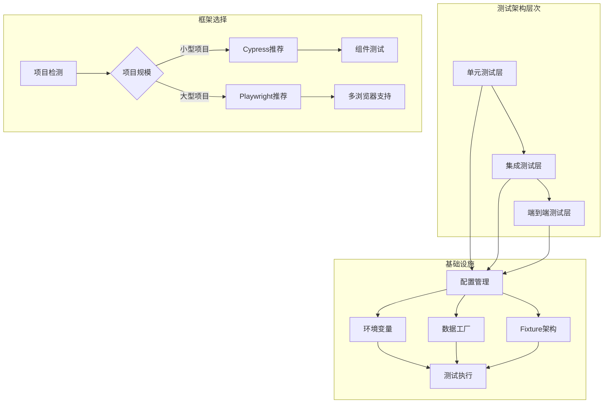
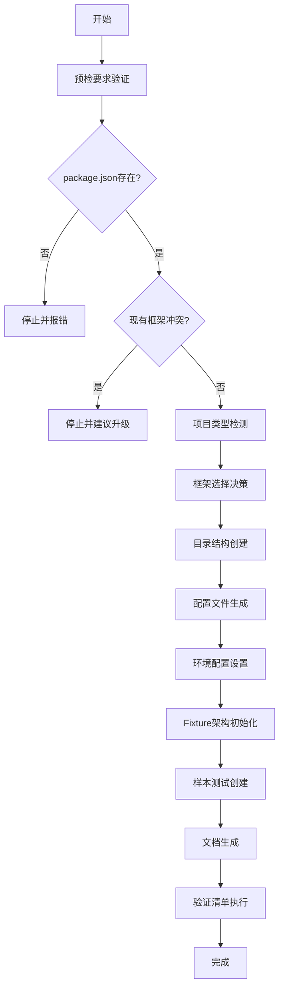
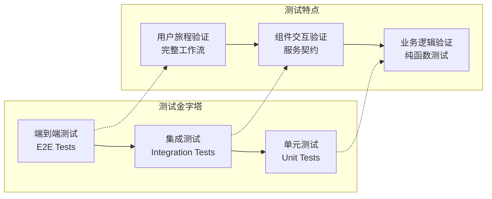
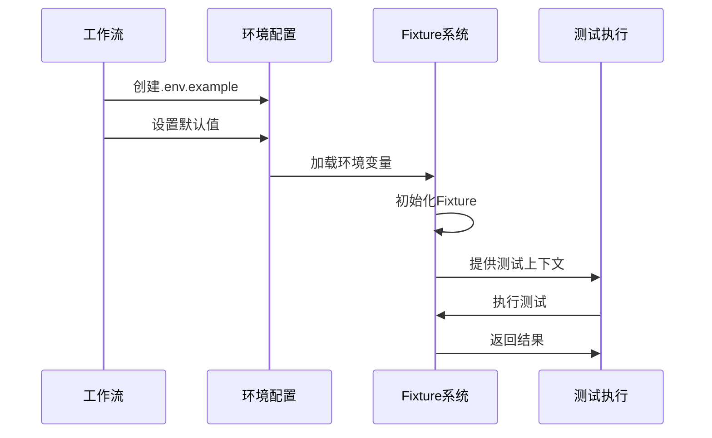
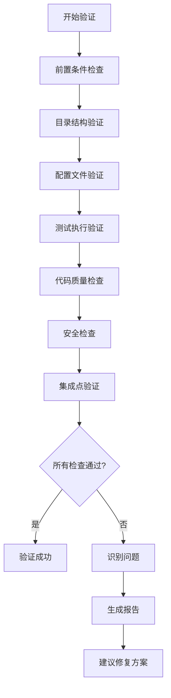
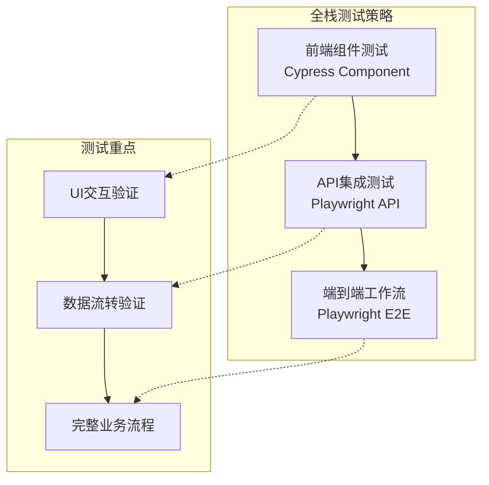

# 测试框架搭建

<cite>
**本文档引用的文件**
- [test-levels-framework.md](file://src/modules/bmm/testarch/knowledge/test-levels-framework.md)
- [workflow.yaml](file://src/modules/bmm/workflows/testarch/framework/workflow.yaml)
- [instructions.md](file://src/modules/bmm/workflows/testarch/framework/instructions.md)
- [checklist.md](file://src/modules/bmm/workflows/testarch/framework/checklist.md)
- [playwright-config.md](file://src/modules/bmm/testarch/knowledge/playwright-config.md)
- [network-first.md](file://src/modules/bmm/testarch/knowledge/network-first.md)
- [fixture-architecture.md](file://src/modules/bmm/testarch/knowledge/fixture-architecture.md)
- [data-factories.md](file://src/modules/bmm/testarch/knowledge/data-factories.md)
- [ci/workflow.yaml](file://src/modules/bmm/workflows/testarch/ci/workflow.yaml)
- [test-agent-schema.js](file://test/test-agent-schema.js)
- [unit-test-schema.js](file://test/unit-test-schema.js)
- [package.json](file://package.json)
</cite>

## 目录
1. [概述](#概述)
2. [测试框架架构](#测试框架架构)
3. [工作流自动化](#工作流自动化)
4. [分层测试策略](#分层测试策略)
5. [框架初始化](#框架初始化)
6. [配置生成](#配置生成)
7. [质量保证要点](#质量保证要点)
8. [实际项目配置示例](#实际项目配置示例)
9. [故障排除指南](#故障排除指南)
10. [总结](#总结)

## 概述

BMAD测试架构（Test Architect）是一个完整的测试框架搭建系统，旨在自动化建立生产就绪的测试基础设施。该框架通过workflow.yaml定义的工作流，结合checklist.md的质量检查清单，确保测试环境的可靠性和一致性。

### 核心特性

- **自动化框架初始化**：自动检测项目类型并选择合适的测试框架
- **多层测试支持**：支持单元测试、集成测试和端到端测试
- **智能框架选择**：基于项目规模和需求自动选择Playwright或Cypress
- **标准化配置**：提供一致的超时设置、报告格式和环境配置
- **质量保证机制**：完整的验证清单确保框架正确搭建

## 测试框架架构

### 整体架构图



**架构图来源**
- [test-levels-framework.md](file://src/modules/bmm/testarch/knowledge/test-levels-framework.md#L1-L100)
- [workflow.yaml](file://src/modules/bmm/workflows/testarch/framework/workflow.yaml#L1-L50)

### 架构设计原则

1. **分层测试金字塔**：从快速的单元测试到慢速的端到端测试形成金字塔结构
2. **单一职责**：每个测试层级专注于特定类型的验证
3. **可维护性**：清晰的目录结构和命名约定
4. **可扩展性**：支持多种测试框架和工具链

**章节来源**
- [test-levels-framework.md](file://src/modules/bmm/testarch/knowledge/test-levels-framework.md#L1-L200)

## 工作流自动化

### workflow.yaml核心配置

框架初始化工作流通过精心设计的配置实现自动化：



**流程图来源**
- [workflow.yaml](file://src/modules/bmm/workflows/testarch/framework/workflow.yaml#L1-L50)
- [instructions.md](file://src/modules/bmm/workflows/testarch/framework/instructions.md#L25-L50)

### 自动化检测逻辑

工作流包含智能的项目检测和框架选择机制：

| 检测因素 | Playwright推荐 | Cypress推荐 | 默认选择 |
|---------|---------------|------------|----------|
| 项目规模 | 100+文件 | 小于100文件 | Playwright |
| 性能要求 | 高性能需求 | 开发体验优先 | Playwright |
| 多浏览器 | 需要 | 不需要 | Playwright |
| 组件测试 | 较少需求 | 重点关注 | Cypress |
| 并行执行 | 支持worker | 不支持 | Playwright |

**章节来源**
- [instructions.md](file://src/modules/bmm/workflows/testarch/framework/instructions.md#L50-L100)

## 分层测试策略

### 测试金字塔结构

根据项目需求，测试框架采用分层的测试策略：



**图表来源**
- [test-levels-framework.md](file://src/modules/bmm/testarch/knowledge/test-levels-framework.md#L8-L150)

### 各层测试适用场景

#### 单元测试（Unit Tests）
- **适用场景**：纯函数、业务逻辑、算法验证
- **执行速度**：毫秒级响应
- **依赖隔离**：无外部依赖
- **典型示例**：价格计算器、数据验证器

#### 集成测试（Integration Tests）
- **适用场景**：数据库操作、API调用、服务间通信
- **执行速度**：秒级响应
- **环境要求**：测试数据库、容器化服务
- **典型示例**：用户注册流程、订单处理

#### 端到端测试（E2E Tests）
- **适用场景**：关键用户路径、跨系统工作流
- **执行速度**：数秒到数十秒
- **环境要求**：完整应用环境
- **典型示例**：购物车结算、管理员后台

**章节来源**
- [test-levels-framework.md](file://src/modules/bmm/testarch/knowledge/test-levels-framework.md#L150-L300)

## 框架初始化

### 目录结构生成

框架初始化会创建标准化的目录结构：

```
tests/
├── e2e/                    # 端到端测试文件
├── integration/            # 集成测试文件  
├── component/              # 组件测试文件
├── api/                    # API测试文件
├── support/                # 测试基础设施
│   ├── fixtures/           # 测试夹具
│   │   ├── factories/      # 数据工厂
│   │   └── helpers/        # 辅助函数
│   ├── page-objects/       # 页面对象模型
│   └── utils/              # 工具函数
└── README.md               # 测试套件文档
```

### 配置文件模板

#### Playwright配置示例

```typescript
// playwright.config.ts
import { defineConfig, devices } from '@playwright/test';

export default defineConfig({
  testDir: './tests/e2e',
  fullyParallel: true,
  forbidOnly: !!process.env.CI,
  retries: process.env.CI ? 2 : 0,
  workers: process.env.CI ? 1 : undefined,
  
  timeout: 60 * 1000,
  expect: {
    timeout: 15 * 1000,
  },
  
  use: {
    baseURL: process.env.BASE_URL || 'http://localhost:3000',
    trace: 'retain-on-failure',
    screenshot: 'only-on-failure',
    video: 'retain-on-failure',
    actionTimeout: 15 * 1000,
    navigationTimeout: 30 * 1000,
  },
  
  reporter: [
    ['html', { outputFolder: 'test-results/html' }],
    ['junit', { outputFile: 'test-results/junit.xml' }],
    ['list']
  ],
  
  projects: [
    { name: 'chromium', use: { ...devices['Desktop Chrome'] } },
    { name: 'firefox', use: { ...devices['Desktop Firefox'] } },
    { name: 'webkit', use: { ...devices['Desktop Safari'] } },
  ],
});
```

**配置来源**
- [instructions.md](file://src/modules/bmm/workflows/testarch/framework/instructions.md#L90-L130)

#### 环境配置模板

```bash
# .env.example
TEST_ENV=local
BASE_URL=http://localhost:3000
API_URL=http://localhost:3001/api

# 认证配置
TEST_USER_EMAIL=test@example.com
TEST_USER_PASSWORD=

# 功能标志
FEATURE_FLAG_NEW_UI=true

# API密钥
TEST_API_KEY=
```

**章节来源**
- [instructions.md](file://src/modules/bmm/workflows/testarch/framework/instructions.md#L150-L200)

## 配置生成

### 环境配置管理

框架提供统一的环境配置管理机制：



**序列图来源**
- [playwright-config.md](file://src/modules/bmm/testarch/knowledge/playwright-config.md#L1-L100)

### 超时标准配置

框架采用标准化的超时设置：

| 超时类型 | 标准值 | 用途 | 可覆盖 |
|---------|--------|------|--------|
| 测试总超时 | 60秒 | 整个测试运行时间 | 是 |
| 操作超时 | 15秒 | 点击、填写等操作 | 是 |
| 导航超时 | 30秒 | 页面跳转、刷新 | 是 |
| 断言超时 | 10秒 | 所有断言等待 | 否 |

**章节来源**
- [playwright-config.md](file://src/modules/bmm/testarch/knowledge/playwright-config.md#L140-L200)

## 质量保证要点

### 验证清单详解

框架提供了完整的验证清单，确保测试基础设施的质量：



**流程图来源**
- [checklist.md](file://src/modules/bmm/workflows/testarch/framework/checklist.md#L1-L100)

### 关键质量指标

#### 代码质量标准
- **类型安全**：使用TypeScript确保类型完整性
- **无未使用导入**：清理冗余的import语句
- **一致的格式化**：遵循项目编码规范
- **无Linter错误**：生成的代码无语法问题

#### 最佳实践合规性
- **Fixture架构**：遵循纯函数→Fixture→mergeTests模式
- **数据工厂**：实现自动清理机制
- **网络拦截**：采用网络优先测试防护
- **选择器策略**：使用data-testid策略

#### 安全检查要点
- **无硬编码凭据**：敏感信息使用环境变量
- **.env.example占位符**：不包含真实值
- **API密钥管理**：通过环境变量传递
- **版本控制安全**：避免提交敏感信息

**章节来源**
- [checklist.md](file://src/modules/bmm/workflows/testarch/framework/checklist.md#L160-L250)

## 实际项目配置示例

### 前端Web应用配置

对于React/Vue前端应用，框架推荐使用Playwright：

```typescript
// tests/support/fixtures/index.ts
import { test as base } from '@playwright/test';
import { UserFactory } from './factories/user-factory';

type TestFixtures = {
  userFactory: UserFactory;
};

export const test = base.extend<TestFixtures>({
  userFactory: async ({}, use) => {
    const factory = new UserFactory();
    await use(factory);
    await factory.cleanup();
  },
});

export { expect } from '@playwright/test';
```

**示例来源**
- [instructions.md](file://src/modules/bmm/workflows/testarch/framework/instructions.md#L190-L220)

### 后端API配置

对于Node.js后端服务，重点放在集成测试：

```typescript
// tests/integration/user-service.spec.ts
import { test, expect } from '@playwright/test';
import { createUser } from '../test-utils/factories';

test.describe('UserService Integration', () => {
  test('should create user with admin role', async ({ request }) => {
    const userData = createUser({ role: 'admin' });
    
    const response = await request.post('/api/users', {
      data: userData,
    });
    
    expect(response.status()).toBe(201);
    
    const createdUser = await response.json();
    expect(createdUser.role).toBe('admin');
    expect(createdUser.permissions).toContain('user:delete');
  });
});
```

**示例来源**
- [test-levels-framework.md](file://src/modules/bmm/testarch/knowledge/test-levels-framework.md#L210-L280)

### 全栈应用配置

对于全栈应用，采用混合测试策略：



**图表来源**
- [test-levels-framework.md](file://src/modules/bmm/testarch/knowledge/test-levels-framework.md#L280-L350)

## 故障排除指南

### 常见问题及解决方案

#### 配置文件错误
**问题**：TypeScript配置文件有编译错误
**解决方案**：确保安装了`@playwright/test`或`cypress`类型定义

#### 样本测试失败
**问题**：测试无法运行，BASE_URL配置错误
**解决方案**：检查.env文件中的BASE_URL，确保应用正在运行

#### Fixture清理失败
**问题**：测试结束后数据未清理
**解决方案**：验证cleanup()方法是否在fixture teardown中被调用

#### 网络拦截失效
**问题**：页面导航后路由拦截未生效
**解决方案**：确保路由设置发生在page.goto()之前

**章节来源**
- [checklist.md](file://src/modules/bmm/workflows/testarch/framework/checklist.md#L270-L320)

### 框架特定考虑

#### Playwright注意事项
- 需要Node.js 18+
- 浏览器二进制文件首次运行时自动安装
- 调试追踪需要运行`npx playwright show-trace`

#### Cypress注意事项
- 需要Node.js 18+
- 首次运行时会打开Cypress应用程序
- 组件测试需要额外设置

**章节来源**
- [checklist.md](file://src/modules/bmm/workflows/testarch/framework/checklist.md#L290-L320)

## 总结

BMAD测试架构提供了一个完整、自动化且高质量的测试框架搭建解决方案。通过workflow.yaml定义的工作流，结合checklist.md的质量检查清单，确保测试基础设施的可靠性。

### 主要优势

1. **自动化程度高**：从项目检测到框架初始化完全自动化
2. **智能框架选择**：基于项目特征自动选择最适合的测试框架
3. **标准化配置**：提供一致的超时设置、报告格式和环境配置
4. **质量保证机制**：完整的验证清单确保框架正确搭建
5. **可扩展性强**：支持多种测试场景和工具链组合

### 最佳实践建议

- **早期介入**：在项目初期就启动测试框架搭建
- **持续改进**：定期审查和优化测试策略
- **团队培训**：确保团队成员熟悉测试框架的最佳实践
- **监控反馈**：关注测试执行时间和覆盖率指标

通过遵循本文档的指导，开发团队可以快速建立起适合项目的测试基础设施，为高质量软件交付奠定坚实基础。