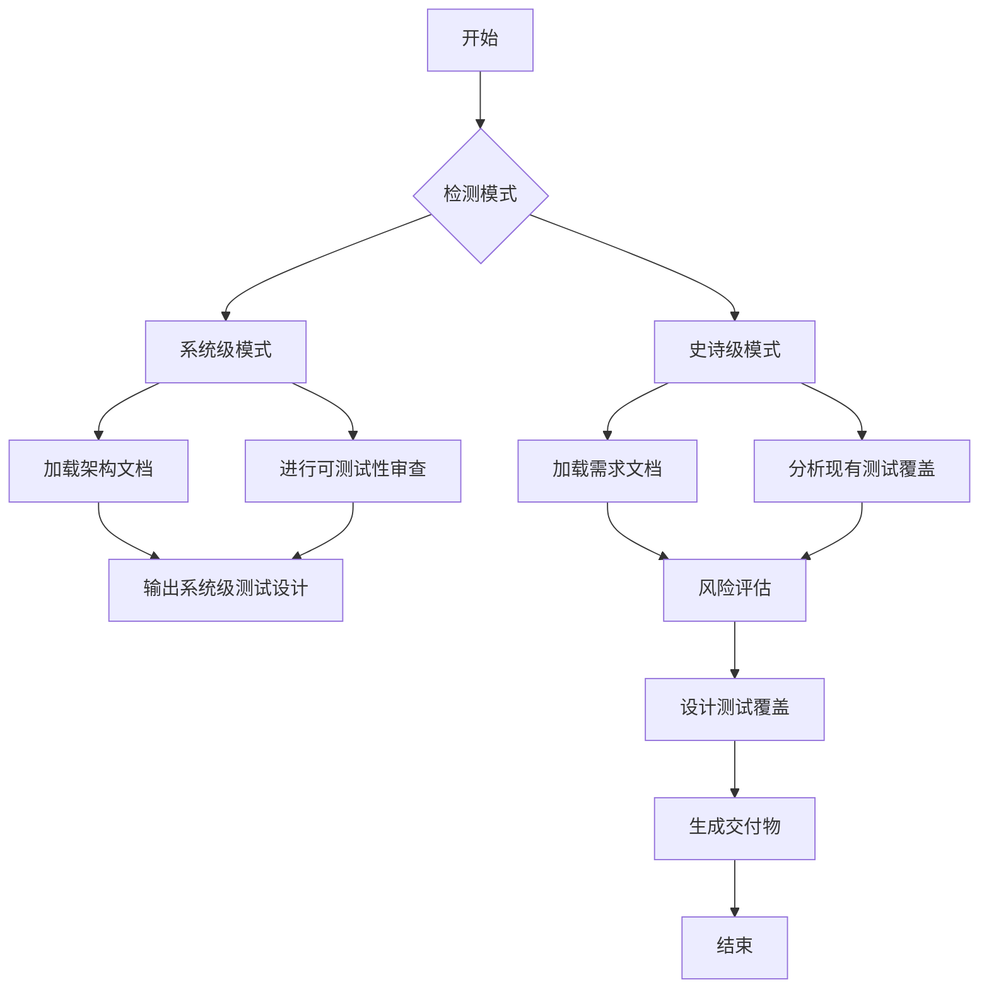
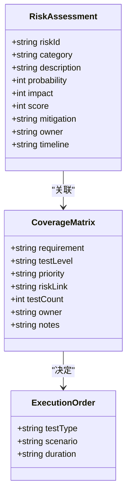
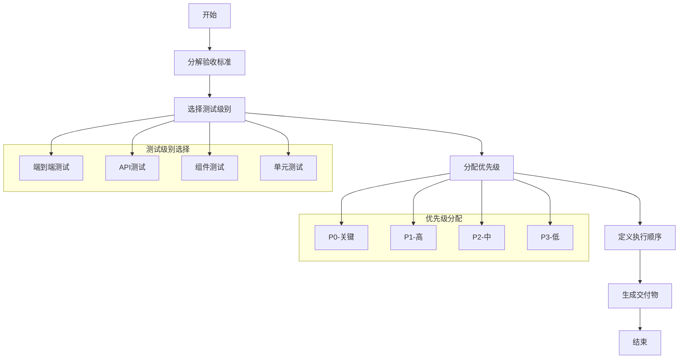
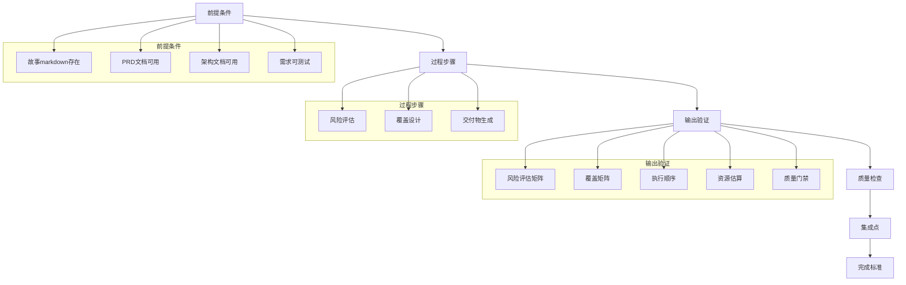
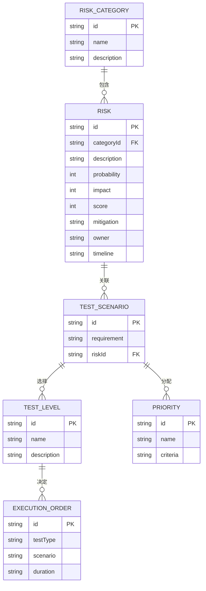
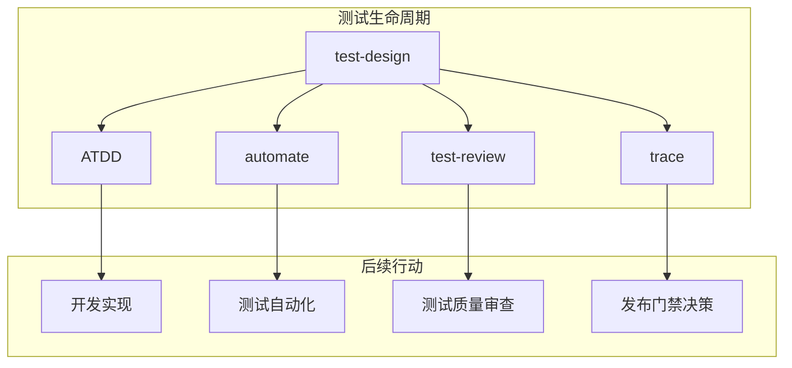
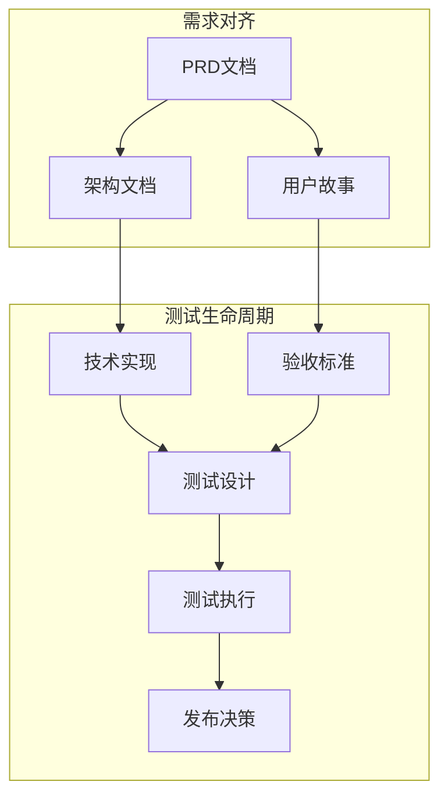

# 测试用例设计

<cite>
**本文档引用的文件**  
- [workflow.yaml](file://src/modules/bmm/workflows/testarch/test-design/workflow.yaml)
- [instructions.md](file://src/modules/bmm/workflows/testarch/test-design/instructions.md)
- [checklist.md](file://src/modules/bmm/workflows/testarch/test-design/checklist.md)
- [test-design-template.md](file://src/modules/bmm/workflows/testarch/test-design/test-design-template.md)
- [test-levels-framework.md](file://src/modules/bmm/testarch/knowledge/test-levels-framework.md)
- [test-priorities-matrix.md](file://src/modules/bmm/testarch/knowledge/test-priorities-matrix.md)
- [risk-governance.md](file://src/modules/bmm/testarch/knowledge/risk-governance.md)
- [probability-impact.md](file://src/modules/bmm/testarch/knowledge/probability-impact.md)
- [selective-testing.md](file://src/modules/bmm/testarch/knowledge/selective-testing.md)
- [trace-template.md](file://src/modules/bmm/workflows/testarch/trace/trace-template.md)
- [implementation-readiness/checklist.md](file://src/modules/bmm/workflows/3-solutioning/implementation-readiness/checklist.md)
- [test-architecture.md](file://src/modules/bmm/docs/test-architecture.md)
</cite>

## 目录
1. [引言](#引言)
2. [工作流解析](#工作流解析)
3. [测试场景建模](#测试场景建模)
4. [测试用例编写流程](#测试用例编写流程)
5. [高质量测试用例标准](#高质量测试用例标准)
6. [测试设计技术应用](#测试设计技术应用)
7. [实际应用案例](#实际应用案例)
8. [与PRD和用户故事对齐](#与prd和用户故事对齐)
9. [结论](#结论)

## 引言

测试用例设计是确保软件质量的关键环节。本文档详细阐述了test-design工作流如何系统化地指导测试用例的生成过程。通过分析workflow.yaml中定义的各个步骤，结合test-design-template.md提供的实际模板使用示例，展示如何填充测试用例字段。同时，利用checklist.md中的关键检查项说明高质量测试用例的标准，并通过instructions.md中的指导原则，阐述边界值分析、等价类划分等测试设计技术的应用方法。

**Section sources**
- [test-architecture.md](file://src/modules/bmm/docs/test-architecture.md#L245-L301)

## 工作流解析

test-design工作流是一个双模式工作流，能够根据项目阶段自动检测运行模式：
- **系统级模式（第3阶段）**：在解决方案阶段前进行架构的可测试性审查
- **史诗级模式（第4阶段）**：在实施阶段进行史诗级测试规划

工作流通过检查`bmm-sprint-status.yaml`文件的存在与否来确定运行模式。如果该文件存在，则进入史诗级模式；否则检查`bmm-workflow-status.yaml`文件以确定是否需要系统级测试。

**Diagram sources**
- [workflow.yaml](file://src/modules/bmm/workflows/testarch/test-design/workflow.yaml#L1-L29)
- [instructions.md](file://src/modules/bmm/workflows/testarch/test-design/instructions.md#L21-L52)

## 测试场景建模

测试场景建模是测试用例设计的核心环节。工作流首先加载上下文信息，包括PRD文档、史诗文档和故事markdown文件中的验收标准。然后分析现有测试覆盖情况，识别覆盖缺口，并加载知识库片段。

在风险评估阶段，工作流识别真实风险而非仅仅是功能特性，将风险分类为六个标准类别：
- **TECH**（技术/架构）：架构缺陷、集成失败、可扩展性问题
- **SEC**（安全）：缺少访问控制、认证绕过、数据暴露
- **PERF**（性能）：SLA违规、响应时间退化、资源耗尽
- **DATA**（数据完整性）：数据丢失、数据损坏、状态不一致
- **BUS**（业务影响）：用户体验退化、业务逻辑错误、收入影响
- **OPS**（运维）：部署失败、配置错误、监控缺口

**Diagram sources**
- [instructions.md](file://src/modules/bmm/workflows/testarch/test-design/instructions.md#L342-L440)
- [checklist.md](file://src/modules/bmm/workflows/testarch/test-design/checklist.md#L21-L33)

## 测试用例编写流程

测试用例编写流程遵循严格的步骤，确保测试设计的完整性和质量。首先将每个验收标准分解为原子测试场景，然后选择适当的测试级别，分配优先级，并定义执行顺序。

### 测试级别选择

根据`test-levels-framework.md`中的指导原则，选择适当的测试级别：

| 测试级别 | 适用场景 | 特点 |
|--------|--------|-----|
| **E2E**（端到端） | 关键用户旅程、跨系统工作流 | 执行慢，最真实但最脆弱 |
| **API**（集成） | 服务合同、业务逻辑验证 | 执行速度快，稳定性好 |
| **组件** | UI组件行为、交互测试 | 执行快，隔离性好 |
| **单元** | 业务逻辑、边缘情况 | 执行最快，最细粒度 |

### 优先级分配

根据`test-priorities-matrix.md`中的标准分配优先级：

- **P0（关键）**：阻塞核心用户旅程、高风险区域（评分≥6）、影响收入、安全关键
- **P1（高）**：重要用户功能、中等风险区域（评分3-4）、常见工作流
- **P2（中）**：次要功能、低风险区域（评分1-2）、边缘情况
- **P3（低）**：锦上添花、探索性、性能基准

**Diagram sources**
- [test-levels-framework.md](file://src/modules/bmm/testarch/knowledge/test-levels-framework.md#L7-L133)
- [test-priorities-matrix.md](file://src/modules/bmm/testarch/knowledge/test-priorities-matrix.md)
- [instructions.md](file://src/modules/bmm/workflows/testarch/test-design/instructions.md#L442-L530)

**Section sources**
- [instructions.md](file://src/modules/bmm/workflows/testarch/test-design/instructions.md#L442-L530)
- [test-levels-framework.md](file://src/modules/bmm/testarch/knowledge/test-levels-framework.md)
- [test-priorities-matrix.md](file://src/modules/bmm/testarch/knowledge/test-priorities-matrix.md)

## 高质量测试用例标准

高质量测试用例的标准由checklist.md中的关键检查项定义。这些标准确保测试设计的完整性和质量。

### 验证清单

#### 前提条件
- [ ] 存在带有清晰验收标准的故事markdown
- [ ] PRD或史诗文档可用
- [ ] 架构文档可用（可选）
- [ ] 需求可测试且无歧义

#### 过程步骤
- [ ] 风险评估矩阵创建
- [ ] 覆盖矩阵创建
- [ ] 执行顺序记录
- [ ] 资源估算计算
- [ ] 质量门禁标准定义
- [ ] 输出文件写入正确位置
- [ ] 输出文件使用模板结构

#### 输出验证
- [ ] 所有风险都有唯一ID
- [ ] 每个风险都有类别分配
- [ ] 概率值为1、2或3
- [ ] 影响值为1、2或3
- [ ] 分数正确计算（P×I）
- [ ] 高优先级风险（≥6）明确标记
- [ ] 缓解策略具体且可操作

**Diagram sources**
- [checklist.md](file://src/modules/bmm/workflows/testarch/test-design/checklist.md#L3-L169)
- [instructions.md](file://src/modules/bmm/workflows/testarch/test-design/instructions.md#L774-L788)

**Section sources**
- [checklist.md](file://src/modules/bmm/workflows/testarch/test-design/checklist.md)
- [instructions.md](file://src/modules/bmm/workflows/testarch/test-design/instructions.md#L774-L788)

## 测试设计技术应用

测试设计技术的应用方法在instructions.md中有详细说明。这些技术包括边界值分析、等价类划分等，用于确保测试用例的全面性和有效性。

### 风险评分方法

风险评分采用**概率×影响**矩阵（1-9分）来优先测试工作。较高的分数（6-9）需要立即采取行动；较低的分数（1-3）只需记录。

#### 概率评分
- **1（不太可能）**：＜10%的可能性，边缘情况
- **2（可能）**：10-50%的可能性，已知场景
- **3（很可能）**：＞50%的可能性，常见情况

#### 影响评分
- **1（轻微）**：外观问题，有变通方法，影响少数用户
- **2（降级）**：功能受损，变通方法困难，影响许多用户
- **3（关键）**：系统故障，数据丢失，无变通方法，阻塞使用

### 知识库集成

工作流集成了多个知识库片段，包括：
- `risk-governance.md` - 风险分类框架
- `probability-impact.md` - 风险评分方法
- `test-levels-framework.md` - 测试级别选择指导
- `test-priorities-matrix.md` - P0-P3优先级标准

**Diagram sources**
- [probability-impact.md](file://src/modules/bmm/testarch/knowledge/probability-impact.md#L1-L26)
- [risk-governance.md](file://src/modules/bmm/testarch/knowledge/risk-governance.md)
- [test-levels-framework.md](file://src/modules/bmm/testarch/knowledge/test-levels-framework.md)
- [test-priorities-matrix.md](file://src/modules/bmm/testarch/knowledge/test-priorities-matrix.md)

**Section sources**
- [probability-impact.md](file://src/modules/bmm/testarch/knowledge/probability-impact.md)
- [risk-governance.md](file://src/modules/bmm/testarch/knowledge/risk-governance.md)
- [test-levels-framework.md](file://src/modules/bmm/testarch/knowledge/test-levels-framework.md)
- [test-priorities-matrix.md](file://src/modules/bmm/testarch/knowledge/test-priorities-matrix.md)

## 实际应用案例

在实际应用中，test-design工作流与其他工作流紧密集成，形成完整的测试生命周期管理。

### 与ATDD工作流集成

test-design工作流生成的P0场景可以直接用于ATDD工作流，生成失败的验收测试。这确保了测试驱动开发的实施，开发人员可以根据这些失败的测试进行实现。

### 与自动化工作流集成

完整的覆盖计划可以用于自动化工作流，确保所有测试场景都被自动化。同时，风险评估结果可以用于测试审查工作流，重点关注高风险区域的测试质量问题。

### 与跟踪工作流集成

生成的测试设计文档可以用于跟踪工作流，验证需求到测试的可追溯性。这确保了测试覆盖的完整性，并为发布门禁提供决策依据。

**Diagram sources**
- [test-architecture.md](file://src/modules/bmm/docs/test-architecture.md#L245-L301)
- [trace/instructions.md](file://src/modules/bmm/workflows/testarch/trace/instructions.md#L1026-L1041)

**Section sources**
- [test-architecture.md](file://src/modules/bmm/docs/test-architecture.md#L245-L301)
- [trace/instructions.md](file://src/modules/bmm/workflows/testarch/trace/instructions.md#L1026-L1041)

## 与PRD和用户故事对齐

确保测试覆盖完整性的一个关键环节是与PRD和用户故事的对齐。这通过implementation-readiness工作流中的对齐检查来实现。

### PRD到架构对齐

- [ ] PRD中的每个功能需求都有架构支持文档
- [ ] PRD中的所有非功能需求都在架构中得到解决
- [ ] 架构不引入超出PRD范围的功能
- [ ] PRD中的性能要求与架构能力匹配
- [ ] PRD中的安全要求在架构中得到充分解决

### PRD到故事覆盖

- [ ] PRD中的每个需求都映射到至少一个故事
- [ ] PRD中的所有用户旅程都有完整的故事覆盖
- [ ] 故事验收标准与PRD成功标准一致
- [ ] 故事中的优先级与PRD功能优先级匹配
- [ ] 没有无PRD需求可追溯性的故事

**Diagram sources**
- [implementation-readiness/checklist.md](file://src/modules/bmm/workflows/3-solutioning/implementation-readiness/checklist.md#L23-L42)
- [create-epics-and-stories/instructions.md](file://src/modules/bmm/workflows/3-solutioning/create-epics-and-stories/instructions.md#L55-L240)

**Section sources**
- [implementation-readiness/checklist.md](file://src/modules/bmm/workflows/3-solutioning/implementation-readiness/checklist.md#L23-L42)
- [create-epics-and-stories/instructions.md](file://src/modules/bmm/workflows/3-solutioning/create-epics-and-stories/instructions.md#L55-L240)

## 结论

test-design工作流提供了一个系统化的方法来指导测试用例的生成。通过自动检测模式、加载上下文、评估和分类风险、设计测试覆盖以及生成交付物，该工作流确保了测试设计的完整性和质量。结合test-design-template.md提供的模板和checklist.md中的验证清单，团队可以创建高质量的测试用例，确保测试覆盖的完整性。通过与PRD和用户故事的对齐，以及与其他工作流的集成，形成了一个完整的测试生命周期管理流程，为软件质量提供了有力保障。